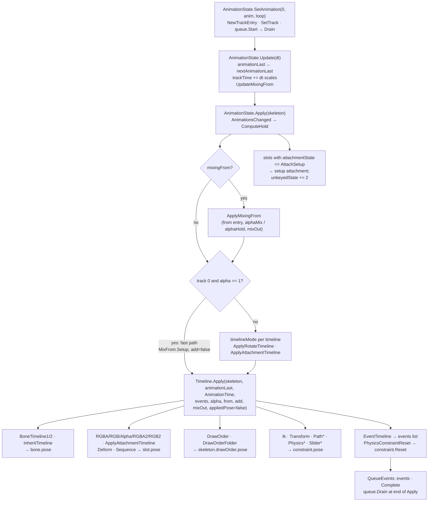

# Spine 4.3 animation application: clean-room specification

This spec describes how stock Spine 4.3 turns loaded animation data into pose changes on a skeleton. It covers every 4.3 timeline type's `Apply`, the shared curve sampling and mixing formulas, `Animation.Apply`, and the single-track `AnimationState` flow (`SetAnimation` → `Update` → `Apply`) that spine-unity drives every frame. The reference is spine-csharp **4.3.40**, vendored in `Packages/com.esotericsoftware.spine.spine-csharp` at upstream `4.3` commit `7ce5d0da`. The local changes there are `var` clean-up only and change no behaviour. The 4.3 API differs from 4.2: `MixBlend`/`MixDirection` are gone. `Timeline.Apply` now takes a `MixFrom` enum and three booleans (`add`, `mixOut`, `appliedPose`). No reference source is reproduced. The tables, prose and pseudocode are written from scratch. The goal is bit-exact parity, so every formula gives its float operation order. Loading, including the Bezier bake, is in [Format-Json-Atlas.md](Format-Json-Atlas.md) §11–12 and [Format-Binary.md](Format-Binary.md). World transforms and mesh output are in [Pose-and-Mesh.md](Pose-and-Mesh.md).



`Animation.Apply` (§4) is a separate, simpler entry point that loops the time and calls every `Timeline.Apply` in order. `AnimationState` does **not** call it. It iterates the timelines itself (§5).

---

## Contents

1. [Conventions and scope](#1-conventions-and-scope)
2. [Shared machinery: frames, search, curves, combiners](#2-shared-machinery-frames-search-curves-combiners)
3. [Timeline reference (A)](#3-timeline-reference-a)
4. [Animation.Apply (C)](#4-animationapply-c)
5. [AnimationState, single animation on track 0 (B)](#5-animationstate-single-animation-on-track-0-b)
6. [Property IDs](#6-property-ids)
7. [Parity traps](#7-parity-traps)
8. [Ambiguities / verified only by reading](#8-ambiguities--verified-only-by-reading)

---

## 1. Conventions and scope

### 1.1 Numerics

The numeric rules are the same as [Pose-and-Mesh.md](Pose-and-Mesh.md) §1. Every value is float32, every `+ − × ÷` is rounded to float32, evaluation is left to right exactly as parenthesised here, and there is no FMA contraction. Formulas in this spec are fully parenthesised wherever the order matters. `%` on floats is the C# remainder, which is exact truncated `fmod` with the sign of the dividend, so `-1 % 5 = -1`. `(int)x` on a float truncates toward zero. `sign(x)` is `System.Math.Sign` on a float: it returns the **integer** −1, 0 or +1, returns 0 for both +0 and −0, and **throws** for NaN. `abs` is the float absolute value. `int × float` converts the integer to float first.

### 1.2 The `Timeline.Apply` parameter set (4.3)

| Parameter | Type | Meaning |
|---|---|---|
| `skeleton` | Skeleton | Source of bones, slots, constraints, draw order, skin lookup. |
| `lastTime` | float | The previous time this timeline was applied. Only Event and PhysicsConstraintReset read it. `-1` on the first apply. |
| `time` | float | The time to pose. It is already looped by the caller. |
| `events` | list or null | Event timelines append fired events here. Null means no events are fired. |
| `alpha` | float | 0 = keep the base value, 1 = the timeline value. |
| `from` | `MixFrom` | `Current = 0`, `Setup = 1`, `First = 2`. It picks the base value (setup or current) and the before-first-key behaviour (table below). |
| `add` | bool | Add the timeline value to the base instead of replacing it. Only some timelines implement it (§3.1 table). |
| `mixOut` | bool | The animation is mixing out. Instant timelines (attachment, draw order, inherit, sequence) and scale/IK read it. |
| `appliedPose` | bool | true writes `X.appliedPose`, false writes `X.pose`. `AnimationState` **always passes false**. |

| `from` | Base value for mixing | Before the first key |
|---|---|---|
| `Setup` | The setup value | Set the property to setup, **ignoring alpha** |
| `First` | The current value | Move the current value toward setup: `cur + (setup − cur) × alpha` |
| `Current` | The current value | Leave the property unchanged |

### 1.3 Which pose a timeline writes

Each bone, slot and constraint has three poses: `data.setupPose` (shared and read-only), `pose` (unconstrained, written by animation and by user code) and `appliedPose`. `appliedPose` normally **is** `pose` (the same object). When a constraint targets the object, `Skeleton.UpdateCache` points `appliedPose` at a separate `constrainedPose`, and every `Skeleton.UpdateWorldTransform` begins by copying `pose` into it (`ResetConstrained`) before the constraints run. The draw order has the same pair: `drawOrder.pose` and `drawOrder.appliedPose`.

**Rule for a Burst port:** animation writes `pose`. Rendering and constraints read `appliedPose`, which is either the same storage or a copy of `pose` made at the start of `UpdateWorldTransform`. Two parts of `AnimationState` write `slot.pose` directly, whatever `appliedPose` says: `ApplyAttachmentTimeline` and the end-of-apply attachment reset. `ApplyRotateTimeline` likewise writes `bone.pose` directly.

### 1.4 Activity gates

| Target | Gate | Where `active` comes from |
|---|---|---|
| Bone | `bone.active` | `UpdateCache`: bones that don't require a skin, plus skin bones and their ancestors |
| Slot | `slot.bone.active` (the slot's own bone) | – |
| Constraint | `constraint.active` | `UpdateCache`: source active, and skin-required constraints present in the skin |
| Deform/Sequence | See §3.5: an attachment-match test over the primary slot plus `timelineSlots` | – |

An inactive target is skipped completely, with no write.

---

## 2. Shared machinery: frames, search, curves, combiners

### 2.1 Frame layout

`frames` is a flat float array with `ENTRIES` floats per key. Slot 0 of each key is the key time, and the following slots are values. Frame `k` starts at index `k × ENTRIES`.

| Timeline | ENTRIES | Value slots (after time) |
|---|---|---|
| Rotate, TranslateX/Y, ScaleX/Y, ShearX/Y, Alpha, PathPosition, PathSpacing, Physics*, Slider, SliderMix | 2 | value |
| Translate, Scale, Shear | 3 | x, y |
| Inherit | 2 | inherit enum as float |
| RGBA | 5 | r, g, b, a |
| RGB | 4 | r, g, b |
| RGBA2 | 8 | r, g, b, a, r2, g2, b2 |
| RGB2 | 7 | r, g, b, r2, g2, b2 |
| IkConstraint | 6 | mix, softness, bendDirection, compress (0/1), stretch (0/1) |
| TransformConstraint | 7 | mixRotate, mixX, mixY, mixScaleX, mixScaleY, mixShearY |
| PathConstraintMix | 4 | mixRotate, mixX, mixY |
| Sequence | 3 | `mode \| (index << 4)` as float, delay |
| Attachment, Deform, DrawOrder, DrawOrderFolder, Event, PhysicsReset | 1 | time only. The payload lives in side arrays indexed by frame (names, vertex arrays, orders, Event objects). |

### 2.2 Frame search

Keys are assumed sorted ascending. Nothing validates this.

```
search(frames, time, stride):            # stride = ENTRIES; stride 1 for the 1-entry timelines
    for i = stride; i < len(frames); i += stride:
        if frames[i] > time: return i - stride
    return len(frames) - stride
```

* The comparison is **strictly greater**. The result is the **last** key whose time is `<= time`, so a time exactly on a key selects that key, and among duplicate key times it selects the **last** duplicate.
* The caller must check `time < frames[0]` first. `search` never returns "before the first key".
* `CurveTimeline1.GetCurveValue` uses its own loop, but it is equivalent to `search(frames, time, 2)`.

### 2.3 Curve types (the `curves` array)

The bake is specified in [Format-Json-Atlas.md](Format-Json-Atlas.md) §12.2–12.3 and [Format-Binary.md](Format-Binary.md) §8.2. In summary: `curves[0 .. F−1]` holds each frame's type (`0` LINEAR, `1` STEPPED, `2 + b` BEZIER, where `b` is the start of that frame's first 18-float block). Channel `c` of a Bezier frame uses the block at `b + 18·c`. The block holds 9 `(x, y)` samples at u = 0.1 … 0.9. The **last frame's type is STEPPED from construction**. The type is read as `(int)curves[frame]`, where `frame = keyIndex = i / ENTRIES`.

### 2.4 Sampling one channel between key `i` and key `i + ENTRIES`

`i` is the index returned by `search`, `vo` the value slot, `F` = frames, `C` = curves.

**LINEAR**

```
t     = (time - F[i]) / (F[i+ENTRIES] - F[i])
value = F[i+vo] + (F[i+ENTRIES+vo] - F[i+vo]) * t
```

Single-channel timelines write this as `v + ((time − before) / (next − before)) × (nextV − v)`. Because float multiplication is commutative, the result is bit-identical, so one routine serves all.

**STEPPED**: `value = F[i+vo]`.

**BEZIER** (block start `b` = `type − 2 + 18·c`):

```
bezierValue(time, i, vo, b):
    if C[b] > time:                                   # before the first sample: strict >
        x0 = F[i];  y0 = F[i+vo]
        return y0 + ((time - x0) / (C[b] - x0)) * (C[b+1] - y0)
    for s = b+2; s < b+18; s += 2:
        if C[s] >= time:                              # note >= here
            x0 = C[s-2];  y0 = C[s-1]
            return y0 + ((time - x0) / (C[s] - x0)) * (C[s+1] - y0)
    x0 = C[b+16];  y0 = C[b+17]                       # after the last sample: lerp to the next key
    return y0 + ((time - x0) / (F[i+ENTRIES] - x0)) * (F[i+ENTRIES+vo] - y0)
```

The Deform timeline has a different percent curve with different operation order (§3.5.2).

### 2.5 Combiners for one-value timelines

These are the four helpers of `CurveTimeline1`. `v` is the sampled value, `cur` the pose value, `setup` the setup value. Each **first** tests `time < frames[0]` and returns `beforeFirst`.

**beforeFirst(from, alpha, cur, setup)**

| from | result |
|---|---|
| Setup (and any unknown value) | `setup` |
| First | `cur + (setup − cur) × alpha` |
| Current | `cur` |

**relative** (rotate, translateX/Y, shearX/Y):

| from | add | result |
|---|---|---|
| Setup | any | `setup + v × alpha` |
| Current/First | true | `cur + v × alpha` |
| Current/First | false | `cur + ((v + setup) − cur) × alpha` |

**absolute** (path position/spacing, physics, slider time/mix):

| from | add | result |
|---|---|---|
| Setup | true | `setup + v × alpha` |
| Setup | false | `setup + (v − setup) × alpha` |
| Current/First | true | `cur + v × alpha` |
| Current/First | false | `cur + (v − cur) × alpha` |

At alpha 1 with Setup and no add, this is `setup + (v − setup)`, which is **not always bit-equal to `v`**. There is no alpha-1 shortcut, so do not add one.

The physics "all constraints" timeline uses a variant of **absolute** that takes a precomputed `v` (§3.12).

**scale** (scaleX/Y, and per channel in Scale). The `mixOut` flag is used here:

```
if time < frames[0]: return beforeFirst(...)
v = sample(time) * setup                          # timeline stores a multiplier
if alpha == 1 and not add: return v               # shortcut: exact, ignores from
base = (from == Setup) ? setup : cur
if add:     return base + (v - setup) * alpha
if mixOut:  return base + (abs(v) * sign(base) - base) * alpha
base2 = abs(base) * sign(v)
return base2 + (v - base2) * alpha
```

`sign` returns 0 for ±0, so a zero base with `mixOut`, or a zero `v` without it, collapses to 0 (see §7).

---

## 3. Timeline reference (A)

### 3.1 Overview

| Timeline | Writes | Gate | Combiner | `additive` flag¹ | `instant` flag² | Reads `add` | Reads `mixOut` |
|---|---|---|---|---|---|---|---|
| Rotate | bone.rotation | bone active | relative | yes | – | yes | – |
| Translate | bone.x, y | bone active | relative (2 ch) | yes | – | yes | – |
| TranslateX / Y | bone.x / y | bone active | relative | yes | – | yes | – |
| Scale | bone.scaleX, scaleY | bone active | scale (2 ch) | yes | – | yes | yes |
| ScaleX / Y | bone.scaleX / Y | bone active | scale | yes | – | yes | yes |
| Shear | bone.shearX, shearY | bone active | relative (2 ch) | yes | – | yes | – |
| ShearX / Y | bone.shearX / Y | bone active | relative | yes | – | yes | – |
| Inherit | bone.inherit | bone active | stepped enum | – | yes | – | yes |
| RGBA | slot color r g b a | slot bone active | color | – | – | – | – |
| RGB | slot color r g b | slot bone active | color | – | – | – | – |
| Alpha | slot color a | slot bone active | color | – | – | – | – |
| RGBA2 | color r g b a, dark r g b | slot bone active | color | – | – | – | – |
| RGB2 | color r g b, dark r g b | slot bone active | color | – | – | – | – |
| Attachment | slot attachment | slot bone active | name lookup | – | yes | – | yes |
| Deform | slot deform | attachment match | vertex lerp | yes | – | yes | – |
| Sequence | slot sequenceIndex | attachment match | frame math | – | yes | – | yes |
| DrawOrder | drawOrder.pose | none | order array | – | yes | – | yes |
| DrawOrderFolder | a subset of drawOrder.pose | none | order array | – | yes | – | yes |
| Event | events list | none | range fire | – | yes | – | – |
| IkConstraint | mix, softness, bendDirection, compress, stretch | constraint active | lerp + stepped | – | – | – | yes |
| TransformConstraint | 6 mixes | constraint active | lerp / add | yes | – | yes | – |
| PathConstraintPosition | position | constraint active | absolute | yes | – | yes | – |
| PathConstraintSpacing | spacing | constraint active | absolute, add forced false | – | – | no | – |
| PathConstraintMix | mixRotate, mixX, mixY | constraint active | lerp / add | **no** | – | **yes** | – |
| Physics Inertia/Strength/Damping/Mass/Mix | that field | constraint active (+ global flag) | absolute | – | – | forced off | – |
| Physics Wind/Gravity | that field | same | absolute | yes | – | yes | – |
| PhysicsConstraintReset | constraint.Reset() | constraint active | range trigger | – | yes | – | – |
| Slider (time) | slider.time | constraint active | absolute | **no** | – | **yes** | – |
| SliderMix | slider.mix | constraint active | absolute | yes | – | yes | – |

¹ `additive` is a property of the timeline. `AnimationState.ComputeHold` reads it. Only the Physics timelines also check it inside `Apply` and turn `add` off when the flag is false. The others use whatever `add` they are passed, and `AnimationState` passes the entry's `additive` flag to every timeline (§7, trap 9).
² `instant`: the timeline is never "held" during mixing (§5.6).

### 3.2 Bone timelines

All of them read `bone = skeleton.bones[boneIndex]`, return if the bone is inactive, then write `pose = appliedPose ? bone.appliedPose : bone.pose` using `setup = bone.data.setupPose`.

**One-channel** (Rotate, TranslateX/Y, ShearX/Y): `pose.p = relative(time, alpha, from, add, pose.p, setup.p)`.
**ScaleX/Y**: `pose.p = scale(time, alpha, from, add, mixOut, pose.p, setup.p)`.

Rotate has **no** angle wrapping or shortest-path logic in the timeline. It is plain `setup + v × alpha`, and so on. Shortest-path mixing lives in `AnimationState.ApplyRotateTimeline` (§5.7) and is used only outside the fast path.

**Two-channel Translate / Shear.** They are written out inline, but the result equals the relative combiner per channel:

| Case | x (y is the same with the y fields) |
|---|---|
| `time < frames[0]`, Setup | `x = setup.x` |
| `time < frames[0]`, First | `x = x + (setup.x − x) × alpha` |
| `time < frames[0]`, Current | unchanged |
| Setup (tested **before** add) | `x = setup.x + sx × alpha` |
| add | `x = x + sx × alpha` |
| otherwise | `x = x + ((setup.x + sx) − x) × alpha` |

(`sx` is the sampled channel value. `setup + sx` and `sx + setup` are bit-identical.)

**Two-channel Scale.** The before-first branch is the same as Translate, using scaleX/scaleY. After it:

```
sx = sample_x * setup.scaleX;   sy = sample_y * setup.scaleY
if alpha == 1 and not add:  pose.scaleX = sx;  pose.scaleY = sy;  return
bx, by = (from == Setup) ? (setup.scaleX, setup.scaleY) : (pose.scaleX, pose.scaleY)
add:     scaleX = bx + (sx - setup.scaleX) * alpha
mixOut:  scaleX = bx + (abs(sx) * sign(bx) - bx) * alpha
else:    bx' = abs(bx) * sign(sx);  scaleX = bx' + (sx - bx') * alpha
```

(The y channel is the same.) Both base values are captured before either channel is written.

**Inherit** (instant):

| Condition | Result |
|---|---|
| mixOut | if `from != Current`: `inherit = setup.inherit`. Otherwise unchanged. |
| `time < frames[0]` | same as the mixOut row |
| otherwise | `inherit = enum[(int)frames[search(frames, time, 2) + 1]]` (stepped, no alpha) |

### 3.3 Slot colour timelines

Slot = `skeleton.slots[slotIndex]`. Return if `slot.bone` is inactive. The target is `pose` or `appliedPose`, and `setup = slot.data.setupPose`. Colours are four floats. The dark colour is optional. RGBA2 and RGB2 assume it is present (the dark colour is read unconditionally).

**Clamp.** `clamp(v) = v < 0 ? 0 : (v > 1 ? 1 : v)`. NaN passes through unchanged. It is applied **only after interpolation** (the keyed branch), never in the before-first-key branch.

**Before the first key:**

| Timeline | Setup | First | Current |
|---|---|---|---|
| RGBA | color = setup color (all 4) | each of r g b a: `c + (s − c) × alpha` | – |
| RGB | r g b = setup r g b (a untouched) | r g b lerp as above | – |
| Alpha | a = setup a | a lerp | – |
| RGBA2 | color = setup color. **dark = setup dark, the whole value including its alpha** | light r g b a lerp. Dark r g b lerp, dark a untouched | – |
| RGB2 | light r g b = setup, dark r g b = setup (both alphas untouched) | light r g b lerp, dark r g b lerp | – |

**After sampling** (`r, g, b, a, r2, g2, b2` sampled per §2.4, with channel `c` in curve block `c`, in the value-slot order of §2.1):

| Timeline | alpha == 1 | alpha != 1, from Setup | alpha != 1, from Current/First | Clamp |
|---|---|---|---|---|
| RGBA | color = (r,g,b,a) | `s.ch + (ch − s.ch) × alpha` per channel, from the setup colour | `c.ch + (ch − c.ch) × alpha` from the current colour | all 4 |
| RGB | r,g,b = sampled | as left, r g b | as left, r g b | r g b (a untouched) |
| Alpha | a = sampled | `s.a + (a − s.a) × alpha` | `c.a + (a − c.a) × alpha` | a |
| RGBA2 | light = (r,g,b,a), clamped. Dark = (r2,g2,b2, **alpha 1**) | light from setup (clamped). Dark from setup dark | light from the current colour (clamped). Dark from the current dark | light: all 4. Dark: r g b, and dark a is **set to 1** |
| RGB2 | light r g b = sampled, dark = (r2,g2,b2, **1**) | from the setup light and dark | from the current light and dark | light r g b (a kept). Dark r g b, dark a = 1 |

`from` is ignored at alpha 1. Note that RGBA/RGBA2 at alpha 1 take the sampled values **exactly**, with no `setup + (v − setup)` step.

### 3.4 Attachment timeline

Payload: `attachmentNames[frame]` (string, may be null). Gate: slot bone active.

```
if mixOut or time < frames[0]:
    if from != Current: setAttachment(slot.data.attachmentName)
else:
    setAttachment(attachmentNames[search(frames, time, 1)])

setAttachment(name):
    pose.attachment = (name == null) ? null : skeleton.GetAttachment(slotIndex, name)
```

* `GetAttachment` looks up the **current skin** first, then the **default skin**. If both miss, it returns null, which clears the attachment. Lookup is by (slot index, name) in the skin maps.
* Alpha is ignored. The timeline is stepped.
* `AnimationState` does not call this `Apply`. It uses its own `ApplyAttachmentTimeline` (§5.5), which is equivalent on the fast path.

**Setter side effects (`SlotPose.Attachment`).** These fire on every write, from timelines, the end-of-apply reset and `Slot.SetupPose`:

| Condition | Effect |
|---|---|
| New value is the **same object** (reference equality) | Nothing, not even the sequence index. |
| Changed, and old and new are both `VertexAttachment` with the same `timelineAttachment` | `attachment = new`, `sequenceIndex = −1`. **Deform is kept.** |
| Changed, any other case (including null ↔ something) | `deform.Clear()`, which **zero-fills the whole backing array** and sets count 0. Then `attachment = new`, `sequenceIndex = −1`. |

Because keys resolve through the skin every apply, re-keying the attachment the slot already shows is a no-op, and `sequenceIndex`/`deform` survive.

### 3.5 Deform timeline

Payload: `attachment` (the `VertexAttachment` the timeline was keyed on, which is the **timeline attachment**) and `vertices[frame]` (a float array per key). Unweighted meshes store absolute positions. Weighted meshes store offsets. See [Format-Json-Atlas.md](Format-Json-Atlas.md) §11.10.

#### 3.5.1 Which slots

`attachment.timelineSlots` is an int array of other slots that may carry attachments whose `timelineAttachment` is this attachment (linked meshes, shared deform). It is empty by default.

```
if not isTimelineActive(): return
    # true if the primary slot, or any timelineSlots slot, has an active bone AND
    # (pose or appliedPose per flag).attachment != null AND that attachment.timelineAttachment == this.attachment
if time < frames[0]:
    beforeFirst(primary slot);  beforeFirst(each timelineSlots slot);  return
if time >= frames[last]:  percent = 0; v1 = vertices[last]; v2 = none       # note >=
else: f = search(frames, time, 1); percent = curvePercent(time, f); v1 = vertices[f]; v2 = vertices[f+1]
vertexCount = len(vertices[0])                       # frame 0's length, for every frame
applyToSlot(primary slot, ...);  applyToSlot(each timelineSlots slot, ...)
```

`beforeFirst` and `applyToSlot` each re-check, per slot, that the bone is active and that `attachment != null && attachment.timelineAttachment == this.attachment`. They skip the slot otherwise. The **slot's current attachment** is the one cast to `VertexAttachment` for `bones` (weighted test) and `vertices` (setup). It may be a linked mesh that differs from `this.attachment`.

#### 3.5.2 Percent curve (differs from §2.4)

```
curvePercent(time, f):
    type = (int)C[f]
    LINEAR:  return (time - F[f]) / (F[f+1] - F[f])
    STEPPED: return 0
    b = type - 2
    if C[b] > time:  return (C[b+1] * (time - F[f])) / (C[b] - F[f])      # multiply FIRST, then divide
    for s = b+2; s < b+18; s += 2:
        if C[s] >= time: x0=C[s-2]; y0=C[s-1]; return y0 + ((time - x0) / (C[s] - x0)) * (C[s+1] - y0)
    x0 = C[b+16]; y0 = C[b+17]
    return y0 + ((1 - y0) * (time - x0)) / (F[f+1] - x0)                    # multiply first, then divide
```

The curve's y endpoints are implicitly 0 and 1. The deform bake itself uses the simplified y terms ([Format-Binary.md](Format-Binary.md) §8.2.3).

#### 3.5.3 Before the first key (per slot)

`d` = the slot pose's deform list.

| Condition | Action |
|---|---|
| `d.count == 0` | Treat `from` as Setup. |
| from Setup | `d.Clear()` (zero-fill, count 0) |
| from First, alpha == 1 | `d.Clear()` |
| from First, alpha < 1 | `d.Resize(vertexCount)`. Unweighted: `d[k] = d[k] + (setupVerts[k] − d[k]) × alpha`. Weighted: `a' = 1 − alpha`, then `d[k] = d[k] × a'` |
| from Current | nothing |

`Resize` grows the array (new tail = 0) or, when shrinking, zeroes the entries past the new size.

#### 3.5.4 Applying a key (per slot)

First: `if d.count == 0 then from = Setup`, and `fromSetup = (from == Setup)`. Then `d.EnsureSize(vertexCount)`. That sets the count, grows the backing array with zeros if needed, and **does not clear** existing entries. `S[k]` is the setup vertex, `W` means "weighted" (`attachment.bones != null`), and `lerp_k = v1[k] + (v2[k] − v1[k]) × percent`.

After the last key (`v2` absent):

| alpha | Mode | Unweighted | Weighted |
|---|---|---|---|
| 1 | add and not fromSetup | `d[k] = d[k] + (v1[k] − S[k])` | `d[k] = d[k] + v1[k]` |
| 1 | otherwise | copy `v1[0..vertexCount)` | copy |
| ≠1 | fromSetup | `d[k] = S[k] + (v1[k] − S[k]) × alpha` | `d[k] = v1[k] × alpha` |
| ≠1 | add | `d[k] = d[k] + (v1[k] − S[k]) × alpha` | `d[k] = d[k] + v1[k] × alpha` |
| ≠1 | otherwise | `d[k] = d[k] + (v1[k] − d[k]) × alpha` | same |

Between keys:

| alpha | Mode | Unweighted | Weighted |
|---|---|---|---|
| 1 | add and not fromSetup | `d[k] = d[k] + ((v1[k] + (v2[k] − v1[k]) × percent) − S[k])` | `d[k] = d[k] + lerp_k` |
| 1 | `percent == 0` | copy `v1` | copy `v1` |
| 1 | otherwise | `d[k] = lerp_k` | same |
| ≠1 | fromSetup | `d[k] = S[k] + (lerp_k − S[k]) × alpha` | `d[k] = lerp_k × alpha` |
| ≠1 | add | `d[k] = d[k] + (lerp_k − S[k]) × alpha` | `d[k] = d[k] + lerp_k × alpha` |
| ≠1 | otherwise | `d[k] = d[k] + (lerp_k − d[k]) × alpha` | same |

Precedence: the `add and not fromSetup` row is tested before `percent == 0`. On the fast path (`add = false`, alpha 1) a stepped curve gives percent 0 and therefore an exact copy.

**Consumption** ([Pose-and-Mesh.md](Pose-and-Mesh.md) §6.2): `ComputeWorldVertices` reads `slot.appliedPose.deform`. If its count is 0, the setup vertices are used. For an unweighted mesh, a non-empty deform **replaces** the vertex positions. For a weighted mesh, it adds `deform[2j], deform[2j+1]` to influence `j`'s local x, y (one pair per influence, in stored influence order).

### 3.6 Sequence timeline

Payload: `attachment` (the timeline attachment, which has a `Sequence`). Frame values: `modeAndIndex` and `delay`.

```
if not isTimelineActive(): return                  # same test as Deform
if mixOut or time < frames[0]:
    if from != Current: for primary and timelineSlots: if bone active and attachment matches: sequenceIndex = -1
    return
i = search(frames, time, 3); before = F[i]; mi = (int)F[i+1]; delay = F[i+2]
for primary and timelineSlots slots with active bone and matching attachment:
    index = mi >> 4
    mode  = mi & 0xF
    count = len(slot's CURRENT attachment's sequence.regions)
    if mode != Hold:
        index = index + (int)(((time - before) / delay) + 0.0001)      # float math, truncating cast
        mode Once:            index = min(count - 1, index)
        mode Loop:            index = index % count
        mode Pingpong:        n = 2*count - 2;  index = (n == 0) ? 0 : index % n;  if index >= count: index = n - index
        mode OnceReverse:     index = max(count - 1 - index, 0)
        mode LoopReverse:     index = count - 1 - (index % count)
        mode PingpongReverse: n = 2*count - 2;  index = (n == 0) ? 0 : (index + count - 1) % n;  if index >= count: index = n - index
    sequenceIndex = index                          # direct field write, no side effects
```

| Mode value | Name |
|---|---|
| 0 | Hold (no time advance, the keyed index is used as-is) |
| 1 | Once |
| 2 | Loop |
| 3 | Pingpong |
| 4 | OnceReverse |
| 5 | LoopReverse |
| 6 | PingpongReverse |

* `0.0001` is a float literal, added after the division.
* Hold does **not** clamp. `Sequence.ResolveIndex` clamps at render time: −1 → `setupIndex`, and `>= count` → `count − 1`.
* `count` comes from the slot's current attachment (it can be a linked mesh with its own sequence), not from the timeline's attachment.

### 3.7 Draw order timelines

**DrawOrder.** `P` = `drawOrder.pose` (or `appliedPose`), `setupSlots` = `skeleton.slots`, which is in slot-index order.

| Condition | Result |
|---|---|
| mixOut or `time < frames[0]` | If `from != Current`: `P[0..slotCount) = setupSlots[0..slotCount)`. Otherwise unchanged. |
| key order is null | `P = setupSlots` (copied) |
| key order `o` | `P[k] = setupSlots[o[k]]` for `k < len(o)` |

**DrawOrderFolder.** Payload: `slots` (the folder's slot indices, in setup order), `inFolder[slotIndex]` and per-key `order` arrays of **folder-local** indices (indices into `slots`, not skeleton slot indices).

```
fill(pickSlot):                              # walks the CURRENT P, replacing only folder members
    found = 0
    for k = 0 ..:                            # unbounded: relies on every folder slot being present in P
        if inFolder[P[k].data.index]:
            P[k] = setupSlots[pickSlot(found)]
            found += 1
            if found == len(slots): break

mixOut or time < frames[0]:  if from != Current: fill(found -> slots[found])
key order null:              fill(found -> slots[found])
key order o:                 fill(found -> slots[o[found]])
```

The folder keeps the draw-order **positions** its members currently occupy and re-deals its members into those positions. Non-members are never moved. Apply order matters: a DrawOrder timeline runs before the folder timelines (creation order, [Format-Json-Atlas.md](Format-Json-Atlas.md) §11.1).

### 3.8 Event timeline

Payload: `events[frame]`, the shared keyed `Event` objects. `frames[k] = event.time`. The timeline fires the keys with `lastTime < t_k <= time`.

```
apply(lastTime, time, out):
    if out is null: return
    if lastTime > time:                              # wrapped (looping)
        apply(lastTime, float(int.MaxValue), out)    # fire the tail after lastTime; float(2^31-1) = 2147483648
        lastTime = -1
    else if lastTime >= frames[last]:
        return                                       # nothing left after lastTime
    if time < frames[0]: return
    if lastTime < frames[0]: k = 0
    else:
        k = search(frames, lastTime, 1) + 1          # first key strictly after lastTime
        while k > 0 and frames[k-1] == frames[k]: k -= 1     # walk back over equal times (no-op for sorted keys)
    while k < frameCount and time >= frames[k]:
        out.append(events[k]);  k += 1
```

| Situation | Keys fired |
|---|---|
| First apply (`lastTime = −1`) | every key with `t <= time`, **including t = 0** |
| No wrap | `lastTime < t <= time` |
| Wrap (`lastTime > time`) | `t > lastTime` (to the end), then `t <= time` from the start |
| `lastTime == time` | none |
| Key exactly at the animation end, looping | Fires in the wrap branch when the time wraps to `end % duration = 0` (tail fire), not again at 0 |

Duplicate key times all fire, in frame order.

### 3.9 IK constraint timeline

Constraint = `skeleton.constraints[constraintIndex]`. Return if inactive. `setup = data.setupPose`.

| Case | mix, softness | bendDirection, compress, stretch |
|---|---|---|
| `time < frames[0]`, Setup | `= setup` | `= setup` |
| `time < frames[0]`, First | `m = m + (setup.m − m) × alpha` | `= setup` (**snaps even for First**) |
| `time < frames[0]`, Current | unchanged | unchanged |
| keyed | `base = (from == Setup) ? setup : pose`. `m = base.m + (sample − base.m) × alpha`. **No add branch.** | `mixOut` and Setup: `= setup`. `mixOut` and not Setup: unchanged. Not `mixOut`: `bend = (int)F[i+3]`, `compress = F[i+4] != 0`, `stretch = F[i+5] != 0`, stepped from the frame at or before `time` |

The mix and softness curves are channels 0 and 1. At alpha 1 the result is `base + (v − base)`, not exactly `v`.

### 3.10 Transform constraint timeline

The before-first rows are as for IK, over the six mixes (mixRotate, mixX, mixY, mixScaleX, mixScaleY, mixShearY). There are no discrete fields. Keyed: `base = (from == Setup) ? setupPose : pose`. Then, per channel, `add` gives `m = base.m + v × alpha` and otherwise `m = base.m + (v − base.m) × alpha`. The curve channels are 0..5 in that order.

### 3.11 Path constraint timelines

| Timeline | Formula |
|---|---|
| PathConstraintPosition | `position = absolute(time, alpha, from, add, position, setup.position)` |
| PathConstraintSpacing | `spacing = absolute(time, alpha, from, **false**, spacing, setup.spacing)` |
| PathConstraintMix | Before-first as for Transform, over (mixRotate, mixX, mixY). Keyed: the add or lerp form of §3.10 |

### 3.12 Physics constraint timelines

The fields are `inertia`, `strength`, `damping`, `massInverse`, `wind`, `gravity`, `mix`. First, `if add and not timeline.additive: add = false`. Only Wind and Gravity are additive.

| Timeline | get(pose) | set(pose, v) | Global flag on data |
|---|---|---|---|
| Inertia | inertia | inertia = v | inertiaGlobal |
| Strength | strength | strength = v | strengthGlobal |
| Damping | damping | damping = v | dampingGlobal |
| Mass | `1 / massInverse` | `massInverse = 1 / v` | massGlobal |
| Wind | wind | wind = v | windGlobal |
| Gravity | gravity | gravity = v | gravityGlobal |
| Mix | mix | mix = v | mixGlobal |

* **Single constraint** (`constraintIndex >= 0`): the constraint comes from `skeleton.constraints[constraintIndex]`. If it is active: `set(pose, absolute(time, alpha, from, add, get(pose), get(setupPose)))`.
* **All constraints** (`constraintIndex == −1`): `v = (time >= frames[0]) ? sample(time) : 0`, sampled **once**. Then, for each `c` in `skeleton.physics` (physics constraints in `constraints` order) with `c.active && Global(c.data)`, set the same value with the precomputed `v`. Before the first key, `beforeFirst` applies per constraint.
* **Mass round trip.** Setup/current are `1/massInverse` and the result is stored as `1/result`. Even "reset to setup" (`from = Setup`, before the first key) stores `1/(1/setupMassInverse)`, which can differ from `setupMassInverse` in the last bit.

**PhysicsConstraintReset** (`instant`, frames only). It uses the same `lastTime`/`time` window as events, but it resets at most once per apply rather than per key:

```
target = (constraintIndex == -1) ? all : skeleton.constraints[constraintIndex]
if single and not target.active: return
if lastTime > time: apply(lastTime, float(int.MaxValue)); lastTime = -1      # the recursion may reset too
else if lastTime >= frames[last]: return
if time < frames[0]: return
if lastTime < frames[0] or time >= frames[search(frames, lastTime, 1) + 1]:
    single: target.Reset(skeleton)
    all:    for c in skeleton.physics: if c.active: c.Reset(skeleton)          # no Global filter
```

`Reset` zeroes `remaining` and every offset, lag and velocity (x, y, rotate, scale), sets `lastTime = skeleton.time` and sets `reset = true`. A wrapped apply can call it twice, which is idempotent. The `events` argument is ignored, so resets fire even when events are suppressed (for example in reverse).

### 3.13 Slider timelines

| Timeline | Formula |
|---|---|
| Slider (time) | `time = absolute(t, alpha, from, add, time, setup.time)` |
| SliderMix | `mix = absolute(t, alpha, from, add, mix, setup.mix)` |

Both read the constraint from `skeleton.constraints[constraintIndex]` and skip it if inactive.

---

## 4. Animation.Apply (C)

```
Animation.Apply(skeleton, lastTime, time, loop, events, alpha, from, add, mixOut, appliedPose):
    if loop and duration != 0:
        time = time % duration
        if lastTime > 0: lastTime = lastTime % duration      # -1 and 0 are passed through unchanged
    for tl in timelines (stored order): tl.Apply(skeleton, lastTime, time, events, alpha, from, add, mixOut, appliedPose)
```

* The timeline order is the loader's creation order: slots, bones, IK, transform, path, physics, slider, attachments (deform/sequence), drawOrder, drawOrderFolder, events. That order is load-bearing. The Attachment timeline runs before Deform/Sequence, which match against the attachment it just set. DrawOrder runs before the folders.
* When `loop` is false, time is **not clamped**. Timelines past their last key hold the last key.
* `duration` is the maximum over timelines of each timeline's **last** key time.
* The events list is appended to and never cleared here.
* spine-unity itself calls `Animation.Apply` only in `SkeletonAnimation.OnAnimationDisposed`, and only for non-full update modes (`(0, 0, loop=false, null, alpha 0, Setup, add=false, mixOut=true, applied=false)`, which resets the keyed properties to setup).

---

## 5. AnimationState, single animation on track 0 (B)

### 5.1 `SetAnimation(0, anim, loop)`

1. If the track has a current entry that was **never applied** (`nextTrackLast == −1`) **and has the same animation**, it is discarded. The track reverts to its `mixingFrom`, Interrupt and End are queued, and the new entry mixes from that older entry instead. Otherwise, any queued `next` entries are disposed.
2. A new entry is created:

| Field | Initial value |
|---|---|
| `animationStart` | 0 |
| `animationEnd` | `animation.duration` |
| `animationLast`, `nextAnimationLast` | −1 |
| `trackTime` | 0 |
| `trackLast`, `nextTrackLast` | −1 |
| `trackEnd` | `float.MaxValue` |
| `delay` | 0 |
| `timeScale`, `alpha` | 1 |
| `mixTime` | 0 |
| `mixDuration` | 0 if there was no previous entry, else `data.GetMix(prev, anim)` (the pair override, else `defaultMix`) |
| `additive`, `reverse`, `shortestRotation` | false |
| thresholds (`event`, `alphaAttachment`, `mixAttachment`, `mixDrawOrder`) | 0 |

3. `SetTrack`: if an old current entry exists, `new.mixingFrom = old`, `old.mixingTo = new`, `new.mixTime = 0`, and the old entry's rotation-direction memory is cleared. Interrupt(old) is queued.
4. Start(new) is queued, which marks `animationsChanged`. The queue is **drained immediately**, so Start (and Interrupt/End from step 1) fire inside `SetAnimation`.

Nothing is reset to the setup pose here.

### 5.2 `Update(delta)`

```
delta = delta * state.timeScale
for each track entry e (track 0 here):
    e.animationLast = e.nextAnimationLast          # = the AnimationTime used by the previous Apply (-1 before any)
    e.trackLast     = e.nextTrackLast
    d = delta * e.timeScale
    (delay handling: skipped when delay == 0)
    if e.next exists and (e.trackLast - e.next.delay) >= 0: switch to next ...       # queued entries, not covered
    else if no next and e.trackLast >= e.trackEnd and no mixingFrom: clear the track, queue End
    if e.mixingFrom: updateMixingFrom(e, delta)    # §5.6
    e.trackTime = e.trackTime + d
drain queue
```

spine-unity (`SkeletonAnimation.UpdateAnimationStatus`) multiplies the frame delta by the component `timeScale` **first**, then calls `state.Update(dt)`, `skeleton.Update(dt)` (physics clock), and later `state.Apply(skeleton)`, then `UpdateWorldTransform`. The float products are therefore `((unityDt × componentScale) × stateScale) × entryScale`, added to `trackTime` once per frame. To match bits, a port must **accumulate `trackTime` the same way**, not compute `n × dt`.

### 5.3 Times passed to timelines

```
AnimationTime(e):
    if not e.loop: return min(e.trackTime + e.animationStart, e.animationEnd)
    duration = e.animationEnd - e.animationStart
    if duration == 0: return e.animationStart
    return (e.trackTime % duration) + e.animationStart
```

| Timeline argument | Value |
|---|---|
| `time` | `applyTime = AnimationTime(e)`. When `reverse` is set: `animation.duration − AnimationTime(e)`. |
| `lastTime` | `e.animationLast`, **unmodified**: −1 on the first apply, then the previous `AnimationTime`, already wrapped. `Animation.Apply`'s `lastTime % duration` is not used. |
| `events` | the state's scratch list (null if `reverse`) |

The first apply therefore sees `lastTime = −1`, so events keyed at 0 fire. `time` is 0 if `Apply` runs before any `Update`, else the accumulated delta.

### 5.4 `Apply(skeleton)`: the track-0 fast path

```
if animationsChanged: recompute timelineMode for all entries (ComputeHold, §5.6)
for track i, entry e (skip null or delay > 0):
    alpha = e.alpha
    if e.mixingFrom: alpha = alpha * applyMixingFrom(e)            # §5.6
    else if e.trackTime >= e.trackEnd and e.next is null: alpha = 0   # final apply before the track clears
    if i == 0 and alpha == 1:                                     # FAST PATH (track index 0, exactly 1.0)
        for tl in e.animation.timelines:
            if tl is AttachmentTimeline: applyAttachmentTimeline(tl, applyTime, Setup, retain = true)
            else: tl.Apply(skeleton, e.animationLast, applyTime, events, 1, Setup, add = false, mixOut = false, applied = false)
    else:
        (per-timeline mode, rotation memory, attachment thresholds, add = e.additive; §5.6-5.7)
    if e.reverse: add reverse events
    queueEvents(e, AnimationTime(e))          # §5.8
    events.clear()
    e.nextAnimationLast = AnimationTime(e)
    e.nextTrackLast = e.trackTime
for each slot s: if s.attachmentState == unkeyedState + 1 (AttachSetup):
    s.pose.attachment = setup attachment (by name via GetAttachment, null if the name is null)
unkeyedState += 2
drain queue
```

On the fast path, **`e.additive` is ignored** (add = false) and `from` is always Setup. The effective per-timeline result is:

| Timeline | Before the first key | After it (alpha 1, Setup, no add, no mixOut) |
|---|---|---|
| Rotate / TranslateX,Y / ShearX,Y / Translate / Shear | setup | `setup + v` (`v × 1 = v` exactly) |
| Scale / ScaleX,Y | setup | `v × setup` exactly (shortcut) |
| Inherit | setup | keyed enum |
| RGBA / RGBA2 | setup colour (and the whole setup dark) | sampled, clamped. Dark a = 1 |
| RGB / RGB2 / Alpha | setup channels | sampled channels, clamped |
| Attachment | setup attachment | keyed (null clears) |
| Deform | `deform.Clear()` | copy of `v1` or the lerp (§3.5.4) |
| Sequence | `sequenceIndex = −1` | computed index |
| DrawOrder / Folder | setup order / folder setup order | keyed order |
| IK | setup (all 5 fields) | `setup + (v − setup)` for mix and softness. Keyed discrete fields |
| Transform, PathMix | setup | `setup + (v − setup)` |
| PathPosition, PathSpacing, Slider, SliderMix, Physics* | setup (Mass: `1/(1/setupInv)`) | `setup + (v − setup)`. Mass: `1 / (sm + (v − sm))` with `sm = 1/setupInv` |
| Event | nothing | fires per §3.8 |
| PhysicsReset | nothing | resets per §3.12 |

Properties that the animation does not key are **never touched**. `AnimationState` never resets the whole skeleton to setup. Only the one-time mix-out of a replaced entry reverts properties (§5.6).

### 5.5 Attachment application inside AnimationState

```
applyAttachmentTimeline(tl, time, from, retain):
    slot = slots[tl.slotIndex]; if not slot.bone.active: return
    if not retain and slot.attachmentState == unkeyedState + 2 (AttachRetain): return   # someone already kept it this frame
    useSetup = time < tl.frames[0]
    if not useSetup:
        name = tl.names[search(tl.frames, time, 1)]
        useSetup = (not retain) and name == null
    if useSetup:
        if from == Current: return
        name = slot.data.attachmentName
    slot.pose.attachment = (name == null) ? null : GetAttachment(slot.data.index, name)     # setter side effects §3.4
    if retain: slot.attachmentState = unkeyedState + 2
    else if not useSetup: slot.attachmentState = unkeyedState + 1      # temporary: reverted at the end of Apply
```

`unkeyedState` starts at 0 and advances by 2 every `Apply`, so states from earlier frames never match. `slot.attachmentState` starts at 0. On the fast path, `retain` is true, so this is the plain Attachment timeline. A temporary (non-retained) attachment exists so that a mixing-out entry's Deform/Sequence timelines still find their attachment during this apply. It is reverted to setup at the end, unless a retained write later in the same apply claimed the slot.

### 5.6 Replacing A with B at mix duration 0

This is the case `SetAnimation(0, A)`, then play, then `SetAnimation(0, B)` with `GetMix(A, B) == 0`.

**Caution:** spine-unity `SkeletonDataAsset.defaultMix` is initialised from the editor preference, which is **0.2 s** by default. Unless the asset or the pair says 0, a spine-unity `SetAnimation` A → B is a real 0.2 s crossfade (general mixing, not specified here).

With mix duration 0:

1. `SetAnimation`: `B.mixingFrom = A`, `A.mixingTo = B`, Interrupt(A) and Start(B) fire.
2. `Update`: in `updateMixingFrom(B)`, B has never been applied (`B.nextTrackLast == −1`), so A is **kept**. `A.trackTime += delta × A.timeScale`, `B.mixTime += delta`, and `A.animationLast` advances.
3. `Apply`, **ComputeHold**. Entries are visited oldest first (A, then B). A property-ID map is filled with the **track's current entry (B)** as the owner:
   * A's timelines, in order: a timeline whose IDs are **all new** gets mode Setup. A timeline with **any ID already claimed** (by an earlier A timeline, since both entries' claims have the track's current entry as owner) gets mode **First**. It keeps claiming its remaining IDs. A DrawOrderFolder timeline gets First if the DrawOrder ID is already claimed. If B also keys any of the timeline's IDs and the timeline is not `instant` (and not both additive), the mode also gets **Hold**.
   * *Corrected 2026-09-29 by the P3 parity tests.* This page first said only "first to claim → Setup". Two cases showed the rest. In `gaps.json`, the RGB2 timeline's IDs had been claimed by earlier colour timelines, so it mixes from First and leaves the dark colour as it was. In M2's `torch-action`, a `translate` timeline is held because B keys only Y, so A's X survives the switch.
   * B's timelines: the property is already owned by B, so the mode is First. The fast path ignores it anyway.
4. `Apply`, **applyMixingFrom(B)** runs A's timelines first:
   * `mix = B.Mix() = 1` (mixDuration 0). `a = A.alpha × 1 = 1`. `keep = 1 − mix × B.alpha = 0`. `alphaMix = a × (1 − mix) = 0`. `alphaHold = (keep > 0) ? alphaMix / keep : a = 1`.
   * `drawOrder = mix < A.mixDrawOrderThreshold` (false). `retainAttachments = mix < A.mixAttachmentThreshold` (false). `events = null` because `mix < A.eventThreshold` is false. So A fires **no events**, and QueueEvents is skipped for A because `mixDuration == 0`, so there is no Complete for A.
   * For each A timeline: held → alpha 1. Otherwise → alpha 0. Instant timelines are never held. `from` = Setup. `mixOut = true` for every non-DrawOrder timeline. For a DrawOrder timeline, `mixOut` is also true because `drawOrder` is false.
   * Rotate timelines go through `ApplyRotateTimeline` (§5.7). Attachment timelines go through `applyAttachmentTimeline(from = Setup, retain = false)`.
   * The effect of alpha 0 with Setup: every curve timeline gives `setup + x × 0` or `setup + (…) × 0`, which is **setup**. Colours become clamped setup. Scale (mixOut) becomes setup. IK discrete fields become setup (mixOut and Setup). Inherit, Sequence and DrawOrder/Folder become setup (mixOut, from != Current). Attachments are set to A's keyed name **temporarily**, or to setup if the key is null, and reverted to setup at the end of Apply. Deform with alpha 0 from Setup: unweighted → `d = S + (…) × 0` (a **non-empty copy of the setup vertices**, not a clear); weighted → zeros. This only happens on slots whose current attachment matches.
   * Held timelines (B keys the same property) are applied at alpha 1 from Setup, then overwritten by B.
5. B is applied on the **fast path** (`alpha = 1 × mix = 1`) with `lastTime = −1`, so B's frame-0 events fire.
6. At the end of Apply, slots still in AttachSetup state get their setup attachment.
7. The next `Update`: `B.nextTrackLast != −1` and `mixTime >= mixDuration`, so A is unlinked and End(A) and Dispose(A) are queued and drained at the end of that `Update`.

**Result:** after the first `Apply` of B, properties keyed **only by A** are back at setup. The deform exception is noted in §7. Properties keyed by B have B's values. Properties keyed by neither are untouched. After that frame A is gone, and nothing touches A-only properties again.

### 5.7 Rotation mixing (not on the fast path)

`ApplyRotateTimeline` is used for Rotate timelines when the entry is **not** on the fast path and `!(additive || shortestRotation)`. It remembers two floats per timeline (`total`, `lastDiff`) and chooses the rotation direction on the first frame of a mix, then keeps it.

```
if firstFrame: mem.total = 0
if alpha == 1: tl.Apply(skeleton, 0, time, null, 1, from, false, false, false); return
if not bone.active: return
if time < frames[0]:
    Setup: pose.rotation = setup.rotation; return
    Current: return
    First: r1 = pose.rotation; r2 = setup.rotation
else:
    r1 = (from == Setup) ? setup.rotation : pose.rotation
    r2 = setup.rotation + sample(time)
diff = r2 - r1
diff = diff - float(ceil_double((diff / 360) - 0.5)) * 360
if diff == 0: total = mem.total
else:
    (lastTotal, lastDiff) = firstFrame ? (0, diff) : (mem.total, mem.lastDiff)
    loops = lastTotal - (lastTotal % 360)
    total = diff + loops
    cur = diff >= 0;  dir = lastTotal >= 0
    if abs(lastDiff) <= 90 and sign(lastDiff) != sign(diff):
        if abs(lastTotal - loops) > 180: total = total + 360 * sign(lastTotal); dir = cur
        else if loops != 0:              total = total - 360 * sign(lastTotal)
        else:                            dir = cur
    if dir != cur: total = total + 360 * sign(lastTotal)
    mem.total = total
mem.lastDiff = diff
pose.rotation = r1 + total * alpha
```

`firstFrame` is true when the entry's rotation memory has not yet been sized (`count != 2 × timelineCount`). The memory is cleared when the entry starts mixing out. At alpha 0 the result is exactly `r1`.

### 5.8 Events: fired vs queued vs delivered

| Stage | When | What |
|---|---|---|
| Fired | Inside `EventTimeline.Apply` during `AnimationState.Apply` | appended to the scratch list |
| Queued | `QueueEvents(e, animationTime)` right after that entry's timelines | see below |
| Delivered | `queue.Drain()` at the **end of `Apply`**, after all tracks and the attachment reset | per item: the entry's delegate first, then the state's delegate |

```
queueEvents(e, animationTime):
    duration = e.animationEnd - e.animationStart
    split = e.trackLast % duration                   # trackLast = -1 on the first apply; NaN if duration == 0
    (reverse: split = duration - split)
    k = 0
    while k < n:                                     # events before completion
        if (ev[k].time < split) XOR reverse: break
        if animationStart <= ev[k].time <= animationEnd: queue Event(e, ev[k])
        k += 1
    loop:     complete = (duration == 0) or ((int)(e.trackTime / duration) > 0 and (int)(e.trackTime / duration) > (int)(e.trackLast / duration))
    not loop: complete = animationTime >= e.animationEnd and e.animationLast < e.animationEnd
    if complete: queue Complete(e)
    remaining events (k..n): queue Event(e, ev) if in [animationStart, animationEnd]
```

With looping, the events fired after the wrap (keyed before `split`) are delivered **after** Complete. Start and Interrupt are delivered inside `SetAnimation`. End and Dispose are delivered at the end of `Update` (or immediately from `SetAnimation` in the never-applied replacement case). Callbacks run inside `Drain`. A callback that calls `SetAnimation` re-enters, and the drain loop picks up newly queued items.

---

## 6. Property IDs

These are 64-bit keys used only by mixing (`ComputeHold`, `Animation.HasTimeline`). The fast path does not use them.

| Timeline | IDs |
|---|---|
| Rotate, X, Y, ScaleX, ScaleY, ShearX, ShearY, Inherit (the two-channel types have two IDs) | `property << 53 \| boneIndex` |
| RGBA → {RGB, Alpha}. RGB → {RGB}. Alpha → {Alpha}. RGBA2 → {RGB, Alpha, RGB2}. RGB2 → {RGB, RGB2} | `property << 53 \| slotIndex` |
| Attachment | `Attachment << 53 \| slotIndex` |
| Deform | `Deform << 53 \| slotIndex << 32 \| attachment.id` |
| Sequence | `Sequence << 53 \| slotIndex << 32 \| sequence.id` |
| Event | `Event << 58` (one shared ID) |
| DrawOrder | `DrawOrder << 53` |
| DrawOrderFolder | `DrawOrderFolder << 53 \| slot`, one per folder slot |
| IK, Transform, PathPosition/Spacing/Mix, Physics*, Slider/SliderMix | `property << 53 \| constraintIndex` (physics −1 is cast to uint 0xFFFFFFFF) |
| PhysicsConstraintReset | `PhysicsConstraintReset << 58` |

`Property` enum ordinals: Rotate 0, X 1, Y 2, ScaleX 3, ScaleY 4, ShearX 5, ShearY 6, Inherit 7, RGB 8, Alpha 9, RGB2 10, Attachment 11, Deform 12, Event 13, DrawOrder 14, DrawOrderFolder 15, IkConstraint 16, TransformConstraint 17, PathConstraintPosition 18, PathConstraintSpacing 19, PathConstraintMix 20, PhysicsConstraintInertia 21, Strength 22, Damping 23, Mass 24, Wind 25, Gravity 26, Mix 27, Reset 28, Sequence 29, SliderTime 30, SliderMix 31. `attachment.id` and `sequence.id` are process-global counters, so they are unstable across loads.

---

## 7. Parity traps

| # | Trap | Correct behaviour |
|---|---|---|
| 1 | "At alpha 1 just write `v`" | Only Rotate/Translate/Shear (`setup + v`), Scale (`v × setup`), colours and Deform are exact. IK, Transform, Path, Physics and Slider compute `setup + (v − setup)`, which can differ from `v` in the last bit. |
| 2 | Deform Bezier percent uses the generic `y0 + (Δt/Δx) × Δy` | The first and last segments multiply before dividing (§3.5.2). The middle segments use the generic form. |
| 3 | `<` vs `<=` in the Bezier lookup | The first sample test is `C[b] > time`. The loop test is `C[s] >= time`. |
| 4 | Deform "after the last key" test | `time >= lastKeyTime` (inclusive). The other timelines rely on the last frame being STEPPED. |
| 5 | Deform `vertexCount` | Always `len(vertices[0])`, even if other frames differ. |
| 6 | Deform on an empty list | `count == 0` forces Setup, so there is no reading of stale data. `Clear()` zero-fills. `EnsureSize` keeps the old tail. |
| 7 | Scale `sign()` | Integer sign, 0 for ±0, throws on NaN. `abs(x) × sign(y)` uses the **other** operand's sign. |
| 8 | Mass timeline | Works on `1/massInverse` and stores `1/result`. Even a setup reset round-trips. |
| 9 | `add` is the entry flag, not the timeline flag | Outside the fast path, `AnimationState` passes `entry.additive` to every timeline. Only Physics masks it with its own `additive` flag. PathMix and Slider (time) have add branches but `additive = false`. The fast path always passes `add = false`. |
| 10 | Events on the first apply | `lastTime = −1`, so keys at t = 0 fire. After that the window is `(last, now]`. |
| 11 | Loop wrap | `AnimationTime = (trackTime % d) + start` in float. `lastTime` is the previous wrapped time, never `% d` again. Events wrap via the `lastTime > time` branch. |
| 12 | `trackTime` accumulation | It is incremental float adds of `((dt × compScale) × stateScale) × entryScale`, not a multiply. |
| 13 | Attachment setter | Reference equality short-circuits. A change resets `sequenceIndex` to −1 and clears deform unless both attachments share a `timelineAttachment`. |
| 14 | Sequence index | `(int)(((time − before) / delay) + 0.0001f)`, truncating. `count` comes from the slot's current attachment. Hold is not clamped. |
| 15 | DrawOrderFolder orders | These are folder-local indices, dealt into the positions that folder members occupy in the **current** draw order. |
| 16 | Colour clamp | Only after sampling. Before-first-key writes are unclamped. RGBA2/RGB2 force dark alpha to 1 when keyed, and the RGBA2 Setup reset copies the setup dark including its alpha. |
| 17 | IK before first key with First | mix and softness lerp, but bend, compress and stretch **snap** to setup. |
| 18 | Replacing A with B at mix 0 | A is applied once more (alpha 0 from Setup for non-held timelines, alpha 1 for held ones) **before** B. Unweighted A deform becomes a setup-vertex copy, not empty. |
| 19 | spine-unity default mix | `defaultMix` is 0.2 s on imported assets, so a plain `SetAnimation` switch is a crossfade unless it is configured as 0. |
| 20 | Timeline order | Loader creation order is semantic: attachment before deform/sequence, draw order before folders. |

---

## 8. Ambiguities / verified only by reading

Nothing below was executed. Every statement in this spec comes from reading the vendored sources (`Animation.cs`, `AnimationState.cs`, `Skeleton.cs`, `Slot.cs`, `SlotPose.cs`, `Posed.cs`, `DrawOrder.cs`, `Attachments/Attachment.cs`, `Attachments/VertexAttachment.cs`, `Attachments/Sequence.cs`, `ExposedList.cs`, `ColorUnity.cs`, `PhysicsConstraint.cs`, the `*Pose.cs` files, and spine-unity `SkeletonAnimation.cs`). These points deserve a parity test before being trusted:

1. **Unity `Color` arithmetic.** In spine-unity, colours are `UnityEngine.Color`. `color += Color(…)` is assumed to be four independent float adds, and `new Color(r, g, b)` is assumed to set `a = 1`. Both match Unity's documented managed implementation but were not disassembled.
2. **C# float `%`.** It is assumed to be an exact IEEE `fmod` (truncated, sign of the dividend) on Mono and IL2CPP. Burst `math.fmod` should match. A `% 0` gives NaN (`QueueEvents` when `animationEnd == animationStart`, and then all events are queued before Complete).
3. **`(int)` of an out-of-range float** (Sequence with `delay == 0` → ±Inf or NaN) is platform-defined in C#: `int.MinValue` on x86, saturating on ARM64. Treat `delay == 0` as undefined.
4. **`Math.Sign(NaN)` throws.** A NaN reaching Scale mixing or rotation mixing crashes the reference. A port may pick any behaviour but must not claim parity there.
5. **Event back-walk loop** (§3.8). It can only change the result for unsorted or duplicate-time keys. With sorted keys it is a no-op. Duplicate times are handled by the forward loop.
6. **Deform `timelineSlots` containing the primary slot**, if a loader ever produced that, would apply the deform twice (visible with `add`). Stock loaders were not checked for this.
7. **DrawOrderFolder walk has no bound.** If a folder slot is missing from the current draw order (for example after a user edit), the reference runs off the array and throws. The walk also assumes `drawOrder.pose.count == slots.count`.
8. **RGBA2/RGB2 on a slot without a dark colour** dereferences a null nullable and throws. Loaders only create these timelines for two-colour slots.
9. **Reverse playback** passes an un-reversed `lastTime` alongside a reversed `time` to PhysicsConstraintReset (events are handled separately). The reset behaviour under reverse was not analysed.
10. **Mixing beyond §5.6** (mix duration > 0, Hold with `timelineHoldMix`, `keepHold`, alpha < 1 on track 0, multiple tracks, additive entries, thresholds) is only sketched here. It needs its own spec before a Burst port claims parity for crossfades.
11. **`GetMix` default.** `defaultMix = 0.2` comes from the spine-unity import preference (`SpinePreferences.DEFAULT_DEFAULT_MIX`). Each asset's serialized value wins. Check the actual assets under test.
12. **Physics `Global` flags.** The per-property `*Global` booleans on `PhysicsConstraintData` gate only the `constraintIndex == −1` timelines. The reader side (which constraints set them) is in the format specs and was not cross-checked here.
13. **`ExposedList.EnsureSize` growth.** It uses `Array.Resize` to exactly `newSize` (new tail = 0), with no doubling. This matters only for which stale values sit past `count`, and those are never read.
