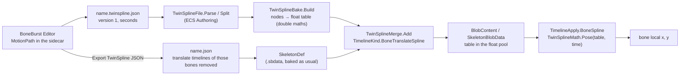

# TwinSpline: path motion for a bone, file and playback

A bone's translation can be played from a **TwinSpline path** instead of keys: a spline through nodes in the space of the bone's parent, and a second spline over it that sets the speed. The BoneBurst Editor authors and exports it; BoneBurst's ECS runtime plays it. This spec fixes the file the editor writes (`name.twinspline.json`, version 1), the maths both sides compute, the table the bake makes of a path, and how the runtime plays it. The editor's TypeScript (`Editor-BoneBurst-Src/src/motion/`) is the oracle of the maths; BoneBurst's C# (`BoneBurst.TwinSpline`, in `com.module.ta-creator-boneburst-core`) is checked against it, to 1e-4, by fixtures the editor writes (`scripts/twin-fixtures.ts`).



## 1. What it is, and what it is not

*   A path is **per animation and bone**: the animation says when, the bone says what moves. It replaces the bone's `translate` timeline in that animation; it does not touch rotation, scale, shear, slots or constraints.
*   Its time is **the animation entry's time from 0**: a looping path starts over each run, any other holds its last place. No separate clock, no component, no system: the track entry, looping, crossfade, alpha and hold of the animation state apply to it as to any translate timeline.
*   It is **not stored in `.sbdata`**. The skeleton file carries no path; the path joins the skeleton in memory at bake time (§6). Old files are unaffected.
*   Supported: a path whose reference bone is **the bone's own parent** (§2.3). Not supported yet: any other reference bone (it needs a world matrix of that bone before the path bone's local is set).

## 2. The file `name.twinspline.json` (version 1)

```json
{ "twinspline": 1,
  "animations": {
    "run": {
      "foot-back-IK": {
        "parent": "skeleton-control", "duration": 0.4667, "loop": true, "closed": true,
        "nodes": [ { "x": 12.5, "y": 3, "speed": 0.8, "tx": 10, "ty": 0 }, { "x": 40, "y": 21 } ]
      } } } }
```

### 2.1 Fields

| Field | Type | Meaning |
|---|---|---|
| `twinspline` | integer | The format version. Only `1` is read; any other is refused. |
| `animations` | object | Animation name → bones. Names are the skeleton's. |
| bone | object | Bone name → one path. |
| `parent` | string, optional | The bone whose space the nodes are in. Absent: the world's own space (a root bone with no parent). |
| `duration` | number > 0 | Seconds one run takes. |
| `loop` | boolean | Whether a run starts over at its end (true) or the path stops there. |
| `closed` | boolean | A ring: the last node joins the first. Open: a curve from the first node to the last. |
| `nodes` | array, at least 2 | The nodes, in order. |

A node has `x`, `y` (the place, in the parent's space, units of the skeleton) and optional parts, all numbers:

| Part | Meaning |
|---|---|
| `speed` | The speed spline's value here, held to −0.99 … 5; the bone goes `1 + speed` times as fast. Absent: 0 (an even pace). |
| `tx`, `ty` | A dragged handle: the way out of the node, as an offset. **Both or neither**; one alone is no handle. The way in mirrors it. |
| `bx`, `by` | A broken leg: the way in on its own, as an offset. **Both or neither**; only used where the node has a previous node. |
| `ss` | The speed spline's slope leaving the node. Absent: automatic. |
| `sb` | A broken speed leg: the slope arriving at the node. Only with `ss`; absent: equal to `ss`. |

The editor's own node number (`id`) is not written.

### 2.2 Refused

A reader refuses (it says what is wrong) a file that is not JSON, whose `twinspline` is not `1`, with no `animations` object, a bone whose value is not an object, fewer than two nodes, a `duration` that is not a finite number above 0, a `loop` or `closed` that is not a boolean, a node without `x` or `y` numbers, a `parent` that is not a string. These are the checks of the editor's `parseTwinSpline`.

### 2.3 Set aside

A path is **set aside with a reason** (the bone then holds its setup pose in that animation, because the export removed its keys) when the skeleton has no such animation or bone, or when `parent` is not the bone's own parent (or, absent, the bone is not a root). A bone that still has translation keys in the animation keeps them and the path is left out.

## 3. The maths

All of it is the editor's; numbers are doubles at bake time. `P(i)` is node `i`'s place; `n` is the node count.

### 3.1 Handles

For every node, an *out* offset (toward the next node) and an *in* offset (toward the previous one). A ring has both for every node (the last joins the first); an open path's first node has no *in*, its last no *out*.

*   A node with `tx`, `ty`: out = (`tx`, `ty`), in = (−`tx`, −`ty`).
*   A ring of two nodes with no handle: a lens. With `d` the distance between the nodes (1 if 0), `u = (−dy, dx) / d`: node 0 has out = `u · d/2`, node 1 has out = −`u · d/2`, each in = −out.
*   Otherwise automatic: along the line from the previous node to the next (an end uses its one neighbour and itself), out = direction × (distance to next / 3), in = −direction × (distance to previous / 3). A zero length counts as 1.
*   A node with `bx`, `by` (and a previous node) has in = (`bx`, `by`).

### 3.2 The curve

For each span `i → j` (`j = (i+1) mod n`; `n` spans for a ring, `n − 1` open) a cubic Bézier with control points `P(i) + out(i)` and `P(j) + in(j)`, sampled at **64** equal steps of `t`. The samples, joined by straight lines, are the curve; their cumulative chord length is the arc length `s`; the total is the curve's `length`. The arc length at node `i` is `nodeAt(i)`.

### 3.3 Progress and the speed spline

`xs(i) = nodeAt(i) / length` (the first node at 0; if `length` is 0, `i / max(1, n−1)`). `v(i) = clamp(speed)` where `clamp` holds to [−0.99, 5] and rounds to four places with **round half up** (JavaScript's `Math.round`); a non-finite value is 0.

The speed spline is a cubic Hermite through `(xs(i), v(i))` over progress 0…1 (a ring adds the first node again at 1). For progress `p`, with `[x0, x1]` the span holding it, `h = x1 − x0`, `t = (p − x0) / h`:

`v = (2t³ − 3t² + 1)·v0 + (t³ − 2t² + t)·h·m0 + (−2t³ + 3t²)·v1 + (t³ − t²)·h·m1`, clamped,

where `m0` is the slope leaving node `i` (`ss`, else automatic) and `m1` the slope arriving at node `i+1` (`sb` if both `ss` and `sb`, else `ss`, else automatic). **Automatic slope** at node `i`: `(v(next) − v(prev)) / (xs(next) − xs(prev))`, a ring running round (previous of the first is the last at `xs − 1`, next of the last is the first at `1 + xs`), an open end using itself; 0 if the denominator is not above 1e-9. A span with `h ≤ 1e-9` gives its start value.

### 3.4 The time table

The time to cover a stretch of progress is `dp / (1 + speed)`. Tabulate it at **512** steps: `T[0] = 0`, `T[k] = T[k−1] + ((a + b) / 2) / 512` with `a = 1/(1 + speed(p = (k−1)/512))`, `b = 1/(1 + speed(k/512))`, then divide every `T[k]` by `T[512]` (1 if 0). So the run takes `duration` seconds whatever the speeds; they only change how it is spread.

### 3.5 The point at a time

For a path time `t` in seconds:

1.  `tau = clamp(t / max(1e-9, duration), 0, 1)`.
2.  Progress: find `k` with `T[k] ≤ tau < T[k+1]` by binary search; `progress = (k + (tau − T[k]) / (T[k+1] − T[k])) / 512` (just `k/512` if the span is 0).
3.  `s = progress × length`, held to 0 … `length`; binary search the cumulative lengths of the 64-per-span samples; the point is the linear interpolation between the two samples around `s`.

## 4. The baked table

`TwinSplineBake.Build(nodes, closed, duration, loop)` returns one `float[]` per path (floats; the maths above ran in double):

| Floats | Contents |
|---|---|
| 0 | `duration` |
| 1 | `loop` (1 or 0) |
| 2 | the curve's `length` |
| 3 | `P`, the number of curve samples (`spans × 64 + 1`) |
| 4 | `T`, the time table steps (512) |
| 5 – 7 | reserved (0) |
| 8 … 8 + 3P − 1 | per sample: `x`, `y`, cumulative arc length |
| then 513 | the time table `T[0…512]`, 0…1 |

The bone's setup pose is **not** in the table: the runtime takes it from the blob's bone, where it is kept once.

## 5. Playing it

`TwinSplineMath.Pose(table, time, out x, out y)` (pointers, no allocation, Burst-compatible): `pathTime = loop ? time mod duration : min(time, duration)`, then §3.5. `time` is the animation entry's time as the animation state hands it to the timelines (for a looping entry already wrapped by the animation's own duration, so a path shorter than its animation starts over inside it, and a longer one is cut at the animation's end).

`TimelineApply.BoneSpline` writes the bone's local `x`, `y` from the point `(px, py)`, with the same mixing as keyed translation (`BoneTwo`), where `setup + value` of the keyed formulas is the point itself:

| Mixing | Result |
|---|---|
| from setup (`MixFrom.Setup`) | `x = setup.x + (px − setup.x) · alpha`, likewise `y` |
| additive (`Add`) | `x += (px − setup.x) · alpha` |
| otherwise (replace / first) | `x += (px − x) · alpha` |

A bone that is not active (a skin-required bone of another skin) is left alone. A path has a place at every time, so there is no "before the first frame" case.

## 6. How it joins the skeleton

*   **Kind.** `TimelineKind.BoneTranslateSpline`, appended after `Event` so the stored numbers of the other kinds do not change. `TimelineDef.Spline` holds the table; `Frames` is empty and `FrameCount` 0 (so the timeline adds nothing to the animation's duration: the keyed timelines and the file's own animation length decide it).
*   **Blob.** `TimelineBlob.Kind`, `Target` (the bone), and the table in the shared float pool (`BlobView.DeformFrames`) at `ExtraStart`, `ExtraLength` floats long, the pool the deform timelines use.
*   **Properties.** The same property ids as `BoneTranslate` (x and y of the bone), so a crossfade between a keyed and a spline animation on a bone hands over, holds and mixes as two keyed animations do (`Timelines.md` §6).
*   **Lists.** The bone is listed with the animation's keyed bones, as keyed bones are (it matters to sliders), and the managed and ECS "additive" lists know the kind.
*   **Not in `.sbdata`.** `BoneBurstDataWriter` does not write `Spline`; the merge happens after the file is read (`TwinSplineMerge.Add`, ECS Authoring). A skeleton with spline timelines is not for the MonoBehaviour front.

## 7. How it is checked

*   `scripts/twin-fixtures.ts` (editor) writes eight paths and the editor's answers; `TwinSplineTests` compares the C# curve length, speed spline and the point at 311 times each to 1e-4.
*   `TwinSplineFileTests`: the reader on the owner's real mix-and-match-pro export (29 paths in 10 animations; 28 playable, one relative to another bone).
*   `TwinSplineMergeTests`: paths become timelines; the managed pose and the ECS systems put a bone on its path at every frame.
*   `TwinSplineEndToEndTests`: the real export baked and played; every path bone's world place within 0.05 of the editor's engine (`scripts/twin-e2e-fixture.ts`).
*   `TwinSplineMixingTests`: a crossfade between keys and a path equals the same crossfade with the path baked to dense keys.
*   The parity gate (the core package against stock spine-csharp on .NET) passes with the kind added.

Plans: `Doc/Review/BoneBurst-ECS-P16-TwinSpline-Plan.md`; the editor's `docs/UNITY-EXPORT-PLAN.md` and `docs/SPEC.md` §3 and §5.

## 8. Open

*   A path relative to a bone other than the bone's own parent (the real export has one in 29).
*   The editor's *Spine keys* export (the other mode) played by BoneBurst.
*   Rotation, scale and shear stay keys; the editor's paths are translate only.
*   Players: the tests ran in the Editor.
