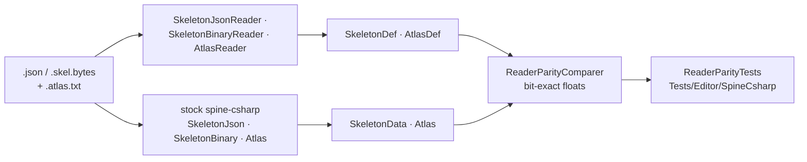
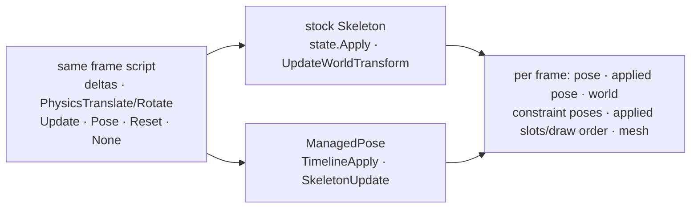
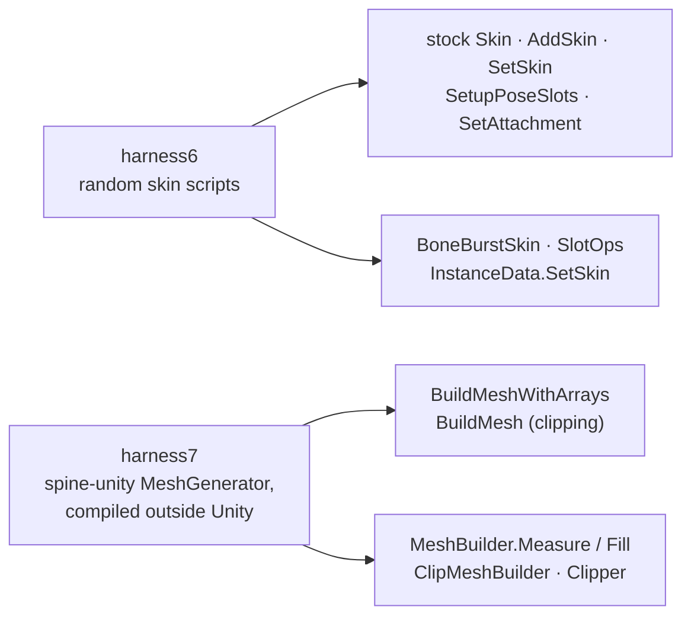
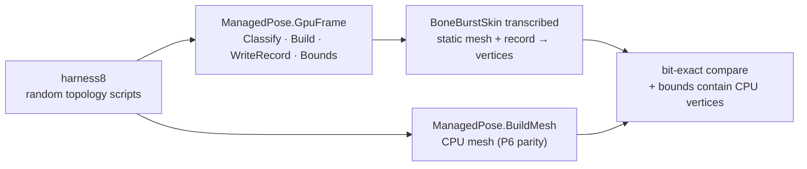
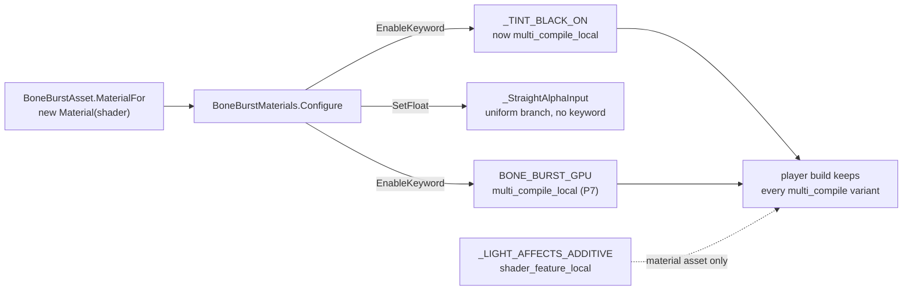

# BoneBurst parity: corpus and coverage

BoneBurst must read, pose and render Spine skeletons exactly as stock spine-unity does. Every phase proves this by loading the same file into both runtimes and comparing the results. This page lists the corpus, which features each file exercises, what no file exercises yet, and each phase's result. The coverage tables were **generated by scanning the files with BoneBurst's own reader** (2026-09-29), not written by hand.

## Where parity is checked (2026-09-30)

Bit-for-bit parity with stock is proven **outside Unity**. Under Unity's Mono, `float` arithmetic is rounded differently depending on how the JIT compiles each method, so the Editor suites cannot demand bits ([BoneBurst-ParityPlan.md](../Review/BoneBurst-ParityPlan.md)).

| Suite | Strict-float harness (`Tools~/ParityHarness`) | Unity Editor |
|---|---|---|
| `ReaderParityTests` | exact | exact (reading has no JIT-sensitive arithmetic) |
| `SetupPoseParityTests`, `AnimationParityTests`, `MixingParityTests`, `ConstraintParityTests`, `SkinParityTests` | **exact**, every value (`ParityDriftReport`: 133,729,676 values) | tolerance, lockstep, conditioning-aware bounds |
| `MeshGeneratorParityTests` | not run: needs spine-unity's `MeshGenerator` and `UnityEngine.Mesh` | tolerance, lockstep; clipped shapes by area where a cut differs |
| `GpuSkinningParityTests` | not run (needs `UnityEngine.Mesh`) | GPU mesh against CPU mesh; ignored when every frame clips |
| Play mode (`Module.TA.BoneBurst.Tests`) | not run | Burst against the managed reference, within 1e-4; GPU and fetch paths against the CPU path, pixel for pixel |

**The Editor rules**, all in `Tests/Editor/SpineCsharp`:
- **Tolerance** (`ParityDrift.ToleranceOf`):
  - positions `1e-5 × max(|v|, skeleton size)`;
  - rotations `1e-5 × max(|v|, 360)`;
  - other values `max(1e-5, 1e-5 × |v|)`;
  - the applied matrix 4 × that;
  - a colour byte ±1.
- **Lockstep** (`ParityLockstep`): after each frame, compare, then sync the state carried into the next frame (poses, bone worlds, constraint poses, slot colours, physics).
- **Conditioning** (`ParityConditioning`): two-bone IK chains out of reach or nearly straight, and every bone they feed, get 1000 × on that frame.
- **Frames over tolerance** must come in runs of at most 3, bounded on both sides, and be at most `max(1, 2 %)` of a case's frames.

Five deliberate runtime bugs each fail both the harness and the Editor suite (parity plan §3.4).

## Corpus

| Source | Files | Why |
|---|---|---|
| `com.esotericsoftware.spine.spine-unity/Samples~/Spine Examples/Spine Skeletons/` | 16 JSON and 3 binary, all exported by 4.3.74-beta | Esoteric's own samples, which cover most features. They are read from disk, and Unity never imports `Samples~`. |
| `Tests/Editor/Data~/m2-mix-and-match/` | `mix-and-match-pro.skel.bytes` (**4.3.23**) and `holding-items.atlas.txt` | The skeleton M2 actually ships (`P Graphics 2.prefab`), at M2's scale of 0.01. It is also an older 4.3 minor than the samples. |
| `Tests/Editor/Data~/synthetic/` | `gaps.json` and `synthetic.atlas.txt`, handwritten | Covers the features no sample uses (see *Gaps closed by the synthetic file*). |
| `Tests/Editor/Data~/synthetic/` | `clipping.json` (P6), handwritten | Clipping cases the samples never reach: concave polygons (star, L, comb: ear clipping and decompose), inverse and convex-flag clips (hull), a weighted clip polygon, a nested clip, a clip ending on its own slot, an end slot before the clip, an end slot whose bone is skin-gated, an alpha-0 end slot, collinear points, clips carried across page splits, and attachment, alpha and draw-order keys that move all of these. See *P6*. |
| `Tests/Editor/Data~/synthetic/` | `gpu.json` (P7), handwritten | GPU skinning bounds and tint: weighted meshes whose weight sums are 1.25 and 0.5, one with a negative weight, far-out influences, a flipped and sheared bone, and a coloured dark tint (r ≠ g ≠ b) on a rendered slot, animated with `rgba2`/`rgb2`. The samples' weights all sum to 1 and their only coloured dark tint sits on a bounding box. See *P7*. |
| `Tests/Editor/Data~/synthetic/` | `constraints.json` (P5), handwritten | Constraint branches the samples never reach: one-bone IK stretch/compress on every inherit mode, local and additive transforms, the world→local decompose of every inherit mode, proportional and fixed paths on unweighted curves, physics volume/shear/y channels, sliders that key slots, draw order and constraints. See *P5 constraints*. |

Each sample runs at scale **1** and at scale **0.37**. An odd scale catches any value that should be multiplied by the load scale and is not.

## Feature coverage per file

Counts are the number of constraints, attachments, timelines or items. `·` means none.

| File | Format | IK | Transform | Path | Physics | Slider | Weighted mesh | Linked mesh | Clipping | Deform tl | Sequence | Tint black | Blend ≠ normal | Inherit ≠ normal | Draw order tl | Draw-order folder | Events | Skins > 1 | Physics tl |
|---|---|---|---|---|---|---|---|---|---|---|---|---|---|---|---|---|---|---|---|
| celestial-circus-pro.json | json | · | 3 | · | 30 | · | 47 | · | · | · | · | · | 8 | · | · | · | · | · | 11 |
| cloud-pot.skel.bytes | binary | · | · | · | 26 | · | 2 | · | · | · | · | · | · | · | · | · | · | · | 12 |
| dragon.json | json | · | · | · | · | · | · | · | · | · | 4 | · | · | · | · | · | · | · | · |
| eyes.json | json | · | · | · | · | · | · | · | · | · | · | · | · | · | · | · | · | · | · |
| FootSoldier.json | json | · | · | · | · | · | · | · | · | · | · | · | · | · | · | · | 1 | · | · |
| Gauge.json | json | · | · | · | · | · | · | · | · | · | · | · | · | · | · | · | · | · | · |
| goblins.json | json | · | · | · | · | · | 1 | 2 | · | 11 | · | · | · | · | · | · | · | 3 | · |
| hero-pro.json | json | 3 | · | 1 | · | · | 2 | · | · | 48 | · | · | · | 2 | · | · | 3 | 3 | · |
| mix-and-match-pro.json | json | 2 | 17 | 4 | · | · | 219 | 6 | · | · | · | · | · | · | · | · | · | 34 | · |
| raggedy spineboy.json | json | · | · | · | · | · | 6 | · | · | · | · | · | · | · | · | · | · | · | · |
| raptor.json | json | 9 | · | · | · | · | 9 | · | · | 2 | · | · | · | 6 | · | · | 1 | · | · |
| raptor-pro.json | json | 9 | · | · | · | · | 14 | · | · | · | · | · | · | 6 | 2 | · | 1 | · | · |
| sack-pro.skel.bytes | binary | · | 4 | · | 20 | · | 3 | · | · | 1 | · | · | · | 3 | · | · | · | · | 81 |
| snowglobe-pro.skel.bytes | binary | · | 4 | · | 47 | · | 52 | · | · | · | · | · | 1 | 18 | 2 | · | · | · | · |
| spineboy-pro.json | json | 7 | 6 | · | · | · | 4 | · | 1 | 26 | · | · | 25 | 4 | · | · | 3 | · | · |
| spineboy-unity.json | json | 2 | 4 | 1 | · | · | · | · | · | · | · | · | 3 | 1 | · | · | 2 | 2 | · |
| Doi.json | json | · | 2 | · | · | · | 9 | · | · | 16 | · | · | · | · | · | · | · | · | · |
| stretchyman.json | json | 4 | 2 | 4 | · | · | 4 | · | · | 2 | · | · | · | 8 | · | · | · | · | · |
| whirlyblendmodes.json | json | · | 1 | · | · | · | · | · | · | · | · | · | 3 | · | · | · | · | · | · |
| **M2** mix-and-match-pro.skel.bytes | binary 4.3.23 | 4 | 21 | 4 | · | · | 219 | 6 | · | · | · | · | · | 1 | 4 | · | · | 34 | · |
| synthetic gaps.json | json | 1 | 1 | 1 | 1 | 2 | · | · | 1 | · | · | 3 | 3 | 4 | 1 | 1 | 1 | 2 | 8 |
| synthetic constraints.json | json | 6 | 8 | 3 | 3 | 3 | · | · | · | · | · | · | 1 | 9 | 1 | · | · | · | 4 |
| synthetic clipping.json | json | · | · | · | · | · | · | · | 10 | · | · | · | · | · | 1 | · | · | 2 | · |

### Timeline types in the samples and M2

| Timeline | Files | Timeline | Files |
|---|---|---|---|
| SlotAttachment | 10 | Transform | 5 |
| SlotRgba | 4 | PathPosition / PathMix | 1 / 1 (spineboy-unity) |
| **SlotRgb, SlotRgba2, SlotRgb2, SlotAlpha** | **0** | **PathSpacing** | **0** |
| BoneRotate / Translate / Scale | 18 / 16 / 15 | Physics inertia, strength, damping, mass, mix | 1 (sack-pro) |
| BoneTranslateX / Y | 3 (binary only) | PhysicsWind / Reset | 2 / 1 |
| **BoneScaleX / Y, ShearX / Y** | **0** | **PhysicsGravity** | **0** |
| BoneShear | 5 | **SliderTime / SliderMix** | **0** |
| BoneInherit | 1 (M2 binary) | Deform | 7 |
| Ik | 6 | Sequence | 1 (dragon) |
| DrawOrder | 3 | **DrawOrderFolder** | **0** |
| Event | 6 | | |

## Gaps closed by the synthetic file

No sample has slider constraints or timelines, draw-order folders, RGB, alpha or two-colour slot timelines, single-axis scale or shear timelines, path spacing, physics gravity, or a global (`""`) physics timeline. `synthetic/gaps.json` has every one of them. It also covers these edge rules from the spec:

- A transform `from` property with no `to` entries is dropped.
- Transform mixes stay 0 unless a `to` property of that kind exists.
- Event volume defaults to 1 when audio is present.
- Slider `from`, `to` and `scale` apply the property scale.
- Atlas regions rotated 90°, 180° and 270°, an atlas with two pages, and unknown region keys (`split`, `pad`).

## Known gaps: binary paths no file exercises

The synthetic file is JSON. No binary file in the corpus has these, so the **binary** reader's handling of them is checked only by reading the spec:

- Slot timelines RGB, RGBA2, RGB2 and Alpha (tags 2–5)
- Bone ScaleX/Y and ShearX/Y timelines (tags 5, 6, 8 and 9)
- Path spacing timeline (tag 1)
- Physics gravity timeline (tag 6)
- Slider constraints and slider timelines
- Draw-order folders
- Clipping attachments
- Two-colour slots (dark colour present)

These gaps close when someone exports from Spine 4.3 a binary skeleton that uses these features and adds it under `Tests/Editor/Data~/`. `ReaderParityTests` picks it up only if it is added to `Corpus()`.

## Phase results

| Phase | Result |
|---|---|
| **P1 readers** (2026-09-29) | **41 of 41 runs match bit for bit, 92,424 checks, 0 failures.** That is the 19 samples at two scales, M2 at 0.01, and the synthetic file at two scales. Run outside Unity with a scratch harness (the stock sources plus the new readers, .NET 8). The same comparison lives in `Tests/Editor/SpineCsharp/ReaderParityTests.cs`, which **has not yet run inside Unity**. Sanity check: changing one Bézier constant by 0.3 % made 75 comparisons fail, so a green result is not vacuous. |

### P2 setup pose (2026-09-29)

**What is compared.** Stock spine-csharp builds a `Skeleton` from the same file, using an atlas flipped to V-up (`FlipV`, as spine-unity does) and with its constraints removed, since constraints were P5 (from P5 on, both sides keep them; see *P5 constraints*). `PoseMath` and `MeshBuilder` run the same case. The comparison covers:
- each bone's active flag and world `a b c d x y`;
- each slot's attachment;
- every emitted vertex's position, UV and 8-bit colour;
- every index, the submesh material keys and boundaries, and the bounds.

The expected buffers are assembled from stock's per-attachment outputs (`ComputeWorldVertices`, `Sequence.GetUVs`) in the order `Pose-and-Mesh.md` §7.6 gives for spine-unity's `BuildMeshWithArrays`.

**Result, outside Unity: 122 of 122 runs match bit for bit.** The runs cover each file at scales 1 and 0.37, M2 at 0.01 and the synthetic file, each with no skin and up to two named skins, flipped and unflipped.

**Sanity checks (a green result is not vacuous):**
- Swapping two region indices made 88 of 108 runs fail.
- Regrouping one addition in the Normal-inherit angle, `(r + 90) + shearY` as `(r + shearY) + 90`, went unnoticed at first: every corpus bone had an integer or zero shear. The synthetic file now has bones with fractional rotation and shear, a reflected scale, every inherit mode, regions on 270° and 180° atlas regions, a mesh on a 90° region, and Multiply, Additive and zero-alpha slots. The same regrouping now fails 12 checks.

**In Unity (written, not yet run):**
- `Tests/Editor/SpineCsharp/SetupPoseParityTests.cs` compares against spine-unity's own `MeshGenerator` output, not a reconstruction of it.
- `Tests/Runtime/Pose/BoneBurstSkeletonPlayModeTests.cs` compares the Burst-built mesh with the managed reference (positions within 1e-4, everything else exact). It also checks that an unchanged skeleton is not re-meshed, that a skin change re-meshes, and that removal works.

**Not covered yet:**
- **Clipping** and **tint black**: done in P6 (see *P6*).
- **The additive-slot gamma curve.** `MeshBuilder` uses the sRGB curve for `Mathf.LinearToGammaSpace` (`Pose-and-Mesh.md` §9 item 3). The edit-mode test against `MeshGenerator` settles it for `spineboy-pro` and `whirlyblendmodes`.

### P3 animation (2026-09-29)

**What is compared.** Every animation of every file is played by stock `AnimationState` (track 0, default mix 0) and by `TrackState` + `TimelineApply`, frame by frame. Both get the same frame deltas: a mix of 1/60, 1/30, 7 ms, 0.1 s and 0.25 s, over about 2.3 durations, so every run crosses keys, loop wraps and several loops. Each run switches to another animation at frame 23 (mix 0, Timelines.md §5.6). Every file is played with no skin and with its first named skin, looped and once, in two passes:

- **Constraints kept:** what timelines write is compared after every frame. That is:
  - bone locals, including inherit;
  - each slot's colour, dark colour, attachment, sequence index and deform values;
  - the draw order;
  - every constraint pose (IK, transform, path, physics, slider);
  - the delivered events, including their order around Complete.
- **Constraints removed:** stock also drops its constraint timelines, since they would index the emptied list. World transforms and the full vertex buffer (positions, UVs, colours, indices, deform included) are compared after every frame.

**Result, outside Unity: 708 of 708 runs match bit for bit. That is 32,128 frames and 5,400,086 checks with 0 failures.**

**Bugs the harness found and fixed on the way:**
- **Sequence index of an empty slot.** Stock keeps the setup value 0; only assigning an attachment sets −1.
- **Mix-out timeline modes.** The per-timeline Setup, First and Hold rules; the spec is corrected above.

**Sanity checks:**
- Swapping the deform curve's multiply-before-divide order (trap 2) failed 31 runs.
- The Bézier `>` vs `>=` trap went undetected. The two only differ when a frame lands exactly on a baked sample time, which no frame in the run does. It is a real gap in what the test can see, and it is noted.

**In Unity (written, not yet run):**
- `Tests/Editor/SpineCsharp/AnimationParityTests.cs` runs the same two passes against spine-unity's real `MeshGenerator`.
- `Tests/Runtime/Anim/AnimationPlayModeTests.cs` compares a playing component's Burst mesh with the managed reference for 90 frames (within 1e-4), checks that Complete is delivered, and checks that a stopped skeleton stops re-meshing.

**Not covered:**
- **Crossfades** (mix duration > 0), additive entries, several tracks and reverse. These are P4. spine-unity's imported default mix is 0.2 s, so P4 is needed before a stock `SetAnimation` switch can be claimed identical.
- **Constraint solvers:** P5.
- **Clipping and tint black:** P6.

### P4 mixing (2026-09-29)

**What is compared.** Stock `AnimationState` and `BoneAnimationState` are driven by the same random script: about one action per 14 frames over 180 frames, 20 seeds per file. The actions are:
- `SetAnimation`, `AddAnimation` with a delay of 0 or up to ±0.6 s, `SetEmptyAnimation` and `AddEmptyAnimation`, `ClearTrack` on tracks 0–2, and changes to the state time scale.
- Default mix 0 or 0.2, and three random per-pair mixes.
- Per-entry settings: alpha, time scale, additive (on tracks 1–2), reverse, shortest rotation, mix duration, and the event, mix-attachment, mix-draw-order and alpha-attachment thresholds.

After every frame the harness compares the full pose (as in P3) and the complete listener log (Start, Interrupt, End, Dispose, Complete, Event), in order.

**Result, outside Unity: 420 of 420 runs match bit for bit. That is 75,600 frames and 14,683,485 checks, with 26,466 listener lines compared and 0 failures.**

**States the scripts reached** (counted, not assumed; frames summed over all tracks):

| State | Frames |
|---|---|
| Crossfading | 11,922 |
| Mix chain of 3 or more | 1,009 |
| Queued next entry | 5,380 |
| Delayed entry | 1,246 |
| Empty animation | 7,149 |
| Past `trackEnd` | 2,605 |
| Reverse | 14,661 |
| Additive entry | 30,479 |
| Alpha below 1 | 37,024 |
| Tracks 0 / 1 / 2 active | 58,722 / 41,398 / 37,183 |

**Sanity checks:** simplifying `alphaHold` to `a` failed 33 of 76 runs. Allowing the fast path on tracks other than 0 failed 64 of 76. P3's harness (708 of 708) and P2's (118 of 118) still pass.

**In Unity (written, not yet run):**
- `Tests/Editor/SpineCsharp/MixingParityTests.cs` runs the same scripts, 3 seeds per file.
- `AnimationParityTests` now drives `BoneAnimationState`.
- The play-mode tests add a crossfade using the asset's default mix of 0.2.

**Not covered:**
- **Non-linear `mixInterpolation`.** It is not supported; linear is the stock default.
- **The threaded-update event timing of spine-unity.** BoneBurst always uses the non-threaded order.
- **Upstream quirks** listed in `AnimationState.md` §12 items 3 and 4 (a queue switch skipping `UpdateMixingFrom` and double-queuing Complete; the event split with `animationStart ≠ 0`). The code reproduces them literally. The scripts reached queue switches while mixing, but no case was built on purpose to isolate the double Complete.

### P5 constraints (2026-09-29)

**What is compared.** Every animation of every file (samples, M2 at 0.01, both synthetic files; `constraints.json` also at 0.37) is played with constraints and physics on, as spine-unity runs a frame: `state.Update(dt)`, `skeleton.Update(dt)`, `state.Apply`, `UpdateWorldTransform(physics)`, after one initial world update at time 0 as spine-unity initialises. Each file runs with no skin and up to two named skins, in four variants: looped, once, skeleton scale (−1, 1) and (1, −1.5). The script also calls `PhysicsTranslate` every 7th frame and `PhysicsRotate` every 11th, and cycles the physics mode (Pose every 17th frame, Reset every 29th, None every 37th, otherwise Update). After every frame it compares:
- each bone's pose (what animation wrote), its applied pose where stock's is valid, and its world `a b c d x y`;
- each constraint's pose and applied pose;
- each slot's applied colour and attachment, and the applied draw order;
- the full vertex buffer (positions, UVs, colours, indices), as in P3;
- the delivered events.

**Result, outside Unity: 892 of 892 runs match bit for bit. That is 49,120 frames and 16,428,566 checks with 0 failures.** Constraint frames solved (a constraint counted once per frame it was active): IK 141,076 · transform 268,756 · path 84,896 · physics 205,988 · slider 7,368.

**Branches reached**, from the corpus definitions (counted by the harness):

| Kind | Variants present |
|---|---|
| IK | one bone on Normal, OnlyTranslation (stretch, uniform), NoScale (compress, volume) and NoRotationOrReflection under a rotated parent (stretch + compress); two bones plain, with softness + stretch + non-uniform parent scale, with stretch + volume + bend flip |
| Transform | world→world (62 in the samples), local source → world target with clamp, world source → local target additive (all six properties), world additive with clamp and cross-property maps (ScaleX→ScaleY, Rotate→ShearY, Y→X), local→local, a world-target transform on the root bone |
| World→local decompose | root, Normal, OnlyTranslation, NoRotationOrReflection, NoScale and NoScaleOrReflection under a reflected parent |
| Path | open weighted constant-speed (13, samples); closed; open unweighted constant-speed and fixed-length; spacing Length, Fixed, Percent, Proportional; rotate Tangent (with offset rotation), Chain, ChainScale; points before the start and past the end |
| Physics | x/y, rotate, rotate+shearX, rotate+scaleX, x+scaleX uniform, y+rotate+shearX+scaleX volume; `mix` keyed to 0 and back; global wind and reset timelines; 24, 30 and 60 fps |
| Slider | time-driven (loop, additive); bone-driven world rotate (loop), world scaleX (additive), local x (loop); animations keying slot colour and attachment, draw order, bones, a transform mix, an IK mix, a physics strength and a path spacing |

**Sanity checks.** A deliberate error in each area, one at a time; the harness must fail:

| Mutation | Runs failing |
|---|---|
| One-bone IK: `rotation × mix × 0.9999` | 60 of 852 |
| Two-bone IK child rotation × 0.9999 | 528 of 852 |
| Two-bone IK non-uniform discriminant `4 → 4.001` | 12 of 12 (`constraints.json`) |
| IK OnlyTranslation sign dropped / NoRotationOrReflection angle × 1.001 / volume constant / two-bone stretch | 3, 12, 12, 12 of 12 |
| Physics damping exponent `60 → 59` | 76 of 852 |
| Physics volume, shearX, y-gravity (each × 1.001–1.01) | 12 of 12 each |
| Path 4-step constant `0.1875 → 0.1876` | 348 of 852 |
| Path proportional factor, offset rotation, before-start point (each × 1.001) | 12 of 12 each |
| Transform world-rotate wrap `360 → 359` | 300 of 852 |
| Transform world X × 1.0001 | 372 of 852 |
| Transform local additive scale, world additive shear | 12 of 12 each |
| Slider time not written back to the pose | 16 of 852 |
| Slider writing pose slots / pose constraints instead of applied | 12 of 12 each |
| Slider single loop wrap instead of stock's double wrap | 12 of 12 |
| Update cache: IK without `SortReset` | 36 of 852 |
| `ResetWorld` without the child decompose | 324 of 852 |
| Decompose root / Normal / OnlyTranslation / NoRotationOrReflection / NoScale reflection (each × 1.001 or rule removed) | 12 of 12 each |

Two deliberate errors went undetected, both at exact boundaries: physics volume `>= 0.7` vs `> 0.7` (no run lands on exactly 0.7), and the rotation written by the path's early `p < Epsilon` branch (read only by a Chain tangent that none of the runs takes).

**Earlier harnesses under P5.** P3's and P4's harnesses now run stock's full frame (`skeleton.Update`, `UpdateWorldTransform(Physics.Update)`) and advance BoneBurst's physics clock, because a bone-driven slider writes its time into the pose during the world update, as stock does. P3's "constraints removed" pass now strips BoneBurst's side too. Results: P1 43 of 43 files, P3 748 of 748 runs, P4 480 of 480 random scripts (86,400 frames, 29,244 listener lines). P2's scratch harness is retired: it built P2's instance header by hand, and its checks (setup pose and mesh, flipped and unflipped, per skin) are a subset of P5's initial-frame checks.

**In Unity (written, not yet run):**
- `Tests/Editor/SpineCsharp/ConstraintParityTests.cs` runs the P5 comparison against spine-unity's real `MeshGenerator`.
- `SetupPoseParityTests` now keeps constraints on both sides (`UpdateWorldTransform(Physics.None)`); `AnimationParityTests` and `MixingParityTests` run the full frame.
- `Tests/Runtime/Anim/AnimationPlayModeTests.cs` adds celestial-circus: the Burst job against the managed reference for 120 frames with the GameObject moved part-way (within 1e-4, and it logs the largest difference), and a physics skeleton that keeps stepping with no animation.

**Not covered:**
- **Burst's own `pow`, `acos`, `atan2`.** The managed path uses .NET's; Burst uses its own implementations, which may differ in the last double bit. The play-mode test measures it: **4.23e-6** largest vertex difference over 120 frames (run 2026-09-29, Metal; see *Play-mode suite in Unity* below).
- **spine-unity's `PhysicsMovementRelativeTo`.** BoneBurst takes movement in world space, which is spine-unity's default.
- **Physics under a threaded or `_UpdateWorld`-subscribed spine-unity** (two world updates per frame, Constraints.md §10.3).
- **Clipping and tint black:** P6.

### P6 skins, clipping, tint black (2026-09-29)

**Skins.** Random scripts per file with more than one skin, 30 seeds each: combine one to four file skins with `new Skin` + `AddSkin` and set it (M2's `SpineLook` pattern), set a file skin or the null skin, `SetupPoseSlots`, `SetupPose`, `SetAttachment` by name or clear, and edit the skin already shown with or without `UpdateCache`, all while an animation plays with constraints and physics on. After every frame: every slot's attachment **by identity**, sequence index, deform and colour; bone and constraint activation; every active bone's world transform; the P5 checks (pose, applied pose, constraints, applied slots and draw order); and the mesh.

**Result: 240 of 240 runs match bit for bit** (28,800 frames, 13,471,201 checks). Actions taken: 1,031 combined-skin sets, 341 file-skin sets, 100 null-skin sets, 1,120 `SetupPoseSlots`, 521 `SetupPose`, 309 `SetAttachment`, 92 clears, 249 edits of the current skin (129 followed by `UpdateCache`).

**Bugs the skin harness found and fixed:**
- **Fresh slots had attachment 0.** A newly allocated slot array reads `Attachment = 0`, a real index, so the first setup pose saw a change and reset the sequence index. Fresh slots now start with no attachment, as a new stock `Slot` does.
- **Edits to the current skin must reach timelines at once.** Stock resolves attachment keys through the live skin every apply; only activation and update order wait for `UpdateCache`. `BoneBurstSkin.Version` now triggers a re-resolve.
- **Two worlds per bone.** Stock keeps a world transform on each of a bone's two pose objects. When a skin swap turns a constraint on or off, the bone switches objects, and a weighted mesh that uses a now-inactive bone reads that object's stale world. BoneBurst now keeps the other object's world and flags and swaps them when the update cache changes.

**Mesh against spine-unity's own `MeshGenerator`.** The generator, `SkeletonRendererInstruction` and `SubmeshInstruction` compile outside Unity (with `UNITY_5_3_OR_NEWER`, so spine-csharp uses `UnityEngine.Color`). Atlas pages get stand-in materials, and Multiply/Screen slots get region clones on their own material as `BlendModeMaterials` does, so stock splits submeshes where BoneBurst's keys do. Every animation of every file is compared frame by frame, with tint black on and off and a z spacing of −0.0125: vertex count, every position (x, y, z), UV, colour, `uv2`/`uv3`, the submesh count and each submesh's indices, and the bounds. Gamma colour space, because the linear additive fix calls a native Unity function; linear is covered by the earlier phases' formula checks.

**Result: 386 of 386 runs match bit for bit** (17,228 frames: 16,530 on `BuildMeshWithArrays`, 1,084 on the clipping path; 165,929 checks).

**Bugs the `MeshGenerator` comparison found and fixed:**
- **Sequence frames on different pages.** `dragon.json`'s sequences span atlas pages; BoneBurst took frame 0's page for every frame, so its submesh splits were wrong. Each frame's page is now stored (`BlobView.FramePages`).
- **Bounds centre.** Stock's `GetMeshBounds` centres at `min + (max − min) × 0.5` with z extents `slots × zSpacing × 0.5`; the component used `(min + max) × 0.5`. The last bits differed.

**Clipping sanity checks** (deliberate errors, one at a time):

| Mutation | Runs failing |
|---|---|
| Ear clipping: last triangle not rotated | 10 of 38 |
| Decompose: merge pass off | 8 of 38 |
| Clip: in→out crossing point × 1.0001 | 10 of 38 |
| Inverse clip: crossing parameter × 1.0001 | 8 of 38 |
| Barycentric UV: `1 − b − a` instead of `1 − a − b` | 10 of 38 |
| Clipping path `uv3.y` as the normal path's | 5 of 38 |
| Pre-active clip across a submesh split off | 8 of 38 |
| Hull: collinear points kept | 8 of 42 |
| Instruction walk: a clip ending on its own slot | 12 of 42 |
| Instruction walk: no alpha exemption for the end slot | 4 of 42 |

Undetected, all at exact boundaries: `MakeClockwise` with `area > 0` (a zero-area polygon) and its convexity test on exactly collinear turns; `Decompose`'s merge-restart (no polygon in the corpus needs a second merge round); an inverse fragment of exactly two points. Documented in `Clipping.md` §5 as well.

**Earlier harnesses under P6.** P1 44 of 44 files, P3 772 of 772, P4 125 of 125 (5 seeds), P5 916 of 916. P3, P5 and the skin harness skip their hand-built mesh reference on frames where a clip is active; the real `MeshGenerator` comparison covers those.

**In Unity (written, not yet run):**
- `Tests/Editor/SpineCsharp/SkinParityTests.cs` (6 seeds per file) and `Tests/Editor/SpineUnity/MeshGeneratorParityTests.cs` (real `MeshGenerator`, real materials, the project's colour space; both paths, tint black on and off).
- `Tests/Runtime/Pose/BoneBurstSkeletonPlayModeTests.cs`: a combined skin set through the component (the `SpineLook` sequence) against the managed reference, and tint black writing `uv2`/`uv3` streams.

**Not covered:**
- **Shaders.** `BoneBurst/Lit2D` and the tint-black path of `BoneBurst/Unlit` were not compiled in P6. P7 compiled them offline with DXC and found that neither compiled in a linear-colour-space project (see *P7*).
- **Culling modes** (`UpdateWhenInvisible`) depend on Unity's visibility messages and are not tested; `OnlyAnimationStatus` does not replay stock's silent event-timeline pass (`ApplyEventTimelinesOnly`), so Complete and events of the invisible stretch are not fired, as in stock, but the internal "last time" bookkeeping may differ on the first visible frame.
- **`CopySkin`** (combining by copy, which turns meshes into linked meshes with new identities) is not provided; `AddSkin` covers M2.
- **Clipping `k == 1` pieces** (stock deletes the previous triangle's indices) are not reproduced; no run produced one.

### P7 GPU skinning (2026-09-29)

**What is compared.** No stock runtime has GPU skinning. The reference is BoneBurst's CPU mesh, which P6 proved equal to spine-unity's `MeshGenerator`. Every frame, the GPU path runs through `ManagedPose.GpuFrame`, and the static mesh and pose record are evaluated with a line-for-line transcription of the vertex shader's `BoneBurstSkin`. Against `ManagedPose.BuildMesh`, the frame must match on:
- vertex count, indices and submeshes;
- every position (x, y, z), UV, colour byte and tint value, **bit for bit**;
- bounds that contain every CPU vertex, with the same z extents;
- a stated reason for any CPU fallback (an active clip, or deform on a rendered slot).

Random scripts per file, 4 seeds, tint black on and off, 150 frames each. The scripts:
- switch animations with a 0.2 s mix;
- combine and set skins, sometimes followed by `SetupPoseSlots`;
- set and clear attachments;
- reset slots;
- show one slot's attachment on a second slot, then swap the two in the draw order;
- change the z spacing.

**Result: 192 of 192 runs match bit for bit** (28,800 frames, 4,914,102 skinned vertices, 211,915 checks). Of 28,992 GPU-requested frames:
- 19,538 reused the static mesh;
- 2,268 rebuilt it;
- 7,186 fell back to the CPU: 4,998 for deform and 2,188 for clipping.

**Other measurements:**
- **Bounds:** the mean area is 1.17× exact without `gpu.json`, 4.4× at most; 1.46× and 17.5× with its extreme weights.
- **Upload volume:** 46.6 MB of pose records against 186.6 MB of CPU mesh data, about **4× less**.

**Sanity checks** (deliberate errors, one at a time):

| Mutation | Runs failing |
|---|---|
| Topology key ignores the sequence frame | 4 of 92 |
| Topology key ignores the slot | 56 of 192 |
| Topology key ignores the attachment | 42 of 92 |
| Deform not a reason to fall back | 20 of 92 |
| Active clipping not a reason to fall back | 8 of 92 |
| Tint record `x` and `y` swapped | 4 of 192 |
| Region corner W3 takes W1's offsets | 74 of 92 |
| Slot record stride ignores tint black | 41 of 92 |
| Bounds ignore the weight sums | 2 of 192 |
| Bounds with no rounding pad | 16 of 92 |
| Bounds extent drops the `|b|·hy` term | 70 of 92 |
| Bounds ignore `abs` (a flipped bone) | 114 of 192 |
| Negative-weight bound without `Σ|w|` | 6 of 192 |
| Negative weights take the convex bound | 4 of 192 |
| Influence start off by one | 56 of 92 |
| Build forgets the attachment in the key | 2 of 92 |
| Topology key ignores z spacing | 110 of 192 |

All 17 are caught. Four passed at first (slot, tint, weight sums, z spacing) and closed the gaps they showed: `gpu.json`, the share-and-swap action, and the z-spacing action. The 92-run rows ran before those additions.

**Earlier harnesses with `gpu.json` added:**

| Harness | Result |
|---|---|
| P1 readers | 26 of 26 files |
| P3 animation | 788 of 788 |
| P4 mixing | 130 of 130 (5 seeds) |
| P5 constraints | 940 of 940 |
| P6 skins | 90 of 90 |
| P6 mesh against `MeshGenerator` | 394 of 394 |

**Shaders, compiled offline** with the Editor's bundled DXC against the project's URP 17.6 includes. The combinations covered:
- every pass's vertex and fragment entry;
- `BONE_BURST_GPU`, `_TINT_BLACK_ON`, `_STRAIGHT_ALPHA_INPUT` and `_LIGHT_AFFECTS_ADDITIVE` (`_STRAIGHT_ALPHA_INPUT` is no longer a keyword; see the next section);
- gamma colour space and the four shape-light keywords.

All compile, but only as D3D11 shader model 6.0; Unity's own compiler and the Metal and GLES back ends have not run. The compile found two bugs:
- **P6: `SRGBToLinear` undeclared.** URP's `Core.hlsl` does not include the core `Color.hlsl`, so in a linear project neither `BoneBurst/Unlit` nor `BoneBurst/Lit2D` compiled. `BoneBurstCommon.hlsl` now includes it.
- **P7: a macro parameter named `color`.** It captured `input.color` in the CPU variants' `BONE_BURST_VERTEX_INPUTS`. The parameters are renamed.

**In Unity (written, not yet run):**
- `Tests/Editor/Mesh/GpuSkinningParityTests.cs`: the harness comparison over the corpus, 4 seeds.
- `Tests/Runtime/Pose/GpuSkinningPlayModeTests.cs`: the jobs end to end. It reads the uploaded `GraphicsBuffer` back and skins the static mesh against the managed reference, then checks reuse on an animating skeleton, the clipping fallback, switching GPU skinning off, and the materials' keyword.
- `Tests/Runtime/Perf/BoneBurstPerfTests.cs`: explicit, 100, 500 and 2 000 `spineboy-pro` walking, CPU against GPU. It reports the main-thread time of `BoneBurst.Schedule` and `BoneBurst.Complete`, frame time and GC per frame.

**Not covered:**
- **Real GPU arithmetic.** A GPU compiler may fuse multiply-adds, so on hardware positions may differ from the CPU mesh in the last bit or so. The play-mode test allows 1e-4.
- **Speed.** No number exists until the perf test runs in Unity.

### Shader keywords for runtime materials (2026-09-29)

`BoneBurstAsset.MaterialFor` creates its materials in code, and `BoneBurstMaterials.Configure` turns keywords on. So no material asset in any build ever uses `_TINT_BLACK_ON` or `_STRAIGHT_ALPHA_INPUT`. Both were `shader_feature_local`, and Unity builds only the `shader_feature` variants that materials in the build use. A player build therefore kept only the keywords-off variant, and would have dropped tint black and left straight-alpha pages unpremultiplied. The Editor compiles every variant, which is why the problem never showed there.

**The change.**
- `_TINT_BLACK_ON` is now `multi_compile_local` in every pass. It has to stay a keyword because it changes the vertex inputs (`uv2`/`uv3`, or the dark colour from the pose record).
- Straight alpha is no longer a keyword. `BoneBurstStraightAlpha()` in `BoneBurstCommon.hlsl` branches on the material's `_StraightAlphaInput`, which was already in `UnityPerMaterial` and already set by `Configure`. The property drawer is `[ToggleUI]`.
- `Configure` no longer touches `_STRAIGHT_ALPHA_INPUT`.
- `_LIGHT_AFFECTS_ADDITIVE` stays `shader_feature_local`. `Configure` never sets it, so it works only through a material asset (see `Skins-TintBlack-Culling.md` item 7).

**Variants per graphics API** (URP's Light2D prefiltering strips only `Hidden/Light2D`, so all 16 shape-light combinations ship):

| Pass | Old (`shader_feature`, as shipped) | `multi_compile` for both keywords | As built |
|---|---|---|---|
| `BoneBurst/Unlit` × 2 passes | 2 + 2 (wrong ones) | 8 + 8 | 4 + 4 |
| `BoneBurstLit2D` | 32 | 128 | 64 |
| `BoneBurstNormals` | 2 | 4 | 4 |
| Lit2D `BoneBurstUnlitForward` | 2 | 8 | 4 |
| **Total** | 40 | 156 | **80** |

`_LIGHT_AFFECTS_ADDITIVE` doubles `BoneBurstLit2D` only if a material asset in the build enables it.

**Since 2026-09-30:** `BONE_BURST_GPU` shares a keyword set with `BONE_BURST_FETCH` (CPU skinning, GPU vertex fetch, `Doc/Format/CpuVertexFetch.md`), which makes the GPU dimension three-way. The as-built total is **120** per graphics API: Unlit 6 + 6, `BoneBurstLit2D` 96, `BoneBurstNormals` 6, Lit2D `BoneBurstUnlitForward` 6.

**Checks.** `Tests/Editor/Render/KeywordVariantComparisonTests.cs` ran in Unity 6000.6.3f1 on Metal: **21 of 21 passed.** The old shaders are kept as a fixture in `Tests/Editor/Render/LegacyShaders/` (`Hidden/BoneBurstTests/Legacy*`). Both sides draw the same mesh, textures, render target and globals, set up by the same `Configure` call.
- **Build guard (2 tests).** Every keyword `Configure` sets is `multi_compile` in both shaders, and `_STRAIGHT_ALPHA_INPUT` is gone.
- **Pixels (13 tests).** Tint black and straight alpha on and off, with and without a shape light, in the `BoneBurstUnlit`, `BoneBurstLit2D`, `BoneBurstNormals` and `BoneBurstUnlitForward` passes, on a 256² float target.
  - New against the old keyword variant: max difference **0** in every case.
  - New against "old as shipped" (keywords off): up to 0.78 whenever a keyword matters, 0 where neither does.
- **Timing (6 tests).** 805 M fragments per sample (2048² target, 24 layers, 8 draws), Normal blend. The runs alternate old and new in ABBA order over 12 rounds after a warm-up. Doubling the draws took 1.96–1.97× the time, so the samples are GPU-bound. Median new/old: **0.98–1.04**, which is inside the noise (Unlit 6.9 ms, Lit2D 13–16 ms).
  - An earlier run used Blend One/Zero. The tile GPU's hidden-surface removal then skipped the covered layers, and the "timings" were 0.55 ms for 805 M fragments. The test now blends Normal and reports inconclusive if doubling the draws does not at least 1.6× the time.
- **Offline compile:** 536 of 536 vertex and fragment variants through DXC (D3D11, SM 6.0) against URP 17.6. The combinations cover `_TINT_BLACK_ON`, `BONE_BURST_GPU`, gamma, `_LIGHT_AFFECTS_ADDITIVE` and the four shape-light keywords. A deliberately broken source fails, so the harness is not vacuous.

**Not covered:** a real player build, and GLES / Vulkan / D3D on hardware. The stripping follows Unity's documented rule, but no player build was made to show it.

### Play-mode suite in Unity (2026-09-29)

**`Module.TA.BoneBurst.Tests`: 19 of 19 pass in PlayMode** (Unity 6000.6.3f1, Metal). So the P2, P3, P5, P6 and P7 play-mode comparisons above have now run in Unity: the Burst mesh against `ManagedPose`, 90 raptor and 120 celestial-circus frames, the combined skin, tint-black streams, and the uploaded GPU pose record skinned with the shader's arithmetic.

- The earlier 11 failures were test timing, not parity. `yield return null` resumes between `BoneBurstSchedule` and `BoneBurstComplete`, and the tests now step with `BoneBurstFrames.Next()`. Details and the measurement are in `Doc/Review/BoneBurst-Plan.md` § "Play-mode suite green".
- One runtime fix came out of it: `BoneBurstSkeleton.LastGpuState` is cached at mesh apply instead of read from job-written memory.
- **Editor suite not green:** `Module.TA.BoneBurst.Tests.Editor` passes 127 of 269. The failures are managed-reference parity ("bone … world differs" in `SetupPoseParityTests`, `SkinParityTests` and others) and are open.

## Spec corrections found by the tests

| Spec claim | What the tests showed |
|---|---|
| Mix-out timeline modes: "first to claim → Setup" (`Timelines.md` §5.6). | A later timeline of the outgoing animation whose property IDs were already claimed mixes from **First**. The spec is corrected. |
| JSON deform curves use "the same bake" as the other curves (`Format-Json-Atlas.md` §12.3). | JSON also uses the simplified deform variant (`Format-Binary.md` §8.2.3). The general form differed in the last bit in 7 files. The spec is corrected. |
| Atlas "swap(w, h)" for 90° regions (§15.5). | The stock `packedWidth` is an alias of `width`, so a rotated region's width and height really are swapped. BoneBurst keeps the file's bounds and stores the packed size separately. The spec is clarified. |
