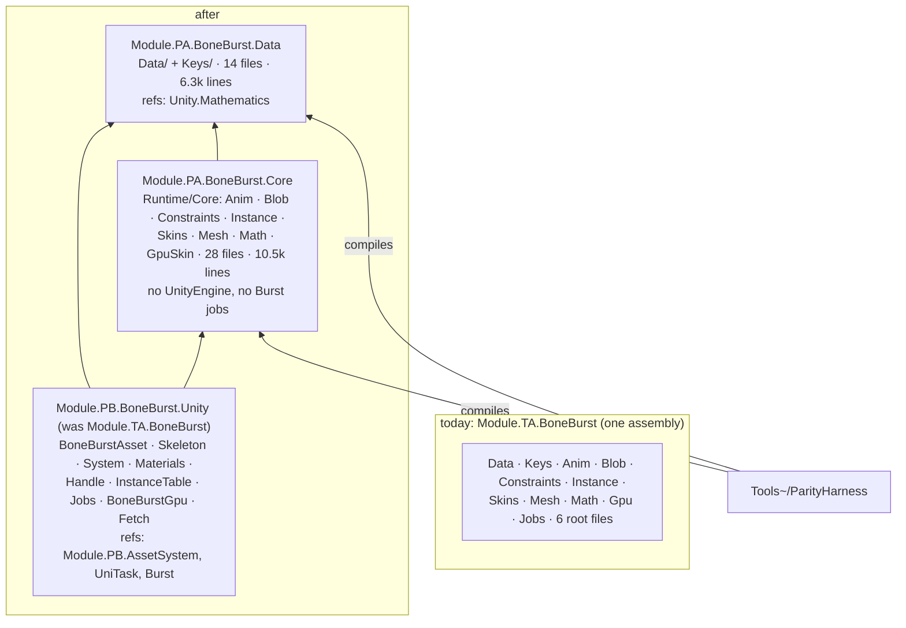
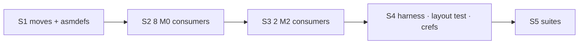

# BoneBurst — one assembly into Data, Core and the Unity front — plan

**Status:** **done 2026-10-02, S1–S5**, committed with the changelog entries. Three assemblies, `Module.PA.BoneBurst.Data` /
`Module.PA.BoneBurst.Core` / `Module.PB.BoneBurst.Unity`; every suite in M0 and M2 passes, the harness compiles the
two lower assemblies with no exclude list. Results in §6; decisions in §5.

`Module.TA.BoneBurst` is one assembly of 54 files and ~20,700 lines that does three jobs: it reads and writes the Spine
format (definitions, JSON / binary / atlas readers, the `.sbdata` writer, name keys), it runs the pose and mesh logic
(blob, animation, constraints, skins, mesh building, GPU-skin math), and it is the Unity front (components, the
system and its Burst jobs, GPU buffers, materials, the AssetSystem-backed asset). Nothing enforces the direction between
them today: no folder happens to use a root file, but only by convention. This plan makes it three assemblies, so the
compiler enforces data ← core ← front, the pose path stays free of UnityEngine, and the strict-float parity harness
compiles two whole assemblies instead of a hand-kept exclude list.

## 1. What the code says (measured 2026-10-02)

**Folder → folder type use** (type names declared in one folder and named in another; doc comments excluded by
hand where noted):

*   **The core folders form one cycle**: `Blob` ↔ `Anim`, `Instance` ↔ `Anim`, `Instance` ↔ `Constraints`,
    `Instance` ↔ `Gpu/GpuSkin`, `Math` ↔ `Instance`, `Skins` ↔ `Blob`/`Instance`, `Constraints` → `Mesh`, … They
    cannot be split from one another without redesign; they are one assembly, **Core**.
*   **`Data` + `Keys` use nothing else in the package.** (`Data` → `Anim.Step` was a false hit: `Step` is a field of
    `PhysicsConstraintDef`.) `Keys` → `Data` (`SkeletonDef`) and `Data` → `Keys` (`BoneBurstKeyTable`) make them one
    assembly, **Data**.
*   **No folder uses a root file**, and `Jobs/`, `Gpu/BoneBurstGpu.cs`, `Gpu/BoneBurstFetch.cs` are used only by
    the root files (`BoneBurstSystem`, `BoneBurstSkeleton`, `BoneBurstMaterials`, `BoneBurstAsset`); the core's
    mentions of them are doc comments (`MeshBuilder`, `InstanceData`, `ManagedPose`). That is the **front**.
*   This is the line `Tools~/ParityHarness/ParityHarness.csproj` already draws by hand: it compiles `Runtime/**`
    minus the six root files, `Jobs/**`, `BoneBurstGpu.cs` and `BoneBurstFetch.cs` — Data + Core exactly.

| | files | lines | `unsafe` files | UnityEngine files | Burst files | `internal` uses |
|---|---|---|---|---|---|---|
| Data | 14 | 6,327 | 0 | 2 (`Keys`: `PropertyName`, `PropertyAttribute`, `[SerializeField]`) | 0 | 7 |
| Core | 28 | 10,473 | 19 | **0** | 0 | 35 |
| Front | 12 | 3,877 | 6 | 8 | 4 | 67 |

*   Namespaces do not follow folders (`Gpu`, `Keys`, `Math`, `Mesh`, `Skins` and the root are all `BoneBurst`; the rest
    `BoneBurst.<Folder>`), so moving files changes **no** call site (CLAUDE.md §4: namespaces are preserved).
*   No `[SerializeReference]` anywhere. Serialized types: `BoneBurstAsset`, `BoneBurstSkeleton` (stay in the front,
    same assembly name: nothing changes for scenes or prefabs) and the struct `BoneBurstKey` (moves to Data; a plain
    serialized struct carries no assembly tag, so M2's prefab and the timeline clips keep their keys).

**Consumers that reference `Module.TA.BoneBurst` today** — 10 asmdefs; Unity references are not transitive, so each
adds exactly the new assemblies its files name:

| Project | Assembly | Will name |
|---|---|---|
| M0 | `Module.TA.BoneBurst.Editor` (bake, drawer, drop, preview) | Data, Core?, front |
| M0 | `Module.TA.BoneBurst.Tests.Editor` | Data, Core, front |
| M0 | `Module.TA.BoneBurst.Tests` (play) | Data, Core, front |
| M0 | `Module.TA.BoneBurst.Tests.SpineUnity` | Data, Core |
| M0 | `Module.TB.BoneBurstTimeline` (+ `.Editor`, `.Tests`, `.Tests.Editor`) | Data, Core, front |
| M2 | `Module.TC.CCP.Spine2D` (`BoneBurstKey`, `BoneAnimationState`, `BoneBurstSkin`, `SkeletonBlob`) | Data, Core, front |
| M2 | `Module.TC.CCP.Tests.PlayMode` | Data, front |

## 2. Design

*   **D1 — three assemblies, not two.** A two-way "Data / everything else" split would leave MonoBehaviours, the
    AssetSystem (pb-creator-base) and UniTask inside "Core", so Core would still reach Unity's object world and
    nothing would stop it from reaching further. The front is the third job and gets the third assembly.
*   **D2 — names and tiers** (CLAUDE.md §4, data low / managers up):
    *   `Module.PA.BoneBurst.Data` — **P**: the format is data plus its primary functions (read, write, key). Lowest
        band. A `P` assembly inside a `TA`-coded package is allowed (only an assembly *above* its package's tier is
        flagged).
    *   `Module.PA.BoneBurst.Core` — **P**: the runtime pose logic; it names only Data and Unity packages, so it can
        sit in the same band as Data (§5).
    *   ~~`Module.TA.BoneBurst` keeps its name~~ — **decided otherwise**: the front becomes `Module.PB.BoneBurst.Unity`
        (§5 says what that changes).
*   **D3 — folders.** Each asmdef owns one folder (an asmdef claims its folder and every subfolder):
    *   `Runtime/Data/` → `Module.PA.BoneBurst.Data`; `Runtime/Keys/` moves into it as `Runtime/Data/Keys/`.
    *   `Runtime/Core/` (new) → `Module.PA.BoneBurst.Core`; `Anim`, `Blob`, `Constraints`, `Instance`, `Skins`,
        `Mesh`, `Math` move into it, and `Gpu/GpuSkin.cs` into `Runtime/Core/Gpu/`.
    *   `Runtime/` keeps the front asmdef (renamed `Module.PB.BoneBurst.Unity.asmdef`), the six root files, `Jobs/`, `Gpu/BoneBurstGpu.cs`,
        `Gpu/BoneBurstFetch.cs` and `Shaders/` (the shaders do not move, so the GUIDs the bake writes stay valid).
    *   Moves through `AssetDatabase.MoveAsset` (GUIDs and `.meta` kept, CLAUDE.md §7).
*   **D4 — references.**
    *   Data: `Unity.Mathematics`. Keys needs UnityEngine (`PropertyName`), so Data keeps engine references.
    *   Core: Data, `Unity.Mathematics`, `Unity.Collections`; `allowUnsafeCode`. It uses **no** UnityEngine type: try
        `noEngineReferences: true` and keep it only if it compiles (Unity.Mathematics may count as an engine module in
        6.6); either way the reference list is the guard.
    *   Front: Data, Core, Burst, Collections, Mathematics, `Module.PA.Base`, `Module.PB.AssetSystem`, `UniTask`;
        `allowUnsafeCode` (as today).
*   **D5 — internals.** Each assembly gets an `AssemblyInfo.cs` with `InternalsVisibleTo` for the assemblies that use
    its internals, as the front has today (editor, tests, timeline). Core → front is the heavy one (the system
    and skeleton drive `InstanceData`). Nothing is widened to `public` to make the split compile; a member that a
    *consumer outside the package* needs is a separate decision.
*   **D6 — the harness follows the assemblies.** `ParityHarness.csproj` compiles `Runtime/Data/**` and
    `Runtime/Core/**` with **no Exclude list**. A Unity-facing file added to the front can no longer leak into it, and
    a file added to Core that needs the front fails in Unity first.
*   **D7 — a layout test.** One edit-mode test reads the three asmdefs and asserts the direction (Data names no
    BoneBurst assembly; Core names Data and no front, no AssetSystem, no UniTask, no Burst) — the same guard M2's
    Heathen split has (`HeathenAssemblyLayoutTests`). The compiler enforces types; the test enforces that nobody adds a
    reference "to make an error go away".
*   **D8 — doc crefs.** The few `<see cref>`s in Core that name front types (`BoneBurstFetch`, `BoneBurstGpu`)
    become `<c>…</c>`, so XML docs stay resolvable from the assembly they are in.

**Not in this plan** (worth their own): splitting `BoneBurstAsset`'s jobs (AssetSystem loading vs material cache vs
blob), and the timeline package's own layout.

## 3. Steps

| Step | Deliverable | Verification |
|---|---|---|
| **S0** | Editor closed for M0 and M2 (a half-done split puts both in Safe Mode), or done in one `run_script` pass and recompiled once | — |
| **S1** | D3 moves + the two new asmdefs and their `AssemblyInfo.cs` (D4, D5) | M0 compiles; `tiercheck` 0 cycles, 0 new edges, no legacy names |
| **S2** | the 8 M0 consumer asmdefs (§1 table), each with exactly what it names | M0 compiles clean, no new warnings |
| **S3** | M2's `Module.TC.CCP.Spine2D` and `Module.TC.CCP.Tests.PlayMode` (same session: M2 compiles BoneBurst from this folder) | M2 compiles; M2-Sample-25DL-Shader compiles (it takes M2's CCP) |
| **S4** | D6 harness csproj, D7 layout test, D8 crefs | harness 191 of 191 bit-exact; the layout test fails when Core is given a front reference on purpose, passes without |
| **S5** | full suites + docs | M0: Editor 386 + 1 skipped, SpineUnity 24, play 37, timeline 14 / 13; M2: `BoneBurstCharacterTest` 6, CCP play 17; the demo scene's 5 skeletons attach; M0 `CLAUDE.md` (package table, §4 "Today"), `BoneBurst-Plan.md` paths, this plan's status |

Measured on the way (not a goal, a check): editing `BoneBurstSkeleton.cs` recompiles ~3.9k lines of BoneBurst
instead of ~20.7k.

## 4. What it costs, honestly

*   **10 asmdefs in two projects** change, two of them in M2 — which compiles BoneBurst from this folder, so M0 and
    M2 must change in the same session (and commit together).
*   **More `InternalsVisibleTo`** lists to keep (three instead of one).
*   **Paths in docs** change (`Runtime/Anim/…` → `Runtime/Core/Anim/…`) — plans, the test report, the changelog's
    history stays as written.
*   **No behaviour change, no data change**: namespaces, GUIDs, serialized fields and the front's assembly name stay.

## 5. Decisions (owner, 2026-10-02)

*   **Q1 — three assemblies.**
*   **Q2 — names: `Module.PA.BoneBurst.Data`, `Module.PA.BoneBurst.Core`, and the front renamed to
    `Module.PB.BoneBurst.Unity`.** The owner asked for `Module.PA.BoneBurst.Unity`. The front references
    `Module.PB.AssetSystem`, and `tiercheck.py` compares bands inside a tier (`PA` < `PB`), so `PA` would be an upward
    edge and fail the gate. `PB` is the lowest code that covers its references (`Module.PA.Base`,
    `Module.PB.AssetSystem`, UniTask, Unity packages); the name is otherwise the owner's.
*   **What the rename changes** against §2 D2 (which assumed the front kept its name):
    *   every consumer asmdef replaces `Module.TA.BoneBurst` with `Module.PB.BoneBurst.Unity` (plus Data and Core
        where it names them);
    *   every `InternalsVisibleTo("Module.TA.BoneBurst…")` string is renamed;
    *   scenes and prefabs keep working: a `MonoBehaviour` / `ScriptableObject` is found by its script's GUID, and the
        `.cs` files of `BoneBurstAsset` and `BoneBurstSkeleton` do not move. `m_EditorClassIdentifier` is an
        editor cache and is rewritten on the next save;
    *   the asmdef file is renamed through `AssetDatabase.MoveAsset`, so its GUID stays (a consumer that references it
        by `GUID:` keeps working; by name, it is edited).
*   **Folder for Core:** `Runtime/Core/` (D3's `Runtime/Logic/` renamed to match the assembly).
*   **Editor and test assemblies keep their names** (`Module.TA.BoneBurst.Editor`, `.Tests`, `.Tests.Editor`,
    `.Tests.SpineUnity`, the timeline's `Module.TB.*`): each references only lower codes, so the gate passes, and the
    owner named only the three runtime assemblies.

## 6. Results (2026-10-02)

*   **S0** M0's Editor was closed, so the moves were `git mv` on disk (each `.meta` moved with its file: GUIDs kept);
    M2's Editor then picked everything up in one refresh.
*   **S1** `Runtime/Keys` → `Runtime/Data/Keys`; `Anim`, `Blob`, `Constraints`, `Instance`, `Skins`, `Mesh`, `Math` →
    `Runtime/Core/`; `Gpu/GpuSkin.cs` → `Runtime/Core/Gpu/`; `Module.TA.BoneBurst.asmdef` →
    `Module.PB.BoneBurst.Unity.asmdef` (same GUID). New `Module.PA.BoneBurst.Data` (refs Unity.Mathematics) and
    `Module.PA.BoneBurst.Core` (refs Data, Collections, Mathematics; unsafe), each with an `AssemblyInfo.cs` opening
    internals to the assemblies above it, the editor, tests and timeline. **Changed from D4:** Core keeps engine
    references: `NativeArray` and `Allocator` live in UnityEngine.CoreModule, so `noEngineReferences` cannot be set;
    the layout test's source scan (`Core_UsesNoUnityEngineNamespace`) is the guard instead.
*   **S2/S3** consumers, each with what it names (Unity references are not transitive): the compiler asked for two
    the type scan missed, both implicit uses through a member: `Module.TA.BoneBurst.Editor` → Core
    (`BoneBurstEditModePreview` reads `InstanceData`) and `Module.TC.CCP.Tests.PlayMode` → Data (`BoneBurstKey`
    through the handle's mapping). `Module.TA.BoneBurst.Tests.SpineUnity` and `Module.TB.BoneBurstTimeline.Editor`
    no longer reference the front / take only the front. M2 and M2-Sample-25DL-Shader compile with 0 errors; the
    sample's converted scene finds `BoneBurstSkeleton` in `Module.PB.BoneBurst.Unity` and attaches (no missing script).
*   **S4** `ParityHarness.csproj` compiles `Runtime/Data/**` + `Runtime/Core/**`, no Exclude: **191 / 191** bit-exact.
    (The old exclude list had let `BoneBurstHandle.cs` and `InstanceTable.cs` into the harness; they are front files
    and are now out.) `Tests/Editor/Layout/BoneBurstAssemblyLayoutTests.cs`: 21 cases; with `Module.PB.AssetSystem`
    added to Core's asmdef on purpose, `LowerAssembly_ReferencesNoFrontDependency(Core)` failed naming it, and passed
    again once removed. Seven crefs from Data/Core to front types became `<c>`.
*   **S5** M0: Editor 409 + 1 skipped of 410 (387 at the last run; 21 of the new ones are the layout cases), SpineUnity 24,
    play 37, timeline 14 / 13. M2: CCP play 17 / 17 (includes `BoneBurstCharacterTest` 6). `tiercheck.py`: M0 PASS
    (0 cycles, 0 upward); M2 0 new upward edges, its only failure the 30 known ua-fishnet-addon placements. Docs: M0
    `CLAUDE.md` (diagram, package table, §4 Today), both `Licence.md` diagrams, `BoneBurst-ParityPlan.md`. Finished
    plans keep their old paths as written.
*   **Not done:** the editor and test assemblies keep `Module.TA.*` names (§5); no recompile-time measurement.
