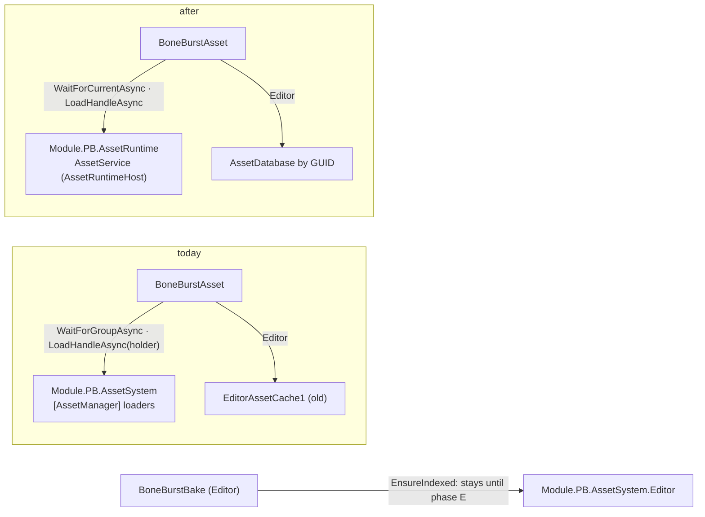

# BoneBurst on AssetSystem V2 (`AssetRuntime`) — plan

**Status:** **done 2026-10-03**, committed (owner: "need update to use New AssetSystem"). V1–V5 verified; V6 docs at
commit. Results in §4.

M2 replaces its AssetSystem with **V2**: a pure core `Module.PA.AssetCore` and a managed shell `Module.PB.AssetRuntime`
(namespace `AssetRuntime`). The old `Module.PB.AssetSystem` is frozen and will be deleted (M2
`pb-creator-base/Doc/Review/D70-AssetSystem-V2-Decision.md`, `AssetSystem-Native-Core-Plan.md` §5.7, phase D). Callers
move package by package; V2 already runs beside the old system in M2 (D1). BoneBurst's runtime loads its data, pages,
shader and rim masks through the old system. This plan moves them to V2, the way `tz-creator-audio` (D3) moved.

## 1. What uses the old system (checked 2026-10-03)

| Where | Uses | V2 |
|---|---|---|
| `Runtime/BoneBurstAsset.cs` (`Module.PB.BoneBurst.Unity`) | `ModuleP1.AssetSystem(.Core)`; `AssetHandle<T>`; `reference.LoadHandleAsync<T>()`, `GetLoaded<T>()`; `AssetManager.WaitForGroupAsync` before each load; `AssetManager.TexturesEntry` / `ShadersEntry` as "a loader exists"; `EditorAssetCache1` in the Editor | `using AssetRuntime`: the same extension names; `AssetService.WaitForCurrentAsync(timeout)` replaces the group wait (V2 loads by GUID, with no wrapper); "a service runs" replaces the loader checks; the Editor resolves by GUID through `AssetDatabase` |
| `Assets/BoneBenchmark/BoneBenchmark.cs` (Assembly-CSharp) | `ModuleP1.AssetSystem(.Core)`, `LoadHandleAsync` for the load benchmark | `using AssetRuntime` |
| M0 `Assets/AddressableCustom/[AssetManager].prefab` | the old `AssetManager` and its loaders | gains `AssetRuntimeHost` (M2's D1), so a player has a V2 service |
| `Editor/BoneBurstBake.cs` | `MappingMutationService.EnsureIndexed` (old **editor** tooling: SmartAddresser indexing) | **stays** until M2's phase E, as `tz-creator-audio`'s editor files did (D3) |
| Asmdefs | `Module.PB.BoneBurst.Unity` and `Module.TA.BoneBurst.Tests.Editor` reference `Module.PB.AssetSystem` | swap for `Module.PB.AssetRuntime` where a file names it; the editor keeps `Module.PB.AssetSystem.Editor` |

`IndexGenericAsset`, `AssetTypeCodes` and `[ExpectBuiltInAsset]` live in `Module.PA.Base` (namespace `ModuleP1`) and do not
move, so **no serialized reference changes**: every baked asset keeps its data, pages, shader and rim masks.

## 2. Behaviour to keep, and what V2 changes

*   **Un-indexed references:** V2 refuses them (logs, returns null; D0). BoneBurst's shader references are not addressable
    (the package's shaders, open Q4), so their ints stay −1. **A load of an un-indexed reference is skipped**, and the
    fallback `BoneBurst/Unlit` is used with one warning, as today.
*   **Start-up order:** an asset may build before the `AssetRuntimeHost`'s `Awake`. `WaitForCurrentAsync(15 s)` covers it,
    as D3's audio fix does. Outside Play Mode it returns null at once, and the Editor resolves by GUID.
*   **Handles:** `AssetHandle<T>` from `AssetRuntime`, held per page, shader and rim mask, and disposed in `Free`, as today.

## 3. Steps

| Step | Deliverable | Verification |
|---|---|---|
| **V1** | `BoneBurstAsset` on V2 (§1–2); the asmdef swap; error texts name the AssetRuntime | M0 and M2 compile; tiercheck (`Module.PB.BoneBurst.Unity` → `Module.PB.AssetRuntime`, PB → PB) |
| **V2** | Tests: texts and the test asmdef; `BoneBenchmark.cs` | M0 Editor / play / timeline suites, harness 215 |
| **V3** | M0's `[AssetManager].prefab` gains `AssetRuntimeHost` (through the Editor; existence wins) | the demo scene in Play Mode attaches by V2 (the data handle comes from `AssetService`) |
| **V4** | M2: compiles, CCP play 17 (M2's `[AssetManager]` already has the host, D1) | M2 suites |
| **V5** | A release player of the benchmark into a new `Build/` folder: BoneBurst data and pages load through V2 | the suite runs; no `[AssetRuntime]` refusal in the log |
| **V6** | Docs: M0 `CLAUDE.md` §11, `BoneBurst-AssetSystemPlan.md` note, the changelog at commit | — |

## 4. Results (2026-10-03)

*   **V1** `BoneBurstAsset`: `using AssetRuntime`; `WaitForService` replaces the group wait (it refuses an un-indexed
    reference with its reason, then `AssetService.WaitForCurrentAsync(15 s)`); `CanLoad` (Play Mode, with a service
    or an `AssetRuntimeHost` in the scene) replaces the `TexturesEntry` / `ShadersEntry` checks; an un-indexed shader is
    not requested (the Unlit fallback, as before); the Editor resolves by GUID through `AssetDatabase` instead of
    `EditorAssetCache1`. New public `LoadDataBytesAsync()`, the load `PrepareAsync` makes, so a caller without an
    `AssetRuntime` reference can get the bytes (the benchmark). A load cancelled because the service shut down is quiet.
    `Module.PB.BoneBurst.Unity` references `Module.PB.AssetRuntime` instead of `Module.PB.AssetSystem`;
    `Module.TA.BoneBurst.Tests.Editor`'s unused old reference is removed. tiercheck PASS.
*   **V2** `BoneBenchmark.cs` loads through `LoadDataBytesAsync` (Assembly-CSharp cannot name `Module.PB.AssetRuntime`,
    which is not auto-referenced). `BoneBurstPageReferenceTests`: two texts now name V2's refusal and "no AssetRuntime
    runs".
*   **V3** M0's `[AssetManager].prefab` gained `AssetRuntimeHost` (Visual scene off, seam off), beside the old manager, as
    M2's D1.
*   **V4** M2 compiles; CCP play 17 of 17 (the 6 `BoneBurstCharacterTest` included).
*   **V5** release player `Build/macOS_SpineBenchmark_IL2CPP_10/`: BurstCpu × 500 walk attached and measured (1.00 ms),
    and `-loadBench` loaded the data through V2 (first use 2.26 ms). The player log has no AssetRuntime refusal. The only
    warning was a page load cancelled at quit, now silenced (above).
*   Suites: Editor 435 + 1 skipped of 436 after the two texts, SpineUnity 24, play 37, timeline 14 / 13, harness 215.
*   **Left for M2's phase E:** the bake's `MappingMutationService.EnsureIndexed` (old editor tooling) and the old
    `AssetManager` on M0's prefab (no M0 code uses it any more).
