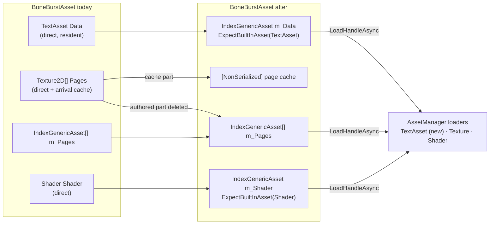
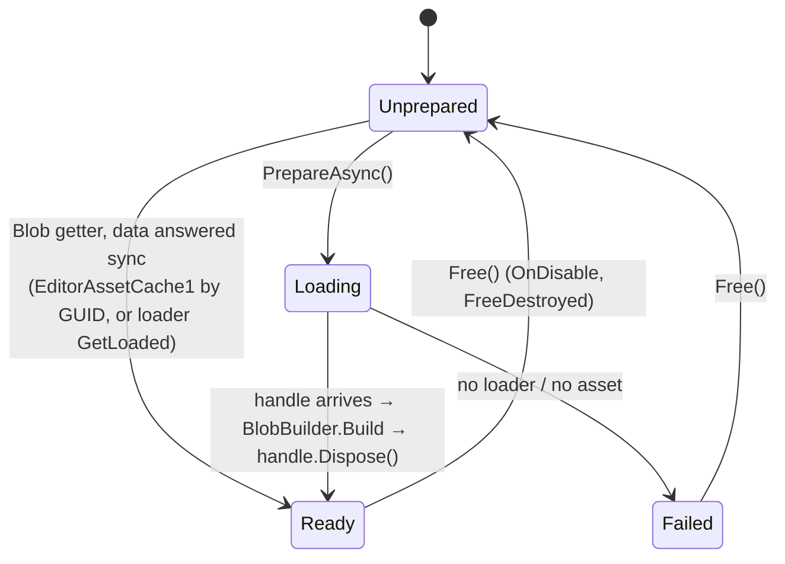
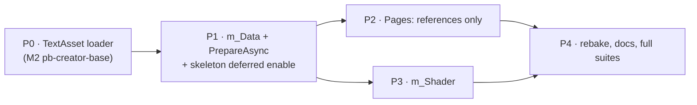
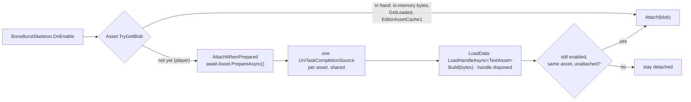

# BoneBurst — `BoneBurstAsset` on the AssetSystem end to end — plan

**Status:** **done 2026-10-01, P0–P4**, except the M2 player load (owner's check, as in IndexAssetPlan P2).
**Decided 2026-10-01 (owner: "go u recommend"):** Q1 yes — the authored `Pages` field is deleted; Q2 no —
`BoneBurstSkeleton.Asset` stays a direct reference (its own plan if wanted). Results per phase in §5; what changed
from the plan: P1–P3 landed as one pass (they all rewrite the bake's `WriteAsset`); the in-memory seams are
**public**, not internal, because an M0 player has no `AssetManager` (§5, *M0 players*); the shared prepare is a
`UniTaskCompletionSource`, not a `Preserve()`d task (a new test caught the difference); `Free()` now forgets
delivered pages. **Owner, 2026-10-01:** `spineboy-pro_Addressed.asset` deleted (its one scene user repointed to
`spineboy-pro_BoneBurst.asset` and renamed "Spineboy CPU (Unlit, idle)"; Addressables and the mapping dropped it,
the DB row went inactive); M0 gets a real `AssetManager` (its own plan); Q4 the owner fixes.

Today only the **atlas pages** go through the AssetSystem (`IndexGenericAsset[] m_Pages`, refcounted
`AssetHandle<Texture2D>`, built by `BoneBurst-IndexAssetPlan.md` and tidied by `BoneBurst-CleanAssetPlan.md`). The
other three things `BoneBurstAsset` points at are still direct Unity references: the baked data (`TextAsset Data`),
the authored page textures (`Texture2D[] Pages`) and the shader (`Shader Shader`). This plan moves all of them onto
`IndexGenericAsset`, so the asset holds **references, never objects**, and the AssetSystem decides what is in memory.
The one real gain beyond consistency: the `.sbdata` bytes are only needed until the blob is built, and a handle lets
the asset release them right after — a direct `TextAsset` stays resident as long as the `BoneBurstAsset` does.

## 1. What exists (checked on disk 2026-10-01)

| Field | Type today | Read by | Note |
|---|---|---|---|
| `Data` | `TextAsset` | `Blob` getter (sync), `BoneBurstKeyDrawer`, bake (`asset.Data = data`, `BoneBurstBake.cs:456`) | bytes read once, then never again |
| `Pages` | `Texture2D[]` | `ResolvePage`, `PageLoaded` (play-mode cache), bake Direct mode, ~10 test files | two meanings: authored override + arrival cache (CleanAssetPlan D3 kept it on purpose) |
| `m_Pages` | `IndexGenericAsset[]` | `ResolvePage`, `RequestPages`/`LoadPage` | already AssetSystem; keys baked by `EnsureIndexed` |
| `Shader` | `Shader` | `MaterialFor` (fallback `Shader.Find("BoneBurst/Unlit")`), bake settings | |

**Gaps in the AssetSystem itself** (`Packages/com.module.pb-creator-base` in M2, consumed by M0 through `file:`):

*   **No runtime loader for `AssetTypeCodes.TextAsset`.** The code exists (`AssetTypeMapping.TextAsset = 11`) and the
    editor drawer knows it (`EditorIndexObjectData.cs:169`), but `Runtime/AssetSystem/AssetSystem/Loaders/` has
    Texture, TextureAtlas, Shader, Audio, ScriptableObject, MaterialVariation and three prefab loaders — no TextAsset.
    `AssetLoaderCollection.TryGetLoaderFor<TextAsset>` falls back by Unity type and finds nothing, so
    `LoadHandleAsync<TextAsset>` returns `default` today.
*   `ShaderAssetEntryLoader` exists (`AssetManager.ShadersEntry`), so the shader needs no new loader.

**The synchronous edge.** `BoneBurstSkeleton.OnEnable` (`BoneBurstSkeleton.cs:418`) reads `Asset.Blob`
synchronously and builds `InstanceData` from it. Pages can arrive late (materials are patched on arrival); the data
cannot — no blob, no instance. So moving `Data` is the only part of this plan that changes control flow.

## 2. Design

### D1 — data as a reference, released after the blob is built

*   `[SerializeField] [ExpectBuiltInAsset(AssetTypeCodes.TextAsset)] IndexGenericAsset m_Data` replaces `Data`.
*   `public UniTask PrepareAsync(CancellationToken)` — loads the data through `LoadHandleAsync<TextAsset>()`, builds the
    blob, **disposes the data handle at once** (the bytes are copied into the blob), and kicks `RequestPages`. Repeat
    calls share one in-flight task.
*   `public bool IsReady` and `public bool TryGetBlob(out SkeletonBlob)` for callers that must not throw.
*   The `Blob` getter keeps its sync contract where an answer exists: `GetLoaded<TextAsset>()` from the loader, then
    (Editor) `EditorAssetCache1.GetAsset<TextAsset>(guid)` — the same chain `ResolvePage` uses for pages, extracted
    into one `Resolve<T>(IndexGenericAsset)` helper so data, pages and shader share it. With neither, it throws
    `InvalidOperationException("… call PrepareAsync first")`. In the Editor (Edit-mode preview, every Editor test, the
    bake) the GUID cache always answers, so nothing there becomes async.
*   **`BoneBurstSkeleton.OnEnable`**: `TryGetBlob` → as today; otherwise start `Asset.PrepareAsync()` and finish the
    enable when it completes, if the component is still enabled and its `Asset` unchanged. The rest of `OnEnable`
    moves into one `Attach(SkeletonBlob)` method so both paths run the same code. Spawners that want a skeleton live on
    its first frame await `PrepareAsync` before instantiating (documented on `PrepareAsync`).

### D2 — pages: references only, cache not serialized

*   Delete the serialized `Texture2D[] Pages`. Its cache half becomes `[NonSerialized] Texture2D[] m_PageCache`, filled
    by `PageLoaded` in every mode (no more play-mode-only write into a serialized field).
*   Its authored half goes: the bake's **Direct** mode is removed (references-only remains), and the test fixtures that
    assign dummy textures call one internal seam, `SetPageTexture(int page, Texture2D)`, which is `PageLoaded` under a
    test-facing name — tests exercise the same delivery path the AssetSystem does.
*   This **reverses CleanAssetPlan D3** ("no serialized-shape change"); see §4 Q1.

### D3 — shader as a reference

*   `[SerializeField] [ExpectBuiltInAsset(AssetTypeCodes.Shader)] IndexGenericAsset m_Shader`, empty by default.
*   `MaterialFor` resolves it through the shared `Resolve<Shader>` path; an empty reference keeps today's
    `Shader.Find("BoneBurst/Unlit")` fallback. `PrepareAsync` loads it beside the pages and holds its handle until
    `Free()`. A shader arriving after materials were built re-applies `material.shader` to the cached materials, the
    same patch-on-arrival pattern as `PageLoaded`.
*   Bake settings' shader choice writes the reference (GUID + `EnsureIndexed` keys), as pages do.

### D4 — the TextAsset loader (in pb-creator-base, M2)

*   `TextAssetEntryLoader : GenericAssetEntryLoader<TextAsset, TextAssetEntry>` in
    `Packages/com.module.pb-creator-base/Runtime/AssetSystem/AssetSystem/Loaders/`, modelled on
    `ShaderAssetEntryLoader` (311 lines, mostly statistics — the new one keeps only what `GenericAssetEntryLoader`
    requires), registered in `AssetManager` beside the others with a `TextAssetsEntry` accessor.
*   This extends the one asset system rather than adding a second path (CLAUDE.md §1.3): no BoneBurst-private loader.
    Same tier as its siblings (`Module.PB.AssetSystem`), so no new assembly edge.

### What deliberately stays

`PageLoaded`'s patch-on-arrival, `m_PageHandles` released in `Free()`, `s_Built`/`FreeDestroyed`, the bake's
`EnsureIndexed` key baking, and every key/blob/material API that the skeleton and the timeline package call.
`BoneBurstSkeleton.Asset` stays a direct `BoneBurstAsset` reference — see §4 Q2.

## 3. Phases

| Phase | Deliverable | Verification |
|---|---|---|
| **P0** | `TextAssetEntryLoader` + registration + `TextAssetsEntry`; confirm `MappingMutationService.EnsureIndexed` and SmartAddresser accept a `.bytes` file as `TextAsset` (Q3) | M2 Editor: recompile, a pb-creator-base edit-mode test loading a `.bytes` reference by GUID and releasing it (refcount 1 → 0); tiercheck |
| **P1** | `m_Data`, shared `Resolve<T>`, `PrepareAsync`/`IsReady`/`TryGetBlob`, data handle disposed after build; `BoneBurstSkeleton.Attach` + deferred enable; bake writes `m_Data`; `BoneBurstKeyDrawer` reads through `Resolve<TextAsset>` | M0: BoneBurst Editor + Play suites, timeline suites, harness 191/191 bit-exact. New tests: Blob without any answer throws the "PrepareAsync" message; a skeleton enabled before its data arrives attaches once it does, and not at all if disabled meanwhile. Deliberate bug: skip the deferred attach → that test fails |
| **P2** | delete `Pages`; `m_PageCache`; `SetPageTexture` seam; remove the bake's Direct mode; migrate the ~10 test files | same suites; the page-reference tests now also cover the formerly direct-texture fixtures |
| **P3** | `m_Shader` + arrival patch; bake settings write it | material picks the referenced shader (Editor, GUID cache); empty reference still uses `BoneBurst/Unlit` |
| **P4** | rebake the M0 assets (4 `BoneBurstAsset`s in `Assets/BoneBurstDemo/` — recount before, CLAUDE.md §7), README/Format docs, this plan's status | full re-run; the demo scenes render in Play mode; **M2 player load** (loader present, baked keys) stays the owner's check, as in IndexAssetPlan P2 |

No migration tooling (CLAUDE.md §3): the field types change, the 4 demo assets are rebaked from their exports.

## 4. Open questions

*   **Q1 (owner) — delete the authored `Pages`?** Recommended **yes**: it is the last direct texture reference, it keeps
    a field with two meanings that CleanAssetPlan could only document, not fix, and the cost is the bake's Direct mode
    plus a test seam. The case for keeping it: Direct mode lets M0 render without SmartAddresser indexing. Since the
    Editor GUID cache already renders references without any loader, that case is weak.
*   **Q2 (owner) — should `BoneBurstSkeleton.Asset` become an `IndexGenericAsset` (`ExpectScriptObject`) too?**
    Recommended **not in this plan**: it changes the skeleton, the drop tool, the key drawer, the edit-mode preview and
    the timeline package, and a `BoneBurstAsset` holding only references is already small. Worth its own plan if
    skeleton assets should be unloadable as a whole.
*   **Q3 (P0) — does `EnsureIndexed` index a `.sbdata.bytes` file?** The type recognizer accepts `TextAsset`
    (`EditorIndexObjectData.cs:169-174`); whether the file's folder is in a SmartAddresser rule in M2 decides whether
    the baked ints are real or `-1`. Answer on disk in P0, before P1 depends on it.
*   **Q4 (P3) — `Shader.Find` in a player.** The fallback needs `BoneBurst/Unlit` in Always Included Shaders; with
    `m_Shader` set by the bake, the fallback becomes Editor/test-only. Decide in P3 whether the bake always writes it.

## 5. Results (2026-10-01)

*   **P0** (M2): as in the Status of the earlier revision — `TextAssetEntryLoader`, `TextAssetEntry`,
    `AssetManager.textAssetEntryLoader` / `TextAssetsEntry` / `GatherLoaders`, a `TextAsset` child wired on
    `Assets/Resources/[AssetManager].prefab` by `run_script` (the save also dropped orphaned `staticConfig` data).
    `TextAssetEntryLoaderTests` 2 of 2 (M2 play mode). Q3: `EnsureIndexed` is type-generic; M0's bake now gives
    both `.sbdata.bytes` files real keys (group 1, indices 4 and 5 in `Packed Assets`). Not wired: the separate
    `AssetManager`s in M2's `Scene_Test.unity` and `PModule.unity`.
*   **P1** `BoneBurstAsset`: `m_Data` (`ExpectBuiltInAsset(TextAsset)`), `DataReference`, `SetData`, `HasData`,
    `IsReady`, `TryGetBlob`, `PrepareAsync`; one `Resolve<T>` (loader cache → Editor GUID cache) serves data, pages
    and shader; the data handle is disposed as soon as the blob is built. `BoneBurstSkeleton.OnEnable` →
    `TryGetBlob` or `AttachWhenPrepared` → `Attach`. `PrepareAsync` was first a `Preserve()`d `UniTask`:
    `TwoSkeletonsWaiting_ShareOneLoad` failed with *"can not await twice"* — `MemoizeSource` forwards awaiters to
    the single-continuation source while pending — so it is a `UniTaskCompletionSource` (many awaiters), replaced
    when finished so a failed load retries. `LoadDataOverride` (internal static) stands in for the load in tests.
    Editor callers (`BoneBurstKeyDrawer`, `BoneBurstDrop`, `BoneBurstBakeMenu`, timeline
    `BoneBurstAnimationLookup`) use `HasData` / `BoneBurstBake.DataPathOf`.
*   **P2** pages: `Pages` deleted; `[NonSerialized] m_PageCache` takes deliveries in every mode; `Free()` now
    clears it, the delivered set and the request flag (before, a rebuilt blob kept textures whose handles were
    released and never asked again). Bake: `PageReferenceMode` and the popup's field deleted; references only.
*   **P3** shader: `m_Shader` (`ExpectBuiltInAsset(Shader)`), `ShaderReference`, `SetShader`; `ResolveShader` →
    in-memory → loaded handle → `Resolve<Shader>` → `BoneBurst/Unlit`; `RequestShader`/`LoadShader` hold one
    handle released in `Free()`; `ShaderLoaded` patches cached materials. The bake writes the reference
    (`BoneBurstBake.ShaderReference`); `BoneBurstBake.ShaderOf` reads it back for rebake settings and variants.
*   **In-memory content** (`SetDataBytes`, `SetPageTextures`, `SetShaderAsset`, never serialized) replaced every
    test fixture's `Data = new TextAsset(…)` / `Pages = …` / `Shader = …` (13 test files).
*   **P4**: the 4 `BoneBurstAsset`s rebaked by `run_script` (exports found through each data file's bake record;
    the Lit2D variant re-declared, since variants are found through a data reference the old field could not
    carry); `spineboy-pro_Addressed.asset` given the main asset's references. Check by `run_script`: all 4 build
    their blob from references alone, textured, `BoneBurst/Unlit` (Lit2D variant: `BoneBurst/Lit2D`).
*   **M0 players.** M0 has no `AssetManager`, so a references-only asset cannot load in an M0 player (the Editor
    is unaffected: the GUID cache answers). The benchmark (`Assets/BoneBenchmark`, a player tool) therefore carries
    `BurstData` + `BurstPages` and hands them to the asset in memory at `Start`; `BoneBenchmarkLoad.Measure` times
    those bytes. Wired in `BoneBenchmark.unity` by `run_script` (3-line diff).
*   **Verification** (M0, live Editor): BoneBurst Editor 386 + 1 skipped of 387 (381 before + 6 new: data
    reference by GUID, not-in-hand → `PrepareAsync` message, no-loader failure and retry, no data, shader
    reference and empty → Unlit, `Free` forgets deliveries); SpineUnity 24 of 24; timeline Editor 14 of 14;
    BoneBurst play 37 of 37 (34 + 3 deferred attach); timeline play 13 of 13; harness 191 of 191 bit-exact;
    tiercheck M0 PASS. Deliberate bug (skip `Attach` after the wait): `EnabledBeforeTheData_AttachesWhenItArrives`
    and `TwoSkeletonsWaiting_ShareOneLoad` failed, restored → 3 of 3. M2 tiercheck reports 30 new package
    placements, all `com.module.ua-fishnet-addon` assemblies, unrelated (0 cycles, 0 new edges from this work).
*   **Q4, still open.** The BoneBurst shaders live in the package, in no Addressables group, so their references
    keep `-1` ints: a player with a loader cannot load them by key and falls back to `BoneBurst/Unlit` — a Lit2D
    asset would render unlit there. Either add the package's `Runtime/Shaders` folder to a SmartAddresser rule, or
    keep both shaders in Always Included Shaders and resolve by name. Owner's call.

*   **Follow-up 2026-10-01 (M0 player, `com.module.pb-creator-base/Doc/Review/AssetManager-Setup-M0-Plan.md`
    P4):** in a player, `PrepareAsync` at scene start failed — the load ran before the AssetSystem's group wrappers
    resolved. `LoadData`, `LoadPage` and `LoadShader` now await `AssetManager.WaitForGroupAsync(group, 15 s)`
    first, the same contract MasterAudio and CCP's `CharacterSetup` follow (`WaitForGroup`; no manager in the scene
    → no wait). The M0 benchmark and the `[AssetManager]` prefab come from that plan; the benchmark's in-memory
    fields are gone and the seams are `internal` again. Suites unchanged after the fix.
