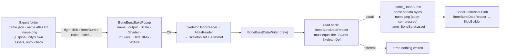

# BoneBurst bake — plan

**Status:** B1–B5 done and verified in Unity (2026-09-30). Right-click a Spine JSON export folder › BoneBurst › Bake Folder… gives a folder of baked data, page textures and a `BoneBurstAsset`; the demo and the benchmark run on it. Results per phase below.

The artist drops a Spine **JSON** export into Unity: the `.json`, `.atlas.txt` and page `.png`, from the Spine Editor or from an AI tool such as godmodeai. spine-unity still generates its own assets there, and that folder is not touched. They right-click the folder, pick **BoneBurst › Bake Folder…**, and a small popup asks for the name and settings. **OK** writes a new folder holding only what BoneBurst loads: one `BoneBurstAsset`, one baked data file and a copy of each page texture. The runtime then never parses JSON or an atlas again.



## 1. Why a baked format, and why not only `PropertyString`

`spineboy-pro.json` (measured): **193 KB**. It has 13,652 numbers written as text, and 658 string uses but only 144 distinct strings. Every load parses it again and compares names as strings.

**`PropertyString` fixes the lookup, not the file.** It turns a name into an int by hashing it when called. The file still holds every name as text, the hash runs on each call, and two names can collide unseen.

**The baked format does the whole job at bake time:**

| | JSON today | `PropertyString` idea | Baked `.sbdata` |
|---|---|---|---|
| Numbers | text, parsed each load | same | raw `float32` / varint, copied |
| Names | 658 uses as text | same | **144 strings once**, in a string table; every use is an index |
| Name → index | string compare | hash per call | **key id computed at bake** (same `PropertyName` hash as M2's `PropertyString`), collisions fixed at bake with `(A)`, `(B)` (as `BoneBurstKeys` does), stored beside the index |
| Colors | hex text | same | 4 bytes RGBA8, lossless (the JSON stores bytes) |
| Curves | 4 control points | same | 4 control points; the loader runs the same `CurveBaker` the readers run |
| Checked | at load | at load | **at bake**: read back and compared, then a version header and a content hash |

So `PropertyString` compatibility is kept: the same int ids work, and a key id resolves to an index by table lookup, not by hashing or comparing strings. **Estimate** for spineboy-pro: about 60 KB, of which about 55 KB is the 13,652 floats. To be measured in B2.

**Exact, not lossy.** Every value is stored as the JSON reader produced it. Quantizing floats to 16 bits would roughly halve the size, but it breaks the parity with stock that the tests prove. It stays out of v1.

## 2. The format (`.sbdata.bytes`, version 1)

```
header     magic "SBD1" · format version · source hash (skeleton.hash + SHA-1 of the json) · Scale
strings    count · UTF-8 strings, each once
keys       per kind (Animation, Skin, Event, Slot, Bone): count · (key id, string index, index)
skeleton   bones · slots · constraints · skins/attachments · events · animations/timelines
atlas      pages (name, size, filter, PMA) · regions (name index, page, uv, offsets, rotate)
```

- The skeleton section follows `SkeletonDef` field by field (`Runtime/Data/SkeletonDef.cs`, `TimelineDef.cs`). Links such as `MeshDef.SourceMesh` and `TimelineAttachment` are stored as indices. Everything derived (`CurveBaker` curves, `WorldVerticesLength`, path lengths) is rebuilt by the loader with the same code the JSON reader uses.
- **The atlas goes inside the file.** One data file, and no `.atlas.txt` in the output, so spine-unity's importer (`AssetUtility`, triggered by `.json`, `.skel.bytes` and `.atlas.txt`) ignores the output folder.
- Nonessential JSON fields (`images`, `audio` paths, `x/y/width/height` hints) are dropped unless the runtime reads them. B1 checks each one against the code.

## 3. Runtime changes (beta, clean break, `CLAUDE.md` §3)

- `BoneBurstAsset`: `SkeletonFile` + `AtlasFile` are replaced by **`Data`** (the `.sbdata.bytes` TextAsset). `Blob` reads it with `BoneBurstDataReader`, then `BlobBuilder.Build` as today.
- **Keys move into the data.** `BoneBurstAsset.KeyOf(kind, name)`, `TryGet(id)` and `NameOf` read the baked key table. The `BoneBurstKeys` asset and `BoneBurstKeysBaker` are deleted, and `BoneBurstAssetCreator` is replaced by the bake. `PlayAnimation` and `SetSkin` keep taking a key or its int id.
- Demo assets are re-baked: `Assets/BoneBurstDemo/spineboy-pro_BoneBurst/`, and the demo scene is switched to them. The benchmark's BoneBurst side is switched too.
- Parity tests keep reading the **source JSON** with `SkeletonJsonReader`: they test BoneBurst against stock, and the bake is tested against the JSON (§5).
- **`BoneBurstDataWriter` lives in `Runtime/Data/`, not `Editor/`.** It needs no `UnityEditor` API. The five play-mode test classes that set `SkeletonFile` / `AtlasFile` from sample JSON today (`AnimationPlayModeTests`, `VertexFetchPlayModeTests`, `BoneBurstSkeletonPlayModeTests`, `GpuSkinningPlayModeTests`, `BoneBurstPerfTests`) then bake in memory. `Module.TA.BoneBurst.Tests` is an all-platforms assembly and cannot reference the Editor one.

## 4. The Editor flow

- **Menu:** `Assets › BoneBurst › Bake Folder…`. Always enabled (owner's choice, 2026-10-01: a greyed-out item gives no reason). The target is the selected folder, or the folder of a selected file, or with nothing selected the folder open in the Project window (`Selection.assetGUIDs`: a right-click in the folder tree can leave `Selection.activeObject` null). When that is not one folder with exactly one `.json`, one `.atlas.txt` and every page the atlas names, the click logs **one** error listing every problem and opens nothing; never a silent no-op (§9). The Rebake command logs its errors the same way; no dialogs.
- **Popup (`BoneBurstBakePopup`, modal).** `CLAUDE.md` §8 puts a window last. This one is justified as a recurring, multi-field step asked for by the owner, and it has no other job. Fields:
  - Name, default the JSON's name.
  - Output folder, default `<parent>/<name>_BoneBurst`.
  - Scale (0.01), Shader (Unlit / Lit2D), TintBlack, DefaultMix, Mixes.
  - Texture: max size (default the atlas page size), compression (default on, platform default format), no mipmaps.
  - Variants (since improvement plan I5): more `BoneBurstAsset`s, `<name>_BoneBurst_<suffix>.asset`, each with its own shader and tint black, sharing the data file, the textures and the mixes.
- **Into a scene.** Drag the baked `<name>_BoneBurst.asset` (or a variant) onto the Scene view or the Hierarchy: `BoneBurstDrop` creates a GameObject with `BoneBurstSkeleton`, the asset, a skin that draws and a looping `idle` (2026-10-01). It shows in the Scene view at once (the Edit-mode preview), frozen on the start animation's first frame, and animates in Play mode.
- **Rebake.** The source folder's GUID, the digest and the texture settings are kept in the data file's importer `userData`, and the data file carries the asset label `BoneBurstData`. Right-clicking the same source again finds the previous bake through that label (improvement plan I5; it used to read every `TextAsset`'s importer) and opens the popup with its settings filled in: name, folder, scale, the main asset's shader, tint black and mixes, and every variant beside it that uses the same data. `CONTEXT/BoneBurstAsset/Rebake` reruns without the popup, from that asset's own data file. A variant dropped from the list is left in place, never deleted.
- **Never destroys authored work (§6):**
  - The source folder is only read.
  - In the output folder, only the files the bake owns are written (the data, the page textures, the asset and its variants): the data and the asset are updated in place so their GUIDs, and every scene reference, survive, and the texture is re-copied.
  - Any other file at those paths is loaded as `Object`: a type mismatch is a loud error and nothing is written.
  - No `AssetDatabase.DeleteAsset`.
- **Report** after each bake: sizes (JSON → data, PNG memory before → after) and counts (bones, slots, animations, keys). A zero count is an error, not a pass.

## 5. Phases and checks

| Phase | Work | Check |
|---|---|---|
| B1 | Format spec in `Doc/Format/BakedData.md`; list which JSON fields the runtime reads | Every `SkeletonDef` field mapped or marked as dropped, with a reason |
| B2 | `BoneBurstDataWriter` + `BoneBurstDataReader` (both Runtime) | **Round trip on every JSON in the reader parity set:** JSON → `SkeletonDef` A → write → read → `SkeletonDef` B, A equals B field by field (a new `SkeletonDefComparer`). Then the blob built from B equals the one built from A. A deliberate writer bug must fail it (§5). Sizes recorded. |
| B3 | `BoneBurstAsset.Data`, keys in the data; delete `BoneBurstKeys`, `BoneBurstKeysBaker`, `BoneBurstAssetCreator` | EditMode: `BoneBurstKeysTests` moved to the baked keys, 15 of 15. PlayMode suite still 32 of 32. |
| B4 | Menu, popup, texture copy + import settings, rebake | EditMode test drives the bake on a temp folder: output files exist, the existing asset GUID is kept on rebake, a foreign file at the target path aborts the bake |
| B5 | Re-bake the demo and the benchmark; record sizes | Demo scene plays; benchmark load time and sizes before/after (release player, §5) |

### B1 + B2 result (2026-09-30): verified in Unity

- **Built:**
  - `Runtime/Data/BoneBurstData.cs`: the result type, the header constants, the byte streams.
  - `BoneBurstDataWriter.cs`, `BoneBurstDataReader.cs`.
  - `TimelineDef.Beziers`: both readers now record the control points through new `CurveBaker` overloads that take the `TimelineDef`; the arithmetic is unchanged.
  - Spec: [BakedData.md](../Format/BakedData.md).
- **Changed from the plan:**
  - The comparer is a generic `DeepComparer` (every public field, by reflection), not a hand-written `SkeletonDefComparer`, so a field added later cannot be missed.
  - The round trip covers the **whole** reader corpus, binary exports included, not only JSON.
  - Arrays are pooled by object, so linked-mesh and setup-pose sharing survive without special cases.
  - Deform keys are stored as the range that differs from the setup vertices.
  - Not written: `MeshDef.Edges` and the skeleton's `ImagesPath` / `AudioPath` (BakedData.md §3).
- **Checks** (Unity 6000.6.3f1, Metal):
  - `BakedDataTests` 98 of 98: round trip on 45 corpus cases (model, blob and bytes identical), keys, and six refusals.
  - Two deliberate reader bugs were caught (6 and 8 failures) and reverted.
  - The rest of the Editor suite is unchanged: 240 of 382, which is the old 142 of 284 plus these 98, with the same failures per class. Play mode 32 of 32.
- **Sizes:** spineboy-pro 194,899 → 69,501 B (36%); JSON exports in the corpus 29–65%. Spine's own binary is still 7–14% smaller: colour timelines as bytes is the candidate for format version 2.

### B3 result (2026-09-30): verified in Unity

- **`BoneBurstAsset`:**
  - `SkeletonFile`, `AtlasFile`, `Scale` and `Keys` are gone. The asset has one `Data` field (the `.sbdata.bytes`); the scale is baked into it.
  - `Blob` reads the data with `BoneBurstDataReader`. `Keys` is now a property returning the `BoneBurstKeyTable` read with it, and `NameOf` resolves through it.
- **Keys:**
  - `BoneBurstKeyTable` (`Runtime/Keys/`, namespace `BoneBurst`) replaces the `BoneBurstKeys` ScriptableObject: the same `Entry`, `BuildEntries`, `Suffix`, `TryGet`, `KeyOf`.
  - On load it recomputes every key's id. A changed `PropertyName` hash or a duplicate id is refused with "rebake", where the old asset only logged an error.
- **Deleted** (`CLAUDE.md` §3): `BoneBurstKeys`, `BoneBurstKeysBaker`, `BoneBurstAssetCreator` (with their menus), and the demo's `spineboy-pro_BoneBurstKeys.asset`. `Module.TA.BoneBurst.Editor` has no scripts until B4.
- **Tests:** the five play-mode classes bake in memory through `Tests/Runtime/Core/BakedTestData.cs`, at the scale each used before (0.01 where the asset default applied). `BoneBurstKeysTests` runs on the table and the baked asset: the binary-refusal test is gone (any readable export bakes keys), and two refusal tests are added.
- **Demo, until B5:** `Assets/BoneBurstDemo/spineboy-pro/spineboy-pro.sbdata.bytes` (69,501 B) was baked once from the JSON at 0.01 by an Editor snippet (no tool committed). Both demo assets point at it: 131 keys and 11 animations each. The demo scene and the benchmark reference those assets unchanged. B5 re-bakes them with the B4 tool.
- **Checks** (Unity 6000.6.3f1, Metal):
  - `BoneBurstKeysTests` 16 of 16.
  - The Editor suite 241 of 383: the same 142 stock-parity failures per class as before; the only change is the keys tests (one removed, two added).
  - Play mode 32 of 32.
  - **Not checked:** the demo scene by eye.

### B4 result (2026-09-30): verified in Unity

- **Built** (`Module.TA.BoneBurst.Editor`):
  - `BoneBurstBake`: finds and checks the export, reads it, checks every target, then writes. It has no UI.
  - `BoneBurstBakeSettings`: the transient object the popup edits.
  - `BoneBurstBakePopup`: UI Toolkit, modal. It shows the export found, the nine settings and a folder picker. A failed bake keeps it open with the reason.
  - `BoneBurstBakeMenu`: **Assets › BoneBurst › Bake Folder...** on any folder (an invalid export gets a dialog with the reason), and **CONTEXT/BoneBurstAsset/Rebake**.
- **Output** in `<parent>/<name>_BoneBurst/`: `<name>.sbdata.bytes`, each page texture copied under its own name, and `<name>_BoneBurst.asset`. There is no `.atlas.txt`, so spine-unity ignores the folder.
  - Texture import: no mipmaps, not readable, clamp unless the atlas repeats, filter from the atlas, alpha-is-transparency off for PMA pages.
  - Size: auto (the page size rounded up to a power of two) or a chosen maximum; compressed (the platform default) or RGBA32.
- **Where the settings live, changed from the plan:** not on the `BoneBurstAsset`, which keeps only runtime data.
  - The data file's importer `userData` holds the export folder's GUID, a SHA-1 of the JSON + atlas, and the texture settings.
  - The scale is read back from the data header; shader, tint black and mixes from the asset.
  - Each copied texture's importer `userData` marks it as this bake's.
- **Never destroys work:**
  - Every target must be empty or carry this export's record, checked before anything is written.
  - A rebake writes new bytes into the same files, so every GUID stays.
  - The export folder is only read, and there is no `DeleteAsset`.
- **Refused before writing:**
  - a folder without exactly one `.json` and one `.atlas.txt`, or missing a page;
  - an output folder outside `Assets/` or equal to the export folder;
  - a bad name, a scale of 0 or less, a negative mix;
  - a mix naming an animation that does not exist;
  - a skeleton with no bones;
  - a foreign or other-type file at any target.
- **Checks** (Unity 6000.6.3f1, Metal):
  - `BoneBurstBakeTests` 6 of 6, each on a temporary copy of spineboy-pro:
    - the three outputs;
    - data equal to the JSON (`DeepComparer`);
    - the texture importer settings;
    - the export folder unchanged;
    - a rebake keeping all three GUIDs and remembering every setting;
    - the asset's rebake finding its export;
    - a foreign file, another asset type and bad settings each writing nothing.
  - A deliberate bug (the ownership check skipped) fails the foreign-file test; reverted.
  - The popup, opened non-modally from a snippet on the demo export, builds all nine fields and its three buttons, with the defaults `spineboy-pro` → `Assets/BoneBurstDemo/spineboy-pro_BoneBurst`.
  - The Editor suite 247 of 389: the same 142 failures per class; the rest are the 6 new tests. Play mode 32 of 32.
  - **Not checked by hand:** clicking through the modal popup.

### B5 result (2026-09-30): verified in Unity

- **The demo is baked by the tool.**
  - `Assets/BoneBurstDemo/spineboy-pro_BoneBurst/` holds `spineboy-pro.sbdata.bytes`, `spineboy-pro.png`, `spineboy-pro_BoneBurst.asset`, and `spineboy-pro_BoneBurst_Lit2D.asset`, the tint-black variant pointing at the same data and texture.
  - The export folder `spineboy-pro/` is unchanged, with spine-unity's own assets still there.
- **No reference broke.** Both assets were moved with `AssetDatabase.MoveAsset` before the bake, so their GUIDs are kept, and `BoneBurstDemo.unity` and `BoneBenchmark.unity` are unchanged.
  - The main asset's data was cleared first, so the bake accepted it as its own output and filled it: "rebaked", same GUID.
  - The B3 stopgap `spineboy-pro/spineboy-pro.sbdata.bytes` was unreferenced afterwards and removed.
- **Textures uncompressed for the demo** (until 2026-10-01). The benchmark's stock side sampled the original PNG (RGBA32), so the BoneBurst side kept the same pixels. Since improvement plan I5 the demo bakes with compression on, like any new export, and the stock material samples the bake's copy (`Assets/BoneBenchmark/README.md`).
- **Fixed on the way (B4 report):** the texture sizes in the bake report came from `Profiler.GetRuntimeMemorySizeLong` right after a reimport, which gave 16 MB → 8 MB for two identical RGBA32 textures. The report now computes the GPU size of the imported format over all mips.
- **Sizes (spineboy-pro):**

  | | Export | Baked |
  |---|---|---|
  | Skeleton + atlas data | 194,899 B (`.json` + `.atlas.txt`) | 69,521 B (36%) |
  | Page texture, compression off | 8,192 KB | 8,192 KB |
  | Page texture, compression on (default, and the demo since I5; macOS Standalone) | 8,192 KB | 2,048 KB (25%) |
  | Load: parse to model + key table (median of 40, Editor Mono, **not** a player measurement) | 5.09 ms | 0.34 ms |

- **Checks** (Unity 6000.6.3f1, Metal):
  - The demo scene in Play mode, stepped frame by frame: all three skeletons mesh from the baked assets (275 / 279 / 275 vertices), the running one's bounds change between frames, and a Game view capture shows the CPU run, GPU idle and Lit2D tint-black walk drawn correctly.
  - `BoneBurstBakeTests` 6 of 6 after the report fix.
- **Not done:** a release-player benchmark run. The frame work is unchanged (the same model gives the same blob), and the benchmark does not measure load time.

## 6. Open points

- **Load speed.** The format removes JSON parsing, but `BlobBuilder` still runs at first use. Storing the built blob too would remove that, but the runtime still reads `SkeletonDef` for names and skins (`BoneAnimationState`, `BoneBurstSkeleton.SetAttachment`). Measure first (B5), and decide after.
- **Texture format per platform:** the default follows the platform (ASTC on mobile, BC7/DXT5 on desktop). A per-platform override in the popup only if needed.
- **Generated C# keys** (for example `SpineboyPro.Anim.Walk`) would catch a misspelled name at compile time. This is left out: it adds code generation, and the baked key table already fails loudly on a wrong key.
