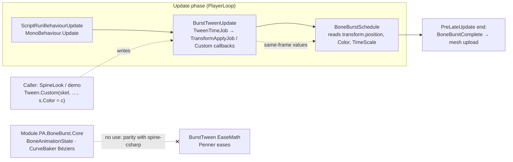

# BoneBurst × BurstTween — does BoneBurst benefit?

**Status: evaluation, 2026-10-05. No code changed.** The question was whether `com.module.ta-creator-boneburst`
gains anything from M1-Plugins-Custom's new `com.module.pa-motion-bursttween` (`Module.PA.BurstTween`, v2026.10.2).
**Short answer: not the BoneBurst runtime itself. BoneBurst should not reference BurstTween.** Its callers
(M2's `Module.TC.CCP.Spine2D`, the demo) can tween a `BoneBurstSkeleton`'s Transform, `Color` and `TimeScale`
with BurstTween today, with no change to BoneBurst. M0's manifest already has BurstTween (commit `af35eea`, for
pb-creator-base), so a caller pays no new dependency.

## Where they overlap — and why the runtime does not need it

| BoneBurst piece | Looks tween-like because… | Why BurstTween does not fit |
|---|---|---|
| Timeline curves (`Runtime/Data/CurveBaker.cs`, `TimelineApply`) | keys are interpolated with a curve | Spine's per-key Bézier is baked into 9 samples "operation for operation" as stock does, for **bit-for-bit parity** (§5, `parity-harness`). BurstTween's `EaseMath` is a different set of curves (Penner eases + baked `AnimationCurve`); using it would move BoneBurst off its parity reference. |
| Mixing (`BoneAnimationState`: `MixTime` / `MixDuration`, `Alpha`, `TimeScale`) | a crossfade is a timed 0→1 value | It is Spine `AnimationState` semantics (delays, `TrackComplete`, `MixingFrom` chains, thresholds) and is parity-tested against stock. A tween engine would duplicate one fact in two places (§4.1). |
| Frame driver (`BoneBurstSystem`: two PlayerLoop entries, dense native rows, Burst jobs) | same architecture as BurstTween's `TweenEngine` | Same *shape*, different domain: nothing to share. Both already own their PlayerLoop entries; a shared "job loop" package would be a new sibling with two owners (§4). |
| Per-frame cost | BurstTween is "faster" | BurstTween's gain is in tween bookkeeping (1.2–3.0× IL2CPP over PrimeTween, `Doc/BurstTween-Summary.md` in its package). BoneBurst's frame cost is pose + mesh (`BoneBurst-Performance.md`); BurstTween does not touch that. |

Tier-wise a reference would be legal (`Module.PB.BoneBurst.Unity` → `Module.PA.BurstTween` is PB → PA), but nothing
in `Runtime/` would call it, so it would only be an unused edge.

## Where callers do benefit

A `BoneBurstSkeleton` exposes plain settable state; BurstTween drives it with no BoneBurst change:

| Effect | How | Notes |
|---|---|---|
| Move / rotate / scale a character | `Tween.Position(skel.transform, …)` etc. | Transform rows; above BurstTween's threshold (IL2CPP 2,500 rows) the writes run in `TransformApplyJob`. Physics constraints read `transform.position` at `BoneBurstSchedule` (`BoneBurstSkeleton.cs:729`), so the move must land first — it does (next section). |
| Hit flash, fade in/out, tint | `Tween.Custom(skel, from, to, dur, (s, v) => s.Color = …)` | The `Color` setter only marks the instance dirty (`BoneBurstSystem.MarkDirty`: a set add + flag OR), so one write per frame is cheap. |
| Slow-motion, hit-stop | `Tween.Custom(skel, 1f, 0f, dur, (s, v) => s.TimeScale = v)` | `BoneBurstSkeleton.TimeScale` scales the whole skeleton; `BoneAnimationState.TimeScale` per state. |

At the consumers' scale (a few characters, tens of tweens) this costs microseconds per frame either way; the value is
the API (eases, sequences, `await`, cancellation), not speed.

## Things to know before using it

1.  **Frame order holds, by install order.** Both `BurstTweenUpdate` and `BoneBurstSchedule` are inserted directly
    after `Update.ScriptRunBehaviourUpdate`. BoneBurst installs at `SubsystemRegistration`; BurstTween installs lazily
    on its first tween (`TweenEngine.EnsureCreated`), so it lands *in front of* `BoneBurstSchedule` and Update-type
    tweens are seen the same frame. Nothing pins this: if BurstTween ever installs at load time, the order flips and
    skeleton tweens lag one frame. A caller that relies on it should have a PlayMode test (tween a skeleton's
    `Color`, step one frame, assert the instance header carries it).
2.  **`UpdateType.LateUpdate` tweens lag one frame** for BoneBurst: they run after `BoneBurstSchedule` has read the
    state. Use the default `Update`.
3.  **`Custom` tweens have no writer channel.** BurstTween's one-writer rule (its D3) covers Position, Rotation,
    Scale, Color (of CanvasGroup / Graphic / SpriteRenderer) and SizeDelta only (`WriterChannel`). Two `Custom`
    tweens on one skeleton's `Color` both run and the later write wins; the caller must stop the old one (keep the
    `Tween` handle or use `KeyedTween`).
4.  **Do not tween what BoneBurst animates.** Bone transforms, slot colors and attachments belong to
    `BoneAnimationState`; set them through the animation, not by a tween racing it.

## Recommendation

*   **BoneBurst runtime:** no change, no reference. Re-open only if BoneBurst grows a feature whose spec *is* a
    generic tween (none today).
*   **Callers** (M2 `SpineLook` / `SpineSkeletonAnimationHandle`, the demo): use `Tween.Custom` against
    `BoneBurstSkeleton` where an effect is wanted. Neither uses one today (checked 2026-10-05).
*   **Not recommended:** a typed `Tween.Color(BoneBurstSkeleton, …)` helper. It cannot live in BurstTween (PA must not
    reference PB) and a new bridge assembly for one lambda is the "new sibling" §4 warns about. Revisit if many
    callers write the same lambda.
