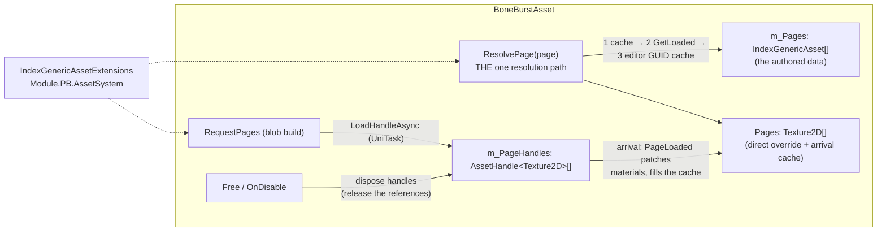

# BoneBurst — a clean AssetSystem page lifecycle — plan

**Status:** plan written 2026-10-01. **P0 done the same day** — `ResolvePage` is the one resolution path (`MaterialFor`'s page branch is a call to it); `LoadPage` holds a refcounted `AssetHandle<Texture2D>` per page (`LoadHandleAsync`), `Free()` (now internal) disposes them beside the blob/material teardown, and the lifecycle state sits in one documented region; `Pages`'s tooltip states its single meaning. Deliberate bug (the editor step of `ResolvePage` disabled) failed exactly the editor-cache test; suites Editor 380 + 1 ignored of 381, SpineUnity 24 of 24, play 34 of 34, timeline 14 and 13, harness 191 of 191 bit-exact, tiercheck clean. M0's limit stands as written: without a loader the handles stay default, so the refcount release is proven safe-and-idempotent here and truly exercised only in a project with the AssetSystem (M2). **P1's docs are folded into this status; nothing else remains.** Owner's direction: focus on making `BoneBurstAsset`'s use of the AssetSystem *clean*. What existed (index-asset plan P0+P1, same day) worked and was verified — references in `m_Pages`, `GetLoaded`/editor-cache at material time, `LoadAsync` deliveries patched into cached materials, keys baked by `EnsureIndexed` — but it grew as a retrofit onto `Pages`, and it showed. This plan was the tidy-up: one resolution path, refcounted handles with real release, and a page field whose meaning is one thing.

---

## 1. What is unclean today (measured on the shipped code)

1. **Two resolution sites.** `MaterialFor` carries the whole chain inline (direct `Pages` → `GetLoaded` → `#if UNITY_EDITOR` GUID cache → no-loader warning, ~28 lines in the middle of a material factory), while `RequestPages`/`LoadPage` walk the same fields again for the async half. Any new rule (say, a fallback order change) must be written twice.
2. **Load-and-forget.** `LoadAsync` without handles: nothing ever `Release`s a page, and `Free()` frees the blob, materials and keys but not the page references — the plan-that-was deferred this as D4. The stack's own answer is right there: `LoadHandleAsync<Texture2D>()` returns a refcounted, idempotently disposable `AssetHandle<T>`, and `HoldAssetsWhileAlive` shows the pattern (hold from request, release on destroy).
3. **`Pages` means two things.** Authored direct references (the bake's Direct mode, the benchmark, dummy textures in tests) *and* the delivery cache (`PageLoaded` writes into the serialized field, play-mode only, silently discarded). A reader cannot tell an authored texture from a cached one; `PageLoaded`'s duplicate guard needs a separate delivered-set precisely because the array cannot carry that meaning.
4. **Ad-hoc surface.** `SetPages`/`PageReferences` beside three loose pieces of resolution state (`m_PagesRequested`, `m_WarnedNoLoader`, `m_DeliveredPages`) — workable, but nothing groups them as the page lifecycle they are.

## 2. The clean design

- **D1 — one resolution path.** `Texture2D ResolvePage(int page)` internal: the `Pages` cache → `m_Pages[page].GetLoaded<Texture2D>()` → (editor) `EditorAssetCache1` by GUID → null, warning included. `MaterialFor`'s page branch collapses to a call. `RequestPages` uses it to decide what is missing. The chain exists once, in one method, with one doc.
- **D2 — handles with a lifetime.** `RequestPages` switches from `LoadAsync` to `LoadHandleAsync<Texture2D>()`; the arrived handle is kept in `AssetHandle<Texture2D>[] m_PageHandles` (the asset holds one per page — every skeleton sharing the asset shares it), the arrival still flows through `PageLoaded` unchanged (fill cache, patch cached materials, ignore duplicates). `Free()` disposes every handle — the stack's release semantics, called from exactly the place that already frees everything else the asset owns. Without a loader (M0 play scenes, the harness-less editor) `LoadHandleAsync` answers `default` and the path is a no-op, exactly like today.
- **D3 — `Pages` documented as what it is.** The authored-direct override and the arrival cache, one field, stated on the field: direct references win, deliveries land here in play mode. No serialized-shape change, no migration, no rebake — the demo, benchmark and dummy-texture tests keep working untouched. (Renaming or splitting the field is possible later; breaking every baked asset again for a name is not clean, it is churn.)
- **D4 — the lifecycle in one place.** The request flag, the warning flag, the delivered set, the handles array and `ResolvePage` live together in one `#region` with a single doc block: *references are the data, the cache is a convenience, handles are the lifetime.*

**What deliberately stays:** `PageLoaded`'s patch-on-arrival machinery (proven by deliberate-bug checks twice), the bake (references + `EnsureIndexed` keys + the Direct/references-only modes), the demo, the blob-build unaddressed-page warning.

## 3. Phases

| Phase | Deliverable | Verification |
|---|---|---|
| **P0** | `ResolvePage` extraction; `LoadHandleAsync` + `m_PageHandles` + dispose in `Free`; the lifecycle region; docs on `Pages` | compile, tiercheck; BoneBurst Editor + Play suites, timeline suites, harness; page-reference tests extended: a delivered page keeps its handle slot, `Free` disposes without throwing when handles are default (M0 has no loader — the release path's real exercise is M2's, stated honestly); deliberate-bug: skip the dispose → an M0-observable assertion? there is none — instead the deliberate bug lands on `ResolvePage` (drop the editor-cache step → the editor-cache test fails), keeping the crux covered where it is observable |
| **P1** | Changelog, this plan's status, README line if wording drifted | full re-run |

## 4. Recorded decisions

- **Handles over raw loads** — the stack's refcount is the point of using it; load-and-forget was a deferred wart, not a choice.
- **`Free()` is the release point** — the asset already owns blob/material/keys teardown there; page handles join it. Skeleton instances never touch handles (the asset is the shared owner).
- **No serialized-shape change** — clean means one meaning and one path, not another migration of every baked asset this week.
- **M2- honest limits** — refcount release and player-key loads are only exercisable where a loader exists; M0 verifies the no-op safety and the editor path, and says so.
