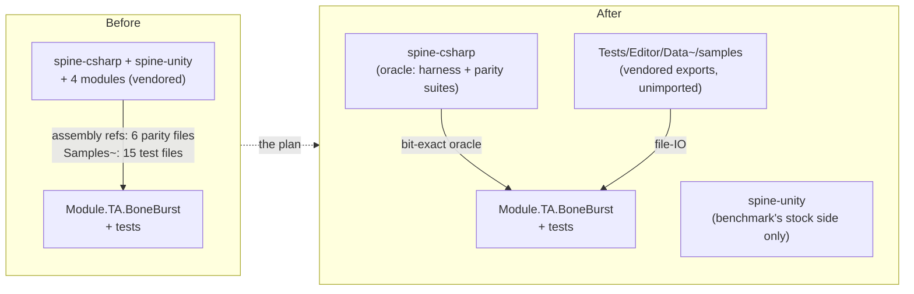

# BoneBurst — decoupled from the vendored spine-unity stack — plan

**Status:** plan written 2026-10-01. **P0 done the same day** — every export the tests read is vendored into `Tests/Editor/Data~/samples/` (all 19 sample folders, export files only, 9.9 MB; `ReaderParityTests`' corpus enumerates the folder, so the breadth is kept and the suite counts are identical before and after); the `Samples` const in all 17 reader files (11 BoneBurst + 6 timeline) points there; suites green on the new paths (BoneBurst Editor 403 + 1 ignored of 404, play 34 of 34, timeline 14 and 13, harness 191 of 191 bit-exact). **P1 redesigned by the owner's direction:** the spine-unity-comparing tests do not get ported to `ManagedPose` — they move into a **new, clean, dedicated asmdef** (`Module.TA.BoneBurst.Tests.SpineUnity`, Editor-only: `spine-csharp` + `spine-unity` + `Module.TA.BoneBurst` + the main test assembly for shared helpers), so `Module.TA.BoneBurst.Tests.Editor` drops `spine-unity` and the coupling becomes one explicitly-named, severable assembly. The wrinkle P1 must handle: `MeshGeneratorParityTests` and `GpuSkinningParityTests` (`Tests/Editor/Mesh/`) are outside the harness's compile set and move wholesale; `AnimationParityTests`, `SetupPoseParityTests` and `ParityDriftReport` are INSIDE the harness set with `#if !BONEBURST_PARITY_HARNESS`-guarded spine-unity sections — those sections are extracted into the dedicated assembly (partials cannot span assemblies), leaving the strict files pure. **P1 done the same day**: `Module.TA.BoneBurst.Tests.SpineUnity` exists (`Tests/Editor/SpineUnity/`); `MeshGeneratorParityTests` moved wholesale (24 tests); the guarded mesh sections of `AnimationParityTests` and `SetupPoseParityTests` became `StockMeshCompare` hooks that `StockMeshComparisons` installs at editor load via `[InitializeOnLoadMethod]` — null in the harness, exactly the old `#if` behaviour; `GpuSkinningParityTests`, `ParityDriftReport` and the bake tests turned out to name no spine-unity types at all and stayed untouched; the main test assembly dropped `spine-unity` (spine-csharp stays: the oracle) and granted internals to the dedicated one. Suites: dedicated 24 of 24, strict 379 + 1 ignored of 380, harness 191 of 191 bit-exact; the deliberate-bug check (sabotage in the dedicated assembly) failed the strict suite, proving the hooks are live. **P2 done the same day** — the four module packages deleted after a GUID sweep of `Assets/` proved nothing uses their shaders or scripts (the plan's asmdef-level check under-weighted material-level use; the sweep closed that). CLAUDE.md updated: modules row and SU-node module list gone, the `SU → SB` edge renamed to what remains (mesh parity through the dedicated assembly — the original "edge goes" wording predates P1's dedicated-asmdef redesign, which keeps a test-only coupling by design), the Samples~ bullet points at `Data~/samples`, §5 names the dedicated assembly. Compile, tiercheck and both Editor suites green after the deletion. **P3 (the benchmark question) remains the owner's.** Owner's direction: `Module.TA.BoneBurst` must not rely on `com.esotericsoftware.spine.spine-unity` or its modules (`urp-shaders`, `timeline`, `addressables`, `on-demand-loading`) — today's CLAUDE.md diagram draws exactly that edge (`SU → SB: sample skeletons, parity reference in tests`) and it must go. The BoneBurst package becomes movable to a project that has none of the vendored Spine stack.

Measured inventory of the reliance (grep, 2026-10-01):

- **Assembly references:** one asmdef — `Module.TA.BoneBurst.Tests.Editor` references `spine-unity` (and `spine-csharp`). The runtime, editor and play-test asmdefs reference no Spine assembly.
- **spine-unity types, six Editor test files:** `MeshGeneratorParityTests`, `GpuSkinningParityTests` (meshes vs spine-unity's `MeshGenerator`), `AnimationParityTests`, `ParityDriftReport`, `SetupPoseParityTests` (colour-space and mesh-side helpers), `BoneBurstBakeTests` (expects the spine-unity *importer's* error log when a raw export appears under `Assets/`).
- **Stock spine-csharp as the oracle:** the Parity/Pose/Anim/Constraints/Skins suites and the strict-float harness (`Tools~/ParityHarness` compiles spine-csharp from source beside the managed runtime; 191 of 191 bit-exact).
- **Sample data by file-IO:** 11 BoneBurst test files and 4 timeline-package test files read `Packages/com.esotericsoftware.spine.spine-unity/Samples~/…` exports (spineboy-pro, raptor, celestial-circus, …). The benchmark reads none (it uses baked assets) but keeps spine-unity for its stock side.
- **The four modules:** referenced by nothing in either of our packages — pure vendored weight.

---

## 1. What changes, file by file

**Test data moves home (P0).** Every export the tests read is vendored into `Packages/com.module.ta-creator-boneburst/Tests/Editor/Data~/samples/` (the `Data~` tilde keeps Unity from importing it — the precedent is the existing `Data~/synthetic` and `Data~/m2-mix-and-match`). The `Samples` const in the 11 BoneBurst test files and the 4 timeline-package test files points there (another package's `Data~` is readable by path — the timeline package keeps no data of its own). The folder list is enumerated by grepping the `Spawn(...)`/const usages at implementation time; spineboy-pro, raptor and celestial-circus are known. The benchmark stays on its own baked assets.

**The spine-unity assembly goes (P1).** `Module.TA.BoneBurst.Tests.Editor` drops `spine-unity`, keeps `spine-csharp`. The six files:

- The two mesh-parity suites and `ParityDriftReport`'s mesh side compare against **`ManagedPose`** (our managed reference) instead of spine-unity's `MeshGenerator`, plus mesh-convention checks that never needed spine-unity (tint-black second stream, wide indices, vertex counts). The spine-unity validation this replaces is already recorded (386 of 386 runs, changelog 2026-09-30) and `ManagedPose` remains chained to stock through the strict harness, so the oracle chain is spine-csharp → managed → Burst, with spine-unity's mesh conventions baked into what the goldens cover.
- `AnimationParityTests` / `SetupPoseParityTests`: the colour-space and helper usages port to `ManagedPose`/local helpers.
- `BoneBurstBakeTests`: the importer-error `LogAssert.Expect` stays but is re-worded as environment noise — copying a raw export under `Assets/` triggers the vendored spine-unity importer regardless of where the data came from (that papercut is project-wide, not a package reliance; it disappears only if spine-unity is ever removed from M0 entirely).

**The four modules are deleted (P2).** Nothing references `urp-shaders`, `timeline`, `addressables` or `on-demand-loading`; delete the folders (+ metas). `spine-unity` and `spine-csharp` stay vendored — the benchmark's stock side needs spine-unity, the harness and parity suites need spine-csharp.

**CLAUDE.md catches up (P2):** the `SU → SB` diagram edge goes, the `SU` node label loses the module list, the Samples~ bullet stops claiming our tests read it, §5's "meshes against spine-unity's MeshGenerator" becomes "meshes against the managed reference (goldens) with spine-csharp the strict oracle".

## 2. Recorded decisions

- **D1 — spine-csharp stays.** The owner named spine-unity + the four modules, not spine-csharp: it is the parity oracle, and dropping it ends bit-exact parity testing (CLAUDE.md §5) — a separate decision, not smuggled into this one.
- **D2 — mesh parity vs spine-unity is retired, not ported.** Re-implementing `MeshGenerator` comparisons elsewhere would just move the reliance; `ManagedPose` + convention checks + the recorded validation cover the ground, and the strict harness keeps the managed reference honest against stock.
- **D3 — data is vendored, not referenced.** `Data~` copies make the tests self-contained and immune to upstream sample churn; the exports' Spine licence position is unchanged (test fixtures of the same exports the package already shipped under that licence analysis).
- **D4 — spine-unity remains in M0 for the benchmark.** The A/B performance claim (§5) is stock-vs-BoneBurst by construction; that consumer lives in `Assets/`, not in the BoneBurst package, so the package is decoupled even while the project keeps the vendor for the benchmark.
- **D5 — the timeline package rides along.** Its tests switch to the same vendored samples in the same pass; it never held a spine assembly reference.

## 3. Phases, tests and gates

| Phase | Deliverable | Verification |
|---|---|---|
| **P0** | Sample exports vendored into `Tests/Editor/Data~/samples/`; all 15 test files retargeted | full BoneBurst + timeline suites unchanged-green on the new paths; grep shows no `Samples~` outside the benchmark |
| **P1** | `spine-unity` dropped from `Tests.Editor`; six files ported to `ManagedPose`/local helpers | mesh suites green against the managed reference; deliberate-bug: break a tint-black stream convention once and the convention check must fail; parity harness re-run (nothing in the runtime changed, but the suites did) |
| **P2** | Four module folders deleted; CLAUDE.md (diagram, table, Samples~ bullet, §5) updated; changelog | tiercheck, compile, all suites; the vendored-module changelogs move to git history |
| **P3** (owner's call, optional) | The benchmark question: keep spine-unity for the A/B, or retire the stock side and delete spine-unity from M0 entirely (ending the importer papercut) | manual decision; not part of this plan's scope |

**Gates:** compile before every test run; `tiercheck.py` (net references only shrink); BoneBurst Editor + Play suites; timeline suites; the parity harness after P1 (suite code changed, and it must still prove the oracle chain spine-csharp → managed → Burst).
