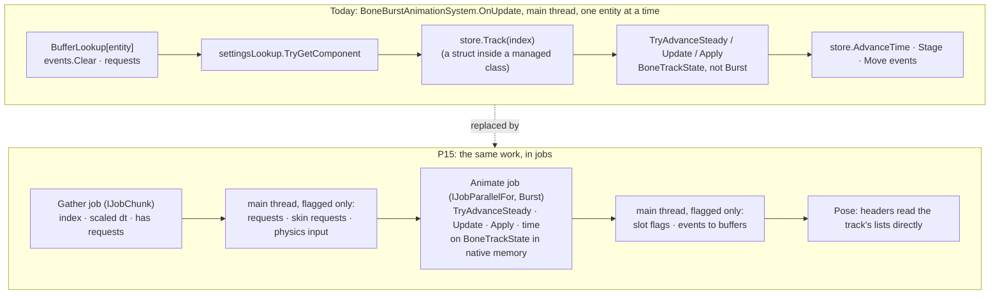
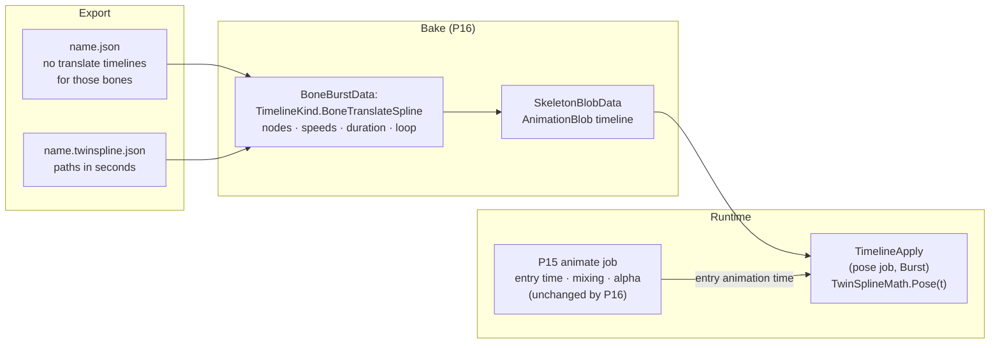

# BoneBurst ECS P15: the animation system's cost — plan

**Status: steps 1 (baseline), 2 (native track state) and 3 (the animate job) done 2026-10-08, steps 4 to 6 not started; first written as a plan on 2026-10-07; a TwinSpline-readiness section added 2026-10-08 (§7), after the owner moved the work to the ECS package (`D2-FrontPackageSample-Decision.md`).** Part of [BoneBurst-ECS-Plan.md](BoneBurst-ECS-Plan.md) (after §24, P14); the summary of all phases is [BoneBurst-ECS-Summary.md](BoneBurst-ECS-Summary.md).

After P14 the animation system is the largest piece of the ECS frame at 2000 skeletons: 0.75 ms when they idle and 2.0 ms when they keep switching animation, of a 2.9 to 4.5 ms frame. It is a single-threaded, managed loop over the entities. The plan is to keep the request handling on the main thread (it is rare) and move everything that happens every frame, for every skeleton, into Burst jobs, the way P14 did for the pose.

## 1. What the numbers say

Measured at 2000 skeletons with the shell timer (`-shell 1`), build 38 (P13), milliseconds per frame:

| | animation total | requests | update | apply | stage | everything else in the loop |
|---|---|---|---|---|---|---|
| idle | 0.75 | 0.04 | 0.13 | 0.03 | 0.04 | about 0.50 |
| switching | 2.03 | 0.06 | 0.28 | 1.09 | 0.05 | about 0.55 |

Two readings:

1.  **Idle: two thirds of the system is neither the animation maths nor the staging.** It is the per-entity plumbing: two `BufferLookup` reads per entity (the event buffer is cleared, the request buffer checked), a `ComponentLookup` for the optional time settings, the list lookup of the instance slot, and the `ToEntityArray` and `ToComponentDataArray` copies. The caveat: each timer scope costs two `Stopwatch` reads, and there are four per entity in the animation system (requests, update, apply, stage), so about 0.15 ms of the "everything else" is the timers themselves; the real remainder is measured with the timers off (step 1 below).
2.  **Switching: `Apply` is the cost** (1.09 ms). About a fifth of the skeletons are crossfading at any moment, and a crossfade applies two animations and mixes them, so those skeletons write many more commands than a skeleton that loops one animation (which takes the steady shortcut and skips `Apply` entirely). `Apply` is plain C# on the main thread today, although `BoneTrackState` is an unmanaged struct (native lists and pointers, no managed references, no `Debug` calls), which is exactly what Burst compiles.

## 2. How I will solve it

The pose work in P14 showed the pattern: the maths is already pointer code, the cost is that it runs on one thread and waits. So:

**A. Put `BoneTrackState` in native memory.** Today it is a field of the managed `InstanceSlot` class, whose address the garbage collector may change, so a job cannot hold a pointer to it. Each instance gets a native allocation for its state (`UnsafeUtility.Malloc`), freed with the instance. `store.Track(index)` keeps returning `ref` (to the native struct), so callers and tests do not change.

**B. An animate job over the active instances.** One work item per instance that has an animation entry **and no physics**: `TryAdvanceSteady(dt)`, else `Update(dt)` then `Apply()`, then the skeleton clock (`Skeleton.Time += dt`). **Physics instances are excluded from the job entirely in the first cut:** `InheritMovement` runs between `Update` and `Apply` in `OnUpdate`, so a job that does Update and Apply as one step cannot include them; they keep the existing main-thread path. It runs in Burst with the same `FloatMode.Strict` setting as the pose job, so it matches the managed reference as closely as the pose does. Instances write only their own memory, so the job is safely parallel. That also rests on the state's lists being `Allocator.Persistent` (`BoneBurstInstanceStore` creates each `BoneTrackState` with it): growing an `UnsafeList` from several threads is safe only because each instance owns its allocations; a later switch to `TempJob` or a shared allocator would break the job silently, so a test asserts the allocator. It returns, per instance, flags: stepped steadily, staged, has events.

**C. The staging goes away as a copy.** `Stage` copies four list headers from the state into the slot so that `TakeHeader` can find the commands. With the state in native memory, `TakeHeader` reads the lists from the state directly (the path that stages a hand-made `CommandBuffer`, used by the tests and by anything driving the store manually, stays).

**D. A gather job instead of the per-entity lookups.** An `IJobChunk` over the query reads, per entity, the instance index, the scaled time step (the optional `BoneBurstAnimationSettings`) and whether the request buffer is empty, into plain arrays. The main thread then touches only the entities that have requests (a few dozen a frame when everything switches, none when idle) and the ones that have physics. **Where the physics bit comes from:** `store.HasPhysics(index)` is a call into the managed `InstanceSlot` list, which is part of the plumbing this step removes. The store keeps a native array of per-instance flags (physics, and later others), set in `CreateInstance` from the asset and cleared on destroy and reuse of the slot, and the gather job reads that. A stale bit would send a physics instance into the job (wrong, no inherited movement) or keep a plain one out of it (slow, silently), so it has its own deliberate-bug test. The event buffers are cleared and filled only for entities that had events last frame or have them now (a per-instance flag), not once per entity per frame.

**E. A small main-thread tail** after the job, flagged instances only (and the **after-animation system** gets the same treatment, E2): set the slot flags that say "applied, stepped, dirty" (`Pending |= Dirty` and the rest), and move delivered events into the entity buffers.

**E2. The after-animation system pays the same plumbing.** `BoneBurstAnimationAfterSystem` does `ToEntityArray` and `ToComponentDataArray` copies and a managed loop over every entity just to skip the unstepped ones (`WasStepped`). It reads the same native flags: a gather over the query once (shared with D where the query allows), then `AfterApply` only for stepped instances and the event move only for those with events. If the gate measured only the `Animation` timer, the frame would gain less than the number says, so the `After` timer is measured with it and the gate counts both.

**F. Then, only if the numbers ask for it: pipeline it with the pose.** The animate job per chunk, then the headers of that chunk, then the pose job of that chunk, the same overlap P14 built between the headers and the pose. Not part of the first cut; decided from the measurement.

What does not change: the animation maths (`BoneTrackState.Update`, `Apply`, `AfterApply` are moved, not rewritten), the request semantics and their order within a frame, the events a skeleton delivers, the public components (`BoneBurstAnimationRequest`, `BoneBurstTrackEvent`, `BoneBurstAnimationSettings`).

## 3. Steps

1.  **Baseline with the timers off.** The same ABBA benchmark as P12 to P14 (the frame time is the metric; the shell timer is a diagnostic), so the plumbing cost is not mixed with the timers' own cost. Idle and switching at 2000, both routes.
2.  **Native track state** (A) with the existing tests unchanged: all 384 must pass before anything else moves.
3.  **The animate job** (B, C), after replacing `AnimationsChanged`'s `Temp` hash map with a state-owned persistent scratch (§6), behind the existing system: first the job replaces only the update and apply lines, the lookups stay; measure.
4.  **The gather job and the flagged tails** (D, E, and the after-animation system, E2); measure both timers and the frame.
5.  **Pipelining** (F) only if the animation or pose total is still the largest single piece and the overlap is worth its complexity.
6.  **Record** the results in this file and in the plan, update the summary, the changelog entry when committing.

## 4. How it is checked

*   **Existing guards, unchanged:** `TrackStateParityTests` (the ECS track state against the managed `BoneAnimationState`, every frame, fuzzed), `AnimationSystemTests` (requests, mixing, events, end-to-end through the systems) and the 24-fixture pose and mesh tests. The job must pass them without a tolerance change.
*   **A deliberate bug for each new piece, and each must fail a test:** the animate job skipping `Apply`; a stale physics bit (a physics instance sent into the job, a plain one kept out); the persistent scratch map not cleared between uses (a hold computed from the last frame's ids); the track state allocated with a non-persistent allocator (a test asserts the allocator); the gather job reading the wrong time scale; the flagged tail not delivering events; the native track state freed one frame early. The P14 lesson applies: a guard that no test reaches is no guard, and a bug in chunked work did not fail any test until a test had more instances than one chunk. So the tests that matter run with more instances than one job batch (a new test with a batch of one and many instances, mixed animations, requests on some and not on others, physics on one).
*   **On screen:** the benchmark scene in a player and an Editor capture at 100 skeletons, switching, compared with the previous build by eye (the animation does not look different) and by the instance poses (the existing tests).
*   **Performance:** ABBA, release players, CoreCLR (both runtimes on the same backend, P12), load average noted, differences under about 5% not claimed.

## 5. Gate

Done when, at 2000 skeletons, the animation system's total (timers on) falls from 0.75 to 0.40 ms or less idle and from 2.0 to 1.0 ms or less switching, the after-animation system's total (measured first, step 1, and recorded here) falls too, the frame time falls by the same amount in the timer-free ABBA run, all 384 tests plus the new ones pass, and each deliberate bug fails a test. If the floor turns out to be elsewhere (the gather job, the flagged tail), the phase reports where and why instead of claiming the target.

## 6. Risks and what I do not know yet

*   **Burst will refuse one thing in `Apply`, and it is known.** `BoneTrackState.AnimationsChanged` (`BoneTrackState.cs:812`) allocates `new NativeHashMap<ulong, long>(64, Allocator.Temp)` and is reached from `Apply` whenever a start or end event set `m_AnimationsChanged` (line 961, run at line 535): on exactly the switching path. A `Temp` allocation inside a parallel job is not allowed. Step 3 replaces it with a scratch map the state owns (`Allocator.Persistent`, cleared on use, disposed with the state), same contents and order, before the job exists, with the existing hold tests as the guard. Other Burst limits (the `Step` struct, generic container use) are found with the compiler in the same step.
*   **The 2.0 ms may not be all `Apply`.** The timer says 1.09 ms; the rest of the switching cost may be request handling (set animation allocates track entries) which stays on the main thread. The first measurement after step 3 says how much of the 2.0 ms the job really takes.
*   **Events and listener semantics.** Events are queued during `Update` and `AfterApply`, delivered through the buffer. Moving `Update` into a job must keep the order of start, interrupt, end and dispose events per skeleton; the fuzz in `TrackStateParityTests` and `AnimationSystemTests` is the guard, and a skeleton firing its first event only in a later frame would be a failure.
*   **Physics instances are out of the job in the first cut.** They need the entity's transform and a physics input between `Update` and `Apply`, which a one-step job cannot give; they keep the main-thread path (a few per scene). Splitting the job in two with the movement between them is a later change if physics skeletons become common.
*   **Editor crashes.** A wrong pointer in a Burst job takes the Editor down (P14's deliberate bug did). The deliberate-bug runs happen one at a time, with the source restored from a copy straight afterwards.

## 7. Ready for pure TwinSpline (added 2026-10-08, the owner: "start P15, for soon support pure TwinSpline")

The BoneBurst Editor v2 can now export a skeleton whose bones' translate motion is a **TwinSpline path** in a file beside the Spine JSON: `name.twinspline.json`, version 1, seconds, `{ animation: { bone: { parent?, duration, loop, closed, nodes[x, y, tx, ty, bx, by, speed, ss, sb] } } }` (editor `docs/SPEC.md` §3 and §5, `docs/UNITY-EXPORT-PLAN.md`; the writer and reader are `edit/exportTwin.ts`). Nothing in Unity reads it yet. This section says what P15 must leave open for that, and what the TwinSpline phase (call it P16) is, so the two are designed together as this plan's header asks.

**The design choice: a path is a translate timeline that samples a spline instead of keys.** The editor's path has its own clock; Unity does not need one. For an exported animation the path's time is the animation entry's time from 0 (a looping path starts over each run, any other holds its last place), exactly the rule the editor's *Spine keys* export bakes by (`ui/pathKeysOver.ts`). So the path rides the machinery that already exists: track entries, looping, crossfades, alpha and hold in `BoneTrackState` and `TimelineApply` apply it like any translate timeline. **P16 therefore adds no clock, no system and no component**; it adds a timeline kind.

What that asks of P15 (nothing new to build, but things not to break):

1.  **P15 does not touch timeline evaluation.** The animate job (§2 B) advances entry times and mixes; the pose job evaluates timelines. A path timeline is evaluated in the pose job from the entry's animation time, which P15 already hands over. The native track state (A) must keep `ApplyCommand` carrying the entry's animation time and alpha, as it does.
2.  **No per-bone special case in the animate job.** If P15's job learned to treat translate specially, a path timeline would need it too; it does not.
3.  **A blob that can hold variable-length timelines.** The timeline entries are `TimelineDef.EntriesOf(kind)` floats; a spline timeline is nodes (x, y, tx, ty, bx, by, speed, ss, sb) plus a header. **Closed (2026-10-08, from the code):** `TimelineBlob` already carries variable-length timelines through `ExtraStart` and `ExtraLength` (the deform timeline's `FrameCount × ExtraLength` floats in `BlobView.DeformFrames` is the precedent); a spline timeline treats its nodes as 9-float frames (x, y, tx, ty, bx, by, speed, ss, sb). The real P16 work is on the `-core` side: `TimelineDef` and the bake.

P16 (its own plan when started, nothing built):

1.  **Format in `-core` Data:** `TimelineKind.BoneTranslateSpline`, its `TimelineDef` fields and the `.sbdata` reader and writer version; the bake merges `name.json` and `name.twinspline.json` into one `BoneBurstData` (the sample `-import` Editor bake is frozen; the ECS baker or a reader in `Module.PA.BoneBurst.Import` does it).
2.  **`TwinSplineMath` in `-core` Core, Burst-compatible, no `UnityEngine`:** a port of the editor's `src/motion/` (`curve` the ring and open spline through the nodes with legs and an arc-length table; `speed` the Hermite speed spline, `timeMap`, `progressAtTime`; `pathPose(t)`). Not from the fork; from our own TypeScript.
3.  **The mapping to the bone:** the path's point is in the space of its reference bone; the editor puts it into the bone's parent's space through both bones' matrices. The first cut supports **`parent` equal to the bone's own parent** (the exporter writes that by default), where the point is the bone's local x and y directly and no world matrix is needed; a path relative to another bone is refused at bake with a message, to be added later if wanted. The timeline writes the offset from the setup pose, as a translate timeline does.
4.  **Guards:** the TypeScript is the oracle. A script in the editor writes fixtures (`pathPose` at a few hundred times for several paths: ring, open, with legs, with uneven speeds) and a Unity test compares `TwinSplineMath` to them within 1e-4; an end-to-end test poses the exported pair (Spine JSON plus `.twinspline.json`) and compares with the same skeleton exported by the editor's *Spine keys* mode (keys baked from the same path), which must agree within the baked keys' fit (1.5 units on the stickman). A deliberate bug for each: the speed spline ignored, the loop not wrapped, the setup offset not subtracted.
5.  **Where the `Path` name is taken:** `Core/Constraints/PathSolver.cs` is Spine's path constraint; the new types say `TwinSpline`, never `Path`.

What P16 does not need from P15 is a gate: P15 can be built, measured and committed first. The reverse also holds: P15 should not wait for P16.

## 8. Step 1 result: the baseline (2026-10-08, redone at 720p)

**Done, and redone.** The first baseline (build 57) ran at 1920×1080, which breaks the owner's rule that every player build is **1280×720, windowed, not resizable** (CLAUDE.md, "Player builds", 2026-10-08); the session had started from an older copy of that file. It is **void** and not kept. The build menus now set 720p and restore the project's settings, the benchmark players call `Screen.SetResolution(1280, 720, Windowed)` at start, every result row has a `resolution` column, and the runner passes 720p. The earlier phases' figures (P12 to P14, §21 to §24 of the ECS plan) were taken at 1080p and are not comparable with any figure below; the next phase to compare with them should say so.

**The baseline:** player `ECS-0-25D-Platformer/Build/macOS_BoneBurstEcsBenchmark_59` (the unmodified package at HEAD `f99cf49`, P14, plus the 720p and `resolution` changes in the benchmark project only), kept as the "A" build for every later A/B. ABBA over two repeats (the second reversed), Apple M5 Pro, Metal, **1280×720**, vsync off, CoreCLR release, 60 warm-up and 600 measured frames; one pass with the shell timers off, one with `-shell 1`. Raw CSVs are in the session scratchpad (`p15_baseline.py`, `base59/`), not committed.

**Load caveat, which is large:** another session's player loop and a repo scan ran during these runs; the load average before the runs ranged **8.7 to 26.4**. The two runs of a configuration differ by up to 25% (EcsGpu 2000 idle 2.68 and 3.40 ms). Frame figures here are indications only, not claims under about 25%; the per-system timers are CPU time on one thread and move less. Before the gate run the baseline pass is repeated on a quiet machine (load under 4), or both builds are run in the same ABBA session, which is the plan's method anyway.

Frame time, timers off (median of the two runs, ms; the runs in brackets):

| | EcsGpu | EcsCpu |
|---|---|---|
| idle × 2000 | 3.04 [2.68, 3.40] | 4.36 [4.41, 4.31] |
| switch × 2000 | 4.66 [4.31, 5.01] | 6.05 [5.70, 6.40] |
| switch × 500 | 1.71 [1.50, 1.91] | 2.25 [2.10, 2.40] |
| switch × 100 | 0.60 [0.50, 0.71] | 0.70 [0.60, 0.80] |

Timers on, 2000 skeletons (median of two runs, ms per frame):

| | animation | after | pose | `Apply` | frame |
|---|---|---|---|---|---|
| Gpu idle | **0.79** | **0.18** | 1.19 | 0.03 | 3.12 |
| Cpu idle | 0.85 | 0.23 | 2.14 | 0.03 | 5.41 |
| Gpu switch | **2.03** | **0.41** | 1.64 | 1.10 | 4.90 |
| Cpu switch | 2.03 | 0.44 | 2.21 | 1.12 | 6.60 |

What it says, against §1 (the readings of the void 1080p run, which this run agrees with):

*   **Idle, the plumbing is most of the animation system:** `Apply` is 0.03 ms and the system is 0.79; the four phase timers account for about a third of it.
*   **Switching: `Apply` is about 1.1 of 2.0 ms.**
*   **The after-animation system is a fifth of the animation system's cost** (0.18 idle, 0.41 switching), for work that is nearly all skipping unstepped instances: §E2 folds it in and the gate counts it.
*   **Frame share at 2000 (GPU route):** animation plus after is 0.97 of 3.12 ms idle (a third) and 2.44 of 4.90 ms switching (half).

**Targets (the gate, §5, with the after-animation figure added):** animation 0.79 to 0.40 ms or less idle and 2.03 to 1.0 or less switching; after-animation 0.18 to 0.09 or less idle and 0.41 to 0.20 or less switching; together at least 0.5 ms off the idle frame and 1.0 ms off the switching frame at 2000 skeletons, in an ABBA run against build 59 at 720p, load noted.

## 9. Step 2 result: the native track state (2026-10-08)

**Done, in `ECS-0-25D-Platformer` (uncommitted there: that repository has no commits yet).** Each instance's `BoneTrackState` now lives in its own native allocation instead of a field of the managed `InstanceSlot` class, so a job can hold a pointer to it.

*   **The change:** `BoneBurstInstanceStore.InstanceSlot.Track` is a `BoneTrackState*`. `CreateInstance` allocates it (`UnsafeUtility.MallocTracked`, `Allocator.Persistent`, aligned for the struct) and constructs the state in it; `DestroyInstance` and `Dispose` go through one `FreeTrack` (dispose the state's lists, free the allocation, null the pointer). `store.Track(index)` still returns `ref BoneTrackState`, so no caller changed. Two small additions for the tests: `BoneTrackState.ListAllocator` (the allocator its lists were made with) and `BoneBurstInstanceStore.TrackAddress(index)`. The state's logic is untouched.
*   **Guards.** All 384 existing tests pass unchanged (the assembly was 384 of 384 before the edit and 386 of 386 after). `TrackStorageTests` (2, new): every instance's state has the persistent allocator and its own allocation, and the addresses stay the same across 30 frames and 40 more spawns; a destroyed instance leaves the others' states in place and still animating, and the reused slot gets a fresh state of its own.
*   **Deliberate bug:** the state made with `Allocator.TempJob`: the new test fails (385 of 386, one failed), and the restored source is green again (386 of 386, checked against a saved copy). A first attempt at this check read a stale test status (the previous run's) and proved nothing; the second waited for a status different from the one before the run. The other bugs of §4 (stale physics bit, scratch map not cleared, animate job skipping `Apply`) belong to the steps that introduce those pieces.
*   **Not measured.** Step 2 changes storage, not work: the benchmark is run with step 3, where the speed changes. The Editor was the only thing run; no player was built.

## 10. Step 3 result: the animate job (2026-10-08)

**Done and measured; the switching target of the animation system is met, the idle target is not (that is step 4's), and the after-animation system got slower.** Code in `ECS-0-25D-Platformer`, uncommitted there.

*   **The change.** (a) `BoneTrackState.AnimationsChanged` no longer builds a `Temp` hash map each time: the state owns one persistent scratch map (made on first use, cleared before each use, disposed with the state). (b) `BoneBurstAnimationSystem` collects, in the existing per-entity loop, every instance **without physics** that has an animation entry (state pointer, scaled time step, index) and runs one Burst `IJobParallelFor` (`AnimateJob`, batch 16, `FloatMode.Strict` like the pose job): `TryAdvanceSteady`, else `Update` then `Apply`. Then, on the main thread and in the same order as before, per work item: the skeleton clock, `Stage`, and the events to the entity's buffer. Requests, the physics instances (their `InheritMovement` sits between `Update` and `Apply`), and the lookups stay as they were. `BoneBurstAnimationSystem.UseJob` (default true) switches back to the main-thread loop for the tests and for A/B runs. `BoneBurstInstanceStore.TrackPointer(index)` hands out the state pointer.
*   **Correction to the review's Burst point.** The plan (and its review) said a `Temp` allocation inside a parallel job is not allowed. It is allowed in Burst jobs (a thread-local temporary allocator); replacing the map is still right (no allocation on the switching path, no hash-map construction per animation change) but it was not a compile blocker. Burst compiled `BoneTrackState.Update`, `Apply` and `TryAdvanceSteady` without changes.
*   **Guards.** All 384 old tests and the 2 storage tests pass with the job on, and `AnimateJobTests` (new): 300 spineboy instances (more than one job batch and more than one pose chunk) with a deterministic mix of `Set`, `Add`, `SetEmpty` and `ClearTracks` requests on some of them each frame, run for 150 frames in two worlds, one with the job and one without; every bone's world matrix and every event of every instance, every frame, must be equal (they are, exactly). Total 387 of 387. Deliberate bugs, one at a time, source restored after each and checked against a saved copy: the job skipping `Apply` fails 5 tests; the hold scratch map not cleared fails 141; the restored source passes 387 of 387. The stale-physics-bit bug belongs to step 4, where the bit appears (here the routing reads the instance's real data, `HasPhysics`).
*   **Measured.** Build 60 (this change) against build 59 (the baseline), ABBA in one session, 1280×720, Apple M5 Pro; load before the runs 5.9 to 14.1, so frame figures are indications (the two passes disagree on the sign of the 2000 switching GPU frame, +3.4% and −5.7%). Per-system timers, 2000 skeletons, ms per frame, A then B:

| | animation | after | pose | frame, timers off (pass 1 / pass 2) |
|---|---|---|---|---|
| Gpu idle | 0.72 → 0.68 | 0.16 → 0.17 | 1.18 → 1.16 | 3.00 → 2.69 (−10%) / 2.95 → 2.85 (−3%) |
| Gpu switch | **1.82 → 0.99** | 0.40 → **0.52** | 1.51 → 1.56 | 4.35 → 4.10 (−6%) / 4.35 → 4.50 (+3%) |
| Cpu idle | 0.75 → 0.70 | 0.19 → 0.20 | 1.70 → 1.68 | 4.40 → 4.40 / 4.45 → 4.40 |
| Cpu switch | **1.83 → 0.79** | 0.40 → **0.51** | 2.04 → 2.02 | 5.71 → 5.65 (−1%) / 6.01 → 5.50 (−8%) |

    Smaller counts, timers off, pass 1: Gpu 500 switch 1.55 → 1.49 (−3.5%), Cpu 500 switch 2.20 → 2.00 (−9%), Cpu 100 switch 0.70 → 0.60 (−14%), Gpu 100 switch 0.50 → 0.50. The `update` and `apply` timers no longer mean what they did (the job's schedule and completion is counted under `update`, `apply` is 0), so only the totals compare.
*   **What it says.** (1) **Switching:** the animation system falls 46% (GPU) and 57% (CPU) and meets its target (1.0 ms), because `Apply` moved off the main thread; about 0.8 to 1.0 ms of it is gone. (2) **Idle:** it moves by about 0.04 ms: the work step 3 moved is small when skeletons idle, and the rest is the lookups and copies that step 4 removes (target 0.40, not met). (3) **The after-animation system rose by about 0.1 ms** while switching (0.40 → 0.52): not explained by this step's design. Hypotheses to test, not conclusions: its `AfterApply` now reads state last written by worker threads (cold cache lines), or the event moves the main thread now does in one batch cost more. The net animation plus after at 2000 switching is 2.22 → 1.51 ms on the GPU route (−0.7 ms) and 2.23 → 1.30 on the CPU route (−0.9 ms), which is the part of the frame gain the loud runs can show. (4) The frame-time gain is **not demonstrated** beyond the noise: roughly the size of the system gain at switching on some runs, absent on others. A quiet-machine ABBA is part of the final gate.
*   **Not traced.** The build reported 8 warnings against 3 for build 59; none is a Burst warning naming the new code (checked in the Editor log), and the 5 extra were not looked at one by one.
