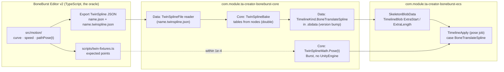

# BoneBurst ECS P16: pure TwinSpline playback — plan

**Status: plan written 2026-10-08; step 1 (the maths with fixtures) and step 2 (the file reader) and step 3 (the timeline) done the same day (§6 to §8); steps 4 to 6 not started.** Follows [BoneBurst-ECS-P15-AnimationSystem-Plan.md](BoneBurst-ECS-P15-AnimationSystem-Plan.md) §7 (the design choice) and the BoneBurst Editor's [UNITY-EXPORT-PLAN.md](../../../../Editor-BoneBurst-Src/docs/UNITY-EXPORT-PLAN.md) (the file this plays). The code goes in `com.module.ta-creator-boneburst-core` (data format, maths, bake) and `ECS-0-25D-Platformer`'s `com.module.ta-creator-boneburst-ecs` (the runtime and its tests), per [D2](D2-FrontPackageSample-Decision.md): the MonoBehaviour front is not touched.

The editor can export a skeleton whose bones' translate motion is a **TwinSpline path**: a spline through nodes (the ring or open curve) and a second spline over it for speed. It writes the plain Spine JSON (those bones' translate timelines removed) and `name.twinspline.json` (version 1, seconds). Nothing in Unity reads that file. P16 makes BoneBurst play it, in the ECS runtime, with the same result as the editor's Stage.

## 1. The design, in one paragraph

A path for bone *B* in animation *A* is a **translate timeline** whose value at the entry's animation time *t* is the path's point at the path time (the path starts over each run when it loops, holds its last place otherwise), written as an offset from the bone's setup pose, as every translate timeline is. So the existing machinery (track entries, mixing, alpha, hold, looping) plays it; **no new clock, system or component** (P15 §7). The runtime evaluation is two table lookups and one interpolation, because the bake precomputes the two tables the editor builds on every call: the **curve table** (the spline sampled 64 times per span, with cumulative arc length) and the **time table** (513 cumulative time shares of the speed spline). The editor's own numbers are double precision; the bake computes in double and stores floats, so the runtime matches the editor to float rounding.

## 2. What is decided, and what is not

*   **Decided (from the editor's code and P15 §7):** the path is evaluated on the entry's animation time from 0 (the rule the editor's *Spine keys* export bakes by); loop wraps (`t mod duration`), no loop holds (`min(t, duration)`); the output is an offset from the setup pose; the maths is a port of the editor's `src/motion/` (ours, not the fork's); `Core/TwinSpline/` never names `Path` (Spine's path constraint owns `PathSolver`).
*   **Decided, first cut:** only paths whose `parent` is the bone's own parent. The point is then the bone's local x and y directly and needs no world matrix. The reader refuses any other with a message naming the bone and the animation.
*   **Not decided (owner):** (a) a path with another reference bone (needs a world matrix of that bone before the path bone's local is set: the pose step would pose twice for such skeletons); (b) whether `name.twinspline.json` is merged into the `.sbdata` by the Unity bake (the sample's frozen Editor bake, D2) or by a reader used by the ECS baker; (c) rotation, scale and shear stay keys (the editor's paths are translate only).

## 3. The format

`TimelineKind.BoneTranslateSpline` joins the kinds in `Data/TimelineDef.cs`. Its `Frames` are not times; they carry the header. Per timeline, in the `Extra` floats (the deform timeline's `ExtraStart`/`ExtraLength` precedent in `TimelineBlob`):

| part | floats | meaning |
|---|---|---|
| header | 8 | duration (s), loop (0/1), curve length, curve point count `P`, time table size `T` (512), setup x, setup y, reserved |
| curve table | `3 × P` | x, y and cumulative arc length of each sample (`P = spans × 64 + 1`) |
| time table | `T + 1` | cumulative time share at each progress sample, normalised to 0..1 |

An animation's bone lists either a `BoneTranslate`/`BoneTranslateX`/`BoneTranslateY` timeline or a spline one, never both (the editor's export removes the keys). `.sbdata` gets a version bump; older files read as before.

## 4. Steps

1.  **The maths, with fixtures (started 2026-10-08).** `scripts/twin-fixtures.ts` in the editor writes paths (ring, open, with handles, with broken legs, uneven speeds, two nodes, the lens case) and the TypeScript's answers: `pathPose` at a few hundred times, `arrivalTimes`, curve length. C# `TwinSplineBake` (nodes → tables, double) and `TwinSplineMath.Pose` (tables → point, `float`, pointer-based for Burst) in `-core` Core; an EditMode test in the ECS package compares them to the fixtures within 1e-4.
2.  **The file reader.** `TwinSplineFile` in `Module.PA.BoneBurst.Import` (Runtime; a reader, like `SkeletonJsonReader`): parses version 1, validates as the editor's `parseTwinSpline` does, refuses a path whose `parent` is not the bone's parent.
3.  **The timeline.** `TimelineKind.BoneTranslateSpline` in Data, writer and reader, `.sbdata` version; the bake that turns skeleton plus twinspline file into one `BoneBurstData`.
4.  **The blob and the pose.** `BoneBurstBlobConverter` carries the extra floats; `TimelineApply` gets a `BoneTranslateSpline` case (mixing, alpha and hold like `BoneTranslate`); `ManagedPose`/`BoneAnimationState` the same, as the oracle.
5.  **End to end.** The stickman exported by the editor in TwinSpline mode (a bone with a path) posed by BoneBurst against the same skeleton exported in *Spine keys* mode (keys baked from the same path): within the keys' fit (1.5 units); and against the editor's Stage pose.
6.  **Docs and the editor's proof.** The format in `Doc/Format/`; the editor's UNITY-EXPORT-PLAN step 5 (the proof in Unity) is this step 5.

## 5. How it is checked

*   **The TypeScript is the oracle.** Fixtures come from the editor's real code, not from a copy of its formulas.
*   **A deliberate bug for each piece, each must fail a test:** the speed spline ignored (an even pace); the loop not wrapped; the setup offset not subtracted; the curve table off by one sample; a path with a `parent` other than the bone's parent accepted silently.
*   **Mixing is checked, not assumed:** a crossfade between a keyed animation and a spline animation on the same bone equals the same crossfade with the path baked to keys (within the fit).
*   **Performance:** a spline timeline must not cost more than a few keyed timelines; measured in the ABBA benchmark only if the pose job's time moves.

## 6. Step 1 result (2026-10-08): the maths, against the editor's numbers

**Done and tested in the Editor; nothing yet reads a file or plays in a pose.**

*   **`scripts/twin-fixtures.ts`** (the editor): eight paths (a ring with even speeds, a ring with uneven ones, an open path with handles, a straight open path of two nodes, the two-node ring that bows into a lens, a ring with broken speed legs, a ring with broken curve handles, an open path at the extremes −0.99 and 5) and what the editor's real `src/motion/` says: the point at 311 times each (past both ends too), the curve length, the speed spline at 21 places. Written flat with explicit presence flags (Unity's `JsonUtility` cannot tell an absent field from a zero) to `Tests/Data~/twinspline-fixtures.json` in the ECS package.
*   **`TwinSplineBake`** (`-core`, `Core/TwinSpline/`, managed, double): `Build(nodes, closed, duration, loop, setupX, setupY)` returns the float table of §3: a port of the editor's `handleOffsets`, `buildCurve`, `nodeProgress`, the speed spline (`autoSlope`, `slopesOf`, `speedAt`, with JavaScript's round-half-up in `clampSpeed`) and the time table. **`TwinSplineMath`** (same folder, `float*`, no allocation): `Pose(table, time)` (the path starts over each run when it loops, holds its end otherwise), `PoseAtPathTime`, and the header readers. Two binary searches and one interpolation per sample, written to compile under Burst; **not yet compiled under Burst** (step 4's pose job will).
*   **Guards.** `TwinSplineTests` (20 in the ECS Editor assembly; the whole assembly is 408 of 408): the curve length and the speed spline against the editor's, the point at every one of the 311 times for each of the eight paths (the worst difference from the editor must be under 1e-4), looping and holding, the setup pose in the header, and refusals. **Deliberate bugs**, one at a time, sources restored and checked against saved copies: the speed spline ignored fails 4 tests; a looping path not starting over fails 1; the curve sampled 16 times a span instead of 64 fails 14; a broken in-handle ignored fails 2; the restored sources pass 408.
*   **Not covered yet.** The setup-offset subtraction (the timeline in step 4), the refusal of a path with another reference bone (step 2), and Burst compilation. JSON numbers reach the tests as doubles through `JsonUtility`; the table is float, so agreement is to float precision (1e-4 on coordinates of about 100), which is what the pose can use.

## 7. Step 2 result (2026-10-08): the file reader, on a real export

**Done and tested; nothing yet puts a path into a skeleton.** The owner supplied a real export, `Assets/mix-and-match-pro.twinspline.zip` in the ECS project (the skeleton JSON, atlas, page and `mix-and-match-pro.twinspline.json` the editor wrote in TwinSpline mode). It was unpacked into a scratch folder and read as data only.

*   **What the real file is:** 29 paths in 10 animations of the mix-and-match-pro rig (146 bones), 2 to 18 nodes each, all `loop: true`, 28 closed and one open (`shovel-run/arm-back-control`); most nodes carry only `x`, `y` and `speed`, one path (`run/foot-back-IK`) has dragged handles and a speed leg. In the skeleton JSON none of those bones has a translate timeline left in those animations, as designed.
*   **The first-cut rule against it:** 28 of the 29 paths are relative to the bone's own parent. The 29th is `run copy` / `foot-front-IK`, relative to `hips` while its own parent is `skeleton-control` (a copy animation the artist made). That path is set aside with a message; in that animation the bone holds its setup pose. So the rule covers 97% of this real rig; supporting another reference bone (needs a world matrix in the pose step) stays an open decision (§2), now with a number.
*   **Where the reader lives (differs from §4 step 2).** Not in `Module.PA.BoneBurst.Import`: that package depends on the MonoBehaviour front and on `pb-creator-base`, which the ECS project does not have (and D2 says not to add). `TwinSplineFile` is in the ECS package's **Authoring** assembly (`Module.TA.BoneBurstEcs.Authoring`, bake time), using Newtonsoft JSON (the project already has `com.unity.nuget.newtonsoft-json`; now declared in the ECS `package.json`, and in the test assembly's precompiled references). `Parse` validates as the editor's `parseTwinSpline` does and refuses with a `FormatException` saying what is wrong; `Split(boneParents, animations)` returns the playable paths and the issues (an unknown animation or bone, or a path relative to another bone), each with its reason. A handle needs both numbers (`tx` and `ty`, `bx` and `by`), as in the editor; `ss` and `sb` stand alone.
*   **Guards.** `TwinSplineFileTests` (12; the ECS Editor assembly is 420 of 420): every path and every node number read equals the file's (checked against a second reading through `JObject`), the optional parts present only where the file has them, `Split` on the real rig's names and parents (from `Tests/Data~/mix-and-match-pro.skeleton-summary.json`, 146 bones and 18 animations, a 10 KB extract of the supplied skeleton) gives 28 playable and exactly one issue naming `"hips"`, `"skeleton-control"` and the setup pose, the world-space, unknown-bone and unknown-animation cases, and eight malformed files each refused with its reason. Deliberate bugs, restored and checked after each: any reference bone accepted fails 2 tests; a dragged handle never read fails 2; the version not checked fails 1; `loop` and `closed` swapped fails 1; the restored source passes 420.
*   **Not done.** The reader does not yet feed the bake (step 3). The `run copy` path is the only one this file sets aside; whether the artist wants `foot-front-IK` relative to `hips` supported is for the owner.

## 8. Step 3 result (2026-10-08): the spline as a timeline of the skeleton

**Done and tested in the Editor, on the real rig; the .sbdata format is not touched (differs from §3 and §4 step 3).** A path is put into the skeleton in memory, at bake time, before the blob is built; the format of the stored file does not carry it. That keeps old files and the sample front package exactly as they were, and the Unity bake does not need to know about paths.

*   **Core (`-core`).** `TimelineKind.BoneTranslateSpline` is **appended** to the enum (the kinds are stored as numbers; two places test ranges of kinds, so inserting it among the bone kinds would have renumbered the rest). `TimelineDef.Spline` holds the path's table. `BlobBuilder` puts the table in the shared float pool the deform timelines use (`ExtraStart`, `ExtraLength`), gives the timeline the same property ids as `BoneTranslate` (so mixing and hold treat the two alike), and lists the bone with the animation's bones (a range test there and one in `UpdateCacheBuilder`, for sliders, needed the new kind added by name). `TimelineApply.BoneSpline` mixes as `BoneTwo` does: the path's point replaces (setup + value) in the keyed formulas; `IsAdditive` (managed and ECS copies) knows the kind. The bone's setup pose is no longer in the table header: the runtime reads it from the blob's bone, the one place it is kept (this changed step 1's `Build` signature and its tests).
*   **Merge (ECS Authoring).** `TwinSplineMerge.Add(skeleton, file, out issues)` adds each playable path (§7) as a `BoneTranslateSpline` timeline and returns how many; a path whose bone still has translation keys in the animation is left out with an issue (a bone never has two sources).
*   **Guards.** `TwinSplineMergeTests` (4) on the real rig, with the translate timelines of the file's bones removed as the export does: every path is added or reported and the blob content has the timelines and lists their bones; the unexported rig keeps its keys and reports the conflicts; the managed pose (`BoneAnimationState` and `ManagedPose`, over 120 frames at 60 per second) puts the bone within 0.01 of the path at every frame, in up to four animations; the ECS systems (instance, animation, pose, after, 90 frames) do the same. The ECS Editor assembly is 424 of 424. Deliberate bugs, restored and checked after each: the spline branch reading time 0 fails 2 tests; the dispatch without the case fails 2; spline bones not listed with the animation's bones fails 1; the merge ignoring existing keys fails 1; the restored sources pass 424. **The parity gate** (`paritygate.py`, the core package against stock spine-csharp on .NET) passes after the change: 215 of 215 tests, 144,294,824 values, 0 not bit-exact.
*   **A first try at the pose tests failed for a reason worth keeping:** they named a path (`run` / `arm-front-control`) that this older sample rig does not have; they now take the paths that were actually merged. **The earlier "420 of 420" was a stale status** from before the new tests compiled; the test wait now reads the Editor's own compiling flag and requires a running state.
*   **Not covered yet.** Mixing a keyed animation into a spline one on the same bone (a crossfade checked against the same fade of baked keys): step 5. Burst compilation of `TwinSplineMath` inside the pose job: the pose job calls `TimelineApply`, so the ECS tests above ran it under Burst in the Editor only if the pose job compiled; this was not checked separately. The front package's own Unity tests were not rerun after the core change (the parity gate compiles and runs the core only).
