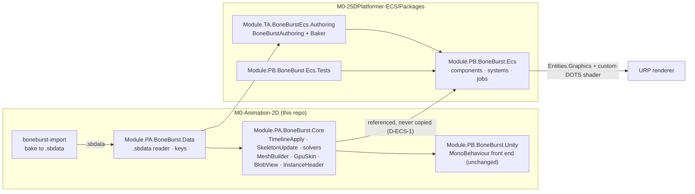
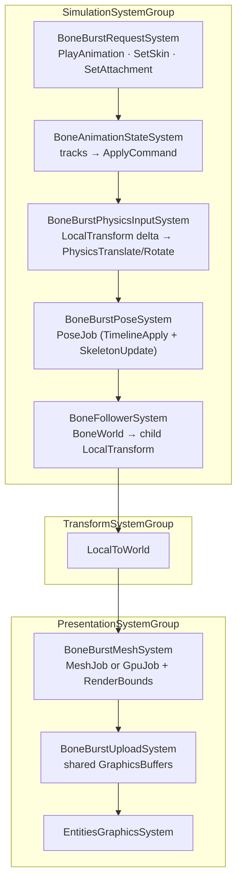
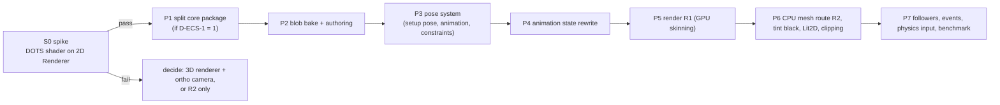
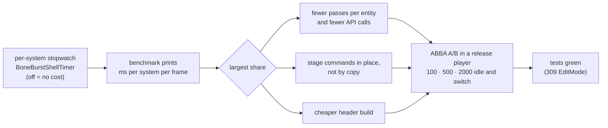
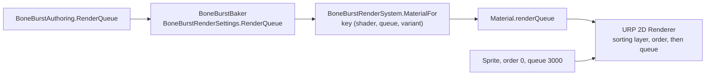
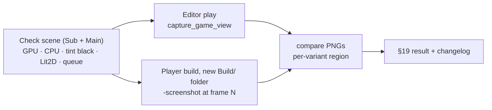
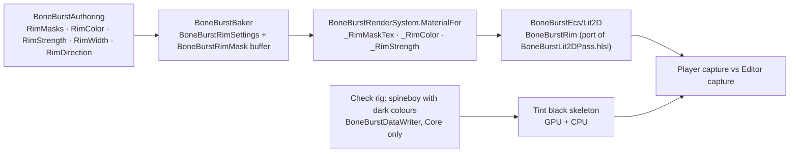
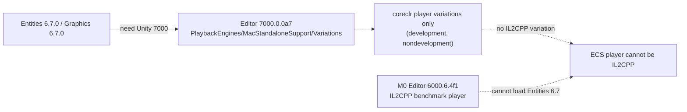
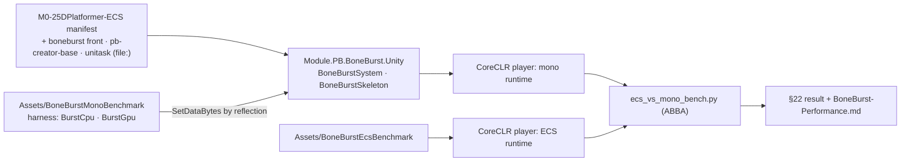

# BoneBurst ECS port: Plan

**Status: S0 spike ran 2026-10-07: it draws on the URP 2D Renderer; batching and sorting still unverified (see §8). D-ECS-1 = option 1 and D-ECS-2 = option A were chosen by the owner on 2026-10-07. P1 (core split) and P2 (blob bake and authoring) done 2026-10-07, see §9 and §10; P3 (pose system) done 2026-10-07, see §11; P4 (animation state) done 2026-10-07, see §12; P5 (render) done 2026-10-07 except a player build and the 3D renderer's pass (§13, §14); P6 (CPU route, skins, tint black, Lit2D) done 2026-10-07 except the vertex-fetch route, rim light and a player build (§15); P7 (physics input, followers, idle skipping, benchmark) done 2026-10-07 except the visibility mode, the steady shortcut and the sorting question (§16). P8 (shell overhead at small counts) done 2026-10-07: 7–16% less at 100–2000 skeletons, the rest is a fixed floor outside BoneBurst (§17). P11 (tint black and rim light in a player) done 2026-10-07: rim light built and both seen in a player (§20). P10 (render variants in a player) done 2026-10-07: it found and fixed a CPU route that never drew and a stripped default shader (§19). P9 (sorting) done 2026-10-07: a per-skeleton render queue orders a skeleton against sprites of one sorting layer and order; the sorting layer and order themselves stay unreachable (§18).**

BoneBurst's pose, constraint, timeline and mesh code (`Module.PA.BoneBurst.Core`) is already Burst-friendly pointer code with no `UnityEngine`. The port keeps that code unchanged and replaces only the managed shell around it (`BoneBurstSystem`, `BoneBurstSkeleton`, `BoneBurstAsset`, `BoneAnimationState`, the GPU and fetch buffers) with Entities 6.7 systems, bakers and Entities Graphics. The result is a new package in `M0-25DPlatformer-ECS/Packages`.

## 1. What was found

### Target project (`M0-25DPlatformer-ECS`)

| Fact | Value | Consequence |
|---|---|---|
| Editor | `7000.0.0a7` (alpha) | APIs may move; BoneBurst's floor is 6000.6, so the new package must compile on both. |
| Packages | entities 6.7.0, entities.graphics 6.7.0, collections 6.7.0, burst 2.0.0, mathematics 1.4.0, URP 17.7.0 | BoneBurst asks collections 6.6.0; fine. |
| Renderer | **URP 2D Renderer** (`Assets/Settings/Renderer2D.asset`) | The URP 2D shaders contain no DOTS instancing. **Entities Graphics on the 2D Renderer is unproven.** This is the main risk (S0). |
| `Packages/` | only `manifest.json`, `packages-lock.json` | No existing package convention; we bring ours (`Module.<Tier><Band>`). |
| Existing ECS | `Assets/ECS`, `SystemBase` demo, no bakers, jobs, blobs | Nothing to conflict with. Entities 6.6+ removed class `IComponentData`: structs plus `UnityObjectRef<T>` only. |

### Entities Graphics (read from `Library/PackageCache`)

*   `RenderMeshUtility.AddComponents(entity, em, RenderMeshDescription, RenderMeshArray, MaterialMeshInfo)` makes an entity drawable; `MaterialMeshInfo.FromRenderMeshArrayIndices(mat, mesh, submesh)` picks material and mesh.
*   Per-instance shader data goes only through `[MaterialProperty("_Name")] struct … : IComponentData`; the shader must declare it in `UNITY_DOTS_INSTANCING_START` and use `#pragma multi_compile _ DOTS_INSTANCING_ON`, target 4.5, SRP-Batcher-compatible CBUFFER.
*   Bounds are static: `RenderBounds` (local) feeds `WorldRenderBounds`. A deforming skeleton must set bounds to cover its whole range, or it pops at the screen edge.
*   Built-in deformation (`Unity.Deformations`: `SkinMatrix` buffer, `DeformedMeshIndex`, Compute Deformation node) is **experimental**, built around 3D `SkinnedMeshRenderer` meshes, its systems are `internal sealed`, and it has no free-form deform, clipping or tint-black. Decision: **not used** (see R3).

### BoneBurst (read from the package)

*   Reusable unchanged (static unsafe code over `BlobView` + `InstanceHeader`): `TimelineApply.ApplyAll`, `SkeletonUpdate`, all solvers, `PoseMath`, `MeshBuilder`, `ClipMeshBuilder`, `Clipper`, `GpuSkin`, the job bodies in `PoseJob`, `MeshJob.BuildScratch`, `GpuJob`, the HLSL.
*   Already blob-shaped: `SkeletonBlob` is about 29 flat blittable `NativeArray`s read through pointer struct `BlobView`.
*   Managed and to be replaced: `BoneBurstSystem` (PlayerLoop, `List` of owners), `BoneBurstSkeleton`, `BoneBurstAsset` (UniTask, AssetSystem), `BoneAnimationState` (1171 lines, `Action` listeners, `List<>`), `BoneBurstSkin`, `InstanceData` (managed owner of native memory), `BoneBurstGpu`, `BoneBurstFetch`, `UploadCpuMesh`, material setup.
*   Rendering today: one `Mesh` per skeleton; per-instance data via `Renderer.SetShaderUserValue`; three shader variants (CPU mesh, `BONE_BURST_GPU`, `BONE_BURST_FETCH`).

## 2. Design

### 2.1 Data: baked once, read as blob

Authoring (editor only) reads the `.sbdata` the import package already bakes, runs the existing `BoneBurstDataReader` and Core's `BlobBuilder.Build`, and writes the result as an Entities `BlobAssetReference<SkeletonBlobData>`. Each `NativeArray` becomes a `BlobArray<T>`; at schedule time a `BlobView` is filled from `GetUnsafePtr()` of the blob arrays, so **the solvers see the same pointers as today**. Core's `BlobBuilder` shares a name with `Unity.Entities.BlobBuilder`: always alias one of them.

Names (skin, animation, attachment) become hashed `BoneBurstKey` ids in a sorted blob array, so no managed string lookup is needed at runtime.

### 2.2 Per-instance memory (D-ECS-2)

`InstanceHeader` has about 60 raw pointers into one instance's native memory. Chunk memory moves, so these cannot point into `DynamicBuffer`s that outlive a job. Two options:

| | A. Native block per entity (recommended for phase 1) | B. Everything as `DynamicBuffer`s |
|---|---|---|
| How | `BoneBurstInstance : IComponentData` holds one persistent allocation (the current `InstanceData` layout, made unmanaged); `BoneBurstInstanceCleanup : ICleanupComponentData` frees it. Header is rebuilt from it in the job. | About 30 buffer component types per entity, header built from `BufferAccessor`s per chunk. |
| Core changes | none | none, but a large header-builder |
| Parity risk | lowest | higher |
| Chunk locality | no (same as today) | yes |
| Bone/slot readable by other systems | via pointer | native `DynamicBuffer` |

Phase 1 uses A to reach parity fast; B is a later optimisation only if the benchmark shows chunk locality matters. Bone data other systems need (bone followers, attachment sockets) is exposed through a small accessor over A.

### 2.3 Animation state: blittable rewrite

`BoneAnimationState` is the one big piece of real new code. It becomes:

*   `DynamicBuffer<BoneTrackEntry>` (blittable: animation index, time, mix, alpha, loop, speed, next, mixing-from index) plus a `PlayAnimationRequest` event or enableable component.
*   `BoneAnimationStateSystem` (Burst, `IJobEntity`) producing the same `ApplyCommand` list `TimelineApply` already consumes.
*   Listeners become a `DynamicBuffer<BoneBurstEventElement>` filled by the pose job and read by gameplay systems. No `Action` anywhere.
*   Guard: a test that runs the managed `BoneAnimationState` and the ECS version over the sample corpus and compares the resulting `ApplyCommand` streams exactly.

### 2.4 Components and system order

Main components: `BoneBurstSkeletonRef` (blob + asset id), `BoneBurstInstance` (2.2), `BoneBurstSkinState`, `BoneBurstColor` and `BoneBurstFlip` (as `[MaterialProperty]`), `BoneBurstPoseOffset` (`_BoneBurstPoseOffset`), `BoneBurstVisibility` (replaces `OnBecameVisible`, driven by culling results, feeds `UpdateWhenInvisible`).

All jobs keep `[BurstCompile(FloatMode.Strict, FloatPrecision.Standard)]` so the parity harness remains valid.

### 2.5 Rendering routes

The per-skeleton unique `Mesh` does not fit Entities Graphics, which batches by shared mesh and material and registers each `Mesh` globally. Three routes:

| Route | Idea | Verdict |
|---|---|---|
| **R1: GPU-skinning on shared meshes** | A static mesh of local positions + influences is shared by every entity with the same skin and attachment set; per-entity pose comes from the shared pose `GraphicsBuffer` at `_BoneBurstPoseOffset`. Custom DOTS-instanced shader derived from `BoneBurst-Unlit/Lit2D`. | **Target.** Fully Entities Graphics, SRP-batched. Skeletons whose attachments or draw order change at runtime need another static mesh or fall to R2. |
| **R2: Fetch buffer + one big mesh** | CPU skin result streamed into a ring `GraphicsBuffer`; indices in a pooled mesh. | Fallback for dynamic skeletons and if S0 fails: draws through `RenderMeshIndirect` / `Graphics.RenderPrimitives`, not Entities Graphics, but all simulation stays ECS. |
| R3: `Unity.Deformations` | Map Spine weights to bone weights and use Compute Deformation. | Rejected: experimental, 3D oriented, no deform timelines, clipping or tint black, internal systems. |

Sorting: draw order stays baked into per-vertex z (`ZSpacing`); inter-skeleton order uses the renderer's sorting, which is what S0 must prove on the 2D Renderer.

## 3. Package layout

`M0-25DPlatformer-ECS/Packages/com.module.ta-creator-boneburst-ecs/`, `Runtime/`, `Authoring/`, `Shaders/`, `Tests/`, `Doc/`, beside `package.json` (`unity: 6000.6`). Assemblies follow §4 of `CLAUDE.md`:

| Assembly | Code | References |
|---|---|---|
| `Module.PB.BoneBurst.Ecs` | systems, components, jobs, buffers | Data, Core, Unity.Entities, Entities.Graphics, Transforms, Collections, Burst, Mathematics |
| `Module.TA.BoneBurstEcs.Authoring` | `BoneBurstAuthoring`, Baker | Ecs, Data, Unity.Entities.Hybrid |
| `Module.PB.BoneBurst.Ecs.Tests` | PlayMode tests with a `World` | Ecs |
| `Module.TA.BoneBurstEcs.Tests.Editor` | bake and parity tests | Authoring |

Mermaid-free rule note: every `.md` the new package ships needs its own diagram (§10).

## 4. Decisions needed

*   **D-ECS-1: how the new package reaches Data and Core. Decided 2026-10-07: option 1 (split the core package).** Data and Core sit in the same package as the Unity tier, which needs `pb-creator-base`, UniTask and AssetRuntime. A project that takes the whole package must also resolve M2's `pb-creator-base` and SmartAddresser by `file:`. Options:
    1.  **Split `com.module.ta-creator-boneburst-core`** (Data + Core, depending only on burst/collections/mathematics). The Unity tier and the ECS package both take it. One source of truth. Cost: M2 and M2-Sample manifests each gain one `file:` entry, same session (§1 of `CLAUDE.md`); `.meta` files move with the folders. **Recommended.**
    2.  Depend on the whole package from 25D. Zero moves, but 25D must carry pb-creator-base, SmartAddresser and UniTask by `file:`, and the Unity tier compiles uselessly there.
    3.  Copy Data and Core. Rejected by §4 (a copy "kept in sync" is a bug scheduled for later).
*   **D-ECS-2: per-instance memory**, option A or B in 2.2. **Decided 2026-10-07: A.**
*   **D-ECS-3: where the plan and work live.** This plan sits here because Core is split and parity-checked here; the new package's own `Doc/` gets a pointer when it exists.

## 5. Phases and gates

| Phase | Work | Gate (all must pass) |
|---|---|---|
| **S0** | In 25D, one subscene with a hand-made quad mesh, a minimal DOTS-instanced unlit shader and a `[MaterialProperty]` colour, on `Renderer2D.asset`. Check it draws, SRP-batches, culls and sorts against 2D sprites. Then repeat with a custom pose `GraphicsBuffer` read by `SV_VertexID`. | It draws visibly and batches. If not: stop and choose between the 3D renderer with an orthographic camera or R2-only. **Judging "it draws" needs a human eye in the Game view; report if so.** |
| P1 | Split `Data`+`Core` into their own package per D-ECS-1; change manifests of M2 and M2-Sample in the same session. | `assembly-tier-check` 0 cycles; Unity-tier tests green; `parity-harness` unchanged; both consumers compile (search them first). |
| P2 | Baker producing `BlobAssetReference<SkeletonBlobData>`; `BoneBurstAuthoring` (`.sbdata` TextAsset, atlas pages, shader, default skin and animation). | Blob arrays byte-equal to `BlobBuilder.Build` output over the sample corpus; a subscene bake test. |
| P3 | `BoneBurstInstance`, cleanup component, `BoneBurstPoseSystem`. | Setup pose and animated pose equal the managed reference over the corpus; 0 tests run counts as failure. |
| P4 | Blittable track system. | `ApplyCommand` streams identical to `BoneAnimationState` for mixing, queueing, loop, empty animations, events. Break the mix on purpose once and confirm the test fails. |
| P5 | R1 shader and system, shared meshes, pose upload, bounds. | Pixel test compares ECS draw with the MonoBehaviour draw of the same frame. |
| P6 | R2 fetch route, tint black, Lit2D, clipping, skin changes. | Same pixel suite per variant; player build, not only the Editor. |
| P7 | Followers, event buffers, physics input, visibility mode; benchmark against the MonoBehaviour runtime in a release IL2CPP player, alternating A/B runs. | Numbers in `BoneBurst-Performance.md`; no claim from a development build. |

## 6. Risks

*   **2D Renderer + BRG unproven** (S0). Mitigation: S0 first; R2 and a 3D-renderer fallback are named above.
*   **Editor alpha** (`7000.0.0a7`) in the target project; this repo is on 6000.6.3f1. Mitigation: keep package code free of version guards; compile the package in both projects at each phase.
*   **Strict-float parity under ECS.** Jobs stay strict; the harness covers Data and Core, but not the new ECS shell, so each new piece gets its own comparison test (P3, P4).
*   **Static bounds on animated meshes.** Mitigation: baked per-animation maximum extents into `RenderBounds` with the existing 10% margin rule.
*   **Many shared meshes** when skeletons differ in attachments. Mitigation: pool meshes by a skin/attachment hash, fall to R2 above a cap.
*   **Unverified here:** `ISystem`/`IJobEntity`/ECB signatures were not read in this pass; the first code step reads them, not memory.

## 7. Out of scope

Editor preview, Timeline tracks (`TB.BoneBurstTimeline`), AssetSystem loading (replaced by baking), any change to the MonoBehaviour runtime's behaviour or to the stock Spine forks.

## 8. S0 result (2026-10-07)

Spike code: `M0-25DPlatformer-ECS/Assets/BoneBurstEcsSpike/` (throwaway; delete once S0 is closed). It creates 200 entities with `RenderMeshUtility.AddComponents`, a custom shader (`LightMode` `Universal2D`, DOTS instancing) with `[MaterialProperty]` `_BaseColor` and `_SpikePoseOffset`, and a Burst job that writes a pose per entity into a global `GraphicsBuffer` read in the vertex shader.

| Check | Result |
|---|---|
| Compiles in Unity 7000.0.0a7 with Entities / Graphics 6.7 | yes (one missing asmdef reference, `Unity.Mathematics.Extensions` for `AABB`) |
| Shader compiles with `DOTS_INSTANCING_ON` for the 2D renderer pass | yes, after dropping a duplicate `SV_InstanceID` field (`UNITY_VERTEX_INPUT_INSTANCE_ID` already declares it) |
| Draws on `Renderer2D.asset` | **yes**: the 2D renderer picks up the `Universal2D` pass of a BRG draw |
| Per-instance colour through `[MaterialProperty]` | yes (gradient grid in the Game view) |
| Pose buffer read by vertex shader, written by a Burst job each frame | yes (squares moved and resized per instance; with the pose forced to identity the grid was exact) |
| SRP batching / instancing really merged | **not verified**: the stats read 402 draw calls with 200 entities plus the project's own Bouncer demo, which does not prove either way. Check in P5 with a frame capture, and with the demo off. |
| Sorting against 2D sprites and sorting layers | **not verified** |
| Works in a player build | **not verified** (Editor play mode only) |

Gate verdict: the route is open (the gate's first half), so P1 may start. Batching and sorting move into P5's gate rather than being assumed.

## 9. P1 result (2026-10-07): core package split

`Packages/com.module.ta-creator-boneburst-core/` now holds `Runtime/Data` (`Module.PA.BoneBurst.Data`, 12 files) and `Runtime/Core` (`Module.PA.BoneBurst.Core`, 29 files), moved with `git mv` together with their `.meta` files, so every GUID is unchanged. Assembly names, namespaces and `InternalsVisibleTo` lists are unchanged. It depends only on collections 6.6.0 and mathematics 1.4.0.

Changed beside the move:
*   `com.module.ta-creator-boneburst/package.json` and `…-import/package.json` gain the core dependency.
*   `Tools~/ParityHarness/ParityHarness.csproj` compiles Data and Core from the core package (`CorePackage` property).
*   `BoneBurstAssemblyLayoutTests`: the two `Assembly_OwnsItsFolder` cases point at the core package; new test `CorePackage_DeclaresOnlyThePoseDependencies` guards the point of the split.
*   Manifests: `M2-Creator-All` and `M2-Sample-25DL-Shader` gain a `file:` entry for the core package. M2-Sample's existing BoneBurst line pointed at a folder that does not exist (`M0-Animation2D`) and is corrected to `M0-Animation-2D`.
*   `CLAUDE.md`: package table and consumer note.

| Gate | Result |
|---|---|
| `parity-harness` (compiles Data and Core from the new path) | PASS: 215 of 215, 144,294,824 values, 0 not bit-exact |
| `assembly-tier-check` | PASS: 0 cycles, 0 new upward edges |
| Editor compile (M0, Unity 6000.6.4f1) | 0 errors; Core's 29 and Data's 12 source files resolve under the core package, which Unity lists as Embedded |
| `Module.TA.BoneBurst.Tests.Editor` | 210 of 212 passed, 1 skipped, 1 failed: `BoneBurstPageReferenceTests.DataReference_BuildsTheBlobThroughTheEditorCache_WithoutALoader`. **Not caused by the split:** it reads `Assets/BoneBurstDemo/mix-and-match-pro_BoneBurst/mix-and-match-pro.sbdata.bytes`, which is not on disk and was never in git (the baked demo data is missing from this checkout). Needs the demo baked again; not done here. |
| `Module.TA.BoneBurstImport.Tests.Editor` | 28 of 29 on the first run; the one failure was a 180 s timeout in `BoneBurstBakeTests`, whose whole fixture then passed alone (15 of 15) |
| `Module.TB.BoneBurstTimeline.Tests.Editor` | 14 of 14 |
| `Module.TA.BoneBurst.Tests.SpineCsharp` (EditMode) | 215 of 215 |
| `Module.TA.BoneBurst.Tests` (PlayMode) | 37 of 37 |

**Not verified:** M2-Creator-All and M2-Sample-25DL-Shader were not opened, so neither has compiled against the split yet; their Editors resolve the new `file:` entry on next open. The `M2-Sample` project also carried the dead path before this change, so its first open may show unrelated errors.

## 10. P2 result (2026-10-07): blob bake and authoring

Built in `M0-25DPlatformer-ECS/Packages/com.module.ta-creator-boneburst-ecs/` (commit `c3d997e` in that repo), assemblies `Module.PB.BoneBurst.Ecs` (runtime), `Module.TA.BoneBurstEcs.Authoring` and `Module.TA.BoneBurstEcs.Tests.Editor`.

*   `SkeletonBlobData`: the 28 arrays of Core's `SkeletonBlob` as `BlobArray<T>`, plus the scalars, the skins (bones, constraints, entries sorted by slot and name id), name ids from `BoneBurstKey.IdOf`, timeline property ids, event strings, physics constraint list. `SkeletonBlobView.Create(ref data)` fills Core's own `BlobView`, so the solvers are untouched.
*   `BoneBurstBlobConverter.Convert(byte[] sbdata | BlobContent, allocator)` copies from Core's `BlobBuilder.BuildContent`; it never re-derives. It throws if two animation or skin names, or two placeholders of one slot, hash to the same id.
*   `BoneBurstAuthoring` (`.sbdata` TextAsset, skin, animation, loop) and `BoneBurstBaker`: one blob per distinct file (keyed by `UnityEngine.Hash128.Compute` of its bytes), shared by every skeleton using it; adds `BoneBurstSkeletonRef` and `BoneBurstInitial` (skin and animation as blob indices).
*   **Changed from the plan:** Core's `ConstraintBlob` holds a `fixed float Offsets[6]`, which Entities refuses in a blob type (EA0003). Rather than change Core, the structs are stored as raw four-byte aligned ints in `ConstraintDatasRaw` and cast back in the view; the converter throws if the struct ever stops fitting that store.
*   **Fixtures:** 24 `.sbdata.bytes` files (1.2 MB) baked from BoneBurst's sample corpus with the real readers and writer, kept in the ECS package's `Tests/Data~`. They are derived data: rebake them when the format version changes.

| Gate | Result |
|---|---|
| Arrays byte-equal to `BlobBuilder.BuildContent` over the fixtures | PASS, 74 of 74 EditMode tests (24 fixtures × arrays, names and skins, view; plus control tests) |
| `BlobView` from the blob reads the same bytes as `SkeletonBlob.View` | PASS (all 28 pointers, memcmp) |
| A deliberate bug must fail the test | PASS: dropping the last element of every copied array failed 48 of 74 |
| Subscene bake | PASS, checked by script, not an automated test: two `BoneBurstAuthoring` skeletons (spineboy-pro, "walk" and "run") baked to two entities sharing one blob (65 bones, 53 slots, 11 animations, skin 0, animations 10 and 7). Scripts: `Tests/Tools~/MakeBakeScene.cs`, `QueryBake.cs`. Entities' `BakingUtility` is internal, so an in-test bake needs reflection; deferred. |

**Not done / next:** the authoring has no atlas pages, shader or material yet (P5); `BoneBurstInitial` is baked but nothing consumes it yet (P3 creates the instance from it). The ECS package depends on `com.unity.entities` 6.7.0, which the 25D alpha provides and this repo's 6000.6 does not, so it cannot be opened in M0.

## 11. P3 result (2026-10-07): instance memory and pose system

**What was built** (25D repo commit `8a5f283`; Core change in this repo):

*   **Decision D-ECS-2 = A in practice.** `InstanceData`, Core's per-instance native block, is reused as it is rather than re-written unmanaged: `BoneBurstInstanceStore` (managed, owned by `BoneBurstInstanceSystem`) holds one per entity; the entity carries `BoneBurstInstanceHandle`, an `ICleanupComponentData`, so destroying the entity frees the block. One `SkeletonBlob` per distinct asset reads the **ECS blob** through the new Core constructor `SkeletonBlob(content, in BlobView)` (nothing copied), and the managed `BlobContent` (skins and names, for creation and later skin changes) is rebuilt once per asset from the entity's `BoneBurstSkeletonSource` (`UnityObjectRef<TextAsset>`, baked by the baker).
*   `BoneBurstInstanceSystem` creates instances for baked skeletons that have none (initial skin from `BoneBurstInitial`), frees those of destroyed entities, and marks entities without data `BoneBurstInstanceFailed` after one loud error.
*   `BoneBurstPoseSystem` builds every header on the main thread and runs **`PoseStep.Run`** in one `[BurstCompile(FloatMode.Strict)]` job. `PoseStep` is new in Core (`Core/Instance/PoseStep.cs`); the Unity front's `PoseJob.Pose` now calls it, so the pose order lives in one place.
*   Commands reach an instance through `BoneBurstInstanceStore.Stage(index, CommandBuffer)`, which copies them into the instance's native lists as `BoneBurstSkeleton.Header` does. Today they come from the managed `BoneAnimationState`; P4 replaces that source.

**Gates:**

| Gate | Result |
|---|---|
| Setup pose equals `ManagedPose` (bones world and local, slot attachments, colours, draw order) over 24 fixtures, tolerance 1e-4 as the other Burst-versus-managed suites | PASS |
| Animations equal the managed reference every frame: three animations per fixture (first, middle, last), 24 frames each, a fresh instance per animation, including the physics and path fixtures (celestial-circus, cloud-pot, sack, snowglobe, synthetic constraints) | PASS |
| Two entities of one asset share one `SkeletonBlob` and pose independently; destroying an entity frees its instance and removes the cleanup component; no-data entity fails once, loudly | PASS |
| 25D `Module.TA.BoneBurstEcs.Tests.Editor` | 125 of 125 |
| A deliberate bug must fail the test | PASS: clearing the staged commands failed 24 of 125. A first attempt (`ApplyRan = false`) changed nothing and was discarded: that flag only gates end-of-apply bookkeeping, so it proved nothing. |
| Core change guards in M0: `parity-harness` 215/215, 0 values not bit-exact; Editor compile clean; `Module.TA.BoneBurst.Tests.Editor` 210/212 (the one failure, `BoneBurstPageReferenceTests`, is the missing baked demo data of §9); PlayMode `Module.TA.BoneBurst.Tests` 37/37 | PASS as before |

**Found while testing:** a setup-pose reset (`NeedsSetupPose`) restores bones only; slots, deform and constraints keep what an earlier animation left. That is how the MonoBehaviour runtime behaves too, so tests use a fresh instance per animation; P6's skin and attachment changes must not assume a reset cleans slots.

**Not done / next:** the pose job completes inside the system, because tests read the results at once; P5 will let it overlap the frame. No colour, flip or `LocalTransform` input yet (the header uses white and scale 1; the pose does not read them), no events leave the instance yet (P4). Managed header building per instance stays on the main thread, as in the MonoBehaviour runtime (2.5 ms for 2000 skeletons there); measure in P7 before changing it.

## 12. P4 result (2026-10-07): animation state

**What was built** (25D repo, in `com.module.ta-creator-boneburst-ecs/Runtime`):

*   `BoneTrackState` (+ `TrackEntry`): a line-by-line port of the managed `BoneAnimationState` into unmanaged memory. Entries are separate allocations linked by pointer, freed after their Dispose event is delivered (a dead list, flushed when nothing can still point at them); the queue, the steps, and the command output (`Commands`, `Modes`, `HoldFactors`, `Rotation`) are `UnsafeList`s; events leave as `TrackEventRecord`s (track and animation indices, keyed-event payload by blob index), never as pointers. It reads the ECS blob only (timeline ids and instant flags come from `SkeletonBlobData`). Mixes are a small pair list per state. The managed class stays in Core as the oracle.
*   `BoneBurstInstanceStore` keeps one `BoneTrackState` per instance (freed with it); `Stage(index, ref state)` hands its commands to the pose step.
*   Systems, in order: `BoneBurstInstanceSystem` (also adds the request and event buffers, applies `BoneBurstInitial.Animation` and the default mix) → `BoneBurstAnimationSystem` (requests, `Update`, clock, `Apply`, stage) → `BoneBurstPoseSystem` → `BoneBurstAnimationAfterSystem` (`AfterApply`: fired events, total alpha and rotation memory fed back; queues keyed events and completes). Gameplay talks through `DynamicBuffer<BoneBurstAnimationRequest>` (set, add, set empty, add empty, clear track, clear tracks, set empty animations) and reads `DynamicBuffer<BoneBurstTrackEvent>`, rebuilt every frame. `BoneBurstAnimationSettings` (optional) gives time scale, unscaled time and default mix, applied as the MonoBehaviour front does (`delta × TimeScale` drives both the tracks and the skeleton clock).

**Gates:**

| Gate | Result |
|---|---|
| `ApplyCommand` streams identical to `BoneAnimationState`: seeded random operations (set, add with delays, set and add empty, clear track and tracks, set empty animations, entry tweaks: alpha, time scale, additive, reverse, shortest rotation, event and attachment thresholds, mix duration, track end, animation start; random mixes, default mix, time scale and frame times), 3 seeds × 24 fixtures × 220 frames, compared every frame: every command field, modes, hold factors, rotation memory, unkeyed state, applied flag, and the full event stream including keyed events | PASS, 72 of 72, exact equality |
| Systems end to end (requests from a buffer, initial animation, time scale 2 and 0.5, default mix): pose and events equal the managed pipeline every frame over 150 frames; a keyed event is seen | PASS, 3 of 3 |
| Disposing a state with queued, next and mixing entries frees everything once | PASS |
| 25D `Module.TA.BoneBurstEcs.Tests.Editor` | 201 of 201 |
| A deliberate bug must fail the test | PASS, three: mixing-from time ignoring `TimeScale` failed 50 of 198; `alphaHold` without its division failed 72; `HasTimeline` always false failed 67. Every fuzz case reaches hold and mixing. |

**Left out on purpose:** the managed `TryAdvanceSteady` shortcut (a lone track-0 entry at alpha 1 becomes one Fast command, a perf optimisation with the same output); P7 measures first. Skipping idle instances (no entries, no physics) is also P7. The port has no Burst compile step yet: the systems run it on the main thread, as the MonoBehaviour front does with the managed class.

**Next:** P5, the Entities Graphics route: the shared pose buffer, a DOTS-instanced shader derived from the BoneBurst ones, bounds, and the batching and sorting checks S0 left open.

## 13. P5 progress (2026-10-07): the GPU data path

P5 is split in two because the render side needs a shader, Entities Graphics registration and a visual check. **Step 1, the data path, is done:**

*   `BoneBurstGpuBuffers` (per store): the shared pose records and the per-asset vertex influences as ranges of one array each, with a first-fit `RangeAllocator` (moved into Core, `Core/Gpu/RangeAllocator.cs`, so both runtimes share it) and uploads of the touched span to two GraphicsBuffers, `_BoneBurstEcsPose` and `_BoneBurstEcsInfluences` (own names, so the MonoBehaviour runtime's shaders cannot collide in a project that has both).
*   `BoneBurstGpuRecordJob` (classify, write the pose record, refresh bounds of a reused mesh) and `BoneBurstGpuBuildJob` (the static mesh: local positions, and per vertex the influence start, count, bone and slot record) over Core's `GpuSkin`, both Burst strict-float. Core got `InternalsVisibleTo("Module.PB.BoneBurst.Ecs")` for the instance's GPU fields.
*   `BoneBurstGpuSystem` (after the animation systems): records for every GPU instance, builds for those classified `NeedsBuild`, and **a cache by topology**: the build's topology signature (slot order, attachments, sequence frames, z spacing, tint black) keys a `BoneBurstGpuMesh`, so instances of one asset with one topology use one `Mesh` (the colour and pose come from the pose buffer, nothing in the mesh is per instance). A skeleton marked `BoneBurstGpuSkinning` gets its range at creation and gives it back when its entity is destroyed.
*   The store's header now carries the colour space and the asset's premultiplied-alpha flag the way the MonoBehaviour front sets them.

| Gate | Result |
|---|---|
| Per frame over 24 fixtures, 36 frames of the first animation: mesh classification equals `ManagedPose.GpuFrame`; pose record equals within 1e-4; bounds equal within 1e-4; when a mesh is built, its vertices (position, uv, colour bytes), influence data and indices equal the reference | PASS (frames where the reference needs the CPU are skipped and counted) |
| Two instances with different animations write their own records into their own ranges | PASS |
| Three instances of one topology: three builds classified, one new mesh, reused afterwards; two skins, two meshes; a destroyed entity's pose range is reused first | PASS |
| 25D `Module.TA.BoneBurstEcs.Tests.Editor` | 229 of 229 |
| Deliberate bugs: hash constant with topology always "same" failed 6; records written at offset 0 failed 1. Two earlier attempts passed everything and were discarded as the test's fault, not the code's (a hash-only change never reaches the comparison; one instance always starts at offset 0): the two-instance test above was added so the second mutation is caught | PASS |
| M0 after the `RangeAllocator` move and the new `InternalsVisibleTo`: parity harness 215/215, 0 values not bit-exact; tier check clean; Editor compile clean; `Module.TA.BoneBurst.Tests.Editor` 210/212 (same single failure as §9); PlayMode 37/37 | PASS |

**Found:** the managed reference defaults to linear colour space; a header built without it differs in the colour bytes by a step or more (one fixture by 14%). Every header builder must set `LinearColorSpace` from the project, which the store now does.

**Limits kept for now:** a GPU instance the classifier sends to the CPU (deform, clipping) gets no mesh and no draw until P6; the pose buffer is uploaded once per frame by the system, not by the render step.

**Step 2, still to do:** per instance and submesh a render entity (one `MaterialMeshInfo` draws one mesh, material and submesh; the submesh key is `page × 4 + blend`), a DOTS-instanced shader derived from the BoneBurst ones that reads `_BoneBurstEcsPose` with a `[MaterialProperty]` pose base, materials per (asset, page, blend) from authored page textures, `RenderBounds` from the instance's bounds, and the checks S0 left open: batching and sorting against sprites, and a player build.

## 14. P5 step 2 (2026-10-07): render entities, shader, checks

**Built** (25D repo, commit `9fc2770`): `BoneBurstEcsUnlit.shader` (derived from `BoneBurst/Unlit`, GPU skinning only, DOTS-instanced, `Universal2D` and `UniversalForward` passes, `_BoneBurstPoseBase` per entity); `BoneBurstRenderSystem` (one render entity per submesh of the instance's shared mesh, parented to the skeleton, `MaterialMeshInfo` from `EntitiesGraphicsSystem.RegisterMesh` and `RegisterMaterial`; materials per atlas page and blend from authored page textures; bounds from the instance's output every frame; children destroyed with the skeleton); `BoneBurstRenderSettings`, `BoneBurstPageTexture`, `BoneBurstPoseBase`, `BoneBurstRenderChild`; new `BoneBurstAuthoring` fields `Pages`, `Shader`, `GpuSkinning`. Check scripts: `Tests/Tools~/` (`MakeRenderScene.cs`, `Spawn30.cs`, `EgStats.cs`, `AddSprites.cs`).

| Check | Result |
|---|---|
| EditMode suite with the render code | PASS, 229 of 229 |
| Drawing: a subscene of baked spineboys, Game view of the 25D Editor, URP 2D Renderer, linear colour space | PASS, by eye: spineboy textured and posed correctly through Entities Graphics with GPU skinning; 30 instantiated copies of the baked entity drew too, at their own pose ranges, sharing one mesh |
| Batching: Entities Graphics' own counters (`EntitiesGraphicsSystem.Stats`) | PASS: **31 BoneBurst render entities gave 31 rendered instances, 1 draw command, 1 draw range, 1 batch**. The Editor's built-in counters (draw calls, batches, `ProfilerRecorder`) do not see Batch Renderer Group draws: they read 402 and 0 whatever is on screen, so they prove nothing either way |
| Sorting against sprites: a red sprite at sorting order -10 and a blue one at +10 around a skeleton | PASS, by eye: the skeleton draws over the red and under the blue, i.e. as a renderer on the Default sorting layer at order 0 |

**Limits found:**
*   **Sorting.** Entities Graphics' `RenderFilterSettings` has a layer and a rendering layer mask but no sorting layer or sorting order, so a skeleton always sorts as Default layer, order 0. Sprites are ordered around it by their own layer and order; a skeleton cannot be given a layer or order of its own. A way to place it (a material render queue offset, a per-skeleton sorting component the render system turns into a z offset, or a custom render pass) is open and is a P7 or owner decision.
*   **Only GPU-skinnable skeletons draw.** spineboy's "walk" and "run" are classified `NeedsCpu` (deform or clipping), as the managed reference says, so they are posed but not drawn until P6's CPU route.
*   `EntityManager.Instantiate` of a baked skeleton gives a working instance (the cleanup handle is not copied, the instance system makes a fresh one).
*   The Editor's pipeline stops answering `unity command` while the 25D Editor is in play mode and in the background after a long session; restarting the Editor fixed it. Nothing in the package caused it.

**Not verified:** a player build (IL2CPP, shader variants, subscene content loading); the shader on the 3D renderer's `UniversalForward` pass; tint black, Lit2D and rim light on this route (P6).

## 15. P6 result (2026-10-07): CPU route, skins, tint black, Lit2D

**Built** (25D repo, commits `78bf56b`, `e40cd7c` and `107cd0f`):

*   **CPU route.** `BoneBurstCpuMeshJob` (the scratch step of the MonoBehaviour front's `MeshJob`, without vertex fetch) and `BoneBurstCpuMeshSystem` mesh every instance that is not GPU-skinned and every GPU instance the classifier sent to the CPU (deform, clipping): the job fills the instance's own lists, the main thread uploads the vertices every frame and the indices and submesh table only when the topology hash changed. `BoneBurstGpuMesh` became `BoneBurstDrawMesh` (a shared GPU mesh, or the instance's own CPU mesh with a `Version`); the render system rebuilds an instance's render entities when its mesh or that version changes, and picks the GPU or CPU variant of the shader keyword `BONE_BURST_GPU`. A GPU instance that falls back invalidates its GPU topology, so it returns to a shared mesh when the classifier allows. **Change from the plan:** R2 as planned was a shared vertex buffer (vertex fetch); this step is the simpler per-instance mesh, which is what the MonoBehaviour front did before fetch. Fetch stays open until a measurement asks for it.
*   **Skin requests**: `SetSkin`, `SkinBegin`/`SkinAdd`/`SkinApply` (the M2 `SpineLook` pattern), `SetAttachment`, `SetupPoseSlots`, `SetupPose`, in the same request buffer as the animation requests.
*   **Tint black** (`BoneBurstTintBlack`, authoring `TintBlack`): the record stride on the GPU route, the second vertex stream on the CPU route, the dark-colour code in both shaders and the `_TINT_BLACK_ON` keyword on the materials.
*   **Lit2D.** `BoneBurstEcs/Lit2D` (the light-combine and normals passes, an unlit forward pass) beside `BoneBurstEcs/Unlit`, both on a shared `BoneBurstEcsCommon.hlsl`; the shader is now per skeleton (`BoneBurstRenderSettings`), so lit and unlit skeletons of one asset coexist. Rim light is **not** ported: it needs the rim mask textures and their authoring.

| Gate | Result |
|---|---|
| CPU route equals `ManagedPose.BuildMesh` (vertex position within 1e-4, uv and colour bytes exact, indices exact, counts, submesh keys, bounds) every frame: 24 fixtures on the CPU route, and 24 fixtures with GPU skinning on whose classifier-forced fallback frames are compared the same way | PASS, 48 of 48 |
| Topology rewritten exactly when the reference's indices or submesh keys changed | PASS (inside the same tests) |
| spineboy "idle" on the GPU route, "walk" falls back to the CPU mesh; the mesh follows the reference classifier every frame | PASS |
| Tint black on both routes against the reference: classification, GPU record with stride 2, CPU tint stream, 24 fixtures × 20 frames | PASS |
| Mix-and-match skin requests (combined skin, then a single skin), GPU and CPU, slot attachments and mesh against the reference; `SetAttachment` and `SetupPose` | PASS |
| 25D `Module.TA.BoneBurstEcs.Tests.Editor` | 305 of 305 |
| Deliberate bugs: vertices uploaded only with the topology failed 23; topology never rewritten failed 6; tint stream not uploaded failed 22 (so the corpus does have dark colours); combined skin without its parts failed 2. One attempt (skipping the slot reset in `SkinApply`) changed nothing: with this sample `SetSkin` already places the attachments, so that call is redundant there; it was discarded | PASS |
| Seen on screen (25D Editor, URP 2D Renderer): spineboy "walk" and "run" now draw (CPU route) beside "idle" (GPU route); four spineboys of one asset under a Global and a warm Point Light 2D: the Lit2D ones are darker, and the lit walking one (CPU route) takes the point light | PASS, by eye |

**Left open:** the vertex-fetch route (a shared vertex buffer, instancing for CPU-skinned skeletons: the CPU route draws one mesh and one draw call per skeleton), rim light and the Lit2D rim masks, a player build (shader variants, subscene loading) and the 3D renderer's pass of both shaders, a Lit2D unit test (checked by eye only), and a skeleton's sorting layer and order (§14).

## 16. P7 result (2026-10-07): physics input, followers, idle skipping, benchmark

**Built** (25D repo, commits `d119953` and the benchmark one):

*   **Physics input.** Requests `PhysicsTranslate`, `PhysicsRotate`, `ResetPhysics`; `BoneBurstPhysicsInput` (inheritance and limits, optional) and the inheritance of the entity's movement from its `LocalToWorld` in the skeleton's own space, with the clamp before the factor as in the MonoBehaviour front. The entity's `LocalToWorld` is read as the transform system last wrote it, so physics reacts to a move one transform update later than the MonoBehaviour front, which reads the live transform.
*   **Bone followers.** `BoneBurstBoneFollower` and `BoneBurstFollowerSystem`: the bone's world transform in the skeleton's space goes into the follower's `LocalTransform` (parent the follower to the skeleton).
*   **Idle skipping.** An instance with no animation entry, no physics, nothing pending and nothing staged is neither stepped, posed, recorded nor meshed; it keeps its pose, record and mesh. A request wakes it.
*   **Events** (the `BoneBurstTrackEvent` buffer) were done in P4.

| Gate | Result |
|---|---|
| Physics requests equal the managed reference every frame over 150 frames (celestial-circus "swing": translate, rotate, reset), within 1e-3 | PASS |
| Physics follows the entity's movement and turn, in its own space under a 0.01 scale, equal to the reference given the same translation and rotation | PASS |
| A follower's transform equals its bone's world transform every frame | PASS |
| Idle: a resting instance is posed only on its first frame and keeps its pose; a request wakes it | PASS |
| 25D `Module.TA.BoneBurstEcs.Tests.Editor` | 309 of 309 |
| Deliberate bugs: physics translate a no-op failed 2; idle skipping never skipping failed 1; follower rotation axes swapped failed 1 | PASS |

### The benchmark

`Assets/BoneBurstEcsBenchmark` in the 25D project mirrors the MonoBehaviour front's `BoneBenchmark` (M0-Animation-2D): the same export (the M2 `mix-and-match-pro`, scale 0.01, skin `full-skins/girl`, the demo's atlas page), grid, camera, seeded start times and the same animation-switch sequence (copied hash), all on screen, vSync off and uncapped, 60 warm-up frames then 600 measured, 1920×1080, the asset's 0.2 s mix. One configuration per process. The Bouncer demo that the project starts in every player is removed by the benchmark before it spawns (its config entity stays: destroying it crashed the demo's input system). The runner `Tests/Tools~/ecs_vs_mono_bench.py` alternates the four runtimes (reversed in the second repeat) and prints the median of the runs' medians; the raw runs are in `Tests/Results~/`.

**Conditions that differ, and why the comparison is only partly fair:**
*   The ECS player is built by Unity **7000.0.0a7**, which offers macOS **CoreCLR** players only (no IL2CPP, no Mono); the MonoBehaviour player is the existing **IL2CPP** release player built with 6000.6.4f1 on 2026-10-05 (`Build/macOS_BoneBenchmark_IL2CPP_2`, not rebuilt). Burst code is identical in both; the managed parts (header building, request handling, the Entities systems) are not.
*   Both ran on the same machine (Apple M5 Pro, Metal), alternating, but not quiet: three `vitest` workers of another session used about three cores throughout, and the load average rose from 6 to 16 in the second half of the suite. One mono run (GPU, 2000 switch, repeat 1) produced no result and its repeat 2 is used.
*   The ECS CPU route draws one mesh per skeleton; the mono CPU route uses the shared vertex-fetch buffer.

Median frame time (ms, lower is better), release players, `Tests/Results~/2026-10-07_macOS-Metal_ecs-vs-mono_runs.csv`. ECS is the build before the lookup change:

| Animation × count | MonoCpu | MonoGpu | EcsGpu | EcsCpu |
|---|---|---|---|---|
| idle × 2000 | 3.95 | 3.49 | 3.67 | 4.19 |
| walk × 2000 | 4.04 | 3.46 | 3.74 | 4.41 |
| switch × 2000 | 5.95 | 5.58 | 5.75 | 5.55 |
| switch × 500 | 1.20 | 1.15 | 2.34 | 2.10 |
| switch × 100 | 0.40 | 0.31 | 0.70 | 0.70 |

**Correction (P12, §22): the EcsCpu column in this section and in §17 measured skeletons that were posed and meshed but never drawn (P10); its real cost is far higher, see §22.** **Reading it.** At 2000 skeletons the ECS port is level with the MonoBehaviour runtime (EcsGpu 3.67 against MonoGpu 3.49 idle, 5.75 against 5.58 switching; EcsCpu is between MonoCpu and MonoGpu while switching). At 500 and below it is slower in absolute terms: idle on the GPU route, ECS against mono, is 0.60 against 0.30 ms at 100, 1.70 against 1.00 at 500, 2.30 against 1.80 at 1000. The marginal cost per skeleton is lower for ECS (about 1.3 µs against 1.7) but it carries a fixed cost of about 0.1 ms plus 0.2–0.5 ms of per-frame shell. Disabling systems one at a time in a 500-idle player showed the shell (animation, pose, after-animation, GPU records, render) at about 1.5 ms of the 1.8 ms, each 0.2–0.4 ms, with Entities Graphics itself about 0.3 ms: per-entity `EntityManager` calls in main-thread loops.

**Optimisation from that measurement.** The animation, after-animation and render systems now use `ComponentLookup` and `BufferLookup` over arrays instead of per-entity `EntityManager` calls, skip the after-animation step of unstepped instances and write render bounds only when they changed. Alternating A/B (ABBA, same session, release player, build before against build after), idle on the GPU route: **100 skeletons 0.602 → 0.505 ms (−16%), 500: 1.75 → 1.50 (−14%), 2000: 3.90 → 3.74 (−4%, inside the noise)**; the mono GPU player read 0.30, 1.00, 3.41 in the same session. The remaining gap is the pose header building (about 0.8 µs per instance, `InstanceData.Header` on the main thread, as in the MonoBehaviour runtime), the staging copies and Entities Graphics' own cost; a chunk-level rewrite of those loops is the next step if small counts matter.

**Left open:**
*   The visibility mode (`UpdateWhenInvisible`): needs culling results; not done.
*   The steady animation shortcut (`TryAdvanceSteady`): the measurement says the shell, not the animation maths, is what is left; not done.
*   Sorting layer and order of a skeleton (§14): still the Default layer at order 0. Entities Graphics has no field for it.
*   A like-for-like backend comparison (IL2CPP on both) is impossible with this Editor; rerun when the ECS package can be built with IL2CPP.
*   Instance creation cost at spawn (2000 managed `InstanceData` blocks in one frame) was not measured separately.

## 17. P8 plan (2026-10-07): cut the shell overhead at small counts

**Status: done 2026-10-07 (results at the end of this section).** §16 measured the ECS port level with the MonoBehaviour runtime at 2000 skeletons but 0.2–0.7 ms slower at 100–500, with the shell (the managed per-entity work around Core's jobs) at about 1.5 ms of 1.8 ms at 500 idle. Goal: shrink that shell without touching Core's maths.

**Steps.** (1) A static timer that each system wraps its `OnUpdate` in, enabled by the benchmark after warm-up, with the per-system milliseconds written into its result row. (2) Rank the systems and change the largest first, one change at a time, keeping a change only when an alternating A/B in a release player shows it. (3) Correctness: the 309 EditMode tests, with a deliberate bug where a change touches a path no test reaches.

**Gate.** An alternating (ABBA) release-player run at 100, 500 and 2000 skeletons, idle and switching, before against after, on the same machine in the same session; frame time lower at 100 and 500 and not worse at 2000; all tests green.

### P8 result (2026-10-07)

**Measured first.** `BoneBurstShellTimer` (a stopwatch per system and per phase, off by default so it costs nothing, switched on by the benchmark's `-shell 1` after warm-up) gave, for the ECS GPU route, milliseconds per frame (build before P8):

| | animation | pose | after-animation | GPU | render | shell total | frame |
|---|---|---|---|---|---|---|---|
| idle × 100 | 0.05 | 0.13 | 0.01 | 0.05 | 0.03 | 0.27 | 0.51 |
| idle × 500 | 0.25 | 0.39 | 0.07 | 0.25 | 0.13 | 1.09 | 1.69 |
| idle × 2000 | 0.75 | 1.36 | 0.31 | 0.60 | 0.41 | 3.48 | 3.60 |
| switch × 500 | 0.74 | 0.47 | 0.16 | 0.25 | 0.20 | 1.83 | 2.49 |

Inside them (500 idle): animation 0.02 requests, 0.03 update, 0.03 apply, 0.06 stage, the rest per-entity loop overhead; pose 0.10 headers and 0.27 job; GPU 0.09 record job, 0.05 loop, 0.05 upload. Switching adds 0.31 in `Apply` and 0.17 in staging at 500. At 1 skeleton the whole frame is 0.30 ms (mono 0.19): a floor that is not BoneBurst's.

**Changes (25D repo, in the order measured):**
1.  **Steady animation shortcut** (`TryAdvanceSteady`, ported from the managed state with the same conditions and the same Fast command; `AfterApply` knows the frame was steady). A second fuzz run (a lone track-0 entry so the shortcut is taken, compared against the managed general path): 72 more cases, 381 tests; a deliberate bug (steady completions ignored) failed 29.
2.  **One frame job.** The pose step, the GPU record and classification, and the CPU mesh build (also for a GPU instance the classifier sends to the CPU) run in the same work item of one job: one parallel job and one sync per frame instead of three. A new spineboy test pins the GPU-to-CPU fallback mesh, which no earlier test required (a deliberate bug there failed 8; the same bug had passed all 381 earlier because a stale compile was running: see below).
3.  **No staging copies.** The instance's header points at the track state's own command, mode, hold-factor and rotation lists, and the pose job writes the rotation memory back into the state's list, instead of copying four lists per instance per frame (382 tests; a header with zero commands failed 208).

**Alternating A/B (ABBA, release players, same session, build before against build after):**

| step | 100 idle | 500 idle | 2000 idle | 500 switch | 2000 switch |
|---|---|---|---|---|---|
| steady shortcut (`_9` → `_10`) | 0.60 → 0.60 | 1.59 → 1.50 | 3.82 → 3.65 | 2.50 → 2.15 | 5.50 → 5.45 |
| one frame job (`_10` → `_11`) | 0.50 → 0.50 | 1.50 → 1.40 | 3.55 → 3.40 | 1.96 → 1.94 | 5.15 → 4.90 |
| no copies (`_11` → `_12`) | 0.61 → 0.64 (noise) | 1.40 → 1.40 | 3.40 → 3.40 | 2.05 → 1.85 | 4.99 → 5.00 |
| **whole P8 (`_9` → `_12`, 3 repeats)** | **0.55 → 0.50 (−9%)** | **1.50 → 1.40 (−7%)** | **3.80 → 3.34 (−12%)** | 2.19 → 2.15 (inside noise) | 5.35 → 4.9–5.0 median; p95 11.1–12.8 → 9.9–10.5 ms |

**Readings and limits.**
*   The timer's resolution is 0.1 ms, so single-digit percentages at 100 skeletons are about one tick; the 500 and 2000 rows are repeated and consistent.
*   One A/B row (2000 switching, `_9` → `_12`) first read +11% because build `_12` had stray 6.8 ms runs; repeating `_11` and `_12` side by side four times each showed both at about 4.9 ms (the strays appear in `_11` too, on the first launch after a pause) and `_12`'s p95 lower. The machine was not quiet: three `vitest` workers of another session ran at 100% throughout and the load average sat at 8–11, so the row is reported as unchanged median, better tail, not as a gain.
*   **What is left is mostly not the shell.** At 100 skeletons the frame is 0.50 ms of which about 0.30 is the floor measured with one skeleton (Entities Graphics, the transform system, Netcode's local world, the demo's idle systems, the player loop), against 0.19 for the MonoBehaviour runtime; the pose job's latency at 100 instances is 0.11 ms. Our systems at 100 are 0.2 ms. Going further would mean a chunk-level rewrite of the loops (a change-filtered request query, no per-entity buffer access) worth about 0.1 ms at 500, not done: below what this measurement can resolve on this machine.

**Process notes.** My "wait for the compile" loop twice returned a stale "completed" and the runs that followed used old binaries, which made two deliberate bugs look uncaught; `Tests/Tools~` was not changed, but the A/B and test helpers now wait on `isCompiling` and require the full test count. A deliberate bug that left the rotation pointer null corrupted the Editor's heap and crashed it (two Editor crashes in the session; the other was a hung pipeline). Both are why §17 states which results were rerun.

## 18. P9 result (2026-10-07): sorting skeletons among sprites

Entities Graphics draws carry no sorting layer or order, so every skeleton sorts as the Default layer, order 0 on the URP 2D Renderer. The experiment: three idle skeletons at the same position as a red sprite (order 0), each with a different material render queue; z offsets were tried first and do not break a same-order tie.

**Result (on-screen, captured through Unity):** queue 2900 draws behind the sprite; the shader's own queue (3000) and 3100 draw in front. So within one sorting layer and order, the queue is a working lever: below 3000 behind sprites, at or above 3000 in front.

**Built:** `BoneBurstAuthoring.RenderQueue` (-1 keeps the shader's queue), baked into `BoneBurstRenderSettings`, applied to the material; materials are cached per `(shader, queue, variant)`.

**Not reached:** a real sorting layer or order (needs a custom pass or forking Entities Graphics' filter settings), and a skeleton cannot sit between two sprites of different orders. Guard: the on-screen check above plus the full EditMode suite (the render system has no EditMode test; it needs a graphics device). Status: done for the queue; layer and order not built.

## 19. P10 plan (2026-10-07): the render variants in a player

The benchmark players already ran the GPU route in a release build, but nobody has looked at the pixels of each variant outside the Editor. P10 builds a player from one check scene holding every variant and compares its captured frame with the Editor's.

**Steps:** (1) a check scene with one skeleton per variant at fixed positions; (2) Editor capture; (3) release player capture after a settle frame; (4) compare per region, listing any variant that differs (cyan means a shader variant was stripped); (5) record, fix what differs.
**Gate:** each variant's region matches within a small pixel tolerance; a zero-pixel region is a failure.

**Result (2026-10-07, macOS release player and Editor, one scene with four spineboy skeletons: GPU Unlit, CPU Unlit, GPU Lit2D, CPU Lit2D, tint black not covered):**

1.  **The CPU route drew nothing, in the Editor too.** `BoneBurstRenderSystem`'s query required `BoneBurstGpuSkinning`, so CPU-skinned skeletons had pose and mesh but no render entities; P6's checks were data-level and an earlier "checked by eye" never covered a CPU skeleton on screen. Fixed by dropping the requirement; the Editor then drew all four.
2.  **The Unlit skeletons were missing in the player.** The default shader was found by `Shader.Find` at run time, which a player build strips; Lit2D drew because the authoring field referenced it. The baker now always stores the shader (the authored one, else `BoneBurstEcs/Unlit` found at bake time) in `BoneBurstRenderSettings`, so the subscene content keeps it. After the fix all four drew in the player, same pose as the Editor frame.
3.  The coloured squares in every capture are the 25D project's own demo boxes, not BoneBurst.

**Not covered:** tint black, rim light, the 3D renderer's pass, IL2CPP (the player is the project's macOS build), and a regression test: the render system and the baker need a graphics device and a subscene world, so the guard is this player check only. Status: done for GPU and CPU, Unlit and Lit2D.

## 20. P11 plan (2026-10-07): tint black and rim light in a player

Tint black has run on both routes in the Editor and in data tests, but never been seen on screen: no sample export has a dark colour, so the flag draws the same as without it. Rim light does not exist on the ECS route (`BoneBurstEcs/Lit2D` was derived without it). P11 builds it, then looks at both in a player.

**Steps:** (1) port the rim to the ECS Lit2D pass with the same maths and properties; authoring fields, a settings component and a mask buffer, set on the asset's materials (like the mono `BoneBurstAsset`: one rim per asset, the first skeleton to draw it decides); (2) a check rig made by writing dark colours onto spineboy's slots with Core's `BoneBurstDataWriter` (no bake, so no AssetSystem change in M0); (3) a scene with tint black and rim skeletons (GPU and CPU), captured in the Editor and in a release player; (4) compare, fix, record.
**Gate:** the dark colour visibly changes the tinted slots on both routes; the rim shows on the edge facing `RimDirection` and is absent with strength 0 and outside the painted mask, same in Editor and player. 

**Result (2026-10-07, macOS release player and Editor, six spineboy skeletons: control, tint black GPU, tint black CPU, rim GPU, rim CPU, Lit2D without rim):**

1.  **Rim light built** in `BoneBurstEcs/Lit2D` (same maths as the mono pass; `BoneBurstRimSettings` and a `BoneBurstRimMask` buffer baked from new authoring fields; `BoneBurstEcsMaterials.ConfigureRim`). Seen on the edges facing the light on both routes, absent on the Lit2D skeleton with strength 0, in the Editor and the player alike.
2.  **A design change from the plan:** the plan said one rim per asset, first skeleton wins, like the mono asset. The first capture showed no rim: the unrimmed Lit2D skeleton shared the asset and its material. The rim is now part of the material key (a hash of its settings and the page's mask), so skeletons of one asset can differ.
3.  **Tint black seen on screen** on both routes in the player: a check rig made by writing a red dark colour onto every slot with Core's `BoneBurstDataWriter` (no bake, no AssetSystem change in M0) washes the skeleton red, the control skeleton does not. The shaders and streams were already right; nothing needed fixing.
4.  **Guards:** the on-screen check, and `RenderMaterialTests` (ConfigureRim reaches the material and picks the page's mask; a deliberate bug that zeroed the strength failed it). 383 EditMode tests pass. The painted-mask path was not seen on screen (no `_rim.png` sample was used: white mask), and the rim's per-asset-mask lookup by page is covered by the unit test only.

**Not covered:** a painted rim mask on screen, rim with a rotated atlas region or flipped skeleton, IL2CPP. Status: done.

## 21. P12 (2026-10-07): IL2CPP build and player comparison: blocked, not started

Checked on disk: the 7000.0.0a7 Editor has `IL2CPP` in `ScriptingImplementation` but its macOS support ships only `macos_arm64_player_{development,nondevelopment}_coreclr`, so an IL2CPP player cannot be built; the ECS packages are built on this Editor only (Entities 6.7). The MonoBehaviour benchmark is the IL2CPP player from 6000.6.4f1. A like-for-like comparison therefore needs one of: (a) the MonoBehaviour benchmark built as a CoreCLR player on 7000 (a second project or a port of the benchmark), (b) an IL2CPP module for 7000.0.0a7 when one ships, (c) the ECS port on Entities for 6000.6 (a large port). No code changed. Status: blocked on that choice; the owner chose (a) on 2026-10-07, see §22.

## 22. P12 plan (2026-10-07): both runtimes as CoreCLR players

The owner chose route (a) of §21. The MonoBehaviour runtime is built into a CoreCLR player from the 25D project, next to the ECS benchmark, and `ecs_vs_mono_bench.py` runs both players alternately. The IL2CPP numbers of §16 stay as the M0 reference; this adds a same-backend comparison.

**Steps:** (1) add the front package and its dependencies to the 25D manifest and get it compiling on 7000.0.0a7 (risk: pb-creator-base and UniTask were never built there; if they do not compile, stop and report); (2) a harness in `Assets/BoneBurstMonoBenchmark` doing what the M0 `BoneBenchmark` does for BurstCpu and BurstGpu (same flags, same CSV), data fed without the AssetSystem; (3) build both players into new `Build/` folders; (4) ABBA runs, load checked before each; (5) record.
**Gate:** both players run the same counts and animations and write their CSVs; numbers only from quiet-machine runs; no claim about IL2CPP.

**Result (2026-10-07, Apple M5 Pro, Metal, 1920×1080, vsync off, ABBA × 2, median frame ms; both players CoreCLR release, Unity 7000.0.0a7):**

| animation × count | MonoCpu | MonoGpu | EcsGpu | EcsCpu |
|---|---|---|---|---|
| idle × 2000 | 4.26 | 4.00 | **3.41** | 25.80 |
| walk × 2000 | 4.50 | 4.06 | **3.42** | 26.10 |
| switch × 2000 | 5.61 | 5.50 | **5.20** | 26.31 |
| switch × 500 | 2.40 | 2.23 | **1.92** | 7.45 |
| switch × 100 | 0.51 | 0.50 | 0.65 | 1.45 |

Raw runs: `Tests/Results~/p12_same_backend_runs.csv` in the ECS package.

1.  **GPU route:** the ECS port is 15–20% faster than the MonoBehaviour GPU route when idle or walking at 2000 (3.4 against 4.0), 5% faster switching at 2000, 14% faster at 500 switching, and 30% slower at 100 (0.65 against 0.50, the fixed floor of §17). Same backend, same scene, same data.
2.  **CPU route: the ECS port is 6× slower than MonoCpu** (26 ms against 4.3 at 2000). This is the first honest EcsCpu number: until P10 CPU skeletons were posed and meshed but not drawn, so §16 and §17 understated it. With each skeleton a dynamic mesh of its own, Entities Graphics registers and draws 2000 separate meshes (500 render entities cost 7.5 ms), where the MonoBehaviour front shares one vertex-fetch buffer. This is the ECS port's biggest gap; the CPU route is not usable at scale until fixed (vertex-fetch route, still open from P6).
3.  **Method and limits:** the mono player is the MonoBehaviour front built in this project (`Assets/BoneBurstMonoBenchmark`, data fed in memory, same grid, camera, seeded starts and switching as `EcsBenchmark`); the M0 IL2CPP player was not used. The load average was 6.5–9 for every run because three runaway `vitest` workers of another session (20 hours of CPU each) were running; the order alternation cancels drift but all rows carry that noise, so differences under about 5% are not claims. Not compared: IL2CPP for either side.
4.  **How to run it again:** the mono harness compiles only when the project has the front package (`defineConstraints` on the `com.module.ta-creator-boneburst` version define). Adding the front and its dependencies to the 25D manifest (`com.module.ta-creator-boneburst`, `com.module.pb-creator-base`, `jp.co.cyberagent.smartaddresser`, `com.cysharp.unitask`, `com.creator.development`, `com.module.pa-motion-bursttween`, `com.unity.editorcoroutines`) works, with two costs found here: pb-creator-base's vHierarchy throws an exception every Editor update on 7000 (`Event.s_Current` is gone), and its build gate refuses a player build until Addressables settings and a KeyInt-export `IntStringMapping` exist (both created temporarily for the build and deleted afterwards). The manifest additions are not committed.

Status: done for the comparison; it found the CPU-route gap (next: a vertex-fetch route or shared meshes for the CPU route).
