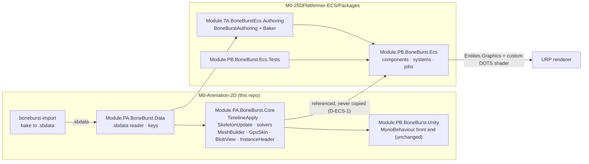
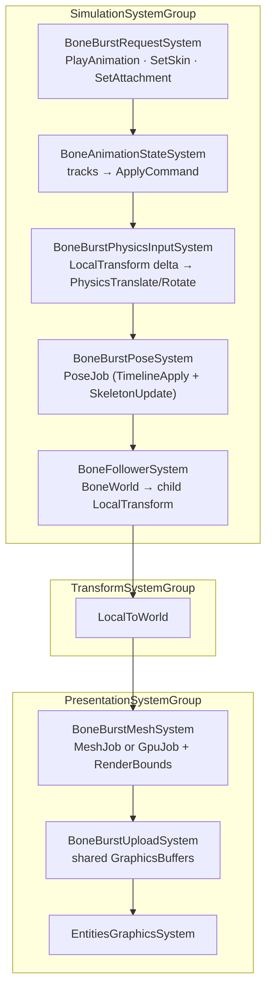
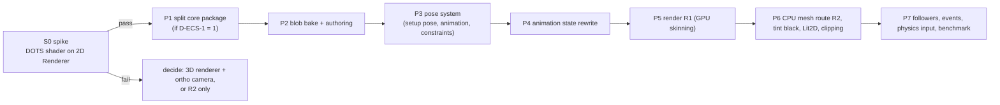

# BoneBurst ECS port: Plan

**Status: S0 spike ran 2026-10-07: it draws on the URP 2D Renderer; batching and sorting still unverified (see §8). D-ECS-1 = option 1 and D-ECS-2 = option A were chosen by the owner on 2026-10-07. P1 (core split) and P2 (blob bake and authoring) done 2026-10-07, see §9 and §10; P3 (pose system) done 2026-10-07, see §11; P4 (animation state) done 2026-10-07, see §12; P5 (render) done 2026-10-07 except a player build and the 3D renderer's pass (§13, §14); P6 (CPU route, skins, tint black, Lit2D) done 2026-10-07 except the vertex-fetch route, rim light and a player build (§15); P7 not started.**

BoneBurst's pose, constraint, timeline and mesh code (`Module.PA.BoneBurst.Core`) is already Burst-friendly pointer code with no `UnityEngine`. The port keeps that code unchanged and replaces only the managed shell around it (`BoneBurstSystem`, `BoneBurstSkeleton`, `BoneBurstAsset`, `BoneAnimationState`, the GPU and fetch buffers) with Entities 6.7 systems, bakers and Entities Graphics. The result is a new package in `M0-25DPlatformer-ECS/Packages`.

## 1. What was found

### Target project (`M0-25DPlatformer-ECS`)

| Fact | Value | Consequence |
|---|---|---|
| Editor | `7000.0.0a7` (alpha) | APIs may move; BoneBurst's floor is 6000.6, so the new package must compile on both. |
| Packages | entities 6.7.0, entities.graphics 6.7.0, collections 6.7.0, burst 2.0.0, mathematics 1.4.0, URP 17.7.0 | BoneBurst asks collections 6.6.0; fine. |
| Renderer | **URP 2D Renderer** (`Assets/Settings/Renderer2D.asset`) | The URP 2D shaders contain no DOTS instancing. **Entities Graphics on the 2D Renderer is unproven.** This is the main risk (S0). |
| `Packages/` | only `manifest.json`, `packages-lock.json` | No existing package convention; we bring ours (`Module.<Tier><Band>`). |
| Existing ECS | `Assets/ECS`, `SystemBase` demo, no bakers, jobs, blobs | Nothing to conflict with. Entities 6.6+ removed class `IComponentData`: structs plus `UnityObjectRef<T>` only. |

### Entities Graphics (read from `Library/PackageCache`)

*   `RenderMeshUtility.AddComponents(entity, em, RenderMeshDescription, RenderMeshArray, MaterialMeshInfo)` makes an entity drawable; `MaterialMeshInfo.FromRenderMeshArrayIndices(mat, mesh, submesh)` picks material and mesh.
*   Per-instance shader data goes only through `[MaterialProperty("_Name")] struct … : IComponentData`; the shader must declare it in `UNITY_DOTS_INSTANCING_START` and use `#pragma multi_compile _ DOTS_INSTANCING_ON`, target 4.5, SRP-Batcher-compatible CBUFFER.
*   Bounds are static: `RenderBounds` (local) feeds `WorldRenderBounds`. A deforming skeleton must set bounds to cover its whole range, or it pops at the screen edge.
*   Built-in deformation (`Unity.Deformations`: `SkinMatrix` buffer, `DeformedMeshIndex`, Compute Deformation node) is **experimental**, built around 3D `SkinnedMeshRenderer` meshes, its systems are `internal sealed`, and it has no free-form deform, clipping or tint-black. Decision: **not used** (see R3).

### BoneBurst (read from the package)

*   Reusable unchanged (static unsafe code over `BlobView` + `InstanceHeader`): `TimelineApply.ApplyAll`, `SkeletonUpdate`, all solvers, `PoseMath`, `MeshBuilder`, `ClipMeshBuilder`, `Clipper`, `GpuSkin`, the job bodies in `PoseJob`, `MeshJob.BuildScratch`, `GpuJob`, the HLSL.
*   Already blob-shaped: `SkeletonBlob` is about 29 flat blittable `NativeArray`s read through pointer struct `BlobView`.
*   Managed and to be replaced: `BoneBurstSystem` (PlayerLoop, `List` of owners), `BoneBurstSkeleton`, `BoneBurstAsset` (UniTask, AssetSystem), `BoneAnimationState` (1171 lines, `Action` listeners, `List<>`), `BoneBurstSkin`, `InstanceData` (managed owner of native memory), `BoneBurstGpu`, `BoneBurstFetch`, `UploadCpuMesh`, material setup.
*   Rendering today: one `Mesh` per skeleton; per-instance data via `Renderer.SetShaderUserValue`; three shader variants (CPU mesh, `BONE_BURST_GPU`, `BONE_BURST_FETCH`).

## 2. Design

### 2.1 Data: baked once, read as blob

Authoring (editor only) reads the `.sbdata` the import package already bakes, runs the existing `BoneBurstDataReader` and Core's `BlobBuilder.Build`, and writes the result as an Entities `BlobAssetReference<SkeletonBlobData>`. Each `NativeArray` becomes a `BlobArray<T>`; at schedule time a `BlobView` is filled from `GetUnsafePtr()` of the blob arrays, so **the solvers see the same pointers as today**. Core's `BlobBuilder` shares a name with `Unity.Entities.BlobBuilder`: always alias one of them.

Names (skin, animation, attachment) become hashed `BoneBurstKey` ids in a sorted blob array, so no managed string lookup is needed at runtime.

### 2.2 Per-instance memory (D-ECS-2)

`InstanceHeader` has about 60 raw pointers into one instance's native memory. Chunk memory moves, so these cannot point into `DynamicBuffer`s that outlive a job. Two options:

| | A. Native block per entity (recommended for phase 1) | B. Everything as `DynamicBuffer`s |
|---|---|---|
| How | `BoneBurstInstance : IComponentData` holds one persistent allocation (the current `InstanceData` layout, made unmanaged); `BoneBurstInstanceCleanup : ICleanupComponentData` frees it. Header is rebuilt from it in the job. | About 30 buffer component types per entity, header built from `BufferAccessor`s per chunk. |
| Core changes | none | none, but a large header-builder |
| Parity risk | lowest | higher |
| Chunk locality | no (same as today) | yes |
| Bone/slot readable by other systems | via pointer | native `DynamicBuffer` |

Phase 1 uses A to reach parity fast; B is a later optimisation only if the benchmark shows chunk locality matters. Bone data other systems need (bone followers, attachment sockets) is exposed through a small accessor over A.

### 2.3 Animation state: blittable rewrite

`BoneAnimationState` is the one big piece of real new code. It becomes:

*   `DynamicBuffer<BoneTrackEntry>` (blittable: animation index, time, mix, alpha, loop, speed, next, mixing-from index) plus a `PlayAnimationRequest` event or enableable component.
*   `BoneAnimationStateSystem` (Burst, `IJobEntity`) producing the same `ApplyCommand` list `TimelineApply` already consumes.
*   Listeners become a `DynamicBuffer<BoneBurstEventElement>` filled by the pose job and read by gameplay systems. No `Action` anywhere.
*   Guard: a test that runs the managed `BoneAnimationState` and the ECS version over the sample corpus and compares the resulting `ApplyCommand` streams exactly.

### 2.4 Components and system order

Main components: `BoneBurstSkeletonRef` (blob + asset id), `BoneBurstInstance` (2.2), `BoneBurstSkinState`, `BoneBurstColor` and `BoneBurstFlip` (as `[MaterialProperty]`), `BoneBurstPoseOffset` (`_BoneBurstPoseOffset`), `BoneBurstVisibility` (replaces `OnBecameVisible`, driven by culling results, feeds `UpdateWhenInvisible`).

All jobs keep `[BurstCompile(FloatMode.Strict, FloatPrecision.Standard)]` so the parity harness remains valid.

### 2.5 Rendering routes

The per-skeleton unique `Mesh` does not fit Entities Graphics, which batches by shared mesh and material and registers each `Mesh` globally. Three routes:

| Route | Idea | Verdict |
|---|---|---|
| **R1: GPU-skinning on shared meshes** | A static mesh of local positions + influences is shared by every entity with the same skin and attachment set; per-entity pose comes from the shared pose `GraphicsBuffer` at `_BoneBurstPoseOffset`. Custom DOTS-instanced shader derived from `BoneBurst-Unlit/Lit2D`. | **Target.** Fully Entities Graphics, SRP-batched. Skeletons whose attachments or draw order change at runtime need another static mesh or fall to R2. |
| **R2: Fetch buffer + one big mesh** | CPU skin result streamed into a ring `GraphicsBuffer`; indices in a pooled mesh. | Fallback for dynamic skeletons and if S0 fails: draws through `RenderMeshIndirect` / `Graphics.RenderPrimitives`, not Entities Graphics, but all simulation stays ECS. |
| R3: `Unity.Deformations` | Map Spine weights to bone weights and use Compute Deformation. | Rejected: experimental, 3D oriented, no deform timelines, clipping or tint black, internal systems. |

Sorting: draw order stays baked into per-vertex z (`ZSpacing`); inter-skeleton order uses the renderer's sorting, which is what S0 must prove on the 2D Renderer.

## 3. Package layout

`M0-25DPlatformer-ECS/Packages/com.module.ta-creator-boneburst-ecs/`, `Runtime/`, `Authoring/`, `Shaders/`, `Tests/`, `Doc/`, beside `package.json` (`unity: 6000.6`). Assemblies follow §4 of `CLAUDE.md`:

| Assembly | Code | References |
|---|---|---|
| `Module.PB.BoneBurst.Ecs` | systems, components, jobs, buffers | Data, Core, Unity.Entities, Entities.Graphics, Transforms, Collections, Burst, Mathematics |
| `Module.TA.BoneBurstEcs.Authoring` | `BoneBurstAuthoring`, Baker | Ecs, Data, Unity.Entities.Hybrid |
| `Module.PB.BoneBurst.Ecs.Tests` | PlayMode tests with a `World` | Ecs |
| `Module.TA.BoneBurstEcs.Tests.Editor` | bake and parity tests | Authoring |

Mermaid-free rule note: every `.md` the new package ships needs its own diagram (§10).

## 4. Decisions needed

*   **D-ECS-1: how the new package reaches Data and Core. Decided 2026-10-07: option 1 (split the core package).** Data and Core sit in the same package as the Unity tier, which needs `pb-creator-base`, UniTask and AssetRuntime. A project that takes the whole package must also resolve M2's `pb-creator-base` and SmartAddresser by `file:`. Options:
    1.  **Split `com.module.ta-creator-boneburst-core`** (Data + Core, depending only on burst/collections/mathematics). The Unity tier and the ECS package both take it. One source of truth. Cost: M2 and M2-Sample manifests each gain one `file:` entry, same session (§1 of `CLAUDE.md`); `.meta` files move with the folders. **Recommended.**
    2.  Depend on the whole package from 25D. Zero moves, but 25D must carry pb-creator-base, SmartAddresser and UniTask by `file:`, and the Unity tier compiles uselessly there.
    3.  Copy Data and Core. Rejected by §4 (a copy "kept in sync" is a bug scheduled for later).
*   **D-ECS-2: per-instance memory**, option A or B in 2.2. **Decided 2026-10-07: A.**
*   **D-ECS-3: where the plan and work live.** This plan sits here because Core is split and parity-checked here; the new package's own `Doc/` gets a pointer when it exists.

## 5. Phases and gates

| Phase | Work | Gate (all must pass) |
|---|---|---|
| **S0** | In 25D, one subscene with a hand-made quad mesh, a minimal DOTS-instanced unlit shader and a `[MaterialProperty]` colour, on `Renderer2D.asset`. Check it draws, SRP-batches, culls and sorts against 2D sprites. Then repeat with a custom pose `GraphicsBuffer` read by `SV_VertexID`. | It draws visibly and batches. If not: stop and choose between the 3D renderer with an orthographic camera or R2-only. **Judging "it draws" needs a human eye in the Game view; report if so.** |
| P1 | Split `Data`+`Core` into their own package per D-ECS-1; change manifests of M2 and M2-Sample in the same session. | `assembly-tier-check` 0 cycles; Unity-tier tests green; `parity-harness` unchanged; both consumers compile (search them first). |
| P2 | Baker producing `BlobAssetReference<SkeletonBlobData>`; `BoneBurstAuthoring` (`.sbdata` TextAsset, atlas pages, shader, default skin and animation). | Blob arrays byte-equal to `BlobBuilder.Build` output over the sample corpus; a subscene bake test. |
| P3 | `BoneBurstInstance`, cleanup component, `BoneBurstPoseSystem`. | Setup pose and animated pose equal the managed reference over the corpus; 0 tests run counts as failure. |
| P4 | Blittable track system. | `ApplyCommand` streams identical to `BoneAnimationState` for mixing, queueing, loop, empty animations, events. Break the mix on purpose once and confirm the test fails. |
| P5 | R1 shader and system, shared meshes, pose upload, bounds. | Pixel test compares ECS draw with the MonoBehaviour draw of the same frame. |
| P6 | R2 fetch route, tint black, Lit2D, clipping, skin changes. | Same pixel suite per variant; player build, not only the Editor. |
| P7 | Followers, event buffers, physics input, visibility mode; benchmark against the MonoBehaviour runtime in a release IL2CPP player, alternating A/B runs. | Numbers in `BoneBurst-Performance.md`; no claim from a development build. |

## 6. Risks

*   **2D Renderer + BRG unproven** (S0). Mitigation: S0 first; R2 and a 3D-renderer fallback are named above.
*   **Editor alpha** (`7000.0.0a7`) in the target project; this repo is on 6000.6.3f1. Mitigation: keep package code free of version guards; compile the package in both projects at each phase.
*   **Strict-float parity under ECS.** Jobs stay strict; the harness covers Data and Core, but not the new ECS shell, so each new piece gets its own comparison test (P3, P4).
*   **Static bounds on animated meshes.** Mitigation: baked per-animation maximum extents into `RenderBounds` with the existing 10% margin rule.
*   **Many shared meshes** when skeletons differ in attachments. Mitigation: pool meshes by a skin/attachment hash, fall to R2 above a cap.
*   **Unverified here:** `ISystem`/`IJobEntity`/ECB signatures were not read in this pass; the first code step reads them, not memory.

## 7. Out of scope

Editor preview, Timeline tracks (`TB.BoneBurstTimeline`), AssetSystem loading (replaced by baking), any change to the MonoBehaviour runtime's behaviour or to the stock Spine forks.

## 8. S0 result (2026-10-07)

Spike code: `M0-25DPlatformer-ECS/Assets/BoneBurstEcsSpike/` (throwaway; delete once S0 is closed). It creates 200 entities with `RenderMeshUtility.AddComponents`, a custom shader (`LightMode` `Universal2D`, DOTS instancing) with `[MaterialProperty]` `_BaseColor` and `_SpikePoseOffset`, and a Burst job that writes a pose per entity into a global `GraphicsBuffer` read in the vertex shader.

| Check | Result |
|---|---|
| Compiles in Unity 7000.0.0a7 with Entities / Graphics 6.7 | yes (one missing asmdef reference, `Unity.Mathematics.Extensions` for `AABB`) |
| Shader compiles with `DOTS_INSTANCING_ON` for the 2D renderer pass | yes, after dropping a duplicate `SV_InstanceID` field (`UNITY_VERTEX_INPUT_INSTANCE_ID` already declares it) |
| Draws on `Renderer2D.asset` | **yes**: the 2D renderer picks up the `Universal2D` pass of a BRG draw |
| Per-instance colour through `[MaterialProperty]` | yes (gradient grid in the Game view) |
| Pose buffer read by vertex shader, written by a Burst job each frame | yes (squares moved and resized per instance; with the pose forced to identity the grid was exact) |
| SRP batching / instancing really merged | **not verified**: the stats read 402 draw calls with 200 entities plus the project's own Bouncer demo, which does not prove either way. Check in P5 with a frame capture, and with the demo off. |
| Sorting against 2D sprites and sorting layers | **not verified** |
| Works in a player build | **not verified** (Editor play mode only) |

Gate verdict: the route is open (the gate's first half), so P1 may start. Batching and sorting move into P5's gate rather than being assumed.

## 9. P1 result (2026-10-07): core package split

`Packages/com.module.ta-creator-boneburst-core/` now holds `Runtime/Data` (`Module.PA.BoneBurst.Data`, 12 files) and `Runtime/Core` (`Module.PA.BoneBurst.Core`, 29 files), moved with `git mv` together with their `.meta` files, so every GUID is unchanged. Assembly names, namespaces and `InternalsVisibleTo` lists are unchanged. It depends only on collections 6.6.0 and mathematics 1.4.0.

Changed beside the move:
*   `com.module.ta-creator-boneburst/package.json` and `…-import/package.json` gain the core dependency.
*   `Tools~/ParityHarness/ParityHarness.csproj` compiles Data and Core from the core package (`CorePackage` property).
*   `BoneBurstAssemblyLayoutTests`: the two `Assembly_OwnsItsFolder` cases point at the core package; new test `CorePackage_DeclaresOnlyThePoseDependencies` guards the point of the split.
*   Manifests: `M2-Creator-All` and `M2-Sample-25DL-Shader` gain a `file:` entry for the core package. M2-Sample's existing BoneBurst line pointed at a folder that does not exist (`M0-Animation2D`) and is corrected to `M0-Animation-2D`.
*   `CLAUDE.md`: package table and consumer note.

| Gate | Result |
|---|---|
| `parity-harness` (compiles Data and Core from the new path) | PASS: 215 of 215, 144,294,824 values, 0 not bit-exact |
| `assembly-tier-check` | PASS: 0 cycles, 0 new upward edges |
| Editor compile (M0, Unity 6000.6.4f1) | 0 errors; Core's 29 and Data's 12 source files resolve under the core package, which Unity lists as Embedded |
| `Module.TA.BoneBurst.Tests.Editor` | 210 of 212 passed, 1 skipped, 1 failed: `BoneBurstPageReferenceTests.DataReference_BuildsTheBlobThroughTheEditorCache_WithoutALoader`. **Not caused by the split:** it reads `Assets/BoneBurstDemo/mix-and-match-pro_BoneBurst/mix-and-match-pro.sbdata.bytes`, which is not on disk and was never in git (the baked demo data is missing from this checkout). Needs the demo baked again; not done here. |
| `Module.TA.BoneBurstImport.Tests.Editor` | 28 of 29 on the first run; the one failure was a 180 s timeout in `BoneBurstBakeTests`, whose whole fixture then passed alone (15 of 15) |
| `Module.TB.BoneBurstTimeline.Tests.Editor` | 14 of 14 |
| `Module.TA.BoneBurst.Tests.SpineCsharp` (EditMode) | 215 of 215 |
| `Module.TA.BoneBurst.Tests` (PlayMode) | 37 of 37 |

**Not verified:** M2-Creator-All and M2-Sample-25DL-Shader were not opened, so neither has compiled against the split yet; their Editors resolve the new `file:` entry on next open. The `M2-Sample` project also carried the dead path before this change, so its first open may show unrelated errors.

## 10. P2 result (2026-10-07): blob bake and authoring

Built in `M0-25DPlatformer-ECS/Packages/com.module.ta-creator-boneburst-ecs/` (commit `c3d997e` in that repo), assemblies `Module.PB.BoneBurst.Ecs` (runtime), `Module.TA.BoneBurstEcs.Authoring` and `Module.TA.BoneBurstEcs.Tests.Editor`.

*   `SkeletonBlobData`: the 28 arrays of Core's `SkeletonBlob` as `BlobArray<T>`, plus the scalars, the skins (bones, constraints, entries sorted by slot and name id), name ids from `BoneBurstKey.IdOf`, timeline property ids, event strings, physics constraint list. `SkeletonBlobView.Create(ref data)` fills Core's own `BlobView`, so the solvers are untouched.
*   `BoneBurstBlobConverter.Convert(byte[] sbdata | BlobContent, allocator)` copies from Core's `BlobBuilder.BuildContent`; it never re-derives. It throws if two animation or skin names, or two placeholders of one slot, hash to the same id.
*   `BoneBurstAuthoring` (`.sbdata` TextAsset, skin, animation, loop) and `BoneBurstBaker`: one blob per distinct file (keyed by `UnityEngine.Hash128.Compute` of its bytes), shared by every skeleton using it; adds `BoneBurstSkeletonRef` and `BoneBurstInitial` (skin and animation as blob indices).
*   **Changed from the plan:** Core's `ConstraintBlob` holds a `fixed float Offsets[6]`, which Entities refuses in a blob type (EA0003). Rather than change Core, the structs are stored as raw four-byte aligned ints in `ConstraintDatasRaw` and cast back in the view; the converter throws if the struct ever stops fitting that store.
*   **Fixtures:** 24 `.sbdata.bytes` files (1.2 MB) baked from BoneBurst's sample corpus with the real readers and writer, kept in the ECS package's `Tests/Data~`. They are derived data: rebake them when the format version changes.

| Gate | Result |
|---|---|
| Arrays byte-equal to `BlobBuilder.BuildContent` over the fixtures | PASS, 74 of 74 EditMode tests (24 fixtures × arrays, names and skins, view; plus control tests) |
| `BlobView` from the blob reads the same bytes as `SkeletonBlob.View` | PASS (all 28 pointers, memcmp) |
| A deliberate bug must fail the test | PASS: dropping the last element of every copied array failed 48 of 74 |
| Subscene bake | PASS, checked by script, not an automated test: two `BoneBurstAuthoring` skeletons (spineboy-pro, "walk" and "run") baked to two entities sharing one blob (65 bones, 53 slots, 11 animations, skin 0, animations 10 and 7). Scripts: `Tests/Tools~/MakeBakeScene.cs`, `QueryBake.cs`. Entities' `BakingUtility` is internal, so an in-test bake needs reflection; deferred. |

**Not done / next:** the authoring has no atlas pages, shader or material yet (P5); `BoneBurstInitial` is baked but nothing consumes it yet (P3 creates the instance from it). The ECS package depends on `com.unity.entities` 6.7.0, which the 25D alpha provides and this repo's 6000.6 does not, so it cannot be opened in M0.

## 11. P3 result (2026-10-07): instance memory and pose system

**What was built** (25D repo commit `8a5f283`; Core change in this repo):

*   **Decision D-ECS-2 = A in practice.** `InstanceData`, Core's per-instance native block, is reused as it is rather than re-written unmanaged: `BoneBurstInstanceStore` (managed, owned by `BoneBurstInstanceSystem`) holds one per entity; the entity carries `BoneBurstInstanceHandle`, an `ICleanupComponentData`, so destroying the entity frees the block. One `SkeletonBlob` per distinct asset reads the **ECS blob** through the new Core constructor `SkeletonBlob(content, in BlobView)` (nothing copied), and the managed `BlobContent` (skins and names, for creation and later skin changes) is rebuilt once per asset from the entity's `BoneBurstSkeletonSource` (`UnityObjectRef<TextAsset>`, baked by the baker).
*   `BoneBurstInstanceSystem` creates instances for baked skeletons that have none (initial skin from `BoneBurstInitial`), frees those of destroyed entities, and marks entities without data `BoneBurstInstanceFailed` after one loud error.
*   `BoneBurstPoseSystem` builds every header on the main thread and runs **`PoseStep.Run`** in one `[BurstCompile(FloatMode.Strict)]` job. `PoseStep` is new in Core (`Core/Instance/PoseStep.cs`); the Unity front's `PoseJob.Pose` now calls it, so the pose order lives in one place.
*   Commands reach an instance through `BoneBurstInstanceStore.Stage(index, CommandBuffer)`, which copies them into the instance's native lists as `BoneBurstSkeleton.Header` does. Today they come from the managed `BoneAnimationState`; P4 replaces that source.

**Gates:**

| Gate | Result |
|---|---|
| Setup pose equals `ManagedPose` (bones world and local, slot attachments, colours, draw order) over 24 fixtures, tolerance 1e-4 as the other Burst-versus-managed suites | PASS |
| Animations equal the managed reference every frame: three animations per fixture (first, middle, last), 24 frames each, a fresh instance per animation, including the physics and path fixtures (celestial-circus, cloud-pot, sack, snowglobe, synthetic constraints) | PASS |
| Two entities of one asset share one `SkeletonBlob` and pose independently; destroying an entity frees its instance and removes the cleanup component; no-data entity fails once, loudly | PASS |
| 25D `Module.TA.BoneBurstEcs.Tests.Editor` | 125 of 125 |
| A deliberate bug must fail the test | PASS: clearing the staged commands failed 24 of 125. A first attempt (`ApplyRan = false`) changed nothing and was discarded: that flag only gates end-of-apply bookkeeping, so it proved nothing. |
| Core change guards in M0: `parity-harness` 215/215, 0 values not bit-exact; Editor compile clean; `Module.TA.BoneBurst.Tests.Editor` 210/212 (the one failure, `BoneBurstPageReferenceTests`, is the missing baked demo data of §9); PlayMode `Module.TA.BoneBurst.Tests` 37/37 | PASS as before |

**Found while testing:** a setup-pose reset (`NeedsSetupPose`) restores bones only; slots, deform and constraints keep what an earlier animation left. That is how the MonoBehaviour runtime behaves too, so tests use a fresh instance per animation; P6's skin and attachment changes must not assume a reset cleans slots.

**Not done / next:** the pose job completes inside the system, because tests read the results at once; P5 will let it overlap the frame. No colour, flip or `LocalTransform` input yet (the header uses white and scale 1; the pose does not read them), no events leave the instance yet (P4). Managed header building per instance stays on the main thread, as in the MonoBehaviour runtime (2.5 ms for 2000 skeletons there); measure in P7 before changing it.

## 12. P4 result (2026-10-07): animation state

**What was built** (25D repo, in `com.module.ta-creator-boneburst-ecs/Runtime`):

*   `BoneTrackState` (+ `TrackEntry`): a line-by-line port of the managed `BoneAnimationState` into unmanaged memory. Entries are separate allocations linked by pointer, freed after their Dispose event is delivered (a dead list, flushed when nothing can still point at them); the queue, the steps, and the command output (`Commands`, `Modes`, `HoldFactors`, `Rotation`) are `UnsafeList`s; events leave as `TrackEventRecord`s (track and animation indices, keyed-event payload by blob index), never as pointers. It reads the ECS blob only (timeline ids and instant flags come from `SkeletonBlobData`). Mixes are a small pair list per state. The managed class stays in Core as the oracle.
*   `BoneBurstInstanceStore` keeps one `BoneTrackState` per instance (freed with it); `Stage(index, ref state)` hands its commands to the pose step.
*   Systems, in order: `BoneBurstInstanceSystem` (also adds the request and event buffers, applies `BoneBurstInitial.Animation` and the default mix) → `BoneBurstAnimationSystem` (requests, `Update`, clock, `Apply`, stage) → `BoneBurstPoseSystem` → `BoneBurstAnimationAfterSystem` (`AfterApply`: fired events, total alpha and rotation memory fed back; queues keyed events and completes). Gameplay talks through `DynamicBuffer<BoneBurstAnimationRequest>` (set, add, set empty, add empty, clear track, clear tracks, set empty animations) and reads `DynamicBuffer<BoneBurstTrackEvent>`, rebuilt every frame. `BoneBurstAnimationSettings` (optional) gives time scale, unscaled time and default mix, applied as the MonoBehaviour front does (`delta × TimeScale` drives both the tracks and the skeleton clock).

**Gates:**

| Gate | Result |
|---|---|
| `ApplyCommand` streams identical to `BoneAnimationState`: seeded random operations (set, add with delays, set and add empty, clear track and tracks, set empty animations, entry tweaks: alpha, time scale, additive, reverse, shortest rotation, event and attachment thresholds, mix duration, track end, animation start; random mixes, default mix, time scale and frame times), 3 seeds × 24 fixtures × 220 frames, compared every frame: every command field, modes, hold factors, rotation memory, unkeyed state, applied flag, and the full event stream including keyed events | PASS, 72 of 72, exact equality |
| Systems end to end (requests from a buffer, initial animation, time scale 2 and 0.5, default mix): pose and events equal the managed pipeline every frame over 150 frames; a keyed event is seen | PASS, 3 of 3 |
| Disposing a state with queued, next and mixing entries frees everything once | PASS |
| 25D `Module.TA.BoneBurstEcs.Tests.Editor` | 201 of 201 |
| A deliberate bug must fail the test | PASS, three: mixing-from time ignoring `TimeScale` failed 50 of 198; `alphaHold` without its division failed 72; `HasTimeline` always false failed 67. Every fuzz case reaches hold and mixing. |

**Left out on purpose:** the managed `TryAdvanceSteady` shortcut (a lone track-0 entry at alpha 1 becomes one Fast command, a perf optimisation with the same output); P7 measures first. Skipping idle instances (no entries, no physics) is also P7. The port has no Burst compile step yet: the systems run it on the main thread, as the MonoBehaviour front does with the managed class.

**Next:** P5, the Entities Graphics route: the shared pose buffer, a DOTS-instanced shader derived from the BoneBurst ones, bounds, and the batching and sorting checks S0 left open.

## 13. P5 progress (2026-10-07): the GPU data path

P5 is split in two because the render side needs a shader, Entities Graphics registration and a visual check. **Step 1, the data path, is done:**

*   `BoneBurstGpuBuffers` (per store): the shared pose records and the per-asset vertex influences as ranges of one array each, with a first-fit `RangeAllocator` (moved into Core, `Core/Gpu/RangeAllocator.cs`, so both runtimes share it) and uploads of the touched span to two GraphicsBuffers, `_BoneBurstEcsPose` and `_BoneBurstEcsInfluences` (own names, so the MonoBehaviour runtime's shaders cannot collide in a project that has both).
*   `BoneBurstGpuRecordJob` (classify, write the pose record, refresh bounds of a reused mesh) and `BoneBurstGpuBuildJob` (the static mesh: local positions, and per vertex the influence start, count, bone and slot record) over Core's `GpuSkin`, both Burst strict-float. Core got `InternalsVisibleTo("Module.PB.BoneBurst.Ecs")` for the instance's GPU fields.
*   `BoneBurstGpuSystem` (after the animation systems): records for every GPU instance, builds for those classified `NeedsBuild`, and **a cache by topology**: the build's topology signature (slot order, attachments, sequence frames, z spacing, tint black) keys a `BoneBurstGpuMesh`, so instances of one asset with one topology use one `Mesh` (the colour and pose come from the pose buffer, nothing in the mesh is per instance). A skeleton marked `BoneBurstGpuSkinning` gets its range at creation and gives it back when its entity is destroyed.
*   The store's header now carries the colour space and the asset's premultiplied-alpha flag the way the MonoBehaviour front sets them.

| Gate | Result |
|---|---|
| Per frame over 24 fixtures, 36 frames of the first animation: mesh classification equals `ManagedPose.GpuFrame`; pose record equals within 1e-4; bounds equal within 1e-4; when a mesh is built, its vertices (position, uv, colour bytes), influence data and indices equal the reference | PASS (frames where the reference needs the CPU are skipped and counted) |
| Two instances with different animations write their own records into their own ranges | PASS |
| Three instances of one topology: three builds classified, one new mesh, reused afterwards; two skins, two meshes; a destroyed entity's pose range is reused first | PASS |
| 25D `Module.TA.BoneBurstEcs.Tests.Editor` | 229 of 229 |
| Deliberate bugs: hash constant with topology always "same" failed 6; records written at offset 0 failed 1. Two earlier attempts passed everything and were discarded as the test's fault, not the code's (a hash-only change never reaches the comparison; one instance always starts at offset 0): the two-instance test above was added so the second mutation is caught | PASS |
| M0 after the `RangeAllocator` move and the new `InternalsVisibleTo`: parity harness 215/215, 0 values not bit-exact; tier check clean; Editor compile clean; `Module.TA.BoneBurst.Tests.Editor` 210/212 (same single failure as §9); PlayMode 37/37 | PASS |

**Found:** the managed reference defaults to linear colour space; a header built without it differs in the colour bytes by a step or more (one fixture by 14%). Every header builder must set `LinearColorSpace` from the project, which the store now does.

**Limits kept for now:** a GPU instance the classifier sends to the CPU (deform, clipping) gets no mesh and no draw until P6; the pose buffer is uploaded once per frame by the system, not by the render step.

**Step 2, still to do:** per instance and submesh a render entity (one `MaterialMeshInfo` draws one mesh, material and submesh; the submesh key is `page × 4 + blend`), a DOTS-instanced shader derived from the BoneBurst ones that reads `_BoneBurstEcsPose` with a `[MaterialProperty]` pose base, materials per (asset, page, blend) from authored page textures, `RenderBounds` from the instance's bounds, and the checks S0 left open: batching and sorting against sprites, and a player build.

## 14. P5 step 2 (2026-10-07): render entities, shader, checks

**Built** (25D repo, commit `9fc2770`): `BoneBurstEcsUnlit.shader` (derived from `BoneBurst/Unlit`, GPU skinning only, DOTS-instanced, `Universal2D` and `UniversalForward` passes, `_BoneBurstPoseBase` per entity); `BoneBurstRenderSystem` (one render entity per submesh of the instance's shared mesh, parented to the skeleton, `MaterialMeshInfo` from `EntitiesGraphicsSystem.RegisterMesh` and `RegisterMaterial`; materials per atlas page and blend from authored page textures; bounds from the instance's output every frame; children destroyed with the skeleton); `BoneBurstRenderSettings`, `BoneBurstPageTexture`, `BoneBurstPoseBase`, `BoneBurstRenderChild`; new `BoneBurstAuthoring` fields `Pages`, `Shader`, `GpuSkinning`. Check scripts: `Tests/Tools~/` (`MakeRenderScene.cs`, `Spawn30.cs`, `EgStats.cs`, `AddSprites.cs`).

| Check | Result |
|---|---|
| EditMode suite with the render code | PASS, 229 of 229 |
| Drawing: a subscene of baked spineboys, Game view of the 25D Editor, URP 2D Renderer, linear colour space | PASS, by eye: spineboy textured and posed correctly through Entities Graphics with GPU skinning; 30 instantiated copies of the baked entity drew too, at their own pose ranges, sharing one mesh |
| Batching: Entities Graphics' own counters (`EntitiesGraphicsSystem.Stats`) | PASS: **31 BoneBurst render entities gave 31 rendered instances, 1 draw command, 1 draw range, 1 batch**. The Editor's built-in counters (draw calls, batches, `ProfilerRecorder`) do not see Batch Renderer Group draws: they read 402 and 0 whatever is on screen, so they prove nothing either way |
| Sorting against sprites: a red sprite at sorting order -10 and a blue one at +10 around a skeleton | PASS, by eye: the skeleton draws over the red and under the blue, i.e. as a renderer on the Default sorting layer at order 0 |

**Limits found:**
*   **Sorting.** Entities Graphics' `RenderFilterSettings` has a layer and a rendering layer mask but no sorting layer or sorting order, so a skeleton always sorts as Default layer, order 0. Sprites are ordered around it by their own layer and order; a skeleton cannot be given a layer or order of its own. A way to place it (a material render queue offset, a per-skeleton sorting component the render system turns into a z offset, or a custom render pass) is open and is a P7 or owner decision.
*   **Only GPU-skinnable skeletons draw.** spineboy's "walk" and "run" are classified `NeedsCpu` (deform or clipping), as the managed reference says, so they are posed but not drawn until P6's CPU route.
*   `EntityManager.Instantiate` of a baked skeleton gives a working instance (the cleanup handle is not copied, the instance system makes a fresh one).
*   The Editor's pipeline stops answering `unity command` while the 25D Editor is in play mode and in the background after a long session; restarting the Editor fixed it. Nothing in the package caused it.

**Not verified:** a player build (IL2CPP, shader variants, subscene content loading); the shader on the 3D renderer's `UniversalForward` pass; tint black, Lit2D and rim light on this route (P6).

## 15. P6 result (2026-10-07): CPU route, skins, tint black, Lit2D

**Built** (25D repo, commits `78bf56b`, `e40cd7c` and the Lit2D one):

*   **CPU route.** `BoneBurstCpuMeshJob` (the scratch step of the MonoBehaviour front's `MeshJob`, without vertex fetch) and `BoneBurstCpuMeshSystem` mesh every instance that is not GPU-skinned and every GPU instance the classifier sent to the CPU (deform, clipping): the job fills the instance's own lists, the main thread uploads the vertices every frame and the indices and submesh table only when the topology hash changed. `BoneBurstGpuMesh` became `BoneBurstDrawMesh` (a shared GPU mesh, or the instance's own CPU mesh with a `Version`); the render system rebuilds an instance's render entities when its mesh or that version changes, and picks the GPU or CPU variant of the shader keyword `BONE_BURST_GPU`. A GPU instance that falls back invalidates its GPU topology, so it returns to a shared mesh when the classifier allows. **Change from the plan:** R2 as planned was a shared vertex buffer (vertex fetch); this step is the simpler per-instance mesh, which is what the MonoBehaviour front did before fetch. Fetch stays open until a measurement asks for it.
*   **Skin requests**: `SetSkin`, `SkinBegin`/`SkinAdd`/`SkinApply` (the M2 `SpineLook` pattern), `SetAttachment`, `SetupPoseSlots`, `SetupPose`, in the same request buffer as the animation requests.
*   **Tint black** (`BoneBurstTintBlack`, authoring `TintBlack`): the record stride on the GPU route, the second vertex stream on the CPU route, the dark-colour code in both shaders and the `_TINT_BLACK_ON` keyword on the materials.
*   **Lit2D.** `BoneBurstEcs/Lit2D` (the light-combine and normals passes, an unlit forward pass) beside `BoneBurstEcs/Unlit`, both on a shared `BoneBurstEcsCommon.hlsl`; the shader is now per skeleton (`BoneBurstRenderSettings`), so lit and unlit skeletons of one asset coexist. Rim light is **not** ported: it needs the rim mask textures and their authoring.

| Gate | Result |
|---|---|
| CPU route equals `ManagedPose.BuildMesh` (vertex position within 1e-4, uv and colour bytes exact, indices exact, counts, submesh keys, bounds) every frame: 24 fixtures on the CPU route, and 24 fixtures with GPU skinning on whose classifier-forced fallback frames are compared the same way | PASS, 48 of 48 |
| Topology rewritten exactly when the reference's indices or submesh keys changed | PASS (inside the same tests) |
| spineboy "idle" on the GPU route, "walk" falls back to the CPU mesh; the mesh follows the reference classifier every frame | PASS |
| Tint black on both routes against the reference: classification, GPU record with stride 2, CPU tint stream, 24 fixtures × 20 frames | PASS |
| Mix-and-match skin requests (combined skin, then a single skin), GPU and CPU, slot attachments and mesh against the reference; `SetAttachment` and `SetupPose` | PASS |
| 25D `Module.TA.BoneBurstEcs.Tests.Editor` | 305 of 305 |
| Deliberate bugs: vertices uploaded only with the topology failed 23; topology never rewritten failed 6; tint stream not uploaded failed 22 (so the corpus does have dark colours); combined skin without its parts failed 2. One attempt (skipping the slot reset in `SkinApply`) changed nothing: with this sample `SetSkin` already places the attachments, so that call is redundant there; it was discarded | PASS |
| Seen on screen (25D Editor, URP 2D Renderer): spineboy "walk" and "run" now draw (CPU route) beside "idle" (GPU route); four spineboys of one asset under a Global and a warm Point Light 2D: the Lit2D ones are darker, and the lit walking one (CPU route) takes the point light | PASS, by eye |

**Left open:** the vertex-fetch route (a shared vertex buffer, instancing for CPU-skinned skeletons: the CPU route draws one mesh and one draw call per skeleton), rim light and the Lit2D rim masks, a player build (shader variants, subscene loading) and the 3D renderer's pass of both shaders, a Lit2D unit test (checked by eye only), and a skeleton's sorting layer and order (§14).
