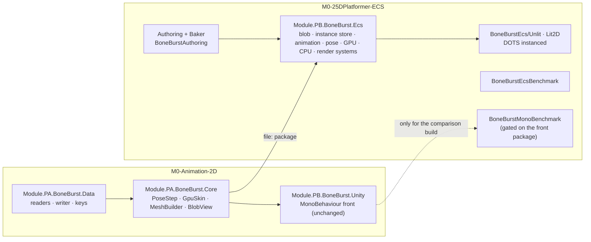
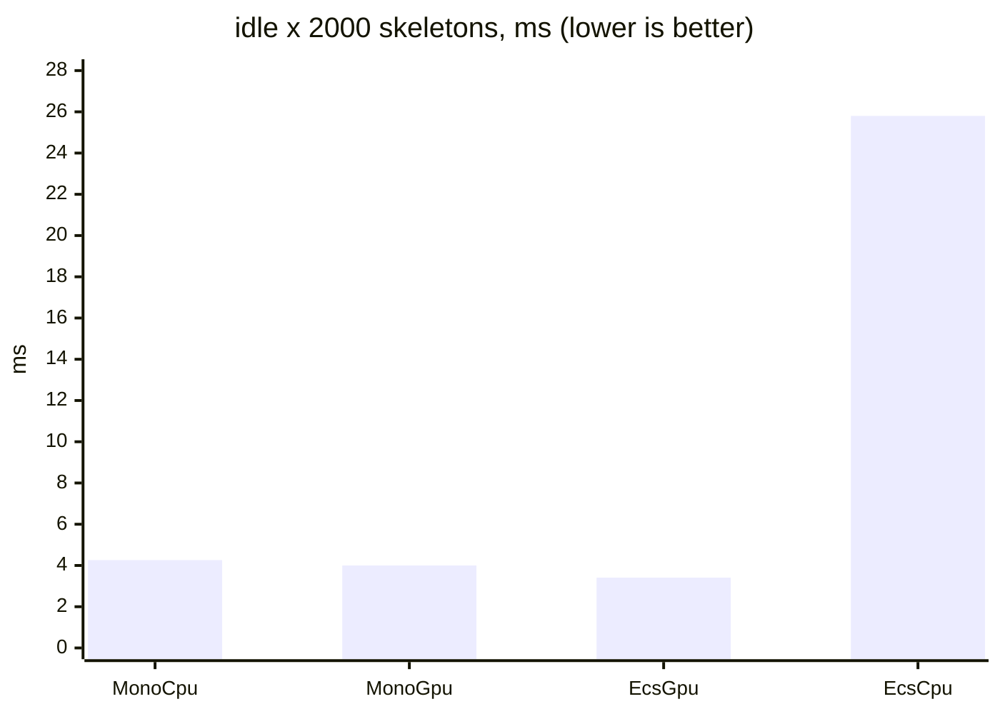

# BoneBurst ECS port: Summary of everything (S0, P1–P12)

BoneBurst's pose, constraint, timeline and mesh code was already Burst pointer code with no `UnityEngine`. The port kept it unchanged (moved into `com.module.ta-creator-boneburst-core`) and replaced only the managed shell with Entities 6.7 systems, bakers and Entities Graphics, in a new package `com.module.ta-creator-boneburst-ecs` in `M0-25DPlatformer-ECS`. All twelve phases ran on 2026-10-07; the detail, evidence and per-phase tables are in [BoneBurst-ECS-Plan.md](BoneBurst-ECS-Plan.md) (§ numbers below point there).

## What exists now

| Part | What it does |
|---|---|
| `com.module.ta-creator-boneburst-core` (M0) | Data + Core assemblies split out of BoneBurst; depends only on collections and mathematics. `PoseStep` is the pose order both runtimes share. |
| Blob and bake | `SkeletonBlobData`, `BoneBurstBlobConverter`, `BoneBurstBaker`: the `.sbdata` becomes a shared BlobAsset; authoring has data, skin, animation, loop, GPU skinning, tint black, pages, shader, render queue, rim light. |
| Instance store and systems | `BoneBurstInstanceStore` (one native block per entity, D-ECS-2 option A), instance, animation (+ after), pose, GPU, CPU-mesh, render and follower systems; physics input, event buffers, idle skipping. |
| Render | One render entity per submesh through Entities Graphics; DOTS-instanced shaders reading the shared pose buffer; Lit2D with Light 2D, tint black, rim light; per-skeleton render queue. |
| Checks | 383 EditMode tests (fuzz against the managed oracle, deliberate-bug checks), on-screen captures through Unity, release players, an ABBA benchmark script. |

## The phases

| Phase | Result | Plan § |
|---|---|---|
| S0 spike | Skeletons draw on the URP 2D Renderer through Entities Graphics. Decisions: split the core (D-ECS-1), a native block per entity (D-ECS-2 A). | 8 |
| P1 core split | Data and Core moved to their own package; layout guarded by `BoneBurstAssemblyLayoutTests`. | 9 |
| P2 blob bake | Skeleton data as a BlobAsset; `ConstraintBlob` stored as raw ints (a `fixed float` buffer cannot be a blob field). | 10 |
| P3 pose system | Burst pose job, tolerance 1e-4 against `ManagedPose`, byte-exact commands and events. | 11 |
| P4 animation state | Unmanaged track state, mixing, requests, events, parity with the managed state. | 12 |
| P5 render | GPU route draws: render entities, DOTS shader, materials per asset/page/blend, bounds. | 13, 14 |
| P6 CPU route, skins, tint black, Lit2D | Data-level checks for all; Lit2D seen on screen. | 15 |
| P7 physics, followers, idle skipping, benchmark | First benchmark: level with the mono runtime at 2000 skeletons. | 16 |
| P8 shell overhead | Steady-animation shortcut, one frame job, no staging copies: 7–16% less at 100–2000. | 17 |
| P9 sorting | Entities Graphics has no sorting layer or order; a per-skeleton render queue orders a skeleton against sprites (below 3000 behind, 3000 and above in front). | 18 |
| P10 variants in a player | Found and fixed: the pure CPU route never drew (the render query required the GPU component); the by-name default shader was stripped from a player (the baker now stores it). | 19 |
| P11 tint black, rim light | Rim light built on the ECS Lit2D shader (per-material rim); tint black seen on both routes; both match between Editor and a player. | 20 |
| P12 same-backend comparison | Both runtimes as CoreCLR players, ABBA; see the numbers below. | 21, 22 |
| P13 CPU route vertex fetch | Shared vertex list, topology-only meshes, a `BONE_BURST_FETCH` shader variant, a three-buffer ring filled by a parallel copy: EcsCpu 25.8 → 4.85 ms at 2000 (1.14× MonoCpu). | 23 |

## Performance (P12, CoreCLR players, median frame ms, 1920×1080, vsync off)

| animation × count | MonoCpu | MonoGpu | EcsGpu | EcsCpu |
|---|---|---|---|---|
| idle × 2000 | 4.26 | 4.00 | 3.41 | 25.80 |
| walk × 2000 | 4.50 | 4.06 | 3.42 | 26.10 |
| switch × 2000 | 5.61 | 5.50 | 5.20 | 26.31 |
| switch × 500 | 2.40 | 2.23 | 1.92 | 7.45 |
| switch × 100 | 0.51 | 0.50 | 0.65 | 1.45 |

*   The ECS GPU route is 15–20% faster than the mono GPU route idle or walking at 2000, 5% faster switching at 2000, 14% faster at 500, and 30% slower at 100 (a fixed floor of about 0.30 ms for one skeleton against 0.19 for mono, mostly Entities Graphics, the transform system and the player loop).
*   **The ECS CPU route was 6× slower than the mono CPU route in P12 (25.8 ms at 2000 idle); P13's vertex fetch brought it to 4.85 ms, 1.14× MonoCpu (4.25).** The EcsCpu figures in the plan's §16 and §17 measured skeletons that were never drawn (fixed in P10) and are corrected in §22; the table above is P12's, the P13 table is in §23.
*   Limits: the machine carried the load of another session's runaway `vitest` workers during every run (load 6.5–9), so differences under about 5% are not claims; IL2CPP was not compared (the 7000.0.0a7 Editor ships only CoreCLR macOS player variations).

## What is left

| Item | Why it matters |
|---|---|
| Remaining ECS gap at small counts and in the pose and animation systems | 0.65 against 0.50 ms at 100 skeletons (a fixed floor); the pose system takes 2.1 ms and animation 0.8 ms at 2000. |
| Real sorting layer and order | Needs a custom render pass or a fork of Entities Graphics' filter settings; the render queue only orders against sprites of one layer and order. |
| Visibility mode | Not built (P7 left it open). |
| Painted rim masks, rotated atlas regions and flipped skeletons on screen | Rim was seen with white masks only. |
| IL2CPP comparison | Needs an IL2CPP macOS variation for Unity 7000, or an Entities port to 6000.6. |
| 3D renderer's `UniversalForward` pass | Both shaders unchecked there. |
| Instance creation cost at spawn | Not measured. |
| Regression tests for the render system and baker | They need a graphics device and a subscene world; the guard today is the player capture. |

## Costs and cautions found on the way

*   Adding `pb-creator-base` to the 25D project: its vHierarchy throws every Editor update on Unity 7000, and its build gate refuses player builds until Addressables settings and a KeyInt export exist. The comparison used them temporarily and removed them; the mono harness compiles only when the front package is present. Exact steps: plan §22.
*   Editor hangs and one heap-corrupting crash came from deliberate bugs and stale compiles; the helper scripts now wait on `isCompiling` and demand the full test count.
*   Still uncommitted and not mine: the three Unity asset files in M0, the 25D project's settings rewrites and `Assets/_Recovery`, and the M2 manifest edits from P1.
