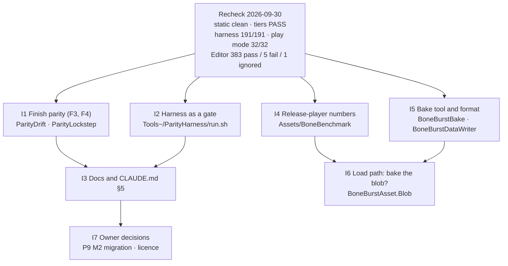

# BoneBurst — improvement plan (after the 2026-09-30 recheck)

**Status:** I1–I4 done and I6 decided (2026-10-01). I1: the Editor parity suite is green in Release and Debug JIT ([BoneBurst-ParityPlan.md](BoneBurst-ParityPlan.md) §3.4). I2: the `parity-harness` gate. I3: the docs match the checks; 0.1.0. I4: release-player load and frame time after the bake ([BoneBurst-Performance.md](BoneBurst-Performance.md) §2.1). I6: not done (the blob build is 0.2 ms). I5 items 1–4 done (format v2 measured and rejected, compressed benchmark, variants, label lookup); item 5, the walk through the popup by hand, waits for the owner. **I7 closed 2026-10-01:** P9 — M2's `Module.TC.CCP.Spine2D` migrated onto BoneBurst and M2 removed the stock Spine packages; the licence — decided and shipped (`LICENSE`, [Licence.md](../Licence.md)).

The package was rechecked on 2026-09-30 after the bake plan (B1–B5) and parity plan phases F1–F3 landed. The code is clean and the runtime is proven: on strict float32 it matches stock spine-csharp bit for bit (191 of 191), and Burst matches its managed reference in play mode (32 of 32). The open work is in four streams:
- **Finish the parity plan:** 5 Editor failures, the deliberate-bug checks, a Debug-JIT run, docs.
- **Make the strict-float harness a standing gate.**
- **Measure what the bake changed in a release player.**
- **Tidy the bake tool and the format.**

Each item names the evidence that raised it, and says when it is done.

## 1. Recheck results (2026-09-30, Unity 6000.6.3f1, macOS ARM64, Metal)

| Check | Result |
|---|---|
| `.meta` files (missing or orphan) | none |
| Code style (`var`, doc tags on the declaration line) | clean |
| `UnityEditor` in `Runtime/`, `DEVELOPMENT_BUILD`, `UnityEngine.Input` | none |
| Markdown without a Mermaid diagram | none |
| Leftover `TODO` / `TEMPORARY` / `MUTATION` markers | none |
| Relative links in the package docs | all resolve |
| Assembly tier gate (`tiercheck.py`) | PASS |
| Compile (`playtest.py compile`) | PASS, 0 project warnings |
| Strict-float harness (`run.sh`) | **191 of 191**, bit for bit |
| Play mode (`Module.TA.BoneBurst.Tests`) | **32 of 32** |
| Editor (`Module.TA.BoneBurst.Tests.Editor`, Release JIT) | **383 passed, 5 failed, 1 ignored** |

**Found stale or missing:**

| Where | What |
|---|---|
| `BoneBurst-Plan.md` status line | Still lists "find the stock-parity difference" as open. It was found: Mono's JIT-dependent rounding ([BoneBurst-ParityPlan.md](BoneBurst-ParityPlan.md) F1). |
| `CLAUDE.md` §5 | Says the Editor suites compare with stock, but not that bit-exactness is proven by `Tools~/ParityHarness` while the Editor compares within a tolerance. It also doesn't list the harness among the gates. |
| Unity's test bridge | Does not run `[Explicit]` tests by name (`ParityDriftReport`, `BoneBurstPerfTests`). They run only from the Test Runner window or through `playtest.py eval`. |
| `package.json` | Still `0.0.1`, with every change since the move under that one heading in the changelog. |

Old type names that still appear in the docs (`BoneBurstKeys`, `SkeletonFile`, "From Selection") are all in dated history sections, which describe what was true at the time. They are correct as history.

## 2. Improvements

### I1 — Finish the parity plan (F3, then F4)

**Evidence:** parity plan §3.3.
- 5 Editor failures, each a run of frames over tolerance longer than the 3 allowed:
  - `gaps.json` skin scripts, 30 frames at up to 120 × tolerance;
  - `mix-and-match-pro` @0.01, 6 frames (skins) and 4 (constraints);
  - `clipping.json` 'swing', 5;
  - raptor 'Jump' on a held pose, 4.
- The deliberate-bug checks and a Debug-JIT run were never done.

**Work:**
1. Trace `gaps.json` seed 0 and `mix-and-match-pro` @0.01 frame by frame under lockstep. Record each frame's largest error per bone.
   - If it keeps growing while the inputs are synced, some carried state is still missing from `ParityLockstep`: find it, sync it, and compare it first.
   - If it stays flat, the pose is resting in an ill-conditioned configuration: measure the conditioning and decide a principled rule. Do not raise `MaxIsolatedRun` to fit.
2. `clipping.json`: compare clipped meshes by area and outline for frames whose topology differs, rather than vertex by vertex.
3. The deliberate bugs (`CLAUDE.md` §5), each against the Unity suite **and** the harness, each reverted:
   - a sign flip in one inherit mode (`PoseMath.Child`);
   - a one-frame time offset;
   - a wrong mix alpha;
   - a skipped constraint;
   - a velocity stored wrongly in `PhysicsSolver`: the case lockstep must not hide.
4. The full Editor suite in Debug code optimization, then back to Release.

**Done when:** the Editor suite passes in Release and Debug with no failures (the one ignored GPU case stays ignored with its reason), every deliberate bug fails both the Editor suite and the harness, and the parity plan records the result.

### I2 — The strict-float harness as a standing gate

**Evidence:** F1 found the real state of parity only because the harness exists. Nothing makes anyone run it.

**Work:**
- A `parity-harness` entry in `.claude/skills/`, with a `SKILL.md` that says when to run it: any change under `Runtime/` or to the parity tests.
- It runs `run.sh`, requires `TOTAL: n of n`, and runs `run.sh ParityDriftReport`, which must report `0 not bit-exact`.
- It checks that the harness still compiles after test changes. The `BONEBURST_PARITY_HARNESS` guards are easy to break.

**Done when:** the skill exists, `CLAUDE.md` lists it with the other gates, and a deliberate runtime bug makes it fail.

**Result (2026-09-30):**
- `.claude/skills/parity-harness/SKILL.md` and `paritygate.py` (exit 0 PASS, 1 FAIL, 2 UNCHECKED).
- The gate requires:
  - the strict-float check line;
  - `TOTAL n of n` with n > 0;
  - `ParityDriftReport` with values compared and `0 not bit-exact`.
- A harness that does not build is a FAIL.
- On the current code: PASS, 191 of 191, 133,729,676 values, all bit-exact.
- With a sign flip in `PoseMath.Child` (OnlyTranslation): FAIL, 170 of 191, 106,397 values not bit-exact, the failing tests named; reverted.
- `CLAUDE.md` lists `parity-harness` among the gates.

### I3 — Docs that match the tests

**Evidence:** §1, "found stale or missing".

**Work:**
- `BoneBurst-Plan.md` status line.
- `CLAUDE.md` §5: bit-exact parity lives in the harness; the Editor suites compare with a tolerance and lockstep, and why.
- `Doc/Parity/Parity.md`: coverage per suite and runtime.
- Bump `package.json` to `0.1.0` and start a changelog section for it, so the bake format, the key table and the parity work are one visible step.

**Done when:** the docs say what the tests and gates actually check.

**Result (2026-09-30):**
- `BoneBurst-Plan.md` status: current results, the cause of the old failures, and what is left.
- `CLAUDE.md` §5: bit-exact parity lives in the harness gate; the Editor suites compare within a tolerance, with lockstep, and why.
- `Doc/Parity/Parity.md`: "Where parity is checked", per suite and runtime, with the Editor rules.
- The test report opens with the current state.
- `package.json` 0.1.0, and the changelog is split into 0.1.0 (bake and parity) and 0.0.1 (up to the move).

### I4 — Release-player numbers after the bake

**Evidence:**
- Every number since the bake is from the Editor. Load time (5.09 ms JSON → 0.34 ms baked, spineboy-pro) was measured under Editor Mono.
- The last release-player benchmark ran before the bake plan.
- `CLAUDE.md` §5: performance claims come from release players, IL2CPP first.

**Work:**
- Add a load-time measurement to `Assets/BoneBenchmark`: the first `BoneBurstAsset.Blob` access for each asset, stock `SkeletonDataAsset` load for comparison.
- Build a new IL2CPP release player, each time into a fresh folder under `Build/`.
- Run alternating A/B, and discard any run that overlapped a build (check `uptime` and `bee_backend`).
- Confirm frame times are unchanged. The bake does not touch the per-frame path, but that has to be measured, not assumed.

**Done when:** `BoneBurst-Performance.md` has load time and frame time from an IL2CPP player after the bake.

**Result (2026-10-01):**
- `-loadBench N` (`Assets/BoneBenchmark/BoneBenchmarkLoad.cs`), measured in a new IL2CPP release player.
- Load time, spineboy-pro:
  - baked first use **0.42 ms** (0.17 read, 0.20 blob build);
  - the old JSON path 4.1–4.4 ms;
  - stock 3.5 ms.
- Frame time: the full suite twice. The runs agree with each other, stock matches its earlier session, and BoneBurst is unchanged within the spread between sessions. That was expected, since the bake touches only loading.
- Machine: quiet apart from light, intermittent browser load, and no builds. It is a comparison across sessions, not a same-session A/B against a pre-bake build.
- `BoneBurst-Performance.md` §2.1.

### I5 — Bake tool and format

**Evidence:** bake plan B2 and B5 results.
- The baked file is 7–14% larger than Spine's own binary: colour timelines are stored as floats.
- The demo texture is baked uncompressed, only to keep the benchmark's two sides on the same pixels.
- The popup was never clicked through by hand, because a modal window blocks the Editor bridge.
- `FindPreviousData` scans every `TextAsset` in the project on each bake.
- A render variant (the Lit2D + tint black asset) has to be made by hand beside a bake.

**Work, each measured before it is kept:**
1. **Format version 2.** Store colour timeline values as bytes when every value is exactly `byte / 255f`, as the `color` field already does.
   - Keep the round trip exact (`BakedDataTests` on the whole corpus) and record the sizes.
   - A version-1 file is refused with "rebake" (clean break, `CLAUDE.md` §3); re-bake the demo.
2. **Fair compressed benchmark.** Give the benchmark's stock material the same compressed copy the bake produces, so both sides sample identical pixels. Then bake the demo with compression on.
3. **Variants in the popup:** extra `BoneBurstAsset`s (shader, tint black) that share one data file and texture set. Rebake keeps their GUIDs.
4. **Previous-bake lookup** by a label or a search limited to `.sbdata.bytes` files, not every `TextAsset`.
5. **Walk through the popup once by hand:** bake, rebake, a refused target. Note anything awkward.

**Done when:** each change has its test (bake tests for 3 and 4, round trip for 1, benchmark note for 2) and the bake plan records the sizes.

**Result (2026-10-01), items 1–4; item 5 waits for the owner:**
1. **Format version 2: rejected after measuring.** Built in full (colour timeline values as bytes when every value is exactly `byte / 255f`) and round-trip exact, but every baked file came out **0.1–0.9 % larger** because of the per-timeline flag and padding. Colour timelines are too small to matter: spineboy-pro has 110 of its 3,991 timeline frame floats in them, celestial-circus none. The evidence line above was wrong about the cause of the size gap with Spine's binary. The format stays at version 1, and the code was reverted.
2. **Fair compressed benchmark.** The demo is baked with compression on (DXT5, 8,192 → 2,048 KB; GUIDs kept), and `BoneBenchmark_StockURP2D.mat` samples the bake's copy. Frame time is unchanged; GPU time drops by about a quarter on both sides ([BoneBurst-Performance.md](BoneBurst-Performance.md) §2.2).
3. **Variants in the popup.** `BoneBurstBakeSettings.Variants`: each writes `<name>_BoneBurst_<suffix>.asset` with its own shader and tint black, sharing the data, the textures and the mixes. Every variant path is checked like the main asset before anything is written, a rebake updates them in place (GUIDs kept), and `SettingsFor` finds them again beside the previous bake. The demo's hand-made `spineboy-pro_BoneBurst_Lit2D.asset` is now picked up as the variant `Lit2D`.
4. **Previous-bake lookup by label.** The data file carries the asset label `BoneBurstData`; `FindPreviousData` searches `l:BoneBurstData` instead of reading the importer of every `TextAsset`. `CONTEXT/BoneBurstAsset/Rebake` passes its own data file. The demo's data file was labelled.
- Tests: `BoneBurstBakeTests` 9 of 9, with two new tests (variants; a foreign asset at a variant path and bad suffixes) and one for the label lookup. Three deliberate bugs, each run once, were caught: no label written (2 tests fail), variants not looked up (1), variant paths not checked (1).
5. **Not done yet:** the walk through the popup by hand. A modal window blocks the Editor bridge, so it needs the owner at the keyboard.

### I6 — Load path: bake the built blob? (decide after I4 and I5)

**Evidence:** bake plan §6. Loading still runs `BlobBuilder` at first use, and the runtime keeps `SkeletonDef` for names and skins (`BoneAnimationState`, `BoneBurstSkeleton.SetAttachment`).

**Work:** only if I4 shows `BlobBuilder` is a real share of load time in a player. Then either store `BlobContent`'s arrays in the file too, or move the remaining name and skin lookups onto the key table so the runtime no longer needs `SkeletonDef`.

**Done when:** the decision is recorded with the I4 numbers, whichever way it goes.

**Decision (2026-10-01): not done.** In the IL2CPP player `BlobBuilder.Build` takes 0.20 ms of the 0.42 ms baked first use, per skeleton type, once per session. Storing the built blob would need the runtime to stop depending on `SkeletonDef`, for 0.2 ms: not worth it.

### I7 — Owner decisions (outside this repo)

- **P9, the M2 migration** (`BoneBurst-Plan.md` §11, D1 decision): nothing consumes this package yet (`CLAUDE.md` §1).
- **The Spine Runtimes licence position** before shipping (`BoneBurst-Plan.md` §10). **Recorded 2026-10-01:** derivative work, shipped under the Spine Runtimes License ([Doc/Licence.md](../Licence.md), package `LICENSE`). Still the owner's: editor licences and tier, and the notice in a shipped game.

## 3. Order

| Order | Item | Blocks | Main check |
|---|---|---|---|
| 1 | I1 Finish parity | I3 | Editor suite green in Release and Debug; deliberate bugs fail it and the harness |
| 2 | I2 Harness gate | I3 | a runtime bug fails the gate |
| 3 | I3 Docs | – | docs match the checks |
| 4 | I4 Release numbers | I6 | IL2CPP A/B, load and frame time |
| 5 | I5 Bake tool and format | I6 | exact round trip, bake tests, sizes |
| 6 | I6 Load path | – | a recorded decision |
| – | I7 Owner decisions | – | the owner's call |

I1 goes first because it is the only one with failing tests. I4 comes before I6, so the load path is only changed if a player shows it matters.
