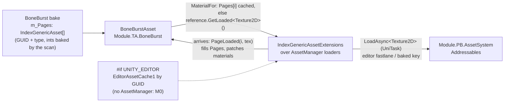

# BoneBurst — pages as IndexGenericAsset references — plan

**Status:** plan written 2026-10-01. **P0 and P1 done the same day** — `BoneBurstAsset` carries `IndexGenericAsset[] m_Pages` with the `[ExpectBuiltInAsset(AssetTypeCodes.Texture)]` picker filter; material time goes direct texture → `GetLoaded<Texture2D>()` → editor GUID cache → pending; the blob build kicks `LoadAsync<Texture2D>()` (UniTask) into the existing `PageLoaded` delivery. The bake writes one reference per page and bakes the durable AssetSystem keys itself — `MappingMutationService.EnsureIndexed`, the SmartAddresser-backed write path — straight into the reference's ints (-1 with an honest report count when the texture is in no group; the owner confirmed our packages may call that pipeline regardless of tier). Deleted: `PageGuids`, the `BoneBurstPages` hook, the key map + `Bake Page Keys` command, and the `com.module.pc-creator-boneburst-assets` package. Runtime refs: `Module.PA.Base`, `Module.PB.AssetSystem`, `UniTask`; package dep: pb-creator-base. Suites: BoneBurst Editor 403 + 1 ignored of 404, play 34 of 34, timeline 14 and 13, harness 191 of 191 bit-exact, tiercheck clean; the demo's addressed asset re-authored onto a reference and rendering. **P2 (M2-side scanner/drawer/player verification) remains the owner's.** Owner's direction: `BoneBurstAsset` must use the AssetSystem's reference type natively — serialized pages as `[SerializeField] [ExpectBuiltInAsset(AssetTypeCodes.Texture)] IndexGenericAsset[]` — loaded through `IndexGenericAssetExtensions.LoadAsync<Texture2D>()` (UniTask), replacing the custom page-GUID plumbing built earlier the same day (`PageGuids`, the `BoneBurstPages` hook, the PC/PD adapter package, the page-key map and its bake command). Source studied: `ModuleP1.IndexGenericAsset` (`Module.PA.Base`: GUID is the pivot, `AssetType` short, baked `(GroupIndex, AssetIndex)` ints, sub-asset id — editor guid-fastlane and player baked keys in one reference), `IndexGenericAssetExtensions` (`LoadAsync<T>`, `IsLoaded`, `GetLoaded<T>`, `Release`, `LoadHandleAsync` — dispatch by `AssetType`, keys resolved through the central gate), the `Expect*` intent attributes (picker filters over the single `IndexGenericAsset` drawer), and the stack's own precedent (`HoldAssetsWhileAlive` holds `IndexGenericAsset[]` fields exactly like this).



---

## 1. Good vs bad

Two designs for the same requirement — *a baked BoneBurst asset names its atlas pages in a way the Creator stack can stream* — measured against what this project learned building the first one.

### The bad: the custom indirection (what exists today, built 2026-10-01)

`BoneBurstAsset.PageGuids : string[]` → `BoneBurstPages` hook (PC package) → `AssetSystemPageSource` adapter (PD package) → `BoneBurstPageKeys` map + `Bake Page Keys` command.

- **Three inventions where the stack has one.** GUID strings, a hook interface, a key map and a bake command — four bespoke moving parts that each reimplement something pb-creator-base already ships: `IndexGenericAsset` *is* GUID + type + baked ints, its drawer, its fastlane and its player path.
- **A second key pipeline to keep correct.** The map + command exist only because strings cannot carry the baked ints. That is a parallel, custom baking flow that must track SmartAddresser's groups forever — and it started wrong once already (the fastlane's ephemeral slots, caught in review).
- **Non-standard authoring.** A `PageGuids` string array gets BoneBurst's own popup at best; M2's pickers, validators and audits know nothing about it. Every future stack feature (usage tracking, dependency graph, release tooling) skips it.
- **Reference bookkeeping with no refcounts.** The hook's `Load` gives the adapter no handle, so nothing can ever release a page — the "keep until pressure" policy was a workaround, not a choice.
- **Two extra packages.** PC + PD exist solely to keep BoneBurst's runtime "pure" — a purity the owner's own dependency decision (`ta` → `pc-assets` → `pb`) had already spent.

### The good: native `IndexGenericAsset` pages

`BoneBurstAsset` holds `IndexGenericAsset[] m_Pages`, loads them through the stack's own extensions, UniTask end to end.

- **One reference type, both worlds.** Editor: GUID pivot + fastlane, no bake needed. Player: the scan bakes the ints *into the same serialized field* — no second map, no second command, no drift possible between them.
- **The whole stack understands the field.** The single `IndexGenericAsset` drawer with `[ExpectBuiltInAsset(AssetTypeCodes.Texture)]` filtering the picker to textures; validators, audits and M2 tooling treat it like any other asset reference.
- **Real lifetime semantics.** `LoadAsync` / `IsLoaded` / `GetLoaded` / `Release` / refcounted `AssetHandle<T>` — pages become releasable citizens instead of load-and-forget.
- **Less code.** The PC and PD packages, the key map, the bake command, the `InternalsVisibleTo` web and the guid-only asset variant machinery all die; BoneBurst's material-time flow (sync-first, patch-on-arrival through `PageLoaded`) survives unchanged underneath.
- **Tier-legal by construction.** `Module.TA.BoneBurst` → `Module.PA.Base`/`Module.PB.AssetSystem`/UniTask are downward edges; no P-tier package ever names BoneBurst.

### What the good design costs (its own bad parts, honestly)

- **BoneBurst's runtime now references pb-creator-base and UniTask.** The parity harness still builds — `BoneBurstAsset.cs` is already excluded from it, and no other included file touches the reference type — but "the runtime compiles against Burst/Collections/Mathematics only" becomes history. The benchmark players inherit the pb + Addressables dependency graph (already true at package level since the `pc-assets` dependency).
- **A scene without an `AssetManager` cannot load pages at play time** — the extensions answer `null` with an error. M0's demo and tests rely on the `#if UNITY_EDITOR` AssetDatabase fallback (which the plan keeps); a play-mode M0 scene shows untextured pages, exactly like today's no-manager path but through stock code.
- **Editor tooling must exist to feel the benefit.** The drawer, picker and scanner validation are pb editor features; in M0 only the raw struct renders. The win lands in M2.
- **Migration breaks today's assets.** `PageGuids` and the `BoneBurstPageKeys.asset` map vanish; the demo's addressed asset is re-authored. Cheap now (one demo asset, nothing shipped), impossible later — the reason to do it now.

**Verdict:** the native design wins on every axis except runtime purity, which the owner has already traded away at the package level. Proceed.

## 2. Design

**The field** (replaces `PageGuids`; `Pages : Texture2D[]` stays as the resolved cache and the editor/tests/benchmark path):

```csharp
[SerializeField]
[ExpectBuiltInAsset(AssetTypeCodes.Texture)]
private IndexGenericAsset[] m_Pages = Array.Empty<IndexGenericAsset>();
```

A public `SetPage(int page, in IndexGenericAsset reference)` (or property) for the bake and tests; `Pages[i]` keeps meaning "the texture in hand" and is filled by resolution, never authored, except in the Direct mode below.

**Material-time flow** — same shape as today, one source swapped:

1. `Pages[page]` set → use it (unchanged).
2. Else `m_Pages[page].GetLoaded<Texture2D>()` — stock sync path, includes the editor fastlane.
3. Else, if not already asked this session: `m_Pages[page].LoadAsync<Texture2D>()` (UniTask) continues on the main thread into the existing `PageLoaded(page, texture)` — which fills `Pages` and patches cached materials exactly as built. `#if UNITY_EDITOR`, when no loader answers, fall back to `EditorAssetCache1.GetAsset<Texture2D>(reference.AssetGuid)` — the M0 demo keeps working with no `AssetManager`.
4. Neither a direct texture, a valid reference nor a resolved one → the existing unaddressed-page error.

**The bake** writes `IndexGenericAsset` per page (GUID + `AssetTypeCodes.Texture`; ints stay -1 until M2's scan bakes them) beside the direct `Pages` references. The Page-references setting becomes **Direct + references** (default) / **references only**. Variants share both arrays. The custom key map, its bake command and the addressed-asset variant machinery are deleted (§3).

**What dies** (beta posture — delete, no `[Obsolete]`): `com.module.pc-creator-boneburst-assets` (both assemblies), `BoneBurstPageKeys` + `Assets/Resources/BoneBurstPageKeys.asset`, `BoneBurstPageKeyBake`, `PageGuids`, the `BoneBurstPages`/`IBoneBurstPageSource` hook, and their tests' fake-source class (rewritten against the new flow). The nine moved tests collapse into the new ones.

**Assembly/package changes**: `Module.TA.BoneBurst` references `Module.PA.Base`, `Module.PB.AssetSystem`, `UniTask`; `package.json` swaps the `pc-assets` dependency for `com.module.pb-creator-base` (+ UniTask if M0's manifest entry is not enough — it is: `com.cysharp.unitask` is already a `file:` dependency). CLAUDE.md's table, §1 note and diagram shrink accordingly.

## 3. Phases

| Phase | Deliverable | Tests |
|---|---|---|
| **P0** | The field + material-time flow + editor fallback + bake writes references (+ mode rename); `PageGuids` deleted; demo addressed asset re-authored by a rebake | reference-flow tests with a hand-built `IndexGenericAsset` (sync `GetLoaded` needs a loader — in M0 the editor fallback path carries the tests); bake tests (references recorded, references-only mode, rebake keeps GUIDs); existing suites |
| **P1** | Deletion day: PC/PD packages, key map + asset, bake command, hook, `IVT` lines, CLAUDE.md/plan/changelog updates; tiercheck + full suites + harness | the moved nine collapse into P0's tests; deliberate-bug on the delivery-patch path re-checked |
| **P2** | (M2-side, documented not built) verify the scanner bakes the reference ints project-wide and the drawer picks textures; player-build smoke test of a references-only asset | owner's manual pass in M2 |

**Gates per phase:** `tiercheck.py` (net edges drop), compile before every test run, BoneBurst Editor + Play suites, timeline suites (untouched), and the parity harness — mandatory: the runtime asmdef's reference list changes, and the harness must still prove the excluded-file boundary holds.

## 4. Open questions (to resolve in P0, not before)

- **Who bakes the reference ints in M2** — the scanner's force rebuild or the per-edit pipeline; the plan assumes "the same thing that bakes every other `IndexGenericAsset` field", which is the point of using it.
- **Array drawer behaviour in M0** — pb's drawer may render the array natively (it ships with the package on the manifest) or need their editor assembly; if it renders raw in M0, that is cosmetic only.
- **Release policy** — `PageLoaded` deliveries keep pages cached per session for v1 (as today); with `Release`/`GetReferenceCount` now available, per-asset release becomes a small follow-up, not a redesign.
