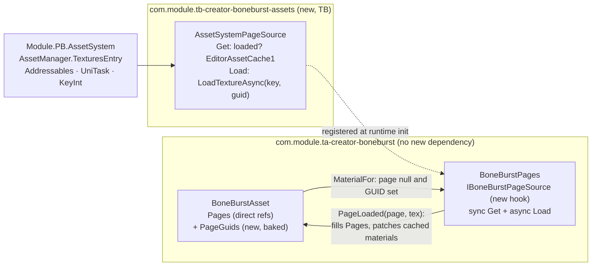

# BoneBurst — page textures by address (pb-creator-base AssetSystem) — plan

**Status:** plan written 2026-10-01. **P0 done 2026-10-01** (the runtime side: `BoneBurstAsset.PageGuids`, the `BoneBurstPages`/`IBoneBurstPageSource` hook, `PageLoaded` patching cached materials with duplicate deliveries ignored, the once-per-session request at the blob build, the stricter neither-texture-nor-address warning, and the bake recording GUIDs with the Page-references mode and its rebake recovery; the harness excludes `BoneBurstPages.cs` beside the other Unity-facing files. Tests: fake-source and bake-GUID suites, Editor 404 + 1 ignored of 405, play 34 of 34, harness 191 of 191 bit-exact; the deliberate-bug check broke `PageLoaded`'s material patch and the test failed. Details in `Doc/CHANGELOG.md`). **P1 done 2026-10-01** (the adapter package `com.module.tb-creator-boneburst-assets`: `Module.TB.BoneBurstAssets` referencing `Module.TA.BoneBurst`, `Module.PA.Base`, `Module.PB.Common`, `Module.PB.AssetSystem` and `UniTask` — `AssetIndex3`/`AssetTypeCodes` live in `Module.PA.Base`, a deeper asmdef under pb-creator-base's `Runtime/Core/Base`, not in `Module.PB.Common` as plan §1 assumed. `AssetSystemPageSource`: Get checks the loader's cache under the fastlane-resolved key and falls back to `EditorAssetCache1` in the Editor; Load goes through `LoadTextureAsync<Texture2D>` with an explicitly invalid key (`new AssetIndex3(0, -1, Texture)` — `default` is *valid* at index 0) and delivers on the main thread; no `AssetManager` in the scene warns once per asset. Registration at editor load (`InitializeOnLoadMethod`) and before the first scene. BoneBurst's `AssemblyInfo` grants internals to the adapter and its tests. Tests: 5 of 5 against the real surface with no manager — including the end-to-end material picking the page up by GUID through `EditorAssetCache1`, and a fix along the way: `Samples~` files have no AssetDatabase GUID, so the tests use the demo's baked spineboy texture and assert the GUID is non-empty (the first version passed vacuously on null==null). Tiercheck and compile green. CLAUDE.md carries the package row and the §1 reverse-dependency note). **P2 done 2026-10-01** (the player-build key path, with one recorded deviation: a baked `AssetIndex3` is two ints of pb-creator-base-shaped data, so the plan's `BoneBurstAsset.PageKeys` field became an adapter-owned `BoneBurstPageKeys` map — a `Resources` ScriptableObject of GUID → group + index — keeping the runtime package uncoupled. `AssetSystemPageSource.KeyFor` prefers the baked key and `Get`/`Load` use it; `Tools › BoneBurst Assets › Bake Page Keys` (the plan's single MenuItem, no window) resolves every project asset's page GUIDs through the loader's own fastlane and writes the map — keeping an earlier bake's keys for GUIDs that no longer resolve, writing nothing when nothing resolves, never overwriting a wrong-type file. Tests 4 of 4 (key choice with/without a map, bake writes nothing, bake keeps an old key and restores the map); adapter suite 9 of 9; tiercheck and compile green. `Doc/README.md` documents the player-build requirement — GUID-only assets resolve in the Editor until keys are baked, which only a project with the addressable setup can do; M0 is not such a project, which is exactly what the bake's honest nothing-resolved log says). **P3 done 2026-10-01 — all phases done.** The demo touch: `spineboy-pro_Addressed.asset` beside the demo's baked outputs (same data, shader and mixes, no direct page references, one page GUID) and a fifth demo-scene skeleton, *Spineboy CPU (Unlit, addressed pages)* — the Scene view shows it textured with the asset's `Pages` empty, resolved by the adapter's registered source through the editor cache (verified: the material's `mainTexture` is the page, `pagesOnAsset=0`). With the adapter now present, the GUIDs-only bake test expects the source's no-`AssetManager` warning. Full re-run: adapter 9 of 9, BoneBurst Editor 404 + 1 ignored of 405 and Play 34 of 34, timeline 14 and 13, harness 191 of 191 bit-exact, tiercheck clean. **Correction after the owner's review (2026-10-01):** the bake no longer resolves through the editor guid fastlane — `AssetIndexEditorResolver` hands out *ephemeral session slots* (ids from 1,000,000 up, coherent only within a session), so baking those as player keys would have been wrong. `Bake Page Keys` now calls `MappingMutationService.EnsureIndexed` from `Module.PB.AssetSystem.Editor`, pb-creator-base's idempotent write path that assigns durable (group, index) pairs over the Addressables groups SmartAddresser populates and their mapping wrappers — the same path the auto-sync uses. Requirements unchanged for M2: the page textures must be in an Addressables group with a mapping wrapper; the summary counts not-in-a-group and group-without-wrapper separately. Adapter 9 of 9 again; compile and tiercheck green. **Restructure after the owner's direction (2026-10-01):** the package is now `com.module.pc-creator-boneburst-assets` and the dependency direction is inverted — the BoneBurst runtime references it, not the other way (a T-referencing adapter inside a P-tier package violated the tier rules). Two assemblies follow pb-creator-base's multi-band pattern: `Module.PC.BoneBurstAssets` (the hook, moved out of BoneBurst, plus the key map; engine-only) and `Module.PD.BoneBurstAssets` (the AssetSystem adapter; the interface is GUID-only with delivery by callback, so no assembly here names BoneBurst types). The page-key bake command moved into the BoneBurst package's editor — crawling `BoneBurstAsset`s needs T-tier types a P-tier editor may not reference — and the adapter's nine tests moved into `Module.TA.BoneBurst.Tests.Editor`. Plan §2's "no dependency at all" claim is therefore history: BoneBurst now depends on the PC package for the hook, which is the tier-legal shape of the same intent (the hook assembly itself references nothing but the engine, and the parity harness still compiles the runtime — `BoneBurstAsset` remains excluded, the stale exclude entry removed). Suites after the restructure: BoneBurst Editor 413 + 1 ignored of 414, play 34 of 34, timeline 14 and 13, harness 191 of 191 bit-exact, tiercheck clean (TA→PC, TA→PB downward). What is left for the owner: nothing in M0; in M2, where the addressable setup exists, run Bake Page Keys before player builds. Source studied: `com.module.pb-creator-base` `2026.9.120` (the P-tier Creator foundation, wired into M0 by an uncommitted `file:` manifest entry pointing at M2-Creator-All's copy), its `Runtime/AssetSystem` (`Module.PB.AssetSystem`: `AssetManager` → `TexturesEntry` → `TextureAssetEntryLoader`, Addressables 4.0.1 + UniTask backed, int-keyed `AssetIndex3` with the **GUID as source of truth** and an editor-only guid fastlane), and our `BoneBurstAsset` (`Pages : Texture2D[]`, consumed only by `MaterialFor`'s lazy per-page material cache and the missing-pages warning; the bake copies page textures and assigns `Pages` at `BoneBurstBake.cs:423`).

The goal: a `BoneBurstAsset` baked for M2 resolves its atlas page textures **through the AssetSystem by address** (page GUID → `Texture2D`), so M2 streams skeleton textures like every other asset — while the BoneBurst runtime package keeps **no dependency at all** on pb-creator-base, Addressables or UniTask.



---

## 1. What the AssetSystem offers (measured, not assumed)

- `AssetManager.Instance` is a **scene singleton** (`[AssetManager]`, `DontDestroyOnLoad`); in edit mode it never auto-creates — it only finds one. `AssetManager.TexturesEntry` is the static accessor for the texture loader; both answer **null when no manager exists** (M0's demo/test scenes have none).
- `TextureAssetEntryLoader.LoadTextureAsync(AssetIndex3 aKey, string guid, CancellationToken) : UniTask<Texture>` — and a `<T>` overload for `Texture2D`. Loaded entries answer `IsLoaded(key)` / `GetLoaded(key)`; lifetime via `Release(key)`, `TryReleaseIfUnreferenced(key)`, `ReleaseUnused()`, with a memory-pressure event on the manager.
- **GUID is the source of truth, int keys are a build artifact**: `AssetIndexResolveHook.ResolveEffective` resolves an unbaked (invalid) key from the GUID through an editor-only fastlane; in player builds the fastlane compiles out and **a baked key is required**. So GUID-only data works in the Editor; player builds additionally need the baked `AssetIndex3` ints (pb-creator-base's KeyInt asset database / bake pipeline owns those).
- Editor-only `EditorAssetCache1.GetAsset<T>(guid)` is a plain `AssetDatabase.GUIDToAssetPath` + load — a synchronous editor path that needs none of the runtime pipeline.
- The assembly is `Module.PB.AssetSystem` (asmdef dependencies: `com.unity.addressables`, UniTask); tier `PB` sits below our `TA`/`TB`, so referencing it from a TB package is a legal downward edge (tiercheck E/F pass).

## 2. Architecture — hook in BoneBurst, adapter beside it

**BoneBurst (`Module.TA.BoneBurst`) gains the capability but not the dependency.** Three reasons, the first load-bearing:

1. **The strict-float parity harness builds `Module.TA.BoneBurst` on .NET** (stock, the managed runtime, the Editor parity tests). An asmdef reference to `Module.PB.AssetSystem` — or any use of UniTask/Addressables types in the runtime — breaks that build, which CLAUDE.md §5 gates every runtime change on.
2. The benchmark players (`Assets/BoneBenchmark`) and the demo keep working with direct references, untouched.
3. The tier map stays honest: a P-tier Creator foundation never learns about a T-tier runtime; the wiring lives one tier up, like the Timeline package (`com.module.ta-creator-boneburst-timeline`, `Module.TB.*`).

**New sibling package `com.module.tb-creator-boneburst-assets`** (displayName `TB Creator BoneBurst Assets`, assembly `Module.TB.BoneBurstAssets`, `BoneBurst.Assets` namespace): ~150 lines registering `AssetSystemPageSource` as the page source. Package layout and asmdef references mirror the timeline package's (`Module.TA.BoneBurst`, `Module.PB.AssetSystem`; a `.Tests` referencing both runtimes' test patterns). Its `package.json` depends on `com.module.ta-creator-boneburst` and `com.module.pb-creator-base`; in M0 the latter resolves through the manifest's existing `file:` entry, in M2 through its embedded copy.

**Rejected alternative:** a direct dependency from BoneBurst onto pb-creator-base. Legal by tier, but it breaks the harness (1), drags Addressables/UniTask into every BoneBurst consumer, and couples the M0 test bed to M2's stack one tier too low.

## 3. The BoneBurst side (data model + hook)

```csharp
// BoneBurstAsset
[Tooltip("Atlas page textures, in the atlas's page order. A null page with a GUID below resolves through the page source (the Assets adapter's AssetSystem).")]
public Texture2D[] Pages = Array.Empty<Texture2D>();

[Tooltip("Baked GUIDs of the atlas page textures, in the same order; the bake records them beside the direct references.")]
public string[] PageGuids = Array.Empty<string>();
```

- **Resolution order in `MaterialFor(page, …)`**: `Pages[page]` if assigned → else `BoneBurstPages.Get(this, page)` (a synchronous ask: already loaded, or the editor's AssetDatabase path) → else a pending async `Load` request and the material is created untextured (exactly today's missing-page behaviour: the existing warning covers "no reference, no GUID, no source"). `PremultipliedAlpha` and the mesh/pose paths never read textures, so nothing else changes.
- **The hook** (runtime, no editor-only types):

```csharp
public interface IBoneBurstPageSource
{
    /// A synchronously available texture for the GUID, or null (editor AssetDatabase path or already loaded).
    Texture2D Get(BoneBurstAsset asset, string guid);

    /// Begin resolving; completes by calling asset.PageLoaded(page, texture) on the main thread.
    void Load(BoneBurstAsset asset, int page, string guid);
}

public static class BoneBurstPages
{
    public static IBoneBurstPageSource Source;   // set by the adapter package
}
```

- **`internal void PageLoaded(int page, Texture2D texture)`** on `BoneBurstAsset`: fills `Pages[page]`, then patches `mainTexture` on every already-cached material for that page (the material cache is keyed by page/blend/variant and private; the renderer's `sharedMaterials` keep pointing at the same material instances, so a texture swap lands without any re-mesh). Idempotent per page; late duplicates (a sync hit racing an async completion) are ignored.
- **Request trigger**: the first `Blob` build per asset per session requests every page that is null and has a GUID (a `m_PagesRequested` flag; `RestartPreview`/re-enable re-request nothing — the loads are cached loader-side). `Free()`/`OnDisable` does **not** release: v1 keeps loaded pages until the host app's pressure policy releases them (`ReleaseUnused` / the manager's pressure event); per-asset refcounting is deliberately deferred (§7, D4).
- The **bake** records both: after `CopyTexture` imports, `PageGuids[i] = AssetDatabase.AssetPathToGUID(texturePaths[i])` beside `asset.Pages = pages` (`BoneBurstBake.cs:423`), and rebakes keep both. Variants copy both arrays (they already share the textures). A bake option **Page references: Direct + GUIDs (default) / GUIDs only** lets an M2 asset ship without direct references, so addressable streaming, not the scene graph, decides what ships — recorded in the bake report like the other settings.

## 4. The adapter side (`Module.TB.BoneBurstAssets`)

- **Registration**: `[RuntimeInitializeOnLoadMethod(RuntimeInitializeLoadType.BeforeSceneLoad)]` sets `BoneBurstPages.Source = new AssetSystemPageSource()`; an editor `[InitializeOnLoad]` sets it too so edit mode (the Scene-view preview, the Timeline scrub) resolves through the same path. Setting it twice is harmless; the adapter never unsets.
- **`Get`**: `AssetManager.TexturesEntry` present and the page loaded (`IsLoaded` by the resolved key) → `GetLoaded`; else in the editor → `EditorAssetCache1.GetAsset<Texture2D>(guid)`; else null. When no `AssetManager` exists (M0 scenes), `Get` degrades to the editor cache in edit mode and null in play mode — one warning per asset, then the asset behaves exactly like today.
- **`Load`**: `TexturesEntry.LoadTextureAsync<Texture2D>(key, guid)` with the default (invalid) `AssetIndex3` and the GUID — the editor fastlane resolves it; `.ContinueWith` on the main thread calls `asset.PageLoaded(page, texture)`. For player builds the GUID alone is not enough (§1), so the adapter (and only the adapter) also carries the optional baked-key lookup: `BoneBurstAsset.PageKeys` (ints, filled by a small editor command in the adapter, P2) is passed as the key when valid — the player path then uses the baked ints exactly like every other AssetSystem consumer.
- No `HoldAssetsWhileAlive` on skeletons: pages are per-`BoneBurstAsset`, not per-instance; hundreds of skeletons share one load.

## 5. What must not change

- `Module.TA.BoneBurst`'s asmdef references (burst/collections/mathematics only), so the parity harness, the benchmark players and every existing test keep building exactly as today; `Pages`-driven assets behave identically (all existing suites run unchanged as the regression gate).
- The pose/mesh/GPU-skinning/vertex-fetch paths never read textures; texture readiness only affects material `mainTexture`.
- Missing pages keep rendering untextured with the existing warning — "pending" is the same visual, with the load in flight.

## 6. Tests and gates

Per phase, deliberate-bug checks on the subtle paths (§ CLAUDE.md §5):

- **BoneBurst (EditMode)**: `PageGuids` + hook — a fake in-test `IBoneBurstPageSource` (no AssetSystem): `Get` supplies a texture → `MaterialFor` returns a material with it; async `Load` → `PageLoaded` fills `Pages[page]` and patches an already-created material's `mainTexture` (break `PageLoaded`'s patch on purpose once; the test must fail); GUID-only + no source → untextured material + the existing warning; double `PageLoaded` ignored.
- **BoneBurst bake (EditMode)**: a folder bake records `PageGuids` beside `Pages` (GUIDs non-empty and match `Pages`' paths); the GUIDs-only option bakes null `Pages` with GUIDs; a rebake keeps both.
- **Adapter (EditMode, in M0 — pb-creator-base is on the manifest)**: with no `AssetManager` in the scene, `Get` resolves through `EditorAssetCache1` in edit mode and a play-mode call is a logged no-op; registration sets the source. (The full Addressables pipeline — manager, groups, async completion in play mode — is exercised where that pipeline exists, M2; in M0 the editor paths and the fallbacks are the testable surface, and the play-mode async path is covered by the fake-source test on the BoneBurst side.)
- Gates per landed phase: `tiercheck.py` (new `TB` package + edges `TB → TA`, `TB → PB`, both downward), `playtest.py compile` before every `test` run, the timeline suites unaffected, BoneBurst suites re-run (EditMode + PlayMode), and the **parity harness before anything lands in `Module.TA.BoneBurst`'s Runtime**.

## 7. Phases

| Phase | Deliverable | Tests |
|---|---|---|
| **P0** | BoneBurst: `PageGuids`, `BoneBurstPages`/`IBoneBurstPageSource`, `PageLoaded` plumbing in `MaterialFor`/`Blob`, the per-session request flag; bake records GUIDs (+ GUIDs-only option, report line) | fake-source EditMode tests; bake tests; BoneBurst suites; parity harness |
| **P1** | Adapter package `com.module.tb-creator-boneburst-assets`: registration (runtime + editor), `Get`/`Load`, no-manager fallback | adapter EditMode tests; tiercheck; CLAUDE.md row |
| **P2** | Player-build path: optional `PageKeys` on the asset + the adapter's bake-keys editor command against pb-creator-base's KeyInt database, and a note in the adapter's README that GUID-only assets resolve in the Editor only until keys are baked | adapter editor tests with the KeyInt tooling available; documented limitation |
| **P3** | Demo touch (optional): a GUIDs-only copy of the demo spineboy asset proving the address path in the Scene view; docs (`Doc/README.md` in the adapter, changelog entries in both packages) | full re-run |

## 8. Recorded decisions

- **D1 — hook + TB adapter, not a direct dependency.** The parity harness builds the runtime on .NET; an `Module.PB.AssetSystem` reference (or UniTask/Addressables types) in `Module.TA.BoneBurst` would break the gate the project runs on every runtime change. The benchmark and demo also stay reference-driven.
- **D2 — GUIDs as the stored address, `PageGuids : string[]`.** The AssetSystem's own model (GUID is the source of truth; ints are a build artifact) makes the GUID the stable thing to bake; int keys are added later and only where player builds need them (P2).
- **D3 — sync-first, async-fallback, patch-on-arrival.** `MaterialFor` stays synchronous (materials already tolerate a missing texture today); an async completion patches cached materials, so no frame of posing waits on a texture.
- **D4 — v1 keeps loaded pages until the host's pressure policy releases them** (`ReleaseUnused` / the manager's pressure event); per-asset refcounting is deferred until a real M2 consumer needs eviction. Skeleton instances never hold page handles — the asset owns the concept.
- **D5 — the bake records Direct + GUIDs by default.** Existing assets and scenes change behaviour not at all; the GUIDs-only option is opt-in for addressable-streamed content.
- **D6 — no new EditorWindow.** The adapter's key-bake step is a `[MenuItem]` command; everything else is data.

## 9. Governance note (CLAUDE.md §1 kin)

This plan makes M0's manifest point at **M2-Creator-All's** `com.module.pb-creator-base` (already true in the uncommitted working tree, added for the KeyInt/AssetSystem surface). That is the reverse direction of §1's "consumers of this folder": M0 consuming an M2 package by `file:` path. The adapter's `package.json` naming that dependency is what makes the coupling explicit and versioned; if M2 later embeds BoneBurst + the adapter, the `file:` entry goes away. Worth a line in CLAUDE.md §1 when P1 lands.
