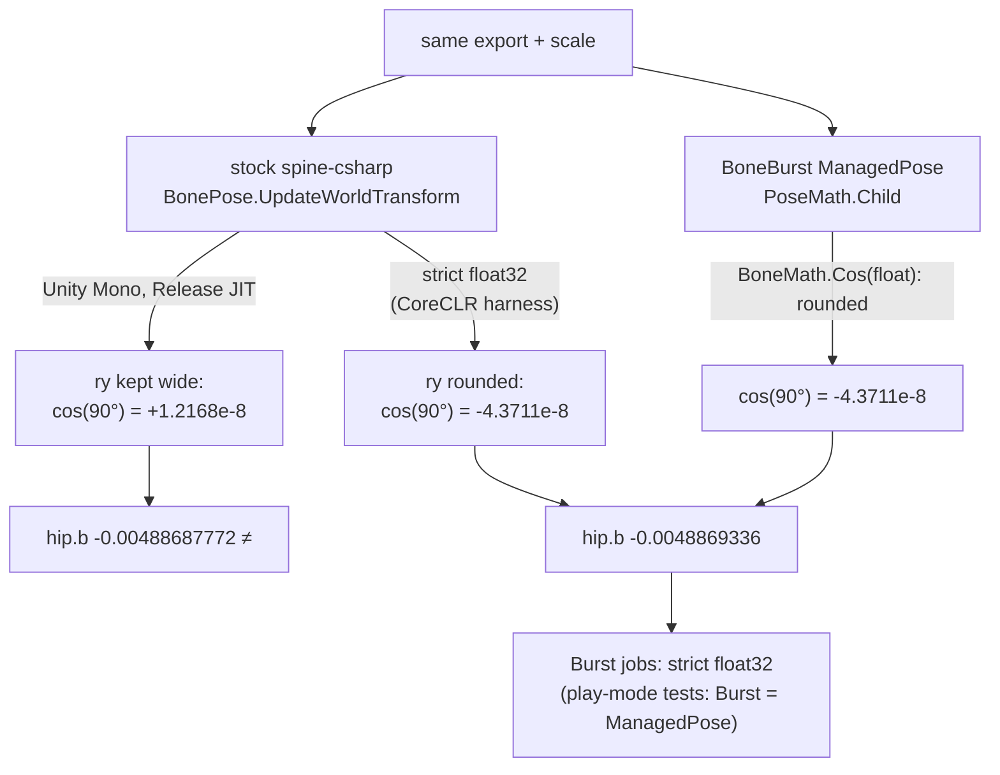

# BoneBurst stock-parity failures — plan

**Status:** F1–F3 done (2026-09-30). Strict harness: 191 of 191, bit for bit. Unity Editor suite with tolerance and lockstep: **388 passed, 0 failed, 1 ignored** in Release **and** Debug JIT. Five deliberate bugs each fail both the Editor suite and the harness (§3.4). F4 (docs, `CLAUDE.md` §5) is improvement plan item I3.

The Editor suites that compare BoneBurst with stock spine-csharp fail 142 tests (test report §2). They share one symptom: world or local transforms differ from stock, starting at the setup pose. This plan records what that difference is and how to separate it from real bugs, then how to make the tests say what they mean. **Finding: the differences seen so far are float rounding decided by how Mono compiles stock spine-csharp, not BoneBurst logic.** The same code and data fail 142 tests with the Editor in Release code optimization and 99 in Debug. The one bone traced to the bit, spineboy-pro's `hip`, is stock skipping a float rounding that BoneBurst (and strict IEEE float32) does. Whether *every* remaining failure is of that kind is not proven yet; phase F1 proves it or finds the ones that are not.

## 1. Evidence

**The difference is at rounding level, not a logic change.** spineboy-pro @1, no skin:
- 63 of 65 bones differ.
- Each value is off by 0–120 ulps; the largest relative difference is 1.76 × 10⁻³, after IK and constraints amplify it.

**`hip`, traced to the bit.** Its rotation is 0 and its parent is `root`, whose `b` is -0.00488689 in both runtimes. Its world `b = pa·lb + pb·ld`, where `lb = cos(ry)·scaleY` and `ry = (0 + 90 + 0) · DegRad`.

| Where | `ry` passed to `Math.Cos` | `lb` | `hip.b` |
|---|---|---|---|
| stock spine-csharp, run by the test | not rounded to float (`90 × DegRad` in double) | +1.21679644e-8 | **-0.00488687772** |
| the same arithmetic in a snippet, angle rounded to float | 1.5707964 | -4.371139e-8 | **-0.0048869336** |
| BoneBurst `PoseMath.Child` (`BoneMath.Cos(float)` rounds its argument) | 1.5707964 | -4.371139e-8 | **-0.0048869336** |

Recomputing with the unrounded angle gives stock's bits exactly, and with the rounded angle BoneBurst's bits exactly. The two formulas are the same operation for operation (`BonePose.cs:145–154`, `PoseMath.cs:56–66`). In stock's compiled method, Mono passes the wider value straight into `Math.Cos`. ECMA-335 allows that: float locals may be held at higher precision. A snippet written the same way did *not* skip the rounding, so it depends on how the JIT compiles each method.

**The JIT mode changes the result.** The same Editor suite, the same data, only `CompilationPipeline.codeOptimization` switched (restored to Release afterwards):

| Class | Release | Debug |
|---|---|---|
| `SetupPoseParityTests` | 45 fail | 22 fail |
| `AnimationParityTests` | 24 | 18 |
| `ConstraintParityTests` | 25 | 19 |
| `MeshGeneratorParityTests` | 21 | 15 |
| `MixingParityTests` | 18 | 18 |
| `SkinParityTests` | 8 | 6 |
| `GpuSkinningParityTests` | 1 | 1 |
| **Total** | **142** | **99** |

**What else was ruled in or out:**
- **Not reading:** `ReaderParityTests` 49 of 49; both sides read identical data.
- **Not the move:** the uncommitted Spine edits are ruled out (test report §2).
- **Knock-on failures:** "nothing was played" (`MeshGeneratorParityTests`) and "no frame took the GPU path" (`GpuSkinningParityTests`). Those tests compare the initial pose first and stop at its mismatch, so their frame counters stay 0 and the zero-count guard fires. They carry no separate signal.
- **Consistent with the plan's history:** P1–P7 were measured bit for bit against stock *outside Unity* (`BoneBurst-Plan.md` status). That harness ran on .NET, where float arithmetic is strict float32.
- **Burst matches BoneBurst's managed path:** play mode 32 of 32 (Burst against `ManagedPose`, 1e-4). Burst computes strict float32 without fused multiply-add, like `ManagedPose`.

**Not established yet:**
- That all 99–142 are rounding. Physics and IK can turn one ulp into a visibly different result over frames (`playing-in-the-rain` frame 41, "local differs"), and a real bug could hide among them.
- How stock behaves in an IL2CPP player. There C++ compilers may fuse multiply-adds, which is yet another rounding.

## 2. What parity can mean

Stock spine-csharp under Unity's Mono is **not one reference**: its bits change with the JIT mode. So bit-for-bit parity against it in the Editor cannot be a pass/fail rule. Parity needs a defined arithmetic:
- **Strict IEEE float32, no fused multiply-add:** each float operation rounded to float. This is what .NET's RyuJIT does, and what Burst does.
- In that model, stock and BoneBurst are expected to match bit for bit, as P1–P7 did.

## 3. Phases

| Phase | Work | Done when |
|---|---|---|
| **F1** Ground truth | A strict-float **parity harness** checked into the package (`Tools~/ParityHarness/`, a .NET console project built with Unity's bundled SDK at `Unity.app/Contents/Resources/Scripting/DotNetSdk/dotnet`). It compiles spine-csharp's sources and BoneBurst's managed pose code (`Data`, `Blob`, `Instance/ManagedPose`, `Math`, `Constraints`, `Anim`, `Skins`) with small shims for the four files that touch Unity APIs (`SkeletonJsonReader`, `SkeletonBlob`, `InstanceData`, keys). It runs the Editor suites' comparisons (setup pose, animation, mixing, constraints and physics, skins) on the same corpus. | Every comparison is bit-exact, **or** each non-exact one is listed with its class, file, frame and first differing value. Those are real bugs, fixed one at a time with a deliberate-bug check each. |
| **F2** Measure the Editor gap | A diagnostic mode for the Editor suites that, instead of stopping at the first difference, records per class the largest absolute world or position error, the largest ulp distance, and the first frame of divergence. Release and Debug JIT both. | A table of error magnitudes per class. The tolerance for F3 comes from it, with margin, and is written down with the numbers. |
| **F3** Honest Editor tests | The stock-comparing suites compare within that tolerance, and **report how many values were bit-exact**, so a drift shows. Physics and long IK chains compare in lockstep: each frame starts both runtimes from the same state, so chaos cannot amplify one ulp across frames. The knock-on guards ("nothing was played") only fire when nothing was compared at all. | The Editor suite passes in Release **and** Debug. Deliberate bugs still fail it (`CLAUDE.md` §5): a sign flip in one inherit mode, a one-frame time offset, a wrong mix alpha, a skipped constraint. |
| **F4** Record it | Test report, `Doc/Parity/Parity.md`, and a line in `CLAUDE.md` §5: bit-exact stock parity is proven in the strict-float harness; in the Editor it is within a measured tolerance, because Mono's rounding depends on the JIT mode. | The docs match what the tests check. |

**Order:** F1 first. It is the only step that can find a real bug among the 142. F2 and F3 must not start before F1, or a tolerance could hide one.

## 3.1 F1 result (2026-09-30)

**Built:** `Tools~/ParityHarness/`, a .NET 8 console project. `run.sh` builds it with Unity's bundled SDK (`DotNetSdk/dotnet` 8.0.318) and runs it from the project root.
- **What it compiles:**
  - spine-csharp, all sources, with `IS_UNITY`, so `Color32F` is the real `UnityEngine.Color`, as inside Unity.
  - BoneBurst's runtime, without the Unity-facing files (asset, skeleton, system, materials, `BoneBurstFetch`, `BoneBurstGpu`, `Jobs/`). Since 2026-10-02 that is exactly the two assemblies `Module.PA.BoneBurst.Data` and `.Core` (`Runtime/Data/**`, `Runtime/Core/**`; `BoneBurst-AssemblySplit-Plan.md`).
  - The **unchanged** Editor parity tests: `Parity/`, `Pose/`, `Anim/`, `Constraints/`, `Skins/`.
- **What it references:** Unity's real managed engine modules (`UnityEngine.dll`, `UnityEngine.*Module.dll`: `Unity.Mathematics`, `NativeArray`, `Color`), plus `Unity.Collections` / `Unity.Burst` from `Library/ScriptAssemblies`.
- **Shims** (`Shims/`, source types that override the imported ones):
  - an NUnit subset;
  - `QualitySettings.activeColorSpace` returning Linear, as `ProjectSettings.asset` is set;
  - `Debug` writing to the console.
- **Runner:** `Program.cs` discovers `[Test]` / `[TestCase]` / `[TestCaseSource]` like NUnit. It prints the float check `16777216 + 1 − 16777216 = 0`, which proves strict float32. Exit code 0 only when every test passed and at least one ran.

**Result:**

| Class | Unity Editor, Release JIT (fails) | Harness, strict float32 |
|---|---|---|
| `ReaderParityTests` | 0 | 49 / 49 |
| `SetupPoseParityTests` | 45 | 45 / 45 |
| `AnimationParityTests` | 24 | 24 / 24 |
| `MixingParityTests` | 18 | 24 / 24 |
| `ConstraintParityTests` | 25 | 25 / 25 |
| `SkinParityTests` | 8 | 24 / 24 |
| **Total** | **120 of these 191** | **191 / 191, bit for bit** |

- **The one real difference was in the tests, not BoneBurst.** Before the fix, 5 harness failures were all `gaps.json` bone `c`.
  - Its parent `b` is skin-required, so with no skin it is inactive and never posed, and its world is NaN in **both** runtimes. The active child `c` inherits NaN in both.
  - `p.A != w.A` is true for NaN, so the tests reported an agreement as a difference.
  - Fixed: `AnimationParityTests.SameWorld` / `Same` count a value as equal when it is equal or NaN on both sides. They are used by the four world comparisons (setup pose, animation, constraints, skins) and the constraint suite's applied-pose check. Nothing else is relaxed: `-0` equals `+0` as before, and any other difference still fails.
- **The deliberate bug is caught** (`CLAUDE.md` §5). Reordering one addition in `PoseMath.Child` (`rotation + 90 + shearY` → `rotation + shearY + 90`, algebraically equal, rounded differently) fails 10 of 69 setup-pose and animation tests. Restored: 69 of 69.
- **Unity is unchanged:** Editor suite 247 of 389, the same 142 failures per class. Mono's rounding still breaks exact comparison there; that is F2 and F3.
- **Not covered by the harness:** `MeshGeneratorParityTests` and `GpuSkinningParityTests` (21 + 1 failing in Unity) need spine-unity's `MeshGenerator` and `UnityEngine.Mesh`.
  - Their Unity failures are knock-ons of the initial pose ("nothing was played", "no frame took the GPU path").
  - Mesh parity on strict float32 is **not** proven by F1. F3 must show it in Unity once poses compare within tolerance.
- **Test source edits for the harness:** `#if !BONEBURST_PARITY_HARNESS` around the spine-unity mesh comparison in `AnimationParityTests.CompareWorldAndMesh` and `SetupPoseParityTests`. Unity compiles them as before.
- **Git:** the project `.gitignore` re-includes `Tools~/` against the machine's global `*~` rule, as it does for `Samples~/` and `Data~/`. The harness's own `.gitignore` drops `bin/` and `obj/`.

## 3.2 F2 result (2026-09-30)

**Built:**
- `Tests/Editor/Parity/ParityDrift.cs`: every stock comparison in the six suites (setup pose, animation, mixing, constraints, skins, mesh generator) now goes through `ParityDrift.Same`.
  - Normally it answers exactly as before (equal, or NaN on both sides), so no verdict changed: Editor suite 247 of 389, the same 142 per class; harness 191 of 191.
  - While measuring it records every value and answers "same", so each scenario plays to its end.
  - It records, per category and per suite:
    - the values compared and how many are exact;
    - the largest absolute and relative error and the largest ulp distance, with locations;
    - an absolute-error histogram;
    - the largest error per frame band (f0, f1–9, f10–99, f100+), with locations.
- `ParityDriftReport.MeasureDrift` (`[Explicit]`) runs all six and writes `Logs/BoneBurstParityDrift.txt`.
  - Run it from the Test Runner window, or with `playtest.py eval`: the bridge's name filter does not run explicit tests.
  - In the harness: `run.sh ParityDriftReport`.
  - Raw reports: [ParityDrift-2026-09-30-Release.txt](../Parity/ParityDrift-2026-09-30-Release.txt), [ParityDrift-2026-09-30-Debug.txt](../Parity/ParityDrift-2026-09-30-Debug.txt).

**Found and fixed on the way (a test bug, not BoneBurst):**
- spine-unity reads the colour space from a static, `MeshGenerator.linearColorSpaceGlobal`, that only `SkeletonRenderer` initialises (`InitializeGlobalSettings`). The tests call `MeshGenerator` directly, so it stayed null, which spine-unity treats as gamma. The BoneBurst side was in Linear, as the project is.
- Additive slots with alpha below 1 were therefore compared across colour spaces: spineboy-pro 'shoot' muzzle-ring, 76 vs 149 per channel.
- `AnimationParityTests.StockColorSpace()` now sets it from `QualitySettings` before each stock mesh. `mesh.color` went from 73 to at most **1** (the float → byte boundary).
- spine-unity and BoneBurst apply the same `LinearToGammaSpace` to additive alpha (`MeshGenerator.cs:658`, `MeshBuilder.Color`).

**Results:**
- Harness (strict float32): **117,295,442 values, 0 inexact.**
- Unity Release: 237,828,820 values, **36,420,046 inexact (15.3%)**.
- Unity Debug: 237,998,288 values, **3,723,695 inexact (1.6%)**.
- In the table, "f0" is the setup pose and frame 0, "later" is the largest after that; Release unless marked.

| Category | Exact, Release | Exact, Debug | Max, f0 | Max, later (where) |
|---|---|---|---|---|
| world.abcd | 42.1% | 93.9% | 5.8e-6 | 3.3e-4 (f1–9); 0.37 (gaps.json skin script, f30) |
| world.xy | 56.2% | 96.1% | 3.7e-4 | 7.3e-4 (f1–9); 0.83 (gaps.json, f64) |
| local.xy / scale-shear / rotation | 99.8% / 99.99% / 100% | same | 1.9e-6 | 2.4e-4 on 2,447-unit positions (ulp level) |
| applied.rotation (degrees) | 66.3% | 92.8% | 2.9e-4 | 0.028 (f1–9); 0.126 (constraints.json 'move', f21) |
| constraint (mixes, physics values) | 99.98% | 99.98% | 2.4e-7 | 3.8e-5 |
| slot.color / mesh.tint | 100% | 100% | 3e-8 | 6e-8 |
| mesh.color (bytes) | 99.75% | 99.75% | 1 | 1 |
| mesh.position | 47.8% | 95.2% | 0.288 (clipping.json 'comb') | 0.0015 without clipping; 15.4 (clipping.json 'swing', f60) |
| mesh.uv | 99.96% | 100% | 0.0026 (clipping) | 0.31 (clipping.json, f59) |
| mesh.bounds | 60.6% | 95.4% | 1.2e-4 | 2.8e-4 |
| deform, attachments, draw order, events, active, inherit | 100% | 100% | 0 | 0 |
| discrete.count / indices (clipping topology) | 74 and 54 mismatches | 0 | – | clipping.json only |
| discrete.bounds (the old `Vector3 ==`, ~1e-5) | 37.5% pass | 89.4% | – | fails on large skeletons |

**What F3 takes from it:**
1. **Tolerance for one frame's rounding:** `|a − b| ≤ max(1e-5, 1e-6 × max(|a|, |b|))`. A colour byte may be ±1.
   - The largest frame-0 errors (world 5.8e-6 on unit values, 3.7e-4 on positions of hundreds of units, local 1.9e-6) sit under that bound with at least ×2 margin.
   - A real bug of the kinds F3 must catch (a sign flip, a one-frame offset, a wrong mix) moves values by far more. F3 proves that with its deliberate-bug checks.
2. **Lockstep for long runs.** After frame 10, IK, physics and the synthetic transform scripts amplify an ulp to 0.1–0.8 units (Release and Debug alike). No tolerance separates that from a bug, so F3 compares each frame from a shared state, not free-running divergence.
3. **Clipping:** a frame whose clip topology differs (vertex count or indices) cannot be compared vertex by vertex. F3 counts such frames, requires them to be rare, and compares the rest.
4. **Bounds:** replace Unity's fixed `Vector3 ==` (about 1e-5 absolute) with the relative tolerance above.
5. **Discrete facts stay exact.**

## 3.3 F3 progress (2026-09-30): work in progress

**Built** (in `Tests/Editor/Parity/`):
- **Tolerance mode** (`ParityDrift.Tolerant`: on in Unity, off in the strict harness, which still compares exactly).
  - A value passes within `1e-5 × max(|v|, skeleton size)` for positions (`*.xy`, mesh positions and bounds, physics state), `1e-5 × max(|v|, 360)` for rotations, and `max(1e-5, 1e-5 × |v|)` otherwise. A colour byte may be ±1.
  - The skeleton size is the export's bounds at the read scale, or the sum of bone offsets and lengths for files without bounds (`ParityDrift.SizeOf`).
  - Each case writes a summary to the test output: values compared, bit-exact share, and the closest any value came to its tolerance.
- **Lockstep** (`ParityLockstep.CompareAndSync`, after every compared frame in the animation, mixing, constraint, skin and mesh suites).
  - It compares the physics state with stock's, then copies stock's carried state into BoneBurst: local and applied bone poses, constraint and applied constraint poses, slot colours, physics state.
  - Comparing before copying keeps a wrong stored state (a velocity, say) from being hidden.
- **Applied poses compared as matrices** in tolerance mode (`AnimationParityTests.SameLocalMatrix`): the decomposed angles are undefined for bones scaled to about 0.
- **Frames over tolerance** mark the frame instead of failing on the spot. `ParityDrift.CheckFrames` then allows:
  - runs of at most 3 consecutive frames, each run with in-tolerance frames on both sides;
  - at most `max(1, 2 %)` of a case's frames over tolerance.
  - A one-frame case (setup pose) stays strict. Clip-topology differences (vertex count or indices on a clipping frame) are counted the same way.
- **Fixes:**
  - mesh bounds use the tolerance instead of Unity's fixed `Vector3 ==`, which had stopped 14 mesh cases at `init`;
  - `GpuSkinningParityTests` is **ignored**, not failed and not passed, when every frame clips (`clipping.json`: the GPU path is never eligible);
  - `Tools~/ParityHarness/run.sh` stops when the build fails; it had run an old build once.

**Results** (Unity 6000.6.3f1, Release JIT): 383 passed, 1 ignored, **5 failed**. Harness 191 of 191, exact.

**Open — the 5 failures**, each a run of frames over tolerance longer than 3:

| Case | Longest run | Size |
|---|---|---|
| `SkinParityTests` gaps.json | 30 frames (also 9) | up to 120 × tolerance on `world.abcd` |
| `SkinParityTests` mix-and-match-pro.skel.bytes @0.01 | 6 frames | ~22 × |
| `ConstraintParityTests` mix-and-match-pro.skel.bytes @0.01 | 4 frames | ~22 × |
| `MeshGeneratorParityTests` clipping.json 'swing' | 5 frames | clip topology and clipped positions |
| `ConstraintParityTests` raptor.json 'Jump' (once) | 4 frames | constant 1.49 × on a held pose (`applied.matrix`) |

- Runs this long under lockstep mean one of two things, and they need different fixes: carried state that is still not synced, or a pose resting in an ill-conditioned configuration.
- Lengthening the allowed run to cover 30 frames would hide real bugs, so it is not done. The next step is to trace gaps.json and mix-and-match @0.01 frame by frame.
- **Still to do for F3:** the deliberate-bug checks (`CLAUDE.md` §5: a sign flip in one inherit mode, a one-frame time offset, a wrong mix alpha, a skipped constraint) and a Debug-JIT run.

## 3.4 F3 result (2026-09-30, improvement plan I1): done

What closed the 5 open failures from §3.3, each found by tracing a case frame by frame:

| Case | Cause found | Fix |
|---|---|---|
| gaps.json skins (30 frames) | Bone b is skin-required. While inactive it isn't posed from its locals, but its constraints keep moving its world in **both** runtimes, and its active child c reads it next frame. That is carried state lockstep did not sync. | `ParityLockstep` compares the worlds of inactive bones, then syncs every bone's world (`World`; `OtherWorld` when a constraint separates the two pose objects). |
| mix-and-match-pro @0.01, skins and constraints (6 and 4 frames) | Two-bone IK `foot-back` with the target **out of reach**: ulp-level error on every frame with `\|cos\| < 1`, 2e-4 exactly on the frames with `cos > 1`. The error reached leg-back-7 through the path constraint `leg-back`, whose path is weighted to the IK leg. | `ParityConditioning` marks, per frame, two-bone IK chains out of reach or within 1e-3 of straight, and every bone they feed (children, transform sources, IK targets, a path's slot bone and vertex weights). Marked bones get 1000 × the tolerance on that frame (measured 23.6 × and 149 × there). |
| raptor 'Jump', held pose (4 frames) | The applied matrix is decomposed from the world and recomposed: two rounding stages more than the world. 1.49 × the base bound. | `applied.matrix` bound = 4 × the base. |
| clipping.json 'swing' (5 frames) | A clip near an edge moves or adds vertices on a one-ulp difference. | On clipping frames whose vertices don't line up, compare the clipped area instead (1e-4 relative); only a different shape marks the frame. |

Also:
- `SameWorld` builds its label only on a mismatch. With a string per bone per frame the suite had outlasted the Test Runner's 15-minute timeout; it now runs in about 2.5 minutes, and failure messages name the bone.
- The case summary no longer throws outside an NUnit run.

**Deliberate bugs** (`CLAUDE.md` §5): each applied to the runtime, run against both the Editor suite and the harness, then reverted.

| Bug | Editor suite | Harness |
|---|---|---|
| Sign flip in one inherit mode (`PoseMath`, OnlyTranslation `w.B`) | 22 fail, 5 suites | 21 fail |
| One-frame time offset on the first update (`BoneAnimationState`) | 99 fail, 5 suites | 78 fail |
| Wrong mix alpha, × 0.99 (`BoneAnimationState`) | 23 fail, mixing | 25 fail |
| Transform constraint skipped (`SkeletonUpdate`) | 45 fail, 6 suites | 41 fail |
| Physics velocity stored × 1.001 (`PhysicsSolver`): the case lockstep must not hide | 22 fail, 4 suites | 18 fail |

**Final:**
- Editor suite 388 passed, 0 failed, 1 ignored, in Release and in Debug JIT. The ignored case is `GpuSkinningParityTests` on clipping.json: every frame clips, so there is nothing to compare.
- Harness 191 of 191.
- Play mode 32 of 32 at the recheck; no runtime code changed since.

## 4. Not in this plan

- **Changing stock spine-csharp to force rounding** (explicit `(float)` casts at every such site). That would change the parity reference's behaviour, touch many vendor lines (`CLAUDE.md` §2), and still leave other JIT choices open.
- **Making BoneBurst imitate Mono's wider rounding.** Burst is strict float32; the managed reference must stay equal to Burst.
- **IL2CPP stock parity.** It is worth a look once F1 defines the reference, because fused multiply-add in C++ would be a third rounding.

## 5. Risks

- **The harness might not build** outside Unity without more shims than expected. There is a fallback: a strict comparison inside Unity. Run stock with its world-transform results rounded through float arrays at each step, which forces float32 at every store. It is weaker, because it does not cover rounding inside expressions.
- **A real bug among the 142.** F1 exists to find it. Nothing in F2 or F3 may widen a tolerance to hide an F1 finding.
