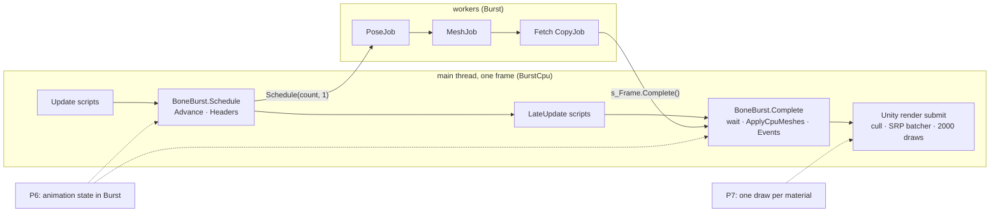
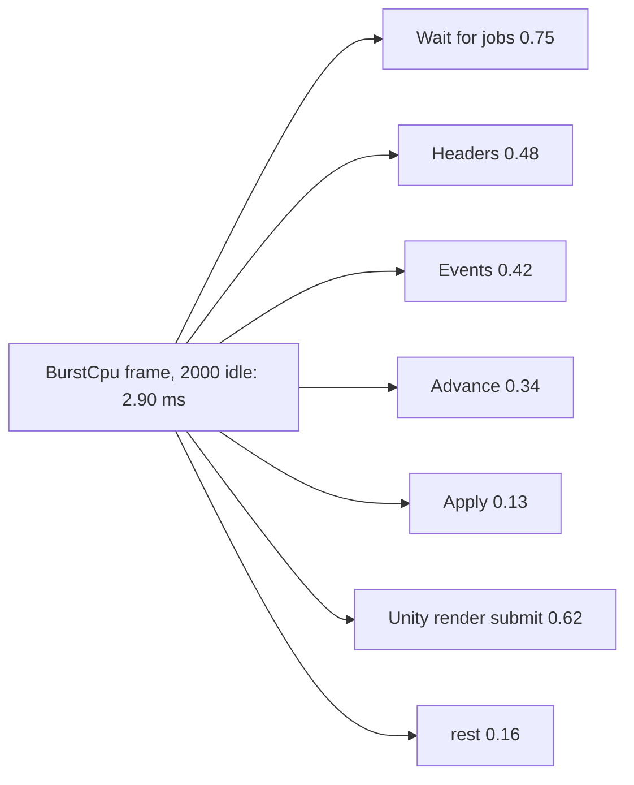
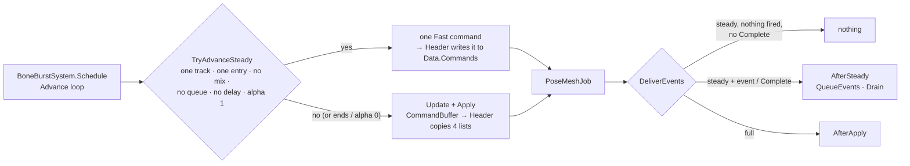
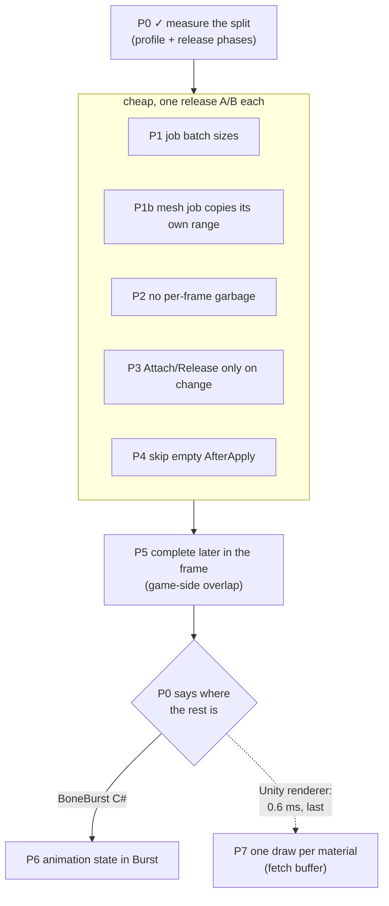

# BoneBurst performance, round 2 — plan

**Status:** **closed 2026-10-02** (owner: "Close round 2 here"). Kept and committed: **P0** phase timing, **P1**
fused pose-and-mesh job, **P6** steady animation step. BurstCpu at 2000 went 3.05 / 3.31 / 4.19 → **2.50 / 2.51 / 3.55 ms**
(idle / walk / switch), 6.7× / 8.2× / 6.1× faster than Stock. Tried and reverted: P1b (per-job ring copy), P3 (flat
command lists). Not done: P2, P4, P5 (Q2 never answered), P7, and the cached header of §1.5. Each is now worth
4–10 % at most, with rising risk; they stay here as the starting list for a later round.

BoneBurst's CPU path is already 5–6 × faster than stock spine-unity at 2,000 skeletons. In today's IL2CPP release run,
BurstCpu took 3.05 ms idle, 3.31 walk and 4.19 switch, against Stock 17.2 / 21.1 / 21.6 (§1). Every runtime is
bound by the main thread. What is left on it is no longer the pose or the mesh, which run in Burst jobs. It is BoneBurst's
**per-skeleton managed C#** around those jobs, the **wait** for them, and **Unity's own per-renderer cost** for
2,000 `MeshRenderer`s. This plan measures the split first, then takes the cheap items, then the two large ones, each kept only if
a release A/B shows a gain.

## 1. Where we stand (measured 2026-10-02)

IL2CPP release, `Build/macOS_SpineBenchmark_IL2CPP/`, macOS / Metal, 18 cores, 600 frames per run. Frame time in ms
(median):

| × 2000 | Stock | StockThreaded | BurstCpu | BurstGpu |
|---|---|---|---|---|
| idle | 17.19 | 9.90 | **3.05** | 3.15 |
| walk | 21.15 | 10.50 | **3.31** | 3.86 |
| switch | 21.61 | 12.55 | **4.19** | 4.76 |

That is 1.5 µs per skeleton idle and 2.1 µs switching. GPU time is 0.9 ms against stock's 1.4 ms, so the GPU is not the limit.

**The last profile** (IL2CPP Development, 2026-09-30, before the bake; Development inflates managed code, so treat it
as a ranking, not a budget): `Advance` + `Headers` + `Events` + `ApplyCpuMeshes` ≈ 2.2 ms idle / 2.9 ms switch; the main
thread waits ≈ 1 ms in `Complete`; switch adds `Advance` 0.40 → 0.77, `Headers` 0.55 → 0.65, `Events` 0.40 → 0.52.
How much of the rest is Unity's renderer cost was never split out.

**What the code does per frame** (`Runtime/BoneBurstSystem.cs`, read 2026-10-02):

*   `Schedule` (after `Update.ScriptRunBehaviourUpdate`):
    *   **Advance:** per skeleton, managed `BoneAnimationState.Update` and `Apply`, which fills the command buffer.
    *   **Headers:** per dirty skeleton, `BoneBurstGpu.Attach/Release` and `BoneBurstFetch.Attach/Release` every
        frame, then `owner.Header(flags)` and a second `Point` pass for fetch.
    *   **Garbage and copies:** three new `List<int>` and three `ToArray()` → `NativeArray(TempJob)` copies.
    *   **Jobs:** `PoseJob`, `MeshJob` and `GpuJob` are scheduled with `innerloopBatchCount` **1**.
*   `Complete` (end of `PreLateUpdate`):
    *   `s_Frame.Complete()`, the wait;
    *   per skeleton, `UploadCpuMesh` + `ApplyMeshOutput` (bounds);
    *   then `DeliverEvents` → `AfterApply` for **every** applied skeleton, even with nothing fired: rotation
        copy-back, a loop over the steps, `Drain`.

## 1.1 P0 result: where the 2.9–4.2 ms goes (2026-10-02)

**Release** (IL2CPP, `Build/macOS_SpineBenchmark_IL2CPP_2/`, the full suite with phase timing on: the new
`BoneBurstSystem.TimePhases` timestamps, because a release player's `ProfilerRecorder` reads nothing from script
markers). Medians in ms at 2000; the two repeats agree within 0.05 ms. Data:
`Assets/BoneBenchmark/Results/2026-10-02_macOS-Metal_release_IL2CPP_phases.csv`.

| BurstCpu × 2000 | frame | Advance | Headers | Wait | Apply | Events | Unity render submit | rest |
|---|---|---|---|---|---|---|---|---|
| idle | 2.90 | 0.34 | 0.48 | 0.75 | 0.13 | 0.42 | 0.62 | 0.16 |
| walk | 3.21 | 0.37 | 0.50 | 0.86 | 0.19 | 0.43 | 0.62 | 0.24 |
| switch | 4.21 | 0.77 | 0.61 | 0.90 | 0.30 | 0.60 | 0.72 | 0.31 |

BurstGpu: the same, except Apply 0.8–1.0 ms in walk / switch (the deforming animations' CPU fallback).

*   **Timing costs nothing measurable.** With it on, BurstCpu ran 2.90 / 3.20 / 4.21 ms against 3.05 / 3.31 / 4.19 in the
    morning run without it.
*   **Development matches release now:** Advance 0.33 against 0.34, Headers 0.46 against 0.48. The old "Development
    inflates it" caveat no longer holds for these phases.
*   **The wait** (Development profile, `JobHandle.Complete` / `WaitForJobGroupID`). The worker threads spent, per frame,
    `PoseJob` 5.0 ms, `MeshJob` 3.8 ms and the fetch `CopyJob` 1.7 ms: 10.5 ms of CPU over 18 cores, about 0.6 ms
    if perfectly parallel. The main thread runs jobs while it waits (Pose 0.33, Mesh 0.27, Copy 0.13 ms). So the wait is
    the work plus three **dependent stages**, each a barrier, scheduled one skeleton at a time.
*   **Unity's render submit** is 0.6–0.7 ms: URP 2D renderer 0.58, SRP batcher draw 0.16, culling 0.16. That is less
    than any one BoneBurst phase, so **P7 is deprioritised**: it could win at most part of 0.6 ms.
*   **Not BoneBurst:** in switch, StockThreaded shows 1.8 ms of `Gfx.WaitForPresentOnGfxThread` (render-thread
    bound). No BoneBurst run waits on present.

## 1.2 P1 and P1b results (2026-10-02)

**P1: batch sizes and a fused job.** One player (`Build/macOS_SpineBenchmark_IL2CPP_3/`) took the batch sizes and fusion from the
command line, and six configurations ran forward and then in reverse. Larger batches were **slower**, with or
without fusion: `PoseJob` 4 / `MeshJob` 8 gave 3.02 against 2.94 ms idle; batches of 2–8 with fusion gave 2.85–2.95. One instance per work item stays.
**Fusion won:** `PoseMeshJob` poses and meshes a CPU-meshed instance in one work item, the same Strict-float code, and
removes the Pose → Mesh barrier for those rows. Pose-only and GPU rows keep `PoseJob` → `GpuJob`. Medians in ms
at 2000, BurstCpu:

| | idle frame / wait | walk frame / wait | switch frame / wait |
|---|---|---|---|
| sweep, before / fused | 2.94 / 0.76 → **2.76 / 0.70** | – | 4.00 / 0.87 → **3.89 / 0.78** |
| A/B (ABBA), before / fused | 2.95 / 0.75 → 2.91 / 0.72 | 3.10 / 0.85 → 3.10 / 0.79 | 4.03 / 0.86 → **3.93 / 0.79** |

So the wait drops in every animation, and frame time drops 0.04–0.18 ms; the smaller numbers are inside the noise.
Kept, because it is cheap and also simplifies the code: the two scheduling copies (`Schedule`, `ReapplyNow`) are now one
`ScheduleJobs`. The batch knobs were deleted, since they had no use. BurstGpu does not change, as expected. Guard: play
suites 37 / 37 and timeline 13 / 13 with the fused path.

**P1b: the fused job copies its own vertices into the locked ring** (`Build/macOS_SpineBenchmark_IL2CPP_4/`). The bulk
copy then covered only unwritten ranges, without depending on the jobs. Breaking the per-job copy on purpose failed 8 of
the 10 `VertexFetchPlayModeTests`, so the guard works. A/B against P1: the wait fell a further 0.04–0.05 ms, but **Apply rose
by 0.04–0.06 ms** (0.12 → 0.16 idle, 0.28 → 0.33 switch), and frame time did not move (2.90 / 3.14 / 4.00 against 2.91 /
3.10 / 3.93). One untested guess at the cause: many small writes from many threads into the locked GPU memory cost more
at unlock than one bulk copy. **Reverted**, per the rule of keeping only a measured gain.

## 1.3 P3 result (2026-10-02, not kept)

Reading `BoneBurstSkeleton.Header` showed that the GPU / fetch Attach and Release calls already return early when nothing
changed, so the plan's P3 idea had little to save. The suspect instead was the per-element copy of the
managed command lists (`CommandBuffer.Commands`, `Modes`, `HoldFactors`, `Rotation`) into the instance's native lists
every frame. Tried: `CommandBuffer` on flat arrays (`ScratchList<T>`, `AddRange` by `Array.Copy` in `Apply`), copied
into native memory by `Span.CopyTo` (player `_5`), then by a pinned `UnsafeUtility.MemCpy` (player `_6`). Parity harness
191 / 191 and play 37 / 37 both times. ABBA A/B against P1 (`_3`), medians in ms at 2000, BurstCpu:

| | idle frame / Headers | walk frame / Headers | switch frame / Advance |
|---|---|---|---|
| P1 | 2.90 / 0.46 | 3.03–3.15 / 0.47 | 3.99–4.10 / 0.75 |
| `Span.CopyTo` | 3.10 / **0.58** | 3.25 / **0.61** | 3.91 / **0.59** |
| `MemCpy` | 3.10 / 0.48 | 3.15 / 0.48 | 4.12 / 0.67 |

*   `Span.CopyTo` into the native list was **slower** than the indexed loop under IL2CPP. `MemCpy` brought Headers back to
    P1's level and **no lower**, so the command copy was not Headers' cost.
*   `AddRange` cut `Advance` in switch by 0.08–0.17 ms. Frame time did not show it beyond the noise, and load was higher in
    the second round (up to 7.5).
*   **Reverted.** What Headers spends its 0.45–0.6 ms on is still unknown. The candidates left are `Data.Header`'s ~45
    `GetUnsafePtr` reads and `RefreshIfSkinEdited`. Finding out takes a Development profile with markers inside
    `Header()`, before any more code changes.

## 1.4 P6 as built: a steady step, not a Burst port (2026-10-02, owner: "go P6")

**Why not a Burst port.** Read through, `BoneAnimationState` is an object graph: entries with public settable fields, listener
events, hold computation over dictionaries and hash sets. Porting it to native memory would change the public API
(every `BoneTrackEntry` field becomes a property over native state) and take days, and it is where mixing behaviour
drifts. But in idle and walk, and between switches, every skeleton is in the simplest state. There, Update only adds to the
times and Apply emits one `Fast` command, yet each frame still paid the general machinery: `CommandBuffer` lists, the `Step` list, four list
copies in `Header`, and `AfterApply`'s copy-back, step loop and `Drain`.

**What was built.**
*   `BoneAnimationState.TryAdvanceSteady`: for one track holding one entry, with no delay, no next entry, no mix, not
    reversed, alpha 1 and an empty queue, it does Update's and Apply's operations **statement for statement**, on locals until
    every check has passed. It bails out, changing nothing, when the frame would end the track or apply it at alpha 0.
    `AnimationTime` and the Complete test became shared helpers (`AnimationTimeAt`, `Completes`), so both paths run the
    same code.
*   `BoneBurstSkeleton.Header` writes the one command straight into `Data.Commands`.
*   `DeliverEvents`: a steady frame with no fired event and no Complete does nothing.
    `SteadyNeedsAfter` judges this on the entry as it is then, as `AfterApply` would, so a script that moves `TrackTime` in `LateUpdate`
    still gets its Complete. Otherwise `AfterSteady` queues events and Complete through the same `QueueEvents`, then
    drains.
*   Everything else (mixes, queued listeners, several tracks, reverse, alpha below 1, `OnlyAnimationStatus`,
    `ReapplyNow`) takes the full path, unchanged.

**Guard.** `MixingParityTests.RandomScripts_SteadyStep_MatchStock` is the stock-parity mixing suite (random sets,
adds, empties, clears, mixes, time scales; pose and full listener log against stock spine-csharp every frame), with
BoneBurst taking the steady step whenever it accepts the frame. 24 cases, each asserting that the step ran.
Harness 215 of 215 bit-exact. With `LastTime` broken on purpose, 2 of the 24 steady cases failed: the skeletons whose animations fire
events, since `LastTime` only sets the event window.

**Result** (IL2CPP release `Build/macOS_SpineBenchmark_IL2CPP_7/` against P1, `_3` with fusion on, ABBA; medians of
four runs in ms at 2000). One P6 run started at load 13.4 and still won.

| | idle frame | walk frame | switch frame | Advance idle / switch | Events idle / switch |
|---|---|---|---|---|---|
| BurstCpu P1 | 2.88 | 3.05 | 3.91 | 0.33 / 0.71 | 0.45 / 0.62 |
| **BurstCpu P6** | **2.50** | **2.51** | **3.55** | 0.21 / 0.59 | **0.09** / 0.32 |
| BurstGpu P1 | 3.20 | 3.70 | 4.70 | 0.40 / 0.71 | 0.54 / 0.62 |
| **BurstGpu P6** | **2.70** | **3.29** | **4.45** | 0.22 / 0.58 | 0.13 / 0.37 |

Against stock at 2000 (today's suite: Stock 16.7 / 20.6 / 21.6 ms): BurstCpu is now **6.7×** faster idle, **8.2×** walk and
**6.1×** switch. Headers (0.41–0.61 ms) and the job wait (0.7–0.8 ms) are now the largest BoneBurst phases left. Suites:
Editor 433 + 1 skipped of 434, SpineUnity 24, play 37, timeline 14 / 13, harness 215 of 215, M2 CCP play 17 of 17.

## 1.5 Headers, profiled (2026-10-02)

Temporary markers inside the Headers loop and `BoneBurstSkeleton.Header` (IL2CPP Development, 2000 idle, reverted after):
Headers 0.79 ms with the markers (0.43 in release). `Header()` 0.50, inside it `Data.Header` 0.16, `RefreshIfSkinEdited`
0.13, the command write 0.05; the fetch `Point` pass 0.09; row lists 0.04. Lookups and attach / release were below the top
45 markers. **The markers dominate their own numbers.** `RefreshIfSkinEdited` reads four plain fields yet showed ~60 ns per
skeleton, which is about one marker pair, so the split inside `Header()` cannot be trusted below about 0.1 ms.

What it does settle: no single call is slow. Headers is the per-skeleton header itself. `InstanceHeader` is ~70 fields
(~450 bytes), rebuilt every frame from ~45 native pointers by `Data.Header` and copied two or three times on the way into
`s_Headers[row]`: about 1.3 KB moved and 45 pointer reads per skeleton. At 2000 that plausibly makes ~0.15–0.2 ms of
the release 0.43 ms (arithmetic, not measured).

**Candidate (not started), a cached header:** keep each row's header in place and, per frame, rewrite only the fields that change
every frame (the five command-list pointers and counts, colour, scale, flags, physics, `ApplyRan`, the GPU and fetch
fields). The full `Data.Header` rebuild then runs only when a structural version on `InstanceData` changes (any list
recreated or reallocated, clipping or GPU state created, `SlotsConstrained` toggled). Honest size: 0.1–0.25 ms (4–10 %).
Risk: a missed invalidation leaves a **stale native pointer**, a memory error rather than a wrong pose. So it needs a
Development-build check that compares the cached header with a full rebuild every frame.

## 2. Steps

| Step | What | Size | Expected at 2000 (honest guess) | Kept only if |
|---|---|---|---|---|
| **P0 ✓** | IL2CPP Development profile of BurstCpu idle / walk / switch at 2000, plus the same split in **release**: the benchmark reads the `BoneBurst.*` markers and Unity's render markers with `ProfilerRecorder` where a release player exposes them, and adds them as CSV columns | small | — (a measurement) | it adds no frame time itself (A/B with the recorders off) |
| **P1 ✓** | `innerloopBatchCount` per job: `PoseJob` 1 → 2–4, `MeshJob` and the copy 1 → 8–16; picked by a small sweep | tiny | 0.1–0.3 ms of the 0.75–0.9 wait | release A/B, both orders |
| **P1b ✗** | **One stage fewer:** `MeshJob` copies its own instance's range into the locked ring right after writing it (cache-hot). The bulk `CopyJob` copies only the ranges no job rewrote this frame (still skeletons, which still need copying, see `BoneBurstFetch`'s remarks) | medium | 0.1–0.3 ms of the wait, and 1.7 ms less worker CPU when everything animates | `VertexFetchPlayModeTests` (pixel-identical, a still skeleton after ring rotations); A/B |
| **P2** | `Schedule` without garbage: persistent `NativeList<int>` row lists reused every frame, with no `List<int>` and no `ToArray` | small | ≤ 0.1 ms, plus no GC spikes | A/B, and `gc_bytes` 0 in a Development run |
| **P3 ✗** | Headers: each skeleton remembers its last mode (GPU / fetch / none). Attach and Release run only when that changes, and `Point` folds into the same loop | small | 0.2–0.4 ms: Headers is 0.48–0.61, more than guessed | A/B; `VertexFetchPlayModeTests` + GPU suites green |
| **P4** | Events: an early exit when the state has nothing to deliver (no fired event, no completion, no mixing entry, no queued listener event). Rotation carry and total alpha still copy back when a mix runs | small | 0.2–0.3 ms of Events' 0.42 idle / walk, less in switch | Animation + Mixing parity suites and harness bit-exact; A/B |
| **P5** | `Complete` moves from the end of `PreLateUpdate` to just before `PostLateUpdate.UpdateAllRenderers`, so the jobs overlap the game's `LateUpdate` and animation work. The benchmark gains `-mainWork <ms>`, a stand-in for game scripts | small | none in the bare benchmark; up to the ≈ 1 ms wait in a real game | `-mainWork 2` A/B shows it; anything that reads the mesh in `LateUpdate` is checked first (M2's CCP, the timeline's `ReapplyNow`) |
| **P6 ✓** | **Animation state in Burst** (built instead as a managed steady step, §1.4) (the deferred item 2 of 2026-09-30). `Update`, `Apply` and `AfterApply` run natively inside `PoseJob` for a skeleton with no listener work that frame. The managed path stays for one that fires an event, completes, or is changed from script | large | most of Advance + Events: 0.76 ms idle, 1.37 ms switch (release) | the parity harness grows a Burst-state suite (the same managed state cases run on the native state, bit-exact); every Editor + play suite green; release A/B |
| **P7** | **Fewer draws.** CPU-fetched skeletons already write their vertices into one shared buffer. Skeletons that share a material and a sorting band could be drawn in one `RenderPrimitivesIndexed` / BRG call instead of 2000 `MeshRenderer`s | large, research | at most part of the 0.6–0.7 ms render submit (P0); **deprioritised** | a design note first (sorting between skeletons, culling, picking, Lit2D), then a prototype A/B |

Each step lands on its own: build a new IL2CPP release player into a new `Build/` folder, run the suite with the step
and without it in alternating order on a quiet machine (load under 8, as on 2026-10-02), keep it only if it wins beyond the
±5 % noise, and record the numbers in `BoneBurst-Performance.md`.

## 3. What does not change

*   Behaviour: every Editor suite, play suite, timeline suite, M2's CCP suite and the 191 bit-exact harness tests stay
    green after each step. P4 and P6 touch animation semantics; they wait on those suites, not on a visual check.
*   The assembly split: P1–P5 are in `Module.PB.BoneBurst.Unity`, and P6's native state goes in
    `Module.PA.BoneBurst.Core` (no UnityEngine, so the harness compiles it).
*   Both paths (CPU mesh and GPU skinning) stay, per the owner's earlier direction.

## 4. Risks

*   **P6 is where behaviour can drift**, in mixing, crossfades and event order. That is why it waits for P0's numbers, and why it
    must have its own bit-exact harness cases before it ships.
*   **P5 changes when the mesh is ready.** A script that reads a skeleton's mesh or bounds in `LateUpdate` would see the
    previous frame's. Search the callers first.
*   **P7 breaks the one-renderer-per-skeleton model** that sorting, culling, the Scene view and M2's prefabs assume. It is
    a research item, not a commitment.
*   **Gains under about 0.15 ms are inside the noise** at 2000. They are kept only from alternating A/B runs, never from one
    run against an old number.

## 5. Decisions for the owner

*   **Q1 — scope.** Answered: P0 first (done). Recommended next, by P0: P1 + P1b (the wait), P3 (Headers), P4
    (Events), then P6 (Advance + Events, the largest single item under animation changes); P7 last or never.
    Realistic total if all land: 2.9 → about 1.8–2.2 ms idle and 4.2 → about 2.6–3.0 ms switch at 2000. That is a
    guess from the phase sizes, to be confirmed one A/B at a time.
*   **Q2 — P5's `-mainWork` option** in `Assets/BoneBenchmark`: a fake main-thread workload, so the benchmark can show the
    overlap a real game gets. OK to add?
