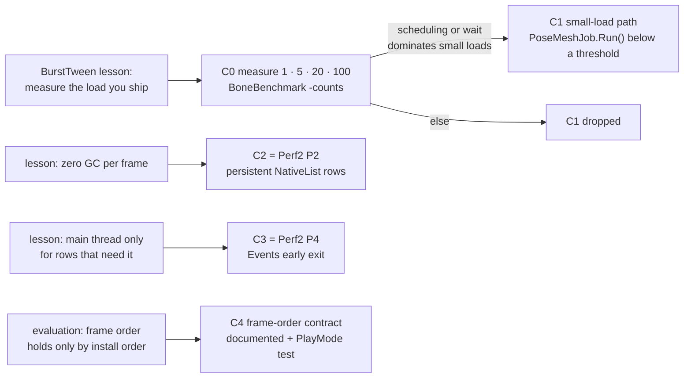

# BoneBurst performance, round 3 — what BurstTween teaches — plan

**Status: C0 done 2026-10-05** (owner: "go C0"). It ran first from a player that drew nothing. That led to
[BoneBurst-PlayerShader-Plan.md](BoneBurst-PlayerShader-Plan.md) (shaders in *Always Included Shaders*), and C0 then
re-ran from a player that draws (§2.1). Recommendation from C0: drop C1. C3's case rests only on 2,000 skeletons.
C2 and C4 are not started.

The source is [BoneBurst-BurstTween-Evaluation.md](BoneBurst-BurstTween-Evaluation.md). It found that BoneBurst
should not use BurstTween, but BurstTween's optimization record (M1-Plugins-Custom
`com.module.pa-motion-bursttween/Doc/Why-BurstTween-Is-Faster.md`, its plan step 13) has lessons that point at real
gaps in BoneBurst. The largest is that **BoneBurst has never been measured at the scale its consumers ship**: M2 runs a
handful of characters, while the benchmark suite starts at 100 (`SuiteCounts = { 100, 500, 2000 }`).

## 1. The lessons, and where BoneBurst stands

| BurstTween lesson | BoneBurst today (checked on disk 2026-10-05) |
|---|---|
| **Measure the backend and the load you ship.** BurstTween's first "faster everywhere" (Mono) was wrong for IL2CPP small loads. | IL2CPP is already the target ([BoneBurst-Performance.md](BoneBurst-Performance.md)). But the smallest load measured is 100 skeletons (0.35 ms idle, BurstCpu). M2's `P Graphics 2` scenes show one to a few. **Gap.** |
| **Small loads skip job scheduling.** Below a measured threshold BurstTween runs its Burst job with `Run()` on the calling thread. Below another threshold it writes Transforms from the main thread. Both thresholds came from a benchmark with forced `Run` / `Schedule` / `Auto` modes. | `BoneBurstSystem.ScheduleJobs` always calls `Schedule(count, 1)` for `PoseJob`, `PoseMeshJob` and `GpuJob`, plus the fetch copy, whatever the count (`BoneBurstSystem.cs:818–828`). For one skeleton that is up to four job launches and a wait at `Complete`. This is unmeasured: it may cost nothing, because the jobs overlap `LateUpdate`. |
| **Zero GC per steady frame**, with persistent buffers. | `Schedule` allocates every frame: `List<int>` row lists (`BoneBurstSystem.cs:~558`), `ToArray()` into `TempJob` arrays (`:815–817`, `:756–757`), and `s_PendingAdds.ToArray()`. This is Perf2 **P2**, not done. |
| **The main thread touches only rows with work.** The job clears a row's "changed" bit, so a tween in mid-flight costs dispatch nothing. | Events cost 0.09 ms idle / 0.32 switch at 2,000 after P6. An early exit for a skeleton with nothing to deliver is Perf2 **P4**, not done. |
| **Install order decides the frame order** (the evaluation, "Things to know" 1). | `BoneBurstSchedule` sits right after `Update.ScriptRunBehaviourUpdate`. Any system inserted at the same spot later runs before it. Nothing documents or tests what a caller may rely on. |

## 2. Steps

| Step | What | Size | Expected | Guard / proof |
|---|---|---|---|---|
| **C0** | Measure consumer scale. IL2CPP release `-boneBench -counts 1,5,20,100` with `TimePhases` on, for BurstCpu, BurstGpu, Stock and StockThreaded, run twice and alternated. Add a mix-and-match-pro run, since that is M2's content. **No runtime code.** | small | numbers. The question is whether BurstCpu's main-thread cost at 1–20 is dominated by Schedule plus Wait, and whether stock beats BoneBurst there. | §5 conditions (`uptime`, no `bee_backend`). Results CSV under the benchmark's `Results/`. |
| **C1** | Only if C0 shows scheduling or the wait dominating. Below a measured row threshold, `PoseMeshJob` / `PoseJob` / `GpuJob` and the fetch copy run with `.Run()` (still Burst) inside `Schedule`, and `Complete` finds nothing to wait for. The benchmark gains `-jobMode Auto\|Run\|Schedule` to pick the threshold, as BurstTween's did. | medium | at small counts, the Schedule + Wait share C0 finds. Note the cost: `Run` gives up the overlap with `LateUpdate`, so a heavy skeleton may get slower. That is why the threshold must be measured, not guessed. | The play-mode suite and `VertexFetchPlayModeTests` run in both forced modes (pixel-identical). Release A/B at 1 / 5 / 20 / 100 / 2,000: 2,000 must not move. |
| **C2** | Perf2 P2: persistent `NativeList<int>` row lists reused every frame. No `List<int>`, no `ToArray`, no `TempJob` arrays per frame. | small | ≤ 0.1 ms at 2,000, and no GC spikes at any count | `gc_bytes` 0 per steady frame in a Development run. Play-mode suite green. |
| **C3** | Perf2 P4: Events exits early when the state has nothing to deliver (no fired event, no completion, no mixing entry, no queued listener). Rotation carry and total alpha still copy back when a mix runs. | small | most of Events' 0.09 ms idle at 2,000. Proportionally more at small counts, where per-skeleton C# is the whole cost. | Animation + Mixing parity suites. `parity-harness` bit-exact. Release A/B. |
| **C4** | Frame-order contract. `BoneBurstSystem`'s remarks state it: state set before `BoneBurstSchedule` (in `Update`, or by a PlayerLoop system inserted ahead of it) is drawn this frame, and state set in `LateUpdate` is drawn next frame. A PlayMode test in `Module.TA.BoneBurst.Tests` installs its own PlayerLoop entry after `ScriptRunBehaviourUpdate`, the way BurstTween does, sets `Color` and the Transform there, and asserts both reach this frame's header and physics. | small | no speed. It turns "works by install order" into a guarded contract. | The test itself. Break it on purpose once (install the probe *after* BoneBurst's entry) and confirm it fails (§5). |

### 2.1 C0 result (2026-10-05)

**Player.** `Build/macOS_BoneBenchmark_IL2CPP_2/`: IL2CPP release, built after `BuildPlayerContent` from the working
tree with the shader fix. Command: `-boneBench -counts 1,5,20,100`, mix-and-match-pro `full-skins/girl`, 2 repeats
(ABBA). Run twice. The two runs agree within about 3 %.
`Results/2026-10-05_macOS-Metal_release_IL2CPP_consumer-scale_run{1,2}_summary.csv` (in the benchmark folder, now
`Assets/Samples Custom/BoneBenchmark/`). 0 `not found` in either log.

**Conditions.** No `bee_backend`. Load average 5.7–7.0 on 18 cores. WindowServer and audio were the top processes;
the Unity Editor sat idle.

**First attempt, discarded.** The earlier player (`Build/macOS_BoneBenchmark_IL2CPP/`, 07:24) logged
`shader BoneBurst/Unlit not found` 2,268 times and drew no BoneBurst skeleton. `ResolveShader`'s fallback
`Shader.Find` had nothing in the build to find. The rename's player check ran only `-loadBench`, which builds no
material. Fixed by [BoneBurst-PlayerShader-Plan.md](BoneBurst-PlayerShader-Plan.md). Its own-time numbers matched the
drawing player's within about 3 %: drawing costs BoneBurst no main-thread time inside its own phases.

**Frame time cannot resolve these loads.** `frame_ms` and `cpu_main_ms` move in about 0.1 ms steps here (0.10, 0.20,
0.30 …). Only the phase markers resolve microseconds. The comparison below is each runtime's **own main-thread time**:
BoneBurst's `BoneBurst.Schedule` + `BoneBurst.Complete`, against stock's `ScriptRunBehaviourUpdate` +
`ScriptRunBehaviourLateUpdate`. Medians in ms, mean of run 1 and run 2:

| Count | Stock (idle / walk / switch) | StockThreaded | BurstCpu | of which BurstCpu wait | BurstCpu vs Stock |
|---:|---|---|---|---|---|
| 1 | 0.015 / 0.016 / 0.017 | 0.041–0.044 | 0.027 / 0.038 / 0.039 | 0.024 / 0.035 / 0.036 | **stock 1.8–2.4× faster** |
| 5 | 0.060 / 0.064 / 0.066 | 0.057–0.068 | 0.035 / 0.041 / 0.043 | 0.032 / 0.037 / 0.039 | 1.5–1.7× faster |
| 20 | 0.237 / 0.243 / 0.254 | 0.137–0.140 | 0.067 / 0.070 / 0.074 | 0.059 / 0.062 / 0.066 | 3.4–3.5× faster |
| 100 | 1.31 / 1.35 / 1.47 | 0.54–0.57 | 0.182 / 0.182 / 0.183 | 0.156 / 0.156 / 0.156 | 7.2–8.0× faster |

BurstGpu is within ±0.01 ms of BurstCpu at every count. `gc_bytes` is empty: the GC recorder reports nothing in a
release player, so C2's guard needs a Development run, as the plan says.

**What it says:**
*   **At 1 skeleton, single-threaded stock beats BoneBurst** (0.015–0.017 against 0.027–0.039 ms). From 5 skeletons
    up, BoneBurst wins, and the gap grows with the count.
*   **At 1–5 skeletons, 85–90 % of BoneBurst's main-thread time is the wait for its jobs.** `Schedule`'s own work is
    0.003–0.004 ms. Headers, Advance and Events are ≤ 0.001 ms each. The benchmark runs no script between `Schedule`
    and `Complete`, so the wait is mostly job wake-up latency, not work. In a game, `LateUpdate` scripts would fill it.
*   **C1's ceiling is about 0.02–0.03 ms per frame** at consumer scale: 0.1–0.2 % of a 16.6 ms frame, before the lost
    overlap with `LateUpdate` is counted against it. C0's gate ("wait dominates") is met in proportion, **but the
    absolute gain is negligible. Recommendation: drop C1** unless a real game frame shows otherwise.
*   **C3 (Events early exit) is worth nothing at consumer scale.** Events are ≤ 0.002 ms even at 100 skeletons. Its
    case rests on the 2,000-skeleton numbers alone.

**Order:** C0 first, since it decides C1. C2, C3 and C4 do not depend on C0 and can go in any order. Each kept only if
its release A/B shows a gain (C4 excepted).

## 3. What does not change

*   **No reference to BurstTween** from any BoneBurst assembly. C4's test uses its own PlayerLoop probe.
*   Parity with stock spine-csharp: curves, mixing and `BoneAnimationState` stay statement for statement. C3 must
    keep `MixingParityTests` and the harness bit-exact.
*   The 2,000-skeleton results in [BoneBurst-Performance.md](BoneBurst-Performance.md) must not regress.

## 4. Considered, not proposed

*   **Reading Transforms in a job** (BurstTween's `TransformAccessArray`). BoneBurst reads `transform.position` /
    `rotation` on the main thread only in `AdvancePhysics`, and only for skeletons with physics constraints and a
    non-zero inheritance (`BoneBurstSkeleton.cs:723–750`). It is too narrow to pay for a parallel Transform job. Re-open
    if C0's phase times show Advance growing with physics content.
*   **Perf2 P5** (complete later in the frame) and **P7** (fewer draws) stay in the closed Perf2 plan. C0's small-count
    numbers may change P5's priority, because at consumer scale the wait overlaps less game work.

## 5. Decisions for the owner

1.  **Run C0?** It is a measurement only (two release builds, about 30 min of runs).
2.  **Counts:** `1,5,20,100` proposed. Should M2's real character count be the anchor instead?
3.  **C2–C4 now, or after C0?** They are independent of it.
4.  **(new, from C0; decided 2026-10-05: Always Included Shaders, done)** The shader in players. Without a fix, a player showed no BoneBurst skeleton. Two ways: make the
    shaders addressable and indexed, so the AssetSystem reference resolves; or make `Shader.Find`'s fallback work by
    including the shaders in the build (*Always Included Shaders*, or a referenced material). §11 calls this "open,
    the owner's". M2's players likely show the same: not checked. Needed before C0 can be re-run.
