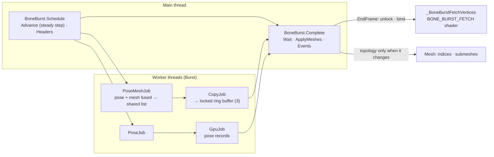

# BoneBurst performance: summary (updated 2026-10-02)

This page summarizes the performance work on BoneBurst against stock spine-unity, measured in real release players with `Assets/BoneBenchmark`. It covers N × spineboy-pro, all on screen and animating, on macOS / Metal (Mac17,8, 18 cores). **IL2CPP is the target.**

At 2 000 skeletons, BoneBurst's CPU mesh went from **13.9 ms** (slower than threaded stock, the first Mono benchmark) to **2.50 ms idle / 2.51 walk / 3.55 switch** over two rounds of work (below): **6.7× / 8.2× / 6.1× faster than Stock** (16.7 / 20.6 / 21.6 ms) and about a quarter of StockThreaded. It is faster than BoneBurst's own GPU skinning, and it handles mesh deform, which GPU skinning falls back on. Per the owner's direction, both paths stay: lightly animated skeletons on GPU skinning, main characters on the CPU mesh.

## 1. Timeline

Frame time at 2 000 skeletons (ms, median of the release suite):

| Step | Backend | BurstCpu idle / walk | BurstGpu idle / walk | StockThreaded idle / walk | Stock idle / walk |
|---|---|---|---|---|---|
| First benchmark | Mono | 13.85 / 13.65 | 5.55 / 13.91 | 8.65 / 8.96 | 31.45 / 36.10 |
| In-place mesh upload | Mono | 8.15 / 7.74 | 5.45 / 8.35 | 8.11 / 8.35 | 28.94 / 32.55 |
| Same code | IL2CPP | 8.05 / 8.05 | 3.45 / 8.44 | 10.18 / 10.25 | 17.05 / 19.85 |
| CPU vertex fetch | IL2CPP | 4.95 / 5.05 | 3.45 / 8.45 | 9.95 / 10.22 | 16.90 / 19.70 |
| Ring upload, fallback via fetch | IL2CPP | **3.56 / 3.80** | 3.89 / **4.75** | 9.90 / 10.30 | 16.92 / 20.95 |

| Step | What it fixed | Evidence |
|---|---|---|
| In-place mesh upload | `ApplyAndDisposeWritableMeshData` re-declared every mesh's buffers each frame, so the render thread replaced 2 000 GPU buffers per frame. Now each skeleton keeps its buffers and uploads vertices only while its topology is unchanged. | Render thread 10.4 → 6.0 ms. |
| IL2CPP | The target backend. Stock gains most (all managed C#); BoneBurst's hot path is Burst on either backend. | Threaded stock is +25% on IL2CPP; the cause was not profiled. |
| Per-instance C# trims | Profiled 2.4 ms in a Development build. | No change in a release A/B: the Development build's safety checks inflated it. Only markers and trivial trims were kept. |
| CPU vertex fetch | One `Mesh.SetVertexBufferData` per skeleton (3.5 ms main thread), plus the render thread's 2 000 dynamic-mesh updates. Vertices now go into one shared buffer the shader reads by `SV_VertexID`. | Render thread 6.3 → 0.8 ms. Pixel-identical to the upload. |
| Ring upload | A main-thread `SetData` of 13 MB (0.9 ms). Now a parallel Burst copy into a locked ring of three GPU buffers. | BurstCpu 4.71 → 3.61 ms (alternating A/B). |
| GPU fallback via fetch | GPU skinning with mesh deform fell back to the per-mesh upload every frame. | BurstGpu walk 8.69 → 4.71 ms. |
| Bounds with a margin; GPU fallback copy in a job | `Mesh.bounds` was set per skeleton every frame; now it is re-set only when the pose leaves a 10% margin. The fallbacks' late copy moved to a job. | Alternating A/B at 2 000: BurstCpu 3.66 → 3.00 (idle), 4.60 → 4.12 (switch); BurstGpu 3.61 → 2.90, 5.70 → 4.99 ms. |
| Animation changes measured | The new benchmark mode `switch` changes animation every 0.5–1.5 s with a 0.2 s crossfade. | At 2 000: BurstCpu 5.01 ms, against StockThreaded 13.39 and Stock 22.05. Switch costs BoneBurst +1.1 ms over idle, stock +2.8 / +4.9 ms. |
| Fused pose-and-mesh job (round 2 P1) | `PoseMeshJob` poses and CPU-meshes one instance in a work item, removing the Pose → Mesh barrier; larger batch sizes measured slower and stay at 1. | ABBA at 2 000: switch 4.03 → 3.93 ms; the wait −0.03 to −0.08 ms in every animation. |
| Steady animation step (round 2 P6) | `TryAdvanceSteady`: Update and Apply in one statement-for-statement step for the common steady state; events and Complete still delivered through the same `QueueEvents`. | ABBA at 2 000, BurstCpu: idle 2.88 → **2.50**, walk 3.05 → **2.51**, switch 3.91 → **3.55** ms; Events idle 0.45 → 0.09. |

Two runtime bugs were found and fixed on the way:
- **Setup pose dropped on enable.** A double entry in `s_Dirty` lost `NeedsSetupPose`, so skeletons enabled in Play mode drew nothing.
- **Disable → enable in one frame** posed and meshed the instance twice.

## 2. Full-suite results by date (IL2CPP release)

`Assets/BoneBenchmark/Results/2026-09-30_macOS-Metal_release_IL2CPP_fetch-ring_summary.csv`. Frame time in ms:

| Animation × count | Stock | StockThreaded | BurstCpu | BurstGpu |
|---|---|---|---|---|
| idle × 100 | 0.65 | 0.59 | **0.35** | 0.40 |
| idle × 500 | 3.96 | 2.55 | **0.83** | 1.00 |
| idle × 2000 | 16.92 | 9.90 | **3.56** | 3.89 |
| walk × 100 | 0.70 | 0.60 | **0.45** | 0.65 |
| walk × 500 | 4.74 | 2.71 | **1.10** | 1.46 |
| walk × 2000 | 20.95 | 10.30 | **3.80** | 4.75 |

With animation changes (`switch`; `Results/2026-09-30_macOS-Metal_release_IL2CPP_switch_summary.csv`, a separate run from the table above), frame time in ms:

| Count | Stock | StockThreaded | BurstCpu | BurstGpu |
|---|---|---|---|---|
| 100 | 0.80 | 0.60 | **0.50** | 0.60 |
| 500 | 5.30 | 2.91 | **1.20** | 1.67 |
| 2000 | 22.05 | 13.39 | **5.01** | 6.06 |

- **GPU time is equal on all four runtimes** (about 1.9 ms at 2 000). The runtimes differ only in CPU-side cost.
- **Run-to-run noise is about ±5%.** A stray Development player once loaded the machine during two runs; those runs were repeated. Every comparison in this page is between runs on a quiet machine, or alternating A/B.

## 2.1 After the bake (2026-10-01): load time and frame time

This is an IL2CPP release player built after the bake plan and the parity plan (`Build/StandaloneOSX_SpineBenchmark_IL2CPP/`). Improvement plan I4.

**Load time**, first use of spineboy-pro. Each is the median of 200 timed runs after three warm-up runs, with a GC before each. `-loadBench 200` ([BoneBenchmarkLoad.cs](../../../../Assets/BoneBenchmark/BoneBenchmarkLoad.cs)). Two runs, `Results/2026-10-01_macOS-Metal_release_IL2CPP_loadtime.csv`:

| Path | Median ms (run 1 / run 2) | p95 ms |
|---|---|---|
| **BoneBurst, baked `.sbdata`**: bytes, reader, key table, `BlobBuilder.Build` | **0.42 / 0.42** | 0.55 / 0.53 |
| of which: reading the `.sbdata` | 0.17 / 0.17 | 0.19 / 0.20 |
| of which: `BlobBuilder.Build` | 0.20 / 0.20 | 0.32 / 0.32 |
| BoneBurst, the path before the bake: JSON and atlas readers, key table, build | 4.08 / 4.42 | 4.41 / 4.69 |
| Stock spine-unity: atlas and skeleton data, caches cleared | 3.51 / 3.50 | 3.76 / 3.79 |

- The bake makes a BoneBurst skeleton's first use about **10 × faster** than its old JSON path, and about **8 × faster than stock's**.
- `BlobBuilder.Build` is half of what is left, 0.2 ms per skeleton type. Storing the built blob in the file too (improvement plan I6) is not worth its complexity; decided not to.

**Frame time**: the full suite twice (`-boneBench`), `Results/2026-10-01_…_after-bake_run1_summary.csv` and `…_run2_summary.csv`. Medians in ms at 2 000 skeletons, against the last numbers before the bake:

| | Stock | StockThreaded | BurstCpu | BurstGpu |
|---|---|---|---|---|
| idle, run 1 / run 2 | 16.95 / 17.23 | 9.96 / 10.35 | 3.25 / 3.24 | 3.35 / 3.25 |
| walk, run 1 / run 2 | 19.88 / 20.69 | 10.30 / 10.33 | 3.16 / 3.35 | 3.85 / 3.85 |
| switch, run 1 / run 2 | 21.45 / 21.40 | 12.76 / 12.85 | 4.20 / 4.55 | 5.07 / 5.00 |
| before the bake: idle / switch (A/B after bake-plan items 3 and 4, `BoneBurst-Plan.md`) | – | – | 3.00 / 4.12 | 2.90 / 4.99 |
| before the bake: switch suite (`…_IL2CPP_switch_summary.csv`, before items 3 and 4), idle / walk / switch | 17.19 / 20.44 / 22.05 | 10.55 / 11.13 / 13.39 | 3.90 / 4.00 / 5.01 | 4.10 / 4.90 / 6.06 |

- **The bake did not change frame time, as expected**: it touches only loading. Stock matches its earlier run within ±5 %, so the conditions compare. BoneBurst matches the numbers after items 3 and 4 within the spread between sessions: switch 4.20–4.55 against 4.12 (CPU) and 5.00–5.07 against 4.99 (GPU); idle 3.25 against 3.00 (CPU).
- **Not an A/B within one session** against a pre-bake build. That would need a player built from the commit before bake-plan B3; not done, since the per-frame code did not change.
- **Conditions.** No build ran (`bee_backend` absent before, during and after). Brave, Chrome and Rider were quit first; each had held a full core. Brave was relaunched during the runs, with helper bursts of 12–54 % of one core, plus one `vitest` sample at 47 %. That is light, intermittent load on 18 cores, and the two runs agree within about 5–10 %.

## 2.2 Both sides on the compressed texture (2026-10-01)

Improvement plan I5, item 2. The demo is now baked with texture compression on (DXT5, 8,192 → 2,048 KB), and the benchmark's stock material samples that same copy (`BoneBenchmark_StockURP2D.mat` → `spineboy-pro_BoneBurst/spineboy-pro.png`), so both sides draw identical pixels. The IL2CPP player is `Build/StandaloneOSX_SpineBenchmark_IL2CPP_2/`. The full suite ran twice: `Results/2026-10-01_…_IL2CPP_compressed_run1_summary.csv` and `…_run2_summary.csv`. Medians in ms at 2,000 skeletons, from the uncompressed runs of §2.1 (run 1 / run 2) to the compressed runs (run 1 / run 2):

| | Stock | StockThreaded | BurstCpu | BurstGpu |
|---|---|---|---|---|
| frame, idle | 16.95 / 17.23 → 16.86 / 17.01 | 9.96 / 10.35 → 10.00 / 9.85 | 3.25 / 3.24 → 2.94 / 2.90 | 3.35 / 3.25 → 3.10 / 3.10 |
| frame, walk | 19.88 / 20.69 → 20.29 / 20.53 | 10.30 / 10.33 → 10.30 / 10.75 | 3.16 / 3.35 → 3.15 / 3.30 | 3.85 / 3.85 → 3.75 / 3.90 |
| frame, switch | 21.45 / 21.40 → 21.35 / 21.50 | 12.76 / 12.85 → 12.80 / 12.91 | 4.20 / 4.55 → 4.31 / 4.34 | 5.07 / 5.00 → 5.05 / 5.09 |
| GPU, idle | 1.86 / 1.87 → 1.40 / 1.40 | 1.86 / 1.87 → 1.40 / 1.40 | 1.78 / 1.54 → 1.51 / 1.51 | 1.98 / 1.54 → 1.49 / 1.51 |
| GPU, switch | 1.98 / 1.98 → 1.46 / 1.46 | 1.98 / 1.98 → 1.46 / 1.46 | 2.09 / 2.08 → 1.58 / 1.58 | 2.10 / 2.10 → 1.59 / 1.59 |

- **Frame time is unchanged** within the run-to-run spread, since every side is bound by the CPU. The two compressed runs agree within about 4 %.
- **GPU time drops by about a quarter on both sides**, in line with a quarter of the texture bandwidth. The ratios between runtimes hold, so the §2 comparison stands.
- **Conditions.** No build ran in either run (`bee_backend` absent before, during and after). Run 1: Brave helper bursts up to 56 % of one core, Rider around 10 %, load 5–11 on 18 cores. Run 2: Rider quit, with Spotlight (`mds`) and the idle Editor each briefly near one core, load 6–10. An earlier second run overlapped Rider/ReSharper at 263–597 % CPU (load up to 35) and was **discarded** (`CLAUDE.md` §5).

## 2.3 Round 2 (2026-10-02): the frame by phase, and a fused pose-and-mesh job

From [BoneBurst-Perf2-Plan.md](BoneBurst-Perf2-Plan.md) §1.1–1.2, IL2CPP release at 2,000, after the AssetSystem refactor and the assembly
split (no regression: BurstCpu 3.05 / 3.31 / 4.19 ms idle / walk / switch against 2.9–3.3 / 3.2–3.3 / 4.3 on 2026-10-01).
Phase timing (`BoneBurstSystem.TimePhases`), BurstCpu idle 2.90 ms: Wait 0.75, Unity render submit 0.62, Headers 0.48,
Events 0.42, Advance 0.34, Apply 0.13. With `PoseMeshJob`: switch 4.03 → 3.93 ms, the wait −0.03 to −0.08 ms everywhere.
Against stock at 2,000: BurstCpu takes 16–18 % of Stock's frame and about a third of StockThreaded's.

**The steady animation step** (P6, plan §1.4): BurstCpu 2.88 → 2.50 ms idle, 3.05 → 2.51 walk, 3.91 → 3.55 switch
(ABBA). That is 6.7× / 8.2× / 6.1× faster than Stock at 2,000.

**The round closed the same day** (owner: "Close round 2 here"). Kept: P0, P1, P6. Tried and reverted, each with its
guards green first: P1b, the fused job copying its own range into the GPU ring (the wait fell 0.04–0.05 ms but Apply
rose as much; plan §1.2), and P3, flat command lists with a block copy (Headers did not move; plan §1.3). Not done:
P2, P4, P5, P7, and the cached instance header (plan §1.5 profiled Headers and found no single slow call — it is the
per-skeleton header itself). Those stay in the plan as the starting list for a later round, each worth 4–10 % at most.
The largest BoneBurst phases now: Headers 0.41–0.61 ms and the job wait 0.7–0.8 ms.

## 2.4 New content: mix-and-match-pro (2026-10-02)

The benchmark now runs mix-and-match-pro in `full-skins/girl` on both sides (`Assets/Docs-Plan/Demo-MixAndMatch-Plan.md`);
everything above is spineboy-pro. At 2,000 (IL2CPP release): Stock 38.3 / 39.0 / 42.6 ms, StockThreaded 24.6 / 25.4 / 27.2,
**BurstCpu 3.95 / 3.85 / 5.46** (idle / walk / switch): 9.7× / 10.1× / 7.8× faster than Stock.

## 2.5 Consumer scale: 1 to 100 skeletons (2026-10-05)

[BoneBurst-Perf3-Plan.md](BoneBurst-Perf3-Plan.md) C0, IL2CPP release, mix-and-match-pro, two runs. Main-thread time
of each runtime's own phases, walk, in ms: **1 skeleton: Stock 0.016, BurstCpu 0.038** (stock faster); 5: 0.064
against 0.041; 20: 0.243 against 0.070; 100: 1.35 against 0.182. At 1–5 skeletons 85–90 % of BoneBurst's time is
the wait for its jobs, so a few hundredths of a millisecond at most could be won.
Frame time cannot resolve these loads (0.1 ms steps). An earlier player of the same day drew no BoneBurst skeleton
(shader missing from the build, fixed in [BoneBurst-PlayerShader-Plan.md](BoneBurst-PlayerShader-Plan.md)).

## 3. Where the time goes now (release, 2026-10-02)

`BoneBurstSystem.TimePhases` (off by default) in IL2CPP release players at 2 000 skeletons; the full tables are in the
Perf2 plan §1.1 and §1.4.

- **BurstCpu is main-thread bound**, 2.50 ms idle after round 2. At the P1 state (2.90 ms) the split was Wait 0.75,
  Unity render submit 0.62, Headers 0.48, Events 0.42, Advance 0.34, Apply 0.13; the steady step (P6) then took
  Advance to 0.21 idle / 0.59 switch and Events to 0.09 idle / 0.32 switch.
- **The largest BoneBurst phases left are Headers (0.41–0.61 ms) and the job wait (0.7–0.8 ms).** Headers is the
  per-skeleton header itself: ~70 fields rebuilt from ~45 native pointers, about 1.3 KB moved per skeleton (plan §1.5).
  The wait is three dependent Burst stages — pose, mesh, fetch copy — each scheduled one skeleton per work item; their
  10.5 ms of worker CPU over 18 cores would be about 0.6 ms if perfectly parallel.
- **Unity's own render submit is 0.6–0.7 ms** (URP 2D renderer 0.58, the SRP batcher draw, culling), less than any
  BoneBurst phase — which is why fewer draws (the old P7 idea) stays deprioritised.
- **GPU time is not the limit:** 0.9 ms against Stock's 1.4 in the round-2 suite, and no BoneBurst run waits on present.

## 4. Open items

| Item | Status |
|---|---|
| Per-instance C# floor: animation-state bookkeeping in Burst | **Done as the managed steady step** (round 2 P6, not a Burst port): `BoneAnimationState.TryAdvanceSteady` runs Update and Apply statement for statement for the common steady state. Advance 0.34 → 0.21 ms idle, Events 0.42 → 0.09. [BoneBurst-Perf2-Plan.md](BoneBurst-Perf2-Plan.md) §1.4. |
| A later performance round | Starting list in the closed Perf2 plan: P2 (no per-frame garbage), P4 (skip empty AfterApply), P5 (complete later in the frame), the cached instance header (0.1–0.25 ms, stale-native-pointer risk; plan §1.5), P7 (one draw per material — deprioritised, at most part of the 0.6 ms render submit). Each worth 4–10 % at most. |
| Bounds with a margin; GPU fallback's late copy in a job | Done: −0.5 to −0.7 ms at 2 000, from the bounds. Full-suite runs after the bake: §2.1. |
| Ring of three assumes at most two queued frames | `QualitySettings.maxQueuedFrames` default. A project that raises it needs a larger ring. |
| BurstCpu at 100 skeletons: bimodal frame time (0.30 or 0.67 ms per run) | Seen once, not reproduced since. Every measured thread was normal; likely presentation pacing at more than 1 500 frames per second. |
| GPU-side mesh deform; per-frame garbage (about 50 KB at 2 000, Development build, before the fetch work) | Not pursued, per the owner. |
| Editor parity tests failing (SetupPose, MeshGenerator, Skin, Animation, Mixing) | Resolved: Mono's JIT-dependent rounding, not BoneBurst. Bit-exact on strict float32 (`parity-harness` gate), Editor suites pass within tolerance ([BoneBurst-ParityPlan.md](BoneBurst-ParityPlan.md)). |

## 5. Reproduce

1. `Tools › BoneBenchmark › Build Player (Release, IL2CPP)`. The build switches the backend for its own duration and sets `EOS_SKIP_BUILD_VALIDATION`.
2. Run the suite (about 5–25 min):
   `open -n Build/<folder>/BoneBenchmark.app --args -boneBench -screen-fullscreen 0 -screen-width 1920 -screen-height 1080`
3. `python3 Assets/BoneBenchmark/compare.py` prints the tables.
   For load time, run the player with `-loadBench 200`; it writes `loadtime.csv` beside `summary.csv` and quits.
4. For a profile: `Build Player (Development + Profiler, IL2CPP)`, then run the player with `-runtime BurstCpu -count 2000 -anim walk -frames 200 -quit -profileTo <dir> -profiler-maxusedmemory 2147483648`.

**Correctness guards** (counts from the 2026-10-02 run):
- `VertexFetchPlayModeTests`, 10 cases: fetch and the per-mesh upload give pixel-identical output, including a still skeleton after ring rotations and a GPU fallback. Copying nothing fails 9 of 10; breaking the per-job copy (the reverted P1b's check) fails 8 of 10.
- The play-mode suite, 37 cases: the mesh-parity tests read the fetched vertices.
- `MixingParityTests.RandomScripts_SteadyStep_MatchStock`, 24 cases: the stock-parity mixing scripts with the steady step taken whenever it accepts the frame, compared bit for bit with stock spine-csharp, each case asserting the step ran.
- Strict-float harness 215 of 215 bit-exact; Editor strict suite 433 + 1 skipped of 434; the dedicated spine-unity suite 24 of 24.
- `KeywordVariantComparisonTests`, 21 cases.
- DXC compiles all 804 shader variants.

Details: [BoneBurst-Plan.md](BoneBurst-Plan.md) (the step-by-step record), [CpuVertexFetch.md](../Format/CpuVertexFetch.md), [GpuSkinning.md](../Format/GpuSkinning.md), `Assets/BoneBenchmark/README.md`.
