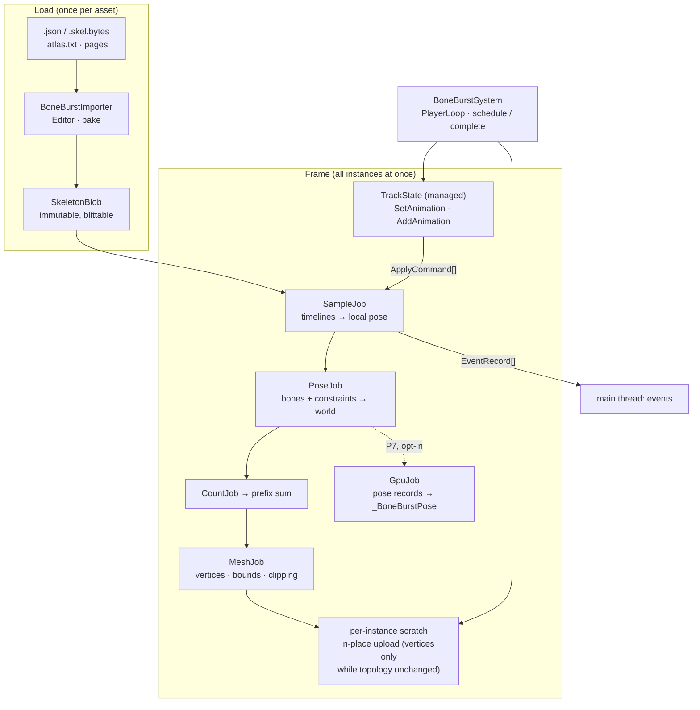
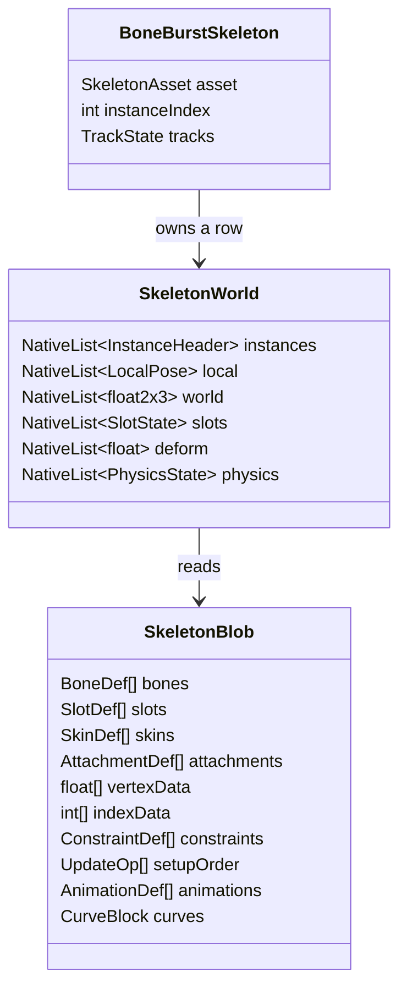
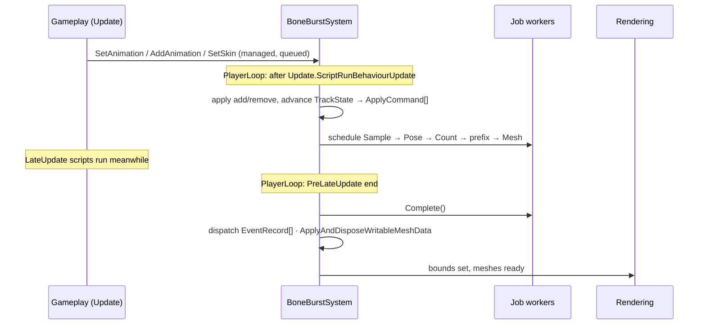
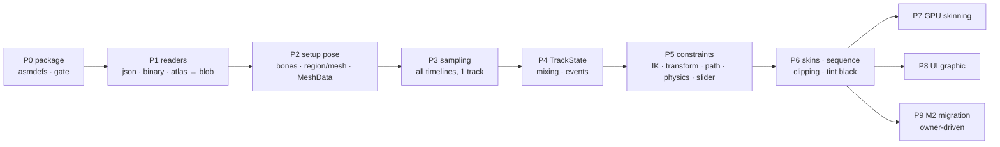
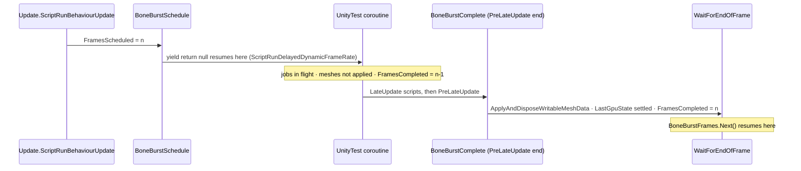

# BoneBurst — rewrite plan

**Status:** P0–P7 written and run in Unity 6000.6.3f1 on Metal (2026-09-30, in M1-Plugins-Custom and again in M0-Animation2D after the move, with identical results; [BoneBurst-TestReport.md](BoneBurst-TestReport.md)). **Current suites (recheck 2026-10-02, after the assembly split and Perf2 round 2): play 37 of 37; Editor strict 433 + 1 skipped of 434, the dedicated spine-unity suite 24 of 24; strict-float harness 215 of 215 bit for bit** (`Tools~/ParityHarness`, gated by `.claude/skills/parity-harness`). The stock-comparing suites compare within a tolerance, with lockstep. The 142 earlier Editor failures were Mono's JIT-dependent float rounding, not BoneBurst ([BoneBurst-ParityPlan.md](BoneBurst-ParityPlan.md)). Assets load from baked `.sbdata` files ([BoneBurst-BakePlan.md](BoneBurst-BakePlan.md)). Player performance, IL2CPP first, is in the dated sections of §9 and [BoneBurst-Performance.md](BoneBurst-Performance.md). Before Unity, the offline ports matched stock bit for bit: P1's readers (44 of 44 files), P3's animation (772 of 772 runs), P4's mixing (125 of 125 random scripts), P5's constraints and physics (916 of 916 runs), P6's skin scripts (240 of 240) and meshes against spine-unity's `MeshGenerator` (386 of 386 runs), and P7's GPU skinning against that CPU mesh (192 of 192 runs). **Nothing of this plan is open: P9 (M2 migration) happened on 2026-10-01 (§11), and the later work lives in its own plans** — bake, parity, improvement, AssetSystem, decouple, assembly split, and performance round 2 (closed 2026-10-02, [BoneBurst-Perf2-Plan.md](BoneBurst-Perf2-Plan.md)). Core decision: [D1-SpineRuntime-Decision.md](D1-SpineRuntime-Decision.md).

`com.module.ta-creator-boneburst` (displayName `TA Creator BoneBurst`) is a **new runtime for Spine 4.3 skeletons, written from scratch**. It is not a fork: no file from `com.esotericsoftware.spine.spine-csharp` or `…spine-unity` is copied or referenced by its runtime. It reads the same exported data (`.json` / `.skel.bytes` + `.atlas.txt` + page textures) and must produce the same poses and meshes. The difference is the architecture. It is data-oriented like Unity's `com.unity.2d.animation`: one system ticks every skeleton, the per-frame work runs in Burst jobs over flat native arrays, meshes are written straight into `Mesh.MeshData`, and unchanged or invisible skeletons cost nothing. The stock runtime stays installed and untouched. It is used as the **reference oracle** in tests, and consumers move over one prefab at a time.



---

## 1. Why a rewrite, and what "100 % new" means

**What the stock runtime costs per frame**, as measured by reading the code (see `com.esotericsoftware.spine.spine-unity/Documentation/spine-vs-2d-animation-runtime.md`):

- **Object graph.** One class per bone, two or three `BonePose` objects per bone, about 40 virtual `Timeline` classes, and an `object[]` update cache cast to `IUpdate` for each element.
- **Key search is linear from frame 0**, per timeline, every frame.
- **Each slot is walked three to four times** to build the mesh (instructions, vertices, tint black, triangles).
- **The mesh is uploaded through `mesh.vertices / uv / colors32` at full capacity**, and `sharedMesh` / `sharedMaterials` are reassigned every frame.
- **Nothing is skipped.** Off-screen skeletons rebuild meshes (`updateWhenInvisible = FullUpdate` on every M2 prefab), and threading is off by default.

**What 2D Animation does instead** (`DeformationManager`, `BaseDeformationSystem`, `SkinDeformBatchedJob<T>`, `BufferManager`):

- One manager updates every instance.
- Adding and removing instances is batched, and data is packed into dense per-instance arrays.
- Burst jobs chained with `JobHandle`s and completed once.
- Change detection skips work, and the memory the renderer reads is double-buffered.
- GPU skinning uploads bone matrices only.

Its fastest CPU path feeds `SpriteRenderer`s through **internal** engine APIs (`SetBatchDeformableBufferAndLocalAABBArray`), so that single step cannot be copied. The public equivalent for a `MeshRenderer` is `Mesh.AllocateWritableMeshData`.

**"100 % new" means:**

- **New code.** Nothing is copied or ported line by line from `spine-csharp` / `spine-unity`. Behaviour is re-derived from the data format and checked against the stock runtime in tests. That does not make it clean-room: the format docs were written from spine-csharp's source and parity is bit for bit, so BoneBurst is treated as a derivative work of the Spine Runtimes and ships under their licence ([Doc/Licence.md](../Licence.md)).
- **New data model.** Everything is blittable structs and native arrays: no `Bone`, `Slot` or `Timeline` objects.
- **New components.** `BoneBurstSkeleton` replaces the `SkeletonAnimation` + `SkeletonRenderer` pair. It does not inherit from, wrap or mimic their fields.
- **Stock Spine stays** in the project, and in M2, until the last prefab is migrated. The two runtimes run side by side.

**Non-goals for v1:**
- Editor-time scene preview beyond showing the setup pose.
- `SkeletonMecanim`: M2 drives Spine from its own logic `Animator`, not via `SkeletonMecanim`.
- `SkeletonRenderSeparator`, `SkeletonUtility` bone overrides, and `OnPostProcessVertices`-style managed vertex callbacks. M2 uses none of them (0 prefabs, 0 code hits).

---

## 2. Package layout and assemblies

Named by the M2 package rule it was designed under: folder and `name` are `com.module.<code>-<group>-<name>`, displayName `"<code> <group> <name>"`. Laid out and tiered by this project's `CLAUDE.md`: `Runtime/`, `Editor/`, `Tests/`, `Doc/` beside `package.json` (§2), assembly `Module.<Tier><Band>.<Name>` (§4).

```
Packages/com.module.ta-creator-boneburst/
  package.json
  Doc/
    Review/     BoneBurst-Plan.md (this) · D1-SpineRuntime-Decision.md
    Format/     Format-Binary.md · Format-Json-Atlas.md — the 4.3 formats as read
    Parity/     Parity.md — corpus coverage map, known differences
    CHANGELOG.md  (created with the first commit that changes code)
  Runtime/    Module.TA.BoneBurst.asmdef
    Data/       SkeletonBlob, BlobBuilder, JsonReader, BinaryReader, AtlasReader
    Anim/       TrackState, ApplyCommand, SampleJob, curve evaluation
    Pose/       PoseJob, constraint solvers (Ik, Transform, Path, Physics, Slider)
    Mesh/       CountJob, MeshJob, Clipper, SubmeshBuilder
    Gpu/        BoneBuffer, GpuSkinSystem            (Phase 7)
    Shaders/    BoneBurst-Unlit, BoneBurst-Lit2D (URP)
    BoneBurstSystem.cs, BoneBurstSkeleton.cs, BoneBurstGraphic.cs (Phase 8)
  Editor/     Module.TA.BoneBurst.Editor.asmdef — importer, inspector
  Tests/
    Editor/Parity/   Module.TA.BoneBurst.Tests.Editor.asmdef — parity (refs spine-csharp as oracle)
    Runtime/Perf/    Module.TA.BoneBurst.Tests.asmdef — play-mode perf scene
```

- **Tier `TA`.** The first caller is M2's `Module.TC.CCP.Spine2D`, and a tiered assembly can only be called from the same code or higher. `TA` ≤ `TC`, and `TA` is where M2 keeps its animation assemblies (`Module.TA.Animation.VScript`, `Module.TA.Timeline`). The runtime references only Unity packages (`Unity.Burst`, `Unity.Collections`, `Unity.Mathematics`, URP), so there are no upward edges.
- **Namespace:** `BoneBurst`.
- **Unity 6000.6 is the floor** (`"unity": "6000.6"`): no `#if UNITY_20xx` branches, no API 6000.6 deprecates.
- **Code style:** no `var`, XML doc tags on their own lines (both `CLAUDE.md`s, *Critical Code Style Rules*).
- **`allowUnsafeCode: true`** on Runtime, for `NativeCustomSlice`-style strided pointers and blob access.
- **Tests only** reference the vendor assemblies `spine-csharp` and `spine-unity`, which are untiered, so the gate is fine. The runtime never does.
- **Before landing any asmdef:** run `python3 .claude/skills/assembly-tier-check/tiercheck.py`.

---

## 3. Data model



### 3.1 `SkeletonBlob` (immutable, one per skeleton asset)

The blob is baked once into one contiguous allocation. It is addressed by offsets, so jobs read it through a single pointer.

**Bones.** `BoneDef { parent, inherit, setup: x y rotation scaleX scaleY shearX shearY, length }`, sorted parent-first.

**Slots.** `SlotDef { bone, setupColor, setupDark, setupAttachment, blend }`.

**Attachments.** Every kind is flattened:

| Kind | Stored as |
|---|---|
| Region | 4 offsets + 4 UVs per sequence frame |
| Mesh (unweighted) | `float2[]` vertices |
| Mesh (weighted) | `(count, boneIndex, x, y, weight)` streams in `vertexData`, with per-vertex start offsets so jobs can index directly (no walking from 0) |
| All meshes | triangles in `indexData`; `pageIndex` and `blend` → submesh key |
| Clipping | polygon + `endSlot` |
| Path, point, bounding box | kept for constraints and queries |

**Skins.** A `(slot, nameHash) → attachment` table, sorted for binary search. Combining skins at runtime (M2's `SpineLook` does this) builds a small per-instance override table. Blobs are never mutated.

**Constraints.** A tagged union `ConstraintDef { type, order, data offset }`.

**Update order.** `setupOrder` is the bone and constraint evaluation order as an opcode stream (`Bone i`, `Ik j`, `Physics k` …). It is rebuilt per instance only when the skin changes the active constraints.

**Animations.** Timelines are grouped **by property type**, not by object:
- Each `AnimationDef` has ranges into typed tables such as `RotateKeys`, `TranslateKeys` and `ColorKeys`. Every key is `(time, value(s), curveIndex)`, and Béziers are pre-baked into `curves`.
- The sample job therefore runs one tight loop per type, with no virtual dispatch.
- Discrete timelines are baked as index tables: attachment, draw order, event and sequence mode.

**Name maps** (bone, slot, animation, skin, event: name → index) stay on the managed side (`SkeletonAsset`). They are used by the API, never by jobs.

### 3.2 `SkeletonWorld` (mutable, one per system)

- **Rows.** One dense row range per live instance, the `InstanceHeader { blob, boneStart, slotStart, deformStart, … }`.
- **Adding and removing instances** is queued and applied once per frame, before scheduling. Rows are compacted by swap-remove, and components hold a `BoneBurstHandle` that is re-indexed when that happens. This is the `BaseDeformationSystem.BatchAdd/BatchRemove` pattern.
- **Arrays that are fully rewritten every frame** are allocated with `NativeArrayOptions.UninitializedMemory`.

---

## 4. The frame



1. **Tracks (managed, main thread, cheap).**
   - `TrackState` holds the Spine `AnimationState` semantics: tracks, queued entries, mix duration, mix-from chains, hold-previous, additive or replace, reverse, time scale, and completion or end or dispose callbacks.
   - Each frame it advances times and emits a flat `ApplyCommand { instance, animation, time, lastTime, alpha, blend, mixDirection, flags }` list. That is one command per active entry, mix-from sources included.
   - This is the only per-instance managed code in the frame. It touches no bones.
2. **`SampleJob`** (`IJobParallelFor` over instances).
   - It resets the local pose to setup, then applies that instance's commands in order.
   - Key lookup uses a **per-(instance, timeline) cursor**: start from last frame's key and move forward, falling back to binary search on seek. This replaces the linear search from frame 0.
   - Shortest-path rotation mixing keeps its per-timeline state in native memory.
   - Events that are crossed are written to a `NativeList<EventRecord>.ParallelWriter`.
3. **`PoseJob`** (`IJobParallelFor` over instances).
   - It runs the instance's opcode stream: the bone world transform for all five inherit modes, then IK, transform, path, physics and slider.
   - Physics state (`PhysicsState`: velocities and offsets per constraint) lives in the world. Physics steps on a fixed step using the frame's delta time, and a teleport or reset flag is set from the component.
   - The Transform movement for physics inheritance (position and rotation delta) is gathered on the main thread when scheduling. It is two `float3`s per instance.
4. **`CountJob` + prefix sum.**
   - This works out, per instance, the visible slots (bone active, alpha > 0, attachment present) and their vertex and index counts, plus the submesh breaks from `pageIndex` and `blend`.
   - It also computes a **topology hash** from the attachment ids and draw order. Triangles are rewritten only if the hash changed.
   - The prefix sum is one Burst `IJob`, the `FillPerSkinJobSingleThread` pattern.
5. **`MeshJob`** (`IJobParallelFor` over instances; large instances split by slot range).
   - It writes the interleaved vertex `{ float3 pos; Color32 color; float2 uv; [Color32 dark] }` straight into `Mesh.MeshData` from `Mesh.AllocateWritableMeshData(n)`, and computes bounds in the same loop.
   - Clipping runs here (Sutherland–Hodgman over the clip polygon's convex parts, plus ear-clipping when the polygon is concave). Only instances with an active clip pay for it.
6. **Complete, before rendering.**
   - There is one `Complete()`, then `Mesh.ApplyAndDisposeWritableMeshData(dataArray, meshes, flags)` with `DontRecalculateBounds | DontValidateIndices | DontNotifyMeshUsers`.
   - Local bounds are set once, and events are dispatched to C# callbacks on the main thread.
   - Each mesh is created once per instance with `MarkDynamic()`. `sharedMesh` is **not** reassigned every frame (the stock runtime double-buffers and reassigns it), and materials are only set when the submesh key list changes.

**Skipping work (from 2D Animation):**

| Condition | Skipped |
|---|---|
| Renderer not visible last frame (`isVisible`) | `CountJob` / `MeshJob`. The `CullingMode` option can also skip `PoseJob` or all of it. |
| No active track advancing and no physics (paused or static pose) | Everything; last frame's mesh stays |
| Topology hash unchanged | Index buffer and submesh setup |
| World pose bitwise equal to last frame's | `MeshJob` for that instance |

**Reading bones on the main thread** (followers, hit points, VFX sockets):
- `BoneBurstSkeleton.GetBoneWorld(int bone)` returns a `float2x3` from the world array. It triggers `Complete()` if it is called mid-frame.
- A `BoneFollower`-style component is a single `IJobParallelForTransform` that writes Transforms from bone data. It is not a per-follower `LateUpdate`.

---

## 5. Public API (v1)

It covers what M2 uses today (`SpineSkeletonAnimationHandle`, `SpineLook`), under new names:

| Need | New API |
|---|---|
| Play / queue / get track | `skeleton.Tracks.Set(track, anim, loop)` · `.Add(track, anim, loop, delay)` · `.Get(track)` → `TrackEntryHandle` |
| Mix defaults | `SkeletonAsset.MixTable` (baked) + per-entry `MixDuration` |
| Facing | `skeleton.ScaleX` / `ScaleY` |
| Skins, combined | `skeleton.SetSkins(params SkinId[])` → per-instance override table |
| Reset to setup | `skeleton.SetupPose()` / `SetupPoseSlots()` |
| Events | `skeleton.Event += (TrackEntryHandle, EventId, EventData)`, plus start / end / complete |
| Lookup by name | `asset.FindAnimation("run")` → `AnimationId` (cache it; no string lookups per frame) |

`TrackEntryHandle` is a struct `(instance, entry, generation)`. A stale handle is detected and reported loudly, never silently reused.

---

## 6. GPU skinning (Phase 7)

This follows 2D Animation's GPU path using public API only. As built (P7), the design is specified in [GpuSkinning.md](../Format/GpuSkinning.md).

- **Static mesh per topology.** A topology is which attachment each draw-order position shows, and its sequence frame. Each vertex stores its local position, or a reference into a per-blob influence buffer. The shader loops over every influence, so **nothing is trimmed** and there is no parity budget: the arithmetic is the CPU mesh's.
- **One pose record per instance** in one global `StructuredBuffer<float4>`: every bone's `(a, b, c, d)` and `(x, y)`, and every slot's vertex colour (and tint black). It is uploaded once a frame with `SetData(NativeArray)` over the range written.
- **Per-renderer offset:** `MeshRenderer.SetShaderUserValue`, read as `unity_RendererUserValue`. P7 checked on disk that URP 17.6 packs this into `UnityPerDraw`, so the SRP Batcher still batches. No `MaterialPropertyBlock` is needed.
- **Eligibility is per frame:** deform on a rendered slot, or an active clip, builds the CPU mesh for that frame. A topology change rebuilds the static mesh.
- **Shaders.** `BoneBurst/Unlit` and `BoneBurst/Lit2D` got a `BONE_BURST_GPU` keyword (`multi_compile_local`, shader model 4.5 for that variant only). They do **not** reuse `_SpriteBoneTransforms` / `SKINNED_SPRITE`, which belong to 2D Animation's global binding.
- **Runtime materials need `multi_compile`** (2026-09-29). `MaterialFor` creates materials in code, so a `shader_feature` keyword `Configure` turns on is stripped from player builds. `_TINT_BLACK_ON` is now `multi_compile_local`, and straight alpha is a branch on `_StraightAlphaInput`. See `Doc/Parity/Parity.md` "Shader keywords for runtime materials".

---

## 7. Import (Editor)

- `BoneBurstImporter` does **not** hook the `.json` / `.skel.bytes` extensions, because spine-unity's importer already owns them and both runtimes coexist. Instead, a **"Create Spine Burst Asset"** context-menu command on the stock `SkeletonDataAsset`, or on the source file, bakes a `SkeletonAsset` (ScriptableObject + blob bytes) next to it.
- **Non-destructive (`CLAUDE.md` §6).** It loads the target path as `Object` first and returns anything already there. A type mismatch is a loud error, and there is no `DeleteAsset`. **Re-bake** is a separate inspector button on the `SkeletonAsset` that overwrites only its own blob bytes.
- **No new `EditorWindow`** (§8). The importer, bake stats and parity report all live in the `SkeletonAsset` inspector.
- **Materials.** One material per (atlas page × blend mode), created once and reused if present.

---

## 8. Parity — how "same as Spine" is proved

`Module.TA.BoneBurst.Tests.Editor` loads the same file into both runtimes and steps them with identical inputs.

- **Corpus.** The skeletons in `com.esotericsoftware.spine.spine-unity/Samples~/Spine Examples/Spine Skeletons/` (JSON and binary; including `spineboy-pro`, `raptor-pro`, `stretchyman`, `celestial-circus-pro`, `snowglobe-pro`, `sack-pro`, `mix-and-match-pro`), plus M2's real characters (`NPC_G1` …) copied into test data.
- **Coverage map.** Phase 1 writes `Doc/Parity/Parity.md`, which lists which corpus file exercises which feature (IK, transform, path, physics, slider, clipping, deform, sequence, tint black, inherit modes). It is generated by scanning the files, not guessed.
- **Per test:**
  - For every animation, sample it at 60 Hz over its duration plus one loop.
  - Compare bone world `a b c d x y` (ε = 1e-4 relative), slot colour and attachment, and final vertex positions and UVs (ε = 1e-3 units).
  - Separately, run mixing scripts (set → add with mix → interrupt) and compare the same outputs.
- **Physics** is compared over a fixed-dt sequence. Any divergence is a failure, not a tolerance to widen.
- **A green result with 0 comparisons fails** (`CLAUDE.md` §9).

**Performance tests** (edit-mode plus a play-mode scene):
- N = 100 / 500 / 2000 instances of `spineboy-pro` and of `NPC_G1`, stock vs Burst.
- Report main-thread ms, worker ms and GC bytes per frame using `ProfilerRecorder`.
- Report numbers as measured. No speed-ups are claimed before these exist.

---

## 9. Phases



| Phase | Delivers | Done when |
|---|---|---|
| **P0** | `package.json` (done), four asmdefs, empty system | Tier gate: 0 cycles, 0 upward edges; compile clean via `unity command recompile_status` (fallback: last block of `Logs/Editor.log`) |
| **P1** | `SkeletonJsonReader`, `SkeletonBinaryReader` (4.3 format), `AtlasReader`, `Doc/Format/`, `Doc/Parity/Parity.md` coverage map (`BlobBuilder` moved to P2) | Every corpus file loads; bone, slot, attachment and animation counts equal to spine-csharp |
| **P2** | `BlobBuilder`, `PoseJob` (bones only), `CountJob`, `MeshJob`, `BoneBurstSystem`, `BoneBurstSkeleton`, Unlit shader | Setup pose of every corpus file matches vertex for vertex; renders in the sample scene |
| **P3** | `SampleJob`, all timeline types, key cursors | Single-track parity for every animation in the corpus (constraint-free rigs) |
| **P4** | `TrackState`, mixing, events, API from §5 | Mixing-script parity; events fire in the same order and frame as stock |
| **P5** | IK, transform, path, physics, slider solvers | Full corpus parity, physics included |
| **P6** | Combined skins, sequences, clipping, tint black, Lit2D shader, culling modes | M2 characters at parity; 2D lights work |
| **P7** | GPU skinning (§6) | Parity with the CPU mesh (no trimming, so no budget); perf numbers published |
| **P8** | `BoneBurstGraphic` for UI (`CanvasRenderer`) | Only if a consumer needs it; none does today |
| **P9** | M2 moves `Module.TC.CCP.Spine2D` over | Owner's call. The stock runtime is removed only when nothing references it. |

Each phase lands on its own, and tests plus the tier gate must be green before the next one starts.

### P0 result (2026-09-29): not verified

**What landed**
- Four asmdefs:
  - `Module.TA.BoneBurst`: refs Burst, Collections and Mathematics; `allowUnsafeCode`.
  - `.Editor`: empty until P1's importer.
  - `.Tests.Editor`: edit mode.
  - `.Tests`: play mode.
- `BoneBurstHandle`: slot plus generation, so a stale handle is detected.
- `InstanceTable`: queued add/remove applied once per frame by swap-remove, reporting each row move.
- `BoneBurstSystem`: its two PlayerLoop entries are `BoneBurstSchedule`, after `Update.ScriptRunBehaviourUpdate`, and `BoneBurstComplete`, at the end of `PreLateUpdate`. It also provides `CompleteNow()`.
  - `Install()` is idempotent.
  - The entries are removed on `Application.quitting`, which fires when leaving Play mode in the Editor.
  - Each play session is reset at `SubsystemRegistration`.
- Tests:
  - 9 edit-mode tests (`InstanceTableTests`).
  - 4 play-mode tests (`BoneBurstSystemPlayModeTests`): loop position, a single copy after a double install, every scheduled frame completes, and add/remove land on the next frame.

**Checks**
- **Tier gate** (`tiercheck.py`): BoneBurst adds 0 cycles, 0 upward edges and 0 editor-only refs. The gate still exits 1 on a pre-existing vendor edge, `PrimeTween.Tests -> PrimeTween.Editor`, which is not ours. The baseline was left alone.
- **Offline compile** with the Editor's compiler and defines, borrowed from the `Module.PC.UIEffect.Tests` response file because Unity has never built these assemblies: all three compile with 0 errors and 0 warnings.
- **Player-define compile** (runtime only, from the `20e000P.dag` response file, no `UNITY_EDITOR`): 0 errors.
- **Not run:** the 13 tests. Unity must import the package first.

**Changed from the plan**
- The system is a static class, not a MonoBehaviour. Nothing needs to live in a scene, and the PlayerLoop entries replace `DefaultExecutionOrder`.

### P1 result (2026-09-29): readers at parity, not verified in Unity

**What landed** (`Runtime/Data/`, namespace `BoneBurst.Data`)
- `SkeletonDef` and `TimelineDef`: the load-time model both readers fill.
  - Every 4.3 constraint, attachment and timeline kind.
  - Timelines keep the frame and baked-curve layout that exact sampling needs.
- `SkeletonBinaryReader`: every index is bounds-checked. Truncation, unknown tags and non-4.3 versions throw `SkeletonFormatException`; nothing returns a half-read skeleton.
- `SkeletonJsonReader` plus `JsonNode`, an order-preserving JSON parser that parses numbers straight to float32, as the stock reader does.
- `CurveBaker`: the bit-exact Bézier bake, plus the deform variant.
- `AtlasReader`.
- The format specs `Doc/Format/Format-Binary.md` and `Format-Json-Atlas.md` were written by reading the stock loaders. The readers were written from those specs only, so no stock code was copied.

**Checks**
- **Parity outside Unity.** A scratch .NET 8 harness compiled the stock spine-csharp sources beside the new readers and compared every value, floats bit for bit.
  - Result: 41 of 41 runs match, 92,424 checks, 0 failures.
  - Corpus: the 16 JSON and 3 binary samples at scales 1 and 0.37, M2's real `mix-and-match-pro.skel.bytes` (4.3.23) at 0.01, and a synthetic JSON at 1 and 0.37 that covers everything the samples miss.
  - Sanity check: changing one baking constant by 0.3 % gave 75 failures.
- **Unity tests.** The same comparison is `Tests/Editor/Parity/ReaderParityTests.cs` (41 corpus cases plus 4 guard tests), which references `spine-csharp` as the oracle. **It has not run in Unity.**
- **Offline compile** with the Editor's compiler and defines: Runtime, Tests.Editor and Tests all have 0 errors and 0 warnings. The player-define compile of Runtime also has 0 errors.
- **Tier gate:** BoneBurst adds no new edges. The only failure is still the pre-existing `PrimeTween.Tests -> PrimeTween.Editor`.
- **Style:** no `var`, and XML doc tags are on their own lines.

**Changed from the plan**
- **`BlobBuilder` moved to P2.** The blob's layout should follow the access pattern of the first job that reads it. Designing it before `PoseJob` exists would be guessing. P1 ends at the complete managed model.
- **Two format docs instead of one** `Format.md`: binary, and JSON plus atlas.
- **Two spec statements were corrected by the tests** (see `Doc/Parity/Parity.md`): JSON deform curves use the simplified deform bake, and 90° atlas regions store swapped width and height.
- **Known gap:** no binary file in the corpus has sliders, draw-order folders, clipping, two-colour slots, or the RGB, alpha, single-axis and path-spacing timelines. The binary reader's handling of these is checked only against the spec. The JSON path is covered by the synthetic file.

### P2 result (2026-09-29): setup pose on screen, not verified in Unity

**What landed**
- **`Blob/`**
  - `BlobBuilder` produces `BlobContent`: managed arrays with every attachment's atlas UVs and region offsets resolved per sequence frame at load time.
  - `SkeletonBlob` copies that content into persistent native arrays that every instance shares. Jobs read it through the blittable `BlobView`.
- **`Math/`**
  - `BoneMath`: the float32 constants, and trig evaluated in double then rounded to float, as stock does.
  - `PoseMath`: setup pose and world transforms for all five inherit modes, with stock's exact grouping of operations.
- **`Mesh/MeshBuilder`**
  - A count pass then a write pass over the draw order, following spine-unity's default path: region corner order BR, UR, BL, UL with indices 0,2,1, 2,3,1; premultiplied vertex colours, truncated to bytes.
  - Additive slots share the Normal material through vertex alpha 0, and Multiply and Screen get their own. A new submesh starts on each material change.
- **`Instance/`**
  - `InstanceData`: the native memory each instance owns. `InstanceHeader`: the fixed-size pointer header in the system's row table.
  - `ManagedPose`: the same maths run synchronously on managed arrays, used as the test reference.
- **`Jobs/`:** `PoseJob` and `MeshJob`, both `[BurstCompile(FloatMode.Strict)]`. `MeshJob` writes straight into `Mesh.MeshData` (16-bit indices up to 65,535 vertices).
- **`BoneBurstSystem`**
  - Only dirty instances are posed and meshed. All meshes are applied in one `ApplyAndDisposeWritableMeshData` call, and materials are re-assigned only when the submesh layout changes.
  - Removal defers freeing memory until no job can read it. A mesh still in flight goes to a scratch mesh.
- **`BoneBurstSkeleton`:** asset, skin, colour, flip and z-spacing; no per-frame code.
- **`BoneBurstAsset`:** skeleton file, atlas file, page textures, scale and shader, with the blob built on first use. It creates one material per page and blend mode.
- **`BoneBurst/Unlit` shader:** URP, SRP-Batcher compatible, premultiplied output, straight-alpha keyword, and linear-space vertex-colour conversion as the stock shaders do.
- **Editor:** the command **Assets › Create › BoneBurst › Skeleton Asset From Selection** finds the atlas and page textures next to the file and never overwrites.
- **Spec:** `Doc/Format/Pose-and-Mesh.md` was written clean-room from the stock sources; the code was written from it.

**Checks**
- **Scratch harness:** 122 of 122 runs match bit for bit (see `Doc/Parity/Parity.md`). The sanity checks showed it detects a swapped index and a regrouped addition.
- **Offline compile:** Runtime, Editor, Tests.Editor and Tests have 0 errors and 0 warnings. The player compile also has 0 errors.
- **Tier gate:** no new edges.
- **Style:** clean.
- **Not run:** the Unity tests, and Burst compilation itself. Burst only compiles inside the Editor.

**Changed from the plan**
- **Split `SkeletonBlob` into `BlobContent` plus `SkeletonBlob`,** so the exact maths can be tested outside Unity.
- **P2 runs in play mode only.** An Edit-mode preview can use `ManagedPose` later.
- **The sample scene is not created yet.** The Editor is closed; the creation command is ready.
- **Parsed at first use:** the asset parses its files the first time it is used, not at import. Baking the blob into the asset is a later optimisation.
- **Moved to P6:**
  - **Clipping:** skeletons with an active clipping attachment render unclipped.
  - **Tint black.**
- **Player builds:** `BoneBurstAsset.Shader` must be assigned, because `Shader.Find` is a fallback that works only in the Editor. The creation command assigns it.

### P3 result (2026-09-29): animation playback, not verified in Unity

**What landed**
- **`Anim/TimelineApply`:** every 4.3 timeline type, with the full `Timeline.Apply` parameter set (alpha, from, add, mixOut) so P4 can reuse it. It is transcribed from `Doc/Format/Timelines.md` (clean-room, written from the stock sources): shared search and curve sampling, the relative, absolute and scale combiners, colour clamping, the attachment setter's side effects, deform with its own percent curve and deform arena, sequence modes, draw order and folders, event windows with loop wrap, IK, transform, path, physics (including the all-constraints and mass round trip), and slider.
- **`Anim/TrackState`:** stock track 0 without crossfade.
  - Frame deltas accumulate into `trackTime` with the same float adds as stock.
  - Animation time and last time follow Timelines.md §5.3.
  - A mix-0 switch applies the outgoing animation once, with per-timeline Setup, First and Hold modes from property IDs.
  - Event ordering around Complete follows §5.8.
- **Blob:** animations are flattened into shared arrays. Attachment-timeline names are pre-interned as keys and resolved per instance on skin change. The blob also holds per-slot deform capacity, setup constraint poses and activation data, and per-timeline property IDs and instant flags.
- **Instance:** constraint poses and whether each constraint is active, a deform arena, resolved setup and key attachments, an event buffer (sized from the blob), the timeline modes, and two commands per frame.
- **`PoseJob`:** now sets up the pose, applies the commands, ends the apply and computes world transforms, all in one Burst job per skeleton. `MeshBuilder` reads deform.
- **System and component:**
  - Playing skeletons advance every frame and are re-meshed. Stopped ones cost nothing.
  - Events and Complete are delivered after all meshes apply, in stock order.
  - New API: `PlayAnimation`, `StopAnimation`, `AnimationName`, `TimeScale` and the `Event` callback. Initial animation and loop are serialized.
  - The event type is `BoneBurstEvent`, not `SpineEvent`, because spine-unity already defines that name and a project with both would not compile.

**Checks**
- **Scratch harness:** 708 of 708 runs match, with 5.4 million checks. P1 and P2 re-run green after this phase's changes.
- **Offline compile:** all four assemblies have 0 errors and 0 warnings; the player compile has 0 errors.
- **Tier gate:** no new edges.
- **Style:** clean.

**Changed from the plan**
- **Sampling is merged into `PoseJob`,** which saves one job per frame at the same per-skeleton granularity.
- **Crossfades go to P4, as planned.** So do queued animations. M2's `SpineSkeletonAnimationHandle` also calls `AddAnimation` and `GetTrack`, which P3's `TrackState` does not have yet: it plays one animation at a time with mix 0.

### P4 result (2026-09-29): full animation mixing, not verified in Unity

**What landed**
- **`Anim/BoneAnimationState`:** a managed port of the stock 4.3 `AnimationState` (spec `Doc/Format/AnimationState.md`, clean-room from the stock sources).
  - Track entries with every stock setting: `SetMixDuration`, `ResetRotationDirections`, `AllowImmediateQueue`.
  - `SetAnimation`, `AddAnimation` with stock's delay rule, `SetEmptyAnimation(s)`, `AddEmptyAnimation` (with its two-step clamp), `ClearTrack(s)`, `GetTrack`.
  - `Update`: delays, queue switching with carry-over, `UpdateMixingFrom` and `keepHold`, `trackEnd`.
  - `AnimationsChanged`, `ComputeHold` and `From`, with one property-ID map across all tracks and `holdMix`.
  - The listener queue, where End implies Dispose, drain is re-entrant, and listeners can be delayed or issued.
  - `BoneAnimationStateData` holds the default mix and per-pair mixes.
- **The split, main thread vs job:** `Apply` emits commands of three kinds (fast path, current slow path, mixing-out) with per-timeline modes, hold fade factors and rotation memory. The Burst `PoseJob` applies them, including `ApplyRotateTimeline` with direction memory (`TimelineApply.RotateMixed`). It reports each command's total alpha and tags every fired event with its command. `AfterApply` then copies rotation memory back, replays `QueueEvents` and `EventsReverse` in stock order, and drains the listeners.
- **Attachment epoch:** the managed state owns `unkeyedState` and advances it on every apply, as stock does. The job's end-of-apply reset runs whenever the state applied, even with no commands.
- **Component:** `BoneBurstSkeleton.AnimationState` exposes the full API and listeners. `PlayAnimation` and `StopAnimation` remain. The asset has `DefaultMix` (0.2, spine-unity's import default) and per-pair `Mixes`, shared per asset as spine-unity shares its state data.

**Checks**
- **Scratch harness:** 420 of 420 random-script runs match (see `Doc/Parity/Parity.md`). Two sanity checks confirm it can detect errors. P2 and P3 re-run green.
- **Offline compile:** all four assemblies have 0 errors and 0 warnings; the player compile has 0 errors.
- **Tier gate:** no new edges.
- **Style:** clean.

**Changed from the plan**
- **The orchestration stays managed.** It is O(entries) per frame, branchy, and owns listener callbacks. Only timeline application runs in Burst, which is where the time goes.
- **Linear mix interpolation only.** Stock's default is linear.
- **M2 migration readiness:** everything `SpineSkeletonAnimationHandle` uses (`SetAnimation`, `AddAnimation`, `GetTrack`, events) now exists. Constraint solving (P5) is still missing, and M2's `mix-and-match-pro` uses IK and transform constraints.

### P5 result (2026-09-29): constraints and physics, not verified in Unity

**What landed**
- **Specs, clean-room from the stock sources:** `Doc/Format/Constraints.md` (pose model, update cache, world update and validity flags, world→local decompose, IK, transform, slider, spine-unity's frame and physics inheritance) and `Doc/Format/Constraints-Path-Physics.md` (path and physics). New code was written only from them.
- **Pose model.** Animation writes the pose (`Local`, `Slots`, `Constraints`). Every world update copies it into the applied pose (`Applied`, `AppliedConstraints`, and `AppliedSlots`/`AppliedDrawOrder`/`AppliedDeform` only when a slider keys slots or draw order), then walks the update cache. Rendering reads the applied pose. Copying every object, not only the constrained ones, gives stock's values: an unconstrained object's applied pose *is* its pose there.
- **`Constraints/UpdateCacheBuilder`** (managed, per skin, as stock's `UpdateCache`): bones and constraints in update order, with `SortBone`/`SortReset` and each kind's sort, including path sorting over the skin, default skin and current attachment.
- **Burst solvers**, called by `SkeletonUpdate.UpdateWorldTransform(h, physics)` from `PoseJob`:
  - `BoneSolve`: the `world`/`local` validity counters, `ModifyLocal`/`ModifyWorld`/`ResetWorld`, and the world→local decompose for every inherit mode.
  - `IkSolver` (one and two bones), `TransformSolver`, `PathSolver` (all spacing, position and rotate modes; constant and setup-length paths; persistent positions buffer), `PhysicsSolver` (all four `Physics` modes; `Reset`, `Translate`, `Rotate`), `SliderSolver` (plain `Animation.Apply` onto the applied pose; `TimelineApply.ApplyAnimation`).
- **Physics state** per instance in native memory: `SkeletonState` (clock, update counter, wind, gravity) and one `PhysicsState` per constraint. Skin changes and `SetupPose` leave it alone, as stock does. The reset timeline now resets the state directly (the old `ResetCount` placeholder is gone).
- **Component:** `PhysicsTime`, `PhysicsTranslate`, `PhysicsRotate`, `ResetPhysics`; GameObject movement fed to physics each frame with spine-unity's factors and limits (`PhysicsPositionInheritance` (1, 1), `PhysicsRotationInheritance` 1, clamp-then-factor for rotation). A skeleton with active physics steps every frame, animated or not.
- **Blob:** per-constraint solver data (`ConstraintBlob`, transform From/To tables), bone lengths and children, path attachment lengths and flags, each animation's keyed bones, physics constraint list, reference scale. A slider is always source-active (its bone is checked per update), as stock.
- **Test data:** `Tests/Editor/Data~/synthetic/constraints.json`, written so every solver branch the samples miss is reached; each was confirmed by breaking that branch and watching the harness fail (`Doc/Parity/Parity.md`).

**Checks**
- **Scratch harness:** 892 of 892 runs match (see `Doc/Parity/Parity.md`, *P5 constraints*), with 32 deliberate errors, of which 30 fail the run; the 2 that pass change behaviour only at exact boundaries no run lands on. P1, P3 and P4 re-run green under P5 (P3 and P4 now run stock's full frame).
- **Offline compile:** all four assemblies 0 errors, 0 warnings; the player compile 0 errors.
- **Tier gate:** 0 cycles, no new edges (the gate's one failure is the pre-existing `PrimeTween.Tests → PrimeTween.Editor`).
- **Style:** no `var`, doc tags on their own lines.

**Changed from the plan**
- **The update cache is built managed** at skin change, not in a job: it runs only then, and needs the skin dictionaries.
- **`ManagedPose` copies instead of pinning.** Mono refuses to pin arrays whose element holds a `bool` (`bool[]`, `SlotState[]`, `PhysicsState[]`), so each call copies the instance arrays to unmanaged memory and back; the blob is copied once. The earlier pinning would have failed in the Unity edit-mode tests.
- **`PoseMath.UpdateWorld` is removed:** the world pass is now `SkeletonUpdate`, which walks the update cache.
- **Known difference:** a physics-reset timeline with the "all constraints" index inside a slider's animation throws in stock (`Constraints.md` §12 item 2); BoneBurst treats it like the other all-constraint physics timelines.
- **M2 readiness:** M2's `mix-and-match-pro` (IK and transform constraints) now matches stock on every frame, at M2's scale of 0.01. P6 (skin combining, sequences, clipping, tint black) is what remains before M2 can switch.

### P6 result (2026-09-29): skins, clipping, tint black, Lit2D, culling; not verified in Unity

**What landed**
- **Specs**, clean-room from the stock sources: `Doc/Format/Skins-TintBlack-Culling.md` (runtime skins, tint black streams and shader maths, the 2D lit shader, `updateWhenInvisible`) and `Doc/Format/Clipping.md` (both walks, triangulation and decomposition, Sutherland–Hodgman and inverse clipping, `AddSubmesh` emission).
- **Skins:** `BoneBurstSkin`, stock `Skin` with its entry-order rules (`AddSkin`, `SetAttachment`, `RemoveAttachment`, `Clear`, `Entries`); the file's skins are `SkeletonBlob.Skins` / `GetSkin`. `BoneBurstSkeleton.SetSkin(skin | name)` with stock's swap rules, `SetupPoseSlots`, `SetupPose`, `SetAttachment(slot, placeholder)`, `CurrentSkin`; the `Skin` field keeps its "restart on this skin" meaning. `SlotOps` holds the attachment setter, `SetSkin` and `SetupPoseSlots` once for the instance and the managed reference.
- **Clipping:** `Clipper` (polygon build: winding, hull, ear clipping, decompose; triangle clip and inverse clip) and `ClipMeshBuilder` (spine-unity's clipping path: instruction walk, render walk, emission), run by the mesh job twice (count, then write) only when a clip is active. Scratch memory is allocated only for skeletons with a clipping attachment.
- **Tint black:** `BoneBurstAsset.TintBlack` writes `uv2`/`uv3` on a second vertex stream (both paths' values) and turns `_TINT_BLACK_ON` on in the materials. `BoneBurst/Unlit` gained the two-colour maths.
- **`BoneBurst/Lit2D`:** a URP 2D Renderer lit shader (Universal2D pass through URP's `CombinedShapeLightShared`, a flat-normal NormalsRendering pass, and an unlit forward pass), with the same material setup, so an asset switches by assigning the shader. M2's scenes use 2D lights; its characters are unlit today.
- **Culling:** `BoneBurstSkeleton.UpdateWhenInvisible` (`Nothing`, `OnlyAnimationStatus`, `EverythingExceptMesh`, `FullUpdate`, default `FullUpdate`) with visibility from `OnBecameVisible` / `OnBecameInvisible`; invisible skeletons skip what the mode allows, posed-only rows skip the mesh job. `BoneBurstSystem.LastFramePosed` joins `LastFrameMeshed`.
- **Sequences** needed no new code; they have been at parity since P2/P3. P6 fixed their page: a sequence can span atlas pages.

**Checks**
- **Scratch harnesses:** 240 of 240 skin scripts; 386 of 386 mesh runs against spine-unity's real `MeshGenerator` compiled outside Unity (see `Doc/Parity/Parity.md`, *P6*). 10 of 14 clipper mutations fail the run; the 4 that pass sit on exact geometric boundaries no run reaches. P1, P3, P4 and P5 re-run green.
- **Bugs found and fixed on the way:** fresh slots reading attachment 0; edits to the current skin not reaching timelines; one bone world where stock keeps two (skin swaps toggling constraints); a sequence's frames on other atlas pages; the bounds centre formula.
- **Offline compile:** all four assemblies 0 errors, 0 warnings; the player compile 0 errors. **Tier gate:** no new edges. **Style:** clean.

**Changed from the plan**
- **Tint black is per asset, not per renderer.** spine-unity has a renderer flag and a material keyword that can disagree; BoneBurst's materials are per asset, so one asset flag drives both.
- **`CopySkin` is not provided.** Combining by copy makes linked-mesh copies with new identities, which the blob's index-based attachments do not model; M2 uses `AddSkin`.
- **Culling reacts one frame later than stock.** spine-unity regenerates the mesh inside `OnBecameVisible`; BoneBurst marks the skeleton dirty for the next update.
- **The Lit2D shader's unlit pass converts vertex colours to linear**, unlike stock's (which looks brighter under a non-2D renderer in a linear project, `Skins-TintBlack-Culling.md` §5 item 9).
- **M2 readiness:** everything `SpineLook` and `SpineSkeletonAnimationHandle` call now exists (`new BoneBurstSkin` + `AddSkin` + `SetSkin` + `SetupPoseSlots`, `AnimationState`, flip via `FlipX`). M2 still needs `AnimationReferenceAsset`-style references and an import path for its `SkeletonDataAsset`; that is P9.

### P7 result (2026-09-29): GPU skinning; not verified in Unity

**What landed**
- **Spec:** `Doc/Format/GpuSkinning.md`. There is no stock feature to clean-room; the reference is BoneBurst's CPU mesh.
- **Runtime:**
  - `GpuSkin` (Burst): `Classify`, `WriteRecord`, `Build` and conservative `Bounds`.
  - `BoneBurstGpu`: the two global buffers, a first-fit range allocator, uploads, and `IsSupported`.
  - `GpuJob` writes the records. `LateMeshJob` does the static-mesh rebuilds and the CPU fallbacks, at `Complete`.
  - `BoneBurstSkeleton.GpuSkinning` and `LastGpuState`, and `BoneBurstAsset.MaterialFor(…, gpu)`.
  - `BoneBurstSystem.LastFrameGpuReused`, `LastFrameGpuBuilt` and `LastFrameGpuFallback`, and the profiler markers `BoneBurst.Schedule` and `BoneBurst.Complete`.
  - `ManagedPose.GpuFrame`, the managed mirror.
- **Shaders:** `BoneBurstSkin` and the `BONE_BURST_EXTRA_ATTRIBUTES` / `BONE_BURST_VERTEX_INPUTS` macros in `BoneBurstCommon.hlsl`, and the `BONE_BURST_GPU` variant in every pass.
- **Test data:** `synthetic/gpu.json`: weight sums ≠ 1, a negative weight, far-out influences, a flipped bone, and a coloured dark tint on a rendered slot. It is added to the whole corpus.

**Checks**
- **Harness:** 192 of 192 runs bit-exact against the CPU mesh (28,800 frames, 4.9 million vertices). 17 of 17 mutations fail the run, 4 of them only after the gaps they exposed were closed.
- **Earlier harnesses with `gpu.json`:** P1 26/26, P3 788/788, P4 130/130, P5 940/940, P6 skins 90/90, P6 mesh 394/394.
- **Offline compile:** C#: all four assemblies 0 errors, 0 warnings, and the player compile 0 errors. Shaders: every pass and keyword combination through DXC against URP 17.6. **Tier gate:** no new edges. **Style:** clean.
- **Bugs found and fixed:**
  - P6's shaders did not compile in a linear project (`SRGBToLinear` undeclared; URP's `Core.hlsl` does not include `Color.hlsl`).
  - A P7 macro parameter named `color` captured `input.color`.
  - Bounds from a per-bone radius averaged 2.7× the exact area; per-bone boxes brought it to 1.17×.

**Changed from the plan**
- **No influence trimming, no "trim budget".** A per-vertex influence list in a structured buffer costs one loop and keeps the CPU mesh's arithmetic exactly.
- **Slot colours travel in the record too**, so colour and alpha animation needs no rebuild.
- **Eligibility is per frame, not per instance:** deform and clipping fall back only while present. On the corpus a quarter of frames fell back, mostly for deform.
- **Bounds are conservative** (1.17× exact on average) because a reused frame has no vertices. Stock's are exact.
- **Perf numbers are not published yet.** The explicit perf test exists, but only Unity can run it. The measured upload volume is 4× smaller than the CPU mesh's.

**Closing a phase:** update this plan's **Status** line and that phase's actual result, including anything that changed from the plan and why. `Doc/CHANGELOG.md` gets its key entry **only in the commit** that lands the phase, whether it is done or not verified, never for uncommitted work.

### Shader keyword fix (2026-09-29): verified in Unity on Metal

- **Problem.** `_TINT_BLACK_ON` and `_STRAIGHT_ALPHA_INPUT` were `shader_feature_local`, but every BoneBurst material is created at runtime. A player build would have kept only the keywords-off variant: no tint black, and straight-alpha pages not premultiplied.
- **Options weighed.**
  - A: `multi_compile_local` for both keywords, 156 variants per API.
  - B: a ShaderVariantCollection or Always Included entry. Rejected: that setting lives in each consumer's Graphics Settings, not in the package, and forgetting it fails silently.
  - As built, A′: `_TINT_BLACK_ON` as `multi_compile_local`, and straight alpha as a uniform branch on `_StraightAlphaInput`, 80 variants per API.
- **Changed:** `BoneBurst-Unlit.shader`, `BoneBurst-Lit2D.shader`, `BoneBurstCommon.hlsl` (`BoneBurstStraightAlpha`), `BoneBurstUnlitPass.hlsl`, `BoneBurstLit2DPass.hlsl`, `BoneBurstMaterials.Configure`.
- **Checks:** `KeywordVariantComparisonTests`, 21 of 21 in Unity 6000.6.3f1 on Metal.
  - Pixels: new equals the old keyword variant exactly.
  - Timing: new/old 0.98–1.04 on GPU-bound samples.
  - Offline: 536 of 536 variants compile with DXC.
  - Details in `Doc/Parity/Parity.md`.
- **Not yet:** a real player build.
- **Test fixture:** `Tests/Editor/Render/LegacyShaders/` keeps the old shaders only for that test. Delete the folder together with the test once the comparison is no longer wanted.

### First run in a scene (2026-09-29): setup-pose bug fixed

- **Symptom.** In the new host-project scene `Assets/Scenes/BoneBurstDemo.unity`, skeletons enabled in Play mode drew nothing: every bone's local scale was 0, so the mesh collapsed. `SetupPose()` or re-enabling after one fixed it.
- **Cause.** `OnEnable` calls `ApplySkin`, whose `MarkDirty` queues the owner in `s_Dirty` (a `List`). `BoneBurstSystem.Add` then queued it a second time without checking. In `Schedule`, the first entry consumed `PendingFlags` (including `NeedsSetupPose`), and the second rewrote the header with no flags, so `PoseJob` never ran the setup pose. The same instance was also posed and meshed twice in that frame.
- **Fix.** `Add` goes through `MarkDirty`, which queues an owner only once (`BoneBurstSystem.cs`).
- **Evidence.**
  - The scene: all three skeletons animate. The GPU-skinned idle is `Reused` every frame with `BONE_BURST_GPU` on. The Lit2D walk shows tint black under a point light.
  - The play-mode suite, before the fix: `Raptor_Walk…`, `CelestialCircus_Physics…` and `Spineboy_BurstMeshMatchesManagedReference` failed with "meshed every frame: expected 1, was 2". With the fix those assertions pass.
- **Still failing: 11 of 19 play-mode tests, the same count before and after the fix.** They fail later on, mostly with "vertex count 0" or a `GpuJob` safety exception. The likely cause is test timing: a `UnityTest` resumes after `yield return null` in Update, before `BoneBurst.Complete` applies meshes in `PreLateUpdate`. That was not verified. *Verified and fixed in the next section: 19 of 19 pass.*
- **Demo scene** (host project, not the package): `Assets/Scenes/BoneBurstDemo.unity` and `Assets/BoneBurstDemo/spineboy-pro/`. It holds a copy of the spine-unity sample and the two `BoneBurstAsset`s (Unlit, and Lit2D with tint black). *Since bake plan B5 (2026-09-30): the export stays in `spineboy-pro/`, and the two assets and the baked data are in `Assets/BoneBurstDemo/spineboy-pro_BoneBurst/`.*

### Play-mode suite green (2026-09-29): test timing, and one accessor race

**Result: `Module.TA.BoneBurst.Tests` passes 19 of 19 in PlayMode** (Unity 6000.6.3f1, Metal, Editor open). Before, 11 of 19 failed.



- **Cause (measured).** A temporary test logged `Time.frameCount`, `FramesScheduled` and `FramesCompleted` at each resume. After `yield return null`: frame 83, scheduled 83, completed 82. After a following `WaitForEndOfFrame`: frame 83, scheduled 83, completed 83. Three frames in a row gave the same pattern. So the tests read each frame between Schedule and Complete: the mesh was last frame's (`vertex count 0` on the first frame), no tint-black streams yet, the GPU state was the job's transient `NeedsBuild`/`NeedsCpu`, and `BoneBurstGpu.PoseData` was still being written by `GpuJob` (the safety exception).
- **Test fix.** `Tests/Runtime/Core/BoneBurstFrames.cs`: `Next()` yields `null` then `WaitForEndOfFrame`, and asserts `FramesScheduled == FramesCompleted`, so a wrong phase fails loudly. Every `yield return null` in `Tests/Runtime/Pose/*` and `Tests/Runtime/Anim/*` is now `yield return BoneBurstFrames.Next()`. Each call still advances exactly one frame, and changes made after it are still picked up by the next Schedule. `Tests/Runtime/Core` and `Perf` read only Schedule-time counters, and are unchanged.
- **Runtime fix: `BoneBurstSkeleton.LastGpuState`.** The public getter read `Data.Output[0].Gpu` through the raw pointer that `GpuJob` and `LateMeshJob` write. The safety system cannot see that pointer. Read from a `LateUpdate`, it raced the job and could return `NeedsBuild` or `NeedsCpu`, which are not paths a mesh takes. It now returns a field cached in `ApplyMeshOutput` (after Complete), and `Detach` resets it. The rest of the frame is unchanged. The other job-written reads (`Mesh`, `PoseData`) are either managed after Complete or internal to tests.
- **Physics measure.** `CelestialCircus_Physics_BurstMatchesManagedEveryFrame` logged a largest Burst against managed vertex difference of **4.23e-6** over 120 frames (tolerance 1e-4).
- **Not green: the Editor suite.** `Module.TA.BoneBurst.Tests.Editor` gives 127 of 269 passing. The failures are `SetupPoseParityTests`, `SkinParityTests` and others: "bone … world differs" between `ManagedPose` and stock spine-csharp. None of that code touches `BoneBurstSkeleton`. The working tree's spine-csharp edits are access modifiers only. Not investigated here.

### BoneBenchmark: first player numbers against stock (2026-09-30)

`Assets/BoneBenchmark` (host project) runs stock spine-unity and BoneBurst on the same spineboy-pro export, grid, camera and seeded start times. Everything is on screen, with `FullUpdate` on both sides and vSync off. Each configuration gets its own scene load, and the runtimes run in ABBA order over 2 repeats with 600 measured frames each.
- **Build:** `Tools › BoneBenchmark › Build Player (Release)`. Run the player with `-boneBench`.
- **Compare:** `Assets/BoneBenchmark/compare.py`.
- **Raw results:** `Assets/BoneBenchmark/Results/2026-09-30_macOS-Metal_release_summary.csv`, a macOS release player on Metal, 18 cores, 1920×1080.

Median frame time in ms, with the ratio against stock (lower is better):

| Animation × count | Stock | Stock threaded | BoneBurst CPU | BoneBurst GPU |
|---|---|---|---|---|
| idle × 500 | 7.85 | 2.16 (×0.27) | 3.04 (×0.39) | **1.31 (×0.17)** |
| idle × 2000 | 31.45 | 8.65 (×0.28) | 13.85 (×0.44) | **5.55 (×0.18)** |
| walk × 500 | 9.21 | **2.54 (×0.28)** | 3.25 (×0.35) | 3.50 (×0.38) |
| walk × 2000 | 36.10 | **8.96 (×0.25)** | 13.65 (×0.38) | 13.91 (×0.39) |

- **Main thread: BoneBurst is cheapest in every configuration.** At 2000 skeletons: CPU 6.3 ms and GPU 5.5 ms, against stock threaded at 8.5–8.9 ms and stock at 31–36 ms.
- **BoneBurst's CPU mesh is bound by the render thread, not the main thread.** At 2000 skeletons the render thread takes 10.4 ms, against stock's 6.2–6.9 ms, so frame time trails stock threaded. The mesh upload is the likely cost (`Mesh.MeshDataArray` apply), but that was not profiled.
- **GPU skinning removes that cost.** Render thread 1.1 ms against 10.4 ms, and the best frame time overall, when the animation has no deform.
- **`walk` deforms meshes, so BoneBurst GPU falls back to the CPU mesh every frame** (`GpuSkinning.md` §1). It gains nothing there.
- **GPU time is equal on all four runtimes** at 500 and 2000 skeletons (about 1.1 and 1.9 ms); only the draw side differs.
- **Not measured:** worker-thread job time and GC per frame. The release player records neither; use the Development + Profiler build.
- **Next lead:** BoneBurst CPU's render-thread cost. Profile a Development build at 2000 skeletons.

### Name keys (2026-09-30): baked string → int per skeleton

`BoneBurstKeys` is a ScriptableObject baked from a **JSON-only** export. It holds animation, skin, event, slot and bone names as `BoneBurstKey`, whose id is the same `PropertyName` hash as M2's `ModuleP1.PropertyString`. Every id is unique per skeleton: a taken id gets `(A)`, `(B)`, `(C)` … appended. `BoneBurstAsset.Keys` links the table to a skeleton, and `PlayAnimation(int / key)` and `SetSkin(int / key)` accept it. The spec is [NameKeys.md](../Format/NameKeys.md).
- **Why a BoneBurst key instead of `PropertyString` itself:** that type lives in M2-Creator-All (`Module.PB.Common`), which this repo cannot reference. The ids are identical.
- **Checks:** 15 of 15 EditMode tests. In Play mode in the demo scene, keys switch animations and a wrong-kind key is refused.
- **Superseded (bake plan B3, 2026-09-30):** the `BoneBurstKeys` asset and its baker are gone; the keys are baked into the skeleton's `.sbdata` and read as `BoneBurstAsset.Keys` ([BoneBurst-BakePlan.md](BoneBurst-BakePlan.md)).

### Mesh upload fix (2026-09-30): render thread from 10.4 to about 6 ms

- **Profile.** A Development player with `-profileTo` captured exactly the 200 measured frames, BurstCpu against StockThreaded at idle × 2000.
  - Render thread `RenderLoop` self time: 12.5 ms against 7.6 ms.
  - Main thread waiting on the render thread: 7.1 ms against 0.8 ms.
  - Main thread `Mesh.SetVertexBufferParams` + `SetIndexBufferParams`: about 0.33 ms.
- **Cause.** `MeshJob` wrote every dirty mesh into a fresh `Mesh.MeshData`, and one `ApplyAndDisposeWritableMeshData` re-declared every mesh's layout, indices and submeshes each frame. The render thread then replaced 2000 meshes' GPU buffers per frame, where stock uploads into existing buffers.
- **Fix.**
  - `MeshJob.BuildScratch` writes into persistent per-instance lists (`InstanceData.CpuVertices`, `CpuTint`, `CpuIndices16/32`) and hashes the topology: counts, index format, tint stream, submesh ends and keys, every index.
  - `BoneBurstSkeleton.UploadCpuMesh` uploads vertices only (`SetVertexBufferData`) while `MeshOutput.Topology` is unchanged. It declares layout, indices and submeshes only when the topology changed.
  - `GpuJob` clears the topology on GPU frames. `CompleteGpu` sends CPU fallbacks through `MeshJob` and `UploadCpuMesh`, and keeps `LateMeshJob` for static-mesh rebuilds only.
- **A bug found on the way.** `Detach` left the owner in `s_Dirty` while clearing its flags, so disable → enable in one frame queued it twice and it was posed and meshed twice. `Detach` now takes it out of the queue (`BoneBurstSystem.Unqueue`), and `Schedule` skips an entry whose flags were already taken.
- **Result** (release player, 48 runs; `Assets/BoneBenchmark/README.md`):
  - BurstCpu at 2000 skeletons: idle 13.85 → 8.15 ms, walk 13.65 → 7.74 ms. It now matches or beats StockThreaded (8.11 / 8.35) in every configuration.
  - BurstGpu walk × 2000: 13.91 → 8.35 ms.
  - The per-skeleton upload moved about 0.8 ms onto the main thread at 2000 skeletons.
- **Checks.**
  - Play-mode suite 19 of 19, including the mesh-parity, tint-black and GPU-fallback tests.
  - `GpuSkinningParityTests` 23 of 24, `MeshGeneratorParityTests` 3 of 24, `SetupPoseParityTests` 0 of 45, and 8 `SkinParityTests` failures: identical with the fix stashed. They predate it and are being checked separately; the uncommitted Spine edits are ruled out (identical without them in M0-Animation2D).

### IL2CPP benchmark (2026-09-30): the primary target

These are from a macOS IL2CPP release player, same code and content as the Mono run: 48 runs. The raw data is `Assets/BoneBenchmark/Results/2026-09-30_macOS-Metal_release_IL2CPP_summary.csv`.
- **Frame time at 2000 skeletons:**

  | | Stock | StockThreaded | BoneBurst CPU | BoneBurst GPU |
  |---|---|---|---|---|
  | idle | 17.05 ms | 10.18 ms | **8.05 ms** | **3.45 ms** |
  | walk | 19.85 ms | 10.25 ms | **8.05 ms** | 8.44 ms |

  BoneBurst is faster than both stock runtimes in every configuration.
- **Against Mono:** single-threaded stock −41%, threaded stock +25% (not profiled), BoneBurst CPU unchanged (Burst either way, and render-thread bound), BoneBurst GPU idle −2 ms (the managed animation-state update).
- **Owner's direction (2026-09-30):** keep both paths. Skeletons with little animation go GPU; main characters stay on the CPU mesh. Mesh deform on the GPU and the per-frame garbage are not pursued.

### IL2CPP improvements (2026-09-30): per-instance C# work, then CPU vertex fetch

1. **Per-instance managed work (item 2).**
   - An IL2CPP Development profile at 2000 skeletons put 2.4 ms in BoneBurst's managed per-instance loops. New markers split it: `BoneBurst.Advance`, `BoneBurst.Headers`, `BoneBurst.ApplyMeshes` and `BoneBurst.Events`.
   - Development builds run every native-array access through safety checks. A release A/B (3 alternating runs per side) showed no measurable change from trimming it: BurstGpu 3.81 → 3.81 ms, BurstCpu 8.39 → 8.50 ms, within noise.
   - Kept: the markers, the color space read once per frame (`BoneBurstSystem.LinearColorSpace`), and `AfterApply` skipping the event scan when nothing fired. Reverted: skipping unchanged `Mesh.bounds`, which added state for no gain.
2. **CPU skinning, GPU vertex fetch (item 1).** Specified in [CpuVertexFetch.md](../Format/CpuVertexFetch.md).
   - CPU-meshed instances write their vertices into one shared list (`BoneBurstFetch`), uploaded with one `SetData`. The `BONE_BURST_FETCH` shader variant reads them at `unity_RendererUserValue + SV_VertexID`, and each `Mesh` keeps only its topology.
   - `BONE_BURST_GPU` and `BONE_BURST_FETCH` share one keyword set, so variants go 80 → 120 per graphics API.
   - The path is on wherever GPU skinning is supported; `BoneBurstFetch.Enabled = false` turns it off.
   - **Result** (IL2CPP release, 48 runs; `Assets/BoneBenchmark/README.md`), BurstCpu at 2000 skeletons:
     - idle 8.05 → 4.95 ms, walk 8.05 → 5.05 ms, render thread 6.3 → 0.8 ms;
     - against StockThreaded's 9.95 / 10.22 ms.
     - With deform, BurstCpu is now the fastest runtime.
   - **Open:** at 100 skeletons, BurstCpu frame time is bimodal (0.30 or 0.67 ms per run, 0.30 before), while every measured thread is at or below before; the cause is not established.
   - **Checks:**
     - `VertexFetchPlayModeTests`, 8 of 8 from a cold shader cache: fetch draws pixel-identically to the per-mesh upload (spineboy-pro and synthetic `gpu.json`, both shaders, tint black on and off).
     - The play-mode suite, 27 of 27. Its mesh-parity tests now read vertices through `BoneBurstSkeleton.GetCpuVertices`, so they check the fetched data.
     - Offline: 804 of 804 shader variants compile with DXC.
     - `KeywordVariantComparisonTests` 21 of 21, now also guarding `BONE_BURST_FETCH` as `multi_compile`.
   - **Measurement note:** a stray Development player from a botched profiling loop ran at 235% CPU from about 08:56 to 09:25. The first vertex-fetch run and the item-2 A/B ran beside it; the A/B had both sides equally loaded. The vertex-fetch numbers above are from a re-run after it was killed.

### Fetch round two (2026-09-30): GPU fallback through fetch, upload off the main thread

- **Profile** (IL2CPP Development, 2000 skeletons, after vertex fetch):
  - BurstCpu is main-thread bound.
  - `BoneBurst.FetchUpload` (the `SetData` of 13 MB) took 0.87 ms.
  - BurstGpu with `walk` fell back to the per-mesh upload every frame: 3.5 ms of `Mesh.SetVertexBufferData` and an 11.5 ms render thread.
- **1. GPU fallback through fetch.** A GPU-skinned instance that has fallen back once keeps a fetch range. `Schedule` points its header there, and `Complete` uploads fetch after `CompleteGpu`.
- **2. Upload off the main thread.** A ring of three `LockBufferForWrite` buffers, filled by a parallel Burst `CopyJob` scheduled after the mesh job, replaces the main-thread `SetData`. Late ranges (fallbacks) are copied at `EndFrame`. See [CpuVertexFetch.md](../Format/CpuVertexFetch.md) §2.
- **Result** (IL2CPP release):

  | 2000 skeletons, alternating A/B, 3 rounds | Before | After |
  |---|---|---|
  | BurstCpu idle | 4.71 ms | 3.61 ms |
  | BurstCpu walk | 4.91 ms | 3.70 ms |
  | BurstGpu walk | 8.69 ms | 4.71 ms |
  | BurstGpu idle | 3.41 ms | 3.50 ms (noise) |

  - Full suite at 2000: BurstCpu 3.56 idle / 3.80 walk, against StockThreaded 9.90 / 10.30 and BurstGpu 3.89 / 4.75. **The CPU mesh is now the fastest BoneBurst path even without deform.**
  - The 100-skeleton bimodal frame time did not appear in any of these runs.
- **Checks:**
  - Play-mode suite 29 of 29.
  - `VertexFetchPlayModeTests` 10 of 10, including a still skeleton after nine ring rotations and a GPU fallback, all pixel-identical to the upload.
  - A copy-nothing mutation fails 9 of 10.

### Animation changes and the next plan (2026-09-30)

**The benchmark gained a `switch` mode.** Every skeleton changes animation every 0.5–1.5 s among idle, walk, run, shoot and jump, crossfading by the asset's 0.2 s mix on both runtimes. The per-skeleton sequence is seeded and identical on every runtime. `BoneBurstSystem.LastFrameTopologyChanges` and the `BoneBurst.SetTopology` marker count CPU meshes whose layout was re-declared; the count is also the benchmark's `burst_topology` column, which works in release players.

**Result** (IL2CPP release, 72 runs, `Assets/BoneBenchmark/Results/2026-09-30_macOS-Metal_release_IL2CPP_switch_summary.csv`). Frame time at 2000 skeletons, in ms:

| | Stock | StockThreaded | BurstCpu | BurstGpu |
|---|---|---|---|---|
| idle | 17.19 | 10.55 | **3.90** | 4.10 |
| walk | 20.44 | 11.13 | **4.00** | 4.90 |
| switch | 22.05 | 13.39 | **5.01** | 6.06 |
| switch − idle | +4.9 | +2.8 | +1.1 | +2.0 |

A first attempt ran beside an M2-Creator-All IL2CPP build from another session (load average 125); it was discarded and re-run once the build had finished.

**Where switching costs** (IL2CPP Development profile, 2000 skeletons, BurstCpu switch against idle):
- **Topology changes are cheap.** 31 per frame (p95 43; 0 idle). They take 0.04 ms of main thread, plus about 0.45 ms of render thread (`Gfx.InitializeBuffer`), which is not the bottleneck.
- **The extra cost is the managed animation state:**
  - `BoneBurst.Advance` 0.40 → 0.77 ms
  - `Headers` 0.55 → 0.65 ms
  - `Events` 0.40 → 0.52 ms
  - `PoseJob` on the workers +0.9 ms in total, spread across threads, because two animations mix during a crossfade.
- **The per-instance managed floor dominates in every scenario.** `Advance` + `Headers` + `Events` + `ApplyCpuMeshes` come to about 2.2 ms idle and 2.9 ms switch, of 4.3 / 5.4 ms (Development builds inflate these).
- **BurstGpu switch:** walk and run deform, so those instances fall back. Their late fetch copy runs on the main thread at `EndFrame` (0.34 ms).

**Next plan, in order:**

| # | Item | Size | Expected | Notes |
|---|---|---|---|---|
| 1 | Get the Editor parity suites green (Animation, Mixing, SetupPose, Skin, MeshGenerator) | – | A safety net for 2 | **Prerequisite.** They fail identically with and without every change of 2026-09-30; they are being investigated separately (not the uncommitted Spine edits: identical without them in M0-Animation2D). |
| 2 | Animation-state bookkeeping in Burst: advance, command lists, `AfterApply` (total alpha, rotation carry, event and completion queues) run natively in the jobs; managed only for instances that fired an event or completed | Large | Most of the ~1.5–2 ms (Development) per-instance floor, in both paths; more under animation changes | Mixing is where behaviour drifts. Only with 1 green, measured in release. |
| 3 | Bounds with a margin: set `Mesh.bounds` with headroom and re-set only when the exact bounds leave it | Small | Part of `ApplyCpuMeshes` (0.8 ms Development) | Looser culling. Release A/B before keeping: the last micro-trim (item 2 of 2026-09-30) measured nothing. |
| 4 | GPU fallback's late fetch copy in a job instead of on the main thread | Small | ~0.3 ms (Development) for GPU skeletons switching into deforming animations | Low priority under the owner's split (GPU for lightly animated skeletons). |
| – | Topology rebuilds | – | – | No action: measured cheap. |

Also this round: `BoneBurstSkeleton.PlayAnimation`'s doc said "without a crossfade", but it crossfades by the asset's mix, as `SetAnimation` always did. The doc is corrected.

### Items 3 and 4 done (2026-09-30): bounds with a margin, GPU fallback copy in a job

- **3. Bounds with a margin** (`BoneBurstSkeleton.ApplyBounds`):
  - `Mesh.bounds` is set 10% larger than the exact bounds (plus 2% of the larger extent on x and y).
  - It is left alone while the exact bounds stay inside and the set bounds are no more than 1.5× (+5%) the exact extents.
  - It is always re-set for a new `Mesh`, after a topology change, and after a GPU static-mesh rebuild.
  - `Bounds_ContainThePoseEveryFrame` (both paths, 60 frames): the bounds contain the pose every frame and stay within the limit. The native call is skipped on 52 of 60 frames walking (CPU) and 60 of 60 idle (GPU).
- **4. GPU fallback's late copy in a job** (`BoneBurstFetch.ScheduleLate`):
  - The fallbacks' whole fetch ranges are copied into the locked ring buffer by a parallel `RangeCopyJob` after their mesh job, instead of by `MemCpy` in `EndFrame` on the main thread.
  - `GpuFallback_BoundBufferHoldsThisFramesVertices` reads the bound ring buffer back while a GPU skeleton walks (moving pose, falling back every frame) and compares it with this frame's vertices. With the late copy disabled, all 275 vertices are one frame stale and the test fails. The earlier frozen-pose fallback test could not see that.
- **Result** (IL2CPP release, alternating A/B, 3 rounds, 2000 skeletons):

  | | Before | After |
  |---|---|---|
  | BurstCpu idle | 3.66 ms | **3.00 ms** |
  | BurstCpu switch | 4.60 ms | **4.12 ms** |
  | BurstGpu idle | 3.61 ms | **2.90 ms** |
  | BurstGpu switch | 5.70 ms | **4.99 ms** |

  - The gain is item 3: GPU idle, with no fallbacks, gained the same 0.7 ms as GPU switch, so item 4 adds nothing measurable in release. It is kept because it is verified and moves work off the main thread.
  - The per-skeleton `Mesh.bounds` call cost more in release than the Development profile suggested.
- **Checks:** play-mode suite 32 of 32.
- **Not yet:** a clean full-suite run. Two attempts overlapped M2-Creator-All IL2CPP builds from another session (load average up to 125) and were discarded; the A/B above ran interleaved, so both sides saw the same load.

---

## 10. Risks

- **Behavioural drift.** AnimationState mixing and physics are where the stock runtime's behaviour is subtle. §8 exists to catch drift. If a subtle rule cannot be matched, that is written down in `Doc/Parity/Parity.md` as a known difference, never tuned until it happens to pass.
- **Format churn.** The Spine 4.3 binary format can change between Spine Editor minors. `BinaryReader` checks the version string and refuses loudly on anything it was not written for.
- **Scope.** The stock C# core is about 17 800 lines (`spine-csharp`). A parity-complete rewrite is comparable work, so the phases are ordered to deliver something usable for M2 by P6.
- **Licence.** Decided 2026-10-01: a derivative work of the Spine Runtimes, distributed under the Spine Runtimes License (`LICENSE`; [Doc/Licence.md](../Licence.md)). The owner's items: editor licences per developer and tier, and the licence notice in any shipped game.

---

## 11. Consumers today

**Two systems, one duty** was the rule until P9 (the owner decided on 2026-09-29 that BoneBurst is the core, recorded in [D1-SpineRuntime-Decision.md](D1-SpineRuntime-Decision.md)); there was never an adapter that kept both alive.

**P9 happened on 2026-10-01.** M2-Creator-All's `Module.TC.CCP.Spine2D` (`SpineSkeletonAnimationHandle`, `SpineLook`) runs on BoneBurst, and M2 removed the stock Spine packages the same day (its `com.module.tc-creator-charactercontroller/Doc/Review/BoneBurst-Migration-Plan.md`). **Two projects take this package by `file:` path** (checked 2026-10-02; this project's own consumer list is `CLAUDE.md` §1): M2-Creator-All, and M2-Sample-25DL-Shader through M2's CCP package. The stock spine-unity runtime stays in this project only as the parity reference and the benchmark's stock side (§1).

**Separate finding in M2 (recorded 2026-09-30, before M2 removed the stock packages; owner to re-check):** `_Res PFB/_Pfb_0/0 Special/House TD_3 (02).prefab` and `Spine GameObject (twitch-sunflower).prefab` still carried the pre-4.3 single `SkeletonAnimation` with no `SkeletonRenderer` then. They were never re-saved after the split, so they rendered only through the Editor-time auto-upgrade, and not in a player build. Whether M2's stock removal has since forced them to be re-authored has not been verified from here.
