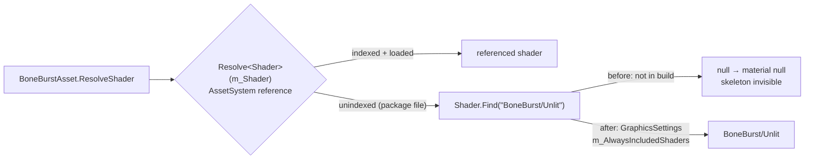
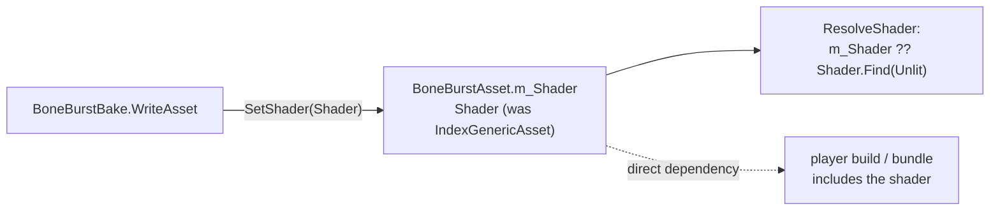

# BoneBurst shaders in players — plan

**Status: done for M0, 2026-10-05.** Steps 1–3 done (results below). Left: step 4 (the consumers' own
`GraphicsSettings`). Lit2D gap: owner chose **option (c)**, a plain `Shader` reference. c1–c4 and c6 done.
**c5 (a Lit2D asset in a player) not run.** M0 has no Lit2D `BoneBurstAsset` left: the demo's was deleted by the
uncommitted move to `Assets/Samples Custom/`.

Owner's choice: "fix shader with Always Included Shaders". Found by
[BoneBurst-Perf3-Plan.md](BoneBurst-Perf3-Plan.md) §2.1. A release player drew no BoneBurst skeleton, logging
`shader BoneBurst/Unlit not found` once per material build.

The fix is project-wide: `ProjectSettings/GraphicsSettings.asset`, the same in each consumer project. It lives in the
BoneBurst package because the shaders and `BoneBurstAsset.ResolveShader` are BoneBurst's.

## Cause

*   `BoneBurstAsset.m_Shader` is an `IndexGenericAsset`. The shaders are package files, so they are not addressable,
    and the reference stays unindexed (`CLAUDE.md` §11). In a player it resolves to nothing.
*   The fallback `Shader.Find("BoneBurst/Unlit")` finds a shader only when the build includes it. Nothing in M0's
    build referenced it.
*   The rename's player check ran `-loadBench` only, which builds no material, so the failure went unseen.

## Steps

| # | Step | Guard |
|---|---|---|
| 1 | Add `BoneBurst/Unlit` and `BoneBurst/Lit2D` to *Always Included Shaders*, through the live Editor (`SerializedObject` on `GraphicsSettings`, then save that one asset). Never by hand-editing the YAML. | `GraphicsSettings.asset` on disk lists both GUIDs: `3859812a…` (Unlit) and `01d0aae5…` (Lit2D). |
| 2 | Build Addressables content and a new IL2CPP release benchmark player. Run one frame-run configuration per BoneBurst runtime. | The player log has no `not found`. BoneBurst's `gpu_ms` rises to stock's level, since it now draws. |
| 3 | Re-run C0 (Perf3 plan) with that player. | Perf3 plan §2.1 is replaced. |
| 4 | Consumers: M2-Creator-All and M2-Sample-25DL-Shader need the same two entries in their own `GraphicsSettings.asset`. | Owner's call: their Editors are not driven from here. |

## Results (2026-10-05)

1.  **Done, with a detour.** `SerializedObject` added both shaders in memory. Neither `SaveAssetIfDirty` nor
    `InternalEditorUtility.SaveToSerializedFileAndForget` writes a project-settings file: the second refuses with "You
    may not pass in objects that are already persistent". `AssetDatabase.SaveAssets` was not used, because it writes
    every dirty asset. The player build saves Project Settings itself and persisted the change. The disk diff is
    exactly two lines in `m_AlwaysIncludedShaders`: `{fileID: 4800000, guid: 3859812a…}` and `{… 01d0aae5…}`.
2.  **Done.** `BuildPlayerContent` ran in 11.3 s, then `Build/macOS_BoneBenchmark_IL2CPP_2/` (IL2CPP release,
    1,578 MB). Frame runs at 20 × walk (BurstCpu, BurstGpu, Stock): **0 `not found`, 0 errors** in each log. BurstCpu's
    `gpu_ms` went from about 0.065 ms (drawing nothing) to 0.19 ms (Stock 0.17). That GPU time shows it now draws.
    Not checked by eye (`CLAUDE.md`: no screen capture).
3.  **Done.** C0 re-ran twice with this player (Perf3 plan §2.1).

## Known gap: Lit2D in players

The fallback is always **Unlit**. A `BoneBurstAsset` whose reference names `BoneBurst/Lit2D` still resolves to nothing
in a player, so it draws **unlit**: visible, but without 2D lights or rim. Always Included makes Lit2D *available*;
`ResolveShader` does not know to ask for it. Closing this needs a change to `BoneBurstAsset`, which is a question for
the owner and not part of this plan's steps:

*   **(a)** Index the shader reference. That is the AssetSystem route, which was declined here.
*   **(b)** The fallback asks `Shader.Find` by the referenced shader's name. That needs the name in the asset: a second
    copy of a fact (§4).
*   **(c)** `m_Shader` becomes a plain `Shader` reference. This is a serialized type change (§7: read the old values
    first), and a direct reference also includes the shader in the build on its own.

## Cost

Always Included compiles **every** variant of both shaders into every player: 804 variants by DXC, the Perf2
guards' count. Expect a longer first build and a larger player. Stripping is unchanged, since the BoneBurst keywords
are `multi_compile` (§7).

## Option (c) — steps (owner, 2026-10-05: "fix Lit2D with option c")

**Data first (§7).** Every `BoneBurstAsset` on disk references `BoneBurst/Unlit` (`3859812a…`), checked 2026-10-05:
M0 `Assets/Samples Custom/BoneBurstDemo/mix-and-match-pro_BoneBurst/mix-and-match-pro_BoneBurst.asset`, and one
`mix-and-match-pro_SpineBurst.asset` each in M2-Creator-All, M2-Creator-All-2 and M2-Sample-25DL-Shader. The old
struct loads as a null `Shader`, and null already means Unlit, so **no asset changes its look**. M0's asset is written
back with an explicit Unlit reference. The consumers' assets stay as they are until a rebake or a save. No migration
tool (§3).

| # | Step | Guard |
|---|---|---|
| c1 | `BoneBurstAsset`: `m_Shader` becomes `Shader`, `Shader` property, `SetShader(Shader)`. Delete `ShaderReference`, `m_InMemoryShader` / `SetShaderAsset`, `m_ShaderHandle`, `RequestShader` / `LoadShader` / `ShaderLoaded` / `ApplyShader`. `ResolveShader` becomes `m_Shader ?? Shader.Find("BoneBurst/Unlit")`. | Live Editor compile 0 errors. |
| c2 | Bake: `WriteAsset` takes a `Shader`. Delete `ShaderReference(…)` and `ShaderOf` (callers read `asset.Shader`). The report names the shader instead of counting it among the AssetSystem references. | Import suite. |
| c3 | Tests: `SetShaderAsset` callers use `SetShader`. The page-reference shader test becomes "empty means Unlit, a set shader is used". The bake tests read `asset.Shader`. | Editor, import and play suites green, none at 0 tests. |
| c4 | Write M0's asset back (`run_script`: `SetShader(Unlit)`, save that asset only). | YAML shows `m_Shader: {fileID: 4800000, guid: 3859812a…, type: 3}`. |
| c5 | Player: a Lit2D asset draws with Lit2D. A frame run of a Lit2D `BoneBurstAsset` in a release player, with the shader read back from the built material in the log. | Log names `BoneBurst/Lit2D`. |
| c6 | Docs: `CLAUDE.md` (overview table, §4 precedent, §11), the asset's tooltip. | — |

**Effect on Always Included.** A direct reference pulls the shader into any build that includes the asset, so the
`BoneBurst/Lit2D` entry is redundant for a referenced Lit2D asset. `BoneBurst/Unlit` stays needed for assets with no
shader (the `Shader.Find` fallback). Both entries are kept, per the owner's decision. If a `BoneBurstAsset` itself is
ever put in an Addressables bundle, its shader goes into that bundle as a copy.

### Option (c) — results (2026-10-05)

*   **c1–c3:** done as planned. Live Editor compile: 0 errors, and no new warning (the one project warning is the
    existing UAC0005 in `BoneBurstAssemblyLayoutTests.cs`). Suites:
    *   import 18 / 18; SpineUnity 24 / 24; timeline Editor 14 / 14.
    *   play 37 / 37; timeline play 13 / 13.
    *   Editor 424 passed, 1 skipped, **1 failed**:
        `BoneBurstPageReferenceTests.DataReference_BuildsTheBlobThroughTheEditorCache_WithoutALoader`. **Not this
        change.** The test reads `Assets/BoneBurstDemo/mix-and-match-pro_BoneBurst/mix-and-match-pro.sbdata.bytes`,
        which is deleted in the working tree by the other session's move (`git status`: `D`). Its `DataPath` and
        `PagePath` follow when that move lands.
    *   The parity harness was not run: it compiles `Module.PA.BoneBurst.Data` and `.Core`, and this change is in
        `Module.PB.BoneBurst.Unity` and the import Editor assembly only. No `.asmdef` changed, so the tier gate does
        not apply.
*   **c4:** M0's asset loaded with `m_Shader` null, as expected. It now reads
    `m_Shader: {fileID: 4800000, guid: 3859812ad44a84d3aa125f7c0542aa3b, type: 3}`, written through `SetShader` and
    `SaveAssetIfDirty`, that one asset only.
*   **c5:** not run (above). What a run would check: a Lit2D asset, built into a release player, gives Lit2D materials.
*   **c6:** `CLAUDE.md` overview diagram and table, §1 (pb-creator-base dependency), §4 precedent, §11 diagram and
    shader line; the asset's tooltip and comment.
*   **Consumers** (M2-Creator-All, M2-Creator-All-2, M2-Sample-25DL-Shader): no code there names `ShaderReference`,
    `SetShader`, `SetShaderAsset` or `ShaderOf` (searched 2026-10-05). Each has one asset with the old struct; it
    loads as null, which is Unlit, the same as today. Their Editors see this on their next refresh. A rebake or a save
    writes the direct reference.
