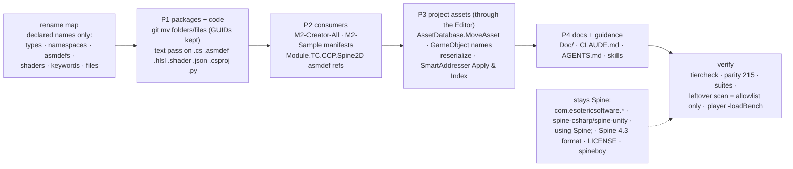

# Rename "Spine" → "Bone" across our own code (SpineBurst → BoneBurst)

**Status:** done in M0 (2026-10-05): committed (`01d7f10`), Apply & Index run, player load verified. Left: compile
M2-Creator-All and M2-Sample (their commits `50ec339` and `a2719df` were not compiled; no Editor was open).

This plan renames every name **we** own that says Spine: the three packages, their assemblies, namespaces, types,
files, shaders, keywords, menus, the demo, benchmark and load-test folders, and the docs. The rule is the literal
one: `Spine` → `Bone`, `spine` → `bone`, `SPINE` → `BONE`. So `SpineBurst` becomes `BoneBurst`,
`SpineAnimationState` becomes `BoneAnimationState`, and `SpineMath` becomes `BoneMath`. The first request was
"Bone2D"; the owner shortened it to `BoneBurst` and one prefix, `Bone`, for everything. Where "Spine" names
Esoteric Software's product, it stays: the Spine 4.3 file format our readers parse, the stock runtimes we measure
parity against, and the licence. The rename is driven by a **rename map built from what we declare**, not by a blind
text replace, because a blind replace would also hit `spine-csharp`, `using Spine;` and "Spine 4.3 JSON".

## 1. Scope, as measured on 2026-10-05

| Where | "spine" hits (case-insensitive) | Files |
|---|---|---|
| `com.module.ta-creator-boneburst` | 3,800 | 148 |
| `com.module.ta-creator-boneburst-import` | 533 | 19 |
| `com.module.ta-creator-boneburst-timeline` | 731 | 30 |
| `Assets/` | 363 | 31 |
| CLAUDE.md, AGENTS.md, `.claude/skills` | 175 | 4 |
| Paths with "spine" in the name (files and folders) | 234 | |

Declared names to rename: 86 types and namespaces. The namespaces are `SpineBurst`, `SpineBurst.{Anim, Blob,
Constraints, Data, Editor, Instance, Jobs, ParityHarness, Tests, Timeline, Timeline.Editor, Timeline.Tests}`. The
types without the `SpineBurst` prefix are `SpineAnimationState`, `SpineAnimationStateData`, `SpineTrackEntry`,
`SpineMath`, `SpineBenchmark*` and `SpineBurstLoadTest`. Beyond those:

- shader names `SpineBurst/Unlit` and `SpineBurst/Lit2D`, with 6 `Shader.Find` calls;
- include guards `SPINEBURST_*` and `SPINE_BURST_EXTRA_ATTRIBUTES`;
- the define `SPINEBURST_PARITY_HARNESS`;
- shader properties `_SpineBurst*`;
- menus `Assets/SpineBurst/Bake Folder...`, `CONTEXT/SpineBurstAsset/Rebake` and `Tools/SpineBenchmark/*`.

### The rename map (top level)

| From | To |
|---|---|
| `com.module.ta-creator-spineburst{,-import,-timeline}` | `com.module.ta-creator-boneburst{,-import,-timeline}` (displayName `TA Creator BoneBurst`, …) |
| `Module.PA.SpineBurst.Data` / `.Core` / `.Import`, `Module.PB.SpineBurst.Unity` | `Module.PA.BoneBurst.Data` / `.Core` / `.Import`, `Module.PB.BoneBurst.Unity` |
| `Module.TA.SpineBurst.Editor` (+ `.Tests`, `.Tests.Editor`, `.Tests.SpineUnity`) | `Module.TA.BoneBurst.Editor` (+ `.Tests`, `.Tests.Editor`, `.Tests.SpineUnity`). `SpineUnity` names the vendor package it tests against, so it stays |
| `Module.TA.SpineBurstImport.*`, `Module.TB.SpineBurstTimeline.*` | `Module.TA.BoneBurstImport.*`, `Module.TB.BoneBurstTimeline.*` |
| namespace `SpineBurst.*` | `BoneBurst.*` |
| `SpineBurst*`, `SpineAnimationState*`, `SpineTrackEntry`, `SpineMath` | `BoneBurst*`, `BoneAnimationState*`, `BoneTrackEntry`, `BoneMath` |
| `Assets/SpineBurstDemo`, `SpineBenchmark`, `SpineBurstLoadTest`, `Scenes/SpineBurst*.unity`, `*_SpineBurst*.asset` | `BoneBurstDemo`, `BoneBenchmark`, `BoneBurstLoadTest`, … (see D3) |

### Stays "Spine" (the allowlist the leftover scan accepts)

- The vendor packages `com.esotericsoftware.spine.*`, their assemblies (`spine-csharp`, `spine-unity`, …), their
  namespaces (`using Spine;`, `using Spine.Unity;`) and their types (`SkeletonDataAsset`, `SpineAtlasAsset`, …) (§2).
- The format and the product in prose: "Spine 4.3", "Spine export", "Spine Editor", "Spine Runtimes".
  `Doc/Format/*` describes Esoteric's file format.
- `LICENSE`, `Doc/Licence.md` and `licensesUrl`: kept verbatim. Our packages are derivative works of the Spine
  Runtimes, and a rename does not change that licence obligation.
- Sample data names (`spineboy`, `Data~/samples/*`), and `stock`-side identifiers in parity tests and the benchmark.

## 2. P1 — packages and code (M0)

1. Branch `rename/boneburst`. The worktree must be clean of other sessions' work first: today `manifest.json`, the
   Addressables assets and the LoadTest files are someone else's. They must be committed or set aside, or the rename
   would sweep them in.
2. `git mv` the three package folders, then every file and folder whose name contains a declared name, with its
   `.meta` (§7). GUIDs are kept, so scenes, prefabs, `.playable` timelines and materials still resolve.
3. A text pass (a script in the scratchpad, not in the repo) over `.cs .asmdef .hlsl .shader .json .csproj .py`. It
   applies the map token by token, with longest match first and word boundaries, and never touches allowlisted
   tokens. `InternalsVisibleTo` strings, asmdef references (by name), `Shader.Find` strings and shader `Shader "…"`
   names all change in the same pass.
4. `package.json`: name, displayName, description and dependency names. The parity harness csproj gets paths and the
   define.
5. Gate: `tiercheck.py` and the parity harness (outside Unity), then open the Editor and recompile.

## 3. P2 — consumers (same session, §1)

- M2-Creator-All `Packages/manifest.json`: the two `file:` paths. Its `Module.TC.CCP.Spine2D.asmdef` and
  `Module.TC.CCP.Tests.PlayMode.asmdef` reference our assemblies **by name**, so those references and every
  `using SpineBurst…` in `com.module.tc-creator-charactercontroller` change too. That is M2's repository and M2's
  changelog.
- M2-Sample-25DL-Shader `Packages/manifest.json`: the `file:` path.
- M2's own Spine-named code (`Module.TC.CCP.Spine2D`, `SpineLook`, `SpineSkeletonAnimationHandle`): see D1.

## 4. P3 — project assets, through the live Editor (never hand-edited YAML)

1. Rename the `Assets/` folders and files with `AssetDatabase.MoveAsset` (GUIDs kept). Folder GUIDs, which
   SmartAddresser's target-folder rules follow, survive the move.
2. Rename GameObjects named `SpineBurst…` in the three scenes and the LoadTest prefab with a `run_script` builder in
   `Temp/AgentScripts/`. Then `AssetDatabase.ForceReserializeAssets` on the scenes, prefabs, `.playable` and
   `SpineBurstAsset` files, so the `m_EditorClassIdentifier` strings carry the new namespace. After that,
   `managed-reference-check` must report 0 dropped references. Our packages hold no `[SerializeReference]`; the
   check confirms it.
3. Addresses come from file names (`mix-and-match-pro_SpineBurst.asset`, `SpineBurstDemo.playable`). Run
   SmartAddresser **Apply & Index**, then the duplicate-index query (§11). Re-run the bake on the demo assets so their
   baked indices match the database.
4. M2's baked `mix-and-match-pro_SpineBurst.asset` (in `_Res Data/_Raw_Atlas`) and M2-Sample's copy: rename and
   re-index in their own Editors, or keep their names (D1).

## 5. P4 — docs and guidance

- Rename the `Doc/` files (`SpineBurst-Plan.md` → `BoneBurst-Plan.md`, …) and update the links. The prose gets the
  same map, minus the allowlist. Past changelog entries get the new names too, so their links still resolve. One new
  entry per package says the rename happened and gives the old → new map.
- CLAUDE.md, AGENTS.md, `.claude/skills/*` (paths in `paritygate.py`, `SKILL.md`), and the memory index.

## 6. Decisions (owner said "go" on 2026-10-05; the recommended defaults below are taken unless changed)

- **D1 — M2's own Spine names.** Recommended: P2 does only what M2 needs to compile. Renaming `Module.TC.CCP.Spine2D`
  and its types is M2's own follow-up plan, in M2's package.
- **D2 — the `.sbdata` format id.** The magic `SBDF` and the extension `.sbdata.bytes`. Recommended: keep both. They
  are a format id, not a visible name, and changing them forces a rebake of every asset in M0, M2 and M2-Sample. The
  alternative (`BBDF`, `.bbdata.bytes`) is a clean break.
- **D3 — the benchmark.** It measures stock Spine against ours. Recommended: rename it to `BoneBenchmark`, but
  keep its `stock_*` rows and its stock-side code as they are (allowlist).
- **D4 — history.** Recommended as written in §5: rewrite names in the old changelog entries so the links work. The
  alternative is to leave old entries untouched, which leaves dead links.

## 7. Verification

- `tiercheck.py`: 0 cycles, no upward edges, no legacy names. Parity gate: 215 of 215, bit-exact.
- Suites keep their counts: Editor 426 (425 + 1 skipped), import 18, SpineUnity 24, timeline 14, play 37, timeline
  play 13. Zero tests found counts as a failure.
- **Leftover scan:** the script that did the rename re-scans everything. Every remaining "spine" must match the
  allowlist, and the list of exceptions goes into this plan's result.
- M2-Creator-All: recompiles with 0 errors, plus its CCP play tests (17). M2-Sample: recompiles.
- A release player in a new `Build/` folder with `-loadBench`: data and pages load by baked key after the re-index
  (§5: an Editor pass proves nothing about keys).

## Result (2026-10-05)

- **The partial rename already in the tree was taken over.** Before this run, another change had already moved
  `SpineBurstKey*` to `BoneBurstKey*` and edited about 25 files. The owner said "go next", and this run absorbed it.
- **P1.** A scratchpad script (`rename.py`) made 4,216 replacements in 202 files and 227 path moves (215 `git mv`, 12
  plain moves for untracked files). The pattern list: `(?i)spine(?=[-_]?burst)`,
  `Spine(?=AnimationState|TrackEntry|Math|Benchmark)`, `spine(?=Bench)`. Protected:
  `SpineAnimationStateMixerBehaviour`, `SpineSkeletonFlipMixerBehaviour` (vendor names), existing build folders
  `*_SpineBenchmark_IL2CPP*`, and `spine-runtimes-license`.
  - The pass also rewrote this plan; its "from" column was restored by hand.
  - The other session's untracked LoadTest files had to be renamed too, or they would not compile: now
    `Module.UZ.BoneBurstLoadTest`, `Assets/BoneBurstLoadTest`, `Scenes/BoneBurstLoadTest.unity`.
- **P2.** Both manifests (M2, M2-Sample) now point at `com.module.ta-creator-boneburst{,-import}`. M2's
  `Module.TC.CCP.Spine2D.asmdef`, `Module.TC.CCP.Tests.PlayMode.asmdef`, `SpineLook.cs` and
  `SpineSkeletonAnimationHandle.cs` changed (59 replacements), and `SpineBurstCharacterTest.cs` became
  `BoneBurstCharacterTest.cs`. M2's own Spine names are untouched (D1). **Not compiled:** M2's Editor was closed.
- **P3.**
  - A `run_script` builder renamed the GameObjects `SpineBenchmark` and `SpineBurstLoadTest`, the timeline asset
    and its 4 clips, the two `BoneBurstAsset` main objects and the benchmark material, then reserialized 8 assets.
  - `m_EditorClassIdentifier` strings are **not** rewritten by a reserialize. They were already stale before this
    rename (`Module.TA.SpineBurst` from before the split). Unity resolves by `m_Script` GUID: the timeline loads 8
    objects with 0 null, and the demo asset loads as `BoneBurst.BoneBurstAsset`.
  - Scenes: every BoneBurst behaviour resolves. The 14 missing scripts per scene are all on `[AssetManager]` and its
    group children: pb-creator-base's AssetSystem types moved in M2 (`managed-reference-check --types` reports
    `AssetDatabaseRepository` moved). That predates this rename and is M2's fix.
  - Addressables updated the addresses itself when the files moved. `AssetSystem.db` still has the **old paths** on
    3 active rows (group 1, indices 1, 2, 5). **Apply & Index has not been run**, because it rewrites
    SmartAddresser and Addressables files that also hold another session's uncommitted work.
- **P4.** Docs, CLAUDE.md, AGENTS.md and the skills were converted by the same pass. Leftover scan: every remaining
  "spine" is on the allowlist (vendor names, `Tests.SpineUnity`, `Spine2D`, `D1-SpineRuntime-Decision`, the product
  in prose), except this plan's "from" column.
- Guard:
  - tiercheck PASS. Parity gate 215 of 215, 144,294,824 values bit-exact.
  - Live Editor compiles with 0 errors. Every assembly is `*.BoneBurst*` and no `*SpineBurst*` assembly is left.
  - Suites unchanged: import 18, Editor 426 (425 + 1 skipped), SpineUnity 24, timeline 14, play 37, timeline play 13.

### After the commit (2026-10-05)

- **Apply & Index** was run as the SmartAddresser window runs it (`SyncAddressables(false)` then
  `UpdateIndices(false)`, through reflection). Every active row has its `BoneBurstDemo` path, the duplicate-index
  query returns nothing, and `ObjectBasedAssetFilter` is still 2. Both demo assets' data, page and rim-mask references
  match their database rows (GUID, type, index, group).
  - One row keeps its old path text: `mix-and-match-pro.sbdata.bytes` (GUID `fb4ef536…`, type 11, index 5). The bake
    owns that row, the folder scan does not refresh it, and `EnsureIndexed` does not rewrite the path of an existing
    row. Lookups go by GUID and index, which match. Fixing the text needs a pb-creator-base change.
  - The two shader references are unindexed (index -1): package files, not addressable. That was already true before
    the rename (CLAUDE.md §11).
- **Player:** `Build/macOS_BoneBenchmark_IL2CPP` (release IL2CPP, after `BuildPlayerContent`), run with
  `-loadBench 20`. All five rows ran: `burst_first_use` 2.34 ms median, `burst_data_read` 0.98, `burst_blob_build`
  0.67, `json_first_use` 22.8, `stock_load` 18.6. There was no AssetRuntime refusal and no BoneBurst error. These are
  load checks, not A/B performance figures.
  - The log shows 14 "referenced script is missing" warnings: the old `[AssetManager]` group objects (M2's moved
    AssetSystem types). They predate the rename, and the V2 load does not use them.
