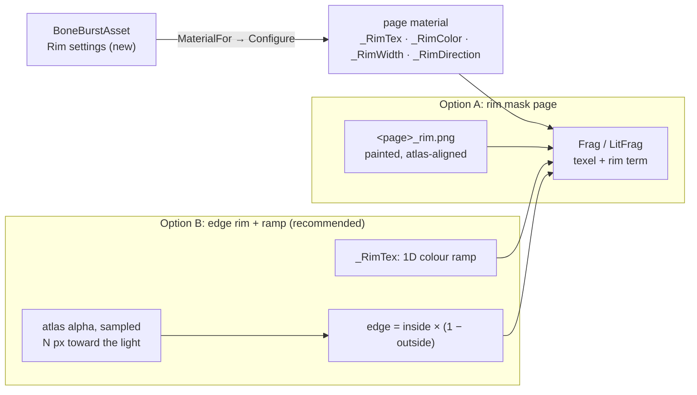

# BoneBurst rim light, from one added texture — plan

**Status:** R0–R3 built 2026-10-02, **not committed**; one limitation found (§5). Decided (§4): B, edge rim + one colour
ramp, Lit2D only, `Shaders/` kept at the package top.

A rim light is a thin bright band along a character's outline, usually on the side facing a light. BoneBurst's two
shaders (`Shaders/BoneBurst-Unlit.shader`, `Shaders/BoneBurst-Lit2D.shader`) sample one texture today, the atlas page
(`_MainTex`). This plan adds one texture and a few material values, in both shaders, without a new shader variant.
Their source is a setting on `BoneBurstAsset`, which every page material built in `MaterialFor` reads, so an artist
sets it once per skeleton.

## 1. What is there (read 2026-10-02)

*   Both shaders' fragment programs: `texel = SAMPLE(_MainTex, uv)`, then tint black or `texel × vertex colour`; Lit2D
    un-premultiplies, lights through URP's `CombinedShapeLightShared` and premultiplies again. Output is always
    premultiplied (`One, OneMinusSrcAlpha`). All material values are in the `UnityPerMaterial` CBUFFER in
    `BoneBurstCommon.hlsl` (SRP Batcher).
*   Materials exist only at runtime, one per atlas page and blend mode, from `BoneBurstAsset.MaterialFor` →
    `BoneBurstMaterials.Configure`. No per-asset texture reaches them today: Lit2D's `_MaskTex` is never set and stays white.
*   Variants: `_TINT_BLACK_ON` × `BONE_BURST_GPU / BONE_BURST_FETCH` are `multi_compile` (runtime materials). Straight
    alpha is a material-uniform branch, so it costs no variant. The rim takes the same approach: `_RimStrength > 0` is a branch, not a keyword.
*   The shaders moved from `Runtime/Shaders` to a top-level `Shaders/` (uncommitted). The includes already follow it;
    `BoneBurstPageReferenceTests.Lit2DPath` and `KeywordVariantComparisonTests.ShaderDir` still name the old folder (R0).

## 2. The two ways one texture makes a rim

| | **A. Rim mask page** | **B. Edge rim + colour ramp** (recommended) |
|---|---|---|
| The texture | `<page>_rim.png` per atlas page, laid out exactly like the page; R = where a rim may show | one small 1D gradient (e.g. 64 × 1): colour by distance from the edge |
| Where the rim comes from | painted by the artist, region by region | computed: atlas alpha is sampled `_RimWidth` pixels toward `_RimDirection`, and the rim is where the pixel is inside and that sample is outside |
| Direction (side facing the light) | none: a painted mask cannot turn with a bone (the mesh has no per-vertex tangent) | yes: `_RimDirection` is in screen space, mapped into atlas UV by `ddx/ddy`, so rotated regions and bones are handled |
| Artist work | paint one mask per page, and repaint after every re-export | none: pick colour, width, direction, ramp |
| Cost | one extra sample per pixel; one more texture per page in memory and in the AssetSystem | 2–4 extra atlas samples + one ramp sample per pixel; one tiny texture per asset |
| Limit | exact control, but static | the rim can be at most the atlas padding wide (the sample must not read the next region). mix-and-match-pro's padding is checked in R1 |
| Bake / AssetSystem | the bake must find `_rim` pages and write one reference per page | the asset holds one texture reference, loaded like the shader |

## 3. Steps

| Step | Deliverable | Verification |
|---|---|---|
| **R0** | The two tests' old shader paths → `Shaders/` | Editor suite green; DXC compiles every variant (`KeywordVariantComparisonTests`) |
| **R1** | Shader: CBUFFER gains `_RimColor`, `_RimStrength`, `_RimWidth`, `_RimDirection`; `TEXTURE2D(_RimTex)`; one `BoneBurstRim(...)` in `BoneBurstCommon.hlsl` used by `Frag` and `LitFrag` (Lit2D: added after lighting, so the rim stays bright in shadow). The term is added in premultiplied space (`rgb += rim × α`) | `_RimStrength = 0` gives pixel-identical output to today (the `KeywordVariantComparisonTests` / `VertexFetchPlayModeTests` capture path); variant count unchanged |
| **R2** | `BoneBurstAsset` gains a `Rim` block: an AssetSystem reference to the texture, plus colour, strength, width and direction. `MaterialFor` / `Configure` set them, and a changed value updates live materials (as `ShaderLoaded` does for the shader) | an Editor test: a material from an asset with rim settings carries them; strength 0 is today's material |
| **R3** | Demo: one skeleton in `BoneBurstDemo.unity` with the rim on, through the inspector | a Scene-view capture (`editor-window-capture`) shows the band on the chosen side |
| **R4** | Docs: `Doc/Format/Skins-TintBlack-Culling.md` (the shader chapter), the changelog at commit | — |

## 4. Decisions (owner, 2026-10-02)

*   **Q1: B**, a computed edge rim coloured by one ramp texture.
*   **Q2: Lit2D only.** `BoneBurst/Unlit` stays as it is; the rim function lives in `BoneBurstLit2DPass.hlsl`, not in the
    shared `BoneBurstCommon.hlsl`. The CBUFFER is shared, so the new values are declared there; Unlit simply never reads them.
*   **Q3: `Shaders/` stays at the package top.** M0's `CLAUDE.md` layout rule gains it as a fifth folder (R0).

## 5. Results (2026-10-02)

> **Superseded in part** (owner, later the same day): the ramp `_RimTex` was removed, and a painted per-page rim mask
> (`_RimMaskTex`, `<page>_rim.png`) multiplies the edge instead: `BoneBurst-TextureSplit-Plan.md` §5–6. The ramp lines
> below are history.

*   **R0** the two tests' shader paths → `Shaders/`; M0 `CLAUDE.md`'s layout rule names `Shaders/` for BoneBurst.
*   **R1** `BoneBurstLit2DPass.hlsl`: `BoneBurstRim`, added after lighting. A world-space direction is mapped into atlas
    UV through the derivative matrices; the step is `_RimWidth` atlas texels; 3 alpha samples give the edge, and the ramp
    colours it. The values sit in the shared CBUFFER (one SRP Batcher layout); there is no new keyword or variant.
    Lit2D compiles with 0 errors; `KeywordVariantComparisonTests` (the DXC variant compile) passes.
*   **R2** `BoneBurstAsset`: a *Rim light* block (ramp as an AssetSystem texture reference, loaded like the shader;
    colour, strength, width, direction), applied in `MaterialFor`, re-applied live (`SetRim`, `SetRimRamp`,
    `OnValidate`), and released in `Free`. `BoneBurstRimTests` 2 of 2.
*   **R3** demo: `Assets/BoneBurstDemo/BoneBurst_RimRamp.png` (64 × 1, warm edge to clear), SmartAddresser-indexed
    (group 1, index 4), on `mix-and-match-pro_BoneBurst_Lit2D` (strength 1.5, width 1.5, from the upper left).
    Scene-view captures: the band shows, and with exaggerated values it is unmistakable.
*   **Limitation, inherent to option B in a material shader:** the rim appears at the border of **every attachment**
    (hair strands, scarf, sleeves), not only on the character's outer silhouette. Each attachment is its own atlas
    region, and the shader sees only that region's alpha, not the parts drawn over it. A silhouette-only rim needs the
    whole skeleton's coverage first: a screen-space pass (draw the skeleton's alpha into a buffer, then edge-detect it
    toward the light). That is a 2D Renderer feature, not a material change.
*   Suites: Editor 435 + 1 skipped of 436 (the 2 rim tests included after a setup fix), play 37.
