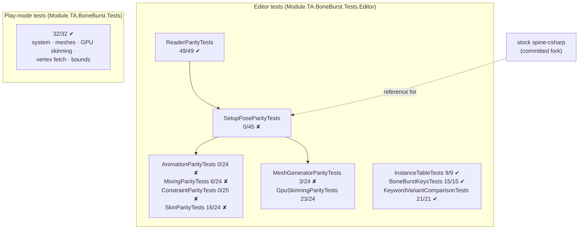

# BoneBurst test report (2026-09-30)

This report covers every BoneBurst test class, run on 2026-09-30 in Unity 6000.6.3f1 (macOS, Metal): first in M1-Plugins-Custom at commit `bbd2bb6`, then again in the M0-Animation2D project after the move, with identical results.

**Current state (recheck 2026-10-05, after the spine-csharp test split — [BoneBurst-TestSplit-Plan.md](BoneBurst-TestSplit-Plan.md)):**
- The stock spine-csharp parity suites now live in their own `Module.TA.BoneBurst.Tests.SpineCsharp` assembly: **215 of 215**. `Module.TA.BoneBurst.Tests.Editor` — now free of any stock Spine assembly — **209 of 211, 1 failed**: `BoneBurstPageReferenceTests.DataReference_BuildsTheBlobThroughTheEditorCache_WithoutALoader`, the Editor GUID-cache flake, unchanged from before the split. The dedicated `Module.TA.BoneBurst.Tests.SpineUnity` assembly — the only test code naming spine-unity — 24 of 24, its `StockMeshCompare` hooks wiring into the moved suites.
- Strict-float harness 215 of 215, bit for bit (`parity-harness` gate PASS, from the new `Tests/Editor/SpineCsharp` paths); the harness count matches the Unity `Tests.SpineCsharp` count exactly.

**Previous state (recheck 2026-10-02, after the assembly split and Perf2 round 2):**
- Editor strict assembly (`Module.TA.BoneBurst.Tests.Editor`, parity suites included then) 433 passed + 1 skipped of 434 (the skip: `GpuSkinningParityTests` on clipping.json, where every frame clips). The dedicated `Module.TA.BoneBurst.Tests.SpineUnity` assembly — the only test code naming spine-unity — 24 of 24.
- Strict-float harness 215 of 215, bit for bit (`parity-harness` gate PASS; it grew from 191 with the steady-step suite `RandomScripts_SteadyStep_MatchStock`, 24 cases, each asserting the step ran).
- Play mode 37 of 37. Around the package: timeline 14 EditMode / 13 PlayMode, M2's CCP PlayMode 17 of 17.
- Gates: `assembly-tier-check` PASS (re-run after the split, 2026-10-02); `managed-reference-check --types` PASS (2026-10-01).

The sections below record the run that found the 142 failures; [BoneBurst-ParityPlan.md](BoneBurst-ParityPlan.md) explains them (Mono rounding) and how the suites compare now.

- **Play mode: all 32 of 32 pass.** These are the tests of BoneBurst in a running scene: the system, meshes, GPU skinning, vertex fetch and bounds.
- **Editor: 142 of 284 pass.** The failures are all in the **parity suites that compare BoneBurst with the stock spine-csharp runtime**, and they share one symptom: the setup-pose world transforms differ at frame 0. The same suites fail identically with the day's BoneBurst changes stashed, so they predate that work.
- **Update, later on 2026-09-30:** `BakedDataTests` (the baked `.sbdata` format) was added: 98 of 98 pass, so the Editor assembly is now **240 of 382**, with the same 142 failures, per class, as below. Details: [BoneBurst-BakePlan.md](BoneBurst-BakePlan.md), B1 + B2 result. After B3 (keys moved into the baked data): **241 of 383**, still the same 142 failures; `BoneBurstKeysTests` is 16 of 16. After B4 (the Editor bake): **247 of 389**, the same 142 failures; `BoneBurstBakeTests` is 6 of 6. **Cause of the 142 found** ([BoneBurst-ParityPlan.md](BoneBurst-ParityPlan.md)): Mono's JIT-dependent float rounding in stock spine-csharp. The same tests run on strict float32 (`Tools~/ParityHarness`) pass 191 of 191, bit for bit. **F3 done (improvement plan I1):** with tolerance, lockstep and conditioning-aware bounds, the Editor suite is **388 passed, 0 failed, 1 ignored** in Release and Debug JIT, and five deliberate bugs fail it and the harness (parity plan §3.4).
- **The reader parity suite passes 49 of 49.** Both runtimes read identical data, which points the difference at the stock reference, not at BoneBurst's readers.

## 1. Play-mode tests: 32 of 32

| Class | Result | What it proves |
|---|---|---|
| `AnimationPlayModeTests` | 5/5 | Burst animation and physics match BoneBurst's managed reference every frame (walk, celestial-circus physics), and physics keeps stepping without animation. |
| `BoneBurstSystemPlayModeTests` | 4/4 | The system: add, remove, frame counters, the PlayerLoop entries. |
| `BoneBurstSkeletonPlayModeTests` | 7/7 | Meshes match the managed reference (spineboy, mix-and-match skin change), tint-black streams, destroy, and the bounds containing the pose every frame on both paths. |
| `GpuSkinningPlayModeTests` | 5/5 | The GPU pose record skins to the reference; static mesh reuse; the clipping fallback; switching GPU skinning off. |
| `VertexFetchPlayModeTests` | 11/11 | Vertex fetch draws pixel-identically to the per-mesh upload. Covered: spineboy and synthetic data, Unlit and Lit2D, tint black on and off, a still skeleton after nine ring rotations, a GPU deform fallback, and the bound GPU buffer holding this frame's fallback vertices. |
| `BoneBurstPerfTests` | explicit | Not run by default (`[Explicit]`); `Assets/BoneBenchmark` replaces it for numbers. |

The mesh-parity tests read vertices through `BoneBurstSkeleton.GetCpuVertices`, so they check whichever upload path each frame took.

**Mutation checks** (a deliberate bug, then run the test):

| Broken | Caught by |
|---|---|
| The ring copy copies nothing | 9 of the 10 fetch pixel tests fail |
| The GPU fallback's late copy is skipped | `GpuFallback_BoundBufferHoldsThisFramesVertices` fails: all 275 vertices one frame stale |

## 2. Editor tests: 142 of 284

| Class | Pass / total | Compares | Failure symptom |
|---|---|---|---|
| `ReaderParityTests` | **49/49** | BoneBurst's JSON and binary readers against spine-csharp's | – |
| `InstanceTableTests` | **9/9** | the instance table (BoneBurst only) | – |
| `BoneBurstKeysTests` | **15/15** | baked name keys (BoneBurst only) | – |
| `KeywordVariantComparisonTests` | **21/21** | shader keywords against the legacy shaders (BoneBurst only) | – |
| `GpuSkinningParityTests` | 23/24 | the GPU mesh against the CPU mesh | `clipping.json`: "no frame took the GPU path" |
| `SkinParityTests` | 16/24 | skin scripts against stock | "seed 0 frame 0: bone … world differs" |
| `MixingParityTests` | 6/24 | random mixing scripts against stock | slot color and constraint pose differ |
| `MeshGeneratorParityTests` | 3/24 | meshes against spine-unity's `MeshGenerator` | "nothing was played" (20 files); one `Fill` tint vertex differs |
| `AnimationParityTests` | 0/24 | animation playback against stock | "bone … world/local differs" |
| `ConstraintParityTests` | 0/25 | constraints and physics against stock | "init: bone … world differs" |
| `SetupPoseParityTests` | 0/45 | the setup pose against stock | "no skin: bone … world differs" at frame 0 |

**Why the failures predate this work.** On 2026-09-30, `SetupPose` (45), `MeshGenerator` (21), `GpuSkinning` (1), `Skin` (8), `Animation` (24) and `Mixing` (18) were each run with that day's BoneBurst runtime changes stashed. The failure counts were identical. `ConstraintParityTests` was not stash-checked separately; it shows the same frame-0 symptom.

**Where it points.**
- **Reading is identical:** `ReaderParityTests` passes 49 of 49, so the data read in is the same on both sides.
- **Posing is not:** `SetupPoseParityTests` fails from the setup pose itself, and every stock-comparing suite built on top of it (animation, mixing, constraints, skins, meshes) inherits the difference.
- **The uncommitted Spine edits are ruled out.** The stock runtime in M1-Plugins-Custom had uncommitted local edits in `Animation.cs`, `AnimationState.cs`, `MathUtils.cs`, `PathConstraint.cs` and others, the first suspect. On 2026-09-30 the Spine work moved to M0-Animation2D with the **committed** spine-csharp, without those edits. The Editor suite there gives the identical result: 142 of 284, the same per class.
- **What is left to find:** a difference between BoneBurst's managed reference (`ManagedPose`) and the committed spine-csharp fork, including its committed `var` clean-up, in the setup pose's world transform.
- **The P1–P7 parity results in `Doc/Parity/Parity.md`** were recorded before this regression. Bisecting the BoneBurst and spine-csharp commits in M1-Plugins-Custom's history can find where it appeared.

**What still guards correctness meanwhile:**
- The play-mode tests compare Burst against BoneBurst's own managed reference, not against stock.
- The GPU and vertex-fetch tests compare paths against each other.
- The last stock-parity run that passed is recorded in `Doc/Parity/Parity.md` (P1–P7).
- **What is lost:** until the parity suites are green, a change in pose or mixing behavior against stock would go unnoticed. This is why they are the prerequisite for moving the animation state into Burst (`BoneBurst-Plan.md`, "Animation changes and the next plan").

## 3. Run it

- **Editor:** one class at a time with `python3 .claude/skills/unity-playtest/playtest.py test --test BoneBurst.Tests.<Class> --mode EditMode`, or a whole assembly with `--assembly Module.TA.BoneBurst.Tests.Editor` (BoneBurst-only), `--assembly Module.TA.BoneBurst.Tests.SpineCsharp` (stock parity) or `--assembly Module.TA.BoneBurst.Tests.SpineUnity` (MeshGenerator parity), each with `--mode EditMode`.
- **Play mode:** `python3 .claude/skills/unity-playtest/playtest.py test --assembly Module.TA.BoneBurst.Tests --mode PlayMode`.
- **Pixel tests from a cold shader cache:** `VertexFetchPlayModeTests` waits for the Editor's shader compile before capturing, so they pass from a cold cache too. Players compile every variant at build time.
