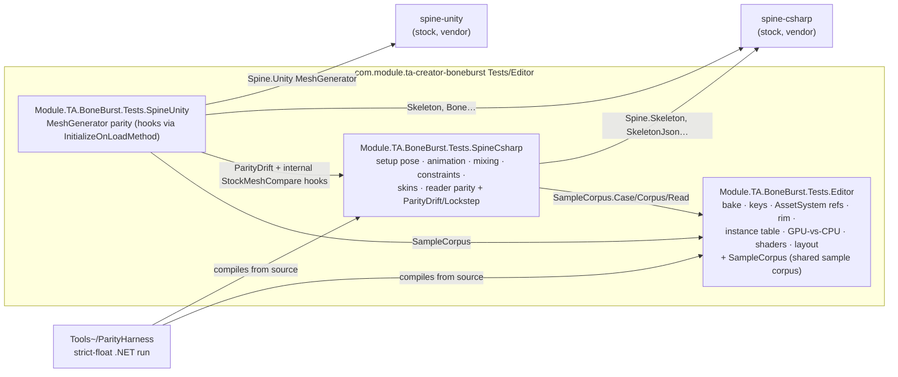

# BoneBurst Test Split — spine-csharp out of the Editor test assembly

**Status:** done (2026-10-05). All three Edit-mode assemblies green, tier gate PASS, strict-float harness
215/215 from the new paths. One discovery beyond the plan: the parity suites use `internal` members of the
runtime (`BoneBurstSkin(string, BlobContent)`, `CommandBuffer.Add`), so Data, Core and the import readers'
`AssemblyInfo.cs` each gained an `InternalsVisibleTo("Module.TA.BoneBurst.Tests.SpineCsharp")` grant — the
same access those files had when they lived in `Module.TA.BoneBurst.Tests.Editor`. Not committed yet; the
changelog entry lands with the commit.

Split `Module.TA.BoneBurst.Tests.Editor` so that it no longer references `spine-csharp`: every
Edit-mode suite that compares BoneBurst against stock spine-csharp moves to a new dedicated
assembly, `Module.TA.BoneBurst.Tests.SpineCsharp`, next to the existing
`Module.TA.BoneBurst.Tests.SpineUnity` (the same decoupling spine-unity got on 2026-10-01). What
remains in the Editor test assembly is purely BoneBurst-side: bake round-trip, keys, AssetSystem
references, rim, instance table, GPU-vs-CPU mesh, shader variants, assembly layout.

## Why

`Module.TA.BoneBurst.Tests.Editor` referenced `spine-csharp` for the parity suites, so the neutral
BoneBurst tests (bake, keys, AssetSystem) could not be built, run or read without the stock runtime
being in the project. The stock side of the tests is a duty of its own (D1 keeps stock as the parity
reference); it belongs in a dedicated assembly the same way spine-unity's mesh parity does.

## The one coupling to cut: the sample corpus

The parity suites, the bake suite and the GPU suite all run over the same corpus —
`ReaderParityTests.Case` + `Corpus()` (the `Data~` sample folders at two scales, M2's binary
skeleton, the synthetic JSONs) — and the bake/GPU suites read a case through
`SkinParityTests.Read` / `BakedDataTests.ReadSource` (two copies of the same five lines). Both live
in files that must move. Extracting the corpus into one public, stock-free helper keeps a single
source of truth and keeps the reference direction sane:

- `Tests/Editor/Core/SampleCorpus.cs` (new, stays in the Editor test assembly): `Case`,
  `Corpus()`, `Read()` — paths + BoneBurst's own readers, no spine-csharp type.
- `SkinParityTests.Read` and `BakedDataTests.ReadSource` are deleted; their callers use
  `SampleCorpus.Read`.

## Steps

1. `git mv` (files + `.meta`) into `Tests/Editor/SpineCsharp/`: `AnimationParityTests`,
   `MixingParityTests`, `ConstraintParityTests`, `SetupPoseParityTests`, `SkinParityTests`,
   `ReaderParityTests`, `ReaderParityComparer`, `ParityConditioning`, `ParityLockstep`,
   `ParityDrift`, `ParityDriftReport`. Folders `Anim/`, `Constraints/`, `Pose/`, `Skins/`,
   `Parity/` empty out and go (with their `.meta`).
2. New `Module.TA.BoneBurst.Tests.SpineCsharp.asmdef` (Editor-only, `UNITY_INCLUDE_TESTS`, nunit
   precompiled; references Data, Import, Core, `Module.TA.BoneBurst.Tests.Editor`, `spine-csharp`,
   Unity.Mathematics, Test Runners) and its `AssemblyInfo.cs`
   (`InternalsVisibleTo("Module.TA.BoneBurst.Tests.SpineUnity")` — the mesh-parity hooks
   `AnimationParityTests.StockMeshCompare`, `SetupPoseParityTests.StockMeshCompare`, `SameVertex`,
   `LoadStock`).
3. Corpus call sites re-pointed at `SampleCorpus` (the five moved suites, `BakedDataTests`,
   `GpuSkinningParityTests`, `MeshGeneratorParityTests`).
4. `Module.TA.BoneBurst.Tests.Editor.asmdef`: drop `spine-csharp` and `Module.TA.BoneBurst.Editor`
   (no remaining file names either). `Module.TA.BoneBurst.Tests.SpineUnity.asmdef`: add
   `Module.TA.BoneBurst.Tests.SpineCsharp`. `Tests/Editor/AssemblyInfo.cs`: drop the now-dead
   `InternalsVisibleTo` grant to SpineUnity (the only internal left there is `DeepComparer`, used
   by the import package's tests).
5. `Tools~/ParityHarness/ParityHarness.csproj`: compile `Tests/Editor/Core/SampleCorpus.cs` +
   `Tests/Editor/SpineCsharp/*.cs` instead of the five old folders.

## Guards

- Assembly gate: `python3 .claude/skills/assembly-tier-check/tiercheck.py` — no cycles, no upward
  edges (test-to-test references stay same-band TA, as SpineUnity → Tests.Editor already is).
- Compile + the three Edit-mode assemblies through the live Editor; a run of 0 tests is a failure.
  Baseline before the move: Tests.Editor 424/426 passed (1 pre-existing failure:
  `BoneBurstPageReferenceTests`, the Editor's GUID cache — unrelated, stays in that assembly);
  Tests.SpineUnity 24/24.

## Results

- `assembly-tier-check` PASS: 32 asmdefs, 0 cycles, no new upward edges.
- `Module.TA.BoneBurst.Tests.SpineCsharp` (new): **215/215**. `Module.TA.BoneBurst.Tests.Editor`
  (spine-csharp and `Module.TA.BoneBurst.Editor` references removed): **209/211, 1 failed** — the same
  pre-existing `BoneBurstPageReferenceTests` GUID-cache failure as the baseline. 211 + 215 = 426: the
  baseline assembly's tests split without loss or duplication.
- `Module.TA.BoneBurst.Tests.SpineUnity`: **24/24**, the `StockMeshCompare` hooks wiring into the moved
  suites through the new `InternalsVisibleTo` grant.
- Strict-float harness: **215/215** (9.3 s), the same count as the Unity `Tests.SpineCsharp` run — Unity
  and .NET agree the corpus and suites are intact.
- Play mode and the import package's tests are untouched (no code path they exercise changed; the
  project-wide recompile is clean).
