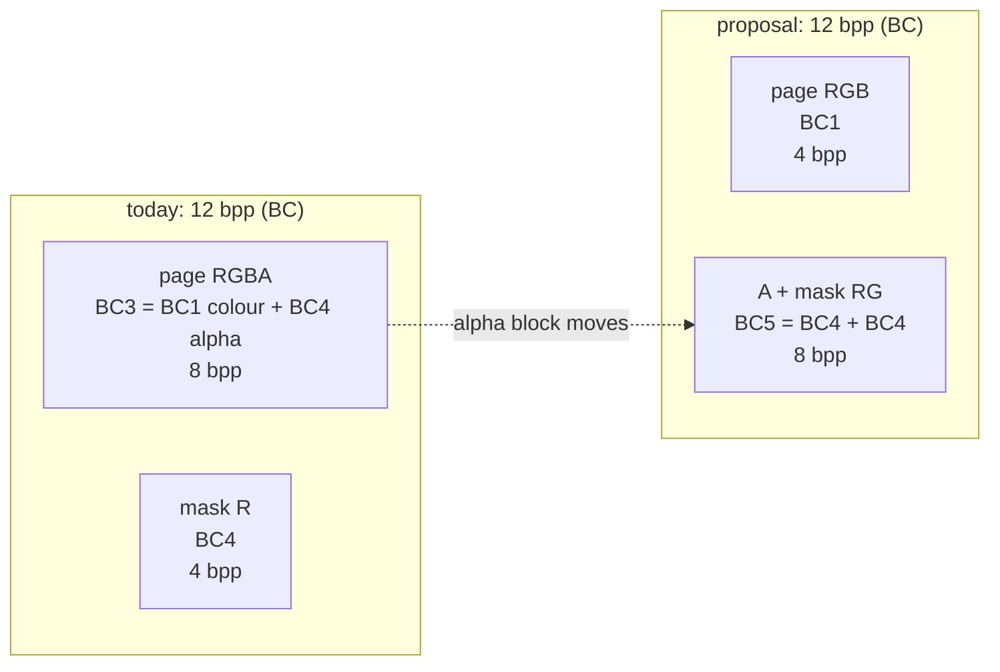
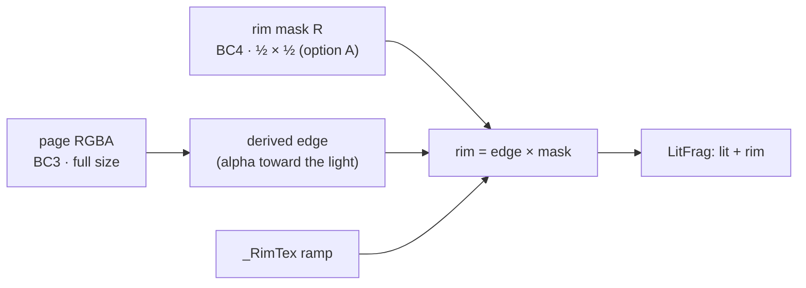

# BoneBurst page textures: RGB + (A, mask) instead of RGBA + mask? — plan

**Status:** 2026-10-02: **§5 built**, not committed (owner: "keep `<page>_rim.png` with the half-resolution rim mask; RGBA
with PMA (origin); go"; then "remove `_RimTex` ramp"). The RGB + (A, mask) split is **dropped**. Results in §6.

The owner bakes pages with `com.editor-tools.texturepacker` (`../M1-Plugins-Custom/Packages/com.editor-tools.texturepacker`),
and each atlas page now comes as two textures: an RGBA colour page and a one-channel mask. The proposal moves alpha
out of the colour page and into the mask texture, so the colour page is RGB and the second texture holds A plus the mask.
**On every GPU texture format the project uses, that split takes the same memory as today, and on uncompressed
textures it takes more.** §2 shows why, and §3 lists the changes that do shrink the textures.

## 1. Why the channel count is not the size

GPUs store block-compressed formats, 4 × 4 texels per block. A format's size per texel is fixed by what each block
holds, not by how many channels the source PNG had:

*   **BC1** (DXT1): RGB, 4 bpp. **BC4**: one channel, 4 bpp. **BC3** (DXT5) = BC1 colour + one BC4 alpha block = 8 bpp.
    **BC5** = two BC4 blocks = 8 bpp. **BC7**: RGB or RGBA, 8 bpp.
*   **ETC2** (mobile): RGB 4 bpp; RGBA8 = RGB + one EAC alpha block = 8 bpp; **EAC R11** = 4 bpp; **EAC RG11** = 8 bpp.
*   **ASTC**: the bitrate depends only on the block size (4 × 4 = 8 bpp, 6 × 6 = 3.56, 8 × 8 = 2). RGB, RGBA, one or two
    channels: all the same size.
*   **Uncompressed:** most GPUs have no 24-bit RGB format, so RGB24 is stored as RGBA32.

## 2. Today against the proposal, per texel

| Format family | Today: RGBA + R | Proposal: RGB + RG | Change |
|---|---|---|---|
| Desktop BC | BC3 8 + BC4 4 = **12 bpp** | BC1 4 + BC5 8 = **12 bpp** | none |
| Mobile ETC2 / EAC | RGBA8 8 + R11 4 = **12 bpp** | RGB 4 + RG11 8 = **12 bpp** | none |
| ASTC (same block size) | 2 × textures | 2 × textures | none |
| Uncompressed | RGBA32 32 + R8 8 = **40** | RGB24→32 + RG16 16 = **48** | +20 % |

Quality is equal too: BC3's alpha *is* a BC4 block, and BC5 is two of them; BC1's colour is BC3's colour block.

What the proposal costs:
*   **PMA.** The pages are premultiplied (the M0 rule: Gamma + PMA). Premultiplied colour stored apart from its alpha
    still works, but the packer's `Color Premultiplied` output and the bake both assume colour and coverage travel together.
*   **The shader samples the second texture for every pixel, even where the mask is not used.** Today's mask is
    sampled only by `BoneBurst/Lit2D`; `BoneBurst/Unlit` reads one texture.
*   **The bake and the AssetSystem** gain a second reference per page, the stock side (spine-unity) cannot draw it, and the
    parity/fetch tests compare against single-texture pages.

## 3. What does shrink the pages

| Option | Saves (BC, from 12 bpp) | Cost |
|---|---|---|
| **A. Half-resolution mask** (mask at ½ × ½, sampled with the same UV) | 12 → **9 bpp (−25 %)** | a mask edge is softer; fine for light/rim masks, not for hard cut-outs |
| **B. No mask texture where the shader can derive it** (e.g. the rim light from atlas alpha, already built: `BoneBurst-RimLight-Plan.md`) | 12 → **8 bpp (−33 %)** | only for masks that follow the silhouette |
| **C. ASTC block size per texture** (mobile): colour 6 × 6, mask 8 × 8 | 7.1 → **5.6 bpp (−21 %)** | mask detail; a per-platform importer setting, no shader change |
| **D. Lower Max Size on the mask** in the importer | as A, by the square | the same as A, with no tool change |
| **E. Fewer, fuller atlas pages** (pack tighter, smaller page size) | depends on the atlas's empty space | re-export from Spine |

A and D are importer or packer settings and need no shader change: the shader already samples the mask with the page's
UV, so any mask resolution lines up. B is the only one that removes a texture.

## 4. Decision for the owner

*   **Q1: what does the mask channel hold?** If it is the rim/light mask, option B (derive it from alpha) removes it. If it
    is painted detail (emission, a region ID), A or D (half-resolution mask) is the cheapest real saving.
*   **Q2: go ahead with the RGB + (A, mask) split anyway?** Recommended **no**: it saves nothing on BC, ETC2 or ASTC and
    costs 20 % uncompressed. If yes, the work is: the packer routes A to the mask texture's G; the bake writes a second page
    reference; `BoneBurstCommon.hlsl` samples alpha from the second texture in both shaders; the fetch, GPU-skinning and
    parity tests are re-checked.

## 5. The mask is the custom rim (owner, 2026-10-02): proposal

A painted rim mask cannot be derived from alpha (it is the artist's choice of where the rim goes), so option B of §3
does not remove it. It does fix the derived rim's weakness, though: `BoneBurstRim` (rim plan option B) lights the
border of **every attachment**, inner edges included. A painted mask is exactly the information that tells an
inner edge from the silhouette.

*   **Keep two textures:** RGBA page + one-channel rim mask, **the mask at half resolution** (BC4, 12 → 9 bpp for the
    pair, −25 %). The packer exports it at ½ size, or the importer's Max Size halves it; the UVs already line up.
*   **Shader:** `rim = derivedEdge × mask` in `BoneBurstRim`. The light direction and the ramp stay; the mask removes the
    inner-edge bands and lets the artist widen or kill the rim per region. A new `_RimMaskTex`, separate from URP's
    light `_MaskTex`; white when absent, which gives today's derived rim.
*   **Asset / bake:** one rim-mask reference per atlas page (like `m_Pages`). The bake picks up `<page>_rim.png` beside
    the export, the same way it picks up the page itself.
*   **Steps:** T1 shader multiply + `_RimMaskTex`; T2 `BoneBurstAsset` per-page rim-mask references, applied in
    `MaterialFor`; T3 the bake finds `<page>_rim.png`; T4 demo: a half-size mask for mix-and-match-pro (made with the
    texture packer); T5 tests and a capture that shows the inner edges gone.

## 6. Results (2026-10-02)

*   **Ramp removed** (owner): the rim is `_RimColor × strength × edge × mask`. `_RimTex` is gone from `BoneBurst-Lit2D`,
    `BoneBurstAsset` (`m_RimRamp` and its loader) and the tests, and the demo's `BoneBurst_RimRamp.png` is deleted.
*   **T1 shader:** `_RimMaskTex` (R, page-aligned, any resolution, white by default) in `BoneBurstLit2DPass.hlsl`; the
    edge is multiplied by it. Lit2D compiles with 0 errors.
*   **T2 asset:** `m_RimMasks`, one AssetSystem texture reference per page (`RimMaskReferences`, `SetRimMasks`; an
    in-memory seam `SetRimMaskTextures` for tests), loaded like the pages with a handle each and released in `Free`. Every
    page material gets its own page's mask (`ApplyRim(material, page)`; materials are keyed page × 4 + blend).
*   **T3 bake:** `<page>_rim.png` beside a page (`BoneBurstBake.RimMaskOf`, `RimSuffix`) is copied into the output
    folder after the same ownership check as a page, and imported as one linear channel (Single Channel, Red, BC4 when
    compressed), clamped, with no mipmaps and **Max Size half the page's**. One reference per page goes into the asset and every
    variant. The report counts the rim masks.
*   **T4 demo:** `Assets/BoneBurstDemo/mix-and-match-pro/mix-and-match-pro_rim.png`, made with the texture packer (the
    page's alpha routed to R, 1024 × 128, half the page). **A template, not art:** it is 1 wherever there is coverage, so
    on screen it equals no mask until the inner edges are painted out. Rebake: textures 2,112 KB → **576 KB** (page 512 KB
    DXT5 + mask 64 KB BC4), three references indexed (data, page, mask).
