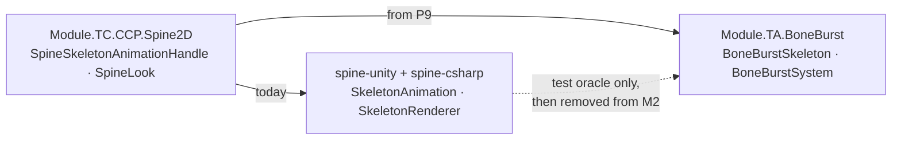

# D1 — Spine runtime: stock spine-unity or BoneBurst

**Decided 2026-09-29 (owner): BoneBurst is the core Spine runtime.** It is written 100 % new in `com.module.ta-creator-boneburst`. The stock `com.esotericsoftware.spine.*` packages stay only until M2 has migrated (plan phase P9), then they leave M2's manifest. Plan: [BoneBurst-Plan.md](BoneBurst-Plan.md).

Two systems would otherwise serve one duty, rendering Spine skeletons in M2 (M2's "two systems, one duty" rule). This project's consumer list is its `CLAUDE.md` §1. This page records which one new work goes to, so the question is not asked twice.

## Options

| | Stock spine-unity 4.3 (fork) | BoneBurst (new) |
|---|---|---|
| **Good** | Complete feature set, and it matches Spine Editor by definition. Already used by about 5 M2 prefabs. Upstream fixes arrive by re-copying. | Data-oriented: one system and Burst jobs over flat arrays. Mesh written straight to `Mesh.MeshData`. Invisible and unchanged skeletons are skipped. GPU skinning is possible. Our code, our tier (`TA`). |
| **Bad** | Object-per-bone, virtual timelines and linear key search. Every visible skeleton rebuilds its mesh every frame with legacy `mesh.vertices` uploads. Threading is off by default. Its Unity runtime lags behind its Editor. Speed-ups would mean patching vendor code that has to be re-applied by hand after every upstream copy. | Rewrite-sized work, comparable to spine-csharp's ~17 800 lines. Behaviour drift risk in mixing and physics. It must track Spine's format changes itself. |
| **Callers** | M2 `Module.TC.CCP.Spine2D` (`SpineSkeletonAnimationHandle.cs`, `SpineLook.cs`) and about 5 prefabs plus 1 spike scene | None yet |

## Decided

**BoneBurst.** New Spine features go to BoneBurst only. Stock spine-unity gets no new work, only what keeps it building until P9. It is not wrapped and no adapter bridges the two. M2's callers move over in P9, and the stock packages are removed from M2 once nothing references them (`CLAUDE.md` §3). Until then, stock spine-csharp is referenced only by `Module.TA.BoneBurst.Tests.Editor`, as the parity oracle.
