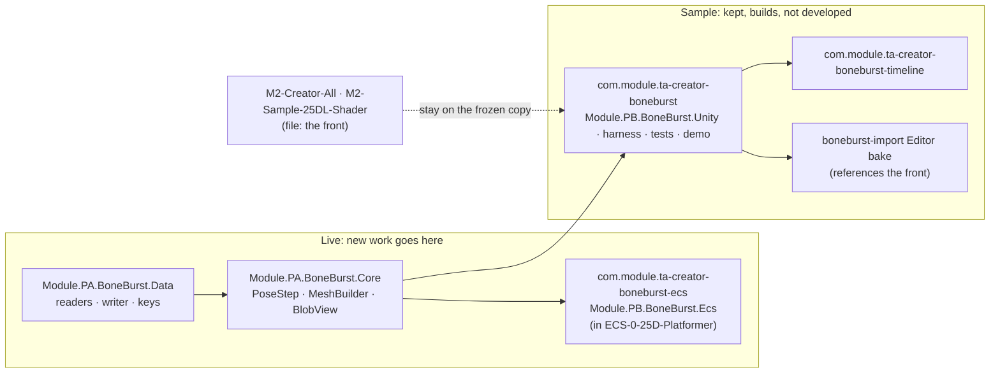

# D2: the MonoBehaviour front becomes a sample; new work goes to the ECS package

**Decided 2026-10-08 (the owner): "we abandon `com.module.ta-creator-boneburst`, keep it as sample, then focus on the new `com.module.ta-creator-boneburst-ecs`."** Two systems served one duty (BoneBurst running in a game); this records which one gets the work, so it is not asked twice (CLAUDE.md §12, precedent `D1-SpineRuntime-Decision.md`).

## What it means

- **Frozen, not deleted** (beta posture §3 normally deletes; the owner chose to keep it): `com.module.ta-creator-boneburst` (the front `Module.PB.BoneBurst.Unity`, its parity harness, tests, demo and benchmark scenes). It stays a working reference and the stock-parity oracle; it gets no new features. A fix goes in only for a compile break or a bug that blocks a consumer.
- **Live:** `com.module.ta-creator-boneburst-core` (Data and Core; the ECS package builds on them, so they are not the front) and `com.module.ta-creator-boneburst-ecs`.
- **The ECS package lives in `ECS-0-25D-Platformer/Packages/`** (the project folder was `M0-25DPlatformer-ECS` until 2026-10-08, when the owner moved it to a fresh repository; the old folder keeps only its `.git`, the archive of the history before the move, and the plans' results from P1 to P14 were measured in the old folder) (checked 2026-10-08: `Authoring`, `Runtime`, `Shaders`, `Doc/BoneBurst-ECS-Architecture.md`), takes `-core` by `file:` path from here, and its plan is still in this package: `BoneBurst-ECS-Plan.md` (S0, P1 to P14), `BoneBurst-ECS-Summary.md`, `BoneBurst-ECS-P15-AnimationSystem-Plan.md`.
- **Consumers** `M2-Creator-All` (`Module.TC.CCP.Spine2D`) and `M2-Sample-25DL-Shader` still take the front by `file:` path (checked in their manifests). They keep working on the frozen copy; moving them to the ECS package is its own job and not decided here.
- **The timeline package** (`-timeline`) references the front's assembly, so it freezes with it.
- **`-import`'s Editor bake** (`Module.TA.BoneBurstImport.Editor`) references the front (`Module.PB.BoneBurst.Unity`), so the bake that writes `BoneBurstAsset` is the sample's. The `.sbdata` it reads (Data, `-core`) is live.

## Not decided (for the owner)

1. **Where the ECS plan documents live from now on.** They are in the frozen package's `Doc/Review/`; the code is in `ECS-0-25D-Platformer`. Recommend moving the ECS plans into `com.module.ta-creator-boneburst-ecs/Doc/` there, with M0 keeping a pointer.
2. **Whether the ECS package moves into this repository**, so M0 owns the live code and the editor's export can be checked against it. The ECS package is in another project's repository today.
3. **The editor's Unity proof** (`Editor-BoneBurst-Src` `docs/UNITY-EXPORT-PLAN.md` step 5): it was to run through the bake and `BakeCheck.cs`, which use the front. Recommend shelving it until the ECS package has a bake route for the editor's export, then proving it there.
4. **The two consumer projects** (M2 and M2-Sample): migrate to the ECS package, or stay on the sample.
