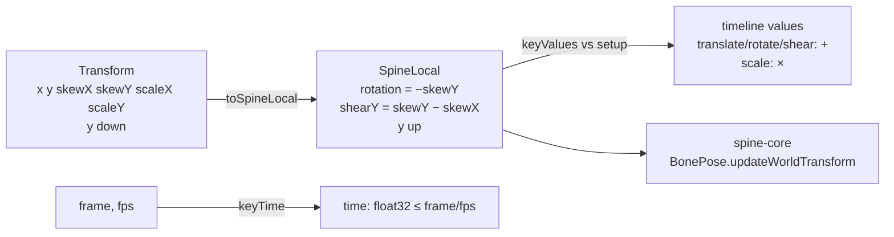
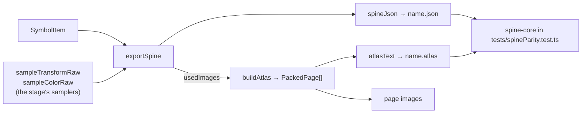
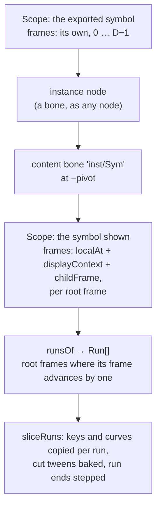
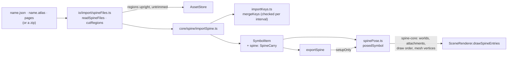
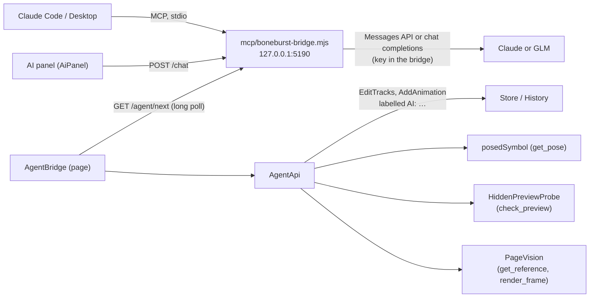
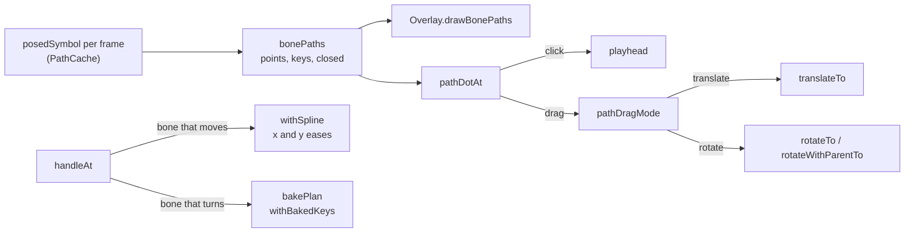
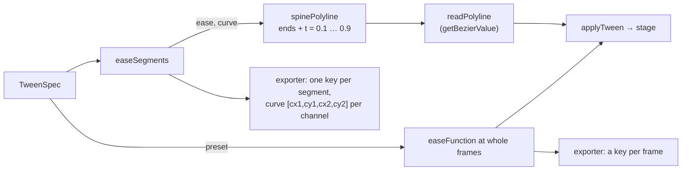

# Animo — architecture

> **BoneBurst note.** This is Animo's architecture document, kept as it was.
> The editor sections (transforms, undo, the timeline, layers, symbols,
> edit-in-place, the library, dialogs, workers) describe this code as it is.
> The DragonBones sections describe code that phase 0 removed or that later
> phases replace; `docs/PLAN.md` says which. Removed in phase 0: the exporter
> and `dbTypes.ts` ("The DragonBones 5.5 contract"), the vendored runtime and
> the preview client ("Vendored runtime", the runtime half of "The preview is
> ground truth"), and `animo-pixi.js` ("Runtime extensions", and the export
> halves of "Motion blur" and "Mask layers"). Still DragonBones-faithful until
> phase 4: the ease sampler ("Easing") and the IK solver ("Bones and IK"), both
> since replaced by Spine's.
> Rewrite each section when the phase that replaces it lands. "The Spine 4.3
> contract" (phase 1) and "The Spine exporter" (phases 2 and 5) are new; "The preview is
> ground truth" and "Vendored runtime" describe the Spine preview (phase 3); "Colour,
> alpha and blend mode" and "Mask layers" describe Spine's tint and clipping (phase 6);
> "Opening Spine files" is new (phase 7), "Checked in Unity" (phase 8), "The AI bridge"
> (phase 9). "Cycles" and "Bone paths" are new (`docs/CYCLE-PATH-PLAN.md`).

How Animo is built, and — mostly — the things in it that fail **silently** when
you get them wrong. This is not a style guide: it is the record of decisions
that look arbitrary until the day they matter. Read the section that covers
what you are about to touch before you touch it.

## Layout

- `src/core/` — pure logic. Imports nothing from `view/`, `app/` or `io/`, and
  touches no DOM. That is what lets the risky parts — transform maths, frame
  algebra, the export contract, the atlas packer — run under vitest in Node.
- `src/app/`, `src/view/`, `src/io/`, `src/preview/`, `src/runtime/` — see
  Architecture below.
- `scripts/` — fixture generators, run with `npx vite-node`, not part of the
  app bundle. They import through the `@/` alias like everything else, which is
  why `scripts` is in `tsconfig.json`'s `include`.
- `tests/fixtures/projects/` — real `.boneburst` files the suite reads. Not scratch
  data: see Commands below.

## Commands

```bash
npm run dev        # Vite on :5181 — open in Chrome or Edge
npm test           # vitest run
npm run test:watch
npm run build      # tsc --noEmit && vite build
npx tsc --noEmit   # typecheck alone; faster than build while iterating
```

One file or one test:

```bash
npx vitest run tests/export.test.ts
npx vitest run tests/export.test.ts -t "skew"
```

`tests/fixtures/projects/stickman.boneburst` is the bone + IK fixture: a stick
figure on four two-bone chains (both legs, both arms) with a front-view `dance`
and a side-view `run`, generated by `npx vite-node scripts/buildStickman.ts` —
art included, drawn from signed distance fields and PNG-encoded with
`node:zlib`, since Node has no canvas. `tests/stickmanRig.test.ts` guards the
two things about it that fail silently: every IK target stays inside
`thigh + shin` (an unreachable target does not throw — the leg straightens and
the foot slides off the ground), and no bone the solver drives is ever keyed.
Regenerate the file rather than editing it.

`tests/fixtures/realProject.ts` loads `tests/fixtures/projects/frog.boneburst` —
eleven symbols, mask links, nested instances, animations hundreds of frames
long, and a **v2** file so the schema migration runs on the way in.
`realProject.test.ts` and `stageState.test.ts` exercise the clipboards, the
layer operations and the export filter against a document somebody actually
authored, which a synthetic two-layer scene never reproduces.

`tests/psdImport.test.ts` has one block that runs against a real `.psd` at
`tests/fixtures/projects/import.psd`. That file is not committed — drop any PSD
there to run it; without one the block skips.

## What this is

A Flash-Professional-style skeletal animation editor that exports **DragonBones 5.5**. Vanilla
TypeScript, no UI framework, Canvas2D for the stage and the frame grid.

## Architecture

### The layering rule

`core/` imports nothing from `view/`, `app/` or `io/`, and touches no DOM. That is what lets the
risky logic — transform maths, frame algebra, the export contract, the atlas packer — run under
vitest in Node with no browser. **Check this holds before adding an import into `core/`:**

```bash
grep -rn 'from "@/\(view\|app\|io\)' src/core/    # must print nothing
```

- `core/math` — `Matrix2D`, `Transform` (the Flash 6-tuple), runtime-faithful `easing`
- `core/doc` — document model, Flash frame algebra (`timeline.ts`), pose evaluation, layer tree, schema
- `core/history` — command pattern
- `core/export`, `core/atlas` — the DragonBones contract and bin packing
- `core/keys` — shortcut chords, the command registry, browser-reserved keys, keymap resolution
- `app/` — `Store`, `AssetStore`, `TimelineOps`, clipboards, `ProjectService`, `Keymap`
- `view/` — shell, dockable panels, viewport, tools, timeline
- `io/` — canvas atlas rendering, zip bundling, file access
- `preview/` — the runtime iframe host and its client

### Transform model

DragonBones composes a transform exactly as Flash does:

```
a =  cos(skY)·scX      c = -sin(skX)·scY      tx = x
b =  sin(skY)·scX      d =  cos(skX)·scY      ty = y
```

A pure rotation is `skX == skY`; shear is the difference. Two consequences the code leans on:

- **Rotation never round-trips through a decomposition.** Adding θ to *both* skew angles rotates the
  linear part and leaves both scales untouched — the parameterisation is closed under rotation, so
  shear survives exactly and multi-turn angles keep accumulating. See `rotateAbout` in
  `view/tools/transformOps.ts`.
- **Decomposition is per column**, not a candidate search: `scaleX = hypot(a,b)`, `skewY = atan2(b,a)`,
  `scaleY = hypot(c,d)`, `skewX = atan2(-c,d)`. Exact, and well-conditioned at ±90°. The only
  ambiguity is the two scale signs, resolved by continuity with the previous value.

**Angles stored in the document are never wrapped into (−180, 180].** Wrapping destroys the
information `rotateFrame.clockwise` is derived from.

**Which way a tween turns** is `Keyframe.rotateDir` (`cw` / `ccw`, absent = as keyed) plus
`rotateTurns`, on the key the interval LEAVES — the timeline's frame menu, Rotate submenu.
`rotationDelta` in `core/doc/timeline.ts` is the only interpreter; the stage sampler and
`frameSplit` both call it, so the stage and the runtime cannot spin opposite ways. Without a
direction `rotateTurns` is signed, which is how older files store it. The same whole-turn offset
goes on both skews, so shear is untouched. `insertKeyframe` inside a directed or multi-turn tween
turns the first half into a plain keyed interval and gives the new key the turns that are left —
spreading the governing key onto the new one, as it used to, spun both halves the full amount.

### Setup mode vs Animate mode

Setup mode edits the **bind pose** (the exported bone origin). Animate mode writes a **keyframe** at
the playhead. The mode is a segmented switch in the stage bar (⇧⌘M, also Modify ▸ Setup Pose Mode),
and Setup gives the stage a `--setup`-coloured edge and a SETUP POSE tag — it changes what every
drag means and used to be visible only as a checkmark in a menu. Everything that moves an object — tools, numeric fields, arrow keys — must go through
`applyTransforms` / `transformAtFrame` in `app/TimelineOps.ts`. Writing `SetBindTransform` directly
is a bug outside Setup mode: the rendered pose comes from the track, so the object appears frozen
while the bone origin silently changes. `NodeSnapshot.local` is named that, not `bind`, for the same
reason. The Bone tool's ⌥-drag (re-aim) did exactly that until it went through `applyTransforms`;
in Animate mode it keys the aim, except on a bone the IK solver drives, which only gets its length.

A transform writes only the TOPMOST selected nodes (`topmostSelected` in
`view/tools/transformOps.ts`): the Selection and Free Transform tools and the arrow-key nudge all
filter through it. A node whose ancestor is also selected already moves with it, and writing it
too applied every drag twice — ⌘A then a drag threw every child off by the full distance. The
nudge moves one SCENE pixel in the arrow's direction on screen (`store.sceneMatrix`, then
`moveBy` into the parent's frame), like a drag; adding to the local x/y moved a node along its
parent's axes, diagonally under a rotated bone. Locked layers are not nudged.

### Undo

Command objects capturing a minimal typed inverse (`core/history/`), not snapshots or patches.
`History` owns the only mutable reference to the `Project`; everything else reads it through `Store`.

- Drags call `beginInteraction(kind)` / `endInteraction()`; merging is decided by the commands
  themselves — the first one applied opens the entry and later commands of the SAME kind fold into
  it. The string given to `beginInteraction` is descriptive only: a stage drag emits
  `SetBindTransform` in Setup mode and `EditTracks` in Animate mode, so comparing against the tool's
  own label left a 100px drag as a hundred undo steps in one of the two modes.
- `History.entries` / `position` / `goTo` back the History panel, and `openedProject` keeps the
  document as it was opened for Revert. Trimming never takes the list below `MIN_ENTRIES` (20).
- `RemoveNodes` keeps the detached subtree, its layer, its tracks and its IK constraints alive inside
  the command. Ids are never remapped.
- **All timeline edits go through one command, `EditTracks`.** The Flash frame operations in
  `core/doc/timeline.ts` are pure `Track → Track` functions, so the command layer only has to
  snapshot and swap tracks — F5, a keyframe drag and a transform write share one undo path.
- **A command replaces VALUES, never modifies them.** A value is a track with everything under
  it (keys, transforms, colours, eases) and a node's `bind`, `pivot` and `color`; the project,
  symbols, nodes, layers, animations and IK constraints are entities that commands change in
  place. The frame algebra copies a key with `{ ...k, frame }`, so the old track (held by an
  earlier `EditTracks`) and the new one share key and transform objects; `ConvertToSymbol`
  shares `bind` between the node it keeps and the one it moves. A command that edits keys
  builds a NEW track and its revert puts the old track object back: `SetPivot`, `SetParent`
  and `SetAnimationDuration` all do. `SetPivot` once translated the shared transforms in place
  (undoing the pivot and then an F5 left keys displaced), and all three later assigned into
  shared key or track objects, which only held up because undo runs strictly in reverse.
- **`core/doc/freeze.ts` enforces it.** `History` deep-freezes the values after every change
  (`settle`), so a write into one throws where it happens. Always on in the tests
  (`tests/setup.ts`, vitest `setupFiles`); a fixture that edits a track after the `Store`
  exists must replace it (`anim.tracks[id] = { ...track, keys: [...] }`). In the app it is
  opt-in, dev builds only: `localStorage["animo.freezeValues"] = "1"`, since a throw halfway
  through a command leaves that edit half done. `deepFreeze` stops at anything already
  frozen, so a command pays for what it created (~0.003 ms on `frog.boneburst`).
- **Redo puts back the SAME objects.** `ConvertToSymbol` and `DuplicateLibraryItem` built their
  symbol, instance and item inside `apply`, so redo minted new ids and every later step in the
  redo stack (moving the instance, renaming the copy) pointed at nothing. Both now keep what
  the first apply made and re-insert it (`reapply`, `made`). `AddSymbol` already built its
  symbol in the constructor.
- **Normalising returns its own inverse.** `normalizeLayerOrder` and `normalizeMasks`
  (`core/doc/layerTree.ts`) change layers the command never named — the order of a group's
  block, a link to a mask that moved below, a mask left with nothing to clip — and return a
  `Normalization`: the layer array they replaced and the mask fields they changed.
  `denormalize` puts it back. Every structural command (`AddNode`, `RemoveNodes`,
  `ReorderLayer`, `SetParent`, `ConvertToSymbol`, `SetLayerMasks`) keeps the record and its
  `revert` calls `denormalize` FIRST, then undoes only its own change. What it replaced — a
  snapshot of every layer's masks, and normalising again on the way back — restored the masks
  but not the ORDER: a group moved above a sibling and undone kept the sibling between it
  and its children, and a layer parented into a group came back at the bottom. The decision
  itself is pure: `maskRepairs(layers)` lists the fields that must change, and
  `normalizeLayerOrder` always installs a new array, so the one in the record is never
  touched again.
- `RemoveNodes` records each removed layer's index in the list AS IT WAS. Indices taken one
  removal at a time gave a group and all its children the group's index, and undo brought the
  children back in reverse z-order. It also normalises now: deleting a mask used to leave its
  targets linked to nothing.
- `tests/structuralUndo.test.ts` applies 40 seeded random sequences of 60 structural
  commands (add, delete, reorder, reparent with and without keeping the pose, mask, convert)
  and checks every undo and redo step against the state recorded on the way. All 40 fail on
  the code before `denormalize`.
- **`mergeWith` must carry the follow-up's payload.** History applies the new command and then
  folds it in; redo later replays only the merged one. `SetDocumentSettings` and
  `SetAnimationDuration` returned `true` without updating their value, so undo + redo after a
  scrub restored the FIRST step of the scrub. A command with no `mergeWith` (as
  `SetNodeMotionBlur` was) leaves one undo step per pointermove. `EditTracks.mergeWith` also
  takes the follow-up's `before` for a track only that step touched, or undo left it edited.
- **A NumberField scrub opens its interaction on the FIRST step only**
  (`PropertiesPanel.scrubStep`). The field reports no start, and `beginInteraction` resets the
  open entry, so calling it on every step — what the colour, motion blur, bone length, IK,
  document and pivot fields did — left one undo step per pointermove whatever `mergeWith` said.
  The history tests call `beginInteraction` once, which is why they never caught it.
- `History.markDirty()` marks the document unsaved with no step behind it — a recovered
  autosave.

### Layers, z-order and groups

A layer *is* an object. A group is a transform-only parent, rendered indented under its
children's rows. Display order and z-order are **one list, walked depth first**, kept in that
shape by `normalizeLayerOrder` after every structural change. The exporter emits
`armature.slot[]` as the **reverse** of `sym.layers`, because DragonBones draws later entries in
front while `layers[0]` is the top row.

An **empty layer** therefore needs something to hold it open: `NodeKind = "empty"`, a
placeholder with no `itemId` that exports as nothing at all — not even a bone. Dropping a
library item on the stage while one is selected converts that node IN PLACE (`SetNodeItem`, the
same command as Swap Instance), so the row keeps its id, name, z-order and mask links instead of
a new layer appearing above it. `App.placeItem` writes the drop position into the **bind** pose,
not a keyframe, exactly as the ordinary drop does — an empty layer that someone has already
keyed is the one exception.

**`Layer.excludeFromExport`** keeps reference art and test rigs out of the file. It is an
export-only concern: `layer.visible` and the stage are untouched, so the layer still draws while
authoring, and the timeline row (struck through, with a badge) is the only place that says so.
`exportSkeleton` builds ONE `excludedNodes` set — excluded layers plus their whole subtree, plus
every `"empty"` node — and consults it in the bone walk, the slot walk, the animation walk, the
IK list and `collectMasks`. Filtering only the slot would leave a bone and a full set of
timelines behind. `uniqueNames` deliberately runs over every layer anyway: filtering there would
renumber a collision suffix the moment a sibling is excluded.

Both flags travel with **Copy / Paste / Duplicate Layer** (`Clipboard.copyLayers` /
`pasteLayers` / `duplicateLayers`, a second clipboard slot beside the stage one). Pasting onto a
single empty layer CONSUMES it, so N copied rows take its place and everything below slides
down. `maskedBy` is remapped through the copied set and `normalizeMasks` drops the rest. The
links are written by one `SetLayerMasks` after the last `AddNode` of the paste, inside the same
transaction — setting them on the layer objects directly (what `remapMasks` did) bypassed the
history, and redo, replaying the `AddNode`s with their normalisation, lost them.

The stage clipboard (`copy` / `cut` / `duplicate` / `paste`) copies what the selection LOOKS
like at the playhead, as Flash copies objects on stage: `snapshotEntries` takes the pose there
as the bind pose, the colour showing there, and the display showing there as the copy's only
display — no tracks. It used to take every track, which is Copy Layers under another name: a
pasted `heart_a` brought its whole animation along.

- **A layer holds one object**, so where Flash adds the object to the current layer, paste adds
  a layer directly ABOVE the selected one. A single selected empty layer is filled in place
  instead (`fillEmptyNode` in `app/TimelineOps.ts`, the same path as a library drop).
- **Roots keep their parent when it exists in this symbol**, so the copy lands beside the
  original, in its group. Under a parent that is gone (another symbol) or a different one (the
  empty layer's own) the pose is re-expressed from the world matrix it was copied at
  (`reexpress`, exported from `commands.ts`). Dropping the parent, as paste used to, made
  `normalizeLayerOrder` move a copy made inside a group to the bottom of the stack.
- **Cut holds the whole subtree**, because `RemoveNodes` deletes the whole subtree. Copy still
  takes only the selection. Cutting a bone used to throw away the artwork bound to it.
- **Paste offsets only the roots of the pasted set.** A child's transform is local to a parent
  that already moved; offsetting it as well put it twice as far away.

Dropping a layer on a row puts it directly ABOVE the row, where the drop line is drawn:
`indexAbove` computes the `ReorderLayer` target, because `ReorderLayer` lifts the layer out
before inserting and the target's own index landed a downward move one row too low.

### The timeline is longer than the animation

The ruler is numbered, and the cells are drawn, to `MAX_FRAMES` (`core/doc/timeline.ts`,
16000 — Flash's own limit; nothing in DragonBones imposes it). The grid used to stop at
`anim.duration`, which meant a one-frame symbol showed sixteen cells and a wall of dead
space: there was nowhere to put the playhead and therefore no way to say "make this
animation a hundred frames long".

- `Store.setFrame` clamps to the TIMELINE's limit, not `maxFrame`. The playhead may be
  parked past the last keyed frame; `maxFrame` stays the animation's own end and still
  governs playback, looping and onion skin. `Playback.stepBy` keeps the arrow keys inside
  the animation — an arrow held down should not wander into the empty frames — but does
  not yank a playhead that is already out there back.
- Q / W (Previous / Next Keyframe, as in Spine; Free Transform moved to ⇧Q) jump to the
  nearest key before or after the playhead (`core/doc/keyNav.ts`): of the selected layers'
  tracks, or with nothing selected every track and the draw order keys. Past the last key
  W wraps to the first, and Q before the first to the last. Animate only.
- `FrameGrid.contentWidth` always leaves a full viewport of empty frames past
  `max(duration, playhead + 1)`, so there is somewhere to scroll to, and the reach follows
  the playhead rather than stopping dead one frame past it.
- The out-of-play shading is drawn BENEATH the rows and the frame separators, or the cells
  it covers stop reading as cells.
- Ruler labels are two passes with an overlap test, seconds first: the two rhythms
  (`fps` and the label step) are unrelated, and at frame 15900 a five-digit number lands on
  top of the `662s` beside it.
- **The frame algebra already handled this.** `insertFrame` / `insertKeyframe` carry
  `endFrame` out to the frame they are given, so F5 at 99 makes 100 frames. The two places
  that did not were `stretchEmptyAnimation` (which added `count` to the duration instead of
  reaching to `from`, on the no-tracks-at-all path) and the F-keys with NOTHING selected,
  which resolved to an empty id list and did nothing at all. Inserting now falls back to
  every layer (`TimelinePanel.insertTargets`); ⇧F5 and ⇧F6 destroy content and still
  require a selection. "Every layer" (`allLayerIds`) includes the layers folded inside a
  collapsed group — taking the visible rows shifted everyone else's keys and left theirs.
- **Go to Frame…** — the frame readout in the transport bar, and the ruler's context menu —
  because reaching frame 400 by dragging the scrollbar is not a gesture to ask anyone for.

### How the frame grid is painted

Flash's grid, and the reason it is drawn the way it is:

- **Cells, not lines.** Each row is a run of rectangles with a one-pixel gutter of
  background between them, every fifth a shade darker (the displayed number, so 5, 10, 15),
  dimmer past the end of the animation. Full-height vertical rules were what made the
  separators look half-drawn — they had to be clipped to *something*, and whatever that was
  ended partway across the panel.
- **Nothing is drawn below the last layer.** No cells, no lines, no extent. The grid used to
  be painted across the whole panel height, which is why deleting a layer left a lit block
  of frames hanging in the empty space underneath: the row was gone, its background was not.
- **A span is one rectangle.** Neighbouring frames of the same kind are filled edge to edge
  with no separator; what divides them is the dark edge line every KEYFRAME carries down its
  left side, plus one closing the track. `drawCells` runs per visible row and builds four
  `Path2D`s for four fills rather than a fill per cell — playback redraws every frame.
- **The playhead is centred on the CELL**, not on `frameWidth`: the cell starts at a rounded
  x and is one pixel narrower than the step, so half of `frameWidth` from the unrounded edge
  put the line a pixel right of centre — invisible on its own, obvious against a grid. Its
  marker in the ruler is a WINDOW over the current cell (1px border, the same colour at 20%
  inside) with the arrow BELOW it, tip on the `headerLine` pixel row. The old triangle sat at
  the top of the header, on the frame number, and was easy to lose.
- `RemoveNodes` recomputes `anim.duration` through `durationFor`: the animation is as long as
  its longest track, so deleting the layer that reached furthest shortens it. With nothing
  keyed at all the stored value still stands, so deleting the last keyed layer does not
  collapse the timeline to one frame.

### Animation length

`createAnimation` makes a **one-frame** timeline, and `durationFor` recomputes
`anim.duration` from the tracks on every edit (`max(endFrame) + 1`), falling back to the
stored value only while nothing is keyed. A layer with no track still draws a full-length
span and its end is draggable — the drag is what materialises the track, through
`ensureTrack`. Defaulting to 24 made every imported symbol claim a second of playback it
never used, and `ensureTrack` then baked `endFrame = 23` in permanently.

Insert/Remove Frames follow the same fiction, or they do nothing on a freshly imported
symbol: a track-less layer is materialised rather than skipped. The exception is an
animation with **no tracks at all** — there the length is the stored `duration` and only
that, so `stretchEmptyAnimation` moves the number instead of inventing a one-key timeline
per layer for the export to carry.

**A GROUP that was never keyed has no frames of its own**, so the frame operations pass
over it (`framesOf` in `app/TimelineOps.ts`): its row only draws the span of what it
holds, and Insert Frames — All Layers used to give every group a static keyframe for the
whole animation. An F6 aimed at the group alone still keys it — that is how a group gets
animated — and a keyed group then follows the frame operations like any other row.

**The implicit keyframe at 0 is draggable too.** A layer with no track shows one, and
dragging it is how an instance just dropped on the stage starts at frame 10 instead: the
drag materialises the track (`beginKeyDrag` with `ensureTrack`), exactly as the span-end
drag does. A group shows no implicit key and has none to drag.

**A new keyframe holds; it does not tween.** `createKeyframe` writes `TWEEN_NONE`: with
`linear` there, the key a fresh track starts with tweened into the first F6 after it and
the object slid across an interval nobody had asked to animate. F6 INSIDE a tween still
inherits the governing key's ease, which is what splitting a tween means.

**A press on the empty part of the timeline deselects the frames** — below the last row
in the grid, or under the rows in the layer list — as a press on the empty stage does. It
used to scrub from there, which moved the playhead by surprise.

### Cycles

A **cycle** is an animation that loops forever on Spine's timing: `playTimes === 0 &&
endsAtLastFrame` (`isCycle`, `core/doc/cycle.ts`). Nothing else is stored. Its last
frame, the **join** (`seamFrame`), is frame 0 again: the runtime shows it and then
frame 0, so the two must be the same pose or the loop hitches.

- **Cycle on** (`cyclePlan`, `SetCycle`, one undo step; the animation options menu and
  the ruler's context menu, `timeline.cycle`): an animation on Flash's timing grows by
  ONE frame and the new last frame is the join. It played its last frame and then frame
  0 before, and still does, so the loop plays as it did and the exported length in
  seconds is unchanged. Every track that reaches the end and has no key at the join gets
  frame 0's pose there. A key already at the join is the user's and stays; a track that
  stops earlier stays partial. The seam check reports either.
- **Cycle off** sets `playTimes = 1`: keys and timing stay. `playTimes` is not in the
  Spine file (a game loops by `setAnimation`); it drives the editor's playback. Turning
  `endsAtLastFrame` off instead would have changed the export by a frame.
- **Close Loop** (`seamKeys`, `timeline.closeLoop`) keys frame 0's transform, colour and
  display at the join on the selected layers, or every layer. It replaces a key already
  there. Angles keep the whole turns the track makes by the join: a bone that spins once
  ends at frame 0's angle + 360, not back the way it came.
- **The seam check** (`seamGap`) compares POSED frames, not keys, so a bone the IK
  solves shows a gap when its target does not close, and a node without keys never
  does. `own` compares each node in its parent's frame, so a hip that does not close
  marks the hip and not every child under it. The timeline draws a ↻ over the join's
  column and an orange dot on each row that does not close (`FrameGrid.drawSeam`,
  measured once per `History.revision`, tooltip with the gap); the animation picker
  lists a cycle as `name ↻`.
- `tests/cycle.test.ts`; `tests/spineParity.test.ts` turns the stickman's animations
  into cycles and checks the length in seconds and that the join plays as frame 0.

### Offset keys

Spine's Offset tool: layers' keys moved in time, each by a step, or with Stagger the first row
by 0 and each next by one more step: overlapping action down a chain (`core/doc/offset.ts`).
Timeline ▸ animation options or the layer menu ▸ Offset Keys… (`timeline.offsetKeys`) on the
selected layers, top to bottom as the rows show, or every layer; one `EditTracks`.

- **In a cycle** a track that runs from frame 0 to the join wraps (`offsetTrack` ▸ `wrapped`):
  keys are cut in at the join and where the wrap falls (`cutKeepingEase`, so nothing moves),
  each key goes to (frame + step) mod the loop, and the join is frame 0's pose again. A bone that
  turns a whole number of times over the loop keeps turning the same way: the keys that come
  round start that many turns back.
- **Otherwise the track keeps its span**: moved later, its first pose holds (a stepped key)
  until the moved keys start and what passes its end is cut there; moved earlier, what passes
  its start is cut there and the last pose holds to the end. So an animation's length never
  changes.
- Only layer tracks move; IK, transform, deform, sequence and event keys stay.
  `tests/offset.test.ts` samples every frame against the old track shifted;
  `spineParity` ▸ "keys offset" plays a staggered cycle and a shifted one-shot through
  spine-core. AI: `offset_keys`.

### Key buttons

The timeline's Key button (`doKeyProps`, `core/doc/keyButtons.ts`) keys the selected layers at
the playhead without moving anything (`keyChannelAt` per property, the interval it cuts eased
in two). A click keys **what changed**: each property (rotate, x, y, scale, shear) whose value
there is not the setup pose's (`changedProps`), so a first pose is keyed without keying what
was left alone. Hold or right-click for Key All and Key Rotate / Translate / Scale / Shear,
Spine's groups (`KEY_GROUPS`). `timeline.keyChanged`, `timeline.keyAll`; Animate mode only.
Auto key off still edits the governing key as Flash does, so "changed" is measured against
the setup pose rather than pending edits, which this editor does not have. AI:
`key_properties`.

### A selected bone narrows the timeline

As Spine's dopesheet does: select a bone on the stage or in the Tree and the timeline shows
only the selected nodes' rows, flat (`focusRows` in `core/doc/layerTree.ts`); a selected mesh
does the same, followed by its Deform row (Meshes); select nothing, or only pictures that are
not meshes, and every row is back. The layer column and the frame grid both take their
rows from `timelineRows` (`view/timeline/rows.ts`), so they cannot drift apart by a row. The
rows follow `ui.timelineFocus`, not the selection: `TimelinePanel` copies the selection into it
only when the selection changes from outside the timeline, because a click on a row or a frame
in there selects that node too, and the list would collapse under the pointer. The toolbar's
Sub Tree button (`timeline.focusSelected`) turns it off.

Each focused bone is followed by its property rows, Rotate, Translate X, Translate Y, Scale
and Shear (`LayerRow.prop`), edited as in Spine: a press picks a key (shift adds), a drag
moves the picked keys, Delete removes them (before it would delete the bone: `edit.delete`
asks `TimelinePanel.deletePropKeys` first), and the row's menu keys the property at a frame.
A key here still holds the whole pose, so a property is a CHANNEL over those keys
(`core/doc/propertyKeys.ts`): its value at each key and the ease each interval gives it
(`Keyframe.eases`, one per leaf: rotation, x, y, scaleX, scaleY, shear). Its own keys
(`channelKeys`) are the keys that list it in `Keyframe.keyed` (schema 15), or, on keys that
list nothing (every older file), the ones where it changes; across keys another property
needs it is read as one ease through its value at every whole frame. `setChannel` rewrites one
channel: it cuts in the whole keys the channel needs without moving anything else
(`cutKeepingEase`, which splits each ease with `splitTween`), gives every whole key the
channel's value and the part of its ease that interval covers, records `keyed`, and drops the
keys left keying nothing (`withoutRedundantKeys`). Rotation is read unwrapped (`unwrapTurns`),
shear as skewY − skewX so turning keeps it. A pose set on the stage at a key that lists its
properties adds the ones it changed (`withTransform` in `core/doc/keyed.ts`, through
`withKeyframe`, `mapKeyTransforms` and `withKeyTransform`), so the lists cannot go stale.
`tests/propertyEdit.test.ts`: every stickman track rewritten as it was samples the same, and a
move, delete or key leaves every other property the same at every frame. The export is
unchanged: it samples the whole keys, so a channel moved alone plays as it does on the stage.

### Draw order keys

Spine animates the order slots draw in; so does the editor (`Animation.drawOrder`, schema 16,
`core/doc/drawOrder.ts`). A key holds a whole order of the symbol's drawing layers (not groups,
not bones), back to front, from its frame to the next key; a key with no order goes back to the
setup order, the layer stack. A whole order rather than Spine's offsets, so a key survives
layers being added, removed or restacked (`withOrder` puts a layer it does not list beside the
one below it in the stack); offsets exist only in the file (`toOffsets`, `fromOffsets`, checked
against spine-core's `SkeletonJson` in `tests/drawOrder.test.ts`).

- **Units.** A mask and the layers it clips move as one (`drawUnits`): Spine clips from the
  clipping slot to its `end` slot, so they must stay together. `orderAt` places each unit where
  the first of its layers is in the key's order.
- **Stage.** `evaluateSymbol` gives the drawing layers' places in its entries the order in force
  (fractional frames included); an opened Spine file's rig is built once per structure, so
  `applyRig` sorts the runtime's draw order the same way instead of baking keys into it.
- **Export.** At the top level each layer's run of slots (its own and a nested symbol's,
  flattened under it; a mask with its layers) is a block; a key lays the blocks out in its order
  and writes the offsets (`drawOrderTimeline`). Keys the document holds replace a carried
  `drawOrder`. Nested symbols' own keys are not exported (one skeleton, one timeline).
  `tests/spineParity.test.ts` plays restacked layers, a mask group and nested symbols.
- **Import.** An opened file's keys become the document's when every one lands on a frame and
  reads as an order of known slots; otherwise the timeline is carried as before.
- **Editing.** The timeline's **Draw order** row sits under the ruler (`FrameGrid.stripHeight`,
  `bodyTop`; the layer column has its label): click picks a key, shift adds, drag moves,
  Delete removes (`edit.delete` asks `deleteDrawOrderKeys` after the property keys), and its
  menu keys the order in force or the setup order at a frame. Modify ▸ Draw Order (and the
  layer menu; ⌘↑ ⌘↓, ⌘⇧↑ ⌘⇧↓) moves the selected layers at the playhead and keys it there,
  in Animate only (`doReorder`, `reorderAt`); a selected bone moves the pictures on it
  (`reorderTargets`). In Animate, dragging a layer row onto another keys the draw order
  too, the dragged layer's pictures just in front of the row's (`dropOrderAt`,
  `placedInFront`), as dragging in Spine's tree does; it never restacks or re-parents
  there, and Setup keeps restacking. The AI's `key_draw_order` does the same; `get_animation` lists the keys.

### IK keys

An animation keys an IK constraint's mix, bend and softness, as Spine's `ik` timeline does
(`Animation.ik`, schema 17: per constraint, keys `{ frame, mix, bendPositive, softness?, tween? }`;
schema 18 made `softness` a field of the constraint and the key, moving an opened
constraint's out of `spine`).
The pure rules are in `core/doc/ikKeys.ts`: `ikPoseAt`, `withIkKey`, `moveIkKeys`,
`deleteIkKeys` and `withIkTween`, tested in `tests/ikKeys.test.ts`.

- **Spine's semantics.** Before the first key the constraint's own weight and bend hold
  (the runtime's setup branch). From a key on, the mix and softness tween to the next key by
  the key's tween and the bend is the key's, stepped. A key without a softness has the
  constraint's; `withIkKey` leaves off one equal to it. A tween is linear (absent), stepped (`none`) or
  one cubic (`curve`, 4 numbers; "smooth" is 0.42, 0, 0.58, 1), which is what one Spine
  key's curve holds. `applyTween` samples the cubic the way the runtime does.
- **The stage.** `applyIk` takes the mix and bend from `ikPoseAt` in Animate; a mix of 0
  skips the solve, as the weight did. An opened rig (`spinePose.ts` ▸ `applyRig`) sets the
  constraint's `pose.mix` and `pose.bendDirection` after the carried animation, the bend
  inverted as the exporter writes it.
- **Export** (`ikTimelines`): one `ik` timeline per constraint of the exported symbol, the
  bend inverted. Every key writes its softness (the constraint's when it has none) and the
  compress and stretch an opened constraint carries: a key without them sets them back to
  Spine's defaults. A cubic writes 8 numbers, the same cubic over the mix and over the
  softness. Spine's `readCurve` reads the softness half too, and with 4 numbers that half
  is NaN. A constraint keyed in the
  document replaces a carried timeline of the same name. A nested symbol's IK keys are not
  written, and the export warns.
- **Import** (`ikKeysOf`): a file's `ik` timeline becomes keys when every key lands on a
  frame, its compress and stretch are the constraint's, and each curve's mix and softness
  halves are one cubic (a half whose value does not change takes the other's). Otherwise
  that constraint's timeline is carried. On the samples, spineboy-pro's nine and both of
  Stretchyman's convert; seven of raptor-pro-and-mask's twelve.
- **Checked.** `spineParity` plays the stickman with keyed mixes (linear, stepped, smooth),
  flipped bends, and a constraint softness with keyed softness against spine-core; a stage
  that ignores the softness fails it. `spinePose` and `spineImport` cover the samples'
  converted keys. A stage that ignores the keys fails the parity case.
- **The timeline.** An IK row (`LayerRow.ik`, `focusRows`, `LayerList.ikRow`,
  `FrameGrid.drawIkRow`) draws a diamond per key in the IK target colour, joined where the
  mix tweens. A key where the bend flips is hollow.
  - Where it shows: under the target, for each constraint the animation keys; in the
    focused view, under the target (or the first chain bone shown), after the property
    rows.
  - The row also draws the mix in force at each frame as a band rising from its bottom
    (full height = 1), so a drag on it shows what it sets.
  - Editing: a press picks a key (⇧ adds), and Delete removes the picked keys. A drag goes
    the way the pointer goes first (`ikDragAxis`):
    - sideways moves the picked keys in time (`SetIkKeys`, kind `timeline.ikMove`);
    - up or down sets their mix, each from its own value, 80 px for the full range, ⇧ a
      quarter as fast (`withIkMixDragged`, kind `timeline.ikMix`); the value shows beside
      the key.
    - On an empty cell, sideways scrubs and up or down keys the mix in force there and sets
      it, in one undo step with the key.
  - Right-click gives Key IK Here, Linear / Stepped / Smooth, and Delete.
  - Q / W stop on IK keys too.
- **Properties ▸ IK in Animate** keys at the playhead: Bend flips the bend in force there,
  Mix and Softness key their value (a scrub is one undo step), and Key keys them as they
  are. Softness shows for a two-bone chain only. The section
  shows the values at the playhead. Setup edits the constraint's own weight, bend and softness.
- A path drag through the target (Bone paths) treats a constraint whose keyed mix is 0 at
  that frame like weight 0: the bone's own rules apply. Dragging the knee across the leg
  keys the bend flipped at that frame, holding until the next IK key, as Spine's bend does.
- The AI's `key_ik` keys a constraint's mix, bend, softness and ease at a frame, or deletes
  a key.
  `get_animation` lists the keys under `ik`.

### Events

A symbol's events and the frames its animations fire them at, as Spine's skeleton `events`
and animation `events` timeline (docs/EVENTS-PLAN.md). `SymbolItem.events: EventDef[]`
(name, int, float, string, audio, volume, balance; names unique) and `Animation.events:
EventKey[]` (frame, name, and the values it overrides), schema 19. Several keys may share a
frame and fire in list order. The pure rules are `core/doc/events.ts` (`eventValues`,
`withEventKey`, `moveEventKeys`, `deleteEventKeys`, `withEventKeyValues`, `renamedEvent`,
`withoutEvent`, `uniqueEventName`, `eventDefsFromSpine`), tested in `tests/events.test.ts`.
Commands: `SetEventKeys` (one animation's keys; a drag merges) and `SetEvents` (the list,
with the keys a rename or delete changed).

- **Two spine-core 4.3.13 behaviours the export writes around**, both found by the parity
  test (`spineParity` ▸ events), which fires every key through spine-core frame by frame:
  - an event's missing `volume` reads as 0 (`Event.volume = 0`), not the 1 Spine's docs
    give, so a sound left at volume 1 played silent: an event with a sound always writes
    `volume` and `balance`;
  - a key's missing `balance` reads as the event's VOLUME (`SkeletonJson`: "balance",
    setup.volume): a key of an event with a sound always writes `balance`.
- **Export** (`eventDefsOf`, `eventTimeline`): the exported symbol's events and each
  animation's keys; an event key extends the animation's end like any key; keys replace a
  carried `events` timeline. A nested symbol's event keys are not written, with a warning.
- **Import** (`eventKeysOf`): the file's events become the list; an animation's keys
  become the document's when each lands on a frame and names a known event, else the
  timeline is carried. A key keeps only what differs from its event; a key of an event with a
  sound and no balance gets the event's volume as its balance, which is what spine-core
  played. Schema 19 moves an older document's carried `spine.events` to the list.
- **The timeline** has an Events row under Draw order (`FrameGrid.eventStrip`,
  `stripHeight` is two rows): a flag on each frame that fires events, the event's name
  beside it while it fits before the next flag, a count when several share the frame. Under
  the flags, each keyed sound's waveform from its frame for its length, scaled by the key's
  volume (`waveStrip`; `eventSounds`, `waveformPeaks` and `peakBetween` in
  `core/doc/waveform.ts`). `view/timeline/waveforms.ts` decodes each sound once per blob in an
  `OfflineAudioContext` and redraws when it is ready. A
  press picks the frame (⇧ adds; `ui.eventFrames`), a drag moves the picked frames' keys
  (kind `timeline.eventMove`), Delete removes them, and right-click offers Add Event Here ▸
  each event or New Event… (the event and its key in one undo step). Q / W stop on event
  keys.
- **The Events panel** (`view/panels/EventsPanel.ts`) lists the events (name, int, float,
  string, sound, and volume and balance once there is a sound; New Event, Delete) and,
  with one frame picked on the row, that frame's keys: each field blank fires the event's
  value, shown as the placeholder. A field committed while the panel re-renders is safe:
  a store change during typing renders on blur.
- **Sounds** (`app/SoundStore.ts`) live outside the document like images: the event holds
  the path (`soundPath` keeps it inside the folder), a save writes each sound an event names
  under `sounds/` in the `.boneburst` (`manifest.sounds`), and the export writes it into
  `audio/` beside the skeleton, at that path. The Events panel's Sound list adds files.
- **The Preview** lists the events the runtime fires while playing (an `AnimationState`
  listener; a seek does not fire), and plays their sounds at their volume and balance
  (Web Audio, decoded once per file). Its queue (the film button) plays animations one after
  another, each crossfaded into from the one above over its mix: `setAnimation` for the
  first, `addAnimation` with `setMixDuration(mix, 0)` for each next, so it starts its mix
  before the previous ends; only the last loops, while Loop is on (`preview/queue.ts`,
  `queueSteps`; `tests/previewQueue.test.ts` plays one through spine-core). Ticks are sent
  only while the last one's animation plays, so the editor's playhead follows it.
- The AI's `define_event` adds, changes, renames or deletes an event; `key_event` fires one
  at a frame with overrides, or removes it. `get_rig` lists the events and `get_animation`
  the keys.

### Graph editor

The Graph panel (`view/panels/GraphPanel.ts`, a tab beside Timeline; docs/GRAPH-PLAN.md) shows
the first selected node's property values over time, and the mix of each IK constraint it takes
part in, as Spine's Graph view does. It edits the same channels as the timeline's property
rows: `channelKeys` reads a property as `{ frame, values, eases }` per key, one value and ease
per leaf (Rotate, X, Y, Scale X, Scale Y, Shear), and every edit is written back with
`setChannel`, so no other property moves. An IK mix is a channel of the same shape, written
back to `Animation.ik` with each key's bend and softness kept. The rules are pure in
`core/doc/graphEdit.ts`, tested in `tests/graphEdit.test.ts`.

- **Curves are what the runtime plays**: `graphSamples` reads `sampleChannel` (which uses
  `applyTween`, the runtime's polyline) every quarter frame and at each key.
- **One curve shows its own values on the axis; several are each scaled to their own range**
  (0–100%), as Spine's normalized view. While a drag runs, each curve keeps the range it had at
  the press, or the view would rescale under the pointer.
- **Handles**: an interval's ease as one cubic (`cubicOf`: a custom cubic as it is, linear as
  the straight cubic, a preset or a several-piece curve fitted with `fitCubic`, none for a
  stepped key). The handles of the intervals beside each picked key show; dragging one
  (`withHandle`) writes a custom cubic into that leaf's ease only (`Keyframe.eases`): time
  clamped to the interval, value a fraction of the change within `CURVE_Y_LIMIT`. An interval
  whose ends are equal cannot bend (the editor's eases are fractions of the change), so its
  handles only slide in time.
- **Keys**: a press picks a point (⇧ adds), a drag moves the picked keys whole frames across
  and each curve's units up (⇧ held: the larger axis only; `moveGraphKeys`, landing on a key of
  the channel replaces it). Delete removes them (`deleteChannelKeys`, also through Edit ▸
  Delete); a double-click on a curve keys it there (`keyChannelAt`, or an IK key). Each drag
  is one undo step from the track as it was at the press.
- **View**: the wheel zooms time about the pointer (⌥: values), the middle or right button
  pans, F or Fit fits the animation. A view fitted while the panel had no size (a tab never
  shown) fits again once it has one. Chips switch curves on and off; a property without keys
  is off until switched on.

### The timeline fills its panel, and only the layers scroll

The frame grid is a CANVAS with no scroll of its own, and the horizontal bar is an
overlay element rather than the canvas's overflow, so neither axis is wired by the
browser and both were half-connected:

- the wheel over the grid was swallowed (only `deltaX` was handled), so a thirty-layer
  rig scrolled only while the pointer sat on the NAMES. The grid now forwards `deltaY`
  through `onWheelY` to `LayerList.scrollByY`, which is the panel's one real scroll and
  drives `setScrollY` back;
- `hScrollInner.style.width` was refreshed in `syncReadout`, which runs on store events —
  and the zoom slider emits none, so widening the frames never grew the scroll content
  and the bar simply never appeared. `FrameGrid.draw` now ends with `cb.onGeometry()`,
  the one place every route that changes the geometry passes through.

`syncHScroll` pushes the thumb only when `scrollX` differs from what it last pushed, not
whenever the two disagree: a `scroll` event arrives asynchronously, so a draw queued by
something else — playback runs one per frame — lands between the drag and the event and
would shove the thumb back under the pointer.

The layout the two scrolls assume — a full-height timeline whose layer list is the only
thing that scrolls — rests on two CSS rules, and both look removable until the panel is
short:
`.pbody > .tl { height: 100% }` and `.tl-main { grid-template-rows: minmax(0, 1fr) }`.
The panel body scrolls (`overflow: auto`), so without the first the timeline sizes itself
to its layers and the transport bar — Play, the animation picker, the speed slider — is
pushed below the fold on any rig with two dozen rows. The second is the grid's automatic
minimum size: a grid item refuses to shrink below its content, so the row would stay open
at the full height of the layer list and there would be nothing left for `.tl-llist` to
scroll. The layer list's native scroll is the only vertical scroll in the panel, and it
drives the frame grid through `onScrollY` -> `grid.setScrollY`.

### Frame ranges and the three clipboards

A frame selection is a rectangle and needs no state of its own: `Store.selection.frames` holds
`"<nodeId>:<frame>"` strings, exactly what a drag across the grid produces. **Select All Frames**
(⌥⌘A, also the layer context menu) builds the same rectangle over every selected layer, because
on a long animation the last frame is a scroll away and a range select that has to reach it is a
drag into the edge of the panel.

The F-keys act on that range when there is one and on the playhead otherwise
(`TimelinePanel.applyRangeOp` / `allLayersFrameOp`): F5 / ⇧F5 insert or remove as many frames as
the range is wide, F6 / ⇧F6 convert the range to keyframes or clear it, and **⌥ widens any of
them to every layer**. Each is ONE `EditTracks` across all the layers it touches, so a five-frame
insert on four layers is a single undo, the way Flash behaves.

What the frame algebra does at the edges, each pinned in `timeline.test.ts`:

- **⇧F5 on a keyframe whose span is that one frame removes the keyframe** with the frame, and
  the key after it moves in. It used to keep the key and drop the next one, which on the LAST
  frame of a track left a key past `endFrame`.
- **⇧F5 past a track's `endFrame` is a no-op for that track**, so ⌥⇧F5 no longer shortens the
  layers that end before the range. `doRemoveFrames` keeps the removals that did happen when a
  run reaches past the end; it used to drop the whole track edit.
- **`moveRange` tells the moving run apart by identity.** Testing `frame - delta` against the
  range also matched the key being landed on, so dropping a key onto another left two keys on
  one frame. `validateProject` repairs files saved with such pairs.
- **A keyframe drag computes every step from the track as it was at pointerdown** (the `base`
  argument of `doMoveKeyframes`) with the total delta. Moving the live track step by step
  overwrote every key the dragged one merely passed over.
- F6 mid-tween samples the colour whenever the track carries any, not only when the governing
  key does: a span fading from neutral into a coloured key used to cut to neutral.

`FrameClipboard` is the **third** clipboard slot, beside the stage one and the layer one, and
⌘C / ⌘X / ⌘V pick between them by what is selected — `App.copy` prefers a frame range over stage
objects. A pointer press on the stage or on a layer row clears the frame range
(`Store.clearFrameSelection`); it used to survive both, so ⌘C on an object just clicked copied
the frames touched before it.

A frame carries its CONTENT, as in Flash: each copied row keeps the node it came from (its
displays, colour, blend mode), so pasting onto an empty layer fills it and pasting onto a layer
that shows something else adds the copied artwork to that layer's display list (see Layers with
several displays). A rectangle over several rows pastes into the target row and the visible rows
below it, and `addRow` creates layers under the last one when the stack runs out — the source
node cloned, its parent kept when it exists here, a track that starts at the paste frame so the
layer is not on stage before it. An empty layer nobody keyed counts as having no frames. A row
that shows nothing at the start of the copied range starts with a blank key, and one whose track
ends inside it gets a blank key where it ended.

**Paste Frames inserts** (`pasteRun` in `core/doc/timeline.ts`, mode `"insert"`): what lies from
the paste frame on moves right by the pasted length, after an F6 there when it falls mid-span so
the moved content starts with the pose it had. With several frames selected on the target, those
frames are removed first — Flash's "replace the selection". **Paste and Overwrite Frames**
(`edit.pasteOverwriteFrames`, frame menu and Edit menu, no default chord) replaces what lies
under the run and moves nothing. Every row is one `EditTracks` in one transaction.

Two more things it exists for:

- A range starting **mid-tween** carries no keyframe of its own, so `copy` bakes what is SHOWING
  at `from` as frame 0 of the clip — through `insertKeyframe`, so it is the key F6 would cut
  there: sampled colour, and only the turns still to come. Copying the governing key's
  `rotateDir`/`rotateTurns` made the pasted run spin the whole amount again.
- A layer with **no track** still has a pose — its `bind` transform — and copies as one key.

Paste and Overwrite is what makes "copy frame 0, paste over the last frame" close a loop
cleanly; Paste Frames would push the last frame one further.

**A frame selection can be DRAGGED somewhere else** — "to a new location on the same layer or
to a different layer", the one line Animate's timeline documentation spends on it. A press
INSIDE the selection picks the rectangle up instead of starting a new one (`beginFrameDrag` in
`FrameGrid`); ⌥ at any point during the drag copies rather than moves. The document is edited
once, on release — `FrameClipboard.dragTo`, a cut and a Paste and Overwrite in one transaction,
so it is one undo step — and what follows the pointer meanwhile is an outline. Two things it
does NOT share with Cut Frames: the frames it leaves behind become genuinely EMPTY (`cutRange`
puts a blank key at `from` where a key before the range would otherwise keep showing, and drops
the span when the range reached `endFrame`), and the ⌘C clipboard is untouched, because a drag
is not a copy. The rectangle is clamped to the rows that exist — a frame drag never creates a
layer, unlike a paste — and a press that goes nowhere is an ordinary click on the cell.
A single cell is not a span: it keeps the keyframe drag, which is the gesture for it.

### Onion skin

Animate's model: the ghosts are the frames between a START and an END marker drawn on the
timeline ruler. `core/doc/onion.ts` is pure and canvas-free so the arithmetic can be tested
(`stageState.test.ts`):

- `onionSpan` — the markers FOLLOW the playhead at `prefs.timeline.onionBefore/After`, or are
  ANCHORED at absolute frames (`ui.onionAnchor`, session state like the guides). Clamped to the
  animation either way. `Store.onionSpan` is the one reader; `Store.setOnionSpan` writes back
  whichever of the two is in force, so a drag on following markers is stored as two distances
  and the next session starts with the same range.
- `onionFrames` — every frame of the span except the current one (the renderer draws that
  opaque afterwards; a ghost under it would only darken it), farthest first so the nearest
  paint on top, `opacity · (1 − falloff)^(d − 1)`, tagged past or future. "Keyframes only"
  filters by a predicate but distance still counts frames.
- `dragMarkers` — one marker, ⌘/Ctrl both symmetrically, ⇧ slides the range. A FOLLOWING range
  must keep containing the playhead, because what it stores is distances from it.

`FrameGrid.drawOnionMarkers` draws the band and two brackets in the past/future colours (knob
filled = anchored), and the ruler's pointerdown hit-tests them BEFORE scrubbing, as the stage
does for guides. They show whenever something reads them: the onion skin or Edit Multiple
Frames.

**On a cycle the markers wrap round the join** (`Store.onionPeriod`: a cycle, markers
following the playhead, Edit Multiple Frames off). The span is then UNWRAPPED (start
below 0, end past the join), at most `period − 1` frames each side so it never reaches
the playhead again; `onionFrames` wraps each frame into the loop, never draws the join
(it is frame 0), and draws a frame reached both ways round once, at the nearer
distance. The ruler shows the span as one band or two (`wrapSpan`), the start bracket
on the first, and `dragMarkers` lets following markers run past the ends. Anchored
markers and Edit Multiple Frames keep a real range: Edit Multiple Frames edits keys in
it.

`view/viewport/ghost.ts` paints a ghost: Canvas2D can fade a draw but not colour one, so the
frame is drawn into a scratch canvas, tinted with `source-atop` (or reduced to a one-pixel ring
for Outline: the silhouette stamped at eight offsets minus itself), then composited once at the
ghost's alpha — overlapping parts of one frame do not darken each other. **Locked layers are
never onion-skinned** (Animate's rule, and the way to keep a layer out of it). Animate mode only.

The toggle is `ui.onionSkin`; there are buttons in the layer-list header AND the timeline
footer, so each follows the STATE on the `stage`/`ui` channels instead of flipping a local flag.
Press-and-hold or right-click on either opens the options (`view/timeline/onionButton.ts`; the
click that ends a hold is swallowed in the capture phase or it would also toggle). The popup is
`App.onionPopup`, built from the same command handlers as View ▸ Onion Skin Options and the
ruler's context menu. `onionButton.ts` takes an `openMenu` callback rather than importing
`Dock`, because `Dock` touches `window` at load and `LayerList` is imported by Node tests.

### Edit Multiple Frames

The toggle (`ui.editMultipleFrames`, footer button beside the onion, View menu) makes every
keyframe between the onion markers editable at once — the ball that bounces at five heights
moves 200px sideways in one drag, one undo step, heights untouched.

- **One edit, re-applied.** A tool still computes what the node at the PLAYHEAD should become.
  `core/math/multiEdit.ts` turns that before/after pair into the change itself, in the parent's
  space (`deriveEdit`), and `applyFrameEdit` applies it to each key: a move adds the same vector,
  a rotation adds θ to both skews and swings every origin about the same point (no
  decomposition — shear and multi-turn angles survive), anything else is the affine
  `M1·M0⁻¹` through `fromMatrix` with each key's own values for sign continuity. So the
  instances behave as ONE object, the virtual group.
- **Nothing outside the range moves.** `isolateRange` (`core/doc/timeline.ts`) F6s keys at
  `from`, `to`, `to + 1`, and at `from − 1` when that interval tweens into the range; then
  `mapKeyTransforms` edits `from..to` with new objects. `editableSpan` clips the range to the
  track's first key and `endFrame`, or a key before the first would make the layer appear.
  `timeline.test.ts` samples every frame before and after, eased tweens included.
- **An eased interval is cut with `cutKeepingEase`**, not a bare F6: F6 gives both halves the
  WHOLE ease, which moved every frame of the interval on either side of the range (60px on a
  500px ease-in). `splitTween` (`core/math/easing.ts`) gives each half the part of the curve it
  now covers — a quad stays a scalar when the file's hundredths still land on every frame,
  anything else becomes a curve — so a range edited in the middle of an ease turns those
  spans into `custom` curves. Where no ease can express a half (an elastic cut right on its
  overshoot, a half with no progress) it falls back to F6.
- **`applyEdit`** in `app/TimelineOps.ts` is what the Selection and Free Transform tools, the
  arrow-key nudge and the Properties panel call: `applyTransforms` normally, the range with
  the toggle on. Paste, placing an item, the Bone and IK tools stay on `applyTransforms` — they
  set a pose rather than edit one, and a bone the solver drives must never be keyed.
- **A drag edits the keys as they were at pointer-down**, like `doMoveKeyframes`: the tool's
  `next` is computed from its pointer-down snapshot, so applying it to the live, already edited
  keys would compound on every pointermove. `History.interactionSerial` (bumped by
  `beginInteraction`) tells one drag from the next; the base tracks are cached per serial. The
  quantise-on-release write comes out right for free: it is one more step from the same base.
- **Every instance is on stage and pickable.** With the toggle on, the Viewport draws the
  frames of the range OPAQUE and keeps their poses; `editPoses()` feeds the hit test, the
  marquee, `buildGizmo` (several instances → the axis-aligned multi box, so Free Transform takes
  its group path) and a dashed group box around them. `editPoses(true)` evaluates instead of
  reading the last render: the Properties panel syncs on the store event that SCHEDULES that
  render, so the cached poses are one edit behind.
- **Only the frames that show the layer count** (`instancesOf` in `view/tools/gizmo.ts`),
  the playhead's own included. A layer that starts inside the range stretched the box, and
  the Properties X/Y/W/H, to its bind pose on frames where nothing is drawn. The playhead
  used to be excepted, which is what put an EMPTY GIZMO — the 40px bone box at the stage's
  origin — on a layer keyed from frame 7 while the playhead sat on 1..6; `Overlay.drawSelection`
  skips those entries for the same reason. The panel's `isGroup` counts the same instances,
  so it agrees with the gizmo about "one object or a group".

### Multi-selection in the Properties panel

Several nodes — or one node shown in several frames by Edit Multiple Frames — are edited as one
object, as in Flash: X/Y/W/H are the world bounding box (`selectionBounds` in
`view/tools/gizmo.ts`, the same function the multi transform box uses), not `–`. X/Y move the
whole group, W/H scale it from the box's top-left corner, and Rotate/Scale/Skew are the FIRST
node's values reached by turning or scaling the group about the box centre, so a set of
differently rotated objects keeps its arrangement. The group (bounds and snapshots) is captured
at the first step of a scrub and every step is computed from it; the scrub is ONE interaction
from the first step to the commit — it used to call `beginInteraction` on every step, which
also gave Edit Multiple Frames a new base per step.

### The preview is ground truth

`preview/PreviewSession.ts` exports the project in memory and feeds the **actual** Spine
runtime (spine-pixi-v8 4.3.13 on PixiJS 8.21, vendored) the exact bytes that would go to disk:
the skeleton JSON, the `.atlas` text and the page images. It is not a second renderer. If
the stage and the preview disagree, the export is wrong. An excluded layer therefore disappears
from the preview too, which is the point rather than a side effect.

The session owns the export and the 250 ms coalescing; its VIEWS own the iframes. There is one
now, the Preview panel: the stage's Play mode (the runtime over the whole stage) was removed, the
Preview and the timeline's own playback cover it. The session still takes several views, each
with its own iframe and the export of its own symbol (`scope`), built together over one shared
atlas by `buildExports`, so a second view would not build the atlas twice.

`refresh` clears `stale` when a build STARTS, and a request that arrives while one is running
sets `rerun`; the finished build reschedules if the document moved on meanwhile. Clearing it at
the end swallowed any edit made during the build, and the preview sat on the older document
until the next change (`tests/previewSession.test.ts`, with the build mocked).

The skeleton is built with `autoUpdate: false` and
the client's own ticker calls `update(dt)` only while playing, so a pause is exact and a seek is
not overwritten by the next tick. `resume` carries on from the track's current time; `play` and
`setAnimation` restart it; `setLoop` sets the track entry's `loop`. The timeline toolbar's speed
slider (`timeline.playSpeed`, 0.01×–5×, logarithmic, `view/timeline/playSpeed.ts`) scales
`Playback`'s clock and, through `setSpeed` (sent by `PreviewSession` on every `loaded` and
on a change), the runtime's `update(dt)`. Beside it, 1× resets the speed and the fps popup (30, 60 or 120,
`timeline.playRate`) sets how many times a second playback redraws: `playStep` keeps the
playhead fractional, `Store.setPlayhead` splits it into `ui.frame` (what the timeline
shows) and `ui.subFrame`, and the stage poses `stageFrame`, between frames while
playing (spine-core and the editor's tweens both take a fractional frame). Pause rests on
the whole frame. The runtime gets the rate as its ticker's `maxFPS` (`setFps`).

- **A tick reports the frame on screen** (`tickFrame` in `preview/protocol.ts`): the floor of
  time × fps, clamped to the last frame. Rounding reported the NEXT frame for half of every
  frame and one past the end at every loop, so a one-frame root animation (the usual scene,
  with the motion inside a symbol) threw the playhead between frames 1 and 2 a hundred times a
  second.
- **A rebuild swaps armatures between two frames.** `previewClient.load` decodes the textures
  while the old armature is still on screen, then disposes, builds, FITS and adds with no
  `await` in between; a load overtaken by a newer one gives up (`loadSeq`). Disposing first
  drew empty frames, and fitting on the next frame drew one at the origin and full size — the
  flash on every edit while playing. The ticker body is wrapped: an exception in a Pixi ticker
  listener ENDS the loop, and the preview then sits frozen, unposed, with nothing said.
- **An empty export CLEARS the frame.** A document with no artwork and no slots
  (File ▸ New Project) used to return early from `refresh`, leaving the previous
  project's rig on screen behind a status line saying there was nothing to show —
  and `PreviewHost.lastLoad` still held it, so every iframe reload put it back.
  `loadInto` now sends `clear` (protocol message, `disposeCurrent` in the client),
  and `PreviewHost.clear` drops `lastLoad`. The status line says WHY when the export knows
  (a scene holding only symbol instances), and an export error stays on it after the
  runtime reports the load (`errorFor`): the panel clears its status on `loaded`.
- **Only edits rebuild the preview.** `PreviewSession` listens to `doc` and `library`; every
  edit goes through History, which emits `doc` first. `stage` and `timeline` also come from
  view state — a view flag, folding a group — and each one rebuilt the
  export and restarted the animation a quarter of a second after Play. A view that comes on
  screen with nothing changed gets the last build (`show`, `present`), and only that view.

**Seeking** (`previewClient.seekTo`, the one place that seeks): setup pose, `setAnimation`,
`trackTime = frame / fps`, `update(0)`. The setup pose goes first so a bone the animation does not
key shows its setup pose rather than the previous frame's; `update(0)` poses without advancing.
`keyTime` in the exporter makes `frame / fps` land on the key at that frame, never before it.

To check parity in the browser, read the runtime inside the iframe (`window.__preview.view`, a
`spine.Spine`) after moving the editor's playhead, and compare with `evaluateSymbol` (or
`app.viewport.pose.byNode.get(id).world`). The preview sets `Skeleton.yDown`, so the runtime's
world space IS the editor's: `worldX/worldY` equal `tx/ty`, the x axis `(a, c)` equals the
editor's `(a, b)`, and the y axis `(b, d)` is the NEGATED `(c, d)` (a bone's +y is up in Spine's
local space). Measured on the stickman, every frame of both animations, every bone including the
IK chains: 3.5e-5 px at worst. The same comparison without a browser is
`tests/spineParity.test.ts`.

**Drive it with timeouts, not `requestAnimationFrame`**: in a hidden or backgrounded tab rAF never
fires, so a harness waiting on it hangs — and one left running keeps moving the playhead whenever
a frame does fire, which reads as a stray seek. Seeks do not need rAF; the client poses on the
message.

A view may declare a scope, `scene` or `symbol` (the removed Play mode ran the scene).
`PreviewSession.symbolFor` and `targetFor` pick the symbol, the animation and the frame per
VIEW, and the editor's playhead is handed over (`seek`) only when the runtime is on the
timeline the user is actually editing, which `followsPlayhead` decides. The Preview panel
declares no scope and therefore stays symbol-scoped: the playhead belongs to the open
symbol's timeline. The panel frames that symbol against the scene's stage
rectangle, which means little in a symbol's own space (inherited from Animo).

## The Spine 4.3 contract

Read out of the runtime's parser (`SkeletonJson` in
`@esotericsoftware/spine-core` 4.3.13, the core of the spine-pixi-v8 build the
preview will run), not documentation. `src/core/spine/types.ts` is the
authority and carries a note on every field below; `src/core/spine/transform.ts`
is the mapping. `tests/spineTransform.test.ts` checks both against the runtime
itself (a dev dependency), not a transcription of it.



- **The transform maps exactly.** Spine's x axis points at `rotation + shearX`
  and its y axis at `rotation + 90 + shearY`; Flash's at `skewY` and
  `skewX + 90`. Flipping y (Spine data is y up) negates both, so
  `rotation = −skewY`, `shearX = 0`, `shearY = skewY − skewX`, `y = −y`,
  scales unchanged. Random chains six bones deep match the runtime's world
  matrices to within what its rounded pi explains (below).
- **The runtime's pi is `3.1415927`** (`MathUtils.PI`), 1.5e-8 off, so its
  matrices differ from exact ones by about |angle in radians| × 1.5e-8: 2e-7
  at two turns. The stage does not copy it. Tests bound it (`piErrorBounds`)
  rather than using a blanket tolerance, and pin the constant.
- **Timeline values are relative to the setup pose.** Translate, rotate and
  shear keys are ADDED to it; scale keys MULTIPLY it, so a setup scale of 0
  cannot be animated (`keyValues` returns null for that channel).
- **Rotation interpolates raw degrees**, no shortest path: a 720° key turns
  twice. Animo's subdivision of wide turns is not needed.
- **Key times are float32 in the runtime** and a key applies once
  `time >= key`. float32(1/60) is after 1/60, so seeking to frame 1 showed
  frame 0 at 60 fps. `keyTime` writes the largest float32 not after
  `frame / fps`; the JSON must carry it unrounded, so `spineJson` rounds
  nothing.
- **Duration is the last key's time.** The format has no length field, so an
  animation ending on a hold needs a key at its end.
- **Bones are parents first.** A parent listed after its child is not an
  error: the child silently becomes a root.
- **A region attachment places the image's CENTRE** (`regionCentre`), and its
  `width`/`height` have no default (absent reads as NaN).
- Enum strings (`inherit`, `blend`) are read by upper-casing the first
  letter; a misspelling is undefined, not an error. Blend modes are only
  normal, additive, multiply and screen.
- **IK bends the other way.** The y flip mirrors the rig, and a mirrored two-bone chain
  bends the other way, so the editor's `bendPositive` is written inverted. Written as
  keyed, every chain bent backwards in the runtime (100+ px on the stickman); inverted,
  Spine's solver and the stage's (a DragonBones transcription) agree to 1e-6 on every
  stickman frame. Found by the phase 3 preview, since the Node parity test skipped IK
  bones until then.
- spine-unity accepts `skeleton.spine` when major.minor match its own
  (`SkeletonDataCompatibility`); `SPINE_VERSION` is `"4.3.0"`.

## The Spine exporter

`core/spine/exportSpine.ts` turns ONE symbol into a skeleton (`exportSpine(project,
symbolId)`): the scene for File ▸ Export, the edited symbol for the preview.
`core/spine/atlas.ts` writes the `.atlas`; `io/export/ExportBundle.ts` packs the pages
and names the files `<name>.json`, `<name>.atlas` and the page images.



- **Values are the stage's.** A hold is a stepped key, a linear interval one linear
  key, and an EASED interval a linear key on every frame, sampled with
  `sampleTransformRaw` / `sampleColorRaw`. So the runtime equals the stage at every
  whole frame whatever the ease; curves that Spine can express natively are a later
  refinement (phase 4), and must keep `tests/spineParity.test.ts` passing.
- **Angles are unwrapped across keys** (`channelRows`): the stage restarts each
  interval from the keyed angle, a whole number of turns from where the last one
  ended, which draws the same matrix; Spine interpolates the numbers, so the exporter
  carries the turns through.
- Every node is a bone under a synthetic `root` bone; every image layer is also a
  slot on its own bone, same name. Slots are the layer list reversed.
- Before a late first key the bone holds its bind pose with a stepped key. The
  runtime would apply the setup pose there anyway when seeking, but a game blending
  with `AnimationState` keeps the previous pose instead.
- An animation that ends on a hold gets a draw-order key at its duration: Spine has
  no length field, and an unchanged draw order is the one timeline such a key cannot
  affect.
- Colour multipliers go out as `rrggbbaa` (8 bits per channel, 1/510 at worst).
- **Parity is tested, not assumed.** `tests/spineParity.test.ts` loads each export
  into spine-core with its atlas and compares, at every frame of every animation of
  every fixture symbol, each bone's world matrix, the draw order, each slot's
  attachment and colour, and the four corners of each image with `evaluateSymbol`.
  Worst differences: matrices 1.5e-6, positions and corners 1.5e-4 px, IK chains
  included.
- **Not carried, said out loud:** blend modes other than normal, add, multiply and
  screen; motion blur. Masks and colour offsets: see Mask layers and Colour.

### Nested symbols are flattened

Spine has no skeleton inside a skeleton, so a symbol instance is laid into the one being
exported. `exportSpine` recurses through `Scope`s: the root symbol, then each symbol an
instance shows, per display.



- **Where a nested symbol is in time comes from the stage's own functions**, frame by
  frame over each exported animation: `localAt` (is the instance on, showing this
  display, since when), `displayContext` (a display swapped in later restarts on the
  symbol's first animation), `childFrame` (the animation by name, else the first; the
  frame wrapped by its length). Grandchildren take the child's animation and frame, as
  `innerContext` does. `FrameAt[]` per exported animation is the result, null where
  the content is not on screen.
- **Runs** (`runsOf`) are the stretches where that frame advances by one per frame; a
  wrap, a restart or a gap ends one. `sliceRuns` lays the symbol's keys onto each run:
  copied with their curves, baked frame by frame only where a run cuts a tween, the last
  key of a run stepped when another follows, and a tween ending exactly on a run's end
  kept. The stage never starts a run inside a tween today (showing an instance again
  restarts it), so the bake at a run's START is only exercised by unit tests.
- **Names are paths**: `inst/Sym/node`, content bones `inst/Sym`, IK constraints
  prefixed the same way. `SpineExport.paths` maps `nodeId#display>nodeId…` to them; the
  parity test walks the stage the way `SceneRenderer.drawEntry` does and compares by
  those keys. Every bone name is checked for clashes.
- **Draw order**: a symbol's slots take its instance's place, recursively.
- **Colour**: the instance's alpha multiplies down (the stage's `globalAlpha`); its tint
  and blend do not reach inside, as on the stage. A constant alpha scales the child's
  colour keys exactly; an animated one is baked frame by frame.
- **Setup pose**: a nested slot shows its attachment only if every instance above shows
  that symbol as display 0.
- **A loop longer than the animation it plays in** shows only its start and restarts on
  every loop, on the stage and in the file alike; the export warns and names the length
  that would carry it all. DragonBones ran a child on its own clock, so a one-frame
  scene holding a looping symbol (the frog) moved there and is frozen here.
- Depth stops at 10, as `SceneRenderer.drawEntry` does; symbols containing each other
  are an error.

## Opening Spine files

File ▸ Open Spine reads a Spine 4.3 export (the skeleton `.json`, its `.atlas` or Unity's
`.atlas.txt`, and the page images, or a zip of them) into a new, unsaved project whose scene
symbol is the skeleton. File ▸ Open Spine Folder takes a whole folder (subfolders and zips
included; Unity's `.meta` / `.asset` files are left alone). Which skeleton the files mean is
`chooseSkeleton` in `io/import/spineFiles.ts`: one with an atlas of its own name, or a lone
skeleton with a lone atlas; a folder with several asks (`chooseDialog`), before the progress
card, which a dialog under it could not be answered through.



- **Cutting.** `cutRegions` draws each atlas region into its own canvas at its untrimmed
  size, turned upright. Rotations of 90°, 180° and 270° are read the way
  `MeshAttachment.computeUVs` reads them. Premultiplied pages are un-premultiplied. All
  PNG encodes run at once: some browsers hold each `toBlob` to a one-second tick. The
  whole import is checked with stand-in images before the open project is let go, so a
  file that cannot open costs nothing.
- **Bones and slots.** A bone is a bone node. A slot is an image node that RIDES its bone
  (`Node.slotBone`): no transform or bone of its own, `parentId` null, so the layer
  list can hold Spine's draw order, which does not follow the bone tree the way layers
  do. The layers are the bone tree first, then the slots, front first. Slot and bone
  names are separate namespaces in Spine and in `uniqueNames`. The file's first bone is
  the skeleton's root whatever its name (`rootBoneOf`).
- **Displays.** The default skin's regions and meshes are the slot's displays, each keeping
  its attachment JSON (`DisplayRef.attachment`), the setup attachment first;
  `Node.setupDisplay` −1 means the setup shows none. The other skins become the model's
  (Skins): a key only skins have is a skin-only display. Everything else is carried
  (`SymbolItem.spine`, `Animation.spine`, `Node.spine`, `IkConstraint.spine`).
  Weighted vertices hold bone NAMES in the document (`carry.ts`), turned back into the
  export's indices on the way out, because the export may order bones differently.
- **Keys** (`importKeys.ts`). Spine keys each value on its own; the editor keys whole
  frames with one ease per channel. Keys go on the union of the frames, each interval
  gets per channel, or per axis where the channel's values disagree
  (`ChannelGroup.parts`), the ease that plays as Spine does (a bezier piece cut out by
  de Casteljau, its value controls fitted to what the whole plays), and every interval
  is then checked at each whole frame through the stage's own sampler against Spine's
  evaluation (`valueAt`, the 10-piece polyline). What fails is written frame by frame,
  exact. A key between frames makes the file run at the first multiple of its rate that
  holds every key (60 for 1/60 s), else it stays between frames and its intervals are
  written frame by frame. An attachment switched between frames shows from the next.
- **Timing.** An opened animation ends AT its last frame (`Animation.endsAtLastFrame`),
  where a Spine loop keys its last pose and wraps to 0. The export writes
  `(duration − 1) / fps`, and editor playback wraps there.
- **Shear.** The editor folds shearX into the rotation, which leaves the local matrix as it
  was. Under a non-normal `inherit` Spine builds the parent frame from the rotation alone,
  so there the shear stays Spine's own, carried. So it does on the source of a
  `localSource` transform constraint, which reads the rotation and shear y values, not the
  matrix: folded, mix-and-match-pro's hands turned with the shovel's shear.
- **Colour.** Light L and dark D become multiplier L − D and offset D: `lightHex` /
  `darkHex` give the same bytes back.

### The stage poses an opened rig through the runtime

An opened rig relies on what the editor's pose does not do: meshes, weights, deform keys,
inherit modes, transform, path, physics and slider constraints, clipping, draw order keys.
`posedSymbol` (`core/spine/spinePose.ts`) runs `evaluateSymbol`, gives spine-core each
bone's local transform and each slot's attachment and colour, applies the carried
timelines at the frame, and reads back world matrices, attachments, colours, the draw
order, clipping and every region's and mesh's world vertices (`PoseEntry.spine`,
`PoseEntry.clip`), and every box's and path's (`PoseEntry.outline`). Which display a slot shows
is found by the attachment its key finds (`Skeleton.getAttachment`), not by the attachment's
name, which a file may set apart from its key (Spine's `name`; mix-and-match's skins do).
`SceneRenderer.drawSpineEntries` draws a region as one affine image and
a mesh triangle by triangle, and clips the way `SkeletonClipping` does: one clip at a time,
through its end slot. `entryBox` and the hit test use the same vertices, so outlines and
picking follow the mesh. Picking an attachment picks the bone it rides.

The skeleton is `exportSpine(…, { setupOnly: true })`, the file the export writes, less its
generated keys, over one untrimmed page of library images. It is rebuilt only when the
structure changes (`structureKey`). Edits change the symbol in place, so the per-symbol cache
reads the structure again after any edit (`docEpoch`, bumped by `History`); before, an IK's
bend flipped on an opened rig did not reach the stage until a reload. Posing spineboy-pro or celestial-circus takes 0.3 ms.
Physics is posed at rest (`Physics.reset`), because a seek has no frames before it to
simulate from, except while the stage plays (`livePhysics`, ARCHITECTURE ▸ Physics, sliders
and paths). The skins shown over the default skin are `stageSkinOf` (`core/doc/skins.ts`): the symbol's
choice (`SymbolItem.stageSkins`, from the stage bar's Skin picker, `SetStageSkins`),
else none, or the first other skin when the default one draws nothing. Several are
combined into one `Skin` (`addSkin`, a later one winning a shared slot key) by the stage
rig and the preview page alike; the rig is cached per combination. The choice is the
editor's: the export writes every skin and picks none. "Fit to Stage" frames the rig, and the Preview
draws no stage box for it: an opened rig sits about its own origin, not on a stage.

**Tests.** `tests/spineImport.test.ts` plays `export(import(x))` against `x` in spine-core
for all 16 JSON samples in M0-Animation2D. At every whole frame it compares each bone's
world matrix, the draw order, each slot's attachment, colour and dark colour, and every
region's and mesh's world vertices. The worst difference is 0.02 px. It also pins each
rig's frame-by-frame count. `tests/spinePose.test.ts` checks that the stage equals the
export as the preview seeks it (worst 0.0011 px). `tests/spineImportRules.test.ts` covers
the rules one at a time. Fourteen deliberate bugs each fail at least one of them. In the
browser, the original files and the re-exported ones rendered by spine-pixi agree on
99.6% of spineboy-pro's pixels; the rest are one-pixel region edges, where the original
packer bleeds colour into the transparent border.

## Checked in Unity

Phase 8 put five exports into M0-Animation2D (`Assets/AnimoTest/Spine`) and compared
spine-unity 4.3 with the preview's runtime, frame by frame (`scripts/unity-check/README.md`,
`tests/unityParity.test.ts`). They agree within 0.00064 px. Two differences between the
runtimes matter to the exporter:

- **spine-csharp requires `skeleton.hash`** and throws without it (`SkeletonJson` has no
  default for it), where spine-core ignores it. `exportSpine` always writes one: a 64-bit FNV-1a
  of the file's own JSON (`contentHash`), which spine-unity uses to tell that a re-export
  changed.
- **Unity does not import `.atlas` as text.** Export Settings ▸ Files ▸ "Atlas as .atlas.txt
  (Unity)" names it the way spine-unity's importer looks for it.

Rerun in phase H (docs/PHASE-H-PLAN.md) on the stickman and four rigs built from it with the
AI tools, which hold every format change since: IK keys with softness, transform constraints
and their keys, events with a sound, physics, a slider, a path, the constraint order and a bone
colour (`H_Constraints`); weighted and unweighted meshes with deform keys (`H_Mesh`); skins
with their own images, skin-only displays, skin bones and skin constraints (`H_Skins`);
bounding boxes, a point and a keyed sequence (`H_Boxes`). spine-csharp 4.3.40 agrees within
0.00014 px at every frame. The comparison covers bones, draw order, attachments and colours,
not mesh vertices.

Rerun in phase I (docs/PHASE-I-PLAN.md) with three more: `I_Keys` (inherit modes and keys,
physics, slider and path keys, a box colour, a bone icon), `I_Linked` (a weighted mesh with two
linked images, one following its deform keys and one not, switched in by keys) and `I_Raptor`
(spine-unity's raptor opened and exported by the editor, its weighted meshes through the model
with their per-bone offsets, beside the sample's own atlas). All eight rigs agree within
0.00043 px.

Rerun in phase J (docs/PHASE-J-PLAN.md). The folder had been emptied since, so it holds five
new rigs: four of spine-unity's samples opened and exported by the editor, each with a phase J
format held by the model and edited (`J_Spineboy`: the point moved and turned with `set_point`;
`J_Stretchyman`: weighted paths, a knot dragged; `J_MixMatch`: 33 skins with their meshes and
links to another skin's mesh, one skin's mesh edited; `J_Dragon`: turned sequence regions),
and the stickman with a point, a box and a bound mesh made by the AI tools (`J_Authored`). The
comparison now covers where each attachment is too: a region's corners (spine-csharp starts a
rotated atlas region at another corner, so up to a shift round them), every mesh's, box's,
path's and clip's world vertices, and a point's position and rotation, at every frame and in
each skin at the setup pose. All five agree within 0.0019 px.

Rerun in phase K (docs/PHASE-K-PLAN.md) with four more: `K_Stretchyman` (its path constraints
the model's, one moved and its spacing changed), `K_Doi` (Spineunitygirl's tints, one set with
`set_tint`), `K_Goblins` (deform keys in the goblin skins, one added) and `K_Authored` (the
stickman with a remapped transform constraint, a box with a skin's own and a tint). A rig with up
to four skins now plays every animation in each skin too. All nine agree within 0.0019 px.

Rerun in phase L (docs/PHASE-L-PLAN.md) with `L_Authored`: the stickman with a skin colour (the
skin's `color`, which spine-csharp's reader ignores as spine-core's does), a mesh made for a
skin's own image and a bent, smooth path. All ten agree within 0.0019 px.

## The AI bridge

An AI edits the open document through the same undoable commands as a person.



- **Tools** (`src/app/agent/tools.json`, shared by the page and the bridge): `get_rig`,
  `get_animation`, `get_pose`, `new_animation`, `set_keys`, `delete_keys`, `show`, `undo`,
  `redo`, `check_preview`, `get_reference`, `render_frame`, for rigging `add_bones`,
  `attach`, `add_ik`, `draw_order`, `auto_rig`, the motion library `list_motions`,
  `apply_motion`, and for cycles and paths `set_cycle`, `get_bone_path`, `set_bone_path`. Values are Spine's: y up, degrees counter-clockwise, local to
  the parent bone, absolute. A model knows them better than the editor's Flash
  conventions, and `toSpineLocal` / `fromSpineLocal` convert exactly.
- **Every call that edits is one history step** labelled "AI: …". `set_keys` for many
  bones is one `EditTracks` in one transaction, so Undo takes back an AI edit exactly as it
  takes back a drag. What a key leaves out keeps the value the animation already shows at
  that frame. A bone keyed for the first time starts from its setup pose at 0.
- **`get_pose` is the runtime's pose** (`posedSymbol`, IK and constraints applied), so a
  model checks its own work against what a game will show. **`check_preview`** loads the
  export into a hidden preview page of its own (`HiddenPreviewProbe`: the same spine-pixi,
  without taking over the Preview panel), seeks frame by frame and compares every bone.
- **The bridge** is one Node file with no dependencies. It serves MCP on stdio (newline-
  delimited JSON-RPC: `initialize`, `tools/list`, `tools/call`) and HTTP on 127.0.0.1 for the
  page, and refuses other origins (`BONEBURST_ORIGINS`). The page long-polls it (AI ▸ Connect to
  AI, remembered per browser, or `?agent` in the URL): no key and no socket server in the
  page. Ask AI runs the model inside the bridge, with its key from the bridge's environment:
  Claude (Anthropic Messages, `ANTHROPIC_API_KEY`) or GLM (OpenAI chat completions,
  `GLM_API_KEY` on api.z.ai), picked by `BONEBURST_PROVIDER` — `glm` whenever `GLM_API_KEY` is
  set. `BONEBURST_MODEL` (claude-sonnet-5-5 / glm-4.6) and `BONEBURST_API_URL` (for open.bigmodel.cn)
  override; the conversation with the page stays Anthropic-shaped either way. The chat is a
  dock panel (`view/agent/AiPanel.ts`, id `ai`), not a dialog, so the stage stays live beside
  it. It starts in the left panel, a dock column between the left rail and the stage
  (`Shell.leftDock`, shown and hidden by the rail's top button), and drags anywhere like any
  tab. The stage bar's AI button, AI ▸ Show AI Panel (⌘⇧L) or Ask AI… show it wherever it is
  (`Shell.showPanel`, which also opens its column); hiding it closes the tab, and folds the
  left panel away when that leaves it empty. The left rail and the right rail are the same
  component (`Shell.railButton`): a side toggle on top, and one show/hide button per panel the
  side holds — the left one's at the foot of its rail — rebuilt by `syncRails` on every dock
  change, so a dragged panel's button moves with it.
- **The tools are a toolbar on the stage**, Spine's (`view/viewport/StageToolbar.ts`, mounted
  in `stage-host`; View ▸ Show Toolbar). It stops pointerdown / wheel / dblclick / contextmenu
  itself, or a click on a button would also start a drag on the stage. Its cards:
  - Tools. Only those the mode offers, Spine's way (`availableTools` in `app/toolModes.ts`):
    Setup all; Animate no Bone / IK Target / Transform Point (they change the skeleton, not a
    key; IK targets still drag with Pose). A hidden tool keeps its
    slot, so the bar does not shift. `Store.setMode` drops a tool the
    mode hides (`toolForMode`), and `Store.setTool` refuses one, so its shortcut does nothing.
  - Rotate / Translate / Scale / Shear: tools (`view/tools/AxisTool.ts`, R T S E) that act on
    the selection from a drag anywhere, about each node's own origin, and fields with the
    selection's values. Shear has one field: the Flash transform has one shear angle
    (`skewX − skewY`), Spine's shear Y stays 0. The fields are one grid whose 1px gaps
    show its line colour (`.sbar-fields`), so neighbours share a line. The cell beside
    Rotate is the bar's grip: a drag moves the whole bar, saved as an offset from its home
    at the stage's bottom left (`gizmos.toolbarX/Y`) and kept on the stage as either
    resizes (`clampToolbarOffset` in `toolbarPlace.ts`); a double-click sends it home.
    Lifted off the bottom, it no longer shrinks Fit to Stage (`toolbarInset`).
  - Axes: Local / Parent / World, the frame Rotate and Translate are read and written in, and
    Translate's Shift lock (`core/math/axes.ts`). World is the edited symbol's root space.
  - Compensation: Bones / Images keep a transformed node's direct children where they are
    (`core/doc/compensate.ts`, `reexpress`); in Animate that keys them too. Pixels rounds x/y.
    Every transform drag goes through it (`finishEdit` on the base taken at the drag's start):
    the axis tools, the fields, and the Select and Free Transform drags. A child an IK turns is
    held at its solved world, as the pose has it.
  - Visibility, its own card in the stage's top-left corner, over the rulers
    (`StageToolbar.corner`): Bones / Images / IK / Primary × pick, show, name
    (`SelectTool.hitAt` and `unpickable`, the renderer's `hiddenLayers`, the overlay). A bone
    wins a click only within 5 px of its line, so the art around it stays clickable. A bone
    marked Primary (Properties ▸ Bone, `Node.primary`, schema 14, never exported) follows the
    Primary row instead of Bones (`core/doc/boneRow.ts`): hide Bones and the legs, arms and
    head stay. IK targets keep the IK row, and need Bones shown.

  Every edit from the bar, drag or field, goes `captureEditBase` → `finishEdit` (Pixels,
  compensation) → `applyEdit`, so Setup writes the rest pose and Animate keys, one undo step
  per drag or scrub. Its settings are `prefs.gizmos`, so they persist. A panel new to a stored
  layout goes where `setDefault` puts it. The left panel's width and open state stay in
  `animo.sizes` as `ai` / `aiOpen`, the names from when it held only the chat.
- **The Outline is Spine's Tree** (`view/panels/OutlinePanel.ts`). Which rows show — search
  (a branch stays if it holds a match), the Bones / Images filters (a hidden node hands its
  children up), open and closed branches, the guide lines — is `outlineRows` in
  `core/doc/outlineTree.ts`; Shift-click ranges are `rowRange`, and a drop is `canDropOn`
  (never onto itself or its own descendant; onto the symbol's row for the top level). A
  selection change only restyles rows: rebuilding them would swallow the double-click that
  renames. Arrows walk the rows, Left / Right close and open, F2 or Enter renames; those keys
  stop at the list. Closed branches are per symbol, for the session.
  The panel is titled Tree; its id stays `outline`, so stored layouts still find it. The
  **Sub Tree** is the same class in `"subtree"` mode: `outlineRows({ root })` from the node
  last selected ELSEWHERE (the Tree, the stage). Its own clicks and keys select through
  `mine()`, which does not re-root it, or every click would replace the list under the pointer.
- **Hierarchy lines** (the Outline and the timeline's layer list) share the `.tguide` /
  `.telbow` columns and are coloured by depth, Unity-style: `treeLines` in
  `core/doc/treeLines.ts` works the lines out from row depths alone, `lineColorIndex` picks one
  of six colours, which `applyTheme` publishes as `--tree-line-0…5` from Preferences ▸
  Interface ▸ Hierarchy lines (all neutral when "Colour lines by depth" is off). The
  timeline has no root row, so its column 0 and top-level elbows are left out.
- **Rigging takes positions in skeleton space** (y up, what `get_pose` and `render_frame`
  report): a bone as its joint and tip, a picture as the pixel that turns with the bone (its
  pivot), where that pixel goes, and its world rotation (0 = upright, as drawn). That is what a
  model reads off a picture; `core/rig/rigPlan.ts` turns it into a setup pose local to the
  parent (`boneFromWorld`, `placeOnBone`, against the parent's setup world as the runtime poses
  it), and `siblingOrder` plans `draw_order`. Draw order follows the tree (ARCHITECTURE ▸
  Layers, z-order and groups), so the model orders a bone's children, not slots one by one.
  `add_ik` follows the IK tool: the chain by the runtime's rule, a target made at the tip under
  the chain root's parent, and it refuses a chain bone that has keys. A call is checked whole
  before its first command: a transaction keeps what it applied before a throw.
  `render_frame` without an animation draws the setup pose. `get_rig` gives each picture
  slot its image, size, pivot pixel and where that pivot is in skeleton space, which is how a
  model reads a PSD layer's joints; `attach` with `layer` and `pivot` moves the turning point
  there without moving the artwork (`SetPivot`), then re-parents it.
- **`auto_rig`** builds a skeleton from joints the model reads off `render_frame`'s picture
  (no joint-detection service: the model's own vision; `detect_joints` is left for a pose
  model). `autoRigPlan` (`core/rig/autoRig.ts`, pure) makes the bones (hips → torso → head; a
  `chest` joint splits the spine for a pelvis and torso drawn apart), names them so
  `guessRoles` reads them, and gives a bone "_bone" after its name when a picture already has
  it (PSD layers are named "torso" and "head" as often as not). Pictures go on bones one per
  bone first, best fit first (the share of the bone inside the picture, sampled BETWEEN its
  ends — a joint read off a picture sits a hair outside the picture's edge — less a little for
  passing off the centre): an arm drawn over the spine fits the torso bone too, but the body
  picture fits it better. Leftovers go to their best bone, with a note when the fit is poor or
  the bone is shared. Each parent's children are ordered by the frontmost picture under them,
  which keeps the artist's stacking. The IK bend is settled by solving a copy of the symbol
  with the target pulled in (`settleBend`): as drawn when the joint is visibly bent, else a
  knee forward and an elbow back for the side view's facing.
- **The motion library** (`core/rig/motions.json`, generated by `npx vite-node
  scripts/buildMotions.ts`; regenerate rather than edit) holds clips per body ROLE
  (`thigh.near`, `upperArm.left`, `torso`…), for a character facing right, y up. Limbs and
  the torso are WORLD angles, so a rig in any setup pose and proportions takes them; hips,
  head, hands and feet are offsets from the rig's own setup angle (`ROLES` in
  `core/rig/motion.ts`). `retarget` is pure: it poses the rig frame by frame as the runtime
  composes it (`localRotationFor` turns a world angle into a local rotation under the posed
  parent, nearest the previous key so tweens never take the long way) and returns `set_keys`
  values for EVERY frame — with sparse keys the hips and a foot target each move in a straight
  line between keys and a planted leg comes up short (3 px on the stickman's walk). Three rules
  that fail silently when dropped:
  - **Feet on the ground** (`grounded`): after posing, the hips move so the lowest foot (a
    foot bone's ends, or the shin's tip) stands where the feet stand in the setup pose; the
    clip's hips y is added after that, as a flight.
  - **IK chains are keyed through their target**, at the effector's tip, in the target's
    parent's space at that frame (a target `add_ik` makes hangs from the moving hips).
  - **A joint the solver bends the other way** is mirrored across the line root→tip: the
    runtime bends a chain its own way whatever the target says, so the expected pose keeps the
    tip and takes the rig's bend. The bend comes from the solved setup pose (`apply_motion`);
    a chain too straight to tell is left as the clip has it.
  `apply_motion` compares the runtime pose (`posedSymbol`) with what `retarget` posed and says
  so (`check`); `guessRoles` reads roles off bone names and the model can override any.
- **Cycles and paths.** `set_cycle` is the Cycle command (Cycles above); `get_animation`
  and `check_preview` give a cycle's `seam`, the bones whose last frame is not frame 0's.
  `get_bone_path` is `bonePaths` in get_pose's space; `render_frame`'s `paths` draws named
  bones' paths into the picture (`PathMark`, orange, keys as rings). `set_bone_path`
  keys x, y and bends each interval through `withSpline`, the stage's handles (Bone
  paths), reporting a key it had to add (`addedKeys`); it refuses a bone the IK moves.
- **A wrong call is the model's to fix**: `AgentError` messages go back as tool errors
  (`isError`), saying what exists ("There is no bone "tail". get_rig lists them.").

- **The AI can see** (`AgentVision`, painted by `view/agent/AgentVision.ts`). A tool's value
  carries pictures under `__images`; the bridge lifts them into image content for MCP,
  image blocks for Claude, and, for GLM, a user message of `image_url` parts after the tool
  messages (text only in a tool message) when the model reads pictures (`BONEBURST_VISION`,
  guessed from a `…v` model name). A model that cannot see gets a line saying a picture was
  there. Only the newest `BONEBURST_KEEP_IMAGES` (8) pictures are sent; the page keeps them all.
  `get_reference` returns the reference's timing, where an image pixel lands in skeleton
  space, and the images at up to six frames. `render_frame` draws the skeleton at a frame as
  the stage does, see-through over the reference, every bone a magenta line with its name
  (names that would overlap are left off; the text lists every bone and its pixels), framed
  on what is drawn so helper bones far from the art do not shrink the body. The geometry
  (framing: `imageFrame`, bone pixels) is worked out in `AgentApi`, testable without a
  canvas; `PageVision` only paints and encodes. The AI panel's 📎 attaches pictures to a
  message, and it shows the pictures the AI looked at after each answer.

## Reference art

`Animation.reference` holds pictures to animate against: equal-size images (a sprite sheet
cut into cells, or a run of images brought to the first one's size), one per `hold` frames
from `start`, placed in the symbol's space (`x`, `y`, `scale`). The Reference panel
(`view/panels/ReferencePanel.ts`) adds them (a sheet dialog draws the grid as it will cut),
shows thumbnails that move the playhead, and edits timing and placement; every change is
one `SetAnimationReference`. A new reference stands over the rig (`fitReference`: as tall,
centred). The stage draws the image at the playhead in Animate mode, behind or over the
rig at a set opacity (`stage.showReference`, `referenceOpacity`, `referenceAbove`). Cells are
scaled to at most 1024 px and saved in the project file with the library images
(`serializeProject` keeps what `referenceAssets` lists); nothing reaches the export.
Document version 10. `tests/reference.test.ts` and the project round trip cover it.

The panel's **preview** plays the pictures on a loop at the document's frame rate (¼× to 2×),
from its first picture's frame to `referenceEnd` (`referencePlayFrame`, pure), so a sheet can
be watched before it is animated against; paused, it shows the picture at the playhead. Its
state lives on the panel, not the DOM: the panel rebuilds on every document change and the
loop restarts on the new canvas; a hidden tab stops the loop (its canvas has no
`offsetParent`) and `onShow` restarts it. Time comes from the clock, not from counting
animation frames, so a throttled pane stays on time. The thumbnail under the playhead is
scrolled into view inside the strip only: `scrollIntoView` also scrolled the panel, and took
the preview off screen whenever the playhead moved.

**Poses** (`Animation.poses`, `view/panels/PosesPanel.ts`, `app/PosesService.ts`) are frames
marked as key poses, one undo step per change: the playhead's frame, every keyed frame, or
"From reference", the frame each reference picture starts on (`referenceStarts`). A pose
need not be keyed: one marked from the reference on a new animation is not, and the panel
says so (the count in its hint, the frame number italic in a dashed box). With "Reference" on,
every pose is drawn see-through over the reference picture at its frame, in one framing that
holds the reference whole (`renderPoses(…, withReference)`): the thumbnails, the export and
the pictures "Ask AI to fill in" sends. That prompt (`posePrompt`, pure) knows which poses
have keys: the AI poses the unkeyed ones from the reference first, keeps the keyed ones as
they are, then animates between them. `tests/poses.test.ts` covers the prompt and the
frames; the agent test covers the framing.

`tests/agentApi.test.ts` runs the tools on the stickman and plays the export in spine-core;
it also rebuilds the stickman from its library pictures through the rigging tools, compares
rig and poses with the original on every third frame of `run` and `dance`, and plays the
rebuilt export in spine-core, and fits every library clip onto the stickman: one undo step,
feet on the ground on every frame, the export played in spine-core. `tests/rigPlan.test.ts`
holds the placement table, `tests/motion.test.ts` the retarget against an FK of its own,
`tests/autoRig.test.ts` the planner (including joints read by eye off a real render). The
agent test rigs the stickman's eleven loose pictures from its joints, with and without a chest
joint, and checks every picture's corners stay put.
`tests/agentBridge.test.ts` runs the bridge as Claude Code would, with a page that polls
and fake model APIs (Anthropic Messages for Claude, chat completions for GLM).

## The DragonBones 5.5 contract

Read out of the runtime's own parser, not documentation. Each of these fails **silently** when
guessed wrong. `core/export/dbTypes.ts` is the authority.

- `display.pivot` is normalised against the **untrimmed** frame. The runtime computes
  `pivot.x · frameWidth + frameX`, so a trimmed SubTexture needs `frameX = −trimLeft`.
- An absent `pivot` defaults to **0.5, 0.5**, not 0,0. This exporter always writes it explicitly.
- Slot z-order is the **index in `armature.slot[]`**.
- `tweenEasing` **absent** means "no tween"; `0` means linear. Confusing them turns every hold into
  a slide.
- `rotateFrame.skew` is a delta in `(skX − skY)`, **not** in `skX`. Getting this backwards looks
  perfect in the bind pose and shears progressively once animated.
- Frame `duration` is in frames and accumulates to `animation.duration`, ending with a
  zero-duration frame.
- **Frames are placed by summing durations FROM 0.** A track whose first key is later than 0
  (a first key dragged right) needs a leading frame at 0, or every frame lands early by that
  much: `emitFrames` holds the bind pose there (`rest`) — what the stage composes children
  against before the track starts — and the slot timeline shows display `-1`. A track whose
  `endFrame` stops before the animation's end gets display `-1` from `endFrame + 1`. The stage
  hides a layer outside its span (`pose.localAt`), and the runtime would otherwise keep showing
  its last display to the end (`partial spans` in `export.test.ts` checks frame by frame).
- Rotations wider than half a turn are **subdivided** rather than encoded with `clockwise`, so the
  runtime's shortest-path reconstruction is always the intended one. **Never a hold**: the
  runtime jumps across it whatever the path, and the linear pieces made its last piece slide
  into the next key.
- Every atlas page's `name` must equal the skeleton's `name`, or the factory silently builds an
  armature with no textures.
- **Armatures and SubTextures are found by NAME.** Two exported symbols, or two used images,
  with one name make the factory hand out the same one for both. `exportSkeleton` reports it as
  an error (`reportNameClashes`), and both rename paths refuse a taken name
  (`RenameLibraryItem.clashes`).
- A symbol reached only through excluded layers is not exported at all — no armature, no atlas
  art. `symbolsInDependencyOrder` skips `excludedNodes` too.

## Vendored runtime

`public/vendor/pixi.js` (PixiJS 8.21.0) and `public/vendor/spine-pixi-v8.js` (4.3.13, the
package's IIFE build, which bundles spine-core) are **classic scripts, not npm packages**, served
to `preview.html` so neither is in the editor bundle. `src/vendor/spine-pixi.d.ts` declares only
the surface `previewClient` calls. Not obvious:

- **Order matters.** The IIFE calls `require("pixi.js")`; its embedded shim maps that to the
  global `PIXI`, and only when `PIXI` already exists. So `pixi.js` loads first.
- spine-pixi-v8 4.3.13 needs Pixi **8.16 or newer** (its peer range); Animo's 8.9.2 was too old.
- Loading `spine-pixi-v8` sets `Skeleton.yDown = true`: data is y up, the preview y down, the
  editor's own numbers.
- 4.3 renamed `AnimationState.getCurrent` to `getTrack`; a declaration guessed from 4.2 compiles
  and throws in the ticker.
- `PIXI.Assets.load()` cannot resolve a blob URL (no extension to pick a parser from) and returns
  an EMPTY texture without raising. Pages are built from `createImageBitmap` +
  `PIXI.Texture.from`, and handed to each atlas page as `spine.SpineTexture.from(texture.source)`.
- The Spine Runtimes License applies to `spine-pixi-v8.js` (see THIRD-PARTY-NOTICES.md).

## Keyboard shortcuts

One registry, `core/keys/commands.ts`: every command a key can reach, with its
default chords. `App.registerCommands` attaches the handlers; `app/Keymap.ts` owns
the only global `keydown` listener. Menus are built from the same handlers
(`App.menuItem`), and menu rows and tooltips show keys through `command:` /
`withAccel` (`view/widgets/accel.ts`), never a literal `accel: "⌘S"`. A literal is
what left `⌘R`, `⌥⌘E` and `⌘0` in the menus for a long time with nothing behind them.

**A menu row's state comes from its handler, looked up when the menu OPENS.**
`App.menuItem` builds `enabled` and `checked` as closures over the id, never over
the handler object: the static menus (Edit, View, Modify, Help) are built before
`registerCommands` runs, so a handler captured at build time is `undefined`. That
is how every checkmark in View and Modify — Rulers, Grid, Setup Pose Mode, the
whole Snap To submenu — was missing while `enabled`, already lazy, worked: File
and Window build their rows per open (`items: () => …`) and ticked correctly,
which is the asymmetry to look for. `showMenu` has drawn the ✓ column and the
`.disabled` row all along; `reg(id, run, enabled?, checked?)` is where a toggle
declares itself.

- **Chords are strings**, `Mod+Ctrl+Alt+Shift+Key` (`core/keys/chord.ts`). `Mod` is ⌘
  on a Mac and Ctrl elsewhere, so a keymap file is portable; `Ctrl` exists only on
  a Mac. Letters follow `key` (so AZERTY ⌘Z is ⌘Z), but with ⌥ on a Mac `key` is the
  composed glyph (`ç`), so `chordCandidates` also reads the physical `code`. A
  shifted glyph is folded back onto its key (`?` → `Shift+/`). The dispatcher tries
  every candidate; recording takes the first.
- **Only overrides are stored**, in `Prefs.keys` (id → full chord list), so Cancel
  and Restore Defaults in Preferences work unchanged, and a new default still
  reaches every command nobody rebound. `PrefsStore.set` merges, so the pane
  writes through `replace`. `assignChord` writes the LOSER's override too, or its
  default would claim the chord back.
- **`browserKeys.ts`** has two levels. `reserved`: the page never gets the key
  (Chromium's reserved tab and window commands, plus what macOS and Windows take
  first). These cannot be bound, and `resolveKeymap` drops them from a loaded
  file. `browser`: delivered and preventable, but it replaces Reload, Find or page
  zoom. These are allowed with a ⚠. `⌘N` is reserved, which is why New Project is
  `⌥⌘N`. `tests/keys.test.ts` asserts no default is reserved or shared.
- `inText` marks the commands that still fire in a text field (save, undo, the
  F-keys, zoom…), matching what the old hand-written keymap did. A disabled
  command still `preventDefault`s a modified chord or an F-key, so a disabled ⌘D
  does not bookmark the page.
- A recorder or Find-by-Key element carries `data-key-capture`. `Modal`'s Escape
  handler skips it, and Escape belongs only to the TOPMOST modal (a stack), since
  Keyboard Shortcuts opens over Preferences and closing both would cancel
  Preferences.
- Not rebindable, and listed as `GESTURES` in the Keyboard Shortcuts window:
  Space-drag pan, ⌘ during a drag, ⌥ on a bone tip, and Escape during a guide drag.

## A DOM trap that has bitten twice

If an element is removed or replaced between `pointerdown` and `pointerup`, the browser retargets the
click to a common ancestor and **no `click` event fires on it**. This killed every menu item (the
dismiss-on-outside-click listener ran on pointerdown) and the Pause button (its icon SVG was rebuilt
on every frame during playback). Menu rows now act on `pointerup`; the play button only rebuilds its
icon when the state actually changes.

Synthetic `element.click()` bypasses down/up and passes anyway — **verify interactive fixes with real
mouse input**, not synthetic clicks.

The same pointerup rule has a second edge: a context menu opens on `contextmenu`, which fires
BETWEEN the right button's pointerdown and its pointerup. That release then lands on whatever row is
under the cursor and runs it — reliably so when the menu is flipped upwards to stay on screen, which
is why it looked intermittent. `showMenu` now activates a row only for a release whose press
happened inside the menu.

A third edge: a pointer the browser takes away (a pen lifted out of range, a system gesture)
sends `pointercancel` and NO `pointerup`. Every drag that captures the pointer listens for it:
the viewport's tool drags treat it as Escape (`tool.onCancel`, which aborts the interaction),
the pan, guide and frame-grid drags as a release, and `NumberField`'s scrub closes the
interaction it opened. Without it the move listener stayed on — the object followed a pointer
with no button down — and the open interaction swallowed the next edit of the same kind.
`NumberField` also no longer reports a click on its glyph that did not move: that was an undo
step, a dirty document and a preview rebuild for nothing, the same case `commitText` avoids.

To catch in-place writes from the UI, which the tests barely reach, set
`localStorage["animo.freezeValues"] = "1"`, reload and watch for `TypeError: Cannot assign to
read only property`. Remove the key afterwards.

**Stop the autosaver before editing a document in the browser pane**
(`animo.project.autosaver.stop()`; `window.animo` is the `App`). The autosave is ONE IndexedDB
record (`current`): the first test edit overwrites whatever the recovery banner was offering.
Editing source while a document is open on the dev server full-reloads the page (Vite HMR,
iframe modules included): what is open survives only as that autosave record, recovered from
the banner, so leave the saver running while a real document is open, and never make test
edits in it.

When driving the browser pane from a script, the `key` action's `"Return"` arrives with an
EMPTY `key`; use `"Enter"`. The library's rows sit below the fold in a short window, so pick
them by reference (`find`) rather than by coordinates.

## Panels that refresh while the playhead moves

The Properties panel listens to `frame`, and playback emits one per frame. Anything it does there
must leave the DOM alone:

- With nothing selected it used to REBUILD the Document section on every frame, destroying the
  field under the cursor — the flicker, the lost focus, the second click to reach the next field.
  `docSync` now updates values in place, and `signatureOf` includes the one flag that changes the
  section's structure (`motionBlur.enabled`).
- Values pushed into a field skip it while it has focus (`NumberField.show`, `focused`), or
  playback overwrites what is being typed.
- `NumberField.commitText` does not report an unchanged value. Committing on every blur emitted a
  document change per click, and every document change rebuilds the export and reloads the preview.
  "Unchanged" is compared as TEXT against what `set` last wrote: a bounding box at x = 420.3333
  displays 420.33, and parsing that back moved the selection a fraction of a pixel on every blur.
- `rebuild` is not re-entrant. Removing a focused input fires `blur` → commit → emit → `sync` →
  `rebuild` inside `clear`, which threw `removeChild … no longer a child` from inside Playback's
  tick. The exception ended the rAF chain with `ui.playing` still true: the playhead froze and the
  transport kept showing Pause. `Playback.tick` now schedules the next frame before running any
  listener, so a throw elsewhere can no longer stop playback silently.

## Symbols

Symbol === armature. `ConvertToSymbol` places the instance under the selection's common parent with
a pure translation and identity linear part, so relocating the contents is a subtraction rather than
a matrix re-expression. `wouldCreateCycle` must be called at **every** entry point that can put a
symbol inside another — library drag, paste, duplicate, convert.

`DuplicateLibraryItem` gives the copy fresh layer ids, so it re-points `maskedBy` through a
layer-id map; copying the field as it was left every mask in the duplicate linked to the
ORIGINAL's layers, and the copy drew its mask art and its targets unclipped.
`ConvertToSymbol` runs `normalizeMasks` on the new symbol, since a link to a mask that stayed
behind names a layer the symbol does not have.

Measured, not assumed: a child armature instance **does** receive the full affine including shear.
`PixiSlot._updateTransformV4` takes its `else` branch for an armature display and sets `skew`
alongside rotation and scale, composing to the same matrix DragonBones would build. When comparing a
nested sprite's Pixi `worldTransform` against an editor world matrix, shift by the SubTexture's trim
offset first — the runtime's sprite starts at the trimmed corner, the editor draws the untrimmed one.

## Layers with several displays

A layer can switch artwork from keyframe to keyframe, as a Flash layer can hold a different
symbol in each keyframe. The format carries it natively — a slot's skin `display[]` and the
`displayFrame` timeline picking an index — and only the editor's model used to stop it.

- `Node.itemId` and `Node.pivot` are **display 0**, the one the bind pose (Setup mode, an
  untracked animation) shows; `Node.extraDisplays` holds displays 1..n, each `{ itemId, pivot }`.
  A key's `displayIndex` picks one; -1 is still the blank key. `Node.kind` describes display 0,
  so anything that depends on the frame resolves the display instead: `PoseEntry.display`,
  `entryBox`, `displayAtFrame` (app), `shownDisplay` (tools). `core/doc/displays.ts` has the
  list helpers; `itemsOf` is what usage counts, cycle checks and the export's dependency walk
  follow. Schema v6.
- **Each display has its own transform point.** Keyframe transforms place the bone at the
  showing display's pivot, so the same image anchored elsewhere is a different display
  (`findOrAddDisplay` matches item AND pivot). `SetPivot` takes `displays` per node and
  compensates only the keys showing that display — plus the bind pose and the blank keys for
  display 0, which is what they stand for.
- **Swap Instance** swaps the display showing at the playhead, on every key that shows it. With
  one display that is exactly the old behaviour. Flash's per-keyframe swap is not built.
- `SetNodeDisplays` replaces `extraDisplays` as a value; `freeze.ts` freezes it.
- **A nested symbol swapped in mid-animation restarts.** The runtime builds every armature display
  up front, but only the CURRENT one receives the parent's `fadeIn`; `Slot._updateDisplay` resets
  the outgoing child and `play()`s the incoming one — its default animation (the exporter's
  `defaultActions`, the first), from 0, at the frame of the switch. `PoseEntry.displaySince` is
  the first frame of the run of keys showing the display (a blank key or a late track start
  breaks the run), and `displayContext` turns it into the child's context: 0 means the old
  name-matched rule, anything later the first animation at `frame - since`. The preview's
  `seekChildren` reads the same run off the exported `displayFrame` (`displayRunStart`).
  Measured by playing the runtime through a switch at 40: the child is at 5 on frame 45.
- The exporter writes display 0 and only the extra displays some key still uses, remapping the
  `displayFrame` values (`exportedDisplays`), so artwork a layer no longer shows stays out of the
  atlas. Blend mode reaches only image displays and says so; a mask layer showing a symbol warns.

## Nested symbols draw at the playhead

A symbol instance is a CHILD ARMATURE with its own looping timeline. `pose.childFrame`
picks the child's animation by name and wraps the parent's frame into it; the renderer,
`symbolBounds` and `localBox` all take a `FrameContext` so the drawn artwork, the
selection box and the hit test agree. Evaluating a nested symbol in `"setup"` regardless
(what the renderer used to do) is invisible until someone animates inside a symbol, and
then the stage shows the bind pose while the preview plays the real thing.

One level further down, the context changes: `pose.innerContext(item, ctx)` is the
context a nested symbol's OWN children are evaluated in — the child's chosen animation
name and its wrapped frame. The runtime's `Animation.fadeIn` hands down the name the child
is playing (a child with no animation of the root's name plays its first one, and passes
THAT name on), and `previewClient.seekChildren` recurses the same way. The renderer kept the
root's name for every level, and `symbolBounds` passed the parent's unwrapped frame down,
so a grandchild could play a different animation, at a different frame, from the preview.

`symbolBounds` is cached per (item, mode, animation, frame); `invalidateBounds(ids)`
clears every frame of the ids it is given.

**A symbol instance's transform point is exported as the display's `transform`**, not as
a pivot and NOT baked into the bone. Every display type carries a transform that
`Slot._updateDisplayData` folds into the slot's `_localMatrix` — per slot, so bones
parented to that node stay put. Read it there before changing it; the bone route looks
equivalent and silently drags every child bone.

`SetPivot` compensates the bind pose AND every keyframe of the node's tracks, each
through its own basis (`translateLocal`). Compensating only `bind` — which it did
originally — is correct in Setup mode and wrong the moment the node has a track, since
the rendered pose comes from the track. It writes NEW transform objects; see Undo.

## Edit-in-place

`Store.editContext` / `Store.editBase` describe the ancestor chain while a symbol is
open: which symbol to draw dimmed behind, the MATRIX relating it to the scene, which node
to leave out (the instance descended into — drawing it would double up with the contents
in front), and whether that level is ghosted at all.

Descending is a change of space, not a camera move. `Store.enterSymbol` is given the
instance's content matrix (`contentMatrixOf(world, pivot)` — the world matrix shifted by
−pivot, exactly what `SceneRenderer.drawEntry` uses for a nested symbol) and the viewport
pushes the accumulated product into `Camera.base`. Everything then draws through
`camera.matrix = sceneMatrix · base`, so the artwork keeps the position, size and
deformation it had a frame earlier and the camera never has to compensate. Panning by the
instance's translation — what this did originally — silently drops scale and rotation.

Opening a symbol from the LIBRARY is a different action: `Store.openSymbol` resets the
edit path to the root plus that symbol, so the base is identity and nothing is ghosted.
Edit-in-place needs the surrounding scene for reference; library editing is meant to be an
isolated environment.

The ghost is drawn at the frame and in the MODE the level was descended out
of, not at frame 0 of the setup pose. `Store` records each level's playhead in
`enterSymbol` and hands it back through `editContext` (and restores it in
`exitToDepth`). Drawing the context in `"setup"` — which it did — shows the
bind pose of everything around the symbol: in `frog.boneburst`,
`body`'s `arm_right_2` binds at x 798 and keys at x 1052, so the reference the
user aligns against sat 254px from where they had just seen it.

Leaving is symmetric with entering: **double-clicking empty stage space steps out one level**
(`exitToDepth(depth - 2)`), which is Flash's exit that needs no target, so the breadcrumb is not
the only way back up.

Every pointer gesture skips locked and hidden layers, not just the left button: `Viewport.unpickable`
feeds the same set to the right-click and double-click hit tests that `SelectTool.hitAt` uses. A lock
that holds for a click and not for a right-click is not a lock, and the context menu would otherwise
act on a node the tools refuse to move.

The marquee (`Viewport.nodesInRect`) composes the FULL `camera.matrix` with each world matrix.
It used to multiply by `view.a`/`view.d` only, which inside an instance opened in place with
a rotation is zero: every box collapsed to a point and the marquee selected nothing.

`fitToStage` asked for while the view has no size (the page loaded into a hidden pane) waits
for the first real resize: fitting a 1px view clamped the zoom to 2%, and the stage opened as
a dot in the corner.

The stage rectangle, the rulers and the guides are SCENE concepts, so they go through
`camera.sceneToScreen` / `screenToScene` (zoom and pan only, ignoring `base`). Tools that
want a pixel tolerance want `camera.screenScale`, not `camera.zoom`, or the tolerance is
wrong by the edited instance's scale.

## Bones and IK

`core/math/ik.ts` is a transcription of Spine's `IkConstraint.apply1` / `apply2`
(spine-core 4.3.13), not an independent solver. It works in Spine's space on the chain
bones' LOCAL values against their parents' world matrices, and writes back local rotations
only; `applyIk` in `core/doc/pose.ts` maps the stage's bones there (`toSpineLocal`, parent
worlds flipped to y up) and the solved locals back (`fromSpineLocal`). Behaviour the file
inherits and the port keeps: `mix` (the editor's weight) blends local rotations; a
non-uniform parent scale takes a numeric solve and ZEROES the child's local y; angles use
the runtime's pi and wrap into (−180, 180] before mixing; a zero weight skips the solve.
Softness is ported (`IkConstraint.softness`, pixels, two-bone chains only: near full reach
the target is pulled in so the chain eases into straight). So are stretch, compress and
scale y (`IkConstraint.stretch`, `compress`, `scaleY`: 4.3's `scaleY` mode replaced
`uniform`): the solved bone scales along its length to reach a target out of reach (or, one
bone, not to overshoot a near one), scale y following it (uniform), keeping the area
(volume, below 0.7 by Spine's curve) or staying. Opened files' carried stretch and compress
move to the fields on load. Checked by 60 random rigs and a hard compress per mode. The bend is
written inverted (ARCHITECTURE ▸ The Spine 4.3 contract). `tests/spineParity.test.ts`
checks the stage against spine-core on the stickman, seven targeted rigs (partial weight,
negative bend, look-at, non-uniform scale, mirrored and sheared parents) and 60 random
ones; the DragonBones solver it replaced disagreed on three of the seven.

- **The solve is display-time only.** `applyIk` in `core/doc/pose.ts` runs after the
  world matrices are composed and mutates them in place; nothing is written back to the
  document. The file carries the chain's rest pose plus `ik[]`, and the runtime solves on
  playback — so a keyframe must never be written on a chain bone. Dragging an IK target
  keys the TARGET, and so does dragging a chain bone's path (Bone paths). The mix and bend can be keyed
  per animation (IK keys).
- The runtime's own rule decides the chain: `chain > 0 && bone.parent !== null` is the
  two-bone solve rooted at the parent; anything else is the one-bone look-at.
- The effector's `length` is the second segment. A bone with no length makes the solve
  degenerate, which is why `SetBoneLength` clamps to at least 1 and the exporter writes
  `length` for every bone node.
- A target parented inside the chain it drives is skipped rather than solved — it would
  chase its own tail.
- **That parenting is also why the layer tree says nothing about a target.** A bone
  chain explains itself through indentation; the constraint is the one relationship the
  tree cannot draw, because the target hangs OUTSIDE what it moves. `core/doc/ikGraph.ts`
  is the single answer to "who does this touch?" — `ikChain` applies the runtime's rule
  (so a `chain: 1` constraint on a parentless bone reports ONE bone, which is what the
  runtime will solve), `ikRelations` returns every constraint a node takes part in, and
  `ikRoles` is the one pass a whole render needs. Four consumers read it and therefore
  agree: the timeline row (a dashed-ring `ikTarget` icon in the stage's own green, driven
  bones in its blue, `ikSummary` in the tooltip), the Properties **IK** section, the
  stage's link lines, and the bone colouring in `Overlay.drawBones`.
- **The far side is shaded, not recoloured.** A bone named far or right (`boneSide` in
  `core/rig/motion.ts`, the same reading of names as `guessRoles`: near/far, left/right,
  `_l`/`_r`) gets `gizmos.boneFar` laid over its fill, so a far leg is a darker blue and a far
  arm a darker yellow: blue and green keep meaning IK. Preferences ▸ Selection & Gizmos ▸ "Far /
  right side shade"; alpha 0 turns it off. The AI's pictures colour sides outright instead
  (far blue, the rest magenta), since telling crossed limbs apart is the point there.
- **`ikRelations` includes the chain ROOT, which the constraint never names.** A two-bone
  solve moves the effector's parent, so selecting `leg_near_thigh` has to show the IK
  section; matching `boneId`/`targetId` alone — what the panel did — left the bone that
  half the motion comes from looking unconstrained. It is a LIST for the same class of
  reason: one target can drive several chains, and `find` showed the first and hid the
  rest.
- The IK section carries a **note about creation and mode**, because nothing else in the
  UI states either: targets come from the IK tool (K) clicking a bone, a drag keys the
  TARGET in Animate mode and moves the rest pose in Setup mode, and the solved bones are
  never keyed in either. The stage draws the constraint the selection takes part in as a
  solid, named line and every other one as a dim dash — four chains are four identical
  dashes otherwise. The names in that section SELECT what they name (`linkRow`), because
  the cast of one constraint is scattered down the layer column and the target is not
  even near the bones; the layer list reveals a selection that changed under it
  (`scrollIntoView({ block: "nearest" })`, only on an actual change, or it would yank a
  list being scrolled by hand).
- **The Selection and Free Transform tools pick an IK target before artwork**
  (`hitAt` in `SelectTool.ts`, bones shown only). The artwork hit test skips bones, and a
  target sits on the effector's tip — exactly where the hand or foot image is — so pressing
  on the target picked up the image instead. Rotating or scaling it keyed a sheared,
  squashed hand while the target never moved, which read as "IK scrambles the rig"
  (`test_ik_2.boneburst`). Chain bones stay unpickable there on purpose: dragging one in
  Animate mode would key a bone the solver drives.
- **The IK tool honours locks and hidden layers** like every other gesture (`pickable` in
  `IkTool.ts`), and never offers a target as a bone to constrain: with its own layer locked, a
  target fell through to the second pick and got a constraint of its own. Escape during a
  target drag aborts it, as in the other tools; it used to commit.
- **A bone has no artwork, so the stage used to say nothing about it.** The selection
  box comes from `localBox`, which is null for `bone`, `group` and `empty` nodes — so
  selecting a bone that was driving half the rig drew NOTHING, and a timeline full of
  keyframes had no counterpart on the stage. A bone is the only one of the three that
  gets these marks: a group or an empty layer has nothing of its own on the stage, and
  `instancesOf` leaves both out, so selecting a group row draws nothing and a new empty
  layer no longer puts axes, a ring and a 40px box on the stage's top-left corner. `view/viewport/nodeFrame.ts` (pure and
  canvas-free, like `core/doc/onion.ts`) supplies the missing reference: the node's origin, its
  local axes (red +x, green +y) — they turn with a rotation key and stretch with a scale
  one, so a bone that only rotates stops looking inert — and `drivenBox`, the union of
  every descendant's artwork expressed in THIS node's frame. Selecting `hips` outlines the
  whole figure, `chest` the upper body. Local space, not a world-aligned envelope: the box
  then rotates with the bone and stays tight inside an edit-in-place chain, where the
  camera itself carries a rotation.
- **The Properties panel's X and Y are in the PARENT's frame, not the node's.** They are
  the translation of the local matrix and `world = parentWorld · local`, so on a bone
  chain "y + 10" routinely moves something sideways on screen: `chest` points up, so its
  +y is world +x, and every child of it — `head` included — travels right when its y
  grows. Nothing about that is a bug, but nothing on the stage used to say it either.
  `positionAxisTips` draws that frame as a second, dashed pair of axes from the node's
  origin, a little shorter than the solid pair because the two frames often share a
  direction exactly — a quarter-turned bone puts its own +y on top of the parent's +x.
  A root node has no parent, so it gets `SCENE_FRAME` and the dashes come out along the
  screen, which is the honest answer for `hips`. **Artwork gets them too**: an image's
  selection box already shows its own frame, and an image hanging off a rotated bone
  moves sideways on a y edit exactly as a bone does.
- **Nothing about these marks is stored.** They are derived from the rendered pose on
  every draw, like the bone shapes — no document field, no schema, nothing to migrate.
  Which is also why a flat old project shows none of them on its images and symbols and
  that is correct: with every node square to the scene, `showsPositionAxes` is false
  everywhere, x and y really do mean right and down, and the dashed axes are a WARNING
  with nothing to warn about. `ui.showGizmos` (stage bar, beside Show bones; View ▸ Show
  Gizmos) hides the derived marks — the node frame for a boneless node, and the
  parent-frame axes — and deliberately not the selection box or the Free Transform
  handles, which say that something is selected rather than what frame it is in.
- **`showsPositionAxes` needs BOTH halves of its condition**, and each one alone leaves
  the confusing case unmarked: the parent frame differs from the NODE's own (so the solid
  axes are not the direction x/y move in — `hips`, standing upright with its own +y
  across the stage), OR it differs from the SCENE (so x/y do not mean right and down
  either — `head`, whose own frame matches its parent's exactly while y still moves it
  sideways). Only the first was there originally, and it hid the very case that prompts
  the question.
- The Properties panel says the same thing in words: `frameDirections` feeds a `↻ -90°`
  badge on the **Transform** header (position, size, scale, rotate, skew and pivot in one section), titled with the parent's name and which way
  its axes point. It is refreshed in `sync()` rather than built in `layout()`, because
  the RENDERED pose it reads does not exist yet when the panel is first laid out and
  changes under the playhead afterwards — and it reads the rendered pose, not a freshly
  composed one, so a bone the IK solver has turned reports the frame the user is actually
  looking at.
- **Re-parenting a bone the IK solves is refused** (`mayReparent` in
  `view/widgets/ikReparentGuard.ts`, the rule in `ikDrivenAmong`). `SetParent`
  keeps a node where it LOOKS, and a solved bone looks the way the IK bends it,
  so the bend would be written into its rest pose and solved again on top at
  export. The dialog can stop refusing; Preferences ▸ General ▸ Bones and IK
  (`general.guardIkReparent`) turns it back on. Every `SetParent` a gesture
  makes goes through it: the layer list, the Outline, New Group, Bind to Bone.
- Parity, worth re-running after touching either side: build a two-bone chain, then
  compare `app.viewport.pose.byNode.get(id).world` against the runtime's
  `__preview.display.armature.getBone(name).globalTransformMatrix` at several target
  positions (reachable, out of reach, folded, bend flipped). Currently ≤0.0016 px, which
  is the exporter's four-decimal rounding.

## Transform constraints

Bones that follow another bone's rotation, position, scale or shear, as Spine 4.3's transform
constraint (docs/TRANSFORM-CONSTRAINT-PLAN.md). `SymbolItem.transforms` (schema 20):
`{ id, name, boneIds, sourceId, localSource?, localTarget?, additive?, clamp?, offsets, mix,
properties }`, every value as Spine writes it (y up, angles counter-clockwise), so a file's
constraint round-trips unchanged.

- **4.3's shape**: `properties` maps a source property to target properties, each with an
  offset, a scale and a max (`clamp`). A new constraint maps each property to itself at full
  mix with no offsets, so the bones take the source's world transform. A file's remapped table
  is read, solved, exported and kept. One mix per target property; spine-core reads only the
  mixes a property maps to, and the solver does the same (`usedMixes`).
- **The map is edited** in Properties ▸ Transform (Setup mode): Drive picks a source property
  and a bone property and Map adds it; each mapping shows its scale, offset and max and a ×
  that removes it, and each source what is added to it first, in Spine's units. The rows show
  once the map is more than each property driving itself (`isIdentityMap`). Pure in
  `core/doc/transformKeys.ts` (`withMapping`, `withoutMapping`, `withSourceOffset`); one
  `SetTransforms` per edit, a scrub one step. AI: `map_transform`.
- **The solver** (`core/math/transformConstraint.ts`) is a transcription of spine-core's
  `TransformConstraint.update`, the `From*` / `To*` properties and
  `BonePose.updateLocalTransform` (normal inherit), in its space and with its pi. The stage
  runs it in one constraint pass with the IK (`applyConstraints` in `core/doc/pose.ts`), in
  the symbol's constraint order (ARCHITECTURE ▸ Constraint order; by default IK first, then
  transform constraints in their order), which is the exporter's order. They share
  the solved locals, since a world change to a bone rebuilds its children from their solved
  locals (an IK chain under a constrained bone keeps its solve).
  - **Local values are the applied ones**, not ones derived from the world matrix, unless an
    earlier constraint set that bone's world (`worldSet`, the runtime's
    `validateLocalTransform`). Deriving them every time turned a rotation of 270 into −90,
    which changes a partial mix. An IK applied after such a constraint reads the derived
    local too.
- **Checked**: `spineParity` ▸ "transform constraints: 60 random rigs" plays world and local,
  additive, clamp, remapped tables, keyed mixes and IK chains under constrained bones through
  spine-core frame by frame. A source whose keyed scale passes through 0 is left out: its axis
  is gone and `atan2` of signed zeros differs between the y-down stage and the y-up runtime.
- **Export** writes the constraint in the constraint order, every mapped mix explicitly
  (the runtime reads a missing `mixY` as `mixX` and `mixScaleY` as `mixScaleX`), and each
  animation's `transform` timeline (all six mixes per key; a tween is one cubic over each, 24
  numbers). **Import** turns a file's transform constraint into the model's when its bones
  resolve (every constraint of the samples does) and a timeline into keys when its keys land
  on frames and its curves are one cubic; the rest is carried. An opened rig is still posed by
  spine-core, which then solves the model's constraints from the exported skeleton
  (`structureKey` includes them) and the keyed mixes set on the constraint pose
  (`applyRig`).
- **Keys** (`core/doc/transformKeys.ts`, `Animation.transforms`): the six mixes per key,
  linear, stepped or smooth, as IK keys. A row per constraint on the timeline (`LayerRow.tc`):
  under the source for a keyed constraint, and in the focused view of the source or a bone;
  drag, Delete, right-click for Key Transform Here and the ease. Q / W stop on them.
- **Properties ▸ Transform** on a bone: every constraint it is the source or a bone of
  (source, bones, mixes; offsets in Setup; Local source, Local bones, Relative, Clamp;
  Remove) and Follow a Bone…, which makes the selected bones follow a bone chosen in a list
  (`transformPlan`). In Animate the mixes key at the playhead.
- **Deleting a node** drops a constraint whose source goes and trims one that loses a bone
  (`RemoveNodes`, undone whole).
- The AI's `add_transform_constraint` and `key_transform`; `get_rig` lists the constraints
  and `get_animation` the keys.

## Meshes

An image whose points bend, as Spine's mesh attachment, weights and `deform` timeline
(docs/MESH-PLAN.md). `Node.mesh` for display 0, `DisplayRef.mesh` for the others (schema 21):
`{ width, height, points, triangles, hull, weights? }`, points in the image's pixels (y down,
origin top-left), so a point is also its texture coordinate (`meshUvs`). The first `hull`
points, in order, are the outline. `Animation.deforms[nodeId]` holds `{ frame, offsets, tween? }`
per mesh node, one offset pair per point in the node's space.

- **One rule for where a point is** (`core/mesh/meshPose.ts`), used by the stage
  (`applyMeshes` in `core/doc/pose.ts`, after the constraints) and written by the exporter, so
  the two agree by construction. With `p` = point − pivot, `d` its deform offset, `N` the node's
  world at the setup pose and `B_i` / `S_i` bone i's world now / at the setup pose:
  no weights, `node world now · (p + d)`; weights, `Σ w_i · B_i · S_i⁻¹ · N · (p + d)`.
  Spine stores `S_i⁻¹ · N · p` per bone (y flipped) and a weighted deform per bone entry
  through the linear part of the same map (`spineVertices`, `spineDeform`).
  - **Weights are not renormalized**, on the stage or in the file: the runtime sums them as
    written.
  - **A weighted mesh has no unweighted point** in Spine: a point with no weights is written
    as `[1, its own bone, x, y, 1]` (the node's slot bone), where the stage leaves it. Written
    as a plain pair, the runtime put it at the origin.
- **The renderer** draws a mesh entry (`e.spine`) through the same triangle path as an opened
  rig's meshes, with `base = screen · inverse(e.world)`.
- **Making one** (Modify ▸ Mesh ▸ Make Mesh, `doMakeMesh`): the outline from the image's alpha
  (`traceContour`, stride 4, tolerance 2; a box for an image with no alpha), points along it
  and a grid inside kept half a spacing from the edge (`makeMesh`), triangulated within the
  outline (`core/mesh/triangulate.ts`: ear clipping, the inner points inserted, Lawson flips
  that never flip an outline edge and only flip a convex quad). Make Mesh, Remove Mesh, Bind
  and Unbind act on the image the stage shows (`meshTargets`, `shownMeshes`): the display at
  the playhead, in the shown skin that fills it, so a skin's own image gets a mesh of its own.
  A link, a sequence and an opened file's attachment are refused.
- **Weights**: Bind Mesh to Bones (`bindPlan`, `autoWeights`: the two nearest bones by distance
  to each bone's segment, inverse fourth power); Unbind; a brush (`paintWeights`) in Properties
  ▸ Mesh: Paint, the bone, radius in screen pixels, strength. Painting an unweighted mesh starts
  it at its own node, weight 1. While the brush is on, the points are tinted by the bone's
  weight.
- **The Mesh tool (N)**: a press picks a point (⇧ adds), a drag moves the picked points. In
  Setup it reshapes the mesh (re-triangulated on release), a click inside adds a point (its
  weights blended from the triangle it falls in) and Delete removes the picked ones (an
  outline keeps three); every animation's deform keys follow (`deformsWithPoint`,
  `deformsWithoutPoint`). In Animate the drag keys a deform at the playhead. A world drag
  becomes a node-space offset through the exact inverse of the point's own linear map
  (`localDelta`), so a weighted point follows the pointer.
- **Deform keys** (`core/mesh/deform.ts`): before the first key no deform; linear, stepped or
  smooth to the next. Every mesh display has its own: the default skin's display 0 in
  `Animation.deforms`, every other display, a skin's included, in `Animation.displayDeforms`
  (by skin, "default" for a node's own past 0, then node and display; schema 27). A
  `DeformTarget` names one and `deformKeysOf` / `withDeformKeysOf` read and write it; the
  pose draws a display with its own keys or, linked, its source's (`drawnDeformTarget`), and
  the export writes each skin's `deform` timelines. Before, a node's other mesh displays drew
  display 0's keys, on the stage and in the file alike. A Deform row (`LayerRow.deform`) under a keyed mesh, and in the focused
  view, which a selected mesh now opens as a bone does: drag, Delete, right-click for Key
  Deform Here and the ease. Q / W stop on them. The row shows and edits the keys of the mesh
  the stage shows (`deformRow`: the first of the node's displays that is a mesh of its own, in
  the shown skin that fills it), and the Mesh tool in Animate keys the mesh it edits, so a
  skin's mesh is keyed with that skin shown.
- **Export** writes `type: "mesh"` (uvs, triangles, vertices, hull, width, height, and
  edges when an opened file had them) and each animation's
  `attachments.<skin>.<slot>.<attachment>.deform` timeline.
- **Opened meshes** (`core/spine/importMesh.ts`, the importer's `editableMeshes`): the default
  skin's meshes become the document's, so the Mesh tool, weights and deform keys edit them. A
  Spine mesh keeps its UVs and its vertices apart, and so may the model:
  - `MeshData.points` are always the texture coordinates (the UVs over the image's size);
    `MeshData.vertices`, when present, are the setup positions in the same pixel frame
    (`meshPositions` is the one place that picks). A mesh made here has none: its points are
    both.
  - A weighted vertex in Spine is an offset per bone, and a file's bones need not agree on
    one setup position (bones moved after binding; the samples disagree by up to 170 px).
    `MeshData.boneOffsets` keeps them as the file has them, per point per weight entry, in
    the bone's setup space; the pose (`meshWorld`) and the export (`spineVertices`) use them
    where present, else derive them from the position. The position of such a point is where
    the setup pose shows it.
  - Editing: a moved point moves its position alone (its texture coordinate stays) and drops
    its own bone offsets, so it follows its bones from where it now is (`withPositions`); a
    point added gets a texture coordinate and weights blended from its triangle and no
    offsets; new weights (bind, paint, unbind) drop every offset (`withWeights`).
  - The display keeps its attachment key (`Node.key`, `DisplayRef.key`), which attachment
    keys and linked meshes name. Each animation's deform timeline becomes the display's keys,
    in its skin, when a weighted point's entries move it the same way; a timeline with a key
    between frames is written frame by frame (Spine's offsets at every whole frame, straight
    between). A mesh whose timeline does not convert, or with a field the model does not hold,
    stays carried. Every one of the samples' meshes converts.
  - The attachment's own name, where a file sets it apart from its key (Spine's `name`, which
    the region path defaults to), is kept (`DisplayRef.name`, `Node.attachmentName`) and
    written back, with `path` only where the image differs from it.
  - **Other skins' meshes** become the skin's display with a `mesh`, their deform timelines the
    skin's keys (all 239 of the samples'; Goblins' are deformed in their skin). The Mesh tool
    edits the mesh the stage shows (`editedMesh`, `shownDisplay`: the last shown skin that fills
    the display, else the node's own), and `SetMesh` writes it, and its deform keys, there.
  - `tests/importMesh.test.ts`: the conversion both ways, deform keys, the editor's own pose of
    a mesh whose offsets disagree against spine-core, and the editing rules.
- **Linked meshes** (Spine's `linkedmesh`): another image of the same node draws a mesh
  display's points, triangles and weights with its own texture, and its deform keys unless
  told not to (Spine's `timelines`). `DisplayRef.linked` / `Node.linked` `{ to, deform? }`;
  `meshOfDisplay` resolves what a display draws (the mesh's own transform point, since the
  points are placed about it) for the pose; `withLink` and `linkableDisplays` are the rules.
  Properties ▸ Mesh lists the node's other images: a switch links one, a second its deform
  keys. Remove Mesh unlinks them. **Export** writes Spine 4.3's form,
  `{ type: "linkedmesh", source: <the mesh's key>, width, height }` (`timelines: false`
  without deform; pre-4.3 files said `parent`), after every key of the slot is settled, and
  a used linked display keeps its mesh in the file. A link may name the skin whose display
  holds its mesh (`LinkedMesh.skin`, Spine's `skin`; `meshOfDisplay` takes the skins through
  `skinDisplayOf`), written as `skin`. **Import** turns a linked mesh into a link when its
  source is a mesh the document now holds in the same slot, in the skin it names or else the
  default skin: the default skin's, and other skins' (mix-and-match's 6 link to another skin's
  mesh). `spineParity` ▸ "a linked mesh" plays one with and
  without deform keys; `tests/linkedMesh.test.ts`. AI: `link_mesh`.
- **Checked**: `spineParity` ▸ "meshes": unweighted, weighted, partly unweighted and deform keys
  (linear, smooth, stepped) against spine-core's world vertices frame by frame.
- The AI's `make_mesh` and `bind_mesh`.

## Skins

One skeleton, several characters or outfits, as Spine's skins (docs/SKINS-PLAN.md).
`SymbolItem.skins` (schema 22): `{ name, displays?, bones?, ik?, transforms? }`, where
`displays[nodeId][index]` is what the skin shows in place of that node's display. The default
skin is the nodes' own displays. `DisplayRef.skinOnly` (display 0: `Node.skinOnly`) leaves a
display empty in the default skin: Spine's skin placeholder, its own image standing in while
editing.

- **A display index is the placeholder.** Its attachment key (the image name the exporter
  gives it, or an opened attachment's name) is what attachment keys name; a skin's display
  is written under the same slot and key in that skin. Displays are only appended or swapped,
  so the indices hold. A skin display placed by the panel keeps the own display's pivot in
  proportion to the new image (`skinDisplayFor`).
- **The rules are spine-core's** (`core/doc/skins.ts`, checked in `spineParity` ▸ "skins"):
  - what a slot shows: the shown skins in order, the last holding the key winning
    (`Skin.addSkin`), else the default skin; a skin-only display with no skin holding it
    shows nothing (`skinnedDisplay`);
  - **skin bones** (`Skeleton.updateCache`): a bone some skin lists is off unless a shown skin
    lists it or one of its descendants; its slots are not drawn (`skinActivity`). The export
    also lists every non-bone descendant of a listed node, since each picture is a bone of its
    own there (`skinBoneSet`); adding a bone in the UI adds the bones below it
    (`withDescendantBones`). A bone left out below a listed one would stay on in Spine with a
    stale parent, which the stage does not copy;
  - **skin constraints**: on when the source is (an IK's target, a transform constraint's
    source) and, if some skin lists it, a shown skin does. Physics, slider and path
    constraints join a skin too (`SkinDef.constraints`; Properties ▸ Skins on the bone they
    sit under, `set_skin_members`): the export lists each under its kind and flags it
    `skin: true`, and spine-core, which poses any symbol that has one, turns it off without
    the skin. An opened skin's physics and slider lists become members once those
    constraints are the document's.
- **The format lists a skin's constraints per kind**: `ik`, `transform`, `path`, `physics`,
  `slider` (`SKIN_CONSTRAINT_KINDS`). A single `constraints` list is ignored by spine-core.
- **`evaluateSymbol` takes the shown skins** (default `stageSkinOf`). null ignores skins
  altogether: the bind pose a weighted mesh is measured against, which the stage
  (`applyMeshes`) and the exporter (`setupOf`) both take, so a skin constraint cannot move
  what a mesh is bound to. Nested symbols are evaluated with null on the stage, as the export
  writes only the exported symbol's skins (a nested symbol with skins warns).
- **Export** (`skinsOfModel`): each skin's attachments, bones and constraints, all marked
  `skin`; a skin-only display keeps its key (setup attachment and keys still name it) out of
  the default skin, and `exportedDisplays` keeps every display a skin fills. A carried skin of
  the same name is merged in, the model winning a key both have.
- **Import**: each non-default skin becomes a model skin: a region or mesh under a key the slot
  has a display for overrides that display; a key only skins have becomes a skin-only display
  (the first skin's attachment standing in); bones and modelled IK and transform constraints
  become members by id. The rest (points, bounding boxes, paths, path and physics constraints)
  stays in `SpineCarry.skins` under the skin's name. `spineImport` plays every skin of every
  sample against the original (369 overrides and 130 skin bones in mix-and-match).
- **Editing**: the Skins panel makes, renames (also double-click) and deletes skins, its
  switches choose what the stage and Preview show, and a click picks the skin the Properties
  panel edits (`ui.editSkin`, `editedSkin`). Properties ▸ Skins on an image: the skin's image for
  each display and Only in skins; on a bone: which skins have it and the constraints it drives.
  Every edit is one `SetSkins` (the skins, the stage's choice and the carried skins as one
  value) or `SetSkinOnly`; both invalidate the symbol's bounds, as `SetStageSkins` now does.
- The AI's `add_skin`, `set_skin_image` and `set_skin_members`; `show` takes skins for any rig.
- **A skin's own box, point or path** (`SkinDef.outlines`): Spine's skin attachment under a box,
  point or path node's key. The pose shows the node as the shown skins outline it
  (`skinnedOutline`, the last shown skin with one winning), so the overlay, picking and the
  runtime rig see the skin's; the export writes it in the skin. The Mesh tool, Properties ▸
  Point and `set_point` edit what the stage shows (`editShownOutline`: the skin's through
  `SetSkinOutline`, else the node's). An opened slot that skins fill with an outline of the
  same kind under the same key becomes the node and each skin's own. `tests/skinOutlines.test.ts`.
- **A skin's colour** (`SkinDef.color`), Spine's editor colour for it: a swatch in the Skins
  panel (`withSkinColor`, one `SetSkins`), written as the skin's `color`, nonessential (the
  runtimes' JSON readers ignore it), and read back. AI: `set_skin_color`.

## Boxes and points

A bounding box (a hit area) and a point (a spawn point with a direction), as Spine's
`boundingbox` and `point` attachments. Each is a node kind of its own (`"box"`, `"point"`):
a slot on its own bone, like an image, that draws nothing; the overlay outlines it in Spine's
colours (`drawBoxes`). `Node.box.points` is the polygon in the node's space, y down; a point
is its node's origin and x axis moved by `Node.point` `{ x, y, rotation }` (y down, clockwise;
`pointMatrix`), written as the attachment's `x`, `y`, `rotation` y up and counterclockwise
(`pointToSpine`); absent, `{ type: "point" }` at 0, 0, 0. Pure in `core/doc/boxes.ts`.

- **A point's offset** is edited in Properties ▸ Point (Offset, Rotation; a scrub is one undo
  step, `withPointOffset`). The overlay draws, picks and boxes it there. AI: `set_point`.
- **Weighted boxes and paths** (opened ones): `OutlineWeights`, `weights` and the file's
  `boneOffsets` per point, as a mesh holds them. Their world points follow the mesh rule
  (`outlineWorld` through `meshWorld`; `PoseEntry.outline`, which a runtime-posed rig reads from
  spine-core's `computeWorldVertices`), and the export writes them per bone (`spineVertices`
  over `outlineAsMesh`). The Mesh tool drags them through `localDelta`; a moved point drops its
  own offsets (`withOutlinePoints`) and only moved points are rounded (`roundMoved`), so an
  opened file's others stay exactly as they were. A point added to a box takes half of each
  neighbour's weights (`boxWeightsWithPoint`); a deleted one takes its weights with it
  (`outlineWeightsKept`). The stage outlines and picks them where they are in the world.

- **Made** from Modify ▸ Attachments (`attachmentPlan`): on a picture, in its place, a box
  taking the picture's alpha outline about its pivot; on a bone, under it at its origin; the
  layer goes above the selected one. **Edited** with the Mesh tool: drag points, click inside
  to add one on the nearest edge (`withBoxPoint`), Delete removes the picked (three stay).
- **Picked** inside the polygon, or near the point (`entryBox` gives their bounds, so the
  gizmo moves them like any layer).
- **Export** writes the attachment under the node's name, the polygon y up; a box short of
  three points is left out with a warning. Checked against spine-core's
  `computeWorldVertices` and `computeWorldPosition` (`spineParity` ▸ "boxes and points").
- **Opened ones** (`core/spine/importAttachments.ts`, `outlineOf`): a slot whose only
  default-skin attachment is a box, a point or a path, and which no other skin fills, becomes
  that node on its slot bone (a weighted one read against each bone's setup world, which the
  importer composes from the bones as it reads them), keeping its key
  (`Node.key`) and its editor colour (`Node.attachmentColor`, written as `color`,
  nonessential). A path keeps the file's `lengths` while its shape is the one they were
  measured on (`PathShape.fileLengths`, `fileLengthsOf`), since Spine's measure need not be
  ours to the last digit. A slot other skins fill stays carried. All 9 of the samples' weighted
  paths and spineboy's point become the document's. `tests/importAttachments.test.ts`,
  `tests/boxes.test.ts`, `spineParity` ▸ "boxes and points" (a point with an offset and a box
  weighted to two bones). The AI's `add_attachment` and `set_point`.

## Sequences

Frame-by-frame images in one display, as Spine's region sequence (ARCHITECTURE ▸ Physics,
sliders and paths covers the runtime pose they also need). `DisplayRef.sequence`
(display 0: `Node.sequence`): `{ items, setup? }`, all the size of the first; keys in
`Animation.sequences[nodeId]`: `{ frame, mode, index, delay }`, the delay in frames. Schema 23.
Pure in `core/doc/sequence.ts`.

- **The image at a frame** is `SequenceTimeline.apply`'s rule (`sequenceIndexAt`): the setup
  image before the first key; else the key's index, advanced every `delay` frames by the mode
  (hold, once, loop, pingpong and their reversed kinds). The export divides the time and the
  delay by the frame rate alike, so the ratio, and the frame, is the same. The stage puts the
  image in the display (`evaluateSymbol`).
- **Made** from a picture named with a number (Properties ▸ Sequence ▸ Make Sequence,
  `sequenceFor`): the library images with the same prefix and the numbers around it, run on
  from the lowest, all one size, the picture the setup frame. Spine finds the regions by name
  (`path` + the number, padded to `digits`, `Sequence.getPath`), so the names must run on
  (`sequenceNaming`); the export refuses otherwise.
- **Keys**: a Sequence row under the node (`LayerRow.sequence`, the Deform row's machinery
  by kind): drag, Delete, right-click to key here or set the mode; Properties ▸ Sequence keys
  the mode, the first image and the delay at the playhead.
- **Export**: the region with `path` and `sequence: { count, start, digits, setup }` and every
  frame's image packed; keys as the attachment's `sequence` timeline. Checked frame by frame in
  every mode (`spineParity` ▸ "sequences").
- **Opened ones** (`sequenceDisplayOf`): a default-skin region sequence becomes a sequence
  display when its frames are library images named one after another, all one size, and the
  region is unrotated, unscaled and the image's size; its offset becomes the transform point
  (`regionCentre` inverted) and its key is kept. Display 0's `sequence` timelines become keys
  (`sequenceKeys`: a missing mode is hold, the delay in frames); a timeline with a key between
  frames becomes hold keys showing what Spine shows at every whole frame (`bakedSequenceKeys`).
  A rotated or scaled region (the samples' dragon wings) keeps Spine's turn
  (`DisplayRef.region`, display 0's `Node.region`), written with the region; the pivot still
  places its centre as if unturned. The stage's own pose cannot turn a display, so a symbol
  with one is posed by spine-core (`runtimePosed`).
- The AI's `make_sequence` and `key_sequence`.

## Physics, sliders and paths

Spine's physics, slider (4.3) and path constraints, with the path attachment they follow.
`SymbolItem.physics`, `sliders`, `paths` (`CnId` ids), every value as Spine writes it and
absent at Spine's default (`core/doc/constraints.ts` has the defaults and the JSON both
ways). A path is a node kind (`"path"`): `Node.path` `{ points, closed?, constantSpeed? }`,
three points per knot (handle in, knot, handle out) in the node's space, written with
Spine's `lengths` (`pathLengths`).

- **The runtime solves them.** The editor does not port these solvers: a symbol that has any
  (`runtimeSolved`) is posed by spine-core through `posedSymbol`, as an opened rig is
  (ARCHITECTURE ▸ The stage poses an opened rig through the runtime), and drawn through its
  slots (`drawSpineEntries`, a nested symbol falling back to its own drawing). The stage
  plays what the export plays by construction; `tests/constraintsF.test.ts` checks the stage
  against the full export in spine-core and that each constraint moves something.
  - The stage's rig is the export with `setupOnly`, which leaves out the keys the stage sets
    itself. It keeps the keys the stage does not set: a slider's animation whole (the runtime
    plays it), and deform and sequence keys (the attachment timelines), merged with any
    carried ones (`mergeAttachmentTimelines`). Those keys are in `structureKey`.
  - **Physics simulates only while the stage plays** (`livePhysics`, set around the
    viewport's draw): a step on from the frame before while frames come in order, across the
    loop's wrap, up to half a second; held at a frame drawn again; else at rest
    (`Physics.reset`), as a seek has no frames before it. Every other pose (paths, tools, the
    AI, tests) is at rest. The Preview plays it.
  - Boxes, points and paths posed so keep their attachment (`applyRig`: key 0 for a node
    with no display) and stay visible for the overlay.
- **Made**: Properties ▸ Physics ▸ Add Physics on a bone (`newPhysics`: its rotation sways);
  Properties ▸ Slider ▸ Add Slider… on a bone, choosing the animation its rotation plays
  (`newSlider`); Modify ▸ Attachments ▸ Make Path from Bones (`doMakePath`): a smooth path
  (`pathThrough`) through the selected bones' origins and the last one's tip, under the first
  bone's parent, the bones laid along it by length and turned as a chain. **Edited** in
  Properties (`constraintRows`: a value at its default is written absent; a scrub is one undo
  step) and, for a path's knots and handles, with the Mesh tool (`withKnotMoved`: a knot
  brings its handles; Delete removes a knot, two stay). Every edit is one `SetConstraintList`
  (the list as one value) or `EditNode`.
- **Export** writes them in the constraint order (by default after the IK and transform
  constraints), the exported symbol's only
  (a nested one's warn); a constraint whose bone, path or animation is gone is skipped with a
  warning. **Import**: a file's physics, sliders and paths become the model's when every field is
  one it holds and, for a path, its slot is a path node (which keeps its attachment key,
  `Node.key`); a skin's are its members. All 10 of the samples' paths do, their `path`
  timelines as keys. The rest stay carried.
- **Keys** (`Animation.constraintKeys`, schema 25, `core/doc/constraintKeys.ts`): per
  constraint, per channel, one-number keys with a tween, as Spine's `physics`, `slider` and
  `path` timelines. Physics keys mix, inertia, strength, damping, mass, wind and gravity; a
  slider its time and mix; a path its position, spacing and mix (its three mixes together,
  Spine's one `mix` timeline). Before a channel's first key the constraint's own value holds
  (`valueAt`, `setupValue`). In Animate mode a keyable field in Properties (marked ◆) keys
  its channel at the playhead; each constraint has a row under its bone (`constraintHost`)
  whose diamonds are the frames any channel keys: a drag moves every channel's keys there,
  Delete removes them, right-click sets their ease. One `SetConstraintKeys` per edit.
  - The stage applies the keys to the runtime rig's constraint poses at the frame
    (`applyRig`; mass is stored inverted, as spine-core's timeline does). **Export** writes
    every key's value, since spine-core reads a missing physics value as 0; a document
    channel replaces the file's, the file's other channels stay. **Import** turns an opened
    physics constraint's or slider's channels into keys (a path's mixes when they agree). A
    channel with a key between frames at the chosen rate is written frame by frame
    (`bakedChannelKeys`: Spine's value at every whole frame, straight between), as bone keys
    are; `reset` keys and the rest stay carried.
  - `tests/constraintKeys.test.ts`: the rules, the timelines both ways, and slider and path
    keys played by the stage as spine-core plays the export.
- The AI's `add_physics`, `add_slider`, `make_path` and `key_constraint`.

## Inherit modes

What a bone takes from its parent, Spine's `inherit`: everything (`normal`, absent), its
position only (`onlyTranslation`), or all but rotation and reflection, scale, or scale and
reflection. `Node.inherit` is the bone's own; `Animation.inherits` (schema 25) keys it, each
key holding until the next, as Spine's stepped `inherit` timeline (`core/doc/inherit.ts`:
`inheritAt`, `withInheritKey`, `inheritTimeline`, `inheritKeysFromSpine`).

- **The runtime poses such a symbol.** The stage composes a bone as its parent's matrix
  times its own, which is `normal` only, so a symbol with any other mode or any inherit key
  is posed by spine-core (`runtimePosed`, used where `runtimeSolved` was), as one with
  physics is. The keys are applied to the rig's bones at the frame (`applyRig`), like IK and
  transform constraint keys; the bone's own mode is in the rig.
- **Edited** in Properties ▸ Bone ▸ Inherit: the bone's own in Setup mode (`EditNode`), a key
  at the playhead in Animate mode. The keys show on an Inherit row under the bone (focused,
  or under its layer when keyed), stepped: right-click keys a mode or changes the picked
  keys', a drag moves them, Delete removes them. `SetInheritKeys` is `SetNodeKeys` over
  `inherits`, as `SetSequenceKeys` is over `sequences`.
- **Export** writes the exported symbol's keys as each bone's `inherit` timeline (a nested
  symbol's are not written). **Import** turns a file's timeline into keys when each names a
  mode, else it stays carried; a key between frames takes the next whole frame, the first it
  shows on.
- `tests/inherit.test.ts`: the rules, the file both ways, and the stage against the full
  export in spine-core with a mode and with keys (`tests/fixtures/runtimeCheck.ts`). AI:
  `set_inherit`; `get_rig` lists a bone's mode.

## Constraint order

Spine applies a skeleton's constraints in the order of its one `constraints` list, so when two
move the same bones the later one reads what the earlier did (a transform constraint before an
IK makes the IK reach from the constrained pose). `SymbolItem.constraintOrder` (schema 24) holds
names, Spine's identity for a constraint, first to last (`core/doc/constraintOrder.ts`).

- **A name it does not hold comes after the named ones**, in the default order: IK,
  transform, physics, path, slider, then the carried ones as the file had them (`byOrder`,
  stable; `constraintEntries`). Absent is the default order, which is what the export wrote
  before the field existed. A name of nothing is passed over.
- **The stage** solves IK and transform constraints in this order (`applyConstraints`); a
  runtime-posed symbol gets it from the export, and the rig is rebuilt when it changes
  (`structureKey`). **The export** sorts each scope's constraints by its own symbol's order,
  and the exported symbol's carried ones among its own; a nested symbol's go after.
  **Import** sets the file's order; schema 24 moves an older document's
  `spine.constraintOrder` here.
- **Edited** in Properties ▸ Constraints, shown with nothing selected when the symbol has two
  or more: ▲ / ▼ move one a place (`withConstraintMoved`, which writes every name so the list
  says the whole order), one `SetConstraintOrder` each. A rename keeps the place: `SetIkOptions`,
  `SetTransforms` and `SetConstraintList` rewrite the entry (`orderAfterEdit`), undo restores it.
- **Checked**: `spineParity` ▸ "constraint order" plays 60 random transform rigs with two IKs,
  one on a bone the transform constraint sets, in three orders through spine-core;
  `tests/constraintOrder.test.ts` has the rules. AI: `set_constraint_order` (the names given
  first, the rest after, `orderFrom`); `get_rig` lists `constraintOrder`.

## Bone paths

Each selected bone draws the path its tip (or origin, Preferences ▸ Selection & Gizmos)
follows over the animation, and the path is a handle: dragging it re-keys the bone.
Everything that decides is pure in `core/doc/` (`bonePath.ts`, `pathEdit.ts`,
`pathSpline.ts`); the view only draws and applies.



- **The path is the runtime's** (`bonePaths` over `posedSymbol`), IK included: a thigh
  the solver turns draws the arc the game will play. `tests/bonePath.test.ts` checks the
  stickman's IK-solved shin against spine-core at every frame of the run. A bone with no
  length is followed at the tip the stage draws (`DRAWN_BONE_LENGTH`, 40, shared with
  `Overlay.drawBones`).
- **Frames** (`pathFrames`): the whole animation, or the onion span while the onion skin
  is on (wrapped on a cycle). A cycle's path stops before the join and is `closed`.
- **Drawing** (`Overlay.drawBonePaths`, under the bones, screen-sized): a dot per frame,
  spaced by speed, the played part in the onion past colour and the rest in the future
  colour, a ring on each key, the playhead's frame filled (frame 0 on a cycle's join).
  Animate mode only, off with the gizmos; selected bones or every
  bone by preference, never on a locked or hidden layer. `ui.showBonePaths` is a view
  switch remembered in `gizmos.showBonePaths`: the stage bar, View ▸ Show Bone Paths,
  ⌥B.
- **Cost** (`PathCache`, `view/viewport/pathCache.ts`): one pose per frame for the current
  symbol and animation; a playhead move reuses them all. After an edit each draw
  re-poses what fits in 6 ms and takes the rest from the previous revision, then asks for
  another draw, so a drag lags the path by a frame or two instead of stuttering. 120
  frames with all 15 stickman bones: 0.8 ms per scrub draw, 3.6 ms per edit draw.

**Relative to the parent** (default; Preferences ▸ Selection & Gizmos ▸ Bone paths are,
`gizmos.bonePathSpace`). A path in world space mostly shows the parent moving: a hip
that travels draws a long line for a leg that only swings. So each frame's point is
taken into the parent's space at that frame and drawn in the parent's pose at one
frame (`parentSpace`, `bonePaths({ relativeAt })`): the stage uses the playhead's
frame, the Local Path panel frame 0. `back` maps a drawn point into the dragged frame's
space, so every drag (`PathDrag`, `HandleDrag` through the handle's `lin`, `BakeDrag`)
solves where the frame's own parent pose puts the pointer. A press moves the playhead
to the dot's frame, so while a dot is held the stage keeps the path anchored where it
was pressed (`pathDragAnchor`), or the path would re-anchor under the pointer. A
selected picture shows the path of the bone it hangs on (`pathBoneIds`), so clicking a
leg's artwork shows the leg.

**The Path panels** (`view/panels/PathPanel.ts`, Window ▸ Local Path and World Path,
below the Preview): the one bone the selection points at, drawn alone with what it
carries, and its path over the whole animation. They are one class in two spaces
(`PATH_PANELS`), shown at once, whatever the stage's preference: Local is the bone's
own motion and World adds its parent's, where the path runs on the stage. Each has its
own camera and `PathCache`; the lock button (`gizmos.pathZoomLock`, `PathZoomLink` in
`pathZoom.ts`) makes a zoom in one the other's, about its centre, and a fit leaves both at
the smaller fit (`lockedZoom`), so each path is whole. The grid button (`gizmos.pathGrid`, both panels) draws
lines under the artwork every `pathGridStep` stage pixels, 1, 2 or 5 × 10ⁿ chosen so they
are at least 16 px apart at the panel's zoom, every fifth brighter. Each panel has its own onion skin, apart from the stage's
and from the other panel's (`gizmos.localPathOnion*`, `worldPathOnion*`, `pathOnion.ts`):
its button switches it, and the button beside it opens its settings
(`onionFramesPopup.ts`: Before and After and equal presets, the nearest ghost's opacity,
the falloff, the past and future colours, outline mode). Its frames always follow the
playhead (`pathOnionSpan`; the timeline's anchored markers are the stage's) and wrap round
a cycle's join; the ghosts are always tinted, and take only "keyframes only" from the
timeline, through the stage's `GhostPainter`, with the carried artwork and
the bone, and in Local each is carried into the frame-0 parent pose too (`heldParent`). In Local the parent holds still in its frame-0
pose and the artwork at the playhead is carried into it (`shown` = parent at 0 · parent
at the playhead⁻¹), so scrubbing moves only the bone. A Spine rig often hangs a limb's
picture on a control bone above the bones that bend it (the leg mesh on
`leg-control-front`, the leg bones under it), so a bone that carries no picture shows
its parent's, and so on up. Fit frames the path and the bone, not the whole picture.
The left button only edits: a dot or a handle, or anywhere else the bone itself at the
playhead (a `PathDrag` on the playhead's dot, moved by as much as the pointer). The view
never moves under it: the wheel zooms, and the middle or right button, or Space + drag,
pans. Its dots and handles are the stage's: the same
`pathPick` (the nearer of a handle and a dot; short handles sit on their dot) and the
same drags, through a `ToolContext` over the panel's own camera. The paths come from
`pathScene` (`view/viewport/pathScene.ts`), shared with the stage, and are drawn by
`drawBonePaths` (`pathDraw.ts`).

**A big rig** (Spine's mix-and-match: 146 bones posed through spine-core, 0.4 ms a
frame) would stall on its first look at a 208-frame animation, so past its budget
`PathCache` leaves a frame with no pose at all out of the path (`null`) and a later
draw adds it; only what must be exact now (the parent pose a path is drawn in, a
handle's anchors) is posed whatever the budget (`force`).

**A Spine constraint can move a bone off its keys** (`hair-side-front-control`, a
transform constraint, shifts that bone 5 px): `rotateTo` aims from where the bone is
posed, not from its keyed x, y, or the tip misses the pointer by a few degrees.

**Pressing a dot** (Selection tool, before artwork and bones: a dot sits on the limb's
artwork). Dots pile up where a loop comes back to its start; `pathDotAt` takes the
playhead's frame, then a key, then the nearest. That rule exists because the first
version took the last of three coincident dots and dragging the head at frame 8 edited
frame 16. A click moves the playhead; a drag re-keys at that frame (`PathDrag`, one undo
step, "Drag Path", built from the tracks as they were at pointer-down):

| `pathDragMode` | The drag | Written |
|---|---|---|
| IK target; origin; a bone whose keys move it without turning it; a root that does not turn | `translateTo`: moves it, the angle kept | x, y |
| any other tip, **This bone** | `rotateTo`: turns it so the tip points at the pointer | rotation |
| any other tip, **With parent** | `rotateWithParentTo`: two segments reach the pointer, the bend kept | rotation on both |
| a bone the IK solves | `throughTarget` (`core/doc/ikPathEdit.ts`): its target is keyed so the dot lands under the pointer | the target's x, y |

- `rotateTo` is exact under any affine parent (mirrored, unevenly scaled): it aims in the
  parent's space, where the parent maps the ray to the pointer onto a ray. A parent the
  IK solves is never turned along.
- **A chain bone's path keys its target** (`ikPathDrag`, `ikTargetFor`; docs/IK-PATH-PLAN.md).
  The effector's tip: the target moves by what the solved tip misses until it lands (the
  real pose, so a partial weight or an opened Spine rig lands too); out of reach the target
  goes on the pointer and the chain points at it. The knee (the root's tip or the
  effector's origin): it turns about the root's origin toward the pointer, the effector
  keeps its world angle, and the target goes where that puts the tip. A knee pulled across
  the leg (the turn at the knee changing sign) keys the bend flipped at that frame
  (`withBendFlippedAt`, IK keys), since the solver bends only the way the bend says; pulled
  back, the step writes the bend keys as they were. Target and bend go in one command
  (`EditTracksAndIk`), so the steps merge into one undo. The drag copies the animation at
  the press: its own steps write into the live one, and flipping that again unflipped it. A
  look-at chain: the target goes on the ray from the bone through the pointer, at its
  distance. The root's origin is refused (the IK only turns it), as are a locked or hidden
  target and a target inside its chain; weight 0 is the plain rules. Such a bone shows no
  handles: its own keys do not shape its path. One undo step, "Drag Path (IK)".
- **Path drag** is a per-bone option (`Node.pathDrag?: "parent"`, schema 13, Properties ▸
  Bone, `SetPathDrag`), never exported; ⌥ flips it for one drag, ⇧ moves every key of the
  bone by what the dragged frame moved (`shiftKeys`).
- A dot without a key gets one by F6's rule (`keyAt`). On release the keys the drag ADDED
  are dropped again if they change no whole frame (`withoutRedundantKeys`); keys that
  were there stay. Frame 0 of a cycle moves the join key with it.

**Handles** (the one selected bone, `PathHandle`, picked before dots; on a loop the
interval holding the playhead wins, `handleAt`):

- **A bone that moves** gets spline handles at each end of every interval that tweens.
  A cubic Bezier at even speed is, per axis, a cubic in time with control times 1/3 and
  2/3, so a handle is two custom eases, x and y, and Spine plays it natively
  (`splineToEases`, `easesToSpline`; shared control times other than 1/3, 2/3 are kept:
  they change the speed, not the shape). Linear and the quad eases read as splines; a
  preset shows straight handles and the first drag replaces it. An axis that does not
  travel cannot bend: `withSpline` cuts a key at the interval's middle frame, on the
  curve, F6's rule for the other channels, and refuses a one-frame interval. A handle
  past ±`CURVE_Y_LIMIT` is pulled in. Handles are in the parent's space, hung from the
  dot through the parent's matrix at that key's frame; the two at a key are independent
  (corners), and moving a key afterwards stretches the bend with it.
- **A bone that turns** draws arcs, which no rotation ease bends. Its handles are fitted
  to the arc (`fitCubic`), so grabbing one changes nothing; dragging one **bakes** the
  interval (`bakePlan`): the bone (or the bone and its parent) turned at every frame so
  the tip follows the curve, angles unwrapped, ONE bend for the interval (`bendOf` at its
  first frame: decided per frame, a nearly straight chain flips), then keys added where
  the error is worst until linear turning stays within 0.5 px of that solve. The
  tolerance is against the solve, not the curve: a turning bone keeps its tip on a
  circle, and a chain out of reach straightens. `withBakedKeys` writes the kept keys and
  linear rotation and shear eases inside the interval, its ends untouched; a parent's
  keys inside the interval are replaced and it is pinned at both ends.
- `tests/pathEdit.test.ts`, `tests/pathSpline.test.ts`, `tests/pathBake.test.ts`; parity
  cases in `tests/spineParity.test.ts` play a bent bone (with a split) and a baked one
  through spine-core.

- **A dragged dot snaps** (`snapPoint` in `core/math/snap.ts`, `ToolContext.snapDot`): onto
  another dot of the path within the snap tolerance, both axes at once, else onto grid lines,
  guides, the stage and other objects as any stage drag does (the bone and what it carries are
  not targets). Snapping must be on; ⌘/Ctrl drags free.
- **Smooth keys stay smooth**: where a key's two handles point opposite ways (`handlesSmooth`),
  dragging one turns the other to match, its own length kept (`mirroredHandle`), in the same
  step; ⌥ at the press flips it, making a corner smooth or a smooth key a corner. The handle
  across a key is `handlePartner`; on a cycle the join and frame 0 are one key, so the curve
  runs smoothly across it.
- **The Ease panel says when a bend replaced an ease**: a tween whose x and y eases are each a
  custom curve (`bentOnPath`) shows a note that X and Y follow the path's handles and that an
  ease chosen for All, Position, X or Y replaces the bend.

## PSD import

`io/import/psdReader.ts` (starts `io/workers/psd.worker.ts`; falls back to the page) →
`io/import/psdParse.ts` (ag-psd plus the layer rules, no DOM: the worker encodes with
`OffscreenCanvas`, the fallback with a canvas) →
`app/PsdImport.ts` (registers assets, applies commands in one transaction) →
`core/doc/psdImport.ts` (pure: plan tree → library items, and the only place the mapping
rules live, so `tests/psdImport.test.ts` can exercise all of them).

- Photoshop stores `children` **bottom-to-top**; our `layers[0]` is the front. The lists
  are reverses of each other — verified against the fixture's own composite, not assumed.
- Each group also becomes a library folder with its symbol and its layers' images in
  it, under a top folder named after the file (see ▸ Folders and keys).
- Group symbols are built around the top-left of their content's bounding box; the
  instance carries the offset. Positions survive; origins stay near the artwork.
- Layer opacity is baked into the PNG alpha: a node has no colour transform in the bind
  pose, only keyframes do. Raster masks are applied the same way; **vector masks are
  skipped** because Photoshop already baked them into the layer pixels — on the fixture
  the mask channel equals the layer alpha value for value, and applying it again eroded
  2551 anti-aliased edge pixels. `resolveAlpha` holds that arithmetic and is exported
  purely so it can be tested without a canvas.
- Parity check, worth repeating after touching the renderer or the importer: draw the
  imported document symbol with `SceneRenderer` at identity into a 1206×1187 canvas and
  diff against `psd.imageData` (ag-psd's read of Photoshop's own composite). Currently 3
  differing pixels in 528,744 opaque ones, worst case at alpha 12.
- **File ▸ Import PSD as Layers…** (`buildFlatPsdImport`, `importPsd(…, { flat: true })`)
  is the import for rigging: every raster layer becomes an image layer of the symbol being
  edited, where Photoshop had it, turning about its centre, with no group symbols. A bone can
  only carry artwork in its own symbol, so the grouped import leaves nothing to rig without
  editing inside each group. Groups decide only the stacking (and a hidden group hides its
  layers); the images go in one library folder. Names are unique against the library and the
  symbol's nodes, because bones and slots are named after them.
- `ag-psd`, not `psd.js`: psd.js is CoffeeScript with Node-only deps (`fs`, `pngjs`,
  `iconv-lite`, a CoffeeScript compiler at runtime) and no browser entry.

## The library panel

Sorting is a VIEW concern: `LibraryPanel.renderList` sorts by name (ascending by default,
`localeCompare` with `numeric` so `leg_2` precedes `leg_10`), the direction lives in
localStorage, and `project.itemOrder` is never rewritten — so nothing about it is undoable or
saved.

- **Export as .png** hands an image back the bytes it was imported with, and rasterises a symbol
  with `SceneRenderer` at the CURRENT frame and mode, tight to `symbolBounds`. `draw` calls
  `ctx.setTransform`, which REPLACES the context transform, so the crop offset must travel in
  the view matrix — a `ctx.translate` beforehand is silently ignored. The save location is asked
  for BEFORE the raster: `showSaveFilePicker` needs transient user activation and an `await` in
  front of it throws that away.
- **Replace Image…** keeps the `ItemId` so every instance, keyframe and IK constraint survives.
  The replacement asset is registered BEFORE the command (`Command.apply` must stay pure), which
  also means a NEW `AssetId` — that sidesteps `Asset.pixels` memoisation for free. Transform
  points are deliberately not rescaled; since the exporter normalises pivots against the
  untrimmed size, a size change re-anchors the artwork, so the toast says so out loud.
  `addFromBlob` dedupes by hash, so re-importing identical bytes is a no-op and is reported as
  one.
- **The item preview is resizable and fits what it measures.** The box's height
  is dragged with a `splitter h` (the `drag()` helper, as in `TimelinePanel`) and
  kept in `animo.library.previewH`; the fit reads `clientWidth/clientHeight` rather
  than the old hardcoded 92, and scales UP as well as down (cap 8x), so a bigger
  box is a bigger item. The stored height is re-clamped against the panel
  (`LIST_MIN_H`) on every resize — a preview allowed to take the whole panel left
  no rows to select. One `ResizeObserver`, rAF-coalesced, is the only redraw path.
- **`SceneRenderer`'s tint cache is keyed by the decoded bitmap object**, not by `AssetId`. Ids
  restart with every new or opened project (`reseed`, ids read from the file), and the library's
  own renderer — thumbnails, Export as .png — is never told the project changed, so an id key
  served the previous project's pixels.
- **Rename** refuses a name another item already has (see the contract: armatures and textures
  are found by name). In the inline field, Escape discards: re-rendering removes the input, its
  `blur` fired and committed the very text Escape was meant to throw away, so `finish` runs once.
- **`renderList` is not re-entrant**, for the same reason as `PropertiesPanel.rebuild`: a
  re-render while the rename field has focus (⌘Z works in text fields) removes it, the `blur`
  commits, the commit re-renders inside the outer `clear`, and `removeChild` throws in the middle
  of the store's emit.

### Folders and keys

- **Folders** are `Project.folders` (present, empty, since before v7) plus an
  optional `folderId` on each item; absent is the top level. Organisation only:
  item names stay unique across the whole library, because the runtime finds
  textures and armatures by name. `core/doc/libraryTree.ts` is the pure part:
  `libraryRows` (folders first, numeric name order, a search opens the folders
  on the way to a match), `stepRow`, `canMoveFolder`, `deletePlan`.
  `validateProject` drops malformed folders and cuts loops and dangling links to
  the top level. A PSD import mirrors the Layers panel: a top folder named
  after the file, one folder per group holding the group's symbol and its
  layers' images (`buildPsdImport` returns them, parents first). A group with
  no layers gets no folder. Duplicate keeps the copy next to the original.
- **Keys** act while the list has the focus (a click on a row gives it): ↑ ↓
  Home End walk the rows and the preview follows, → ← open and close folders or
  go to the parent, Enter edits a symbol or opens a folder, F2 renames, Delete
  or Backspace deletes. The list stops those keys, so the stage's nudge and
  delete never see them.
- **Delete** plans first (`deletePlan`): anything placed in a symbol is refused
  with a dialog listing where; otherwise it asks, with a "Don't ask again" that
  Preferences ▸ General ▸ Library turns back on. One undo step, and the row that
  takes the deleted one's place is selected.
- **Drag** a row onto a folder to move it in, onto an item to move next to it,
  onto the empty list to move to the top level.

### An image larger than an atlas page

`buildAtlas` checks every region before packing (`regionFits`, the packer's own
padding rule) and throws `AtlasTooSmall` with the images by name; the packer's
error, with its internal region key, is no longer reachable from there.
`oversizeAdvice` (pure, in `core/atlas/oversize.ts`) turns it into a message
whose suggestions are computed to fit: the texture scale, rounded down to a
whole percent, and a page size within the 8192 limit (rounded to a power of two
when that is on), leaving out whichever cannot work. The export shows it in a
dialog; the preview, which rebuilds after every edit, shows it once per problem
and says it in its status line.

## IndexedDB

One database, one version, declared in `io/project/idb.ts` (`autosave`, `recents`). Adding a
store means bumping `DB_VERSION` there — two modules opening the same database at different
versions block on each other.

Autosave (`io/project/Autosave.ts`, driven by `ProjectService`):

- `Autosaver.touch` does nothing while the saver is stopped. It re-armed its idle timer
  regardless, so turning autosave off in the preferences changed nothing.
- A successful save clears the record; otherwise the next launch offered to "recover" work that
  was saved, and possibly older than the file.
- A recovered document is marked unsaved (`History.markDirty`), so the title shows it and closing
  the tab warns.
- **New Project asks before discarding unsaved work**, as Open does. It replaced the document
  without a word and then cleared the autosave that could have brought it back.

`validateProject` repairs, with a warning, what the editor cannot hold: two keys on one frame
(keeps the first), mask links to layers the symbol lacks (`normalizeMasks`), and it observes IK
ids too, so a new constraint cannot reuse one from the file.

## Panels, floating and the Window menu

`Dock` owns three states per panel: docked in a group, floating (`FloatWindow`, a fixed-position
element in the page), or closed. All three persist in the dock's localStorage layout. `Shell`
maps a panel id to its dock and adds the part the Window menu needs: `showPanel` also
un-collapses the right column, without which every menu entry does its job invisibly — that is
what made the Window menu look dead.

A tab drags anywhere: into a strip at a position (it joins that group's tabs), onto a group's
body (it splits off a new group above or below, by the half under the pointer), into the other
dock, or off every dock to float. Where it lands and the new layouts are pure (`dropTargetAt`,
`moveTab` in `view/widgets/dockDrop.ts`, tested in `tests/dockDrop.test.ts`). A tab moved to
the other dock is stored in that dock's layout, so `Shell.addRightPanel`/`addBottomPanel`
register a panel wherever a stored layout places it (`Dock.stores`), and `Shell` asks the
docks which one holds a panel rather than keeping its own map.

A **workspace** (Window ▸ Workspace / Save Workspace… / Delete Workspace) is both docks'
layouts plus the shell's region sizes, stored per browser under `animo.workspaces`
(`app/Workspaces.ts`; the list rules are pure in `view/widgets/workspaces.ts`). Loading one is
live — `Shell.applyWorkspace` → `Dock.applyLayouts`, which also moves panels between docks — not
a reload, which would put unsaved work through the restore banner. Reset Layout still reloads.

There are four side columns, each a `Dock` with its own width, resize edge and rail toggle
(`Shell.buildColumn`): L1 and L2 left of the stage (`animo.dock.left`, `animo.dock.left.2`; L1
by the rail, the AI panel's home) and R1 and R2 right of it (`animo.dock.right`,
`animo.dock.right.2`; R2 by the rail). Any panel can be dragged into any of them and stacked.
`animo.sizes` keeps each column's width and whether it shows; the old names stay (`ai` /
`aiOpen` are L1, `right` / `rightHidden` R1), and sizes saved when R1 and R2 shared one width
(`rightColumns`) are read by `columnSizes`. A column keeps the width it was given; what is
DRAWN is `fitColumns`, which shrinks the open ones in proportion so they fit beside a
`STAGE_MIN` stage, so four columns never push the stage or a rail off the window. Closing a
column's last panel folds it, and so does a workspace that leaves it empty — all but R1.

A column narrower than a panel can lay itself out keeps the panel 240 px wide and scrolls it
sideways (`.side-col .pbody > *`). Properties lays itself out narrower instead, down to 150 px:
it is a size container, and below 230 px each row puts its label above its fields
(`@container` in `panels.css`), so a pair of fields keeps the column's whole width. Its
columns are `minmax(0, 1fr)`: a bare `1fr` is never narrower than its content.

A workspace stores L1 as `left`, L2 as `left2`, R1 as `right` and R2 as `columns[0]`. A column
it was saved without hands its panels to its side's first column (`Dock.applyLayouts`'
`fallback`), so none is left in a hidden column. The built-in grids (1 × 1 … 2 × 3) are
`LAYOUT_PRESETS`, and each must place every panel, the AI panel in L1 included (tested).

Floating is deliberately *not* `window.open`. In an embedded browser pane a same-origin
`window.open` can navigate the current tab rather than opening a popup, losing the editor and
any unsaved work — a blocked popup returns null, but that one does not. Never open a same-origin
URL to test whether popups work.

Moving a panel between dock and float re-parents its element, which reloads any iframe inside it;
`PreviewHost` replays its last payload on every `ready`, so the preview survives the move.

## Preferences

The editor's own parameters — grid, chrome colours, snapping, onion skin, autosave, the
defaults for a new document — live in **`core/prefs/prefs.ts`** (pure: the shape, the
defaults and `mergePrefs`) and **`app/Prefs.ts`** (`PrefsStore`, one localStorage key
`animo.prefs`, a listener set). `Store.prefs` carries it, so everything holding the Store
already has it.

- **Every default is the literal it replaced**, so an editor with no saved preferences
  draws exactly what it drew before: `gridSize: 20`, the onion range and opacity, the `Overlay` colour
  table, the frame grid's. Nothing about them is in the document and nothing migrates.
- `mergePrefs` is the migration. It reads the stored blob key by key, drops what it does
  not recognise, what is the wrong type and what is not finite, and clamps every number
  through `PREF_LIMITS` — so a blob from an older build, or one bad colour, never costs
  the user the rest of their settings or stops the editor starting.
- The palettes are values, not module constants: `view/viewport/overlayColors.ts`
  (`resolveColors`, with `withAlpha` for the soft variants) and the `DEFAULT_GRID_COLORS`
  table in `FrameGrid`. Both are rebuilt when the preferences change, not per draw.
- **One setting, one consumer chain.** `interface.playhead` and `timeline.playhead` both
  existed and both had a swatch in the dialog; only the second drove anything, because no
  CSS rule ever read the `--playhead` token the first one wrote. Changing the Interface one
  simply did nothing. There is one key now — `timeline.playhead` — and `applyTheme`
  publishes it as `--playhead`. Every other preference has a live consumer; the check is
  worth re-running after adding one, since a dead setting looks exactly like a bug.
- **Six switches are BOTH a preference and a view flag** — Rulers, Grid, Guides, Snapping,
  Show Bones, Show Gizmos. `Store.setViewFlag` writes both, and the View menu, the stage
  bar and the dialog all go through it; `App` syncs `ui.*` back from any preference change,
  so Cancel and Restore Defaults reach the switches too. Writing `setUi` alone leaves the
  dialog and the menu disagreeing after the next reload.
- `view/prefs/SettingsDialog.ts` is Photoshop's shape — categories left, fields right — and
  the content is DATA (`CATEGORIES`), so a new setting is a row in a list. Changes apply
  **live**, because a colour is judged against the stage behind the dialog; Cancel and
  Escape restore the snapshot taken when it opened, OK keeps it. `view/widgets/Modal.ts` is
  the editor's only dialog (everything else is still `prompt()`): rows act on `pointerup`,
  and `Modal.isOpen()` stands the global keymap down — otherwise typing a grid size also
  fires the tool letters.
- Colours are edited with a swatch plus an opacity box (`view/prefs/colorField.ts`), since
  half the stage palette is translucent by design and `<input type="color">` alone would
  flatten exactly those. `core/prefs/color.ts` is the one parser behind it — pure, so it
  is tested in Node, and shared with `applyTheme` and `withAlpha`. The version that lived
  in `overlayColors.ts` returned an `rgba()` input UNCHANGED, so `withAlpha(select, 0.42)`
  did nothing the moment someone set a translucent selection colour.
- **Four accent tokens are DERIVED and have no swatch.** `--accent-rgb` and
  `--accent-hot-rgb` are the triplets `rgba(var(--accent-rgb), α)` needs, and
  `--accent-ink` / `--accent-row-ink` are the text drawn ON those two backgrounds,
  whichever of near-black and white has the higher WCAG contrast (`inkOn`) — the CSS
  used to hardcode `#1c1c1c` in seven rules, which a dark accent made unreadable.
  `--accent-row` and `--accent-hot` are settings of their own, because a palette gets
  tuned by hand; **Derive from accent** in the dialog recomputes both with `shade`
  (−0.38 and +0.18, a mix towards black and white — an HSL lightness lift leaves a
  saturated accent garish). `shade` on the default teal lands near the hand-picked
  `#006b86` / `#2ccde6`, not exactly on them: those stay the defaults.
- **Interface ▸ Theme** (`interface.theme`, the table in `core/prefs/themes.ts`) owns the
  NEUTRAL chrome: surfaces, lines, the button/scrollbar greys and the text colours, as CSS
  tokens. Graphite (a grey-to-dark-grey ramp with near-white text) is the default, Classic
  is the pre-theme Animate palette, Slate a cool third. `applyTheme` writes the table's
  tokens on the root BEFORE the preference tokens; accents, the playhead and the pasteboard
  are deliberately outside the table, so switching a theme never clobbers a hand-tuned
  palette. The `:root` literals in `theme.css` mirror the default theme so the first paint
  is right before the script runs — `tests/themes.test.ts` holds that, the token
  completeness and every theme's text-contrast floor.
- **Interface ▸ Text is Photoshop's four steps** (`interface.fontSize`, `small` = scale
  1 exactly, so the default moves nothing). It is a TEXT size, not a UI zoom: the font
  tokens and the heights of the rows built to hold text scale, icons and `--w-rail` do
  not. `applyTheme` publishes ONE number, `--ui-scale`, and every size token in
  `theme.css` is a `calc()` on it; the named sizes are then re-published ROUNDED,
  because `FrameGrid` computes its row and ruler heights from the same scale through
  `uiPx` and a canvas drawing 29px against a DOM row of 28.6px is a seam down the
  middle of the timeline. **Every `font-size` in the CSS must be one of the `--fs-*`
  tokens** — a literal simply does not follow the setting. The canvases inherit nothing,
  so `Overlay`, `FrameGrid` and `EaseDialog` build `ctx.font` with `uiFont`.
- `ROW_HEIGHT` and `HEADER_HEIGHT` live in `FrameGrid.ts` and reach the layer list as a
  **getter** on its callbacks, re-read on every `render()`: the names and their strip of
  frames are one list drawn by two different mechanisms, and only `uiPx` on both sides
  keeps them in line.
- `PREF_ENUMS` is `PREF_LIMITS` for the string settings that are a CHOICE. A bad colour
  costs one swatch; a font size outside the four steps has no UI to escape from.

## Snapping

`ui.snap` was a dead flag for a long time: the View menu and the stage bar wrote it and
**nothing read it**, so turning it on changed nothing. It now drives real snapping.

- `core/math/snap.ts` is pure: `snapMove` takes the moving reference points, the proposed
  delta and the candidate lines, and returns the delta that lands on one, plus the lines it
  matched. Explicit targets beat the grid at equal distance — a guide was put there on
  purpose, the grid is everywhere — and **whole pixels are a fallback, never a competitor**:
  a box already on a round coordinate has a zero-distance pixel snap that would otherwise
  beat every guide near it.
- Everything is computed in **scene space**, the frame the grid, the guides and the stage
  rectangle live in. `Viewport.snapDelta` converts the tool's world delta in through
  `camera.base` and back out through its inverse, so snapping stays correct inside an
  edit-in-place chain where the base carries scale and rotation. The tolerance is screen
  pixels over `camera.zoom`, so it feels the same at 25% and at 800%.
- **The reference points are captured when the drag STARTS** (`ToolContext.beginSnap`,
  `endSnap`), not read off the live pose. A tool measures its delta from the pointer-down
  position and applies it to the snapshot it took there; refs taken from the moving pose
  already contain the move, and every frame would add the correction again — the object
  ends up short of the line it was supposed to land on.
- `view/viewport/snapTargets.ts` collects the candidates: stage edges and centre, the
  guides, and the world bounds of every other node — hidden and locked layers excluded,
  since they are unpickable and should not catch a drag either. A node with no artwork
  contributes its origin.
- ⌘/Ctrl held during a drag suspends it, and the matched lines are drawn as dashed smart
  guides in the snap colour (`Overlay.drawSnapLines`), because "why did it stop there" is
  the difference between snapping that helps and snapping that feels broken.
- **The switch and the five targets are separate settings**, which is what makes the stage
  bar's button remember: turning it off leaves `snap.to*` untouched, so turning it back on
  restores the set. `Store.snappingOn` is `ui.snap && some target`, because a drag with
  every target off snaps to nothing and a lit button that does nothing is worse than an
  unlit one; `toggleSnapping` covers that case by turning all five back on. The targets
  live in **View ▸ Snap To**, a submenu — `showMenu` grew a second level for it, opened on
  hover, dismissed by the parent's one outside-press listener.

## Guides

Guides are session state on the Viewport (`guides: Guide[]`), not document data — dragged
out of a ruler, and until recently impossible to move or delete once dropped.

- `guideAt` picks one within 4 SCREEN pixels, searched from the end so the last one dropped
  wins. It runs BEFORE the tools in `pointerdown`: a guide is a one-pixel line drawn over
  the artwork, and whatever is behind it is one pixel away.
- Dragging a guide back onto a ruler removes it — the reverse of the gesture that made it —
  and Escape mid-drag puts it back. A moving guide snaps like anything else, through
  `snapGuide`, with itself excluded from the targets.
- Double-click opens `promptNumber` (`view/widgets/promptNumber.ts`, built on `Modal`) with
  a Delete button beside OK: dragging cannot land on an exact coordinate, and typing 240 is
  the reason to place a guide at all.
- **`stage.lockGuides`** (View ▸ Lock Guides, and the Preferences dialog) blocks moving,
  deleting AND creating, and disables Clear Guides. A lock that still let a stray drag
  spawn a guide would not be one.
- Right-clicking a guide opens its OWN menu — Move…, Delete Guide, Clear Guides, Lock
  Guides — before the stage menu is consulted: the guide is not part of the scene, so
  every command in the stage menu would act on something else entirely.
- A drag shows the coordinate it is landing on in a `.guide-tip` that follows the pointer,
  reading "Release to delete" once the pointer is over a ruler. Placing a guide is
  otherwise a blind gesture: the ruler is at the far edge of the stage, and reading a
  position off it is the thing the guide is being placed to avoid.

## Transform Point (P)

`view/tools/PivotTool.ts`: click a node and drag to put its origin under the pointer,
rounded to whole pixels. The toolbar button existed from the first build with nothing
behind it — `ToolManager` fell back to the Selection tool, so pressing P and dragging
marquee-selected — and the capability was reachable only as the 6-pixel `pivot` handle of
the Free Transform gizmo.

It deliberately draws no gizmo of its own: with the box handles hidden, the white dot the
selection already carries IS the transform point, and nothing on screen invites a scale
the tool would not perform. The write goes through `SetPivot`, which compensates the bind
pose and every keyframe, so the artwork stays exactly where it is and only the point
everything rotates about moves.

## The rotate cursor

There is no standard CSS cursor for rotation, and `grab` said "you can drag this" while
every other handle on the gizmo says which WAY it moves. `cursorFor` returns an inline SVG
data URI instead, built to match the platform's resize cursors: the same two solid
arrowheads with a white keyline, joined by a short arc rather than a straight shaft, so the
pair reads as one family. The arc and the heads are COMPUTED (`buildRotateGlyph`), not
hand-plotted path data — a head has to sit exactly on its end of the arc and point along
the tangent there, which is not something to eyeball in a `d` attribute.

The glyph is drawn for the bottom-left corner of an upright box, which sits at 135° from
the centre, so the rotation applied is `cornerAngle - 135` and a rotated box gets a
correspondingly rotated cursor for free. Cached per 15° bucket: `cursorFor` runs on every
hover event, and building a data URI per pixel of pointer travel is pure waste. The white
keyline is not decoration — the same cursor has to read on the white stage and on the grey
pasteboard.

## Rulers

`drawRulers` divides each labelled interval into halves and tenths, three tick lengths
deep. Both subdivisions are dropped as soon as they crowd — below ~4px apart they read as
a grey band rather than as marks — so the check is against `step * zoom`, not against the
step alone. `nearMultiple` is what keeps the minor pass from redrawing the labelled ticks:
walking a loop by a tenth of the step accumulates float error, and `v % step === 0` misses.

## Easing

`core/math/easing.ts` is the only place that knows how an ease is played, and it plays
it the way the Spine 4.3 runtime does, because the stage must show what the runtime
shows at every whole frame.



- **Spine does not evaluate the bezier.** `CurveTimeline.setBezier` samples each
  segment at parameter 0.1 … 0.9 and `getBezierValue` reads the 10-piece polyline through
  those points and the two keys, by time. `spinePolyline` / `readPolyline` are that;
  `tests/easing.test.ts` checks them against spine-core's own `RotateTimeline`. The
  Ease panel draws that polyline solid over the exact curve dashed.
- **What each ease is.** `linear`: no curve. `ease` (Classic quad in / out / in-out): one
  cubic, EXACTLY, since `p + e·(g(p) − p)` with `g = p²`, `2p − p²` or the smoothstep
  `3p² − 2p³` is a polynomial with x = p (controls at x = 1/3, 2/3). In-out was
  DragonBones' cosine blend; the smoothstep differs by at most 0.01 of the travel.
  `curve` (custom): its own cubic segments, one key per anchor in the file. `preset`
  (sine, back, bounce …): no cubic holds it, so the stage shows the exact function at
  every whole frame and the file carries a key per frame, straight between.
- **The exporter maps curves exactly**: a segment's control points are in the
  INTERVAL's 0..1 space, so each channel's control values are its values at the
  interval's two ends mixed by the control's y (timelines are linear in their values),
  and control times are the interval's start plus x × span. A three-segment curve with an
  overshoot is in `tests/spineParity.test.ts`'s feature rig, and moving a segment's key
  off its anchor fails it.
- **Per property, down to one axis.** `Keyframe.eases` overrides `tween` for
  `position`, `rotation`, `scale` and `color`, and for their refinements `x`, `y`
  (position), `shear` (rotation: skewY − skewX, how far the skews part) and `scaleX`,
  `scaleY` (scale). `easeOf` takes the most specific: the refinement, else its property,
  else `tween`. The sampler turns skewY with the rotation ease and eases the shear on its
  own, which equals the old per-skew lerp when the two eases are one. A hold
  (`tween.kind === "none"`) holds every channel whatever the overrides say. The export
  writes one timeline per property, and `translatex`/`translatey` (or `scalex`/`scaley`)
  for a bone whose axes' eases part on any key. Schema v5; the refinements v9.
- **`splitTween`** divides an eased interval in two without changing the motion at any
  whole frame — what Edit Multiple Frames needs at the edges of its range. Each half is a
  custom curve of STRAIGHT segments through the original's value at each of its frames:
  Spine's polyline of a straight bezier is the line itself, so every frame lands exactly.
- Custom curve editing is `core/math/easeCurve.ts`. Every operation ends in
  `constrain`: anchors strictly increasing in x and control xs non-decreasing inside
  each segment, because the runtime finds its place on the curve by time. Custom curve
  y stays within ±3.2767 (`CURVE_Y_LIMIT`), the range documents have always kept.
- The panel is `view/timeline/EaseDialog.ts`, opened from the tween readout in the
  transport bar and from **Ease…** in the frame menu; it acts on the spans under the
  frame selection, or under the playhead on the selected layers, in one `EditTracks`.
  Its footer says what the export writes (`exportNote`).

## Colour, alpha and blend mode

The stage bakes RGB as `clamp(c·M + O)` per channel (`SceneRenderer.sourceFor`) and applies
alpha as `globalAlpha` from `aM` alone; the alpha offset is drawn by nothing.

- **Multipliers** go out as the slot colour, `rrggbbaa` (8 bits a channel, 1/510 at worst).
- **Offsets** go out as Spine's two-colour tint: the slot's `dark` colour and `rgba2`
  keys (seven curve channels: light r g b a, dark r g b). spine-pixi's dark-tint shader
  draws `(1 − c)·dark + c·light` in straight colour (its batcher scales dark by the
  slot's alpha and gives it alpha 1), which equals the stage for EVERY texel when
  `dark = O` and `light = M + O`. That holds while O is not negative and M + O does
  not pass full (`tintExact`); outside, the export clamps and warns. Measured in the
  preview on a grey square with red ×0.5 + 100, green ×0.8 + 20: (164, 122) exactly.
- **An authored colour anywhere means the timeline governs**, even a neutral one
  (`sampleColorRaw`'s rule): with a non-default bind colour, a key returning to neutral
  must still be written.
- **An image's own colour** (Spine's attachment `color` on a region, mesh, linked mesh or
  sequence) is `DisplayRef.tint` (display 0's `Node.tint`), "rrggbbaa", multiplied into the
  slot's. Properties ▸ Color Effect ▸ Image tint sets it for the display the layer shows
  (`withDisplayTint`; None clears it). The stage's own drawing has no per-attachment colour,
  so a symbol with a tint is posed by spine-core (`runtimePosed`), whose slot colour already
  multiplies it in. An opened file's attachment colours become tints, a carried attachment's
  too (written back onto its data). AI: `set_tint`. `tests/tint.test.ts`.
- **Blend mode cannot be keyed** (Spine has no blend timeline), and Spine has four:
  normal, additive, multiply, screen. The rest export as normal, with a warning.
- **Neither tint nor blend reaches inside a symbol instance** on the stage; its alpha does,
  and the flattening multiplies it down (ARCHITECTURE ▸ The Spine exporter).

## Export settings

File ▸ Export Settings… (`view/export/ExportSettingsDialog.ts`) edits
`Project.exportSettings` (schema v7): per DOCUMENT, because the atlas a game
needs belongs to that game. Absent means `DEFAULT_EXPORT_SETTINGS`, which is
exactly what the exporter wrote before the setting existed, and settings equal
to the defaults are stored as absent. `core/export/settings.ts` is pure: the
shape, `sanitizeExportSettings` (the load path and the dialog), `pageLimit`,
`exportNotes`. `atlasOptionsFor` turns them into the atlas builder's options.
The preview builds with the same settings: it stays the ground truth.

Read out of the vendored runtime, not assumed:

- **Several pages are native.** The factory keeps a LIST of atlases per name
  and searches all of them, which is why `_tex_0.._tex_n` always worked.
  "One page per image" is the same mechanism with one region per page, named
  after the image (`pageStems`). A folder of loose PNGs is not loadable: the
  factory only finds textures through an atlas.
- **Texture scale is native.** The atlas JSON's `scale` is parsed as
  `atlas.scale = 1 / scale` and `PixiSlot` multiplies every sprite by it
  (`_textureScale`), so a 50% atlas draws the rig at full size. Measured in the
  preview on `frog.boneburst`: sprite bounds within 0.26 px of the 100% build, the
  rounding of the reduced sizes.
- Resampling is `core/atlas/resample.ts`, not a canvas: `imageSmoothingQuality`
  differs between browsers. Separable, on PREMULTIPLIED colour (straight alpha
  darkens every anti-aliased edge), the kernel widened by the shrink factor.
- **Power of two rounds the page limit DOWN** (`pageLimit`). Rounding the page
  up and clamping it to a limit that is not a power of two gave pages that were
  not one, silently; the dialog now says what the limit became.

### Nonessential data

`ExportSettings.nonessential` (default on, the output as before): Spine's nonessential data,
what spine-core reads only for its editor and falls back from when absent. Off, the export
writes the smaller file a game needs (`core/spine/nonessential.ts`, `withoutNonessential`):
no frame rate, image or audio folder, bone colours, icons or visibility, slot visibility, mesh
size or edges, box, path, point and clip colours. A region's or mesh's colour is a tint and
stays. Applied after the skeleton is built and before its hash, never to the stage's rig.
`spineImport` plays every sample exported without it against the original.

**Bone colours** (`Node.boneColor`, "rrggbbaa", Spine's per-bone colour): Properties ▸ Bone ▸
Colour, drawn on the stage and tinting the bone's icon in the Tree; written as `bones[].color`,
nonessential. An opened file's bone colours become the field (a colour carried in `spine.bone`
moves there on load).

**Bone icons** (`Node.boneIcon`, Spine's icon name): Properties ▸ Bone ▸ Icon lists the names
the samples use with a glyph each (`core/doc/boneIcons.ts`); the Tree shows the glyph after the
bone's name. Written as `bones[].icon`, nonessential; an opened file's icons become the field
(schema 25 moves a carried `spine.bone.icon`).

### Future export formats

A video export and a sprite-sheet export are planned for the desktop (Electron)
build, each with its own settings panel like the atlas. `ExportSettings.format`
exists so a runtime is a new value rather than a new setting; a video or
sprite-sheet export is a different kind of output (frames, not a skeleton) and
gets its own settings object next to this one in `Project`, with the same
rule: absent = defaults, sanitized on load, pure in `core/export/`.

## Dialogs and the progress card

The browser's `prompt`, `confirm` and `alert` are gone: they block the page,
ignore the theme and cannot validate. `view/widgets/dialogs.ts` has
`confirmDialog`, `alertDialog` and `promptText`, all on `Modal` and all
returning promises; Escape, the close box and the backdrop answer Cancel.
Numbers use `promptNumber`.

- A `danger` confirm (Discard, an irreversible Revert) focuses Cancel, so
  Enter keeps the work. Buttons act on `pointerup` like every control here, so
  Enter and Space are wired by hand.
- `promptText` validates as you type (`validate`) and will not accept an
  empty field; Rename shows the name clash under the field instead of a toast
  after the fact.
- The dialog is not modal to the document: re-check what the answer applies to
  (ConvertToSymbol re-validates; Rename Animation checks the animation is still
  current).
- `beforeunload` stays the browser's own: a page cannot draw its dialog there.
- `ProjectService` takes `confirmDiscard` and `busy` through its events, so it
  stays without DOM (and ready for an Electron main process). Without
  `confirmDiscard` it keeps the work.

Long operations run through `busy(label, task)` (`view/widgets/Busy.ts`): a
small card, bottom right, one row per task with a bar. When it shows is
`busyView` in `app/busy.ts`, pure and table-tested: after 500 ms, and once up
for at least 400 ms, so a quick operation shows nothing and a slow one does
not blink. `report(fraction)` fills the bar; a task that never reports sweeps.
`phase(report, from, to)` gives each step its slice. Wired: open (per image
decoded), save, export zip and folder (resampling, then pages, then files),
PNG export, image import (per file), PSD import (per layer, reported from the
worker as `{progress}` messages, then per asset registered). It does not block
input: the work is on workers.

## Off the main thread

Measured before moving anything; what blocked the page and where it went:

| Work | Before | Now |
|---|---|---|
| Lanczos resample, 4096→1024 | ~950 ms on the page | `io/workers/resample.worker.ts`, a pool of up to 4 |
| Zip of a 64 MB project, level 6 | ~620 ms | images stored (`zipLevelFor`), fflate's async zip on workers |
| PSD decode (ag-psd is synchronous) | seconds on a large file | `io/workers/psd.worker.ts` |
| PSD import redraw | 22 redraws, ~300 ms | one: a transaction notifies once, when it closes |

- `io/workers/WorkerPool.ts`: a worker answers `{ok, value}` or `{ok:false, error}`.
  A failed task rejects with an Error; a worker that dies rejects with
  `WorkerCrashed`, and every caller then does the work on the page, so a missing
  worker costs speed, never the operation. Under vitest (Node, no `Worker`) the
  same code runs synchronously.
- PNG and WebP encoding needed nothing: `canvas.toBlob` already encodes off the
  main thread.
- The resampled copies are cached as promises per asset, size and filter, and a
  build asks for all of them before packing, so the pool runs them side by side.
- `vite.config.ts` builds workers as ES modules (`worker.format`): the IIFE
  default cannot split chunks.
- WASM was not worth it: the loops are typed-array code already close to native,
  and without a worker a faster loop still freezes the page.

## Runtime extensions and motion blur

Animo shipped masks and motion blur beside the DragonBones skeleton as runtime extensions
(`animo-pixi.js`, `<name>_ext.json`). Spine carries masks itself (Mask layers), so the
extension file is gone. Motion blur has no Spine counterpart and nothing draws it: the
document keeps `Project.motionBlur` and `Node.motionBlur`, the Properties panel still edits
them, and the export warns while it is on.

## Mask layers

A mask layer clips the layers linked to it (`Layer.isMask`, `Layer.maskedBy`); its own art
is never drawn. The document side lives in `core/doc/layerTree.ts`: `maskRepairs` (pure) and
`normalizeMasks` drop links whose mask has been deleted, demoted, or has ended up BELOW what
it clips (`layers[0]` is the TOP row, so "above" is a smaller index). It never re-orders —
dragging a layer out from under its mask is a legitimate way to unlink it. A mask with
nothing linked to it is demoted.

**On the stage** (`SceneRenderer.drawEntries`, for the top level and every nested instance):
the linked layers are drawn TOGETHER where the first of them is in paint order, into a
scratch canvas per nesting depth, and the mask's alpha punches them with `destination-in`.
A mask not showing (blank key, outside its span, eye off) leaves them unclipped.

**In the export** it is a Spine clipping attachment (`exportSpine`, `clipSlot`):

- The group is gathered where the stage draws it, and a CLIP SLOT on the mask's bone goes
  right before it; the attachment's `end` names the group's last slot, nested content
  included (Spine clips from the clipping slot through `end`).
- One clipping attachment per image the mask shows, and an attachment timeline following
  the mask's visibility, so a hidden mask clips nothing, as on the stage.
- The polygon is the image's alpha at 50%, traced along pixel edges and simplified to 1 px
  (`core/atlas/contour.ts`, `traceContour`; on a worker, `io/workers/contour.ts`), placed
  about the mask's transform point in the bone's y-up space. Without decoded pixels
  (tests) it is the image's rectangle.
- **What a polygon cannot carry is said out loud**: a soft edge (Spine clips hard), other
  islands (only the largest clips), holes (filled), a partly transparent mask (the clip is
  all or nothing), a mask showing a symbol (no clip there), and a mask inside a masked
  group (Spine clips one mask at a time).
- Measured in the preview on a red square under a 30 px circle: red 25 px from the
  centre, the background at 35 px. `tests/spineParity.test.ts` checks each clip's place in
  the draw order, its `end`, when it is on, and its polygon in the world, every frame.

## Not built yet

**Hand (H) and Zoom (Z) are the viewport's own**, not tool classes: the viewport handles a
press with either before any tool (`beginPan`, `beginZoom`) and sets their cursors on hover.
Hand drags the view; Zoom clicks in ×1.4 at the pointer (Alt: out) and frames a rectangle it is
dragged over. Panning is also space+drag or the middle button, zooming the wheel and ⌘±. (A
plain wheel zooms at the cursor by default; `stage.wheel` makes it pan instead, and Shift or ⌘
with the wheel does the other. The stage itself is an outline on the pasteboard unless
`stage.fillStage`, with the grid on and origin lines through (0,0) of what is being edited: an
opened Spine rig has no stage.)

Vector drawing tools; video and sprite-sheet export (desktop build).

Vector shapes have no home in the format: `_getDisplayType` is `image`, `armature`, `mesh`,
`boundingBox`, `path` — and `path` is `PathDisplayData` for `PathConstraint`, which nothing
renders, while `boundingBox` only feeds `containsPoint`. The only route is to author vectors in
the editor and RASTERISE at export into ordinary `ImageItem`s, which fixes resolution at bake time
and rules out shape tweening (that would need mesh + FFD; the runtime has `_parseMesh` and
`_parseDeform`, but `dbTypes.ts` and the exporter have nothing). Gradients and any Canvas2D paint
would come free, precisely because it bakes.
