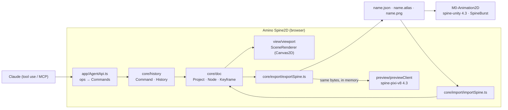

# Amino Spine2D — plan

A clean copy of Animo (the Flash-style DragonBones editor, github.com/justmorenoise/animo) retargeted at
**Spine 4.3**. It exports Spine JSON and atlas files, opens existing Spine files for editing
in the browser, and later lets an AI drive the editor. The preview stays ground truth: it
plays the exported bytes through the official `@esotericsoftware/spine-pixi-v8` 4.3 runtime,
which matches M0-Animation2D's spine-csharp 4.3.40.

## Starting point

Animo is about 33k lines of vanilla TypeScript (Vite, vitest, 710 tests). About 70% of it
does not depend on the output format: the document model, the Flash frame logic, undo,
panels, tools, the library and PSD import. The parts tied to DragonBones are few and clearly
separated. Each one gets a Spine replacement:

| Area | Animo (DragonBones 5.5) | Amino Spine2D (Spine 4.3) |
|---|---|---|
| Contract | `core/export/dbTypes.ts` | `spineTypes.ts`, with the field list read from spine-ts 4.3 `SkeletonJson` (not docs) |
| Transform | Flash `skX skY scX scY` | exact: `rotation = skY`, `shearX = 0`, `shearY = skX − skY`, plus a y-flip (Spine is y-up) |
| Rotation tweens | subdivided over 170° | not needed: Spine 4 interpolates raw degrees |
| Easing | port of DB's curve sampler | port of Spine's bezier sampler (10 segments per key); presets like bounce and elastic are baked into extra keys |
| IK | copy of DB's `IKConstraint` | copy of Spine's `IkConstraint.apply1/apply2` (softness, stretch, compress) |
| Atlas | DB atlas JSON | libgdx `.atlas` text; the MaxRects packer is kept |
| Symbols | child armatures | **flattened**: child bones inlined as `inst/bone`, child timelines baked into each parent animation |
| Masks | `ANIMO_masks` Pixi extension | native **clipping** attachment (polygon traced from alpha); soft edges are lost, with a warning |
| Tint offsets | not possible | exact through two-colour tint: `dark = tint·amt`, `light = 1 − amt + tint·amt` |
| Blend | 9 modes | normal, additive, multiply, screen |
| Motion blur | Pixi extension | dropped in v1 |

## Opening Spine files: meshes decide the scope

11 of the 15 sample rigs in spine-unity's `Samples~` use meshes (spineboy-pro 10, raptor 10,
goblins 21, mix-and-match 219), and celestial-circus also uses physics. Animo has no mesh
support at all, so an importer that skips meshes can open almost no real file. Import therefore
comes in two stages:

1. **Imported meshes are displayed and kept, but not editable.** The stage draws weighted and
   deformed meshes with Spine's own vertex maths (Canvas2D, textured triangles). Bone
   animation, draw order, slots, colour and keys stay fully editable. Meshes, weights, deform
   keys, path, transform, physics and slider constraints, events and extra skins are carried
   through to the export unchanged, keyed by name. If the edits break a name they rely on,
   the export refuses and names the problem.
2. **Mesh editing** (vertices, weights, deform keys) is a later project of its own.

Import reads `.json`, `.atlas` and the page PNGs. It cuts the regions back into library
images, turns `curve` values into per-property easing, and lists everything it could not
represent. The round-trip test is `export(import(x))`, loaded by spine-pixi and compared
bone by bone against `x` over the M0 sample skeletons.

## AI control

The editor's command layer is already the API: every edit is an undoable `Command`. An
`AgentApi` exposes a small JSON operation set: list bones, pose a bone at a frame, set an
ease, create an animation, add a keyframe range, and read back world positions from the
preview. Every operation goes through History, so an AI edit can be undone like a manual
one, and the AI checks its own result against the runtime. Two ways to connect:

- an **in-app prompt panel** that calls the Claude API with these ops as tools (the key is
  held by a small proxy, never in the page);
- an **MCP server** bridging to the open page, so Claude Code or Desktop can drive it.

## Phases

| # | Phase | Done when |
|---|---|---|
| 0 | **Done.** Clean copy, new git repo, DragonBones vendor, exporter and extensions removed, branding renamed | 631 tests green (79 export tests listed below), build clean |
| 1 | Spine 4.3 contract, transform and y-flip mapping | table tests pass |
| 2 | Flat exporter and `.atlas` writer | spine-pixi loads the export |
| 3 | Preview on spine-pixi-v8 (load, seek, tick) | editor and runtime bone world matrices agree at keys and mid-tween |
| 4 | Stage fidelity: bezier sampler and IK solver | ports tested against the vendored spine JS |
| 5 | Flatten nested symbols | a PSD import previews the same as the stage |
| 6 | Clipping, two-colour tint, blend modes, loss warnings | mask rigs match the preview |
| 7 | Import, stage 1 (meshes shown and carried through) | round trip over the M0 samples |
| 8 | Unity check: exports imported in M0 `Assets/AnimoTest/Spine` | spine-unity 4.3 plays them |
| 9 | AgentApi, then the prompt panel and MCP | an AI-made walk cycle can be undone and matches the preview |

## Licences

- **Animo's licence still applies.** Starting from a clean copy does not change this:
  Amino Spine2D is a derivative of Animo, so it stays AGPL-3.0-or-later, and `LICENSE`,
  `LICENSE-EXCEPTION.md` and the notices are kept. Hosting it publicly means publishing
  the source.
- **The Spine runtimes need a Spine Editor licence** for whoever integrates them. That
  includes the vendored spine-pixi preview.

## Tests to rebuild on the Spine exporter

Phase 0 removed 79 tests that read DragonBones output. They are the checklist for phase 2 (and 5 and 6 for symbols and masks): each rule becomes a Spine test, or is dropped here with a reason. Three more (`layers`: SetNodeItem on an empty layer, inserting above a group child; `realProject`: filling an empty layer in place) were kept with only their export assertion removed; phase 2 puts it back.

### `export.test.ts` (whole file)

- [ ] exportSkeleton > emits slots in reverse layer order, so the top layer draws in front
- [ ] exportSkeleton > normalises the pivot against the untrimmed image size
- [ ] exportSkeleton > writes 5.5 with a matching compatible version
- [ ] exportSkeleton > renames colliding bones rather than emitting an ambiguous rig
- [ ] exportSkeleton > reports symbols that contain each other instead of recursing
- [ ] exportSkeleton > gives nested symbols a default action, so they are not left frozen
- [ ] frameSplit > emits offsets from the bind pose, not absolute values
- [ ] frameSplit > puts the SHEAR delta in `skew`, not the raw skewX delta
- [ ] frameSplit > emits scale as a MULTIPLIER of the bind scale
- [ ] frameSplit > omits tweenEasing entirely for a hold, and writes 0 for linear
- [ ] frameSplit > durations accumulate to the animation length and end with a zero frame
- [ ] frameSplit > returns null for a track that never leaves its bind pose
- [ ] frameSplit > subdivides a rotation wider than half a turn
- [ ] frameSplit > exports a counter-clockwise tween as the long way round, subdivided
- [ ] frameSplit > never turns a held wide rotation into a slide
- [ ] frameSplit > carries 'Rotate CW x N' through as extra whole turns
- [ ] colour > emits a colorFrame timeline with multipliers as 0..100 percentages
- [ ] colour > emits a timeline even when every authored colour is neutral
- [ ] colour > emits nothing when no keyframe carries a colour at all
- [ ] colour > tweens colour on the stage the same way the export does
- [ ] colour > holds colour across a span with no tween
- [ ] colour > falls back to the bind colour when the track carries none
- [ ] colour > writes a non-neutral bind colour as slot.color
- [ ] colour > warns that colour offsets are dropped by the Pixi runtime
- [ ] colour > exports a blend mode on an image slot
- [ ] partial spans > keeps a late track's keys on their own frames, holding the bind pose before them
- [ ] partial spans > hides the slot before the first key and after the span ends, as the stage does
- [ ] partial spans > emits no display timeline for a track that covers the whole animation
- [ ] partial spans > agrees with the stage frame by frame on a layer that ends early
- [ ] library names the runtime looks things up by > refuses two images with one name, which would share one SubTexture
- [ ] library names the runtime looks things up by > refuses two exported symbols with one name, which would share one armature
- [ ] library names the runtime looks things up by > says nothing about a clash nothing on the stage uses

### `extensions.test.ts` (whole file)

- [ ] extension manifest > is null for a project that needs nothing beyond the skeleton
- [ ] extension manifest > marks masks REQUIRED and motion blur optional
- [ ] extension manifest > leaves motion blur out when disabled or with a closed shutter
- [ ] extension manifest > writes only multipliers other than 1, by slot name, and skips excluded layers
- [ ] extension manifest > documents the required and optional extensions in the README
- [ ] motion blur in the document > is undoable at both levels, leaving no key behind
- [ ] motion blur in the document > survives a round trip through migration and validation, repaired
- [ ] motion blur maths > affine helpers invert and compose
- [ ] motion blur maths > turns elapsed animation time into the shutter fraction of a frame
- [ ] motion blur maths > gives the same trail at 60 Hz and 120 Hz for the same motion
- [ ] motion blur maths > blurs nothing at the pivot of a pure rotation and most at the tip
- [ ] motion blur maths > re-expresses the field in filter UV space consistently
- [ ] motion blur maths > switches with hysteresis rather than at one cut-off
- [ ] installExtensions > warns about an unknown REQUIRED extension and stays quiet about an optional one
- [ ] installExtensions > re-links a mask when a target swaps its display object
- [ ] installExtensions > ignores something that is not a manifest

### `displays.test.ts`

- [ ] export > writes every used display, each with its own pivot
- [ ] export > leaves out a display no key uses, remapping the ones after it
- [ ] export > exports a symbol reached only through an extra display

### `ik.test.ts`

- [ ] IK in the export > writes ik[] the way the parser reads it
- [ ] IK in the export > leaves out what the parser already defaults

### `layers.test.ts`

- [ ] exclude from export > removes the bone, the slot, the timeline and the image
- [ ] exclude from export > does not export the armature or the art of a symbol only an excluded layer uses
- [ ] exclude from export > still exports a symbol that a kept layer uses too
- [ ] exclude from export > drops an excluded mask, and an excluded target, from the sidecar
- [ ] empty layers > export as nothing at all — no bone, no slot, no timeline
- [ ] empty layers > keeps its bone when a kept node is parented under it
- [ ] exclude from export > takes the whole subtree of an excluded group with it
- [ ] exclude from export > leaves the names of the layers it keeps alone

### `masks.test.ts`

- [ ] mask export > writes mask links as slot names, not as anything in the skeleton
- [ ] mask export > warns and skips a mask layer with no artwork to clip with
- [ ] mask export > carries several targets under one mask

### `nestedSymbols.test.ts`

- [ ] exporting a symbol instance's transform point > puts it on the display, where it moves the slot and not the bone
- [ ] exporting a symbol instance's transform point > writes no display transform when the point is where it started

### `project.test.ts`

- [ ] project round trip > produces a byte-identical export after a round trip

### `realProject.test.ts`

- [ ] the fixture itself > exports without errors, with the mask link the rig carries
- [ ] empty layers and Exclude from Export on the real rig > an empty layer changes nothing about the exported file
- [ ] empty layers and Exclude from Export on the real rig > excluding the mask layer removes its bone, slot and mask link
- [ ] empty layers and Exclude from Export on the real rig > is undoable, byte for byte
- [ ] empty layers and Exclude from Export on the real rig > leaves the other rows of the same symbol named exactly as they were
- [ ] Swap Instance on a real node > swaps an image for a symbol, and the export follows
- [ ] Replace Image on an image used by several rows > re-anchors the exported pivot, exactly as the toast warns

### `stickmanRig.test.ts`

- [ ] stickman rig > exports one clean armature with both animations

### `symbols.test.ts`

- [ ] ConvertToSymbol > exports the instance as a child armature

### `easing.test.ts`

- [ ] per-property eases > a hold holds every channel, whatever the overrides say
- [ ] per-property eases > the override reaches only its own timeline
- [ ] per-property eases > an eased turn past half a revolution is cut at every frame, on the stage's values
