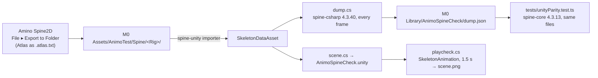

# Unity check (phase 8)

Checks that spine-unity 4.3, in the M0-Animation2D project next to this one, plays what the
editor exports as the preview's runtime does. The C# files are snippets for M0's
`playtest.py eval @file`, which runs them in the open Unity Editor. They are not compiled into
either project.

1. Export each rig with **Atlas as .atlas.txt (Unity)** on (Export Settings ▸ Files) into its
   own folder under M0 `Assets/AnimoTest/Spine/`. Unity imports it: an atlas asset, a
   material, a SkeletonData asset.
2. `python3 .claude/skills/unity-playtest/playtest.py eval "@<this folder>/dump.cs" --budget 120000`
   (from M0) poses every rig with spine-csharp at every frame of every animation, into
   `Library/AnimoSpineCheck/dump.json`.
3. `npx vitest run tests/unityParity.test.ts` (here) poses the same files with spine-core and
   compares every bone's world matrix, the draw order, and each slot's attachment and colour.
   Positions are divided by the asset's import scale (0.01 by default).
4. `scene.cs` builds `Assets/AnimoTest/Spine/AnimoSpineCheck.unity` (every rig looping, a
   camera) in an additive scene, so the open scenes stay as they are; it refuses when the scene
   exists. `playcheck.cs` opens it as a preview scene, plays 1.5 s through each
   SkeletonAnimation, and renders `Library/AnimoSpineCheck/scene.png`. `render.cs` renders each
   rig with a SkeletonRenderer alone.

Traps met on the way:

- **spine-csharp needs `skeleton.hash`.** Its `SkeletonJson` reads it without a default and
  throws; spine-core does not care. The exporter always writes one (`contentHash`).
- **`AUTO_UPGRADE_TO_43_COMPONENTS`.** In the Editor, a SkeletonAnimation added from code
  (spine-unity's own `NewSkeletonAnimationGameObject` included) is taken for a pre-4.3
  component in its Awake. It copies its empty deprecated fields over the SkeletonRenderer's
  asset, skin and mesh settings, then throws. Add both components, then set the renderer's
  fields; the component marks itself migrated, so they stick.
- **A camera in an ordinary scene renders every loaded scene.** A check that opens its scene
  additively also draws whatever is open in the Editor. Open it with
  `EditorSceneManager.OpenPreviewScene` instead.
- **spine-unity reads at the asset's import scale.** Bone positions come out in Unity units
  (× 0.01 by default); matrices are unaffected.
