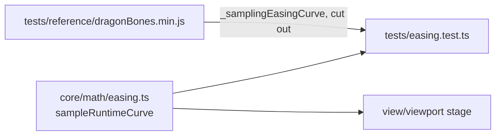

# Test-only reference sources

`dragonBones.min.js` (MIT, `LICENSE-dragonbones.txt`) is not served or bundled.
`tests/easing.test.ts` cuts the runtime's curve sampler out of it and checks
`core/math/easing.ts` against it, because the stage still samples eases the way
DragonBones does. Phase 4 of `docs/PLAN.md` ports Spine's sampler, tests it
against spine-ts the same way, and deletes this file.

